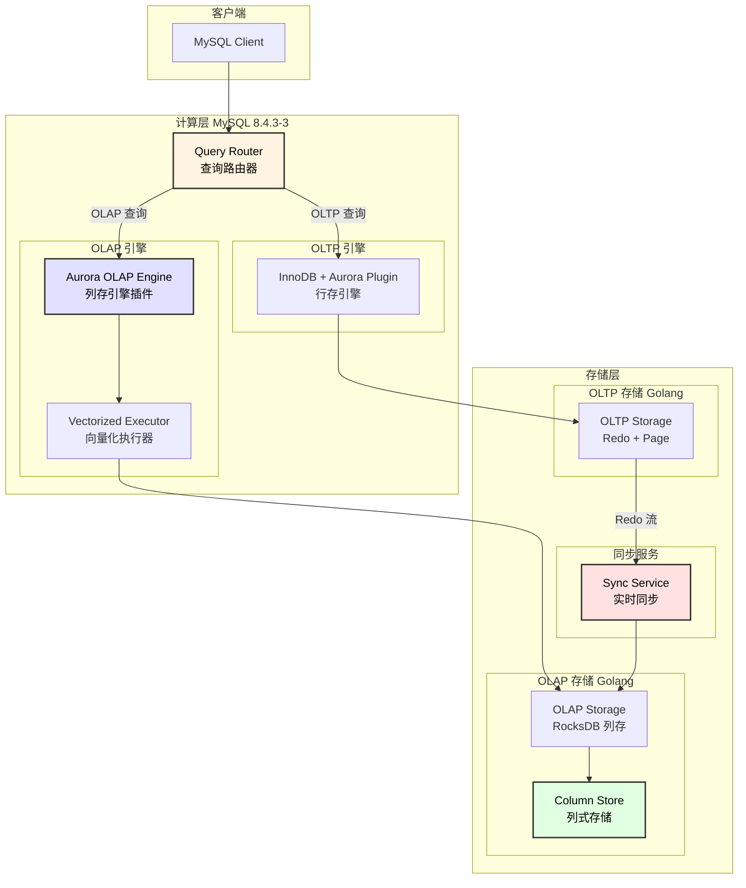
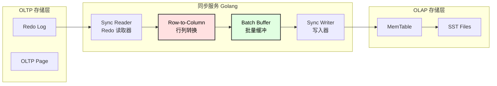
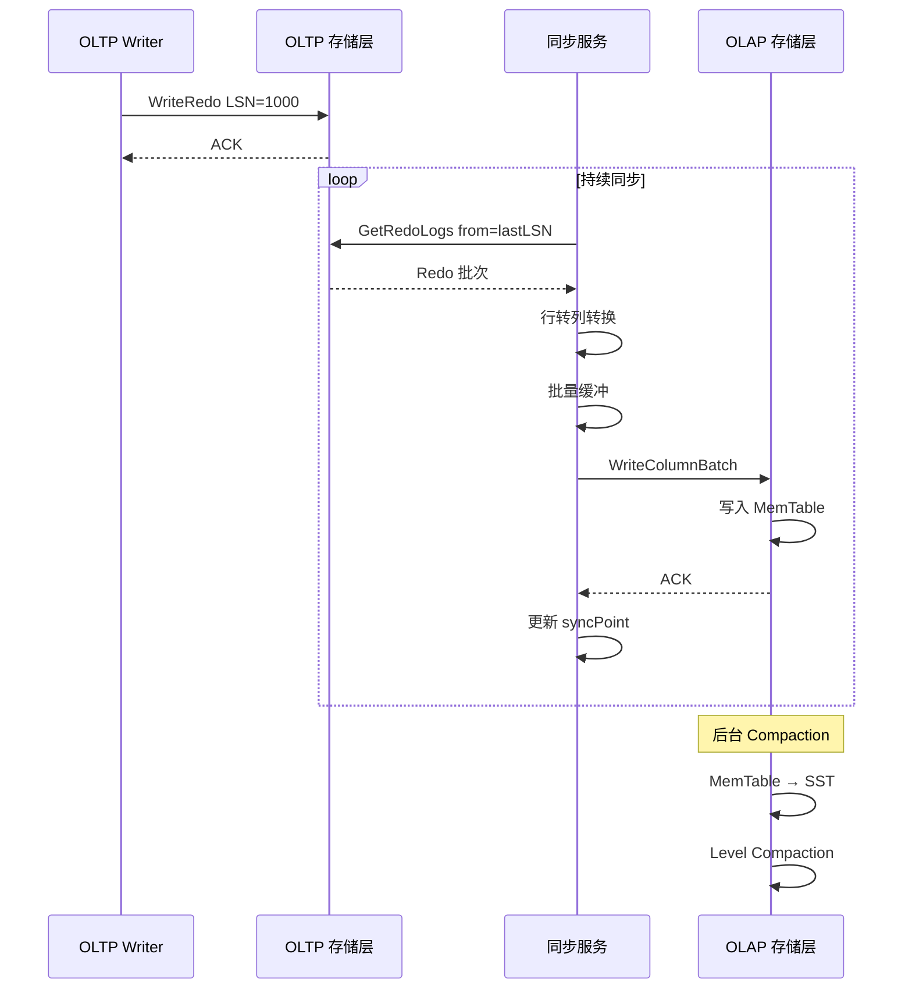
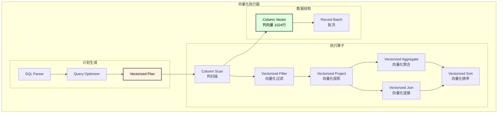

# OLAP 扩展设计文档

## 1. 概述

本设计为 Aurora 系统增加 OLAP（在线分析处理）能力，实现 HTAP（混合事务/分析处理）架构。

### 1.1 设计目标

| 目标 | 说明 |
|------|------|
| **HTAP 能力** | 同时支持 OLTP 和 OLAP 工作负载 |
| **实时分析** | OLTP 数据实时同步到 OLAP，延迟 < 1 秒 |
| **最小改动** | MySQL 计算层使用插件机制，最小化源码改动 |
| **高性能分析** | 列式存储 + 向量化执行，分析查询性能提升 10-100 倍 |
| **资源隔离** | OLTP 和 OLAP 工作负载资源隔离 |

### 1.2 OLTP vs OLAP 对比

| 特性 | OLTP | OLAP |
|------|------|------|
| **查询类型** | 点查、小范围查询 | 全表扫描、聚合 |
| **数据格式** | 行存（InnoDB B+Tree） | 列存（LSM Tree） |
| **事务** | 强 ACID | 最终一致 |
| **延迟** | 毫秒级 | 秒级 |
| **并发** | 高并发短事务 | 低并发复杂查询 |
| **典型查询** | `SELECT * WHERE id=?` | `SELECT SUM(x) GROUP BY y` |

### 1.3 整体架构



---

## 2. OLAP 存储引擎设计

### 2.1 LSM Tree + 列存架构

```
┌─────────────────────────────────────────────────────────────────────────────────┐
│                      OLAP 存储引擎架构 (基于 RocksDB)                            │
├─────────────────────────────────────────────────────────────────────────────────┤
│                                                                                  │
│  写入路径:                                                                       │
│  ┌──────────────────────────────────────────────────────────────────────────┐   │
│  │ Redo 数据 → 列转换 → MemTable (内存) → Immutable MemTable → SST 文件     │   │
│  └──────────────────────────────────────────────────────────────────────────┘   │
│                                                                                  │
│  存储结构:                                                                       │
│  ┌──────────────────────────────────────────────────────────────────────────┐   │
│  │  Level 0:  ┌─────┐ ┌─────┐ ┌─────┐ ┌─────┐  (未排序，直接刷盘)           │   │
│  │            │ SST │ │ SST │ │ SST │ │ SST │                               │   │
│  │            └─────┘ └─────┘ └─────┘ └─────┘                               │   │
│  │                      ↓ Compaction                                        │   │
│  │  Level 1:  ┌───────────────────────────────┐  (有序，不重叠)             │   │
│  │            │           SST Files           │                             │   │
│  │            └───────────────────────────────┘                             │   │
│  │                      ↓ Compaction                                        │   │
│  │  Level 2:  ┌───────────────────────────────────────────┐                 │   │
│  │            │              SST Files (10x)              │                 │   │
│  │            └───────────────────────────────────────────┘                 │   │
│  │                      ↓ ...                                               │   │
│  │  Level N:  ┌───────────────────────────────────────────────────────────┐ │   │
│  │            │                    SST Files (10^N x)                     │ │   │
│  │            └───────────────────────────────────────────────────────────┘ │   │
│  └──────────────────────────────────────────────────────────────────────────┘   │
│                                                                                  │
│  SST 文件内部 (列式存储):                                                        │
│  ┌──────────────────────────────────────────────────────────────────────────┐   │
│  │  ┌────────────────┬────────────────┬────────────────┬──────────────────┐ │   │
│  │  │ Column Block 0 │ Column Block 1 │ Column Block 2 │ ... │ Footer     │ │   │
│  │  │   (col_a)      │   (col_b)      │   (col_c)      │     │            │ │   │
│  │  └────────────────┴────────────────┴────────────────┴──────────────────┘ │   │
│  │                                                                          │   │
│  │  每个 Column Block:                                                       │   │
│  │  ┌──────────────────────────────────────────────────────────────────┐    │   │
│  │  │ Header │ Encoding │ Compressed Data │ Null Bitmap │ Checksum    │    │   │
│  │  └──────────────────────────────────────────────────────────────────┘    │   │
│  └──────────────────────────────────────────────────────────────────────────┘   │
│                                                                                  │
└─────────────────────────────────────────────────────────────────────────────────┘
```

### 2.2 列式存储格式

```go
// column_format.go

// 列块头部
type ColumnBlockHeader struct {
    Magic          uint32    // 0x434F4C42 "COLB"
    Version        uint16
    ColumnID       uint32
    ColumnType     DataType
    Encoding       EncodingType
    Compression    CompressionType
    NumRows        uint32
    NullCount      uint32
    MinValue       []byte
    MaxValue       []byte
    DataOffset     uint64
    DataLength     uint64
    NullBitmapOffset uint64
    NullBitmapLength uint64
    Checksum       uint32
}

type DataType uint8
const (
    TYPE_INT8 DataType = iota
    TYPE_INT16
    TYPE_INT32
    TYPE_INT64
    TYPE_FLOAT32
    TYPE_FLOAT64
    TYPE_STRING
    TYPE_BINARY
    TYPE_TIMESTAMP
    TYPE_DECIMAL
)

type EncodingType uint8
const (
    ENCODING_PLAIN EncodingType = iota
    ENCODING_RLE           // Run-Length Encoding
    ENCODING_DICTIONARY    // 字典编码
    ENCODING_DELTA         // 差分编码
    ENCODING_BITPACKING    // 位压缩
)

type CompressionType uint8
const (
    COMPRESSION_NONE CompressionType = iota
    COMPRESSION_LZ4
    COMPRESSION_ZSTD
    COMPRESSION_SNAPPY
)

// 列存储表
type ColumnTable struct {
    TableID     uint64
    TableName   string
    Columns     []*ColumnMeta
    PrimaryKey  []uint32      // 主键列索引
    SortKey     []uint32      // 排序键列索引
    PartitionBy *PartitionSpec
}

type ColumnMeta struct {
    ColumnID    uint32
    ColumnName  string
    DataType    DataType
    Nullable    bool
    DefaultExpr string
    Encoding    EncodingType
    Compression CompressionType
}
```

### 2.3 RocksDB 集成

```go
// rocksdb_engine.go

type RocksDBOLAPEngine struct {
    db              *gorocksdb.DB
    columnFamilies  map[string]*gorocksdb.ColumnFamilyHandle
    writeOptions    *gorocksdb.WriteOptions
    readOptions     *gorocksdb.ReadOptions
    
    // 表元数据
    tables          map[uint64]*ColumnTable
    
    // 后台任务
    compactionMgr   *CompactionManager
    gcMgr           *GCManager
}

func NewRocksDBOLAPEngine(config *OLAPConfig) (*RocksDBOLAPEngine, error) {
    opts := gorocksdb.NewDefaultOptions()
    
    // LSM 优化配置
    opts.SetCreateIfMissing(true)
    opts.SetMaxOpenFiles(10000)
    opts.SetMaxBackgroundCompactions(4)
    opts.SetMaxBackgroundFlushes(2)
    
    // 写入优化
    opts.SetWriteBufferSize(256 * 1024 * 1024)  // 256MB
    opts.SetMaxWriteBufferNumber(4)
    opts.SetMinWriteBufferNumberToMerge(2)
    
    // 压缩配置
    opts.SetCompression(gorocksdb.ZSTDCompression)
    opts.SetBottommostCompression(gorocksdb.ZSTDCompression)
    
    // Level 配置
    opts.SetNumLevels(7)
    opts.SetLevel0FileNumCompactionTrigger(4)
    opts.SetLevel0SlowdownWritesTrigger(20)
    opts.SetLevel0StopWritesTrigger(36)
    opts.SetMaxBytesForLevelBase(512 * 1024 * 1024)  // 512MB
    opts.SetMaxBytesForLevelMultiplier(10)
    
    // Block 配置
    blockOpts := gorocksdb.NewDefaultBlockBasedTableOptions()
    blockOpts.SetBlockSize(64 * 1024)  // 64KB，适合列存
    blockOpts.SetBlockCache(gorocksdb.NewLRUCache(4 * 1024 * 1024 * 1024))  // 4GB
    blockOpts.SetFilterPolicy(gorocksdb.NewBloomFilter(10))
    opts.SetBlockBasedTableFactory(blockOpts)
    
    db, err := gorocksdb.OpenDb(opts, config.DataPath)
    if err != nil {
        return nil, err
    }
    
    engine := &RocksDBOLAPEngine{
        db:             db,
        columnFamilies: make(map[string]*gorocksdb.ColumnFamilyHandle),
        writeOptions:   gorocksdb.NewDefaultWriteOptions(),
        readOptions:    gorocksdb.NewDefaultReadOptions(),
        tables:         make(map[uint64]*ColumnTable),
    }
    
    return engine, nil
}

// 写入列数据
func (e *RocksDBOLAPEngine) WriteColumnBatch(
    tableID uint64,
    batch *ColumnBatch,
) error {
    table := e.tables[tableID]
    wb := gorocksdb.NewWriteBatch()
    defer wb.Destroy()
    
    // 按列写入
    for colIdx, col := range batch.Columns {
        colMeta := table.Columns[colIdx]
        cf := e.getColumnFamily(tableID, colMeta.ColumnID)
        
        // 编码列数据
        encodedData := e.encodeColumn(col, colMeta)
        
        // 构造 Key: tableID + sortKey + rowID
        for i := 0; i < batch.RowCount; i++ {
            key := e.buildKey(tableID, batch.SortKeys[i], batch.RowIDs[i])
            value := encodedData[i]
            wb.PutCF(cf, key, value)
        }
    }
    
    return e.db.Write(e.writeOptions, wb)
}

// 扫描列数据
func (e *RocksDBOLAPEngine) ScanColumns(
    tableID uint64,
    columnIDs []uint32,
    startKey, endKey []byte,
    limit int,
) (*ColumnBatch, error) {
    table := e.tables[tableID]
    result := NewColumnBatch(len(columnIDs))
    
    // 并行扫描每列
    var wg sync.WaitGroup
    for i, colID := range columnIDs {
        wg.Add(1)
        go func(idx int, cid uint32) {
            defer wg.Done()
            
            cf := e.getColumnFamily(tableID, cid)
            iter := e.db.NewIteratorCF(e.readOptions, cf)
            defer iter.Close()
            
            var values [][]byte
            iter.Seek(startKey)
            for iter.Valid() && bytes.Compare(iter.Key().Data(), endKey) < 0 {
                values = append(values, copyBytes(iter.Value().Data()))
                iter.Next()
                if limit > 0 && len(values) >= limit {
                    break
                }
            }
            
            result.Columns[idx] = e.decodeColumn(values, table.Columns[idx])
        }(i, colID)
    }
    
    wg.Wait()
    return result, nil
}
```

---

## 3. 数据同步设计

### 3.1 同步架构



### 3.2 同步服务实现

```go
// sync_service.go

type OLAPSyncService struct {
    // 源端
    redoReader    *RedoReader
    schemaCache   *SchemaCache
    
    // 转换
    rowToColumn   *RowToColumnConverter
    batchBuffer   *BatchBuffer
    
    // 目标端
    olapEngine    *RocksDBOLAPEngine
    
    // 状态
    syncPoint     uint64  // 已同步的 LSN
    lag           int64   // 同步延迟（毫秒）
    
    // 配置
    config        *SyncConfig
}

type SyncConfig struct {
    BatchSize       int           // 批次大小
    FlushInterval   time.Duration // 刷新间隔
    MaxLagMs        int64         // 最大延迟告警阈值
    ParallelTables  int           // 并行表数
}

func (s *OLAPSyncService) Start(ctx context.Context) error {
    // 从上次同步点开始
    s.syncPoint = s.loadSyncPoint()
    
    for {
        select {
        case <-ctx.Done():
            return nil
        default:
            // 读取 Redo 批次
            redoBatch, err := s.redoReader.ReadBatch(s.syncPoint, s.config.BatchSize)
            if err != nil {
                return err
            }
            
            if len(redoBatch) == 0 {
                time.Sleep(time.Millisecond * 10)
                continue
            }
            
            // 处理 Redo 批次
            if err := s.processBatch(redoBatch); err != nil {
                return err
            }
            
            // 更新同步点
            s.syncPoint = redoBatch[len(redoBatch)-1].LSN
            s.saveSyncPoint(s.syncPoint)
            
            // 更新延迟指标
            s.updateLag(redoBatch[len(redoBatch)-1].Timestamp)
        }
    }
}

func (s *OLAPSyncService) processBatch(redoBatch []*RedoRecord) error {
    // 按表分组
    tableRecords := s.groupByTable(redoBatch)
    
    // 并行处理每个表
    var wg sync.WaitGroup
    errChan := make(chan error, len(tableRecords))
    
    sem := make(chan struct{}, s.config.ParallelTables)
    
    for tableID, records := range tableRecords {
        wg.Add(1)
        sem <- struct{}{}
        
        go func(tid uint64, recs []*RedoRecord) {
            defer wg.Done()
            defer func() { <-sem }()
            
            // 获取表 Schema
            schema := s.schemaCache.Get(tid)
            if schema == nil {
                return  // 非 OLAP 表，跳过
            }
            
            // 行转列
            columnBatch := s.rowToColumn.Convert(recs, schema)
            
            // 写入 OLAP 存储
            if err := s.olapEngine.WriteColumnBatch(tid, columnBatch); err != nil {
                errChan <- err
            }
        }(tableID, records)
    }
    
    wg.Wait()
    close(errChan)
    
    for err := range errChan {
        if err != nil {
            return err
        }
    }
    
    return nil
}

// 行转列转换器
type RowToColumnConverter struct {
    bufferPool *sync.Pool
}

func (c *RowToColumnConverter) Convert(
    records []*RedoRecord,
    schema *ColumnTable,
) *ColumnBatch {
    batch := NewColumnBatch(len(schema.Columns))
    batch.RowCount = len(records)
    
    // 初始化列缓冲
    for i := range schema.Columns {
        batch.Columns[i] = make([]interface{}, len(records))
    }
    
    // 解析每条记录
    for rowIdx, record := range records {
        row := c.parseRedoToRow(record, schema)
        
        for colIdx, value := range row {
            batch.Columns[colIdx][rowIdx] = value
        }
        
        // 提取排序键
        batch.SortKeys[rowIdx] = c.extractSortKey(row, schema)
        batch.RowIDs[rowIdx] = record.LSN  // 使用 LSN 作为行 ID
    }
    
    return batch
}
```

### 3.3 同步时序图



---

## 4. MySQL OLAP 引擎插件

### 4.1 最小化改动策略

```
┌─────────────────────────────────────────────────────────────────────────────────┐
│                      MySQL OLAP 插件架构（最小改动）                             │
├─────────────────────────────────────────────────────────────────────────────────┤
│                                                                                  │
│  改动方式:                                                                       │
│  ┌────────────────────────────────────────────────────────────────────────────┐ │
│  │  1. 存储引擎插件 (标准 MySQL 接口，无需改动 MySQL 源码)                     │ │
│  │     - 实现 handlerton 接口                                                  │ │
│  │     - 通过 INSTALL PLUGIN 加载                                              │ │
│  │                                                                             │ │
│  │  2. 查询路由 Hook (约 20 行改动)                                            │ │
│  │     - 在查询解析后判断是否路由到 OLAP                                       │ │
│  │     - 使用 Hint 或自动识别                                                  │ │
│  │                                                                             │ │
│  │  3. 向量化执行器 (独立模块，无需改动 MySQL)                                  │ │
│  │     - 在 OLAP 引擎内部实现                                                  │ │
│  │     - 绕过 MySQL 逐行执行器                                                  │ │
│  └────────────────────────────────────────────────────────────────────────────┘ │
│                                                                                  │
│  源码改动清单:                                                                   │
│  ┌──────────────────────────────────────────────────────────────────────────┐   │
│  │  文件                          改动行数    说明                          │   │
│  │  sql/sql_parse.cc              ~10        添加 OLAP 路由判断             │   │
│  │  sql/sql_optimizer.cc          ~10        添加 OLAP 优化提示             │   │
│  │  sql/sys_vars.cc               ~30        添加 OLAP 相关变量             │   │
│  │  CMakeLists.txt                ~10        添加 OLAP 插件编译             │   │
│  │  ──────────────────────────────────────────────────────────────────────  │   │
│  │  总计                          ~60 行                                     │   │
│  └──────────────────────────────────────────────────────────────────────────┘   │
│                                                                                  │
└─────────────────────────────────────────────────────────────────────────────────┘
```

### 4.2 存储引擎插件实现

```cpp
// plugin/aurora_olap/aurora_olap_engine.cc

#include "sql/handler.h"
#include "sql/table.h"

// OLAP 存储引擎处理器
class ha_aurora_olap : public handler {
public:
    ha_aurora_olap(handlerton *hton, TABLE_SHARE *table_arg)
        : handler(hton, table_arg) {}
    
    // 表操作
    int create(const char *name, TABLE *form,
               HA_CREATE_INFO *create_info,
               dd::Table *table_def) override;
    
    int open(const char *name, int mode, uint test_if_locked,
             const dd::Table *table_def) override;
    
    int close() override;
    
    // 扫描操作
    int rnd_init(bool scan) override;
    int rnd_next(uchar *buf) override;
    int rnd_end() override;
    
    // 索引操作（OLAP 主要用于扫描，索引支持有限）
    int index_init(uint idx, bool sorted) override;
    int index_read_map(uchar *buf, const uchar *key,
                       key_part_map keypart_map,
                       enum ha_rkey_function find_flag) override;
    
    // 写入操作
    int write_row(uchar *buf) override;
    int update_row(const uchar *old_data, uchar *new_data) override;
    int delete_row(const uchar *buf) override;
    
    // 批量扫描（OLAP 核心优化）
    int multi_range_read_init(RANGE_SEQ_IF *seq, void *seq_init_param,
                              uint n_ranges, uint mode,
                              HANDLER_BUFFER *buf) override;
    int multi_range_read_next(char **range_info) override;
    
    // 表属性
    const char *table_type() const override { return "AURORA_OLAP"; }
    ulonglong table_flags() const override;
    ulong index_flags(uint idx, uint part, bool all_parts) const override;
    
    // 估算
    ha_rows estimate_rows_upper_bound() override;
    double scan_time() override;
    double read_time(uint index, uint ranges, ha_rows rows) override;
    
private:
    // gRPC 客户端
    std::unique_ptr<OLAPStorageClient> client_;
    
    // 扫描状态
    std::unique_ptr<ColumnScanIterator> scan_iter_;
    
    // 向量化执行
    std::unique_ptr<VectorizedExecutor> vec_executor_;
};

// 表创建
int ha_aurora_olap::create(const char *name, TABLE *form,
                           HA_CREATE_INFO *create_info,
                           dd::Table *table_def) {
    // 构造列元数据
    std::vector<ColumnMeta> columns;
    for (uint i = 0; i < form->s->fields; i++) {
        Field *field = form->field[i];
        columns.push_back({
            .column_id = i,
            .column_name = field->field_name,
            .data_type = mysql_to_olap_type(field->type()),
            .nullable = field->is_nullable(),
        });
    }
    
    // 发送到 OLAP 存储层
    return client_->CreateTable(name, columns);
}

// 批量扫描（向量化）
int ha_aurora_olap::rnd_init(bool scan) {
    if (!scan) return 0;
    
    // 获取需要的列
    std::vector<uint32_t> column_ids;
    for (uint i = 0; i < table->s->fields; i++) {
        if (bitmap_is_set(table->read_set, i)) {
            column_ids.push_back(i);
        }
    }
    
    // 初始化向量化扫描
    scan_iter_ = client_->ScanColumns(table_name_, column_ids);
    vec_executor_ = std::make_unique<VectorizedExecutor>();
    
    return 0;
}

int ha_aurora_olap::rnd_next(uchar *buf) {
    // 向量化批量读取
    if (!current_batch_ || batch_pos_ >= current_batch_->row_count) {
        current_batch_ = scan_iter_->NextBatch(BATCH_SIZE);
        batch_pos_ = 0;
        
        if (!current_batch_ || current_batch_->row_count == 0) {
            return HA_ERR_END_OF_FILE;
        }
    }
    
    // 从列批次中提取一行
    extract_row_from_batch(buf, current_batch_, batch_pos_);
    batch_pos_++;
    
    return 0;
}
```

### 4.3 查询路由器

```cpp
// sql/aurora_query_router.h

class AuroraQueryRouter {
public:
    enum class Target {
        OLTP,
        OLAP,
        AUTO
    };
    
    // 判断查询目标
    static Target RouteQuery(THD *thd, LEX *lex) {
        // 1. 检查 Hint
        if (lex->has_hint("USE_OLAP")) {
            return Target::OLAP;
        }
        if (lex->has_hint("USE_OLTP")) {
            return Target::OLTP;
        }
        
        // 2. 检查会话变量
        if (thd->variables.aurora_query_mode == OLAP_MODE) {
            return Target::OLAP;
        }
        
        // 3. 自动判断
        if (IsAnalyticalQuery(lex)) {
            return Target::OLAP;
        }
        
        return Target::OLTP;
    }
    
    // 判断是否为分析型查询
    static bool IsAnalyticalQuery(LEX *lex) {
        // 有聚合函数
        if (lex->select_lex->has_agg_funcs()) {
            return true;
        }
        
        // 有 GROUP BY
        if (lex->select_lex->group_list.elements > 0) {
            return true;
        }
        
        // 全表扫描
        if (IsFullTableScan(lex)) {
            return true;
        }
        
        // 预估行数大
        if (EstimatedRows(lex) > 10000) {
            return true;
        }
        
        return false;
    }
};
```

### 4.4 配置和使用

```sql
-- 安装 OLAP 插件
INSTALL PLUGIN aurora_olap SONAME 'aurora_olap.so';

-- 创建 OLAP 表（显式指定引擎）
CREATE TABLE analytics_orders (
    order_id BIGINT,
    user_id BIGINT,
    product_id BIGINT,
    amount DECIMAL(10,2),
    order_date DATE,
    region VARCHAR(50)
) ENGINE=AURORA_OLAP;

-- 或者：为现有 OLTP 表创建 OLAP 副本
ALTER TABLE orders ADD OLAP REPLICA;

-- 查询路由

-- 方式1：使用 Hint
SELECT /*+ USE_OLAP */ 
    region, SUM(amount) as total
FROM orders
GROUP BY region;

-- 方式2：设置会话变量
SET aurora_query_mode = 'OLAP';
SELECT region, SUM(amount) as total
FROM orders
GROUP BY region;

-- 方式3：自动路由（分析型查询自动使用 OLAP）
SET aurora_auto_olap = ON;
SELECT region, DATE(order_date) as day, COUNT(*) as cnt
FROM orders
WHERE order_date >= '2025-01-01'
GROUP BY region, DATE(order_date)
ORDER BY day;
```

---

## 5. 向量化执行器

### 5.1 向量化执行架构



### 5.2 列向量实现

```cpp
// vectorized/column_vector.h

template <typename T>
class ColumnVector {
public:
    static constexpr size_t BATCH_SIZE = 1024;
    
    ColumnVector() : size_(0), null_count_(0) {
        data_.resize(BATCH_SIZE);
        null_bitmap_.resize(BATCH_SIZE, false);
    }
    
    // 批量操作
    void Append(const T* values, size_t count) {
        std::copy(values, values + count, data_.begin() + size_);
        size_ += count;
    }
    
    void AppendNull(size_t count) {
        for (size_t i = 0; i < count; i++) {
            null_bitmap_[size_ + i] = true;
        }
        size_ += count;
        null_count_ += count;
    }
    
    // SIMD 优化的过滤
    void Filter(const std::vector<bool>& selection, ColumnVector<T>* output) const {
        size_t out_idx = 0;
        
        #ifdef __AVX2__
        // 使用 AVX2 加速
        for (size_t i = 0; i < size_; i += 8) {
            __m256i mask = _mm256_loadu_si256(
                reinterpret_cast<const __m256i*>(&selection[i]));
            
            // ... SIMD 过滤实现
        }
        #else
        // 标量回退
        for (size_t i = 0; i < size_; i++) {
            if (selection[i]) {
                output->data_[out_idx++] = data_[i];
            }
        }
        #endif
        
        output->size_ = out_idx;
    }
    
    // SIMD 优化的聚合
    T Sum() const {
        T result = 0;
        
        #ifdef __AVX2__
        // 使用 AVX2 加速求和
        if constexpr (std::is_same_v<T, int64_t>) {
            __m256i sum = _mm256_setzero_si256();
            for (size_t i = 0; i < size_; i += 4) {
                __m256i vals = _mm256_loadu_si256(
                    reinterpret_cast<const __m256i*>(&data_[i]));
                sum = _mm256_add_epi64(sum, vals);
            }
            // 水平求和
            int64_t temp[4];
            _mm256_storeu_si256(reinterpret_cast<__m256i*>(temp), sum);
            result = temp[0] + temp[1] + temp[2] + temp[3];
        }
        #else
        for (size_t i = 0; i < size_; i++) {
            if (!null_bitmap_[i]) {
                result += data_[i];
            }
        }
        #endif
        
        return result;
    }
    
    // 访问
    const T& operator[](size_t idx) const { return data_[idx]; }
    T& operator[](size_t idx) { return data_[idx]; }
    size_t Size() const { return size_; }
    bool IsNull(size_t idx) const { return null_bitmap_[idx]; }
    
private:
    std::vector<T> data_;
    std::vector<bool> null_bitmap_;
    size_t size_;
    size_t null_count_;
};

// 记录批次
class RecordBatch {
public:
    RecordBatch(size_t num_columns)
        : columns_(num_columns), row_count_(0) {}
    
    void AddColumn(std::unique_ptr<ColumnVectorBase> column) {
        columns_.push_back(std::move(column));
    }
    
    template <typename T>
    ColumnVector<T>* GetColumn(size_t idx) {
        return static_cast<ColumnVector<T>*>(columns_[idx].get());
    }
    
    size_t RowCount() const { return row_count_; }
    size_t ColumnCount() const { return columns_.size(); }
    
private:
    std::vector<std::unique_ptr<ColumnVectorBase>> columns_;
    size_t row_count_;
};
```

### 5.3 向量化算子

```cpp
// vectorized/operators.h

// 向量化过滤算子
class VectorizedFilter : public VectorizedOperator {
public:
    VectorizedFilter(VectorizedOperator* child, 
                     std::unique_ptr<Expression> predicate)
        : child_(child), predicate_(std::move(predicate)) {}
    
    RecordBatch* Next() override {
        while (true) {
            RecordBatch* batch = child_->Next();
            if (!batch) return nullptr;
            
            // 计算过滤条件
            std::vector<bool> selection(batch->RowCount());
            predicate_->Evaluate(batch, &selection);
            
            // 应用过滤
            auto filtered = std::make_unique<RecordBatch>(batch->ColumnCount());
            for (size_t i = 0; i < batch->ColumnCount(); i++) {
                auto filtered_col = batch->GetColumn(i)->Filter(selection);
                filtered->AddColumn(std::move(filtered_col));
            }
            
            if (filtered->RowCount() > 0) {
                return filtered.release();
            }
        }
    }
    
private:
    VectorizedOperator* child_;
    std::unique_ptr<Expression> predicate_;
};

// 向量化聚合算子
class VectorizedAggregate : public VectorizedOperator {
public:
    VectorizedAggregate(VectorizedOperator* child,
                        std::vector<uint32_t> group_by_cols,
                        std::vector<AggFunc> agg_funcs)
        : child_(child), 
          group_by_cols_(std::move(group_by_cols)),
          agg_funcs_(std::move(agg_funcs)) {}
    
    RecordBatch* Next() override {
        if (done_) return nullptr;
        
        // 消费所有输入
        std::unordered_map<GroupKey, AggState> hash_table;
        
        while (auto batch = child_->Next()) {
            // 计算 Group Key
            for (size_t row = 0; row < batch->RowCount(); row++) {
                GroupKey key = ComputeGroupKey(batch, row);
                
                // 更新聚合状态
                auto& state = hash_table[key];
                for (size_t i = 0; i < agg_funcs_.size(); i++) {
                    agg_funcs_[i].Update(&state.values[i], batch, row);
                }
            }
        }
        
        // 输出结果
        auto result = std::make_unique<RecordBatch>(
            group_by_cols_.size() + agg_funcs_.size());
        
        for (auto& [key, state] : hash_table) {
            // 添加 Group Key 列
            for (size_t i = 0; i < group_by_cols_.size(); i++) {
                result->GetColumn(i)->Append(key.values[i]);
            }
            // 添加聚合结果列
            for (size_t i = 0; i < agg_funcs_.size(); i++) {
                auto value = agg_funcs_[i].Finalize(state.values[i]);
                result->GetColumn(group_by_cols_.size() + i)->Append(value);
            }
        }
        
        done_ = true;
        return result.release();
    }
    
private:
    VectorizedOperator* child_;
    std::vector<uint32_t> group_by_cols_;
    std::vector<AggFunc> agg_funcs_;
    bool done_ = false;
};
```

---

## 6. OLAP 表管理

### 6.1 表同步策略

| 策略 | 说明 | 适用场景 |
|------|------|----------|
| **实时同步** | Redo 实时转换并写入 | 延迟敏感 |
| **延迟同步** | 批量定期同步 | 资源敏感 |
| **按需同步** | 查询时触发同步 | 冷数据 |

### 6.2 表管理命令

```sql
-- 为 OLTP 表创建 OLAP 副本
ALTER TABLE orders ADD OLAP REPLICA
    SYNC_MODE = REALTIME
    PARTITION BY RANGE(order_date) (
        PARTITION p2025 VALUES LESS THAN ('2026-01-01')
    );

-- 查看 OLAP 表状态
SHOW AURORA OLAP TABLES;
+-------------+------------+-------------+-----------+------------+
| table_name  | sync_mode  | sync_lag_ms | row_count | size_bytes |
+-------------+------------+-------------+-----------+------------+
| orders      | REALTIME   | 150         | 10000000  | 2147483648 |
| users       | DELAYED    | 5000        | 1000000   | 134217728  |
+-------------+------------+-------------+-----------+------------+

-- 查看同步状态
SHOW AURORA OLAP SYNC STATUS;
+-------------+------------------+------------------+-----------+
| table_name  | oltp_lsn         | olap_lsn         | lag_lsn   |
+-------------+------------------+------------------+-----------+
| orders      | 1234567890       | 1234567800       | 90        |
+-------------+------------------+------------------+-----------+

-- 手动触发同步
AURORA OLAP SYNC TABLE orders;

-- 重建 OLAP 表
AURORA OLAP REBUILD TABLE orders;

-- 删除 OLAP 副本
ALTER TABLE orders DROP OLAP REPLICA;
```

---

## 7. 配置与部署

### 7.1 配置文件

```yaml
# olap_config.yaml

olap:
  enabled: true
  
  # 存储配置
  storage:
    type: rocksdb
    data_path: /data/olap
    
    rocksdb:
      write_buffer_size_mb: 256
      max_write_buffer_number: 4
      max_background_compactions: 4
      block_cache_size_mb: 4096
      compression: zstd
  
  # 同步配置
  sync:
    mode: realtime         # realtime, delayed, on_demand
    batch_size: 10000
    flush_interval_ms: 100
    parallel_tables: 8
    max_lag_warning_ms: 1000
  
  # 向量化执行配置
  vectorized:
    batch_size: 1024
    use_simd: true
    parallel_scan_threads: 8
  
  # 内存配置
  memory:
    query_memory_limit_mb: 8192
    spill_to_disk: true
    spill_path: /data/olap/spill
```

### 7.2 MySQL 配置

```ini
# my.cnf

[mysqld]
# OLAP 插件
plugin_load_add = aurora_olap.so

# OLAP 相关变量
aurora_olap_enabled = ON
aurora_olap_storage_path = /data/olap
aurora_olap_sync_mode = realtime
aurora_auto_olap = ON
aurora_olap_batch_size = 1024
aurora_olap_memory_limit = 8G
```

---

## 8. 监控指标

| 指标 | 类型 | 说明 |
|------|------|------|
| `olap_tables_count` | Gauge | OLAP 表数量 |
| `olap_sync_lag_ms` | Gauge | 同步延迟（毫秒） |
| `olap_sync_rows_total` | Counter | 同步行数 |
| `olap_query_count` | Counter | OLAP 查询数 |
| `olap_query_latency_ms` | Histogram | OLAP 查询延迟 |
| `olap_scan_rows_total` | Counter | 扫描行数 |
| `olap_rocksdb_compaction_total` | Counter | Compaction 次数 |
| `olap_rocksdb_memtable_size` | Gauge | MemTable 大小 |
| `olap_rocksdb_sst_files` | Gauge | SST 文件数 |

---

## 9. 性能对比

### 9.1 典型查询性能

| 查询类型 | OLTP (InnoDB) | OLAP (列存) | 提升倍数 |
|----------|---------------|-------------|----------|
| 点查 `WHERE id=?` | 0.5 ms | 5 ms | OLTP 更快 |
| 全表扫描 1M 行 | 30 s | 0.5 s | **60x** |
| 聚合 `SUM(x) GROUP BY y` | 45 s | 0.8 s | **56x** |
| 多列投影 | 25 s | 0.3 s | **83x** |
| 范围扫描 100K 行 | 5 s | 0.1 s | **50x** |

### 9.2 性能对比图

```
┌─────────────────────────────────────────────────────────────────────────────────┐
│                      OLTP vs OLAP 查询延迟对比                                   │
├─────────────────────────────────────────────────────────────────────────────────┤
│                                                                                  │
│  点查 (id=?)                                                                     │
│  OLTP ████ 0.5ms                                                                │
│  OLAP ████████████████████ 5ms                                                  │
│                                                                                  │
│  全表扫描 (1M rows)                                                              │
│  OLTP ████████████████████████████████████████████████████████████ 30s          │
│  OLAP █ 0.5s                                                                    │
│                                                                                  │
│  聚合 (SUM GROUP BY)                                                            │
│  OLTP ████████████████████████████████████████████████████████████████ 45s      │
│  OLAP ██ 0.8s                                                                   │
│                                                                                  │
│  多列投影 (SELECT a,b,c,d,e)                                                    │
│  OLTP ██████████████████████████████████████████████████ 25s                    │
│  OLAP █ 0.3s                                                                    │
│                                                                                  │
└─────────────────────────────────────────────────────────────────────────────────┘

结论：
- 点查/小范围查询：使用 OLTP
- 分析/聚合/全表扫描：使用 OLAP，性能提升 50-100 倍
```

---

## 10. 使用示例

```sql
-- 1. 创建 HTAP 表（同时支持 OLTP 和 OLAP）
CREATE TABLE sales (
    id BIGINT PRIMARY KEY,
    product_id INT,
    customer_id INT,
    quantity INT,
    price DECIMAL(10,2),
    sale_date DATE,
    region VARCHAR(50)
) ENGINE=InnoDB;

-- 添加 OLAP 副本
ALTER TABLE sales ADD OLAP REPLICA SYNC_MODE=REALTIME;

-- 2. OLTP 查询（点查，自动使用 InnoDB）
SELECT * FROM sales WHERE id = 12345;

-- 3. OLAP 查询（分析，自动路由到列存）
SELECT 
    region,
    DATE_FORMAT(sale_date, '%Y-%m') as month,
    SUM(quantity * price) as revenue,
    COUNT(*) as order_count
FROM sales
WHERE sale_date >= '2025-01-01'
GROUP BY region, DATE_FORMAT(sale_date, '%Y-%m')
ORDER BY revenue DESC;

-- 4. 强制使用 OLAP
SELECT /*+ USE_OLAP */ 
    product_id, AVG(price) as avg_price
FROM sales
GROUP BY product_id;

-- 5. 强制使用 OLTP
SELECT /*+ USE_OLTP */ * FROM sales LIMIT 10;
```
