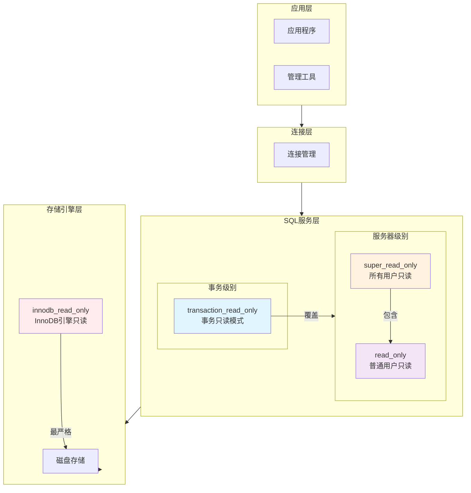
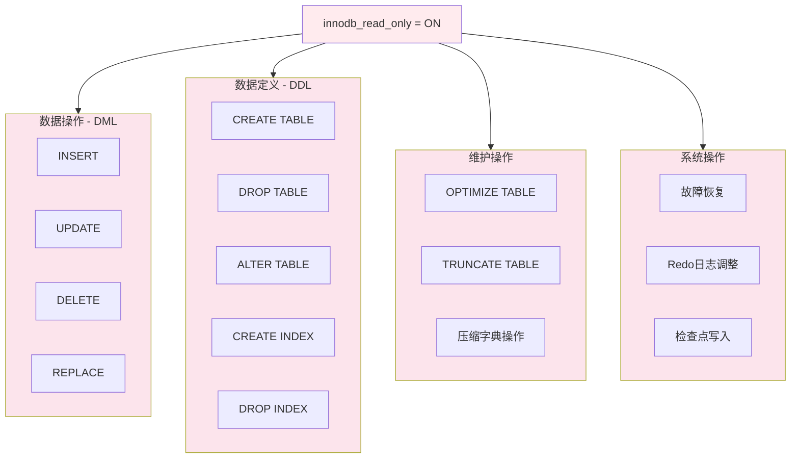
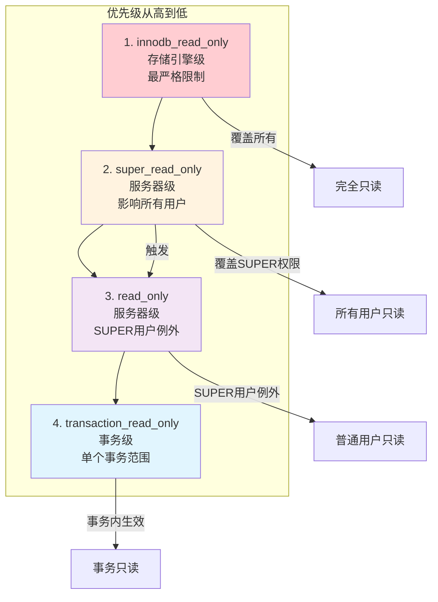
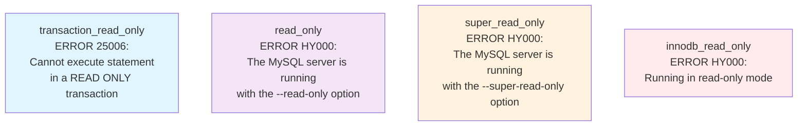

# InnoDB Read Only 参数深度分析

## 概述

`innodb_read_only` 是MySQL InnoDB存储引擎的一个关键系统参数，用于将InnoDB设置为只读模式。与其他只读参数不同，它在存储引擎层面实现完全的只读保护，提供最严格的数据安全保障。

**核心特性**：
- **存储引擎级只读**：在InnoDB层面阻止所有写操作
- **启动时配置**：只能通过命令行参数或配置文件设置
- **完全只读保护**：无用户权限例外，包括SUPER权限用户
- **安全升级模式**：常用于数据库升级和维护场景

## MySQL只读参数体系架构

### 1. 只读参数层次架构图



### 2. 只读参数权限控制矩阵

| 参数 | 范围 | 普通用户 | SUPER用户 | 复制线程 | 动态修改 | 生效层面 |
|------|------|----------|-----------|----------|----------|----------|
| **transaction_read_only** | 事务级 | ❌ 只读 | ❌ 只读 | ❌ 只读 | ✅ 支持 | 事务层面 |
| **read_only** | 服务器级 | ❌ 只读 | ✅ 可写 | ✅ 可写 | ✅ 支持 | SQL层面 |
| **super_read_only** | 服务器级 | ❌ 只读 | ❌ 只读 | ✅ 可写 | ✅ 支持 | SQL层面 |
| **innodb_read_only** | 存储引擎级 | ❌ 只读 | ❌ 只读 | ❌ 只读 | ❌ 不支持 | 存储层面 |

## innodb_read_only 参数详细分析

### 1. 参数定义和特性

**源码位置**: `storage/innobase/handler/ha_innodb.cc:24249-24257`

```cpp
static MYSQL_SYSVAR_BOOL(read_only, srv_read_only_mode,
                         PLUGIN_VAR_OPCMDARG | PLUGIN_VAR_READONLY |
                             PLUGIN_VAR_NOPERSIST,
                         "Start InnoDB in read only mode (off by default)",
                         nullptr, nullptr, false);
```

**关键标志分析**：
- `PLUGIN_VAR_READONLY`: 参数为只读，不支持运行时修改
- `PLUGIN_VAR_NOPERSIST`: 不支持持久化配置
- `PLUGIN_VAR_OPCMDARG`: 支持命令行可选参数

### 2. 功能控制范围

#### 2.1 阻止的操作类型

**源码位置**: `storage/innobase/handler/ha_innodb.cc:19556-19579`

```cpp
if (srv_read_only_mode &&
    (sql_command == SQLCOM_UPDATE || sql_command == SQLCOM_INSERT ||
     sql_command == SQLCOM_REPLACE || sql_command == SQLCOM_DROP_TABLE ||
     sql_command == SQLCOM_ALTER_TABLE || sql_command == SQLCOM_OPTIMIZE ||
     (sql_command == SQLCOM_CREATE_TABLE && lock_type == F_WRLCK) ||
     sql_command == SQLCOM_CREATE_INDEX || sql_command == SQLCOM_DROP_INDEX ||
     sql_command == SQLCOM_DELETE ||
     sql_command == SQLCOM_CREATE_COMPRESSION_DICTIONARY ||
     sql_command == SQLCOM_DROP_COMPRESSION_DICTIONARY)) {
    // 返回只读错误
}
```

#### 2.2 受限操作详细列表



### 3. 动态修改特性分析

#### 3.1 只读参数验证

**测试验证**: `mysql-test/suite/sys_vars/r/innodb_read_only_basic.result`

```sql
-- 尝试动态修改会报错
SET GLOBAL innodb_read_only = 1;
-- ERROR HY000: Variable 'innodb_read_only' is a read only variable

SET SESSION innodb_read_only = 1; 
-- ERROR HY000: Variable 'innodb_read_only' is a read only variable
```

#### 3.2 配置方法对比

| 配置方式 | innodb_read_only | read_only | super_read_only | transaction_read_only |
|----------|------------------|-----------|-----------------|----------------------|
| **动态SQL设置** | ❌ 不支持 | ✅ `SET GLOBAL read_only=1` | ✅ `SET GLOBAL super_read_only=1` | ✅ `SET SESSION transaction_read_only=1` |
| **配置文件** | ✅ `innodb_read_only=1` | ✅ `read_only=1` | ✅ `super_read_only=1` | ✅ `transaction_read_only=1` |
| **命令行参数** | ✅ `--innodb-read-only` | ✅ `--read-only` | ✅ `--super-read-only` | ✅ `--transaction-read-only` |
| **重启要求** | ✅ 必须重启 | ❌ 无需重启 | ❌ 无需重启 | ❌ 无需重启 |

## 参数关系与相互作用

### 1. 只读参数优先级关系图



### 2. 参数组合效果矩阵

**测试场景**: `mysql-test/r/read_only_ddl.result`

| 组合场景 | innodb_read_only | super_read_only | read_only | 普通用户 | SUPER用户 | 复制线程 |
|----------|------------------|-----------------|-----------|----------|-----------|----------|
| **场景1** | 0 | 0 | 0 | ✅ 可写 | ✅ 可写 | ✅ 可写 |
| **场景2** | 0 | 0 | 1 | ❌ 只读 | ✅ 可写 | ✅ 可写 |
| **场景3** | 0 | 1 | 1 | ❌ 只读 | ❌ 只读 | ✅ 可写 |
| **场景4** | 1 | 0 | 0 | ❌ 只读 | ❌ 只读 | ❌ 只读 |
| **场景5** | 1 | 1 | 1 | ❌ 只读 | ❌ 只读 | ❌ 只读 |

### 3. 错误消息对比



## 应用场景与最佳实践

### 1. 使用场景分析

#### 1.1 推荐使用场景


#### 1.2 不适用场景

- **在线业务环境**：会完全阻止写操作
- **需要部分写权限**：无法提供权限例外
- **频繁切换需求**：无法动态开启/关闭
- **应用层控制**：存储引擎层面控制过于底层

### 2. 配置最佳实践

#### 2.1 启动配置模板

```ini
# my.cnf 配置文件
[mysqld]
# 数据库升级场景
innodb_read_only = 1
innodb_force_recovery = 0
skip_slave_start = 1

# 维护模式场景  
innodb_read_only = 1
event_scheduler = OFF
skip_external_locking = 1
```

#### 2.2 命令行启动示例

```bash
# 升级模式启动
mysqld --innodb-read-only=1 \
       --skip-slave-start \
       --log-error=/var/log/mysql/upgrade.log

# 维护模式启动
mysqld --innodb-read-only=1 \
       --event-scheduler=OFF \
       --log-error=/var/log/mysql/maintenance.log

# 分析环境启动
mysqld --innodb-read-only=1 \
       --read-only=1 \
       --super-read-only=1
```

### 3. 监控和验证

#### 3.1 状态检查SQL

```sql
-- 检查所有只读参数状态
SELECT 
  '只读参数状态检查' as 检查项目,
  @@global.innodb_read_only as innodb_read_only,
  @@global.super_read_only as super_read_only,
  @@global.read_only as read_only,
  @@session.transaction_read_only as transaction_read_only;

-- 检查InnoDB引擎状态
SHOW ENGINE INNODB STATUS;

-- 验证只读模式是否生效
CREATE TABLE test_readonly (id INT);
-- 应该返回: ERROR HY000: Running in read-only mode
```

#### 3.2 日志监控关键字

```bash
# 查看启动日志中的只读模式提示
grep -i "read.only\|readonly" /var/log/mysql/error.log

# 关键日志信息：
# "Started in read only mode"
# "InnoDB read-only mode" 
# "Cannot create redo log files in read-only mode"
# "Can't initiate database recovery, running in read-only-mode"
```

## 技术限制与注意事项

### 1. 系统限制

#### 1.1 启动阶段限制

**源码验证**: `mysql-test/suite/innodb/r/log_read_only.result`

- ❌ **不支持故障恢复**: 如果redo日志需要恢复，启动会失败
- ❌ **不支持日志调整**: 无法在只读模式下调整redo日志大小
- ❌ **不支持升级**: 数据字典升级在只读模式下会失败
- ❌ **不支持初始化**: 无法在只读模式下初始化数据目录

#### 1.2 运行时限制


### 2. 与其他参数的冲突

#### 2.1 互斥参数

| 参数 | 冲突原因 | 解决方案 |
|------|----------|----------|
| `innodb_force_recovery > 3` | 都涉及只读模式 | 使用其中一个即可 |
| `skip_innodb` | 禁用InnoDB引擎 | 不要同时使用 |
| `innodb_fast_shutdown = 2` | 可能导致恢复需求 | 先正常关闭再启动 |

### 3. 性能影响

- **优势**: 减少写操作开销，提升查询性能
- **劣势**: 无法使用写入相关的性能优化
- **影响**: Buffer Pool管理更简单，但统计信息可能不准确

## 故障排查

### 1. 常见问题及解决方案

#### 1.1 启动失败问题

```bash
# 问题：启动时报错需要恢复
# 错误：Can't initiate database recovery, running in read-only-mode
# 解决：先正常启动进行恢复，再切换到只读模式

# 步骤1：正常启动
mysqld --datadir=/path/to/data

# 步骤2：确保干净关闭
mysqladmin -u root -p shutdown

# 步骤3：只读模式启动
mysqld --innodb-read-only=1
```

#### 1.2 操作被阻止问题

```sql
-- 问题：所有写操作都被阻止
-- 错误：ERROR HY000: Running in read-only mode

-- 解决方案1：检查参数状态
SHOW VARIABLES LIKE '%read_only%';

-- 解决方案2：如果需要写操作，重启为正常模式
-- 注意：innodb_read_only不支持动态修改
```

### 2. 监控脚本示例

```bash
#!/bin/bash
# innodb_read_only 状态监控脚本

check_innodb_readonly() {
    local status=$(mysql -e "SELECT @@global.innodb_read_only" -sN)
    
    if [ "$status" = "1" ]; then
        echo "$(date): InnoDB只读模式已启用"
        
        # 检查是否有写操作尝试
        error_count=$(grep -c "Running in read-only mode" /var/log/mysql/error.log)
        echo "只读模式错误计数: $error_count"
        
        # 检查连接数
        connections=$(mysql -e "SHOW STATUS LIKE 'Threads_connected'" -sN | awk '{print $2}')
        echo "当前连接数: $connections"
    else
        echo "$(date): InnoDB正常读写模式"
    fi
}

check_innodb_readonly
```

## 总结

`innodb_read_only` 参数是MySQL提供的最严格的只读保护机制，具有以下特点：

### 🎯 **核心价值**
- **最高安全级别**: 存储引擎层面的完全只读保护
- **无权限例外**: 包括SUPER权限在内的所有用户都受限
- **系统级保护**: 防止任何可能的数据修改操作

### ⚙️ **技术特点**
- **启动时配置**: 只能通过配置文件或命令行参数设置
- **不支持动态修改**: 需要重启MySQL服务器才能更改
- **全面覆盖**: 阻止DML、DDL、维护操作和系统级写操作

### 📊 **适用场景**
- ✅ **数据库升级**: 确保升级过程中的数据安全
- ✅ **系统维护**: 维护期间的全面保护
- ✅ **数据分析**: 只读分析环境的部署
- ❌ **在线业务**: 会完全阻断正常业务写操作

### 🔗 **与其他只读参数的关系**
- **优先级最高**: 覆盖所有其他只读参数的设置
- **互补使用**: 可与其他参数组合使用增强保护
- **独特定位**: 唯一的存储引擎级只读控制机制

这个参数是MySQL数据安全保护体系中的重要组成部分，在需要最高级别只读保护的场景下发挥着不可替代的作用。
