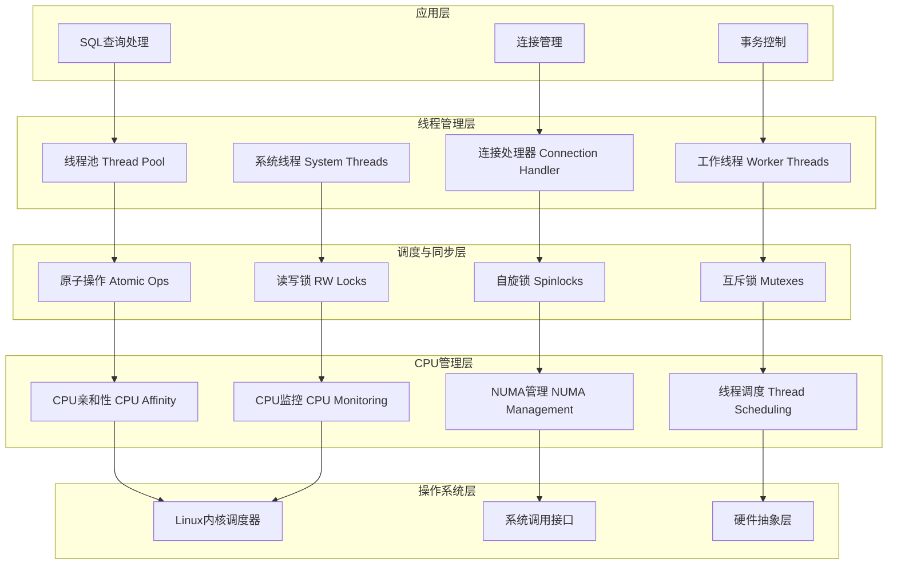
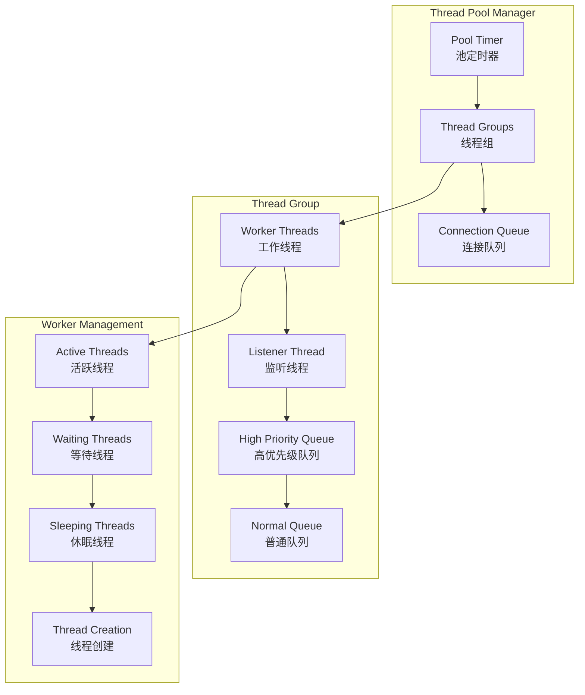

# MySQL 8.4 CPU使用机制分析

## 概述

本文档详细分析MySQL 8.4中的CPU使用机制，涵盖线程管理、调度策略、原子操作、锁机制、CPU亲和性设置以及相关的Linux系统调用。MySQL通过精细的CPU使用管理来实现高性能和可扩展性。

## MySQL CPU使用架构



## 核心组件分析

### 1. MySQL线程池系统

MySQL的线程池是其CPU使用的核心组件，提供高效的并发处理能力。

**位置：** `sql/threadpool.h`、`sql/threadpool_unix.cc`

#### 1.1 线程池架构设计



#### 1.2 线程池核心实现

```cpp
// 线程组结构 - 每个组管理一定数量的工作线程
struct alignas(128) thread_group_t {
  mysql_mutex_t mutex;                    // 保护线程组的互斥锁
  connection_queue_t queue;               // 普通连接队列
  connection_queue_t high_prio_queue;     // 高优先级连接队列
  worker_list_t waiting_threads;         // 等待线程列表
  worker_thread_t *listener;              // 监听线程
  pthread_attr_t *pthread_attr;          // 线程属性
  
  int pollfd;                            // epoll文件描述符
  int thread_count;                      // 总线程数
  int active_thread_count;               // 活跃线程数
  int connection_count;                  // 连接数
  int waiting_thread_count;              // 等待线程数
  
  // 统计信息
  int io_event_count;                    // IO事件计数
  int queue_event_count;                 // 队列事件计数
  ulonglong last_thread_creation_time;   // 最后线程创建时间
  
  int shutdown_pipe[2];                  // 关闭管道
  bool shutdown;                         // 关闭标志
  bool stalled;                          // 停滞标志
  char padding[328];                     // 缓存行对齐填充
};

// 全局线程组数组
static thread_group_t all_groups[MAX_THREAD_GROUPS];
static uint group_count;

// 线程池初始化
bool tp_init() {
  threadpool_started = true;
  
  // 初始化所有线程组
  for (uint i = 0; i < array_elements(all_groups); i++) {
    thread_group_init(&all_groups[i], get_connection_attrib());
  }
  
  // 设置线程池大小（默认为CPU核心数）
  tp_set_threadpool_size(threadpool_size);
  if (group_count == 0) {
    sql_print_error("Can't set threadpool size to %d", threadpool_size);
    return true;
  }
  
  // 启动定时器
  pool_timer.tick_interval = threadpool_stall_limit;
  start_timer(&pool_timer);
  
  return false;
}

// 工作线程主循环
static void *worker_main(void *param) {
  my_thread_init();
  
  thread_group_t *thread_group = (thread_group_t *)param;
  worker_thread_t this_thread;
  
  // 初始化线程本地结构
  mysql_cond_init(key_worker_cond, &this_thread.cond);
  this_thread.thread_group = thread_group;
  this_thread.event_count = 0;
  
  // 设置PSI线程账户信息
  PSI_THREAD_CALL(set_thread_account)(NULL, 0, NULL, 0);
  
  // 主事件循环
  for (;;) {
    connection_t *connection;
    struct timespec ts;
    set_timespec(&ts, threadpool_idle_timeout);
    
    // 获取待处理的连接
    connection = get_event(&this_thread, thread_group, &ts);
    if (!connection) break;  // 超时或关闭，退出循环
    
    this_thread.event_count++;
    handle_event(connection);  // 处理连接事件
  }
  
  // 线程关闭清理
  mysql_cond_destroy(&this_thread.cond);
  
  mysql_mutex_lock(&thread_group->mutex);
  add_thread_count(thread_group, -1);
  mysql_mutex_unlock(&thread_group->mutex);
  
  my_thread_end();
  return nullptr;
}

// 智能线程创建和唤醒
static int wake_or_create_thread(thread_group_t *thread_group, bool admin_connection) {
  // 首先尝试唤醒等待中的线程
  if (wake_thread(thread_group) == 0) {
    return 0;
  }
  
  // 检查是否需要创建新线程
  if (thread_group->thread_count >= threadpool_max_threads && !admin_connection) {
    return 1;  // 达到最大线程数限制
  }
  
  // 线程创建节流机制
  ulonglong now = my_microsecond_getsystime();
  ulonglong elapsed = now - thread_group->last_thread_creation_time;
  ulonglong throttle_interval = microsecond_throttling_interval(*thread_group);
  
  if (elapsed < throttle_interval) {
    return 1;  // 创建太频繁，跳过
  }
  
  // 创建新的工作线程
  return create_worker(thread_group, admin_connection);
}

// 计算线程创建的节流间隔
static ulonglong microsecond_throttling_interval(const thread_group_t &thread_group) noexcept {
  const int count = thread_group.thread_count;
  
  if (count < 4) return 0;          // 少于4个线程，不节流
  if (count < 8) return 50 * 1000;  // 4-7个线程，50ms节流
  if (count < 16) return 100 * 1000; // 8-15个线程，100ms节流
  return 200 * 1000;                // 16+个线程，200ms节流
}
```

### 2. CPU亲和性和NUMA管理

MySQL支持CPU亲和性设置和NUMA内存管理来优化CPU使用效率。

**位置：** `storage/innobase/buf/buf0buf.cc`、`storage/ndb/src/common/portlib/NdbThread.cpp`

#### 2.1 Buffer Pool CPU亲和性

```cpp
// Buffer Pool实例创建时的CPU亲和性设置
// 位置：storage/innobase/buf/buf0buf.cc
static void buf_pool_create(buf_pool_t *buf_pool, ulint buf_pool_size,
                            ulint instance_no, std::mutex *mutex, dberr_t &err,
                            bool populate) {
#ifdef UNIV_LINUX
  cpu_set_t cpuset;
  CPU_ZERO(&cpuset);
  
  // 获取系统CPU核心数
  const long n_cores = sysconf(_SC_NPROCESSORS_ONLN);
  
  // 将Buffer Pool实例绑定到特定CPU核心
  CPU_SET(instance_no % n_cores, &cpuset);
  
  buf_pool->stat.reset();
  
  // 设置CPU亲和性
  if (pthread_setaffinity_np(pthread_self(), sizeof(cpuset), &cpuset) == -1) {
    ib::error(ER_IB_ERR_SCHED_SETAFFNINITY_FAILED)
        << "sched_setaffinity() failed!";
  }
  
  // 设置高优先级（需要root权限）
  setpriority(PRIO_PROCESS, (pid_t)syscall(SYS_gettid), -20);
#endif
}

// NDB线程CPU锁定
// 位置：storage/ndb/src/common/portlib/NdbThread.cpp
int NdbThread_LockCPU(struct NdbThread *pThread, Uint32 cpu_id,
                      const struct processor_set_handler *cpu_set_key) {
#if defined(HAVE_LINUX_SCHEDULING)
  cpu_set_t cpu_set;
  CPU_ZERO(&cpu_set);
  CPU_SET(cpu_id, &cpu_set);
  
  // Linux: 使用sched_setaffinity设置CPU亲和性
  int ret = sched_setaffinity(pThread->tid, sizeof(cpu_set), &cpu_set);
  if (ret != 0) {
    return ret;
  }
  
#elif defined(HAVE_CPUSET_SETAFFINITY)
  // FreeBSD: 使用cpuset_setaffinity
  cpuset_t cpu_set;
  CPU_ZERO(&cpu_set);
  CPU_SET(cpu_id, &cpu_set);
  
  int ret = cpuset_setaffinity(CPU_LEVEL_WHICH, CPU_WHICH_TID, pThread->tid,
                              sizeof(cpu_set), &cpu_set);
  
#elif defined(HAVE_SOLARIS_AFFINITY)
  // Solaris: 使用processor_bind
  int ret = NdbThread_UnlockCPU(pThread);  // 先解除旧绑定
  if (ret) return ret;
  
  ret = processor_bind(P_LWPID, pThread->tid, cpu_id, nullptr);
#endif

  return ret;
}
```

### 3. 原子操作和自旋锁

MySQL大量使用原子操作和自旋锁来实现高效的并发控制。

**位置：** `include/my_atomic.h`、`sql/locks/shared_spin_lock.cc`

#### 3.1 原子操作实现

```cpp
// CPU暂停指令的平台适配
// 位置：include/my_atomic.h
#if defined(_MSC_VER)
#define YIELD_LOOPS 200

static inline int my_yield_processor() {
  int i;
  for (i = 0; i < YIELD_LOOPS; i++) {
    YieldProcessor();  // Windows平台
  }
  return 1;
}

#define LF_BACKOFF my_yield_processor()

#else
#define LF_BACKOFF (1)
#endif

// 跨平台CPU暂停指令
// 位置：storage/innobase/include/ut0ut.h
#if defined(HAVE_PAUSE_INSTRUCTION)
#define UT_RELAX_CPU() __asm__ __volatile__("pause")  // x86 PAUSE指令

#elif defined(HAVE_FAKE_PAUSE_INSTRUCTION)
#define UT_RELAX_CPU() __asm__ __volatile__("rep; nop")

#elif defined _WIN32
#define UT_RELAX_CPU() YieldProcessor()

#elif defined(__aarch64__)
#define UT_RELAX_CPU() __asm__ __volatile__("isb" ::: "memory")  // ARM指令

#else
#define UT_RELAX_CPU() __asm__ __volatile__("" ::: "memory")
#endif

// x86平台内存屏障
// 位置：storage/ndb/include/portlib/mt-asm.h
#define mb() asm volatile("mfence" ::: "memory")    // 完整内存屏障
#define rmb() asm volatile("" ::: "memory")         // 读屏障
#define wmb() asm volatile("" ::: "memory")         // 写屏障

// 原子交换操作
static inline int xcng(volatile unsigned *addr, int val) {
  asm volatile("xchg %0, %1;" : "+r"(val), "+m"(*addr));
  return val;
}

// CPU暂停指令（x86）
#if defined(HAVE_PAUSE_INSTRUCTION)
static inline void cpu_pause() { __asm__ __volatile__("pause"); }
#else
static inline void cpu_pause() { asm volatile("rep;nop"); }
#endif
```

#### 3.2 共享自旋锁实现

```cpp
// 共享自旋锁类 - 支持多读单写
// 位置：sql/locks/shared_spin_lock.cc
class Shared_spin_lock {
private:
  std::atomic<std::uint32_t> *m_shared_access;   // 共享访问计数器
  std::atomic<bool> *m_exclusive_access;         // 独占访问标志
  
public:
  // 共享锁获取（读锁）
  void spin_shared_lock() {
    do {
      // 检查是否有独占访问
      if (this->m_exclusive_access->load(std::memory_order_seq_cst)) {
        std::this_thread::yield();  // 让出CPU时间片
        continue;
      }
      
      // 增加共享访问计数
      this->m_shared_access->fetch_add(1, std::memory_order_release);
      
      // 再次检查独占访问（避免竞态条件）
      if (this->m_exclusive_access->load(std::memory_order_seq_cst)) {
        this->m_shared_access->fetch_sub(1, std::memory_order_release);
        std::this_thread::yield();
        continue;
      }
      
      break;  // 成功获取共享锁
    } while (true);
  }
  
  // 独占锁获取（写锁）
  void spin_exclusive_lock() {
    // 首先获取独占访问权
    while (this->m_exclusive_access->exchange(true, std::memory_order_seq_cst)) {
      std::this_thread::yield();
    }
    
    // 等待所有共享访问者退出
    while (this->m_shared_access->load(std::memory_order_acquire) != 0) {
      std::this_thread::yield();
    }
  }
  
  // 释放共享锁
  void release_shared() {
    this->m_shared_access->fetch_sub(1, std::memory_order_release);
  }
  
  // 释放独占锁
  void release_exclusive() {
    this->m_exclusive_access->store(false, std::memory_order_release);
  }
};
```

#### 3.3 InnoDB互斥锁实现

```cpp
// InnoDB快速互斥锁（使用futex）
// 位置：storage/innobase/include/ib0mutex.h
template <template <typename> class Policy = NoPolicy>
class TTASFutexMutex {
private:
  using lock_word_t = std::atomic<int32>;
  
  struct mutex_state_t {
    static constexpr int32 UNLOCKED = 0;
    static constexpr int32 LOCKED = 1;
    static constexpr int32 LOCKED_WITH_WAITERS = 2;
  };
  
  alignas(ut::INNODB_CACHE_LINE_SIZE)
  lock_word_t m_lock_word{mutex_state_t::UNLOCKED};
  
public:
  // 快速路径尝试加锁
  bool try_lock() UNIV_NOTHROW {
    lock_word_t unlocked = mutex_state_t::UNLOCKED;
    return m_lock_word.compare_exchange_strong(unlocked, mutex_state_t::LOCKED,
                                               std::memory_order_acquire);
  }
  
  // 完整加锁过程
  void lock() {
    if (try_lock()) {
      return;  // 快速路径成功
    }
    
    // 慢速路径：使用futex等待
    uint32_t n_waits = 0;
    do {
      ++n_waits;
      
      // 使用futex系统调用等待
      syscall(SYS_futex, &m_lock_word, FUTEX_WAIT_PRIVATE,
              mutex_state_t::LOCKED_WITH_WAITERS, 0, 0, 0);
              
    } while (!set_waiters());  // 重试直到成功
  }
  
  // 解锁并唤醒等待者
  void unlock() {
    lock_word_t old_state = m_lock_word.exchange(mutex_state_t::UNLOCKED,
                                                 std::memory_order_release);
    
    if (old_state == mutex_state_t::LOCKED_WITH_WAITERS) {
      // 有等待者，使用futex唤醒
      syscall(SYS_futex, &m_lock_word, FUTEX_WAKE_PRIVATE, 1, 0, 0, 0);
    }
  }
  
private:
  bool set_waiters() UNIV_NOTHROW {
    return m_lock_word.exchange(mutex_state_t::LOCKED_WITH_WAITERS) ==
           mutex_state_t::UNLOCKED;
  }
};

// 读写锁的高效实现
// 位置：storage/innobase/sync/sync0rw.cc
void rw_lock_x_lock_func(rw_lock_t *lock, ulint pass, ut::Location location) {
  ulint i = 0;
  bool spinning = false;

lock_loop:
  // 尝试快速获取X锁
  if (rw_lock_x_lock_low(lock, pass, location.filename, location.line)) {
    return;  // 成功获取
  } else {
    if (!spinning) spinning = true;
    
    // 自旋等待
    while (i < srv_n_spin_wait_rounds && lock->lock_word <= X_LOCK_HALF_DECR) {
      if (srv_spin_wait_delay) {
        ut_delay(ut::random_from_interval_fast(0, srv_spin_wait_delay));
      }
      i++;
    }
    
    if (i >= srv_n_spin_wait_rounds) {
      std::this_thread::yield();  // 自旋超时，让出CPU
    } else {
      goto lock_loop;  // 继续自旋
    }
  }
  
  // 进入等待队列
  sync_cell_t *cell;
  sync_array_t *sync_arr = sync_array_get_and_reserve_cell(lock, RW_LOCK_X, location, &cell);
  
  rw_lock_set_waiter_flag(lock);
  
  // 再次尝试获取锁
  if (rw_lock_x_lock_low(lock, pass, location.filename, location.line)) {
    sync_array_free_cell(sync_arr, cell);
    return;
  }
  
  // 等待被唤醒
  sync_array_wait_event(sync_arr, cell);
  i = 0;
  goto lock_loop;
}
```

### 4. 时间管理和性能监控

MySQL使用多种时间获取机制来进行性能监控和CPU使用统计。

**位置：** `mysys/my_rdtsc.cc`、`sql/userstat.cc`

#### 4.1 高精度时间获取

```cpp
// 多平台高精度时间获取
// 位置：mysys/my_rdtsc.cc

// CPU周期计数器（最高精度）
ulonglong my_timer_cycles(void) {
#if defined(__GNUC__) && (defined(__x86_64__) || defined(__i386__))
  // x86/x64: 使用RDTSC指令
  uint32_t a, d;
  asm volatile("rdtsc" : "=a"(a), "=d"(d));
  return ((ulonglong)d << 32) | a;

#elif defined(__GNUC__) && defined(__aarch64__)
  // ARM64: 使用虚拟计数器
  ulonglong result;
  __asm __volatile__("mrs %[rt],cntvct_el0" : [rt] "=r"(result));
  return result;

#elif defined(__GNUC__) && defined(__s390x__)
  // s390x: 使用存储时钟快速指令
  uint64_t result;
  __asm __volatile__("stckf %0" : "=Q"(result) : : "cc");
  return result;

#else
  return 0;
#endif
}

// 纳秒精度时间
ulonglong my_timer_nanoseconds(void) {
#if defined(HAVE_CLOCK_GETTIME) && defined(CLOCK_REALTIME)
  struct timespec tp;
  clock_gettime(CLOCK_REALTIME, &tp);
  return (ulonglong)tp.tv_sec * 1000000000 + (ulonglong)tp.tv_nsec;

#elif defined(__APPLE__) && defined(__MACH__)
  // macOS: 使用mach_absolute_time
  ulonglong tm;
  static mach_timebase_info_data_t timebase_info = {0, 0};
  if (timebase_info.denom == 0) (void)mach_timebase_info(&timebase_info);
  tm = mach_absolute_time();
  return (tm * timebase_info.numer) / timebase_info.denom;

#else
  return 0;
#endif
}

// 微秒精度时间（最常用）
ulonglong my_timer_microseconds(void) {
#if defined(HAVE_GETTIMEOFDAY)
  struct timeval tv;
  ulonglong result;
  if (gettimeofday(&tv, nullptr) == 0) {
    result = (ulonglong)tv.tv_sec * 1000000 + (ulonglong)tv.tv_usec;
  } else {
    result = 0;  // gettimeofday失败的容错处理
  }
  return result;

#elif defined(_WIN32)
  // Windows: 使用QueryPerformanceCounter
  LARGE_INTEGER t_cnt;
  QueryPerformanceCounter(&t_cnt);
  return (ulonglong)t_cnt.QuadPart;

#else
  return 0;
#endif
}

// 线程CPU时间
ulonglong my_timer_thread_cpu(void) {
#if defined(HAVE_CLOCK_GETTIME) && defined(CLOCK_THREAD_CPUTIME_ID)
  struct timespec tp;
  clock_gettime(CLOCK_THREAD_CPUTIME_ID, &tp);
  return (ulonglong)tp.tv_sec * 1000000000 + (ulonglong)tp.tv_nsec;

#elif defined(_WIN32)
  FILETIME creation_time, exit_time, kernel_time, user_time;
  if (GetThreadTimes(GetCurrentThread(), &creation_time, &exit_time,
                     &kernel_time, &user_time)) {
    ULARGE_INTEGER user_time_64;
    user_time_64.LowPart = user_time.dwLowDateTime;
    user_time_64.HighPart = user_time.dwHighDateTime;
    return user_time_64.QuadPart * 100;  // 转换为纳秒
  }
  return 0;

#else
  return 0;
#endif
}
```

#### 4.2 用户统计和CPU监控

```cpp
// 用户会话的CPU使用统计
// 位置：sql/userstat.cc
void userstat_start_timer(double *start_busy_usecs, double *start_cpu_nsecs) noexcept {
  *start_busy_usecs = 0.0;
  *start_cpu_nsecs = 0.0;

#ifdef HAVE_CLOCK_GETTIME
  // 获取线程CPU时间
  struct timespec tp;
  if (!clock_gettime(CLOCK_THREAD_CPUTIME_ID, &tp))
    *start_cpu_nsecs = tp.tv_sec * 1000000000.0 + tp.tv_nsec;
#endif

  // 获取墙上时间
  struct timeval start_time;
  if (!gettimeofday(&start_time, nullptr))
    *start_busy_usecs = start_time.tv_sec * 1000000.0 + start_time.tv_usec;
}

void userstat_finish_timer(double start_busy_usecs, double start_cpu_nsecs,
                          double *busy_sec, double *cpu_sec) noexcept {
  *busy_sec = 0.0;
  *cpu_sec = 0.0;

  // 计算墙上时间差
  struct timeval end_time;
  double end_busy_usecs = 0.0;
  if (start_busy_usecs > 0.0 && !gettimeofday(&end_time, nullptr))
    end_busy_usecs = end_time.tv_sec * 1000000.0 + end_time.tv_usec;

  if (end_busy_usecs > start_busy_usecs) {
    *busy_sec = (end_busy_usecs - start_busy_usecs) / 1000000.0;
    if (unlikely(*busy_sec > 2629743.0)) {  // 防止异常值（>1个月）
      *busy_sec = 0.0;
    }
  }

#ifdef HAVE_CLOCK_GETTIME
  // 计算CPU时间差
  struct timespec tp;
  double end_cpu_nsecs = 0.0;
  if (start_cpu_nsecs > 0.0 && !clock_gettime(CLOCK_THREAD_CPUTIME_ID, &tp))
    end_cpu_nsecs = tp.tv_sec * 1000000000.0 + tp.tv_nsec;
#endif

  if (end_cpu_nsecs > start_cpu_nsecs) {
    *cpu_sec = (end_cpu_nsecs - start_cpu_nsecs) / 1000000000.0;
    if (unlikely(*cpu_sec > 2629743.0)) {  // 防止异常值
      *cpu_sec = 0.0;
    }
  }
}

// InnoDB CPU使用监控
// 位置：storage/innobase/srv/srv0srv.cc
static void srv_update_cpu_usage() {
  using Clock = std::chrono::high_resolution_clock;
  using Clock_point = std::chrono::time_point<Clock>;

  static Clock_point last_time = Clock::now();
  static timeval last_cpu_utime;
  static timeval last_cpu_stime;
  static bool last_cpu_times_set = false;

  Clock_point cur_time = Clock::now();
  
  // 计算时间差
  const auto time_diff = std::chrono::duration_cast<std::chrono::microseconds>(
                             cur_time - last_time).count();

  if (time_diff < 100 * 1000LL) {
    return;  // 更新间隔太短，跳过
  }
  last_time = cur_time;

  // 获取资源使用情况
  rusage usage;
  if (getrusage(RUSAGE_SELF, &usage) != 0) {
    return;
  }

  if (!last_cpu_times_set) {
    last_cpu_utime = usage.ru_utime;
    last_cpu_stime = usage.ru_stime;
    last_cpu_times_set = true;
    return;
  }

  // 计算CPU使用率
  const auto cpu_utime_diff = timeval_diff_us(usage.ru_utime, last_cpu_utime);
  const auto cpu_stime_diff = timeval_diff_us(usage.ru_stime, last_cpu_stime);
  
  last_cpu_utime = usage.ru_utime;
  last_cpu_stime = usage.ru_stime;

  // 计算绝对CPU使用率
  double cpu_utime = cpu_utime_diff * 100.0 / time_diff;
  double cpu_stime = cpu_stime_diff * 100.0 / time_diff;
  
  MONITOR_SET(MONITOR_CPU_UTIME_ABS, int64_t(cpu_utime));
  MONITOR_SET(MONITOR_CPU_STIME_ABS, int64_t(cpu_stime));

  // 获取CPU亲和性信息
  cpu_set_t cs;
  CPU_ZERO(&cs);
  if (sched_getaffinity(0, sizeof(cs), &cs) != 0) {
    return;
  }

  // 计算可用CPU核心数
  int n_cpu = 0;
  constexpr int MAX_CPU_N = 128;
  for (int i = 0; i < MAX_CPU_N; ++i) {
    if (CPU_ISSET(i, &cs)) {
      ++n_cpu;
    }
  }

  // 计算相对CPU使用率（考虑多核）
  if (n_cpu > 0) {
    cpu_utime /= n_cpu;
    cpu_stime /= n_cpu;
    
    MONITOR_SET(MONITOR_CPU_UTIME_PCT, int64_t(cpu_utime));
    MONITOR_SET(MONITOR_CPU_STIME_PCT, int64_t(cpu_stime));
    MONITOR_SET(MONITOR_CPU_N, int64_t(n_cpu));
  }
}
```

### 5. MySQL使用的Linux系统调用

MySQL在CPU管理方面使用了众多Linux系统调用：

#### 5.1 线程管理相关系统调用

| 系统调用 | 使用场景 | 代码位置 | 说明 |
|---------|---------|----------|------|
| `pthread_create` | 创建工作线程 | `sql/threadpool_unix.cc` | 创建线程池工作线程 |
| `pthread_setaffinity_np` | 设置CPU亲和性 | `storage/innobase/buf/buf0buf.cc` | 绑定线程到特定CPU |
| `sched_setaffinity` | 设置进程/线程亲和性 | `storage/ndb/src/common/portlib/NdbThread.cpp` | NDB线程CPU锁定 |
| `sched_getaffinity` | 获取CPU亲和性信息 | `storage/innobase/srv/srv0srv.cc` | CPU使用率计算 |
| `sched_yield` | 主动让出CPU | `sql/rpl_mta_submode.cc` | 忙等待时让出CPU |
| `setpriority` | 设置线程优先级 | `storage/innobase/buf/buf0buf.cc` | 设置Buffer Pool线程高优先级 |

#### 5.2 时间和性能监控系统调用

| 系统调用 | 使用场景 | 代码位置 | 说明 |
|---------|---------|----------|------|
| `clock_gettime` | 高精度时间获取 | `mysys/my_rdtsc.cc` | 获取纳秒级时间 |
| `gettimeofday` | 微秒时间获取 | `mysys/my_rdtsc.cc` | 获取微秒级时间 |
| `getrusage` | 获取资源使用情况 | `storage/innobase/srv/srv0srv.cc` | CPU使用统计 |
| `times` | 获取进程时间信息 | `mysys/my_rdtsc.cc` | 进程CPU时间 |
| `sysconf` | 获取系统配置信息 | `storage/innobase/buf/buf0buf.cc` | 获取CPU核心数 |

#### 5.3 同步和原子操作系统调用

| 系统调用 | 使用场景 | 代码位置 | 说明 |
|---------|---------|----------|------|
| `futex` | 快速用户空间互斥锁 | `storage/innobase/include/ib0mutex.h` | 高效互斥锁实现 |
| `syscall(SYS_gettid)` | 获取线程ID | `storage/innobase/buf/buf0buf.cc` | 线程标识 |

#### 5.4 系统调用使用示例

```cpp
// CPU亲和性设置示例
void set_cpu_affinity(int cpu_id) {
  cpu_set_t cpuset;
  CPU_ZERO(&cpuset);
  CPU_SET(cpu_id, &cpuset);
  
  // 设置当前线程的CPU亲和性
  if (sched_setaffinity(0, sizeof(cpuset), &cpuset) == -1) {
    perror("sched_setaffinity failed");
  }
}

// 高精度时间测量
uint64_t measure_execution_time() {
  struct timespec start, end;
  
  // 获取开始时间
  clock_gettime(CLOCK_MONOTONIC, &start);
  
  // ... 执行需要测量的代码 ...
  
  // 获取结束时间
  clock_gettime(CLOCK_MONOTONIC, &end);
  
  // 计算纳秒差值
  return (end.tv_sec - start.tv_sec) * 1000000000UL + 
         (end.tv_nsec - start.tv_nsec);
}

// CPU使用率监控
void monitor_cpu_usage() {
  struct rusage usage;
  static struct rusage last_usage = {0};
  static bool first_call = true;
  
  if (getrusage(RUSAGE_SELF, &usage) == 0) {
    if (!first_call) {
      // 计算用户态CPU时间差（微秒）
      long user_time_diff = 
        (usage.ru_utime.tv_sec - last_usage.ru_utime.tv_sec) * 1000000 +
        (usage.ru_utime.tv_usec - last_usage.ru_utime.tv_usec);
      
      // 计算系统态CPU时间差（微秒）
      long sys_time_diff = 
        (usage.ru_stime.tv_sec - last_usage.ru_stime.tv_sec) * 1000000 +
        (usage.ru_stime.tv_usec - last_usage.ru_stime.tv_usec);
      
      printf("User CPU: %ld µs, System CPU: %ld µs\n", 
             user_time_diff, sys_time_diff);
    }
    
    last_usage = usage;
    first_call = false;
  }
}
```

### 6. 性能优化配置

#### 6.1 线程池配置

```ini
[mysqld]
# 线程池基本配置
thread_handling = pool-of-threads
thread_pool_size = 16                    # 线程池组数（通常等于CPU核心数）
thread_pool_oversubscribe = 3            # 每组允许的额外活跃线程数
thread_pool_max_threads = 2000           # 最大线程数
thread_pool_idle_timeout = 60            # 空闲线程超时时间（秒）

# 高优先级事务配置
thread_pool_high_prio_mode = transactions
thread_pool_high_prio_tickets = 4294967295

# 停滞检测配置
thread_pool_stall_limit = 500            # 停滞检测阈值（10ms单位）
```

#### 6.2 CPU优化参数

```ini
[mysqld]
# InnoDB线程并发控制
innodb_thread_concurrency = 0            # 0表示无限制（推荐）
innodb_concurrency_tickets = 5000        # 并发票据数量

# InnoDB自旋锁配置
innodb_spin_wait_delay = 6               # 自旋等待延迟
innodb_sync_spin_loops = 30              # 自旋轮数

# 自适应刷新
innodb_adaptive_flushing = ON            # 启用自适应刷新
innodb_adaptive_flushing_lwm = 10        # 自适应刷新低水位线

# NUMA配置
innodb_numa_interleave = ON              # 启用NUMA交错内存分配
```

### 7. CPU性能监控

#### 7.1 Performance Schema监控

```sql
-- 线程池状态监控
SELECT 
  pool_id,
  thread_group_id,
  threads_started,
  threads_active,
  threads_active_max,
  connections_started,
  connections_active,
  connections_queued,
  connections_queued_max,
  queued_time_avg,
  queued_time_max
FROM performance_schema.tp_thread_group_stats;

-- CPU使用情况
SELECT 
  thread_id,
  name,
  processlist_id,
  processlist_user,
  processlist_host,
  processlist_command,
  processlist_time,
  instrumented
FROM performance_schema.threads 
WHERE name LIKE '%worker%' OR name LIKE '%pool%';

-- 等待事件统计
SELECT 
  event_name,
  count_star,
  sum_timer_wait/1000000000 as sum_timer_wait_sec,
  avg_timer_wait/1000000000 as avg_timer_wait_sec,
  max_timer_wait/1000000000 as max_timer_wait_sec
FROM performance_schema.events_waits_summary_global_by_event_name 
WHERE event_name LIKE '%mutex%' OR event_name LIKE '%rwlock%'
ORDER BY sum_timer_wait DESC 
LIMIT 20;
```

#### 7.2 系统级监控脚本

```bash
#!/bin/bash
# MySQL CPU使用监控脚本

echo "=== MySQL CPU使用分析 ==="

MYSQL_PID=$(pgrep mysqld)
if [ -z "$MYSQL_PID" ]; then
  echo "MySQL进程未找到"
  exit 1
fi

# 1. CPU亲和性信息
echo "CPU亲和性配置:"
taskset -cp $MYSQL_PID

# 2. 线程数统计
echo "MySQL线程统计:"
THREAD_COUNT=$(pstree -p $MYSQL_PID | grep -o '([0-9]*)' | wc -l)
echo "总线程数: $THREAD_COUNT"

# 3. CPU使用率（每个线程）
echo "各线程CPU使用率:"
ps -mp $MYSQL_PID -o THREAD,tid,time,%cpu,comm | head -20

# 4. 系统调用统计
echo "系统调用统计:"
strace -c -p $MYSQL_PID -f -e trace=sched_setaffinity,sched_getaffinity,futex,clock_gettime,getrusage 2>/dev/null &
STRACE_PID=$!
sleep 10
kill $STRACE_PID

# 5. NUMA内存分布
if command -v numastat >/dev/null 2>&1; then
  echo "NUMA内存分布:"
  numastat -p $MYSQL_PID
fi

# 6. 锁等待统计
echo "InnoDB锁等待:"
mysql -e "
SELECT 
  r.trx_id waiting_trx_id,
  r.trx_mysql_thread_id waiting_thread,
  r.trx_query waiting_query,
  b.trx_id blocking_trx_id,
  b.trx_mysql_thread_id blocking_thread,
  b.trx_query blocking_query
FROM information_schema.innodb_lock_waits w
INNER JOIN information_schema.innodb_trx b  
  ON b.trx_id = w.blocking_trx_id
INNER JOIN information_schema.innodb_trx r  
  ON r.trx_id = w.requesting_trx_id;
"

echo "分析完成！"
```

## 总结

MySQL的CPU使用机制展现了高度的优化和复杂性：

### 核心特性
1. **多层线程管理**: 线程池、连接处理器、工作线程的层次化架构
2. **智能调度策略**: 自适应线程创建、优先级队列、负载均衡
3. **高效同步机制**: 原子操作、自旋锁、futex、读写锁的组合使用
4. **CPU亲和性优化**: Buffer Pool实例绑定、NUMA感知分配
5. **精确性能监控**: 多级时间获取、资源使用统计、Performance Schema集成

### 系统调用优化
- **线程管理**: pthread_create、sched_setaffinity、setpriority
- **时间测量**: clock_gettime、gettimeofday、getrusage
- **同步原语**: futex、原子指令、内存屏障
- **资源监控**: sysconf、CPU亲和性查询

### 性能调优要点
- **线程池配置**: 合理设置组数和线程数限制
- **CPU绑定**: 关键线程的CPU亲和性设置
- **锁优化**: 自旋锁参数调整和等待策略
- **监控告警**: 持续监控CPU使用率和线程状态

这套CPU使用管理机制确保MySQL能够充分利用现代多核处理器的性能，在高并发场景下提供优异的响应性能和系统吞吐量。
