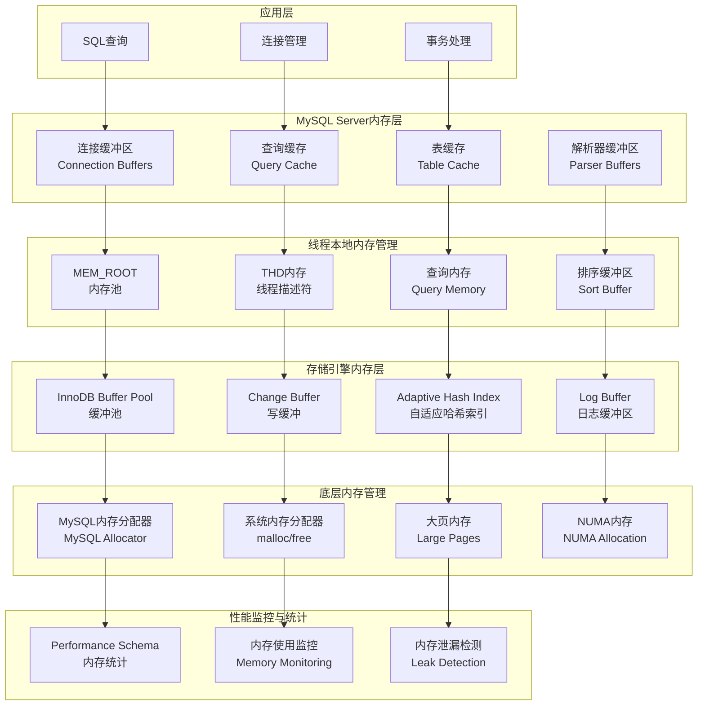
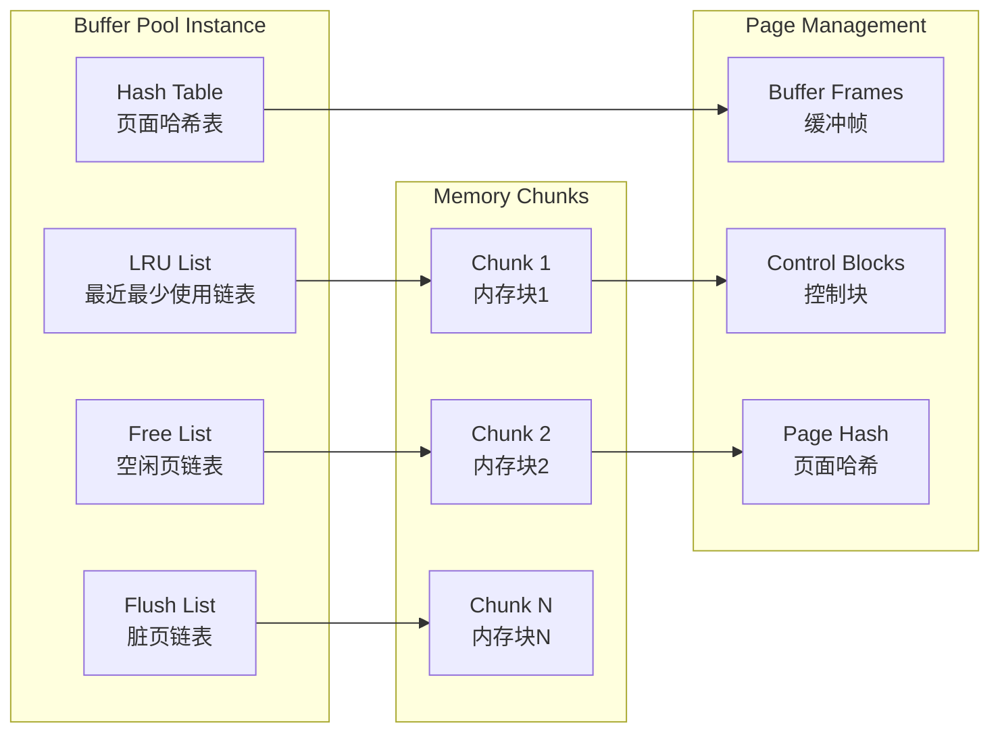
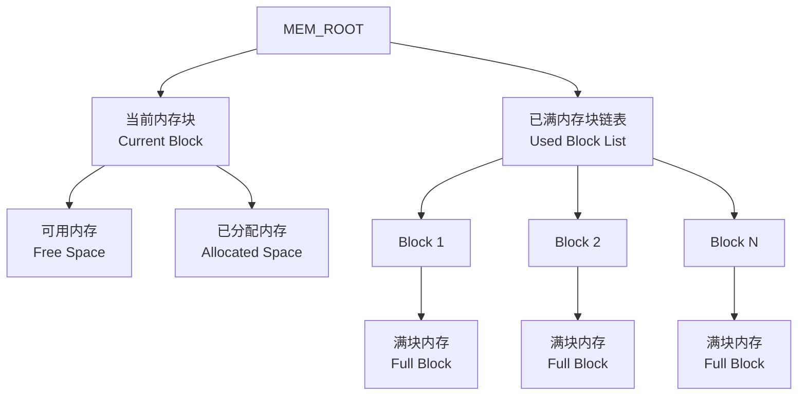
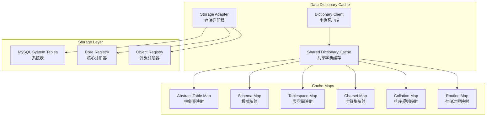
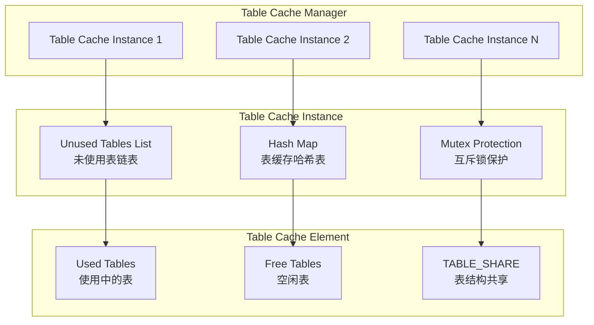
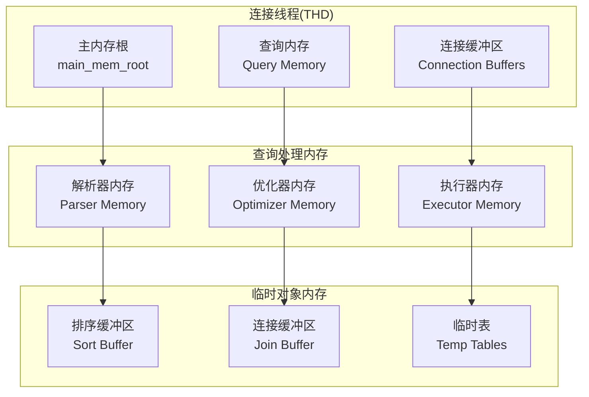
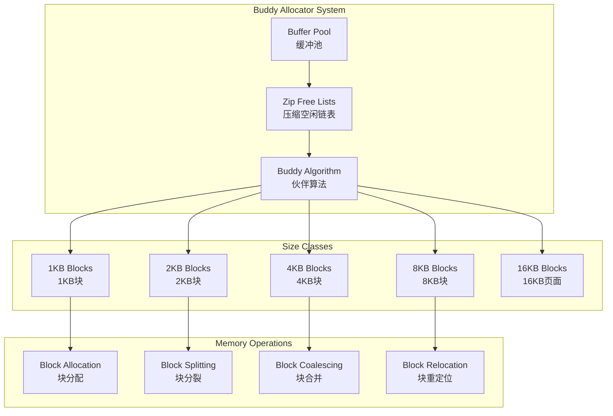
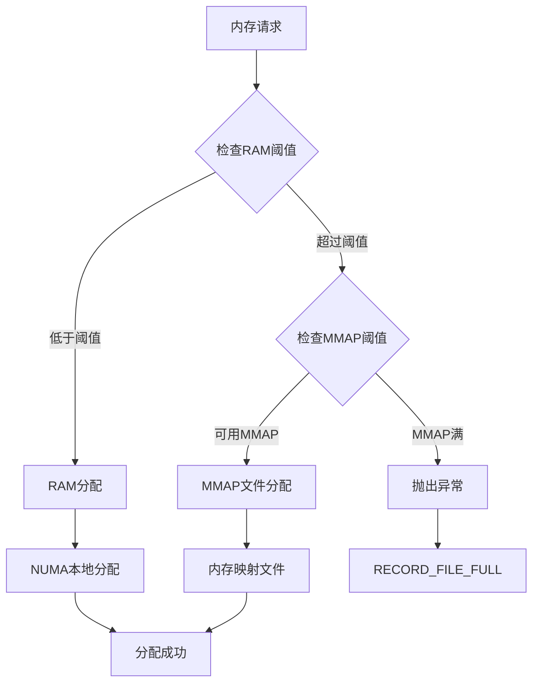
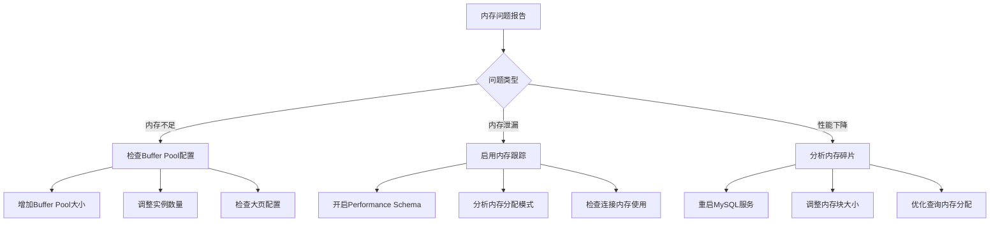
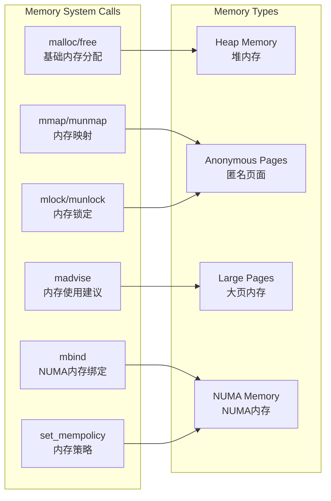

# MySQL 8.4 内存管理机制分析

## 概述

本文档详细分析MySQL 8.4中的内存管理机制，涵盖从内存分配器到各种缓存系统的完整内存管理架构，以及相关的优化技术和设计原理。

## MySQL 内存管理架构层次图



## 核心组件分析

### 1. InnoDB Buffer Pool (缓冲池)

InnoDB Buffer Pool是MySQL最重要的内存组件，负责缓存数据页和索引页。

**位置：** `storage/innobase/buf/buf0buf.cc`

#### 1.1 Buffer Pool核心架构



#### 1.2 Buffer Pool结构定义

```cpp
// Buffer Pool核心数据结构
class buf_pool_t {
public:
  // 缓冲池基本属性
  ulint instance_no;           // 缓冲池实例号
  ulint curr_pool_size;        // 当前缓冲池大小
  ulint curr_size;             // 当前页面数量
  ulint old_size;              // 旧的页面数量
  
  // 内存块管理
  buf_chunk_t *chunks;         // 内存块数组
  ulint n_chunks;              // 内存块数量
  
  // 页面链表管理
  UT_LIST_BASE_NODE_T(buf_page_t) LRU;        // LRU链表
  UT_LIST_BASE_NODE_T(buf_page_t) free;       // 空闲链表
  UT_LIST_BASE_NODE_T(buf_page_t) flush_list; // 刷新链表
  UT_LIST_BASE_NODE_T(buf_block_t) unzip_LRU; // 解压缩LRU链表
  
  // 哈希表
  hash_table_t *page_hash;     // 页面哈希表
  hash_table_t *zip_hash;      // 压缩页哈希表
  
  // 互斥锁保护
  BufListMutex LRU_list_mutex;      // LRU链表互斥锁
  BufListMutex free_list_mutex;     // 空闲链表互斥锁
  FlushListMutex flush_list_mutex;   // 刷新链表互斥锁
  BufPoolZipMutex zip_mutex;         // 压缩页互斥锁
  
  // 统计信息
  buf_pool_stat_t stat;        // 缓冲池统计
  buf_pool_stat_t old_stat;    // 旧的统计信息
  
  // 读写性能优化
  page_no_t read_ahead_area;   // 预读区域大小
  BPageMutex *page_hash_latches; // 页面哈希锁数组
};
```

#### 1.3 Buffer Pool初始化

```cpp
// Buffer Pool初始化过程
dberr_t buf_pool_init(ulint total_size, bool populate, ulint n_instances) {
  const ulint size = total_size / n_instances;
  
  // 分配Buffer Pool实例数组
  buf_pool_ptr = (buf_pool_t *)ut::zalloc_withkey(
      UT_NEW_THIS_FILE_PSI_KEY, n_instances * sizeof(*buf_pool_ptr));
  
  // 初始化每个Buffer Pool实例
  for (ulint i = 0; i < n_instances; ++i) {
    buf_pool_t *buf_pool = &buf_pool_ptr[i];
    
    // 初始化互斥锁
    mutex_create(LATCH_ID_BUF_POOL_LRU_LIST, &buf_pool->LRU_list_mutex);
    mutex_create(LATCH_ID_BUF_POOL_FREE_LIST, &buf_pool->free_list_mutex);
    mutex_create(LATCH_ID_BUF_POOL_FLUSH_STATE, &buf_pool->flush_state_mutex);
    
    // 计算内存块配置
    buf_pool->n_chunks = size / srv_buf_pool_chunk_unit;
    ulint chunk_size = srv_buf_pool_chunk_unit;
    
    // 分配内存块
    buf_pool->chunks = reinterpret_cast<buf_chunk_t *>(
        ut::zalloc_withkey(UT_NEW_THIS_FILE_PSI_KEY, 
                          buf_pool->n_chunks * sizeof(*chunk)));
    
    // 初始化链表
    UT_LIST_INIT(buf_pool->LRU);
    UT_LIST_INIT(buf_pool->free);
    UT_LIST_INIT(buf_pool->flush_list);
    UT_LIST_INIT(buf_pool->unzip_LRU);
    
    // 初始化每个内存块
    buf_chunk_t *chunk = buf_pool->chunks;
    for (ulint j = 0; j < buf_pool->n_chunks; ++j, ++chunk) {
      if (!buf_chunk_init(buf_pool, chunk, chunk_size, populate)) {
        return DB_ERROR;
      }
      buf_pool->curr_size += chunk->size;
    }
    
    // 创建页面哈希表
    buf_pool->page_hash = ib_create(
        2 * buf_pool->curr_size,
        LATCH_ID_HASH_TABLE_RW_LOCK,
        srv_n_page_hash_locks,
        MEM_HEAP_FOR_PAGE_HASH);
    
    // 创建压缩页哈希表
    buf_pool->zip_hash = ut::new_<hash_table_t>(2 * buf_pool->curr_size);
  }
  
  return DB_SUCCESS;
}
```

#### 1.4 内存块(Chunk)管理

```cpp
// 内存块结构
struct buf_chunk_t {
  uint8_t *mem;                // 内存起始地址
  ulint size;                  // 页面数量
  buf_block_t *blocks;         // 控制块数组
  
  // 内存分配
  bool allocate_chunk(ulint mem_size) {
    // 使用大页内存分配
    mem = static_cast<uint8_t *>(ut::malloc_large_page_withkey(
        ut::make_psi_memory_key(mem_key_buf_buf_pool), 
        mem_size,
        ut::fallback_to_normal_page_t{},
        os_use_large_pages,
        populate));
    
    if (mem == nullptr) {
      return false;
    }
    
    // NUMA内存策略
#ifdef HAVE_LIBNUMA
    if (srv_numa_interleave) {
      const auto low_level_info = ut::large_page_low_level_info(
          mem, ut::fallback_to_normal_page_t{});
      struct bitmask *numa_nodes = numa_get_mems_allowed();
      int st = mbind(low_level_info.base_ptr, 
                     low_level_info.allocation_size,
                     MPOL_INTERLEAVE, 
                     numa_nodes->maskp, 
                     numa_nodes->size,
                     MPOL_MF_MOVE);
      numa_bitmask_free(numa_nodes);
    }
#endif
    
    return true;
  }
  
  // 内存页面建议
  bool madvise_dont_dump() {
    return madvise(mem, size * UNIV_PAGE_SIZE, MADV_DONTDUMP) == 0;
  }
};
```

### 2. MEM_ROOT 内存池

MEM_ROOT是MySQL的核心内存分配器，提供高效的内存池管理。

**位置：** `include/my_alloc.h`

#### 2.1 MEM_ROOT架构设计



#### 2.2 MEM_ROOT结构实现

```cpp
// MEM_ROOT内存池结构
struct MEM_ROOT {
private:
  Block *m_current_block{nullptr};      // 当前分配块
  Block *m_first_block{nullptr};        // 第一个块
  
  char *m_current_free_start{nullptr};  // 当前可分配开始位置
  char *m_current_free_end{nullptr};    // 当前可分配结束位置
  
  size_t m_block_size{512};             // 默认块大小
  PSI_memory_key m_psi_key{0};          // 性能监控键
  
  // 内存块结构
  struct Block {
    Block *m_prev{nullptr};             // 前一个块
    Block *m_next{nullptr};             // 下一个块
    size_t m_size{0};                   // 块大小
    
    // 获取数据区域
    char *data() { 
      return pointer_cast<char *>(this + 1); 
    }
  };
  
public:
  // 构造函数
  explicit MEM_ROOT(PSI_memory_key psi_key = PSI_NOT_INSTRUMENTED,
                    size_t block_size = 512) noexcept
    : m_block_size(block_size), m_psi_key(psi_key) {}
  
  // 内存分配
  void *Alloc(size_t length) MY_ATTRIBUTE((malloc)) {
    length = ALIGN_SIZE(length);
    
    // 快速路径：当前块有足够空间
    if (static_cast<size_t>(m_current_free_end - m_current_free_start) >= length) {
      void *ret = m_current_free_start;
      m_current_free_start += length;
      return ret;
    }
    
    // 慢速路径：需要新块或重新分配
    return AllocSlow(length);
  }
  
  // 慢速分配路径
  void *AllocSlow(size_t length) {
    if (length >= m_block_size) {
      // 大内存直接分配独立块
      return AllocLargeObject(length);
    }
    
    // 分配新的标准块
    AllocNewBlock(std::max(length, m_block_size));
    
    void *ret = m_current_free_start;
    m_current_free_start += length;
    return ret;
  }
  
  // 分配新内存块
  void AllocNewBlock(size_t block_size) {
    // 保存当前块（如果存在）
    if (m_current_block != nullptr) {
      m_current_block->m_next = 
          reinterpret_cast<Block *>(m_current_free_start);
    }
    
    // 分配新块
    Block *new_block = reinterpret_cast<Block *>(
        my_malloc(m_psi_key, sizeof(Block) + block_size, MYF(MY_WME)));
    
    new_block->m_prev = m_current_block;
    new_block->m_next = nullptr;
    new_block->m_size = block_size;
    
    // 更新当前块指针
    m_current_block = new_block;
    m_current_free_start = new_block->data();
    m_current_free_end = m_current_free_start + block_size;
    
    if (m_first_block == nullptr) {
      m_first_block = new_block;
    }
  }
  
  // 清空所有内存
  void Clear() {
    ClearAllBlocks();
    m_current_block = nullptr;
    m_first_block = nullptr;
    m_current_free_start = nullptr;
    m_current_free_end = nullptr;
  }
  
  // 内存块大小增长策略
  size_t NextBlockSize(size_t min_size) const {
    // 指数增长，但不超过最大限制
    size_t new_size = std::max(m_block_size * 3 / 2, min_size);
    return std::min(new_size, size_t{32 * 1024 * 1024}); // 最大32MB
  }
};
```

### 3. DD Cache (数据字典缓存)

DD Cache是MySQL 8.0引入的数据字典缓存系统，负责缓存数据字典对象如表、列、索引等元数据。

**位置：** `sql/dd/impl/cache/shared_dictionary_cache.h`、`sql/dd/impl/cache/shared_dictionary_cache.cc`

#### 3.1 DD Cache架构设计



#### 3.2 DD Cache核心实现

```cpp
// 共享数据字典缓存
class Shared_dictionary_cache {
private:
  // 各种对象类型的缓存映射
  Shared_multi_map<Abstract_table> m_abstract_table_map;
  Shared_multi_map<Charset> m_charset_map;
  Shared_multi_map<Collation> m_collation_map;
  Shared_multi_map<Column_statistics> m_column_stat_map;
  Shared_multi_map<Event> m_event_map;
  Shared_multi_map<Resource_group> m_resource_group_map;
  Shared_multi_map<Routine> m_routine_map;
  Shared_multi_map<Schema> m_schema_map;
  Shared_multi_map<Spatial_reference_system> m_spatial_reference_system_map;
  Shared_multi_map<Tablespace> m_tablespace_map;
  
  // 容量配置
  static const size_t collation_capacity = 256;
  static const size_t column_statistics_capacity = 32;
  static const size_t charset_capacity = 64;
  static const size_t event_capacity = 256;
  static const size_t spatial_reference_system_capacity = 256;
  static const size_t resource_group_capacity = 32;

public:
  // 单例访问
  static Shared_dictionary_cache *instance() {
    static Shared_dictionary_cache s_cache;
    return &s_cache;
  }
  
  // 初始化缓存
  void init() {
    instance()->m_map<Collation>()->set_capacity(collation_capacity);
    instance()->m_map<Charset>()->set_capacity(charset_capacity);
    
    // 根据连接数设置表缓存容量
    instance()->m_map<Abstract_table>()->set_capacity(max_connections);
    instance()->m_map<Event>()->set_capacity(event_capacity);
    instance()->m_map<Routine>()->set_capacity(stored_program_def_size);
    instance()->m_map<Schema>()->set_capacity(schema_def_size);
    instance()->m_map<Tablespace>()->set_capacity(tablespace_def_size);
    instance()->m_map<Resource_group>()->set_capacity(resource_group_capacity);
  }
  
  // 获取缓存对象
  template <typename K, typename T>
  bool get(THD *thd, const K &key, Cache_element<T> **element) {
    assert(element);
    
    if (m_map<T>()->get(key, element)) {
      // 缓存未命中，从持久存储读取
      const T *new_object = nullptr;
      bool error = get_uncached(thd, key, ISO_READ_COMMITTED, &new_object);
      
      // 将新对象加入缓存
      m_map<T>()->put(&key, new_object, element);
      return error;
    }
    return false; // 缓存命中
  }
  
  // 直接从磁盘读取对象
  template <typename K, typename T>
  bool get_uncached(THD *thd, const K &key, enum_tx_isolation isolation,
                   const T **object) const {
    assert(object);
    bool error = Storage_adapter::get(thd, key, isolation, false, object);
    assert(!error || thd->is_system_thread() || thd->killed || thd->is_error());
    return error;
  }
  
  // 将对象加入共享缓存
  template <typename T>
  void put(const T *object, Cache_element<T> **element) {
    assert(object);
    m_map<T>()->put(static_cast<const typename T::Id_key *>(nullptr), 
                    object, element);
  }
};

// 字典客户端 - 提供统一的字典访问接口
class Dictionary_client {
private:
  THD *m_thd;                                    // 关联的线程
  Object_registry m_registry_committed;         // 已提交对象注册器
  Object_registry m_registry_uncommitted;       // 未提交对象注册器
  SPI_lru_cache_owner_ptr m_spi_lru_cache;     // SPI LRU缓存
  
public:
  // 根据名称获取对象
  template <typename T>
  bool acquire(const String_type &object_name, const T **object) {
    // 创建名称键
    typename T::Name_key key;
    bool error = T::update_name_key(&key, object_name);
    if (error) {
      my_error(ER_INVALID_DD_OBJECT_NAME, MYF(0), object_name.c_str());
      return true;
    }
    
    // 从缓存获取对象
    const typename T::Cache_partition *cached_object = nullptr;
    bool local_committed = false;
    bool local_uncommitted = false;
    error = acquire(key, &cached_object, &local_committed, &local_uncommitted);
    
    if (!error) {
      // 动态类型转换
      *object = dynamic_cast<const T *>(cached_object);
    }
    
    return error;
  }
  
  // 获取修改对象
  template <typename T>
  bool acquire_for_modification(const String_type &object_name, T **object) {
    // 首先获取只读对象
    const T *ro_object = nullptr;
    if (acquire(object_name, &ro_object)) {
      return true;
    }
    
    if (ro_object == nullptr) {
      *object = nullptr;
      return false;
    }
    
    // 克隆为可修改对象
    *object = ro_object->clone();
    register_uncommitted_object(*object);
    
    return false;
  }
  
  // 注册未提交对象
  template <typename T>
  void register_uncommitted_object(T *object) {
    m_registry_uncommitted.put(object);
  }
};
```

#### 3.3 DD Cache存储适配器

```cpp
// 存储适配器 - 处理持久存储访问
class Storage_adapter {
private:
  Object_registry m_core_registry;    // 核心对象注册器
  mysql_mutex_t m_lock;               // 保护锁
  
public:
  // 从存储读取对象
  template <typename K, typename T>
  static bool get(THD *thd, const K &key, enum_tx_isolation isolation,
                  bool bypass_core_registry, const T **object) {
    assert(object);
    *object = nullptr;
    
    // 首先检查核心注册器
    if (!bypass_core_registry) {
      instance()->core_get(key, object);
      if (*object) return false;
    }
    
    // 启动数据字典事务
    Transaction_ro trx(thd, isolation);
    trx.otx.register_tables<T>();
    
    if (trx.otx.open_tables()) {
      return true;
    }
    
    // 获取对象表
    const Entity_object_table &table = T::DD_table::instance();
    Raw_table *t = trx.otx.get_table(table.name());
    
    // 根据键查找记录
    std::unique_ptr<Raw_record> r;
    if (t->find_record(key, r)) {
      return true;
    }
    
    // 从记录恢复对象
    Entity_object *new_object = nullptr;
    if (r.get() && 
        table.restore_object_from_record(&trx.otx, *r.get(), &new_object)) {
      return true;
    }
    
    if (new_object) {
      *object = dynamic_cast<T *>(new_object);
      if (!*object) {
        delete new_object;
        return true;
      }
    }
    
    return false;
  }
  
  // 将对象存储到持久存储
  template <typename T>
  static bool store(THD *thd, T *object) {
    if (object->impl()->validate()) {
      return true;
    }
    
    // 切换事务上下文进行存储
    Update_dictionary_tables_ctx ctx(thd);
    ctx.otx.register_tables<T>();
    
    if (ctx.otx.open_tables() || object->impl()->store(&ctx.otx)) {
      return true;
    }
    
    return false;
  }
  
  // 核心对象存储 - 用于启动阶段
  template <typename T>
  void core_store(THD *thd, T *object) {
    Cache_element<typename T::Cache_partition> *element =
        new Cache_element<typename T::Cache_partition>();
    
    if (object->id() != INVALID_OBJECT_ID) {
      if (s_use_fake_storage) core_drop(thd, object);
    } else {
      dd::Entity_object_impl *object_impl =
          dynamic_cast<dd::Entity_object_impl *>(object);
      object_impl->set_id(next_oid<T>());
    }
    
    // 克隆对象并存储到核心注册器
    element->set_object(object->clone());
    element->recreate_keys();
    
    MUTEX_LOCK(lock, &m_lock);
    m_core_registry.put(element);
  }
};
```

### 4. Table Cache (表缓存)

Table Cache负责缓存打开的TABLE对象，提高表访问效率。

**位置：** `sql/table_cache.h`、`sql/table_cache.cc`

#### 3.1 Table Cache架构



#### 3.2 Table Cache核心实现

```cpp
// 表缓存类
class Table_cache {
private:
  // 缓存保护锁
  mysql_mutex_t m_lock;
  
  // 表元素哈希映射
  std::unordered_map<std::string, 
                     std::unique_ptr<Table_cache_element>> m_cache;
  
  // 未使用的表链表 
  TABLE *m_unused_tables{nullptr};
  
  // 统计信息
  std::atomic<uint> m_table_count{0};           // 总表数量
  std::atomic<uint> m_table_triggers_count{0};  // 触发器表数量
  
public:
  // 获取表对象
  TABLE *get_table(THD *thd, const char *key, size_t key_length,
                   TABLE_SHARE *share) {
    DBUG_TRACE;
    
    mysql_mutex_lock(&m_lock);
    
    // 在哈希表中查找表缓存元素
    auto it = m_cache.find(std::string(key, key_length));
    Table_cache_element *element = nullptr;
    
    if (it != m_cache.end()) {
      element = it->second.get();
    } else {
      // 创建新的表缓存元素
      element = new Table_cache_element(share);
      m_cache[std::string(key, key_length)] = 
          std::unique_ptr<Table_cache_element>(element);
    }
    
    TABLE *table = element->get_free_table();
    
    if (table == nullptr) {
      // 没有空闲表，从未使用列表获取
      table = get_from_unused_list();
      
      if (table != nullptr) {
        // 重新初始化表
        if (table->s != share) {
          free_table(table);
          table = nullptr;
        }
      }
    }
    
    mysql_mutex_unlock(&m_lock);
    
    return table;
  }
  
  // 释放表对象
  void release_table(TABLE *table) {
    DBUG_TRACE;
    
    mysql_mutex_lock(&m_lock);
    
    // 查找对应的缓存元素
    const std::string key(table->s->table_cache_key.str, 
                         table->s->table_cache_key.length);
    auto it = m_cache.find(key);
    
    if (it != m_cache.end()) {
      Table_cache_element *element = it->second.get();
      element->add_free_table(table);
    } else {
      // 加入未使用列表
      add_to_unused_list(table);
    }
    
    mysql_mutex_unlock(&m_lock);
  }
  
  // 从未使用列表获取表
  TABLE *get_from_unused_list() {
    if (m_unused_tables == nullptr) {
      return nullptr;
    }
    
    TABLE *table = m_unused_tables;
    m_unused_tables = table->next;
    
    if (m_unused_tables) {
      m_unused_tables->prev = nullptr;
    }
    
    table->next = nullptr;
    table->prev = nullptr;
    
    return table;
  }
  
  // 添加到未使用列表
  void add_to_unused_list(TABLE *table) {
    table->next = m_unused_tables;
    table->prev = nullptr;
    
    if (m_unused_tables) {
      m_unused_tables->prev = table;
    }
    
    m_unused_tables = table;
  }
};

// 表缓存元素
class Table_cache_element {
private:
  TABLE_SHARE *m_share;        // 表结构共享指针
  TABLE *m_free_tables;        // 空闲表链表
  TABLE *m_used_tables;        // 使用中表链表
  
public:
  explicit Table_cache_element(TABLE_SHARE *share)
    : m_share(share), m_free_tables(nullptr), m_used_tables(nullptr) {}
  
  // 获取空闲表
  TABLE *get_free_table() {
    if (m_free_tables == nullptr) {
      return nullptr;
    }
    
    TABLE *table = m_free_tables;
    m_free_tables = table->next;
    
    // 移到使用中列表
    table->next = m_used_tables;
    if (m_used_tables) {
      m_used_tables->prev = table;
    }
    m_used_tables = table;
    table->prev = nullptr;
    
    return table;
  }
  
  // 添加空闲表
  void add_free_table(TABLE *table) {
    // 从使用中列表移除
    if (table->next) {
      table->next->prev = table->prev;
    }
    if (table->prev) {
      table->prev->next = table->next;
    } else {
      m_used_tables = table->next;
    }
    
    // 加入空闲列表
    table->next = m_free_tables;
    table->prev = nullptr;
    if (m_free_tables) {
      m_free_tables->prev = table;
    }
    m_free_tables = table;
  }
};
```

### 4. 连接内存管理

#### 4.1 连接内存架构



#### 4.2 THD内存管理实现

```cpp
// 线程描述符内存管理
class THD {
private:
  // 主内存根 - 用于查询解析和执行
  MEM_ROOT main_mem_root;
  
  // 连接相关内存配置
  struct {
    ulong query_alloc_block_size;     // 查询分配块大小
    ulong query_prealloc_size;        // 查询预分配大小
    ulong sort_buffer_size;           // 排序缓冲区大小
    ulong join_buffer_size;           // 连接缓冲区大小
    ulong read_buffer_size;           // 读缓冲区大小
    ulong read_rnd_buffer_size;       // 随机读缓冲区大小
  } variables;
  
public:
  // 初始化THD内存
  void init_for_queries() {
    // 初始化主内存根
    init_sql_alloc(key_memory_thd_main_mem_root, 
                   &main_mem_root, 
                   variables.query_alloc_block_size);
    
    // 设置错误处理器
    main_mem_root.set_error_handler(sql_alloc_error_handler);
    
    // 设置最大容量限制
    if (global_system_variables.query_alloc_block_size) {
      main_mem_root.set_max_capacity(
          global_system_variables.max_heap_table_size);
    }
  }
  
  // 为新查询准备内存
  void prepare_for_new_query() {
    // 清除查询相关的内存分配
    free_items();
    
    // 重置内存根到预分配大小
    main_mem_root.ClearForReuse();
    
    // 重新设置块大小（可能已通过SET语句修改）
    main_mem_root.set_block_size(variables.query_alloc_block_size);
  }
  
  // 分配查询内存
  void *alloc(size_t size) {
    return main_mem_root.Alloc(size);
  }
  
  // 分配并初始化为零的内存
  void *calloc(size_t size) {
    void *ptr = main_mem_root.Alloc(size);
    if (ptr) {
      memset(ptr, 0, size);
    }
    return ptr;
  }
  
  // 复制字符串到查询内存
  char *strmake(const char *str, size_t len) {
    char *dst = static_cast<char *>(alloc(len + 1));
    if (dst) {
      memcpy(dst, str, len);
      dst[len] = '\0';
    }
    return dst;
  }
};

// SQL内存分配包装函数
void init_sql_alloc(PSI_memory_key key, MEM_ROOT *mem_root, size_t block_size) {
  ::new ((void *)mem_root) MEM_ROOT(key, block_size);
  mem_root->set_error_handler(sql_alloc_error_handler);
}

// SQL内存清理
void *sql_calloc(size_t size) {
  void *ptr;
  if ((ptr = (*THR_MALLOC)->Alloc(size))) {
    memset(ptr, 0, size);
  }
  return ptr;
}
```

### 5. MySQL伙伴系统 (Buddy Allocator)

MySQL在InnoDB存储引擎中实现了伙伴系统分配器，专门用于管理压缩页的内存分配。

**位置：** `storage/innobase/buf/buf0buddy.cc`

#### 5.1 伙伴系统架构设计



#### 5.2 伙伴系统核心实现

```cpp
// 伙伴分配器常量定义
constexpr uint32_t BUF_BUDDY_STAMP_OFFSET = FIL_PAGE_ARCH_LOG_NO_OR_SPACE_ID;
constexpr uint64_t BUF_BUDDY_STAMP_FREE = dict_sys_t::s_log_space_id;
constexpr uint64_t BUF_BUDDY_STAMP_NONFREE = 0XFFFFFFFFUL;

// 伙伴状态枚举
enum buf_buddy_state_t {
  BUF_BUDDY_STATE_FREE,          // 完全空闲
  BUF_BUDDY_STATE_USED,          // 正在使用
  BUF_BUDDY_STATE_PARTIALLY_USED // 部分使用
};

// 空闲块结构
struct buf_buddy_free_t {
  UT_LIST_NODE_T(buf_buddy_free_t) list; // 链表节点
  
  union {
    byte bytes[FIL_PAGE_DATA];            // 页面数据
    struct {
      byte bytes[BUF_BUDDY_STAMP_OFFSET]; // 偏移前的字节
      byte stamp[4];                       // 状态标记
      ulint size;                          // 块大小索引
    } stamp;
  };
};

// 获取伙伴块地址
static inline void *buf_buddy_get(byte *page, ulint size) {
  ut_ad(ut_is_2pow(size));
  ut_ad(size >= BUF_BUDDY_LOW);
  ut_ad(size < BUF_BUDDY_HIGH);
  ut_ad(!ut_align_offset(page, size));
  
  // 计算伙伴块地址：如果当前地址有size位，伙伴在左边；否则在右边
  if (((ulint)page) & size) {
    return (page - size);
  } else {
    return (page + size);
  }
}

// 检查块是否标记为空闲
static inline bool buf_buddy_stamp_is_free(const buf_buddy_free_t *buf) {
  return (mach_read_from_4(buf->stamp.bytes + BUF_BUDDY_STAMP_OFFSET) ==
          BUF_BUDDY_STAMP_FREE);
}

// 标记块为空闲
static inline void buf_buddy_stamp_free(buf_buddy_free_t *buf, ulint i) {
  ut_d(memset(&buf->stamp, static_cast<int>(i), BUF_BUDDY_LOW << i));
  mach_write_to_4(buf->stamp.bytes + BUF_BUDDY_STAMP_OFFSET,
                  BUF_BUDDY_STAMP_FREE);
  buf->stamp.size = i;
}

// 标记块为非空闲
static inline void buf_buddy_stamp_nonfree(buf_buddy_free_t *buf, ulint i) {
  memset(buf->stamp.bytes + BUF_BUDDY_STAMP_OFFSET, 0xff, 4);
}

// 检查伙伴块状态
static buf_buddy_state_t buf_buddy_is_free(buf_buddy_free_t *buf, ulint i) {
  // 检查是否标记为空闲
  if (!buf_buddy_stamp_is_free(buf)) {
    return (BUF_BUDDY_STATE_USED);
  }
  
  // 检查块大小 - 防止部分使用的情况
  ut_ad(buf->stamp.size <= i);
  return (buf->stamp.size == i ? BUF_BUDDY_STATE_FREE
                               : BUF_BUDDY_STATE_PARTIALLY_USED);
}

// 将块加入空闲链表
static void buf_buddy_add_to_free(buf_pool_t *buf_pool, 
                                  buf_buddy_free_t *buf, ulint i) {
  ut_ad(mutex_own(&buf_pool->zip_free_mutex));
  ut_ad(buf_pool->zip_free[i].count < BUF_BUDDY_MAX_LEVELS);
  
  buf_buddy_stamp_free(buf, i);
  UT_LIST_ADD_FIRST(buf_pool->zip_free[i], buf);
}

// 从空闲链表移除块
static void buf_buddy_remove_from_free(buf_pool_t *buf_pool,
                                       buf_buddy_free_t *buf, ulint i) {
  ut_ad(mutex_own(&buf_pool->zip_free_mutex));
  ut_ad(buf_buddy_stamp_is_free(buf));
  
  UT_LIST_REMOVE(buf_pool->zip_free[i], buf);
}

// 伙伴分配器 - 分配指定大小的压缩页
static buf_buddy_free_t *buf_buddy_alloc_zip(buf_pool_t *buf_pool, ulint i) {
  buf_buddy_free_t *buf;
  
  ut_a(i < BUF_BUDDY_SIZES);
  ut_a(i >= buf_buddy_get_slot(UNIV_ZIP_SIZE_MIN));
  
  mutex_enter(&buf_pool->zip_free_mutex);
  
  // 从空闲链表获取块
  buf = UT_LIST_GET_FIRST(buf_pool->zip_free[i]);
  
  // 检查是否需要避开即将撤回的块
  if (buf_get_withdraw_depth(buf_pool)) {
    while (buf != nullptr &&
           buf_frame_will_withdrawn(buf_pool, reinterpret_cast<byte *>(buf))) {
      buf = UT_LIST_GET_NEXT(list, buf);
    }
  }
  
  if (buf) {
    // 找到合适的块，从空闲链表移除
    buf_buddy_remove_from_free(buf_pool, buf, i);
    mutex_exit(&buf_pool->zip_free_mutex);
  } else if (i + 1 < BUF_BUDDY_SIZES) {
    // 当前大小无空闲块，尝试分裂更大的块
    mutex_exit(&buf_pool->zip_free_mutex);
    buf = buf_buddy_alloc_zip(buf_pool, i + 1);
    
    if (buf) {
      byte *allocated_block = buf->stamp.bytes;
      buf_buddy_free_t *buddy = reinterpret_cast<buf_buddy_free_t *>(
          allocated_block + (BUF_BUDDY_LOW << i));
      
      // 将分裂出的伙伴块加入空闲链表
      mutex_enter(&buf_pool->zip_free_mutex);
      buf_buddy_add_to_free(buf_pool, buddy, i);
      mutex_exit(&buf_pool->zip_free_mutex);
    }
  } else {
    mutex_exit(&buf_pool->zip_free_mutex);
  }
  
  if (buf) {
    // 标记块为非空闲状态
    buf_buddy_stamp_nonfree(buf, i);
    UNIV_MEM_TRASH(buf->stamp.bytes, ~i, BUF_BUDDY_STAMP_OFFSET);
  }
  
  return (buf);
}

// 伙伴释放器 - 释放压缩页并尝试合并
void buf_buddy_free_low(buf_pool_t *buf_pool, void *buf, ulint i,
                        bool has_zip_free) {
  buf_buddy_free_t *buddy;
  
  ut_ad(i <= BUF_BUDDY_SIZES);
  ut_ad(i >= buf_buddy_get_slot(UNIV_ZIP_SIZE_MIN));
  
  if (!has_zip_free) {
    mutex_enter(&buf_pool->zip_free_mutex);
  }
  
  ut_ad(mutex_own(&buf_pool->zip_free_mutex));
  ut_ad(buf_pool->buddy_stat[i].used > 0);
  buf_pool->buddy_stat[i].used.fetch_sub(1);
  
recombine:
  UNIV_MEM_ASSERT_AND_ALLOC(buf, BUF_BUDDY_LOW << i);
  
  if (i == BUF_BUDDY_SIZES) {
    // 16KB页面直接释放
    if (!has_zip_free) {
      mutex_exit(&buf_pool->zip_free_mutex);
    }
    buf_buddy_block_free(buf_pool, buf);
    return;
  }
  
  ut_ad(i < BUF_BUDDY_SIZES);
  ut_ad(buf == ut_align_down(buf, BUF_BUDDY_LOW << i));
  
  // 避免在空闲块较少时合并，防止过度碎片化
  if (UT_LIST_GET_LEN(buf_pool->zip_free[i]) < 16 &&
      buf_pool->curr_size >= buf_pool->old_size) {
    goto func_exit;
  }
  
  // 尝试与伙伴块合并
  buddy = reinterpret_cast<buf_buddy_free_t *>(
      buf_buddy_get(reinterpret_cast<byte *>(buf), BUF_BUDDY_LOW << i));
  
  switch (buf_buddy_is_free(buddy, i)) {
    case BUF_BUDDY_STATE_FREE:
      // 伙伴块空闲，可以合并
      buf_buddy_remove_from_free(buf_pool, buddy, i);
    buddy_is_free:
      i++; // 增大块大小
      buf = ut_align_down(buf, BUF_BUDDY_LOW << i);
      goto recombine; // 递归合并
      
    case BUF_BUDDY_STATE_USED:
      // 伙伴块正在使用，尝试重定位
      if (buf_buddy_free_t *zip_buf = 
              UT_LIST_GET_FIRST(buf_pool->zip_free[i])) {
        buf_buddy_remove_from_free(buf_pool, zip_buf, i);
        
        // 尝试重定位伙伴块到空闲块
        if (buf_buddy_relocate(buf_pool, buddy, zip_buf, i, false)) {
          goto buddy_is_free;
        }
        
        buf_buddy_add_to_free(buf_pool, zip_buf, i);
      }
      break;
      
    case BUF_BUDDY_STATE_PARTIALLY_USED:
      // 伙伴块部分使用，不能合并
      break;
  }
  
func_exit:
  // 将块加入空闲链表
  buf_buddy_add_to_free(buf_pool, reinterpret_cast<buf_buddy_free_t *>(buf), i);
  if (!has_zip_free) {
    mutex_exit(&buf_pool->zip_free_mutex);
  }
}

// 块重定位 - 将使用中的块移动到新位置
static bool buf_buddy_relocate(buf_pool_t *buf_pool, void *src, void *dst,
                               ulint i, bool force) {
  buf_page_t *bpage;
  const ulint size = BUF_BUDDY_LOW << i;
  space_id_t space;
  page_no_t page_no;
  
  ut_ad(mutex_own(&buf_pool->zip_free_mutex));
  ut_ad(!ut_align_offset(src, size));
  ut_ad(!ut_align_offset(dst, size));
  ut_ad(i >= buf_buddy_get_slot(UNIV_ZIP_SIZE_MIN));
  
  // 在页面哈希表中查找对应的页面
  space = mach_read_from_4((const byte *) src + FIL_PAGE_SPACE_ID);
  page_no = mach_read_from_4((const byte *) src + FIL_PAGE_OFFSET);
  page_id_t page_id(space, page_no);
  
  rw_lock_t *hash_lock = buf_page_hash_lock_get(buf_pool, page_id);
  rw_lock_x_lock(hash_lock, UT_LOCATION_HERE);
  
  bpage = buf_page_hash_get_low(buf_pool, page_id);
  
  if (!bpage || bpage->zip.data != src) {
    // 页面不存在或地址不匹配
    rw_lock_x_unlock(hash_lock);
    return false;
  }
  
  BPageMutex *block_mutex = buf_page_get_mutex(bpage);
  mutex_enter(block_mutex);
  
  if (buf_page_can_relocate(bpage)) {
    // 页面可以重定位
    memcpy(dst, src, size);
    bpage->zip.data = reinterpret_cast<page_zip_t *>(dst);
    
    rw_lock_x_unlock(hash_lock);
    mutex_exit(block_mutex);
    
    // 更新统计信息
    buf_buddy_stat_t *buddy_stat = &buf_pool->buddy_stat[i];
    buddy_stat->relocated++;
    
    return true;
  }
  
  rw_lock_x_unlock(hash_lock);
  mutex_exit(block_mutex);
  return false;
}

// 组合所有空闲的伙伴块
void buf_buddy_condense_free(buf_pool_t *buf_pool) {
  mutex_enter(&buf_pool->zip_free_mutex);
  
  for (ulint i = 0; i < BUF_BUDDY_SIZES; i++) {
    buf_buddy_free_t *buf;
    
    // 遍历当前大小的空闲链表
    buf = UT_LIST_GET_FIRST(buf_pool->zip_free[i]);
    
    while (buf) {
      buf_buddy_free_t *next = UT_LIST_GET_NEXT(list, buf);
      
      // 尝试与伙伴合并
      buf_buddy_free_t *buddy = reinterpret_cast<buf_buddy_free_t *>(
          buf_buddy_get(reinterpret_cast<byte *>(buf), BUF_BUDDY_LOW << i));
      
      if (buf_buddy_is_free(buddy, i) == BUF_BUDDY_STATE_FREE) {
        // 移除两个伙伴块
        buf_buddy_remove_from_free(buf_pool, buf, i);
        buf_buddy_remove_from_free(buf_pool, buddy, i);
        
        // 合并后加入更大的空闲链表
        void *merged = ut_align_down(buf, BUF_BUDDY_LOW << (i + 1));
        buf_buddy_add_to_free(buf_pool, 
                              reinterpret_cast<buf_buddy_free_t *>(merged), 
                              i + 1);
      }
      
      buf = next;
    }
  }
  
  mutex_exit(&buf_pool->zip_free_mutex);
}
```

#### 5.3 伙伴系统使用接口

```cpp
// 公共分配接口
void *buf_buddy_alloc(buf_pool_t *buf_pool, ulint size) {
  ut_ad(!mutex_own(&buf_pool->zip_mutex));
  
  const ulint i = buf_buddy_get_slot(size);
  if (i >= BUF_BUDDY_SIZES) {
    // 超过最大块大小，直接从Buffer Pool分配
    return buf_buddy_alloc_low(buf_pool, BUF_BUDDY_SIZES);
  }
  
  return buf_buddy_alloc_low(buf_pool, i);
}

// 公共释放接口  
void buf_buddy_free(buf_pool_t *buf_pool, void *buf, ulint size) {
  const ulint i = buf_buddy_get_slot(size);
  buf_buddy_free_low(buf_pool, buf, i, false);
}

// 重新分配接口
bool buf_buddy_realloc(buf_pool_t *buf_pool, void *buf, ulint size) {
  ulint i = buf_buddy_get_slot(size);
  
  // 尝试分配新块
  buf_block_t *block = nullptr;
  if (i < BUF_BUDDY_SIZES) {
    block = reinterpret_cast<buf_block_t *>(buf_buddy_alloc_zip(buf_pool, i));
  }
  
  if (block == nullptr) {
    block = buf_LRU_get_free_only(buf_pool);
    if (block == nullptr) {
      return false;
    }
    buf_buddy_block_register(block);
  }
  
  // 尝试重定位现有数据
  mutex_enter(&buf_pool->zip_free_mutex);
  bool success = buf_buddy_relocate(buf_pool, buf, block, i, true);
  mutex_exit(&buf_pool->zip_free_mutex);
  
  if (success) {
    buf_buddy_free_low(buf_pool, buf, i, false);
    return true;
  }
  
  // 重定位失败，释放新分配的块
  buf_buddy_free_low(buf_pool, block, i, false);
  return false;
}
```

### 6. 临时表内存管理

**位置：** `storage/temptable/include/temptable/allocator.h`

#### 5.1 临时表内存策略



#### 5.2 临时表分配器实现

```cpp
// 临时表内存监控器
struct MemoryMonitor {
  struct RAM {
    // 增加RAM消耗
    static size_t increase(size_t bytes) {
      assert(ram <= std::numeric_limits<decltype(bytes)>::max() - bytes);
      return ram.fetch_add(bytes) + bytes;
    }
    
    // 减少RAM消耗
    static size_t decrease(size_t bytes) {
      assert(ram >= bytes);
      return ram.fetch_sub(bytes) - bytes;
    }
    
    // 获取RAM阈值
    static size_t threshold() { return temptable_max_ram; }
    
    // 获取当前RAM消耗
    static size_t consumption() { return ram; }
    
  private:
    static std::atomic<size_t> ram;
  };
  
  struct MMAP {
    static size_t increase(size_t bytes) {
      return mmap.fetch_add(bytes) + bytes;
    }
    
    static size_t decrease(size_t bytes) {
      assert(mmap >= bytes);
      return mmap.fetch_sub(bytes) - bytes;
    }
    
    static size_t threshold() { return temptable_max_mmap; }
    
    static size_t consumption() { return mmap; }
    
  private:
    static std::atomic<size_t> mmap;
  };
};

// 内存分配策略
template <Source source>
struct Memory {
  static void *allocate(size_t bytes);
  static void deallocate(void *ptr, size_t bytes);
};

// RAM内存分配特化
template <>
struct Memory<Source::RAM> {
  static void *allocate(size_t bytes) {
    return fetch(bytes);
  }
  
  static void deallocate(void *ptr, size_t bytes) {
    drop(ptr, bytes);
  }
  
private:
  static void *fetch(size_t bytes) {
#if defined(TEMPTABLE_USE_LINUX_NUMA)
    if (linux_numa_available) {
      // NUMA本地内存分配
      return numa_alloc_local(bytes);
    } else {
      return malloc(bytes);
    }
#elif defined(HAVE_WINNUMA)
    // Windows NUMA分配
    PROCESSOR_NUMBER processorNumber;
    USHORT numaNodeId;
    GetCurrentProcessorNumberEx(&processorNumber);
    GetNumaProcessorNodeEx(&processorNumber, &numaNodeId);
    bytes = (bytes + win_page_size - 1) & ~(static_cast<size_t>(win_page_size) - 1);
    return VirtualAllocExNuma(GetCurrentProcess(), nullptr, bytes,
                              MEM_RESERVE | MEM_COMMIT, PAGE_READWRITE,
                              numaNodeId);
#else
    return malloc(bytes);
#endif
  }
  
  static void drop(void *ptr, size_t bytes) {
#if defined(TEMPTABLE_USE_LINUX_NUMA)
    if (linux_numa_available) {
      numa_free(ptr, bytes);
    } else {
      free(ptr);
    }
#elif defined(HAVE_WINNUMA)
    BOOL ret = VirtualFree(ptr, 0, MEM_RELEASE);
    assert(ret != 0);
#else
    free(ptr);
#endif
  }
};

// 智能分配策略
struct Prefer_RAM_over_MMAP_policy {
  static Source block_source(uint32_t block_size) {
    // 优先使用RAM
    if (MemoryMonitor::RAM::consumption() < MemoryMonitor::RAM::threshold()) {
      if (MemoryMonitor::RAM::increase(block_size) <= 
          MemoryMonitor::RAM::threshold()) {
        return Source::RAM;
      } else {
        MemoryMonitor::RAM::decrease(block_size);
      }
    }
    
    // RAM不足，尝试MMAP
    if (MemoryMonitor::MMAP::consumption() < MemoryMonitor::MMAP::threshold()) {
      if (MemoryMonitor::MMAP::increase(block_size) <= 
          MemoryMonitor::MMAP::threshold()) {
        return Source::MMAP_FILE;
      } else {
        MemoryMonitor::MMAP::decrease(block_size);
      }
    }
    
    // 内存耗尽
    throw Result::RECORD_FILE_FULL;
  }
  
  static void block_freed(uint32_t block_size, Source block_source) {
    switch (block_source) {
      case Source::RAM:
        MemoryMonitor::RAM::decrease(block_size);
        break;
      case Source::MMAP_FILE:
        MemoryMonitor::MMAP::decrease(block_size);
        break;
    }
  }
};
```

### 6. 内存性能优化

#### 6.1 内存池配置优化

```sql
-- Buffer Pool配置优化
SET GLOBAL innodb_buffer_pool_size = 8G;           -- Buffer Pool大小
SET GLOBAL innodb_buffer_pool_instances = 8;       -- Buffer Pool实例数
SET GLOBAL innodb_buffer_pool_chunk_size = 128M;   -- 内存块大小

-- 连接内存优化
SET GLOBAL table_open_cache = 4000;                -- 表缓存大小
SET GLOBAL table_definition_cache = 2000;          -- 表定义缓存
SET GLOBAL thread_cache_size = 100;                -- 线程缓存大小

-- 查询内存优化
SET SESSION query_alloc_block_size = 16384;        -- 查询分配块大小
SET SESSION sort_buffer_size = 2M;                 -- 排序缓冲区
SET SESSION join_buffer_size = 1M;                 -- 连接缓冲区
SET SESSION read_buffer_size = 128K;               -- 读缓冲区

-- 临时表内存优化
SET GLOBAL temptable_max_ram = 2G;                 -- 临时表最大RAM
SET GLOBAL tmp_table_size = 64M;                   -- 临时表大小限制
SET GLOBAL max_heap_table_size = 64M;              -- 堆表最大大小
```

#### 6.2 内存分配优化策略

```cpp
// 内存预分配优化
class Memory_prealloc_optimizer {
private:
  size_t m_prealloc_size;
  size_t m_block_size;
  
public:
  // 根据查询类型优化内存分配
  void optimize_for_query_type(enum_sql_command command) {
    switch (command) {
      case SQLCOM_SELECT:
        // SELECT查询：较大的读缓冲区
        m_prealloc_size = 1024 * 1024;      // 1MB
        m_block_size = 64 * 1024;           // 64KB
        break;
        
      case SQLCOM_INSERT:
      case SQLCOM_UPDATE:
      case SQLCOM_DELETE:
        // DML操作：中等内存分配
        m_prealloc_size = 512 * 1024;       // 512KB
        m_block_size = 32 * 1024;           // 32KB
        break;
        
      case SQLCOM_CREATE_TABLE:
      case SQLCOM_ALTER_TABLE:
        // DDL操作：较大内存分配
        m_prealloc_size = 2 * 1024 * 1024;  // 2MB
        m_block_size = 128 * 1024;          // 128KB
        break;
        
      default:
        // 默认配置
        m_prealloc_size = 256 * 1024;       // 256KB
        m_block_size = 16 * 1024;           // 16KB
        break;
    }
  }
  
  // 动态调整内存块大小
  size_t calculate_optimal_block_size(size_t allocated, size_t requested) {
    // 如果请求频繁且块利用率高，增加块大小
    if (requested > m_block_size * 0.8) {
      return std::min(m_block_size * 2, 1024UL * 1024);  // 最大1MB
    }
    
    // 如果块利用率低，减少块大小
    if (allocated < m_block_size * 0.3) {
      return std::max(m_block_size / 2, 4096UL);         // 最小4KB
    }
    
    return m_block_size;
  }
};
```

### 7. 内存监控和诊断

#### 7.1 Performance Schema内存监控

```sql
-- 全局内存使用统计
SELECT 
  event_name,
  current_count as curr_count,
  current_alloc as curr_alloc,
  current_avg_alloc as curr_avg_alloc,
  high_count,
  high_alloc,
  high_avg_alloc
FROM performance_schema.memory_summary_global_by_event_name 
WHERE current_alloc > 0
ORDER BY current_alloc DESC
LIMIT 20;

-- Buffer Pool状态监控
SELECT 
  pool_id,
  pool_size,
  free_buffers,
  database_pages,
  old_database_pages,
  modified_database_pages,
  pending_decompress,
  pending_reads,
  pending_flush_lru,
  pending_flush_list
FROM information_schema.innodb_buffer_pool_stats;

-- 表缓存使用情况
SELECT 
  @@table_open_cache as table_cache_size,
  @@table_definition_cache as table_def_cache_size,
  (SELECT variable_value FROM performance_schema.global_status 
   WHERE variable_name='Open_tables') as open_tables,
  (SELECT variable_value FROM performance_schema.global_status 
   WHERE variable_name='Opened_tables') as opened_tables;

-- 连接内存使用
SELECT 
  thread_id,
  user,
  host,
  current_statement,
  sum_timer_wait/1000000000 as duration_sec,
  current_memory,
  max_memory
FROM performance_schema.threads t
JOIN performance_schema.memory_summary_by_thread_by_event_name m
  ON t.thread_id = m.thread_id
WHERE m.event_name LIKE 'memory/sql/%'
  AND current_memory > 0
ORDER BY current_memory DESC;
```

#### 7.2 内存泄漏检测

```cpp
// 内存泄漏检测器
class Memory_leak_detector {
private:
  std::unordered_map<void *, allocation_info> m_allocations;
  mysql_mutex_t m_mutex;
  
  struct allocation_info {
    size_t size;
    const char *file;
    int line;
    std::chrono::time_point<std::chrono::steady_clock> timestamp;
  };
  
public:
  // 记录内存分配
  void record_allocation(void *ptr, size_t size, 
                        const char *file, int line) {
    if (!ptr) return;
    
    mysql_mutex_lock(&m_mutex);
    m_allocations[ptr] = {
      size, file, line, std::chrono::steady_clock::now()
    };
    mysql_mutex_unlock(&m_mutex);
  }
  
  // 记录内存释放
  void record_deallocation(void *ptr) {
    if (!ptr) return;
    
    mysql_mutex_lock(&m_mutex);
    m_allocations.erase(ptr);
    mysql_mutex_unlock(&m_mutex);
  }
  
  // 检查内存泄漏
  void check_for_leaks() {
    mysql_mutex_lock(&m_mutex);
    
    auto now = std::chrono::steady_clock::now();
    size_t total_leaked = 0;
    
    for (const auto &alloc : m_allocations) {
      auto duration = std::chrono::duration_cast<std::chrono::minutes>(
          now - alloc.second.timestamp);
      
      // 超过10分钟的分配视为潜在泄漏
      if (duration.count() > 10) {
        LogErr(WARNING_LEVEL, ER_POTENTIAL_MEMORY_LEAK,
               alloc.first, alloc.second.size,
               alloc.second.file, alloc.second.line,
               duration.count());
        total_leaked += alloc.second.size;
      }
    }
    
    if (total_leaked > 100 * 1024 * 1024) {  // 100MB
      LogErr(ERROR_LEVEL, ER_SIGNIFICANT_MEMORY_LEAK, total_leaked);
    }
    
    mysql_mutex_unlock(&m_mutex);
  }
};

// 内存分配跟踪宏
#ifdef DEBUG
#define TRACKED_MALLOC(size) \
  memory_leak_detector.record_allocation( \
    malloc(size), size, __FILE__, __LINE__)

#define TRACKED_FREE(ptr) do { \
  memory_leak_detector.record_deallocation(ptr); \
  free(ptr); \
} while(0)
#else
#define TRACKED_MALLOC(size) malloc(size)
#define TRACKED_FREE(ptr) free(ptr)
#endif
```

### 8. 内存配置最佳实践

#### 8.1 系统级内存配置

```ini
[mysqld]
# Buffer Pool 配置 (系统内存的70-80%)
innodb_buffer_pool_size = 8G
innodb_buffer_pool_instances = 8
innodb_buffer_pool_chunk_size = 128M

# 表和定义缓存
table_open_cache = 4000
table_definition_cache = 2000
table_open_cache_instances = 16

# 线程和连接缓存
thread_cache_size = 100
max_connections = 1000

# 查询和排序缓存
query_cache_type = 0                    # 禁用查询缓存(MySQL 8.0已移除)
sort_buffer_size = 2M
join_buffer_size = 1M
read_buffer_size = 128K
read_rnd_buffer_size = 256K

# 临时表配置
temptable_max_ram = 2G
tmp_table_size = 64M
max_heap_table_size = 64M

# 日志缓冲区
innodb_log_buffer_size = 64M

# 其他内存配置
key_buffer_size = 32M                   # MyISAM索引缓冲区
bulk_insert_buffer_size = 8M            # 批量插入缓冲区
```

#### 8.2 动态内存调优

```sql
-- 监控脚本：检查内存使用效率
DELIMITER $$
CREATE PROCEDURE analyze_memory_usage()
BEGIN
  DECLARE done INT DEFAULT FALSE;
  DECLARE pool_efficiency DECIMAL(5,2);
  DECLARE cache_hit_rate DECIMAL(5,2);
  
  -- Buffer Pool效率检查
  SELECT 
    (1 - innodb_buffer_pool_reads/innodb_buffer_pool_read_requests) * 100
  INTO cache_hit_rate
  FROM (
    SELECT 
      VARIABLE_VALUE as innodb_buffer_pool_reads
    FROM performance_schema.global_status 
    WHERE VARIABLE_NAME = 'Innodb_buffer_pool_reads'
  ) t1,
  (
    SELECT 
      VARIABLE_VALUE as innodb_buffer_pool_read_requests  
    FROM performance_schema.global_status 
    WHERE VARIABLE_NAME = 'Innodb_buffer_pool_read_requests'
  ) t2;
  
  -- 输出建议
  IF cache_hit_rate < 95.0 THEN
    SELECT 'Buffer Pool缓存命中率过低，建议增加innodb_buffer_pool_size' as recommendation;
  END IF;
  
  -- 检查表缓存效率
  SELECT 
    opened_tables / uptime as tables_per_second
  FROM (
    SELECT VARIABLE_VALUE as opened_tables
    FROM performance_schema.global_status 
    WHERE VARIABLE_NAME = 'Opened_tables'
  ) t1,
  (
    SELECT VARIABLE_VALUE as uptime
    FROM performance_schema.global_status 
    WHERE VARIABLE_NAME = 'Uptime'
  ) t2
  HAVING tables_per_second > 5;
  
END$$

-- 内存使用预警
CREATE EVENT memory_usage_monitor
ON SCHEDULE EVERY 5 MINUTE
DO 
BEGIN
  -- 检查内存使用率
  IF (
    SELECT current_alloc 
    FROM performance_schema.memory_summary_global_by_event_name 
    WHERE event_name = 'memory/innodb/buf_buf_pool'
  ) > 0.9 * @@innodb_buffer_pool_size THEN
    
    INSERT INTO memory_alerts (alert_time, alert_type, message)
    VALUES (NOW(), 'BUFFER_POOL', 'Buffer Pool使用率超过90%');
  END IF;
END$$
DELIMITER ;
```

### 9. 内存故障排查

#### 9.1 常见内存问题诊断



#### 9.2 内存诊断工具

```bash
#!/bin/bash
# MySQL内存诊断脚本

echo "=== MySQL内存使用诊断 ==="

# 1. 系统内存状态
echo "系统内存状态:"
free -h

# 2. MySQL进程内存使用
echo "MySQL进程内存:"
ps aux | grep mysqld | grep -v grep

# 3. Buffer Pool状态
echo "Buffer Pool状态:"
mysql -e "
SELECT 
  POOL_ID,
  POOL_SIZE,
  FREE_BUFFERS,
  DATABASE_PAGES,
  MODIFIED_DATABASE_PAGES,
  PENDING_READS,
  PENDING_FLUSH_LRU
FROM information_schema.INNODB_BUFFER_POOL_STATS;
"

# 4. 内存配置检查
echo "内存相关配置:"
mysql -e "
SELECT 
  @@innodb_buffer_pool_size/1024/1024/1024 as buffer_pool_gb,
  @@table_open_cache as table_cache,
  @@thread_cache_size as thread_cache,
  @@sort_buffer_size/1024/1024 as sort_buffer_mb,
  @@join_buffer_size/1024/1024 as join_buffer_mb;
"

# 5. 内存使用统计
echo "内存使用统计:"
mysql -e "
SELECT 
  SUBSTRING_INDEX(event_name, '/', -1) as component,
  ROUND(current_alloc/1024/1024/1024, 2) as current_gb,
  ROUND(high_alloc/1024/1024/1024, 2) as high_gb,
  current_count
FROM performance_schema.memory_summary_global_by_event_name 
WHERE current_alloc > 100*1024*1024
ORDER BY current_alloc DESC
LIMIT 10;
"

# 6. 潜在的内存问题
echo "潜在问题检查:"
mysql -e "
SELECT 
  'Buffer Pool命中率' as metric,
  ROUND((1 - innodb_buffer_pool_reads/innodb_buffer_pool_read_requests) * 100, 2) as value,
  CASE 
    WHEN (1 - innodb_buffer_pool_reads/innodb_buffer_pool_read_requests) * 100 < 95 
    THEN 'WARNING: 命中率低于95%' 
    ELSE 'OK' 
  END as status
FROM (
  SELECT 
    MAX(CASE WHEN variable_name='Innodb_buffer_pool_reads' THEN variable_value END) as innodb_buffer_pool_reads,
    MAX(CASE WHEN variable_name='Innodb_buffer_pool_read_requests' THEN variable_value END) as innodb_buffer_pool_read_requests
  FROM performance_schema.global_status 
  WHERE variable_name IN ('Innodb_buffer_pool_reads', 'Innodb_buffer_pool_read_requests')
) t;
"

echo "诊断完成！"
```

## MySQL使用的Linux底层系统调用

MySQL在Linux系统上使用了众多系统调用来实现高效的内存管理和IO操作。

**位置：** `mysys/my_mmap.cc`、`storage/innobase/include/detail/ut/page_alloc.h`

### Linux系统调用架构



### 核心系统调用实现

#### 1. 内存映射 (mmap)

```cpp
// 页面对齐内存分配 - 使用mmap
// 位置：storage/innobase/include/detail/ut/page_alloc.h
inline void *page_aligned_alloc(size_t n_bytes, bool populate) {
#ifdef _WIN32
  void *ptr = VirtualAlloc(nullptr, n_bytes, MEM_COMMIT | MEM_RESERVE, PAGE_READWRITE);
#else
  // Linux: 使用mmap分配页面对齐的匿名内存
  void *ptr = mmap(nullptr, n_bytes, 
                   PROT_READ | PROT_WRITE,
                   MAP_PRIVATE | MAP_ANON | (populate ? OS_MAP_POPULATE : 0), 
                   -1, 0);
  
  if (unlikely(ptr == (void *)-1)) {
    ib::log_warn(ER_IB_MSG_856) << "page_aligned_alloc mmap(" << n_bytes
                                << " bytes) failed; errno " << errno;
    return nullptr;
  }
#endif

  if (populate) prefault_if_not_map_populate(ptr, n_bytes);
  return ptr;
}

// 大页内存分配 - 使用MAP_HUGETLB
// 位置：storage/innobase/include/detail/ut/large_page_alloc-linux.h
inline void *large_page_aligned_alloc(size_t n_bytes, bool populate) {
  int mmap_flags = MAP_PRIVATE | MAP_ANON | (populate ? OS_MAP_POPULATE : 0);
#ifndef __FreeBSD__
  mmap_flags |= MAP_HUGETLB;  // 使用大页
#endif
  
  void *ptr = mmap(nullptr, n_bytes, PROT_READ | PROT_WRITE, mmap_flags, -1, 0);
  if (unlikely(ptr == (void *)-1)) {
    ib::log_warn(ER_IB_MSG_856) << "large_page_aligned_alloc mmap(" << n_bytes
                                << " bytes) failed; errno " << errno;
    return nullptr;
  }
  
  if (populate) prefault_if_not_map_populate(ptr, n_bytes);
  return ptr;
}

// 文件内存映射 - mysys/my_mmap.cc
void *my_mmap(void *addr, size_t len, int prot, int flags, File fd, my_off_t offset) {
#ifdef HAVE_SYS_MMAN_H
  void *ptr = mmap(addr, len, prot, flags, fd, offset);
  if (ptr == MAP_FAILED) {
    return MAP_FAILED;
  }
  return ptr;
#else
  return MAP_FAILED;
#endif
}

int my_munmap(void *addr, size_t len) {
#ifdef HAVE_SYS_MMAN_H
  return munmap(addr, len);
#else
  return -1;
#endif
}
```

#### 2. 内存建议 (madvise)

```cpp
// Buffer Pool内存建议
// 位置：storage/innobase/buf/buf0buf.cc
bool buf_chunk_t::madvise_dont_dump() {
  // 建议内核不要将此内存区域包含在core dump中
  return madvise(mem, size * UNIV_PAGE_SIZE, MADV_DONTDUMP) == 0;
}

bool buf_chunk_t::madvise_dump() {
  // 撤销MADV_DONTDUMP建议
  return madvise(mem, size * UNIV_PAGE_SIZE, MADV_DODUMP) == 0;
}

// 页面预分配
// 位置：storage/innobase/os/os0populate.cc
void prefault_if_not_map_populate(void *ptr, size_t n_bytes) {
#if OS_MAP_POPULATE
  // 检查内核版本支持MAP_POPULATE
  if (os_compare_release("2.6.23")) return;
  
  ib::warn() << "mmap(MAP_POPULATE) is not supported for private mappings. "
                "Forcing preallocation by faulting in pages.";
#endif
  
  // 通过写入强制分配物理内存页帧
  memset(ptr, '\0', n_bytes);
}

static bool os_compare_release(const char *release) {
#if defined(UNIV_LINUX) && defined(_GNU_SOURCE)
  struct utsname name;
  return uname(&name) == 0 && strverscmp(name.release, release) >= 0;
#else
  return false;
#endif
}
```

#### 3. NUMA内存管理

```cpp
// NUMA内存策略设置
// 位置：storage/innobase/buf/buf0buf.cc
#ifdef HAVE_LIBNUMA
struct set_numa_interleave_t {
  set_numa_interleave_t() {
    if (srv_numa_interleave) {
      ib::info(ER_IB_MSG_47) << "Setting NUMA memory policy to MPOL_INTERLEAVE";
      
      struct bitmask *numa_nodes = numa_get_mems_allowed();
      // 设置内存策略为交错分配
      if (set_mempolicy(MPOL_INTERLEAVE, numa_nodes->maskp, numa_nodes->size) != 0) {
        ib::warn(ER_IB_MSG_48) << "Failed to set NUMA memory policy to MPOL_INTERLEAVE: "
                               << strerror(errno);
      }
      numa_bitmask_free(numa_nodes);
    }
  }
  
  ~set_numa_interleave_t() {
    if (srv_numa_interleave) {
      ib::info(ER_IB_MSG_49) << "Setting NUMA memory policy to MPOL_DEFAULT";
      if (set_mempolicy(MPOL_DEFAULT, nullptr, 0) != 0) {
        ib::warn(ER_IB_MSG_50) << "Failed to set NUMA memory policy to MPOL_DEFAULT: "
                               << strerror(errno);
      }
    }
  }
};

// Buffer Pool NUMA绑定
bool buf_pool_t::allocate_chunk(ulint mem_size, buf_chunk_t *chunk, bool populate) {
  // 分配大页内存
  chunk->mem = static_cast<uint8_t *>(ut::malloc_large_page_withkey(
      ut::make_psi_memory_key(mem_key_buf_buf_pool), mem_size,
      ut::fallback_to_normal_page_t{}, os_use_large_pages, populate));
  
  if (chunk->mem == nullptr) {
    return false;
  }
  
  if (srv_numa_interleave) {
    const auto low_level_info = ut::large_page_low_level_info(
        chunk->mem, ut::fallback_to_normal_page_t{});
    struct bitmask *numa_nodes = numa_get_mems_allowed();
    
    // 使用mbind系统调用绑定内存到NUMA节点
    int st = mbind(low_level_info.base_ptr, 
                   low_level_info.allocation_size,
                   MPOL_INTERLEAVE, 
                   numa_nodes->maskp, 
                   numa_nodes->size,
                   MPOL_MF_MOVE);
    if (st != 0) {
      ib::warn(ER_IB_MSG_54, low_level_info.base_ptr,
               low_level_info.allocation_size, "MPOL_INTERLEAVE",
               "MPOL_MF_MOVE", strerror(errno));
    }
    numa_bitmask_free(numa_nodes);
  }
  
  return true;
}
#endif /* HAVE_LIBNUMA */
```

#### 4. 标准内存分配包装

```cpp
// MySQL标准内存分配封装
// 位置：mysys/my_malloc.cc

// PSI内存跟踪的分配器
void *my_malloc(PSI_memory_key key, size_t size, myf flags) {
  my_memory_header *mh;
  size_t raw_size = PSI_HEADER_SIZE + size;
  
  // 调用底层malloc
  mh = (my_memory_header *)malloc(raw_size);
  
  if (likely(mh != nullptr)) {
    void *user_ptr;
    mh->m_magic = PSI_MEMORY_MAGIC;
    mh->m_size = size;
    // 注册到Performance Schema
    mh->m_key = PSI_MEMORY_CALL(memory_alloc)(key, raw_size, &mh->m_owner);
    user_ptr = HEADER_TO_USER(mh);
    
    if (flags & MY_ZEROFILL) {
      memset(user_ptr, 0, size);
    }
    
    return user_ptr;
  }
  
  return nullptr;
}

void my_free(void *ptr) {
  if (ptr == nullptr) return;
  
  my_memory_header *mh = USER_TO_HEADER(ptr);
  assert(mh->m_magic == PSI_MEMORY_MAGIC);
  
  // 从Performance Schema注销
  PSI_MEMORY_CALL(memory_free)(mh->m_key, mh->m_size + PSI_HEADER_SIZE, mh->m_owner);
  
  mh->m_magic = 0xDEAD; // 防止double free
  free(mh);
}

// 对齐内存分配
// 位置：mysys/my_aligned_malloc.cc
void *my_aligned_malloc(size_t size, size_t alignment) {
  void *ptr = nullptr;
  
#if defined(HAVE_POSIX_MEMALIGN)
  // Linux: 使用posix_memalign
  if (posix_memalign(&ptr, alignment, size)) {
    return nullptr;
  }
#elif defined(HAVE_MEMALIGN)  
  // Solaris: 使用memalign
  ptr = memalign(alignment, size);
#elif defined(HAVE_ALIGNED_MALLOC)
  // Windows: 使用_aligned_malloc
  ptr = _aligned_malloc(size, alignment);
#endif
  
  return ptr;
}
```

### 系统调用使用统计

| 系统调用 | 使用场景 | 频率 | 关键参数 |
|---------|---------|------|---------|
| `mmap` | Buffer Pool分配、临时表、大页内存 | 启动时+运行时 | MAP_ANON, MAP_HUGETLB, MAP_POPULATE |
| `munmap` | 内存释放、Buffer Pool缩减 | 关闭时+动态调整 | 地址+大小 |
| `madvise` | 内存使用提示、Core dump控制 | 运行时 | MADV_DONTDUMP, MADV_DODUMP |
| `mbind` | NUMA内存绑定 | 启动时 | MPOL_INTERLEAVE, MPOL_MF_MOVE |
| `set_mempolicy` | 全局NUMA策略 | 启动时 | MPOL_INTERLEAVE, MPOL_DEFAULT |
| `posix_memalign` | 页面对齐分配 | 运行时 | 对齐大小 |
| `malloc/free` | 基础内存分配 | 高频 | 大小+标志 |
| `msync` | 内存同步到磁盘 | 定期 | MS_ASYNC, MS_SYNC |

### 系统调用监控脚本

```bash
#!/bin/bash
# MySQL内存系统调用跟踪

echo "=== MySQL内存系统调用监控 ==="

MYSQL_PID=$(pgrep mysqld)
if [ -z "$MYSQL_PID" ]; then
  echo "MySQL进程未找到"
  exit 1
fi

# 1. 跟踪内存相关系统调用
echo "跟踪内存系统调用 (30秒):"
timeout 30 strace -e trace=mmap,munmap,madvise,mbind,set_mempolicy -c -p $MYSQL_PID 2>&1 | head -20 &

# 2. 监控内存使用情况  
echo "内存使用情况:"
cat /proc/$MYSQL_PID/status | grep -E "VmSize|VmRSS|VmHWM|VmData|VmStk"

# 3. 检查内存映射
echo "内存映射信息:"
cat /proc/$MYSQL_PID/maps | grep -E "heap|stack|anon" | head -10

# 4. 检查大页使用
echo "大页使用情况:"
cat /proc/meminfo | grep -E "HugePages|Hugepagesize"

# 5. NUMA内存分布
if command -v numastat >/dev/null 2>&1; then
  echo "NUMA内存分布:"
  numastat -p $MYSQL_PID
fi

# 6. 系统调用统计
echo "系统调用频率统计:"
cat /proc/$MYSQL_PID/syscall 2>/dev/null || echo "系统调用信息不可用"

wait
echo "监控完成！"
```

## 总结

MySQL的内存管理系统是一个多层次、高度优化的架构：

### 核心设计原则
1. **分层管理**: 从应用层到硬件层的完整内存管理栈
2. **高效分配**: MEM_ROOT提供快速的内存池分配机制
3. **缓存优化**: Buffer Pool、Table Cache等多级缓存系统
4. **资源控制**: 精确的内存限制和监控机制
5. **性能优化**: NUMA感知、大页支持等高级特性

### 关键技术特性
- **InnoDB Buffer Pool**: 高效的数据页缓存，支持多实例和动态调整
- **MEM_ROOT内存池**: 线程安全的快速内存分配器
- **表缓存系统**: 多实例表缓存，提高并发访问效率
- **智能内存策略**: 临时表的RAM-MMAP自动切换机制
- **内存监控**: Performance Schema提供全面的内存使用统计

### 性能优化要点
- **合理配置**: 根据系统内存和负载特点配置各类缓存大小
- **监控调优**: 持续监控内存使用效率和命中率
- **避免泄漏**: 使用内存跟踪和诊断工具及时发现问题
- **硬件优化**: 启用大页、NUMA等硬件特性

这套内存管理机制确保了MySQL在各种工作负载下都能提供高效、稳定的内存使用，是MySQL高性能的重要基础。
