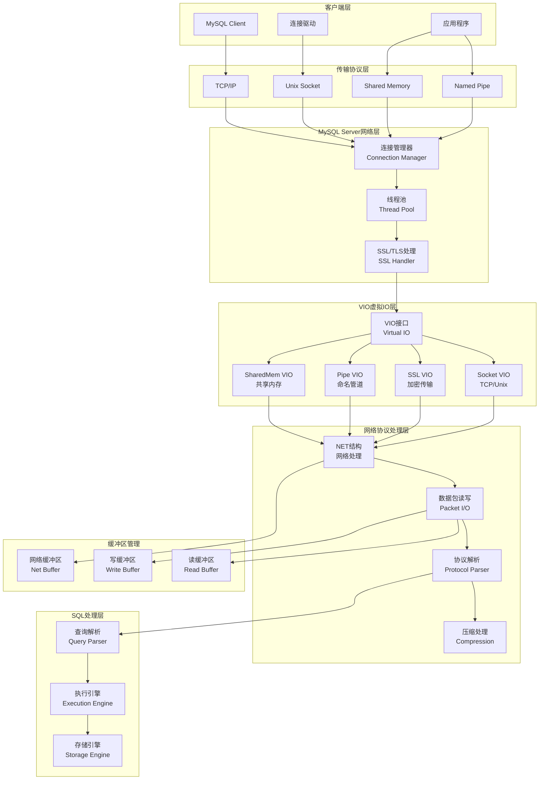
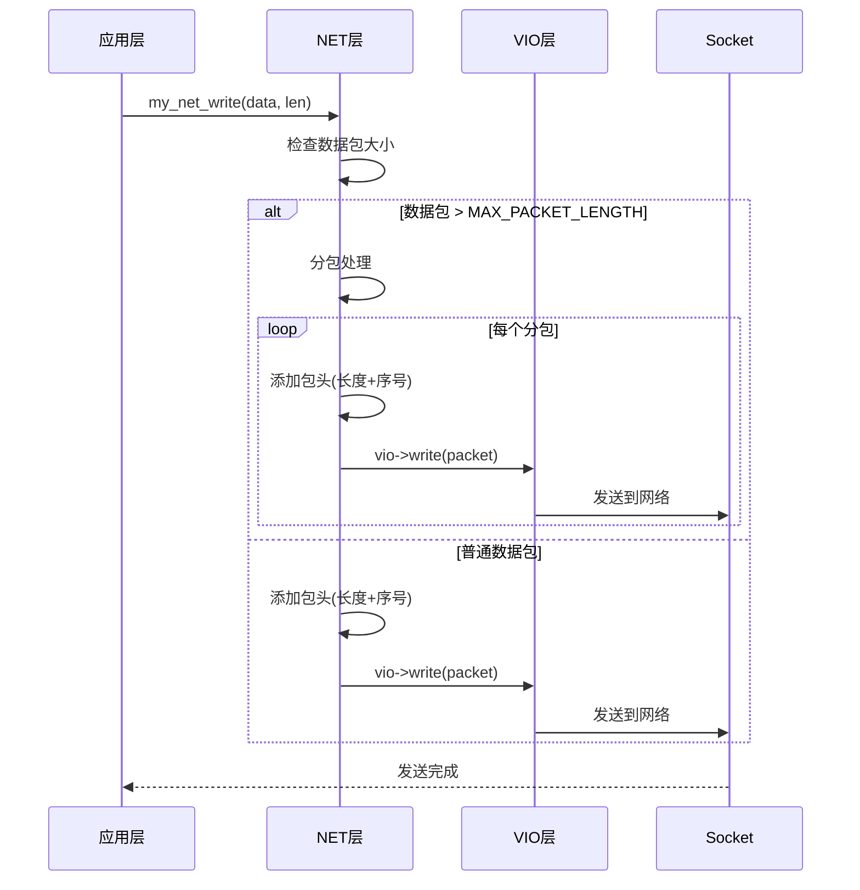
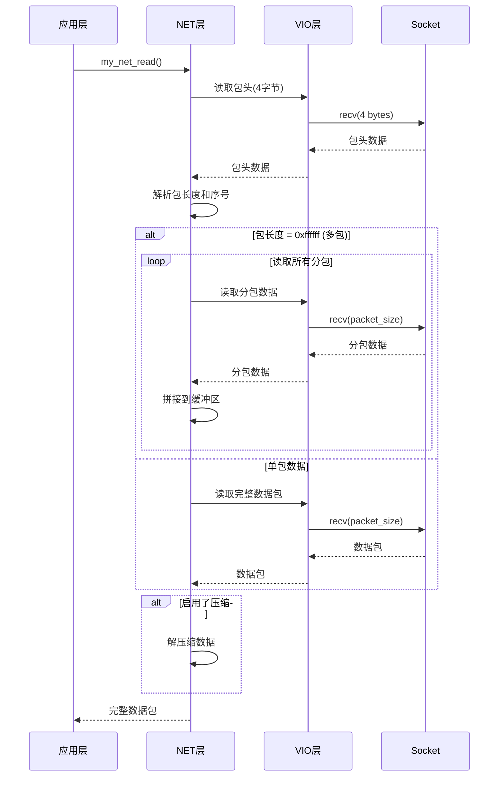
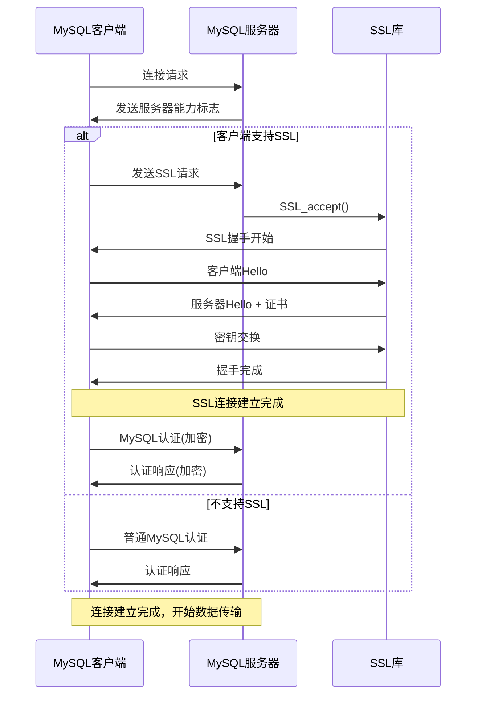
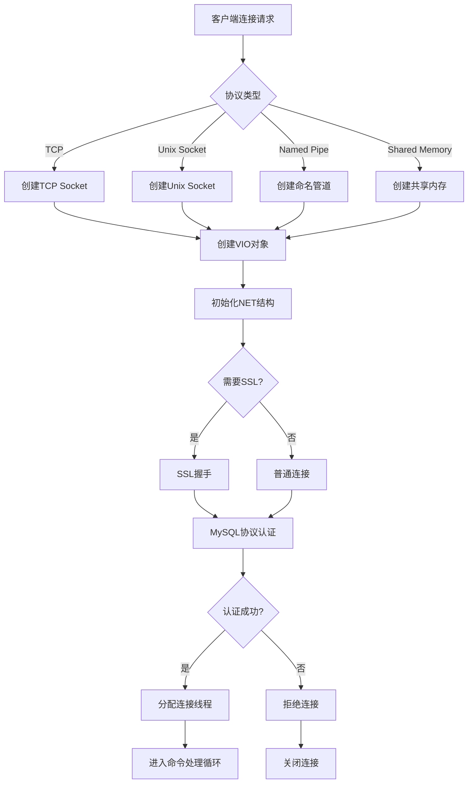
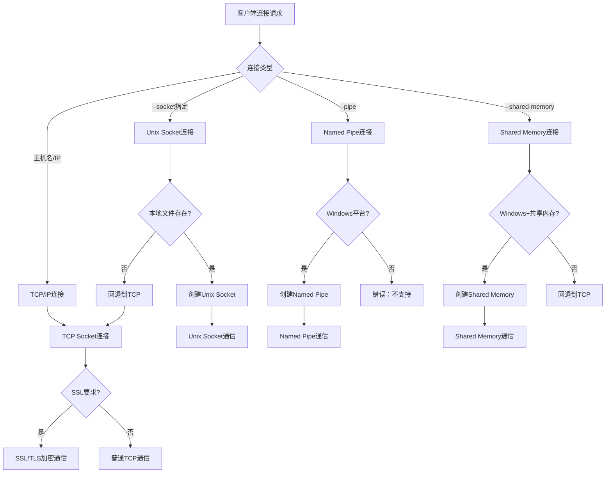
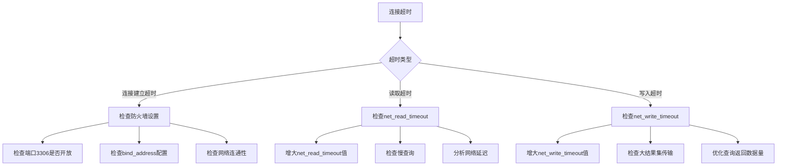

# MySQL 8.4 网络IO机制分析

## 概述

本文档详细分析MySQL 8.4中的网络IO机制，涵盖从连接建立到数据传输的完整网络处理流程，包括VIO虚拟IO层、网络协议处理、SSL/TLS加密传输等核心组件。

## MySQL 网络IO架构层次图



## 核心组件分析

### 1. VIO (Virtual I/O) 系统

VIO是MySQL网络IO的抽象层，为不同传输协议提供统一接口。

**位置：** `vio/vio.cc`

#### 1.1 VIO核心结构

```cpp
// VIO类定义
class Vio {
public:
  MYSQL_SOCKET mysql_socket;       // MySQL套接字
  struct sockaddr_storage local;    // 本地地址
  struct sockaddr_storage remote;   // 远程地址
  
  char *read_buffer;                // 读缓冲区
  char *read_pos;                   // 读位置指针
  char *read_end;                   // 读结束位置
  
  // VIO操作函数指针
  size_t (*read)(Vio *, uchar *, size_t);         // 读取数据
  size_t (*write)(Vio *, const uchar *, size_t);  // 写入数据
  int (*vioshutdown)(Vio *, int);                  // 关闭连接
  bool (*is_connected)(Vio *);                     // 检查连接状态
  int (*timeout)(Vio *, uint, bool);               // 设置超时
  
  // SSL相关
  void *ssl_arg;                    // SSL上下文
  
  // 超时配置
  uint read_timeout;                // 读超时
  uint write_timeout;               // 写超时
  uint retry_count;                 // 重试次数
};
```

#### 1.2 VIO类型和初始化

```cpp
// VIO类型枚举
enum enum_vio_type {
  VIO_TYPE_TCPIP,         // TCP/IP连接
  VIO_TYPE_SOCKET,        // Unix域套接字
  VIO_TYPE_NAMEDPIPE,     // 命名管道(Windows)
  VIO_TYPE_SSL,           // SSL加密连接
  VIO_TYPE_SHARED_MEMORY, // 共享内存(Windows)
  VIO_CLOSED              // 关闭的连接
};

// VIO初始化函数
bool vio_init(Vio *vio, enum enum_vio_type type, 
              MYSQL_SOCKET sd, uint flags) {
  
  vio->type = type;
  vio->mysql_socket = sd;
  
  // 根据VIO类型设置不同的操作函数
  switch (type) {
    case VIO_TYPE_TCPIP:
    case VIO_TYPE_SOCKET:
      vio->read = vio->read_buffer ? vio_read_buff : vio_read;
      vio->write = vio_write;
      vio->vioshutdown = vio_shutdown;
      vio->is_connected = vio_is_connected;
      vio->timeout = vio_socket_timeout;
      break;
      
    case VIO_TYPE_SSL:
      vio->read = vio_ssl_read;
      vio->write = vio_ssl_write;
      vio->vioshutdown = vio_ssl_shutdown;
      vio->is_connected = vio_is_connected;
      break;
      
    case VIO_TYPE_NAMEDPIPE:
      vio->read = vio_read_pipe;
      vio->write = vio_write_pipe;
      vio->vioshutdown = vio_shutdown_pipe;
      vio->is_connected = vio_is_connected_pipe;
      break;
      
    case VIO_TYPE_SHARED_MEMORY:
      vio->read = vio_read_shared_memory;
      vio->write = vio_write_shared_memory;
      vio->vioshutdown = vio_shutdown_shared_memory;
      vio->is_connected = vio_is_connected_shared_memory;
      break;
  }
  
  return false;
}
```

### 2. NET 网络处理结构

NET是MySQL网络数据包处理的核心结构，管理网络缓冲区和数据包的读写。

**位置：** `include/mysql_com.h`、`sql-common/net_serv.cc`

#### 2.1 NET结构定义

```cpp
// NET核心结构
typedef struct NET {
  MYSQL_VIO vio;                    // VIO处理器
  unsigned char *buff;              // 网络缓冲区
  unsigned char *buff_end;          // 缓冲区结束位置
  unsigned char *write_pos;         // 写位置指针
  unsigned char *read_pos;          // 读位置指针
  
  my_socket fd;                     // 文件描述符
  
  unsigned long remain_in_buf;      // 缓冲区剩余数据
  unsigned long length;             // 数据包长度
  unsigned long buf_length;         // 缓冲区大小
  unsigned long max_packet;         // 最大数据包大小
  unsigned long max_packet_size;    // 最大数据包限制
  
  unsigned int pkt_nr;              // 数据包序号
  unsigned int compress_pkt_nr;     // 压缩包序号
  
  unsigned int write_timeout;       // 写超时
  unsigned int read_timeout;        // 读超时
  unsigned int retry_count;         // 重试次数
  
  bool compress;                    // 是否启用压缩
  unsigned char error;              // 错误状态
  unsigned int last_errno;          // 最后错误号
  
  char last_error[MYSQL_ERRMSG_SIZE];  // 错误消息
  char sqlstate[SQLSTATE_LENGTH + 1];  // SQL状态
  
  void *extension;                  // 扩展指针
} NET;
```

#### 2.2 NET初始化和清理

```cpp
// NET初始化
bool my_net_init(NET *net, Vio *vio) {
  net->vio = vio;
  
  // 分配网络缓冲区
  if (!(net->buff = (uchar *)my_malloc(
          key_memory_NET_buff,
          (size_t)net->max_packet + NET_HEADER_SIZE + COMP_HEADER_SIZE,
          MYF(MY_WME)))) {
    return true;
  }
  
  net->buff_end = net->buff + net->max_packet;
  net->error = NET_ERROR_UNSET;
  net->pkt_nr = net->compress_pkt_nr = 0;
  net->write_pos = net->read_pos = net->buff;
  net->compress = false;
  net->reading_or_writing = 0;
  net->where_b = net->remain_in_buf = 0;
  net->last_errno = 0;
  
  return false;
}

// NET清理
void net_clear(NET *net, bool check_buffer) {
  // 重置包序号和写入位置
  net->pkt_nr = net->compress_pkt_nr = 0;
  net->write_pos = net->buff;
}
```

### 3. 网络数据包处理

#### 3.1 数据包写入流程



#### 3.2 数据包写入实现

```cpp
// 网络数据包写入
bool my_net_write(NET *net, const uchar *packet, size_t len) {
  uchar buff[NET_HEADER_SIZE];
  
  if (unlikely(!net->vio)) /* 无网络连接 */
    return false;
  
  // 设置为阻塞模式
  if (!vio_is_blocking(net->vio)) 
    vio_set_blocking_flag(net->vio, true);
  
  /*
    大数据包需要分包处理，每包最大 MAX_PACKET_LENGTH
    最后一个包的长度 < MAX_PACKET_LENGTH
  */
  while (len >= MAX_PACKET_LENGTH) {
    const ulong z_size = MAX_PACKET_LENGTH;
    
    // 构建包头：3字节长度 + 1字节序号
    int3store(buff, z_size);
    buff[3] = (uchar)net->pkt_nr++;
    
    // 发送包头和数据
    if (net_write_buff(net, buff, NET_HEADER_SIZE) ||
        net_write_buff(net, packet, z_size)) {
      return true;
    }
    
    packet += z_size;
    len -= z_size;
  }
  
  // 发送最后一个包
  int3store(buff, static_cast<uint>(len));
  buff[3] = (uchar)net->pkt_nr++;
  
  if (net_write_buff(net, buff, NET_HEADER_SIZE)) {
    return true;
  }
  
  return net_write_buff(net, packet, len);
}

// 缓冲写入
static bool net_write_buff(NET *net, const uchar *packet, ulong len) {
  ulong left_length = len;
  const uchar *pos = packet;
  
  // 如果缓冲区有足够空间，先写入缓冲区
  if (net->write_pos + len <= net->buff_end) {
    memcpy(net->write_pos, packet, len);
    net->write_pos += len;
    return false;
  }
  
  // 缓冲区不够，需要刷新并直接发送
  if (net_flush(net)) {
    return true;
  }
  
  // 如果数据包很大，直接发送，不经过缓冲
  while (left_length > 0) {
    ulong to_write = std::min(left_length, 
                             static_cast<ulong>(net->buff_end - net->write_pos));
    
    memcpy(net->write_pos, pos, to_write);
    net->write_pos += to_write;
    pos += to_write;
    left_length -= to_write;
    
    if (net->write_pos >= net->buff_end) {
      if (net_flush(net)) {
        return true;
      }
    }
  }
  
  return false;
}
```

#### 3.3 数据包读取流程



#### 3.4 数据包读取实现

```cpp
// 读取数据包
ulong my_net_read(NET *net) {
  size_t len;
  
  // 设置为阻塞模式
  if (!vio_is_blocking(net->vio)) 
    vio_set_blocking_flag(net->vio, true);
  
  if (net->compress)
    net_read_compressed_packet(net, len);
  else
    net_read_uncompressed_packet(net, len);
  
  return static_cast<ulong>(len);
}

// 读取未压缩数据包
static size_t net_read_uncompressed_packet(NET *net, size_t &len) {
  ulong pkt_len, complen = 0;
  
  net->reading_or_writing = 1;
  
  // 读取数据包
  len = net_read_packet(net, &complen);
  
  if (len == packet_error) {
    net->reading_or_writing = 0;
    return packet_error;
  }
  
  // 处理多包情况
  if (len == MAX_PACKET_LENGTH) {
    // 继续读取后续包
    size_t total_len = len;
    do {
      net->where_b = total_len;
      size_t next_len = net_read_packet(net, &complen);
      if (next_len == packet_error) {
        net->reading_or_writing = 0;
        return packet_error;
      }
      total_len += next_len;
    } while (next_len == MAX_PACKET_LENGTH);
    
    len = total_len;
  }
  
  net->read_pos = net->buff + net->where_b;
  net->reading_or_writing = 0;
  
  return len;
}

// 读取单个数据包
static size_t net_read_packet(NET *net, size_t *complen) {
  size_t pkt_len, pkt_data_len;
  
  *complen = 0;
  net->reading_or_writing = 1;
  
  // 重置压缩包序号
  net->compress_pkt_nr = net->pkt_nr;
  
  // 读取包头
  if (net_read_packet_header(net)) goto error;
  
  net->compress_pkt_nr = net->pkt_nr;
  
  // 处理压缩包
  if (net->compress) {
    *complen = uint3korr(&(net->buff[net->where_b + NET_HEADER_SIZE]));
  }
  
  // 获取包长度
  pkt_len = uint3korr(net->buff + net->where_b);
  
  // 多包结束标记
  if (!pkt_len) goto end;
  
  pkt_data_len = max(pkt_len, *complen) + net->where_b;
  
  // 扩展缓冲区
  if ((pkt_data_len >= net->max_packet) && net_realloc(net, pkt_data_len))
    goto error;
  
  // 读取包数据
  if (net_read_raw_loop(net, pkt_len)) goto error;
  
end:
  net->reading_or_writing = 0;
  return pkt_len;
  
error:
  net->reading_or_writing = 0;
  return packet_error;
}
```

### 4. SSL/TLS 加密传输

#### 4.1 SSL VIO实现

**位置：** `vio/viosslfactories.cc`、`vio/viossl.cc`

```cpp
// SSL读取函数
size_t vio_ssl_read(Vio *vio, uchar *buf, size_t size) {
  SSL *ssl = (SSL *)vio->ssl_arg;
  int ret;
  
  while ((ret = SSL_read(ssl, buf, (int)size)) < 0) {
    int ssl_error = SSL_get_error(ssl, ret);
    
    switch (ssl_error) {
      case SSL_ERROR_WANT_READ:
        // 需要等待可读数据
        if (vio_socket_io_wait(vio, VIO_IO_EVENT_READ))
          return VIO_SOCKET_ERROR;
        continue;
        
      case SSL_ERROR_WANT_WRITE:
        // SSL重新协商需要写入
        if (vio_socket_io_wait(vio, VIO_IO_EVENT_WRITE))
          return VIO_SOCKET_ERROR;
        continue;
        
      case SSL_ERROR_ZERO_RETURN:
        // SSL连接正常关闭
        return 0;
        
      default:
        // SSL错误
        return VIO_SOCKET_ERROR;
    }
  }
  
  return ret < 0 ? VIO_SOCKET_ERROR : ret;
}

// SSL写入函数
size_t vio_ssl_write(Vio *vio, const uchar *buf, size_t size) {
  SSL *ssl = (SSL *)vio->ssl_arg;
  int ret;
  
  while ((ret = SSL_write(ssl, buf, (int)size)) <= 0) {
    int ssl_error = SSL_get_error(ssl, ret);
    
    switch (ssl_error) {
      case SSL_ERROR_WANT_READ:
        if (vio_socket_io_wait(vio, VIO_IO_EVENT_READ))
          return VIO_SOCKET_ERROR;
        continue;
        
      case SSL_ERROR_WANT_WRITE:
        if (vio_socket_io_wait(vio, VIO_IO_EVENT_WRITE))
          return VIO_SOCKET_ERROR;
        continue;
        
      case SSL_ERROR_ZERO_RETURN:
        return 0;
        
      default:
        return VIO_SOCKET_ERROR;
    }
  }
  
  return ret;
}
```

#### 4.2 SSL连接建立流程



### 5. 连接管理和线程池

#### 5.1 连接建立流程



#### 5.2 连接管理实现

**位置：** `sql/sql_connect.cc`、`sql/connection_handler_manager.cc`

```cpp
// 连接处理函数
void handle_connection(MYSQL_SOCKET mysql_socket,
                      const sockaddr *addr_ptr,
                      socklen_t addr_len) {
  
  THD *thd = nullptr;
  
  // 创建线程描述符
  if (!(thd = new THD)) {
    mysql_socket_close(mysql_socket);
    return;
  }
  
  // 设置VIO
  Vio *vio = mysql_socket_vio_new(mysql_socket, VIO_TYPE_TCPIP);
  if (!vio) {
    delete thd;
    mysql_socket_close(mysql_socket);
    return;
  }
  
  // 初始化网络层
  if (my_net_init(&thd->net, vio)) {
    vio_delete(vio);
    delete thd;
    return;
  }
  
  // 设置连接属性
  thd->security_context()->set_host_ptr(
    my_gethostbyaddr_r(addr_ptr, addr_len, &ip_to_hostname,
                       &tmp_hostent, &buff, sizeof(buff), &tmp_errno));
  
  // SSL处理
  if (ssl_acceptor_fd) {
    if (ssl_accept(ssl_acceptor_fd, vio, thd->net.read_timeout,
                   &ssl_session_data_cache)) {
      // SSL握手失败
      thd->disconnect();
      delete thd;
      return;
    }
  }
  
  // MySQL协议认证
  if (check_connection(thd)) {
    thd->disconnect();
    delete thd;
    return;
  }
  
  // 进入命令处理循环
  do_command(thd);
  
  // 清理连接
  thd->disconnect();
  delete thd;
}

// 检查连接和认证
static int check_connection(THD *thd) {
  uint connect_errors = 0;
  NET *net = &thd->net;
  
  thd->set_time();
  
  // 发送握手包
  if (send_server_handshake_packet(thd, &thd->scramble[SCRAMBLE_LENGTH],
                                   thd->main_security_ctx.get_host()->ptr(),
                                   thd->main_security_ctx.get_ip()->ptr())) {
    return 1;
  }
  
  // 读取客户端认证响应
  ulong pkt_len = my_net_read(net);
  if (pkt_len == packet_error) {
    return 1;
  }
  
  // 解析认证数据包
  if (parse_client_handshake_packet(thd, net->read_pos, pkt_len)) {
    return 1;
  }
  
  // 执行认证检查
  if (acl_authenticate(thd)) {
    return 1;
  }
  
  return 0;
}
```

### 6. 异步网络IO

#### 6.1 非阻塞IO实现

```cpp
// 非阻塞读取
net_async_status my_net_read_nonblocking(NET *net, ulong *len_ptr) {
  net_async_status status;
  
  if (net->compress)
    status = net_read_compressed_nonblocking(net, len_ptr);
  else
    status = net_read_uncompressed_nonblocking(net, len_ptr);
  
  if (status == NET_ASYNC_NOT_READY) 
    return status;
  
  status = NET_ASYNC_COMPLETE;
  if (*len_ptr == packet_error) 
    return status;
  
  return status;
}

// 非阻塞数据读取
static net_async_status net_read_data_nonblocking(NET *net, size_t count,
                                                  bool *err_ptr) {
  NET_ASYNC *net_async = NET_ASYNC_DATA(net);
  *err_ptr = false;
  
  while (count > 0) {
    const size_t recvcnt = net_read_available(net, count);
    
    if (recvcnt == packet_error) {
      *err_ptr = true;
      return NET_ASYNC_COMPLETE;
    }
    
    if (recvcnt == 0) {
      // 需要等待更多数据
      return NET_ASYNC_NOT_READY;
    }
    
    count -= recvcnt;
  }
  
  return NET_ASYNC_COMPLETE;
}

// 读取可用数据
static ulong net_read_available(NET *net, size_t count) {
  size_t recvcnt;
  NET_ASYNC *net_async = NET_ASYNC_DATA(net);
  
  // 扩展缓冲区如果需要
  if (net_async->cur_pos + count > net->buff + net->max_packet) {
    if (net_realloc(net, net->max_packet + count)) {
      return packet_error;
    }
  }
  
  // 设置非阻塞模式
  if (vio_is_blocking(net->vio)) {
    vio_set_blocking_flag(net->vio, false);
  }
  
  recvcnt = vio_read(net->vio, net_async->cur_pos, count);
  
  /*
    处理SSL非阻塞模式的特殊情况
    SSL_ERROR_WANT_READ 或 SSL_ERROR_WANT_WRITE
  */
  if (recvcnt == VIO_SOCKET_WANT_READ) {
    net_async->async_blocking_state = NET_NONBLOCKING_READ;
    return 0;
  } else if (recvcnt == VIO_SOCKET_WANT_WRITE) {
    net_async->async_blocking_state = NET_NONBLOCKING_WRITE;
    return 0;
  }
  
  // 连接被阻塞
  if ((recvcnt == VIO_SOCKET_ERROR) &&
      (socket_errno == SOCKET_EAGAIN || 
       socket_errno == SOCKET_EWOULDBLOCK)) {
    net_async->async_blocking_state = NET_NONBLOCKING_READ;
    return 0;
  }
  
  // 正常读取到数据
  if (recvcnt != 0 && recvcnt != VIO_SOCKET_ERROR) {
    net_async->cur_pos += recvcnt;
    return recvcnt;
  }
  
  // EOF或硬错误
  net->error = NET_ERROR_SOCKET_UNUSABLE;
  net->last_errno = ER_NET_READ_ERROR;
  return packet_error;
}
```

### 7. 网络压缩

#### 7.1 压缩算法支持

```cpp
// 压缩上下文
struct mysql_compress_context {
  uchar *buffer;                    // 压缩缓冲区
  size_t buffer_length;             // 缓冲区大小
  
  // 支持的压缩算法
  enum enum_compression_algorithm {
    MYSQL_UNCOMPRESSED = 0,
    MYSQL_ZLIB,                     // zlib压缩
    MYSQL_ZSTD,                     // zstd压缩
    MYSQL_INVALID
  } algorithm;
  
  union {
    struct {
      z_stream strm;                // zlib流
    } zlib_ctx;
    
    struct {
      ZSTD_CStream *cstream;        // zstd压缩流
      ZSTD_DStream *dstream;        // zstd解压流
    } zstd_ctx;
  } u;
};

// 数据包压缩
static const uchar *compress_packet(NET *net, const uchar *packet, 
                                   size_t *length) {
  uchar *compr_packet;
  size_t compr_length;
  const size_t header_length = NET_HEADER_SIZE + COMP_HEADER_SIZE;
  
  mysql_compress_context *ctx = compress_context(net);
  if (!ctx) return nullptr;
  
  // 小包不压缩
  if (*length < MIN_COMPRESS_LENGTH) {
    return packet;
  }
  
  // 分配压缩缓冲区
  compr_length = *length + header_length + FN_REFLEN;
  if (!(compr_packet = (uchar *)my_malloc(key_memory_NET_compress_packet,
                                          compr_length, MYF(MY_WME)))) {
    return nullptr;
  }
  
  // 执行压缩
  size_t compressed_size = compr_length - header_length;
  if (mysql_compress_buffer(ctx, packet, *length,
                           compr_packet + header_length,
                           &compressed_size)) {
    my_free(compr_packet);
    return nullptr;
  }
  
  // 检查压缩效果
  if (compressed_size >= *length) {
    // 压缩效果不好，使用原数据
    my_free(compr_packet);
    int3store(&compr_packet[NET_HEADER_SIZE], 0);  // 未压缩标记
    return packet;
  }
  
  // 设置压缩包头
  int3store(&compr_packet[NET_HEADER_SIZE], (ulong)*length);  // 原始长度
  *length = compressed_size + header_length;
  
  return compr_packet;
}

// 数据包解压
static bool uncompress_packet(NET *net, size_t *complen) {
  uchar *compr_packet = net->buff + net->where_b;
  uchar *packet_end = net->buff + net->where_b + *complen;
  
  mysql_compress_context *ctx = compress_context(net);
  if (!ctx) return true;
  
  // 获取原始长度
  ulong uncompressed_length = uint3korr(&compr_packet[NET_HEADER_SIZE]);
  
  if (!uncompressed_length) {
    // 数据未压缩
    return false;
  }
  
  // 分配解压缓冲区
  if (uncompressed_length > net->max_packet &&
      net_realloc(net, uncompressed_length)) {
    return true;
  }
  
  // 执行解压
  size_t decompressed_size = uncompressed_length;
  if (mysql_uncompress_buffer(ctx, 
                             compr_packet + NET_HEADER_SIZE + COMP_HEADER_SIZE,
                             *complen - NET_HEADER_SIZE - COMP_HEADER_SIZE,
                             net->buff + net->where_b,
                             &decompressed_size)) {
    return true;
  }
  
  *complen = decompressed_size;
  return false;
}
```

### 8. 协议类型对比

#### 8.1 不同传输协议特性对比

| 协议类型 | 平台支持 | 性能 | 安全性 | 使用场景 |
|---------|---------|------|--------|----------|
| **TCP/IP** | 全平台 | 中等 | 中等(可SSL) | 远程连接、跨网络 |
| **Unix Socket** | Unix/Linux | 最高 | 高(本地) | 本地连接、高性能 |
| **Named Pipe** | Windows | 高 | 中等 | Windows本地连接 |
| **Shared Memory** | Windows | 最高 | 低 | Windows本地高性能 |
| **SSL/TLS** | 全平台 | 较低 | 最高 | 安全要求高的连接 |

#### 8.2 连接类型选择流程



## 性能优化策略

### 1. 网络缓冲区优化

#### 1.1 缓冲区大小调优

```sql
-- 网络缓冲区相关参数
SET GLOBAL net_buffer_length = 32768;          -- 网络缓冲区初始大小
SET GLOBAL max_allowed_packet = 1073741824;    -- 最大数据包大小(1GB)
SET GLOBAL net_read_timeout = 30;              -- 网络读超时
SET GLOBAL net_write_timeout = 60;             -- 网络写超时
```

#### 1.2 缓冲区动态调整

```cpp
// 动态调整网络缓冲区
bool my_net_shrink_buffer(NET *net, ulong min_buf_size,
                          ulong *max_interval_packet) {
  // 缓冲区已经是最小大小
  if (net->max_packet <= min_buf_size) 
    return false;
  
  ulong mip = *max_interval_packet;
  *max_interval_packet = min_buf_size;  // 重置下一个间隔的统计
  
  const float PCT_LIMIT = 110.0f / 100;
  
  // 如果最近的包都很大，不需要缩减
  if (mip * PCT_LIMIT >= net->max_packet) 
    return false;
  
  // 缓冲区不能小于最小值
  if (mip < min_buf_size) 
    mip = min_buf_size;
  
  // 执行缓冲区缩减
  if (net_realloc(net, mip)) 
    return true;
  
  return false;
}
```

### 2. 连接池管理

#### 2.1 连接池配置优化

```ini
[mysqld]
# 连接相关配置
max_connections = 1000              # 最大连接数
max_connect_errors = 100           # 最大连接错误数
connect_timeout = 10               # 连接超时
wait_timeout = 28800              # 等待超时
interactive_timeout = 28800       # 交互超时

# 线程池配置
thread_pool_size = 16             # 线程池大小
thread_pool_max_threads = 2000    # 最大线程数
thread_pool_stall_limit = 6       # 阻塞限制

# 网络优化
skip_networking = OFF             # 启用网络连接
bind_address = 0.0.0.0           # 绑定所有地址
port = 3306                      # 监听端口

# SSL配置
ssl_cipher = 'ECDHE-RSA-AES128-GCM-SHA256'
ssl_cert = '/path/to/server-cert.pem'
ssl_key = '/path/to/server-key.pem'
```

### 3. SSL/TLS 性能优化

#### 3.1 SSL会话复用

```cpp
// SSL会话缓存配置
class SSLSessionsCache {
private:
  std::unordered_map<std::string, SSL_SESSION*> cache_;
  mysql_mutex_t mutex_;
  
public:
  // 尝试复用SSL会话
  void try_reuse_session(MYSQL *mysql, const std::string &endpoint) {
    mysql_mutex_lock(&mutex_);
    
    auto it = cache_.find(endpoint);
    if (it != cache_.end() && it->second) {
      // 设置要复用的会话
      SSL_set_session(mysql->connector_fd, it->second);
    }
    
    mysql_mutex_unlock(&mutex_);
  }
  
  // 存储SSL会话以供复用
  void store_ssl_session(MYSQL *mysql, const std::string &endpoint) {
    SSL *ssl = (SSL *)mysql->connector_fd;
    SSL_SESSION *session = SSL_get1_session(ssl);
    
    if (session) {
      mysql_mutex_lock(&mutex_);
      
      // 清理旧会话
      auto it = cache_.find(endpoint);
      if (it != cache_.end() && it->second) {
        SSL_SESSION_free(it->second);
      }
      
      cache_[endpoint] = session;
      mysql_mutex_unlock(&mutex_);
    }
  }
};
```

#### 3.2 SSL密码套件优化

```sql
-- 推荐的SSL密码套件配置
SET GLOBAL ssl_cipher = 'ECDHE-RSA-AES128-GCM-SHA256:ECDHE-RSA-AES256-GCM-SHA384:ECDHE-RSA-CHACHA20-POLY1305';

-- TLS版本配置
SET GLOBAL tls_version = 'TLSv1.2,TLSv1.3';

-- SSL加密算法选择优先级
SHOW STATUS LIKE 'Ssl_cipher%';
```

### 4. 压缩传输优化

#### 4.1 压缩算法选择策略

```cpp
// 智能压缩策略
static bool should_compress_packet(NET *net, size_t packet_size) {
  // 小包不压缩
  if (packet_size < MIN_COMPRESS_LENGTH) {
    return false;
  }
  
  // 根据历史压缩比例决定
  if (net->compression_ratio < 0.9f) {  // 压缩效果不好
    return false;
  }
  
  // 根据网络条件决定
  if (is_local_connection(net) && packet_size < 8192) {
    return false;  // 本地连接小包不压缩
  }
  
  return true;
}

// 自适应压缩级别
static int adaptive_compression_level(NET *net, size_t packet_size) {
  // 根据包大小调整压缩级别
  if (packet_size < 64 * 1024) {
    return 1;  // 快速压缩
  } else if (packet_size < 1024 * 1024) {
    return 6;  // 平衡压缩
  } else {
    return 9;  // 最大压缩
  }
}
```

### 5. 监控和诊断

#### 5.1 网络性能监控

```sql
-- 网络连接状态监控
SHOW STATUS LIKE 'Connections';
SHOW STATUS LIKE 'Threads%';
SHOW STATUS LIKE 'Bytes_%';
SHOW STATUS LIKE 'Com_%';

-- SSL连接监控
SHOW STATUS LIKE 'Ssl_%';

-- 网络错误监控
SHOW STATUS LIKE '%_errors';
SHOW STATUS LIKE 'Aborted_%';

-- 连接详细信息
SELECT * FROM performance_schema.processlist;
SELECT * FROM performance_schema.socket_summary_by_instance;
```

#### 5.2 网络诊断工具

```bash
#!/bin/bash
# MySQL网络诊断脚本

echo "=== MySQL网络连接诊断 ==="

# 1. 连接数统计
echo "当前连接数:"
mysql -e "SHOW STATUS LIKE 'Threads_connected';"

# 2. 网络流量统计
echo "网络流量统计:"
mysql -e "SHOW STATUS LIKE 'Bytes_%';"

# 3. SSL连接统计
echo "SSL连接状态:"
mysql -e "SHOW STATUS LIKE 'Ssl_%';"

# 4. 连接错误统计
echo "连接错误统计:"
mysql -e "SHOW STATUS LIKE 'Aborted_%';"

# 5. 网络配置检查
echo "网络配置:"
mysql -e "SHOW VARIABLES LIKE '%timeout%';"
mysql -e "SHOW VARIABLES LIKE 'max_%connections%';"

# 6. 系统网络状态
echo "系统网络连接:"
netstat -an | grep :3306 | head -10

# 7. 网络延迟测试
echo "网络延迟测试:"
ping -c 4 localhost
```

#### 5.3 性能分析查询

```sql
-- 连接性能分析
SELECT 
    user,
    host,
    count(*) as connections,
    sum(bytes_received) as total_bytes_received,
    sum(bytes_sent) as total_bytes_sent,
    avg(bytes_received) as avg_bytes_received,
    avg(bytes_sent) as avg_bytes_sent
FROM performance_schema.socket_summary_by_instance si
JOIN performance_schema.socket_instances si2 ON si.object_instance_begin = si2.object_instance_begin
GROUP BY user, host
ORDER BY total_bytes_received DESC;

-- SSL连接性能
SELECT 
    ssl_cipher,
    ssl_version,
    count(*) as connection_count
FROM performance_schema.session_status
WHERE variable_name IN ('Ssl_cipher', 'Ssl_version')
GROUP BY ssl_cipher, ssl_version;

-- 网络IO等待分析
SELECT 
    thread_id,
    event_name,
    count_star,
    sum_timer_wait/1000000000 as sum_wait_sec,
    avg_timer_wait/1000000000 as avg_wait_sec
FROM performance_schema.events_waits_summary_by_thread_by_event_name
WHERE event_name LIKE 'wait/io/socket/%'
ORDER BY sum_timer_wait DESC
LIMIT 20;
```

## 故障排查指南

### 1. 常见网络问题

#### 1.1 连接超时问题



#### 1.2 SSL连接问题诊断

```sql
-- SSL状态检查
SHOW STATUS LIKE 'Ssl_%';

-- SSL证书验证
SELECT 
    @@ssl_cert as ssl_cert_file,
    @@ssl_key as ssl_key_file,
    @@ssl_ca as ssl_ca_file;

-- SSL连接详情
SELECT 
    connection_id(),
    variable_name,
    variable_value
FROM performance_schema.session_status
WHERE variable_name LIKE 'Ssl_%';
```

### 2. 性能问题诊断

#### 2.1 网络瓶颈识别

```sql
-- 识别高网络IO的连接
SELECT 
    p.id,
    p.user,
    p.host,
    p.db,
    p.command,
    p.time,
    p.state,
    p.info,
    t.bytes_received,
    t.bytes_sent
FROM information_schema.processlist p
JOIN performance_schema.socket_summary_by_instance t 
    ON p.id = t.object_instance_begin
WHERE t.bytes_received > 1024*1024*10  -- 超过10MB
   OR t.bytes_sent > 1024*1024*10
ORDER BY (t.bytes_received + t.bytes_sent) DESC;
```

### 3. 连接池耗尽问题

```sql
-- 连接使用情况分析
SELECT 
    @@max_connections as max_conn,
    @@thread_cache_size as thread_cache,
    (SELECT variable_value FROM performance_schema.global_status 
     WHERE variable_name='Threads_connected') as current_conn,
    (SELECT variable_value FROM performance_schema.global_status 
     WHERE variable_name='Threads_running') as running_conn;

-- 长时间运行的连接
SELECT 
    id,
    user,
    host,
    db,
    command,
    time,
    state,
    LEFT(info, 100) as query_start
FROM information_schema.processlist
WHERE time > 300  -- 运行超过5分钟
ORDER BY time DESC;
```

## 总结

MySQL的网络IO系统是一个多层次、高度优化的架构：

### 核心设计原则
1. **分层抽象**: VIO层提供统一的IO接口，支持多种传输协议
2. **高效缓冲**: NET结构管理网络缓冲区，优化数据包处理
3. **协议兼容**: 完整的MySQL网络协议支持，包括认证和SSL
4. **性能优化**: 异步IO、连接池、数据压缩等多种优化技术
5. **安全传输**: 完整的SSL/TLS支持，保证数据传输安全

### 关键技术特性
- **多协议支持**: TCP、Unix Socket、Named Pipe、Shared Memory
- **SSL/TLS加密**: 完整的加密连接支持和会话复用
- **数据压缩**: zlib和zstd压缩算法，智能压缩策略
- **异步IO**: 非阻塞网络操作，提高并发性能
- **连接管理**: 完善的连接池和线程管理机制

### 性能优化要点
- **协议选择**: 根据使用场景选择合适的传输协议
- **缓冲区调优**: 合理配置网络缓冲区大小
- **SSL优化**: 启用会话复用，选择高效密码套件
- **压缩策略**: 基于网络条件智能选择压缩
- **监控调优**: 持续监控网络性能指标

这套网络IO机制确保了MySQL在各种网络环境下都能提供稳定、高效、安全的数据传输服务。
