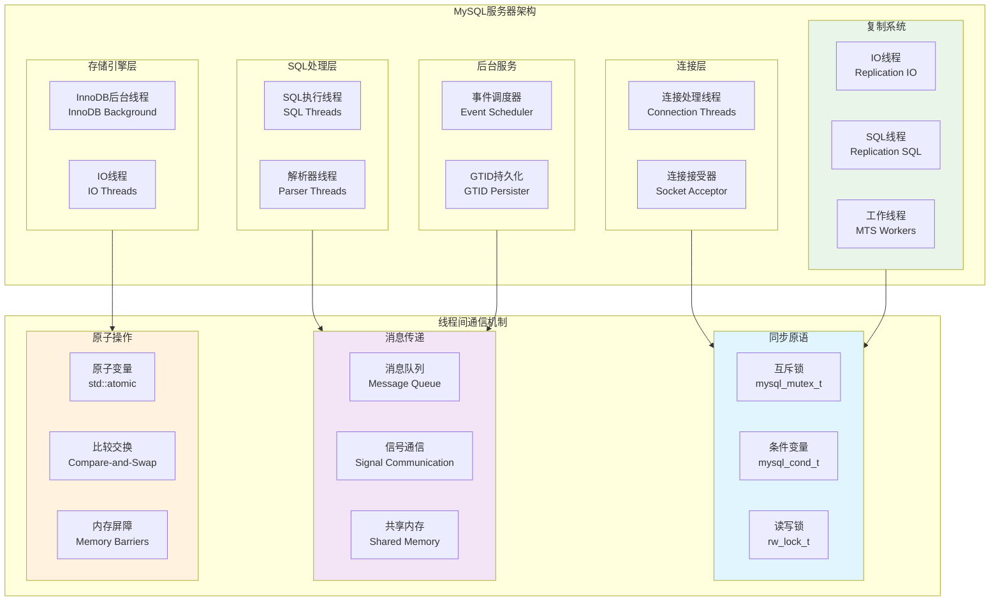
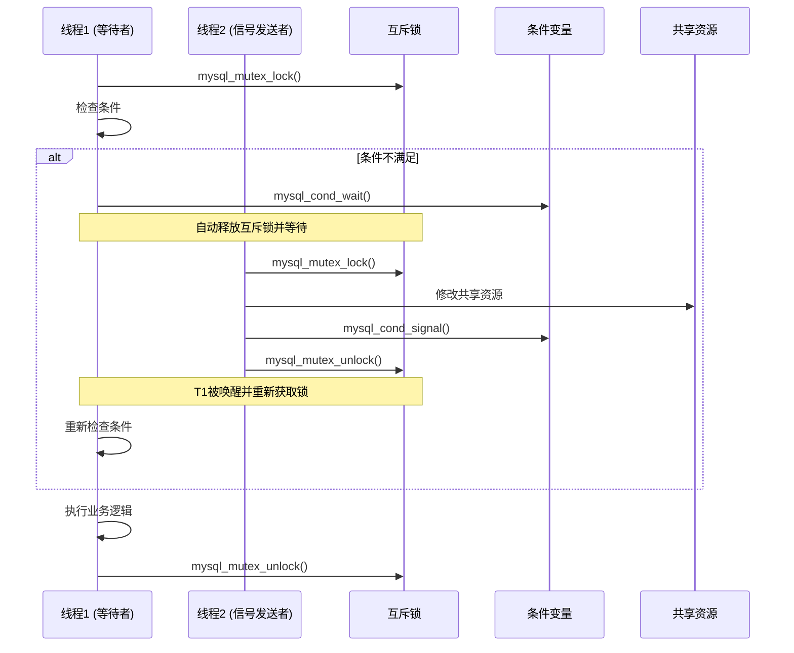
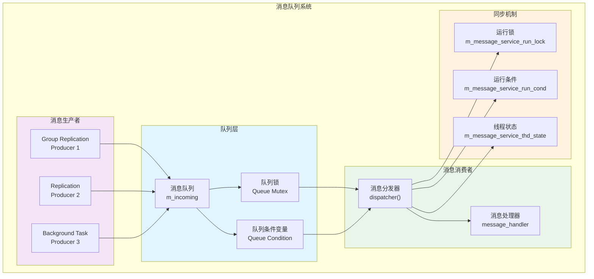
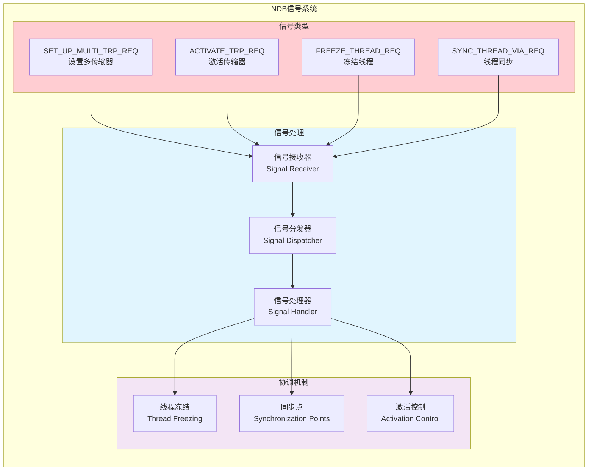
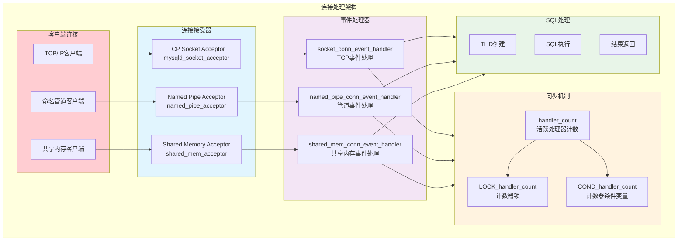
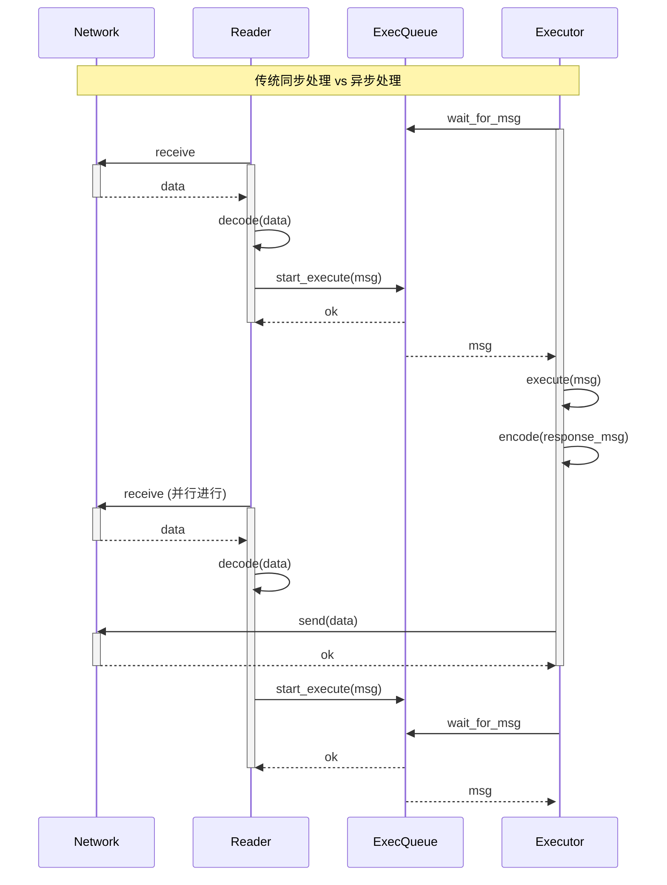
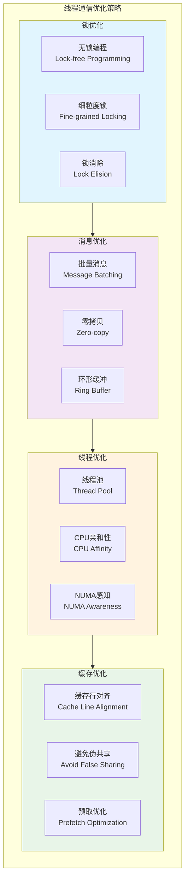

# MySQL 源码中的线程间通信机制深度分析

## 概述

MySQL作为一个高并发的数据库系统，内部使用了大量的线程来处理不同的任务。线程间的协调与通信是保证系统正确性和高性能的关键。通过深入分析MySQL源码，发现其使用了多种成熟的线程间通信机制。

**核心通信机制**：
- **互斥锁与条件变量** (Mutex & Condition Variables)
- **消息队列** (Message Queues) 
- **信号机制** (Signal-based Communication)
- **共享内存** (Shared Memory)
- **读写锁** (Reader-Writer Locks)
- **原子操作** (Atomic Operations)

## MySQL 线程间通信架构总览

### 1. 整体架构图



## 1. 互斥锁与条件变量机制

### 1.1 基础同步原语

**源码位置**: `include/mysql/psi/mysql_mutex.h`、`include/mysql/psi/mysql_cond.h`

```cpp
// MySQL互斥锁封装
typedef struct st_mysql_mutex {
  mysql_mutex_t m_mutex;
  struct PSI_mutex *m_psi;
} mysql_mutex_t;

// MySQL条件变量封装  
typedef struct st_mysql_cond {
  mysql_cond_t m_cond;
  struct PSI_cond *m_psi;
} mysql_cond_t;
```

### 1.2 典型使用模式

#### 事件调度器的条件等待

**源码位置**: `sql/event_scheduler.cc:890-921`

```cpp
void Event_scheduler::cond_wait(THD *thd, struct timespec *abstime,
                                const PSI_stage_info *stage,
                                const char *src_func, const char *src_file,
                                uint src_line) {
  DBUG_TRACE;
  waiting_on_cond = true;
  mutex_last_unlocked_at_line = src_line;
  mutex_scheduler_data_locked = false;
  mutex_last_unlocked_in_func = src_func;
  
  if (thd)
    thd->enter_cond(&COND_state, &LOCK_scheduler_state, stage, nullptr,
                    src_func, src_file, src_line);

  DBUG_PRINT("info", ("mysql_cond_%swait", abstime ? "timed" : ""));
  if (!abstime)
    mysql_cond_wait(&COND_state, &LOCK_scheduler_state);
  else
    mysql_cond_timedwait(&COND_state, &LOCK_scheduler_state, abstime);
    
  // 清理和解锁逻辑
  if (thd) {
    UNLOCK_DATA();
    thd->exit_cond(nullptr, src_func, src_file, src_line);
    LOCK_DATA();
  }
  mutex_last_locked_in_func = src_func;
  mutex_last_locked_at_line = src_line;
  mutex_scheduler_data_locked = true;
  waiting_on_cond = false;
}
```

#### 互斥锁与条件变量协作图



### 1.3 高级同步结构

#### Plugin_waitlock 封装类

**源码位置**: `plugin/group_replication/include/plugin_utils.h:797-875`

```cpp
class Plugin_waitlock {
public:
  Plugin_waitlock(mysql_mutex_t *lock, mysql_cond_t *cond,
                  PSI_mutex_key lock_key, PSI_cond_key cond_key)
      : wait_lock(lock), wait_cond(cond), key_lock(lock_key),
        key_cond(cond_key), wait_status(false) {
    mysql_mutex_init(key_lock, wait_lock, MY_MUTEX_INIT_FAST);
    mysql_cond_init(key_cond, wait_cond);
  }

  void set_wait_lock(bool status) {
    mysql_mutex_lock(wait_lock);
    wait_status = status;
    mysql_mutex_unlock(wait_lock);
  }

  void start_waitlock() {
    DBUG_TRACE;
    mysql_mutex_lock(wait_lock);
    while (wait_status) {
      DBUG_PRINT("sleep", ("Waiting in Plugin_waitlock::start_waitlock()"));
      mysql_cond_wait(wait_cond, wait_lock);
    }
    mysql_mutex_unlock(wait_lock);
  }

  void end_wait_lock() {
    mysql_mutex_lock(wait_lock);
    wait_status = false;
    mysql_cond_broadcast(wait_cond);
    mysql_mutex_unlock(wait_lock);
  }

private:
  mysql_mutex_t *wait_lock;
  mysql_cond_t *wait_cond;
  PSI_mutex_key key_lock;
  PSI_cond_key key_cond;
  bool wait_status;
};
```

## 2. 消息队列机制

### 2.1 Group Replication 消息服务

**源码位置**: `plugin/group_replication/src/services/message_service/message_service.cc:144-201`

```cpp
void Message_service_handler::dispatcher() {
  DBUG_TRACE;

  bool pop_failed = false;

  // 线程上下文初始化
  THD *thd = new THD;
  my_thread_init();
  thd->set_new_thread_id();
  thd->thread_stack = (char *)&thd;
  thd->store_globals();
  thd->set_skip_readonly_check();
  global_thd_manager_add_thd(thd);

  mysql_mutex_lock(&m_message_service_run_lock);
  m_message_service_thd_state.set_running();
  mysql_cond_broadcast(&m_message_service_run_cond);
  mysql_mutex_unlock(&m_message_service_run_lock);

  while (!m_aborted) {
    if (thd->killed) {
      m_aborted = true;
      break;
    }

    Group_service_message *service_message = nullptr;
    pop_failed = m_incoming->pop(&service_message);

    if (pop_failed || service_message == nullptr) break;

    if (notify_message_service_recv(service_message)) {
      // 处理消息失败的逻辑
    }
    
    delete service_message;
  }
  
  // 清理工作
  global_thd_manager_remove_thd(thd);
  delete thd;
  my_thread_end();
}
```

### 2.2 消息队列架构图



## 3. 信号机制

### 3.1 NDB Cluster 信号通信

**源码位置**: `storage/ndb/src/kernel/blocks/qmgr/QmgrMain.cpp:8414-8553`

NDB Cluster使用了复杂的信号机制来协调多个数据节点：

```cpp
/**
 * SET_UP_MULTI_TRP_REQ 启动多套接字传输器的设置
 * 这个信号在启动阶段3从NDBCNTR发送，用于设置多传输器连接
 * 
 * 信号流程：
 * NDBCNTR/DBDIH          QMGR                              QMGR neighbour
 *    SET_UP_MULTI_TRP_REQ
 *    ------------------->
 *                        GET_NUM_MULTI_TRP_REQ
 *                        ------------------------------------->
 *                        GET_NUM_MULTI_TRP_CONF
 *                        <------------------------------------
 *                     Create multi transporters
 *                     Connect multi transporters
 */
void Qmgr::execSET_UP_MULTI_TRP_REQ(Signal *signal) {
  // 处理多传输器设置请求的逻辑
}
```

### 3.2 信号处理架构



## 4. 共享内存与原子操作

### 4.1 Key Cache 锁机制

**源码位置**: `mysys/mf_keycache.cc:52-96`

```cpp
/*
  Key Cache Locking
  =================

  所有key cache锁定都通过每个key cache的单个互斥锁完成：
  keycache->cache_lock。这个互斥锁在执行此文件中的代码时几乎
  一直被锁定。但是在I/O和一些复制操作时会被释放。

  等待和信号通过条件变量完成。在大多数情况下，线程在其
  thread->suspend条件变量上等待。每个线程都有一个my_thread_var
  结构，包含此变量和一个'*next'和'**prev'指针。这些指针用于
  将线程插入等待队列。

  一个线程可以等待一个块，因此一次只能在一个等待队列中。

  在开始用mysql_cond_wait()等待其条件变量之前，线程使用
  link_into_queue()（用'*next'+'**prev'双向链接）或
  wait_on_queue()（用'*next'单向链接）将自己加入到特定的等待队列中。

  另一个线程在释放资源时，在相关等待队列中查找等待线程。
  它用mysql_cond_signal()向等待线程发送信号。
*/
```

### 4.2 原子操作在GTID系统中的应用

**源码位置**: `sql/rpl_gtid.h:988-1071`

```cpp
/**
 * GTID等待机制中的原子操作
 * 在TSID锁和第n个互斥锁的保护下等待第n个条件变量的信号
 */
inline bool wait(const THD *thd, int sidno, struct timespec *abstime) const {
  DBUG_TRACE;
  int error = 0;
  Mutex_cond *mutex_cond = get_mutex_cond(sidno);
  global_lock->unlock();
  mysql_mutex_assert_owner(&mutex_cond->mutex);
  
  if (is_thd_killed(thd)) return true;
  
  if (abstime != nullptr)
    error = mysql_cond_timedwait(&mutex_cond->cond, &mutex_cond->mutex, abstime);
  else
    mysql_cond_wait(&mutex_cond->cond, &mutex_cond->mutex);
    
  mysql_mutex_assert_owner(&mutex_cond->mutex);
  return is_timeout(error);
}

// 互斥锁/条件变量对
struct Mutex_cond {
  mysql_mutex_t mutex;
  mysql_cond_t cond;
};
```

## 5. 连接处理中的线程通信

### 5.1 连接事件处理器

**源码位置**: `sql/mysqld.cc:3665-3713`

```cpp
void setup_conn_event_handler_threads() {
  my_thread_handle hThread;
  DBUG_TRACE;

  if ((!have_tcpip || opt_disable_networking) && !opt_enable_shared_memory &&
      !opt_enable_named_pipe) {
    LogErr(ERROR_LEVEL, ER_WIN_LISTEN_BUT_HOW);
    unireg_abort(MYSQLD_ABORT_EXIT);
  }

  mysql_mutex_lock(&LOCK_handler_count);
  handler_count = 0;

  // 创建命名管道连接处理线程
  if (opt_enable_named_pipe) {
    const int error = mysql_thread_create(
        key_thread_handle_con_namedpipes, &hThread, &connection_attrib,
        named_pipe_conn_event_handler, named_pipe_acceptor);
    if (!error)
      handler_count++;
    else
      LogErr(WARNING_LEVEL, ER_CANT_CREATE_NAMED_PIPES_THREAD, error);
  }

  // 创建TCP/IP连接处理线程
  if (have_tcpip && !opt_disable_networking) {
    const int error = mysql_thread_create(
        key_thread_handle_con_sockets, &hThread, &connection_attrib,
        socket_conn_event_handler, mysqld_socket_acceptor);
    if (!error)
      handler_count++;
    else
      LogErr(WARNING_LEVEL, ER_CANT_CREATE_TCPIP_THREAD, error);
  }

  // 创建共享内存连接处理线程
  if (opt_enable_shared_memory) {
    const int error = mysql_thread_create(
        key_thread_handle_con_sharedmem, &hThread, &connection_attrib,
        shared_mem_conn_event_handler, shared_mem_acceptor);
    if (!error)
      handler_count++;
    else
      LogErr(WARNING_LEVEL, ER_CANT_CREATE_SHM_THREAD, error);
  }

  // 阻塞直到所有连接监听线程退出
  while (handler_count > 0)
    mysql_cond_wait(&COND_handler_count, &LOCK_handler_count);
  mysql_mutex_unlock(&LOCK_handler_count);
}
```

### 5.2 连接处理架构图



## 6. X Protocol 的异步处理机制

### 6.1 Reader-Executor 解耦

**源码位置**: `plugin/x/protocol/doc/mysqlx-protocol-implementation.dox:254-308`

X Protocol实现了Reader和Executor线程的解耦，使用消息队列进行通信：



## 7. 线程间通信机制总结

### 7.1 各机制对比分析

| 通信机制 | 适用场景 | 性能特征 | 源码位置示例 | 典型用途 |
|----------|----------|----------|-------------|----------|
| **互斥锁+条件变量** | 简单同步、资源保护 | 低延迟、高效 | `sql/event_scheduler.cc:905` | 事件调度、线程同步 |
| **消息队列** | 异步通信、任务分发 | 中等延迟、解耦 | `plugin/group_replication/src/services/message_service/message_service.cc:188` | Group Replication消息 |
| **信号机制** | 复杂协调、状态通知 | 低延迟、精确控制 | `storage/ndb/src/kernel/blocks/qmgr/QmgrMain.cpp:8553` | NDB集群协调 |
| **共享内存** | 大数据传输、缓存 | 高吞吐、低延迟 | `mysys/mf_keycache.cc:52` | Key Cache、缓冲区 |
| **原子操作** | 无锁编程、计数器 | 极低延迟、无阻塞 | `sql/rpl_gtid.h:1009` | GTID计数、状态标志 |
| **读写锁** | 读多写少场景 | 高并发读取 | InnoDB各种Latch | 索引访问、元数据保护 |

### 7.2 性能优化策略



### 7.3 最佳实践建议

#### ✅ 推荐做法

1. **选择合适的通信机制**
   - 简单同步：互斥锁+条件变量
   - 异步通信：消息队列
   - 高性能场景：原子操作
   - 复杂协调：信号机制

2. **避免死锁**
   - 统一的锁获取顺序
   - 使用超时机制
   - 锁粒度最小化

3. **性能优化**
   - 减少锁持有时间
   - 使用读写锁提高并发
   - 批量处理消息

4. **错误处理**
   - 超时检测
   - 异常恢复
   - 资源清理

#### ❌ 常见误区

- **过度使用锁**：导致性能瓶颈
- **锁粒度过粗**：降低并发性
- **忽视死锁风险**：系统稳定性问题
- **消息队列无界**：内存泄漏风险

## 总结

MySQL源码中的线程间通信机制展现了现代数据库系统的复杂性和精妙设计：

- **多层次架构**：从基础的互斥锁到复杂的信号协调机制
- **性能导向**：针对不同场景选择最优的通信方式
- **可扩展性**：支持从单线程到大规模并发的各种部署
- **容错性**：完善的错误检测和恢复机制

这些通信机制的合理运用，使MySQL能够在保证数据一致性的同时，实现高并发、高性能的数据处理能力。深入理解这些机制，对于MySQL的性能调优、故障排查和架构设计都具有重要意义。
