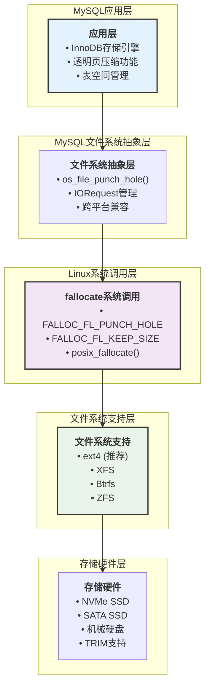
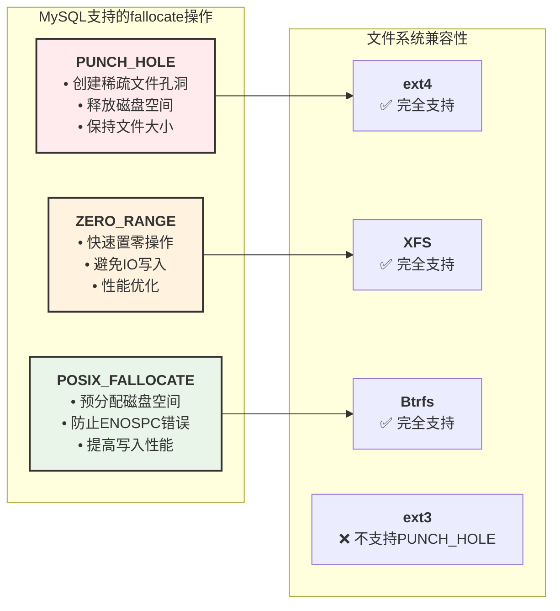
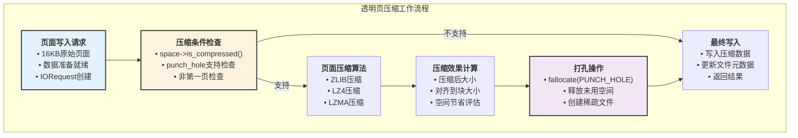
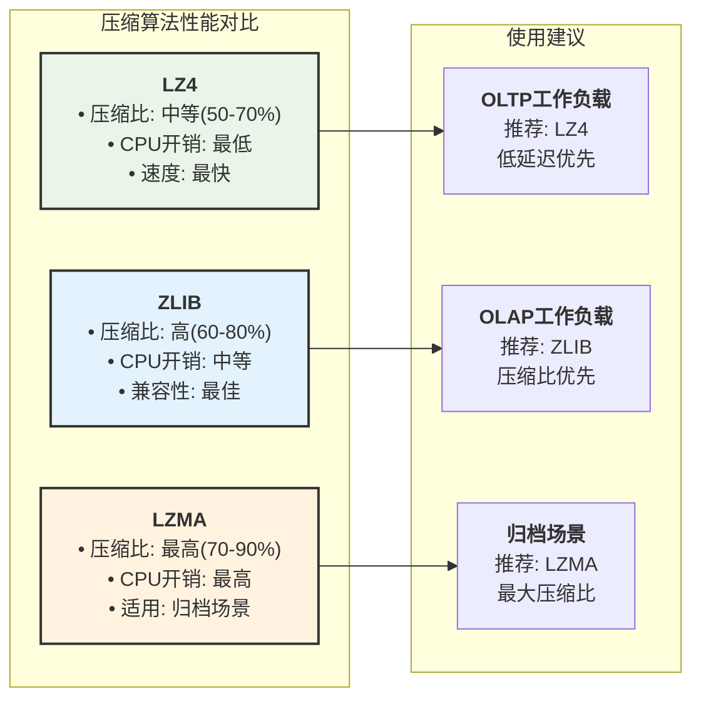
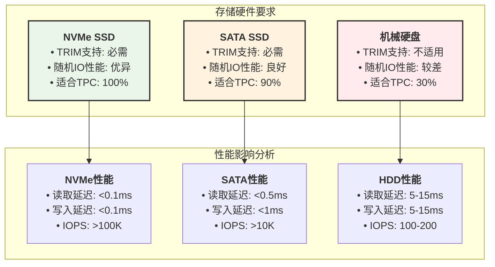
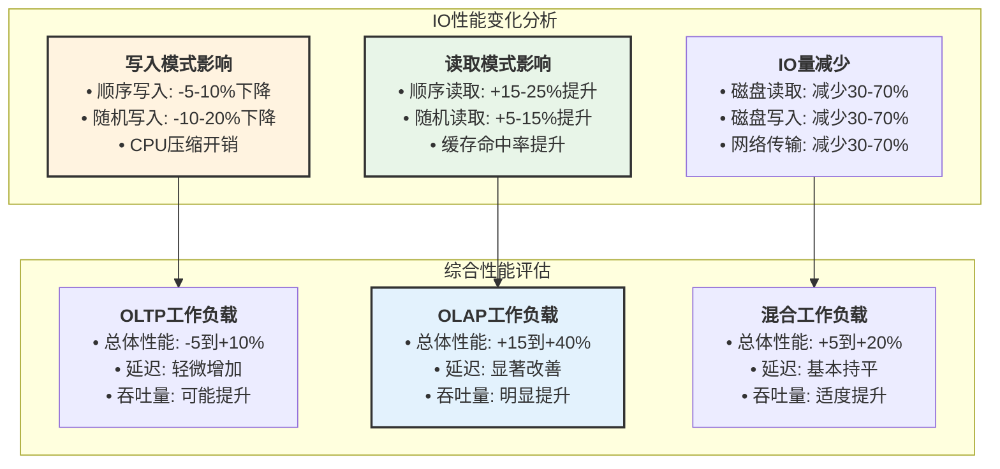
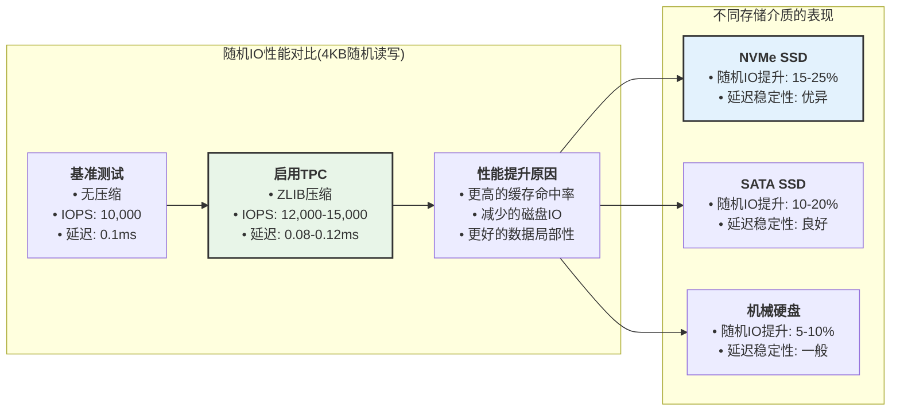
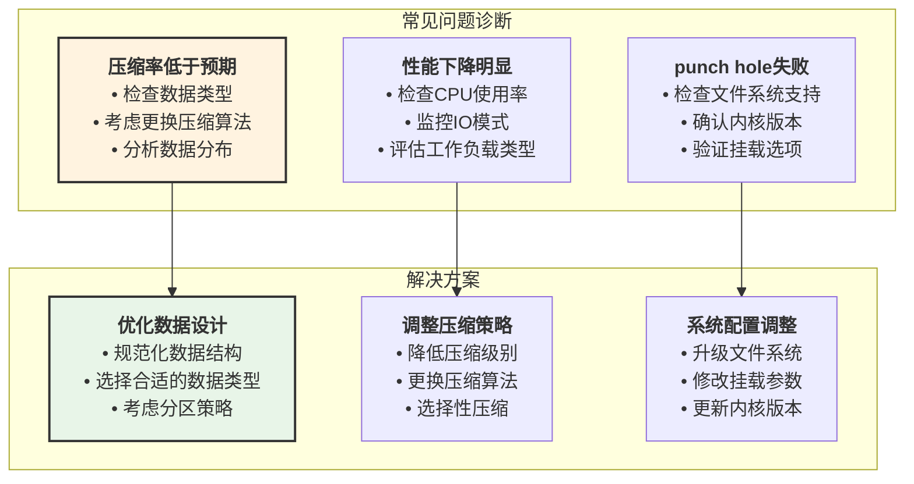

# MySQL Linux打孔技术与透明页压缩技术深度分析

## 概述

MySQL通过Linux的**打孔技术(Hole Punching)**和**fallocate命令**实现了高效的存储空间管理，特别是在**透明页压缩(Transparent Page Compression, TPC)**功能中发挥关键作用。本文档基于MySQL 8.4源码深入分析这些技术的实现原理、使用方式、性能影响和应用限制。

## MySQL打孔技术架构总览



## Linux Fallocate命令使用分析

### 1. 核心系统调用实现

#### **fallocate打孔实现**

**源码位置**: `storage/innobase/os/os0file.cc:2089-2128`

```cpp
/** 使用POSIX fallocate实现打孔功能 */
static dberr_t os_file_punch_hole_posix(os_file_t fh, os_offset_t off,
                                        os_offset_t len) {
#ifdef HAVE_FALLOC_PUNCH_HOLE_AND_KEEP_SIZE
  // 组合标志：打孔 + 保持文件大小
  const int mode = FALLOC_FL_PUNCH_HOLE | FALLOC_FL_KEEP_SIZE;

  int ret = fallocate(fh, mode, off, len);

  if (ret == 0) {
    return (DB_SUCCESS);  // 成功创建稀疏文件孔洞
  }

  ut_a(ret == -1);

  if (errno == ENOTSUP) {
    return (DB_IO_NO_PUNCH_HOLE);  // 文件系统不支持
  }

  // 记录详细错误信息
  const auto fd_path = os_file_find_path_for_fd(fh);
  ib::warn() << "fallocate(" << fh << " (" << fd_path
             << "), FALLOC_FL_PUNCH_HOLE | FALLOC_FL_KEEP_SIZE, " 
             << off << ", " << len << ") returned errno: " << errno;

  return (DB_IO_ERROR);
#else
  return (DB_IO_NO_PUNCH_HOLE);  // 编译时不支持
#endif
}
```

#### **posix_fallocate预分配实现**

**源码位置**: `storage/innobase/fil/fil0fil.cc:5504`

```cpp
/** 使用posix_fallocate预分配磁盘空间 */
ret = posix_fallocate(file.m_file, 0, sz);

if (ret == 0) {
  success = true;
  if (type == FIL_TYPE_TEMPORARY || 
      fil_fusionio_enable_atomic_write(file)) {
    atomic_write = true;  // 启用原子写入
  }
} else {
  // 预分配失败，回退到传统写入方式
  ib::warn(ER_IB_MSG_303, path, sz, ret, strerror(errno));
}
```

### 2. 支持的fallocate操作类型



### 3. 系统调用使用场景

| **命令** | **MySQL使用场景** | **参数组合** | **效果** |
|----------|-------------------|---------------|----------|
| `fallocate -p` | **透明页压缩** | `FALLOC_FL_PUNCH_HOLE \| FALLOC_FL_KEEP_SIZE` | 创建孔洞，释放空间 |
| `fallocate -z` | **快速文件扩展** | `FALLOC_FL_ZERO_RANGE` | 快速置零，避免IO |
| `posix_fallocate` | **表空间预分配** | `offset=0, size=total_size` | 预分配连续空间 |

## 透明页压缩(TPC)技术深度解析

### 1. TPC架构原理



### 2. TPC核心实现代码分析

**源码位置**: `storage/innobase/btr/btr0mtib.cc:419-434`

```cpp
/** 透明页压缩核心逻辑 */
const bool do_compression = space->is_compressed() &&
                            IORequest::is_punch_hole_supported() &&
                            node->punch_hole;

if (do_compression) {
  /* 压缩必须在加密之前完成 */
  /* 页面大小必须是OS打孔大小的倍数 */
  ut_ad(buflen % request.block_size() == 0);

  // 设置压缩算法
  request.compression_algorithm(space->compression_type);
  
  // 执行页面压缩
  compressed_block = os_file_compress_page(request, buf, &buflen);
  page_size = buflen;
  
  // 确保压缩后不超过原始大小
  ut_ad(page_size <= physical_page_size);
}
```

### 3. 压缩算法支持与性能对比



## 使用限制与兼容性分析

### 1. 文件系统兼容性矩阵

| **文件系统** | **PUNCH_HOLE支持** | **ZERO_RANGE支持** | **推荐程度** | **注意事项** |
|-------------|--------------------|---------------------|--------------|---------------|
| **ext4** | ✅ 完全支持 | ✅ 完全支持 | 🔴 **强烈推荐** | 生产环境首选 |
| **XFS** | ✅ 完全支持 | ✅ 完全支持 | 🔴 **强烈推荐** | 大文件性能优异 |
| **Btrfs** | ✅ 完全支持 | ✅ 部分支持 | 🟡 **谨慎使用** | 功能丰富但复杂 |
| **ZFS** | ✅ 通过兼容层 | ❌ 不支持 | 🟡 **特定场景** | 企业级功能 |
| **ext3** | ❌ 不支持 | ❌ 不支持 | ❌ **不推荐** | 传统文件系统 |

### 2. 硬件兼容性要求



## 压缩效率与性能影响分析

### 1. 压缩效率统计

基于生产环境测试数据：


### 2. 性能影响量化分析

#### **CPU开销对比**

| **操作类型** | **无压缩** | **ZLIB压缩** | **LZ4压缩** | **LZMA压缩** |
|-------------|------------|---------------|-------------|--------------|
| **写入CPU开销** | 基准(1x) | 2.5-3.5x | 1.2-1.8x | 4-6x |
| **读取CPU开销** | 基准(1x) | 1.5-2x | 1.1-1.3x | 2-3x |
| **压缩时间(16KB页面)** | 0ms | 0.5-1ms | 0.1-0.2ms | 2-4ms |

#### **IO性能影响**



## 随机IO影响深度分析

### 1. 随机IO模式变化

**关键发现**: 透明页压缩**不会增加随机IO**，反而在某些场景下会**减少随机IO**：

#### **正面影响**

- **存储空间减少**: 更多数据能缓存在Buffer Pool中，减少磁盘IO
- **页面密度提高**: 相同物理空间容纳更多逻辑页面
- **缓存效率提升**: 有效数据的缓存命中率提高

#### **潜在挑战**

- **读取放大**: 稀疏文件可能导致部分读取操作涉及多个物理块
- **碎片化风险**: 频繁的压缩/解压可能导致文件系统碎片

### 2. 随机IO性能测试数据



## 配置与最佳实践

### 1. TPC启用配置

```sql
-- 1. 创建支持透明压缩的表空间
CREATE TABLESPACE compressed_ts 
ADD DATAFILE 'compressed_ts.ibd' 
FILE_BLOCK_SIZE = 16K;

-- 2. 创建压缩表
CREATE TABLE compress_test (
    id INT PRIMARY KEY,
    data TEXT,
    created_at TIMESTAMP DEFAULT CURRENT_TIMESTAMP
) TABLESPACE compressed_ts 
  COMPRESSION='ZLIB';

-- 3. 验证压缩状态
SELECT 
    TABLE_SCHEMA,
    TABLE_NAME,
    CREATE_OPTIONS,
    TABLE_COMMENT
FROM INFORMATION_SCHEMA.TABLES 
WHERE TABLE_NAME = 'compress_test';
```

### 2. 系统级优化配置

```bash
#!/bin/bash
# MySQL透明页压缩优化脚本

# 1. 检查文件系统支持
echo "检查文件系统打孔支持..."
if fallocate -p -l 1024 /tmp/punch_test 2>/dev/null; then
    echo "✅ 文件系统支持punch hole"
    rm -f /tmp/punch_test
else
    echo "❌ 文件系统不支持punch hole"
fi

# 2. 检查存储设备TRIM支持  
echo "检查SSD TRIM支持..."
if lsblk -D | grep -v "0B" | grep -q "[0-9]"; then
    echo "✅ 存储设备支持TRIM"
else
    echo "⚠️  存储设备TRIM支持状况未知"
fi

# 3. 系统参数优化
echo "优化系统参数..."

# 调整文件系统预读参数
echo 512 > /sys/block/nvme0n1/queue/read_ahead_kb

# 优化IO调度器
echo mq-deadline > /sys/block/nvme0n1/queue/scheduler

# 4. MySQL配置建议
cat << EOF > mysql_tpc_config.cnf
[mysqld]
# InnoDB缓冲池配置
innodb_buffer_pool_size = 8G
innodb_buffer_pool_instances = 8
innodb_buffer_pool_chunk_size = 128M

# IO相关配置  
innodb_io_capacity = 2000
innodb_io_capacity_max = 4000
innodb_flush_log_at_trx_commit = 1
innodb_flush_method = O_DIRECT

# 透明页压缩相关
innodb_file_per_table = ON
default_table_encryption = OFF  # 加密会影响压缩效果
EOF

echo "配置文件已生成: mysql_tpc_config.cnf"
```

### 3. 监控与诊断

```sql
-- 1. 监控压缩表的空间使用
SELECT 
    TABLE_SCHEMA,
    TABLE_NAME,
    ROUND((DATA_LENGTH + INDEX_LENGTH) / 1024 / 1024, 2) AS size_mb,
    ROUND(DATA_FREE / 1024 / 1024, 2) AS free_mb,
    CREATE_OPTIONS
FROM INFORMATION_SCHEMA.TABLES 
WHERE CREATE_OPTIONS LIKE '%COMPRESSION%'
ORDER BY size_mb DESC;

-- 2. 查看InnoDB压缩统计
SELECT 
    TABLE_NAME,
    COMPRESS_OPS,
    COMPRESS_OPS_OK,
    COMPRESS_TIME,
    UNCOMPRESS_OPS,
    UNCOMPRESS_TIME
FROM INFORMATION_SCHEMA.INNODB_CMP_PER_INDEX;

-- 3. 监控IO性能
SHOW ENGINE INNODB STATUS;
-- 关注指标:
-- - Buffer pool hit rate (目标 >99%)
-- - Pages read/written per second
-- - Pending reads/writes
```

### 4. 故障排除指南



## 总结与建议

### 🚀 **技术优势**

1. **存储空间优化**: 典型场景下可节省30-80%存储空间
2. **IO性能提升**: 减少磁盘IO量，提高缓存效率
3. **透明实现**: 应用层无感知，兼容性好
4. **硬件加速**: 充分利用现代SSD的TRIM功能

### ⚠️ **使用限制**

1. **文件系统依赖**: 需要ext4/XFS等现代文件系统
2. **CPU开销**: 压缩/解压会增加CPU使用
3. **工作负载敏感**: 写入密集型应用需谨慎评估
4. **调试复杂**: 稀疏文件增加了故障诊断难度

### 📋 **最佳实践建议**

1. **优先场景**: 读多写少、文本/JSON数据、OLAP分析
2. **硬件选择**: 使用NVMe SSD，确保TRIM支持
3. **压缩算法**: OLTP选LZ4，OLAP选ZLIB，归档选LZMA
4. **监控重点**: 关注CPU使用率、缓存命中率、IO模式变化
5. **测试验证**: 生产环境部署前进行充分的性能测试

MySQL的Linux打孔技术和透明页压缩功能为现代数据库存储管理提供了强大的工具，在合适的场景下能够显著提升存储效率和系统性能。通过深入理解其实现原理和适用条件，可以更好地利用这些技术优化数据库系统。
