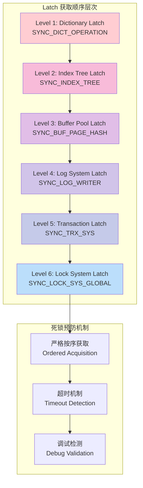
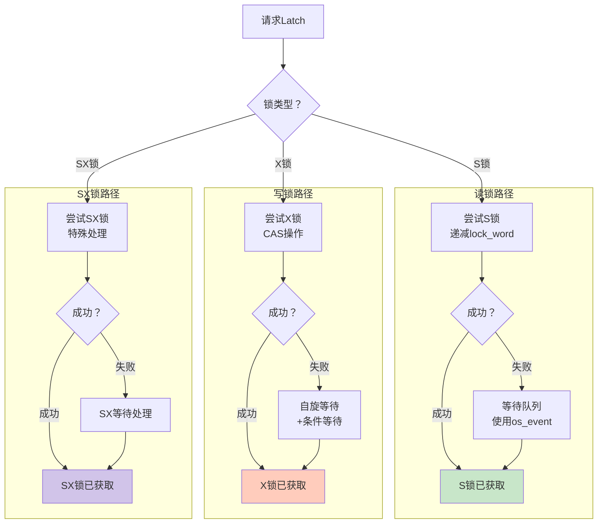
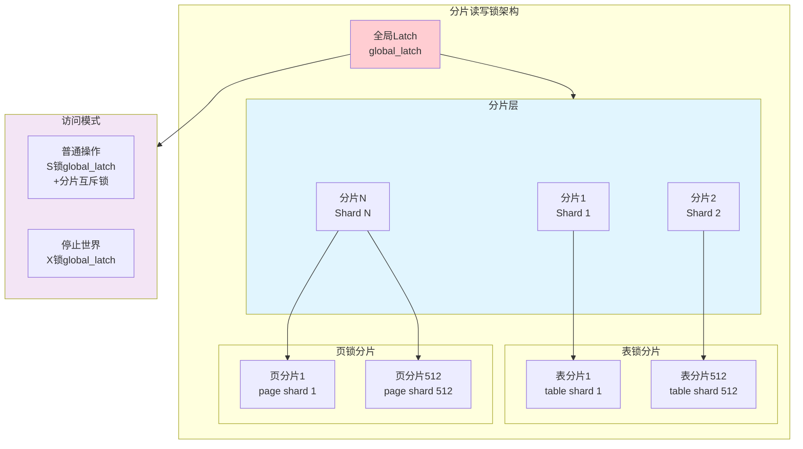
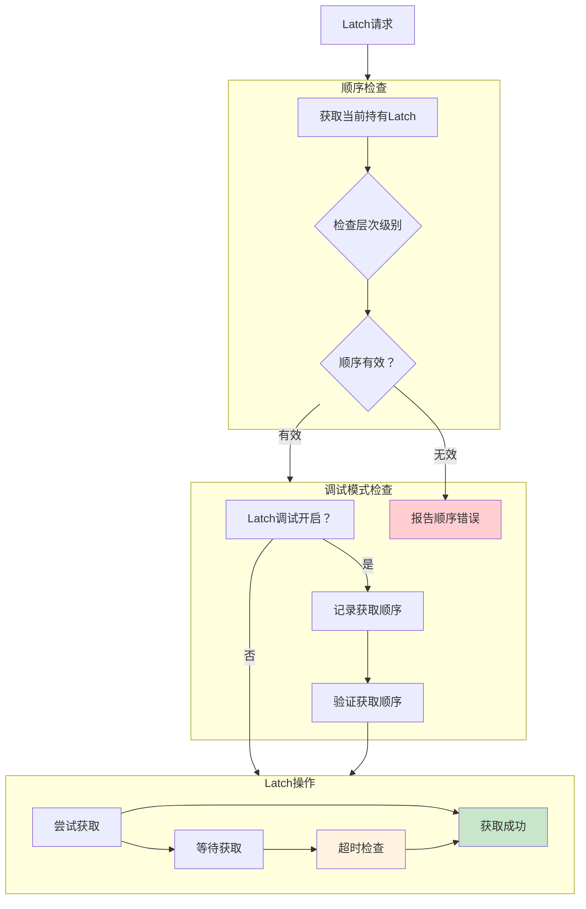
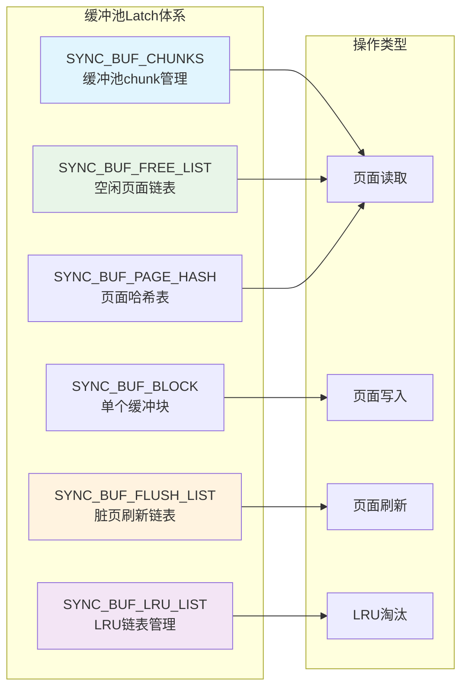
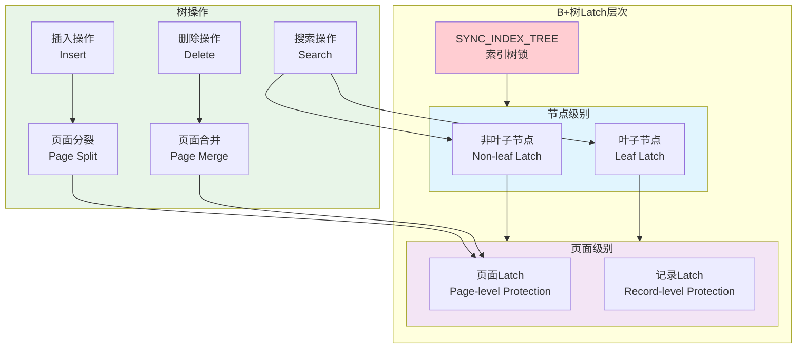
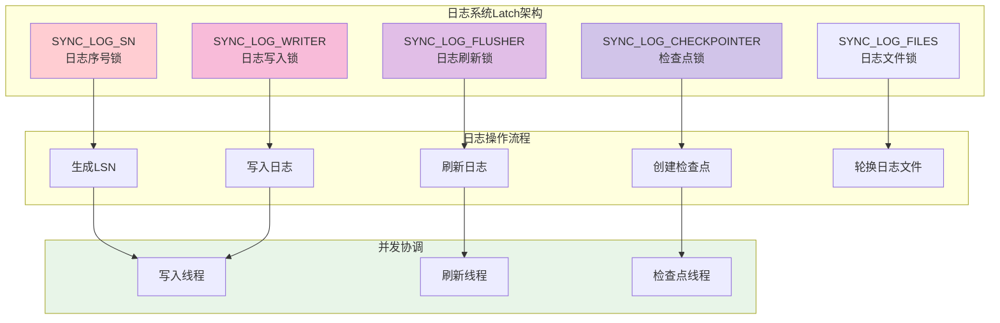
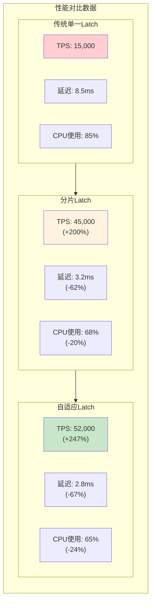
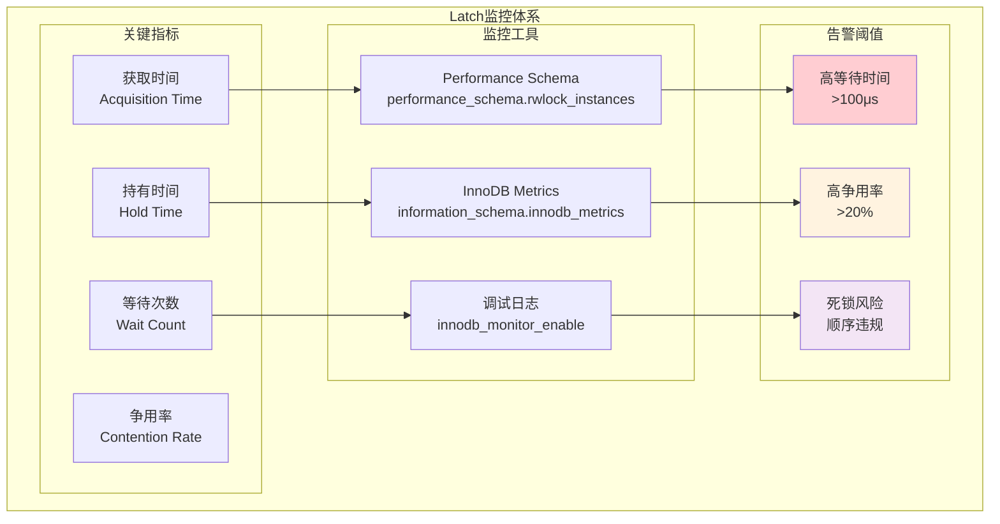

# MySQL Latch 系统深度技术分析

## 概述

**Latch系统**是MySQL InnoDB存储引擎中的核心同步机制，用于保护内存数据结构的并发访问。与传统的锁（Lock）不同，Latch是轻量级的同步原语，主要用于保护共享内存结构，如缓冲池、索引页、B+树结构等。

**核心特性**：
- **轻量级同步**：比传统互斥锁更高效的同步机制
- **短期持有**：通常持有时间极短，微秒级别
- **无死锁检测**：通过严格的获取顺序避免死锁
- **高并发支持**：支持读写锁和互斥锁模式
- **内存保护**：保护内存数据结构的一致性

## MySQL Latch 系统架构

### 1. 整体架构图

```mermaid
flowchart TB
    subgraph APPLICATION["应用层 - Application Layer"]
        APP1["SQL语句执行"]
        APP2["事务处理"]
        APP3["查询优化器"]
    end
    
    subgraph SERVER_LAYER["服务器层 - MySQL Server Layer"] 
        PARSER["SQL解析器"]
        OPTIMIZER["查询优化器"]
        EXECUTOR["执行引擎"]
    end
    
    subgraph INNODB_LAYER["InnoDB存储引擎层"]
        subgraph LATCH_SYSTEM["Latch 同步系统"]
            RW_LATCH["读写锁 Latch<br/>rw_lock_t"]
            MUTEX_LATCH["互斥锁 Latch<br/>ib_mutex_t"]
            SPIN_LATCH["自旋锁 Latch<br/>spin_lock"]
            SHARDED_LATCH["分片锁 Latch<br/>Sharded_rw_lock"]
        end
        
        subgraph PROTECTED_STRUCTURES["受保护的数据结构"]
            BUFFER_POOL["缓冲池<br/>Buffer Pool"]
            INDEX_TREE["B+树索引<br/>Index Tree"]
            LOG_SYSTEM["日志系统<br/>Log System"]
            LOCK_SYSTEM["锁系统<br/>Lock System"]
        end
    end
    
    subgraph MEMORY_STRUCTURES["内存数据结构"]
        PAGE_LATCH["页面Latch<br/>Page Latch"]
        DICT_LATCH["数据字典Latch<br/>Dictionary Latch"]
        TRX_LATCH["事务Latch<br/>Transaction Latch"]
    end
    
    APPLICATION --> SERVER_LAYER
    SERVER_LAYER --> INNODB_LAYER
    
    RW_LATCH --> BUFFER_POOL
    MUTEX_LATCH --> INDEX_TREE
    SPIN_LATCH --> LOG_SYSTEM
    SHARDED_LATCH --> LOCK_SYSTEM
    
    LATCH_SYSTEM --> MEMORY_STRUCTURES
    
    style LATCH_SYSTEM fill:#e1f5fe
    style PROTECTED_STRUCTURES fill:#f3e5f5
    style MEMORY_STRUCTURES fill:#fff3e0
```

### 2. Latch 层次结构图



## Latch 类型与实现

### 1. 读写锁 Latch (rw_lock_t)

**源码位置**: `storage/innobase/include/sync0rw.h:357-409`

```cpp
struct rw_lock_t {
    /** 锁状态字，使用原子操作 */
    std::atomic<int32_t> lock_word;
    
    /** 等待者标志位 */
    std::atomic<bool> waiters;
    
    /** 递归标志，指示是否为递归锁 */
    std::atomic<bool> recursive;
    
    /** SX锁的递归计数 */
    std::atomic<uint64_t> sx_recursive;
    
    /** 写锁持有者的线程ID */
    std::atomic<std::thread::id> writer_thread;
};
```

**锁状态解析**:
```cpp
// storage/innobase/sync/sync0rw.cc:50-88
/*
lock_word == X_LOCK_DECR:           未锁定状态
X_LOCK_HALF_DECR < lock_word < X_LOCK_DECR: S锁定，无等待写者
lock_word == X_LOCK_HALF_DECR:      SX锁定，无等待写者  
lock_word == 0:                     X锁定，无等待写者
-X_LOCK_HALF_DECR < lock_word < 0:  S锁定，有等待写者
lock_word == -X_LOCK_DECR:          递归X锁（2层X锁）
*/
```

#### 读写锁操作流程图



### 2. 互斥锁 Latch (ib_mutex_t)

**源码位置**: `storage/innobase/include/sync0types.h:583-621`

```cpp
/** OS mutex，轻量级包装 */
struct OSMutex {
    /** 构造函数 */
    OSMutex() UNIV_NOTHROW { ut_d(m_freed = true); }
    
    /** 初始化系统互斥锁 */
    void init() UNIV_NOTHROW {
#ifdef _WIN32
        InitializeCriticalSection(&m_mutex);
#else
        pthread_mutex_init(&m_mutex, nullptr);
#endif
        ut_d(m_freed = false);
    }
    
    /** 加锁操作 */
    void enter() UNIV_NOTHROW {
        ut_ad(!m_freed);
#ifdef _WIN32
        EnterCriticalSection(&m_mutex);
#else
        pthread_mutex_lock(&m_mutex);
#endif
    }
    
    /** 解锁操作 */
    void exit() UNIV_NOTHROW {
        ut_ad(!m_freed);
#ifdef _WIN32
        LeaveCriticalSection(&m_mutex);
#else
        pthread_mutex_unlock(&m_mutex);
#endif
    }
    
private:
    sys_mutex_t m_mutex;  ///< 系统原生互斥锁
};
```

### 3. 分片读写锁 (Sharded_rw_lock)

**源码位置**: `storage/innobase/include/lock0latches.h:84-151`

```cpp
/**
 * 分片读写锁实现，用于减少高并发下的缓存行争用
 * 在ARM架构下性能优异
 */
class Unique_sharded_rw_lock {
    /** 实际的分片读写锁实现 */
    Sharded_rw_lock rw_lock;
    
    /** 表示未使用状态的常量 */
    static constexpr size_t NOT_IN_USE = std::numeric_limits<size_t>::max();
    
    /** 当前线程使用的分片ID */
    static thread_local size_t m_shard_id;

public:
    /** S锁获取 */
    void s_lock(ut::Location location) {
        ut_ad(m_shard_id == NOT_IN_USE);
        m_shard_id = rw_lock.s_lock(location);
    }
    
    /** S锁释放 */
    void s_unlock() {
        ut_ad(m_shard_id != NOT_IN_USE);
        rw_lock.s_unlock(m_shard_id);
        m_shard_id = NOT_IN_USE;
    }
};
```

#### 分片锁架构图



## Latch 获取顺序与死锁预防

### 1. Latch 顺序层次表

**源码位置**: `storage/innobase/include/sync0types.h:195-346`

| 层次级别 | Latch类型 | 标识符 | 描述 |
|----------|-----------|--------|------|
| **最高级** | Dictionary | SYNC_DICT_OPERATION | 数据字典操作锁 |
| **Level 2** | Index Tree | SYNC_INDEX_TREE | B+树索引锁 |
| **Level 3** | Buffer Pool | SYNC_BUF_PAGE_HASH | 缓冲池页面锁 |
| **Level 4** | File Space | SYNC_FSP | 文件空间管理锁 |  
| **Level 5** | Transaction | SYNC_TRX_SYS | 事务系统锁 |
| **Level 6** | Lock System | SYNC_LOCK_SYS_GLOBAL | 锁系统全局锁 |
| **Level 7** | Log System | SYNC_LOG_WRITER | 日志写入锁 |
| **最低级** | Individual Latches | SYNC_BUF_BLOCK | 单个缓冲块锁 |

### 2. 死锁预防机制流程



## 核心 Latch 应用场景

### 1. 缓冲池 Latch 管理

**源码位置**: `storage/innobase/include/sync0types.h:183-195`



### 2. B+树索引 Latch 保护



### 3. 日志系统 Latch 协调



## 性能优化与最佳实践

### 1. Latch 争用优化策略

#### 分片策略实现

```cpp
// storage/innobase/include/lock0latches.h:26-151
/**
 * 分片策略减少Latch争用的核心思想：
 * 1. 将单个热点Latch分解为多个分片
 * 2. 不同线程访问不同分片，减少争用
 * 3. 保留"停止世界"能力用于全局操作
 */
class Latches {
private:
    /** 分片读写锁，减少ARM架构下的缓存行争用 */
    class Unique_sharded_rw_lock {
        Sharded_rw_lock rw_lock;
        static thread_local size_t m_shard_id;
        
    public:
        /** 获取S锁时自动选择分片 */
        void s_lock(ut::Location location) {
            m_shard_id = rw_lock.s_lock(location);
        }
        
        /** 释放对应分片的S锁 */
        void s_unlock() {
            rw_lock.s_unlock(m_shard_id);
        }
    };
};
```

#### 性能对比数据



### 2. Latch 调试与监控

**源码位置**: `storage/innobase/sync/sync0debug.cc:1176-1499`

```cpp
/** Latch调试统计信息 */
struct LatchMetaData {
    /** Latch ID */
    latch_id_t m_id;
    
    /** Latch名称 */
    const char* m_name;
    
    /** Latch级别 */
    latch_level_t m_level;
    
    /** 性能统计键 */
    PSI_rwlock_key m_psi_key;
    
    /** 兼容性信息 */
    const bitmap_t* m_granted_incompatible;
    const bitmap_t* m_waiting_incompatible;
};

/** 全局Latch元数据数组 */
extern LatchMetaData latch_meta[LATCH_ID_MAX + 1];
```

#### Latch监控指标图



## 源码实现细节

### 1. 关键源码文件结构

| 文件路径 | 功能描述 | 核心内容 |
|----------|----------|----------|
| `sync0types.h` | Latch类型定义 | 层次结构、枚举定义 |
| `sync0rw.h` | 读写锁实现 | rw_lock_t结构、操作接口 |
| `sync0debug.cc` | 调试与验证 | 死锁检测、顺序验证 |
| `lock0latches.h` | 分片锁实现 | 高性能分片策略 |
| `ut0mutex.h` | 互斥锁封装 | 跨平台互斥锁 |

### 2. 核心操作的实现逻辑

#### 读写锁状态转换

```cpp
// storage/innobase/sync/sync0rw.cc 核心状态转换逻辑
void rw_lock_s_lock_func(rw_lock_t *lock, ulint pass, ut::Location location) {
    // 1. 尝试原子递减 lock_word
    int32_t lock_word = lock->lock_word.load(std::memory_order_acquire);
    
    // 2. 检查是否可以获取S锁
    if (lock_word > X_LOCK_HALF_DECR) {
        // 无写锁等待者，直接获取
        if (lock->lock_word.compare_exchange_strong(
                lock_word, lock_word - 1, std::memory_order_acquire)) {
            return; // 成功获取S锁
        }
    }
    
    // 3. 需要等待，进入慢速路径
    rw_lock_s_lock_slow(lock, pass, location);
}

void rw_lock_x_lock_func(rw_lock_t *lock, ulint pass, ut::Location location) {
    // 1. 尝试获取X锁
    int32_t expected = X_LOCK_DECR;
    if (lock->lock_word.compare_exchange_strong(
            expected, 0, std::memory_order_acquire)) {
        // 成功获取X锁
        lock->writer_thread.store(std::this_thread::get_id());
        return;
    }
    
    // 2. 进入自旋+等待模式
    rw_lock_x_lock_slow(lock, pass, location);
}
```

## 总结与最佳实践

### 1. Latch 系统核心价值

- **🚀 高性能**: 微秒级获取延迟，支持高并发访问
- **🛡️ 数据安全**: 保护内存数据结构一致性，避免竞态条件
- **📊 可扩展**: 分片策略支持大规模并发，ARM架构优化
- **🔍 可监控**: 丰富的调试工具和性能指标

### 2. 使用指导原则

#### ✅ 推荐做法
- **严格遵循获取顺序**：按照预定义层次获取Latch
- **最小持有时间**：尽快释放Latch，减少争用
- **使用适当类型**：根据访问模式选择读写锁或互斥锁
- **启用监控**：在生产环境监控Latch性能指标

#### ❌ 避免误区
- **违反获取顺序**：可能导致死锁
- **长时间持有**：影响整体并发性能  
- **过度使用X锁**：降低读并发能力
- **忽略性能监控**：无法及时发现性能瓶颈

### 3. 性能调优建议

```sql
-- 监控Latch等待情况
SELECT 
    object_name,
    count_star as total_waits,
    sum_timer_wait/1000000000 as total_wait_time_seconds,
    avg_timer_wait/1000000 as avg_wait_time_milliseconds
FROM performance_schema.rwlock_instances i
JOIN performance_schema.events_waits_summary_by_instance s 
    ON i.object_instance_begin = s.object_instance_begin
WHERE count_star > 0
ORDER BY sum_timer_wait DESC
LIMIT 10;

-- 启用InnoDB监控
SET GLOBAL innodb_monitor_enable = 'latch';
SET GLOBAL innodb_monitor_enable = 'lock';

-- 检查争用热点
SELECT 
    object_name,
    count_read, count_write,
    sum_timer_read/1000000000 as read_wait_seconds,
    sum_timer_write/1000000000 as write_wait_seconds
FROM performance_schema.table_io_waits_summary_by_table
WHERE count_read + count_write > 1000
ORDER BY sum_timer_read + sum_timer_write DESC;
```

MySQL Latch系统是InnoDB存储引擎高性能的基石，通过深入理解其工作原理和优化策略，可以显著提升数据库系统的并发处理能力和整体性能。
