# MySQL MDL (MetaData Locking) 系统深度技术分析

## 概述

**MDL (MetaData Locking) 系统**是MySQL服务器层的元数据锁定机制，用于保护数据库对象的结构定义在并发访问时的一致性。与存储引擎层的行锁不同，MDL锁保护的是表结构、存储过程、触发器等元数据对象，确保DDL和DML操作之间的正确协调。

**核心特性**：
- **元数据保护**：保护数据库对象的结构定义
- **DDL/DML协调**：协调数据定义与数据操作的并发执行
- **多粒度锁定**：支持全局、模式、表、函数等多种粒度
- **兼容性矩阵**：复杂的锁兼容性规则
- **死锁检测**：内建死锁检测和处理机制

## MySQL MDL 系统架构

### 1. 整体架构图

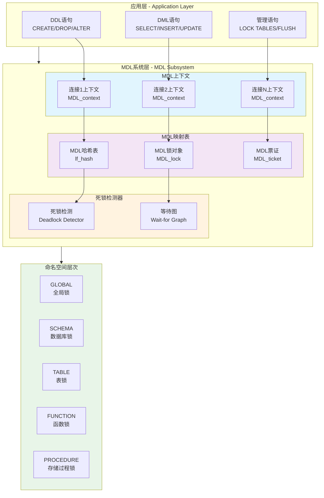

### 2. MDL 锁类型层次图

```mermaid
flowchart TD
    subgraph LOCK_TYPES["MDL锁类型层次"]
        IX["MDL_INTENTION_EXCLUSIVE<br/>意向排他锁"]
        S["MDL_SHARED<br/>共享锁"]
        SH["MDL_SHARED_HIGH_PRIO<br/>高优先级共享锁"]
        SR["MDL_SHARED_READ<br/>共享读锁"]
        SW["MDL_SHARED_WRITE<br/>共享写锁"]
        SWLP["MDL_SHARED_WRITE_LOW_PRIO<br/>低优先级共享写锁"]
        SU["MDL_SHARED_UPGRADABLE<br/>可升级共享锁"]
        SRO["MDL_SHARED_READ_ONLY<br/>只读共享锁"]
        SNW["MDL_SHARED_NO_WRITE<br/>无写共享锁"]
        SNRW["MDL_SHARED_NO_READ_WRITE<br/>无读写共享锁"]
        X["MDL_EXCLUSIVE<br/>排他锁"]
    end
    
    subgraph COMPATIBILITY["兼容性级别"]
        HIGH_COMPAT["高兼容性<br/>允许大部分并发"]
        MED_COMPAT["中等兼容性<br/>部分并发限制"]
        LOW_COMPAT["低兼容性<br/>严格排他控制"]
    end
    
    S --> HIGH_COMPAT
    SH --> HIGH_COMPAT
    SR --> HIGH_COMPAT
    
    SW --> MED_COMPAT
    SWLP --> MED_COMPAT
    SU --> MED_COMPAT
    
    SRO --> LOW_COMPAT
    SNW --> LOW_COMPAT
    SNRW --> LOW_COMPAT
    X --> LOW_COMPAT
    
    IX --> MED_COMPAT
    
    style HIGH_COMPAT fill:#c8e6c9
    style MED_COMPAT fill:#fff3e0
    style LOW_COMPAT fill:#ffcdd2
```

## MDL 锁兼容性分析

### 1. 完整兼容性矩阵

**源码位置**: `sql/mdl.cc:2215-2236`

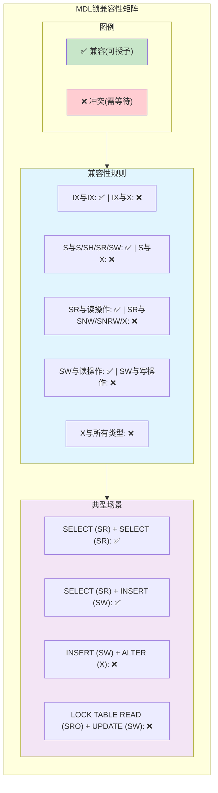

### 2. 详细兼容性表

| 已持有\请求 | IX | S | SH | SR | SW | SWLP | SU | SRO | SNW | SNRW | X |
|-------------|----|----|----|----|----| -----|----| ----|----|------|---|
| **IX**      | ✅ | ✅ | ✅ | ✅ | ✅ | ✅   | ✅ | ✅  | ✅ | ❌   | ❌ |
| **S**       | ✅ | ✅ | ✅ | ✅ | ✅ | ✅   | ✅ | ✅  | ✅ | ❌   | ❌ |
| **SH**      | ✅ | ✅ | ✅ | ✅ | ✅ | ✅   | ✅ | ✅  | ✅ | ❌   | ❌ |
| **SR**      | ✅ | ✅ | ✅ | ✅ | ✅ | ✅   | ✅ | ✅  | ❌ | ❌   | ❌ |
| **SW**      | ✅ | ✅ | ✅ | ✅ | ✅ | ✅   | ❌ | ❌  | ❌ | ❌   | ❌ |
| **SWLP**    | ✅ | ✅ | ✅ | ✅ | ✅ | ✅   | ❌ | ❌  | ❌ | ❌   | ❌ |
| **SU**      | ✅ | ✅ | ✅ | ✅ | ❌ | ❌   | ✅ | ✅  | ❌ | ❌   | ❌ |
| **SRO**     | ✅ | ✅ | ✅ | ❌ | ❌ | ❌   | ✅ | ✅  | ❌ | ❌   | ❌ |
| **SNW**     | ✅ | ✅ | ✅ | ❌ | ❌ | ❌   | ❌ | ✅  | ❌ | ❌   | ❌ |
| **SNRW**    | ❌ | ❌ | ❌ | ❌ | ❌ | ❌   | ❌ | ❌  | ❌ | ❌   | ❌ |
| **X**       | ❌ | ❌ | ❌ | ❌ | ❌ | ❌   | ❌ | ❌  | ❌ | ❌   | ❌ |

## MDL 核心数据结构

### 1. MDL_key 结构

**源码位置**: `sql/mdl.h:387-481`

```cpp
struct MDL_key {
public:
    /** 对象命名空间 */
    enum enum_mdl_namespace {
        GLOBAL = 0,        // 全局读锁
        BACKUP_LOCK,       // 备份锁
        TABLESPACE,        // 表空间
        SCHEMA,            // 数据库/模式
        TABLE,             // 表和视图
        FUNCTION,          // 存储函数
        PROCEDURE,         // 存储过程
        TRIGGER,           // 触发器
        EVENT,             // 事件调度器事件
        COMMIT,            // 全局读锁提交阻塞
        USER_LEVEL_LOCK,   // 用户级锁
        LOCKING_SERVICE,   // 锁服务插件
        SRID,              // 空间参考系统
        ACL_CACHE,         // ACL缓存
        COLUMN_STATISTICS, // 列统计信息
        RESOURCE_GROUPS,   // 资源组
        FOREIGN_KEY,       // 外键名称
        CHECK_CONSTRAINT,  // 检查约束名称
        BACKUP_TABLES,     // Percona备份表锁
        NAMESPACE_END
    };
    
    const char *db_name() const { return m_ptr + 1; }
    const char *name() const { 
        return m_ptr + m_db_name_length + 2; 
    }
    
private:
    char m_ptr[MAX_MDLKEY_LENGTH];  // 键数据
    uint16 m_length;                // 键长度
    uint16 m_db_name_length;        // 数据库名长度
};
```

### 2. MDL_context 生命周期管理

```mermaid
flowchart TD
    subgraph LIFECYCLE["MDL上下文生命周期"]
        CREATE["创建上下文<br/>MDL_context()"]
        
        subgraph ACQUIRE["锁获取阶段"]
            REQUEST["创建请求<br/>MDL_request"]
            VALIDATE["验证兼容性<br/>can_grant_lock()"]
            GRANT["授予锁<br/>grant_lock()"]
            WAIT["等待锁<br/>wait_for_lock()"]
        end
        
        subgraph HOLD["锁持有阶段"] 
            USAGE["使用资源"]
            UPGRADE["锁升级<br/>upgrade_lock()"]
            CLONE["克隆票证<br/>clone_ticket()"]
        end
        
        subgraph RELEASE["锁释放阶段"]
            STMT_END["语句结束释放<br/>MDL_STATEMENT"]
            TRX_END["事务结束释放<br/>MDL_TRANSACTION"]
            EXPLICIT_REL["显式释放<br/>MDL_EXPLICIT"]
        end
        
        DESTROY["销毁上下文<br/>destroy()"]
    end
    
    CREATE --> ACQUIRE
    
    REQUEST --> VALIDATE
    VALIDATE -->|"兼容"| GRANT
    VALIDATE -->|"冲突"| WAIT
    WAIT --> GRANT
    
    GRANT --> HOLD
    
    USAGE --> UPGRADE
    UPGRADE --> USAGE
    USAGE --> CLONE
    CLONE --> USAGE
    
    HOLD --> RELEASE
    
    STMT_END --> DESTROY
    TRX_END --> DESTROY  
    EXPLICIT_REL --> DESTROY
    
    style CREATE fill:#c8e6c9
    style GRANT fill:#fff3e0
    style WAIT fill:#ffcdd2
    style DESTROY fill:#e1f5fe
```

### 3. MDL_lock 对象结构

**源码位置**: `sql/mdl.cc:426-590`

```cpp
class MDL_lock {
public:
    typedef unsigned short bitmap_t;
    
    /** 票证列表管理 */
    class Ticket_list {
        List m_list;                    // 票证链表
        bitmap_t m_bitmap;              // 类型位图
        
    public:
        void add_ticket(MDL_ticket *ticket);
        void remove_ticket(MDL_ticket *ticket);
        bool is_empty() const { return m_list.is_empty(); }
        bitmap_t bitmap() const { return m_bitmap; }
    };
    
    /** MDL对象键 */
    MDL_key key;
    
    /** 保护锁上下文的读写锁 */
    mysql_prlock_t m_rwlock;
    
    /** 已授予的锁票证 */
    Ticket_list m_granted;
    
    /** 等待中的锁票证 */  
    Ticket_list m_waiting;
    
    /** 锁策略（作用域锁或对象锁） */
    const bitmap_t *incompatible_granted_types_bitmap() const;
    const bitmap_t *incompatible_waiting_types_bitmap() const;
};
```

## MDL 锁获取流程

### 1. 完整锁获取流程图

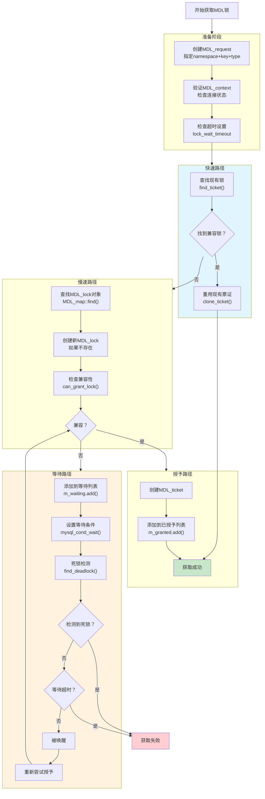

### 2. 核心源码实现

#### MDL_context::acquire_lock 实现

**源码位置**: `sql/mdl.cc:3247-3347`

```cpp
bool MDL_context::acquire_lock(MDL_request *mdl_request, 
                               Timeout_type lock_wait_timeout) {
    MDL_ticket *ticket = NULL;
    
    // 1. 快速路径：查找现有兼容的锁
    if ((ticket = find_ticket(mdl_request, &is_transactional)))
    {
        mdl_request->ticket = ticket;
        return FALSE; // 成功重用现有票证
    }
    
    // 2. 慢速路径：获取新锁
    MDL_lock *lock;
    
    // 获取或创建MDL_lock对象
    if (!(lock = mdl_locks.find_or_insert(mdl_request->key)))
        return TRUE; // OOM错误
    
    lock->m_rwlock.rdlock();
    
    // 3. 检查兼容性
    if (lock->can_grant_lock(mdl_request->type, this)) {
        // 兼容，立即授予
        ticket = MDL_ticket::create(this, mdl_request->type
#ifndef DBUG_OFF
                                   , mdl_request->duration
#endif
                                   );
        lock->m_granted.add_ticket(ticket);
        lock->m_rwlock.unlock();
        
        m_ticket_store.add_ticket(mdl_request, ticket);
        mdl_request->ticket = ticket;
        return FALSE;
    }
    
    // 4. 不兼容，需要等待
    return lock_wait(lock, mdl_request, lock_wait_timeout);
}
```

## MDL 死锁检测机制

### 1. 死锁检测算法

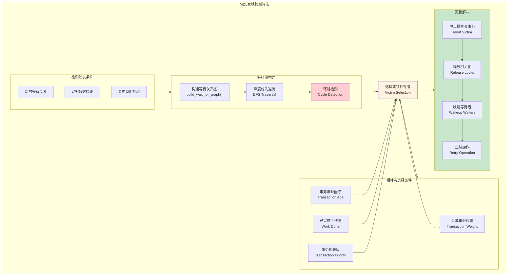

### 2. 死锁检测源码实现

**源码位置**: `sql/mdl.cc:1847-1952`

```cpp
/**
 * MDL死锁检测器实现
 * 使用等待图(Wait-for Graph)检测环路
 */
class Deadlock_detector : public MDL_wait_for_graph_visitor {
public:
    /**
     * 检测死锁的主入口点
     * @param mdl_context 发起检测的上下文
     * @return 检测到死锁返回true
     */
    bool find_deadlock() {
        bool result = FALSE;
        
        // 1. 构建等待图并进行环路检测
        MDL_context::visit_subgraph(m_start_node, this);
        
        if (m_current_search_depth == 0) {
            // 2. 检测完成，选择牺牲者
            if (!m_deadlock_victims.is_empty()) {
                result = TRUE; // 检测到死锁
                
                // 选择权重最小的事务作为牺牲者
                MDL_context *victim = select_victim();
                victim->set_deadlock_victim();
            }
        }
        
        return result;
    }
    
private:
    /**
     * 选择死锁牺牲者
     * 优先选择权重小、年龄轻、工作量少的事务
     */
    MDL_context *select_victim() {
        MDL_context *victim = NULL;
        uint min_weight = UINT_MAX;
        
        for (MDL_context *ctx : m_deadlock_victims) {
            uint weight = calculate_victim_weight(ctx);
            if (weight < min_weight) {
                min_weight = weight;
                victim = ctx;
            }
        }
        
        return victim;
    }
    
    uint calculate_victim_weight(MDL_context *ctx) {
        // 权重计算：年龄 + 工作量 + 优先级
        return ctx->get_transaction_age() + 
               ctx->get_work_done() + 
               ctx->get_priority_penalty();
    }
};
```

## MDL 命名空间与应用场景

### 1. 命名空间层次图

```mermaid
flowchart TB
    subgraph NAMESPACES["MDL命名空间层次"]
        GLOBAL["GLOBAL<br/>全局级别"]
        
        subgraph INSTANCE_LEVEL["实例级别"]
            BACKUP["BACKUP_LOCK<br/>备份锁"]
            COMMIT["COMMIT<br/>提交锁"]
            ACL["ACL_CACHE<br/>权限缓存锁"]
        end
        
        subgraph DATABASE_LEVEL["数据库级别"]
            SCHEMA["SCHEMA<br/>数据库锁"]
            TABLESPACE["TABLESPACE<br/>表空间锁"]
        end
        
        subgraph OBJECT_LEVEL["对象级别"]
            TABLE["TABLE<br/>表锁"]
            FUNCTION["FUNCTION<br/>函数锁"]
            PROCEDURE["PROCEDURE<br/>存储过程锁"]
            TRIGGER["TRIGGER<br/>触发器锁"]
            EVENT["EVENT<br/>事件锁"]
        end
        
        subgraph SPECIAL_LEVEL["特殊级别"]
            USER_LOCK["USER_LEVEL_LOCK<br/>用户级锁"]
            LOCKING_SERVICE["LOCKING_SERVICE<br/>锁服务锁"]
            RESOURCE_GROUPS["RESOURCE_GROUPS<br/>资源组锁"]
        end
    end
    
    GLOBAL --> INSTANCE_LEVEL
    INSTANCE_LEVEL --> DATABASE_LEVEL
    DATABASE_LEVEL --> OBJECT_LEVEL
    OBJECT_LEVEL --> SPECIAL_LEVEL
    
    style GLOBAL fill:#ffcdd2
    style INSTANCE_LEVEL fill:#f8bbd9
    style DATABASE_LEVEL fill:#e1bee7
    style OBJECT_LEVEL fill:#c5cae9
    style SPECIAL_LEVEL fill:#bbdefb
```

### 2. 典型应用场景

#### 场景1：DDL操作协调

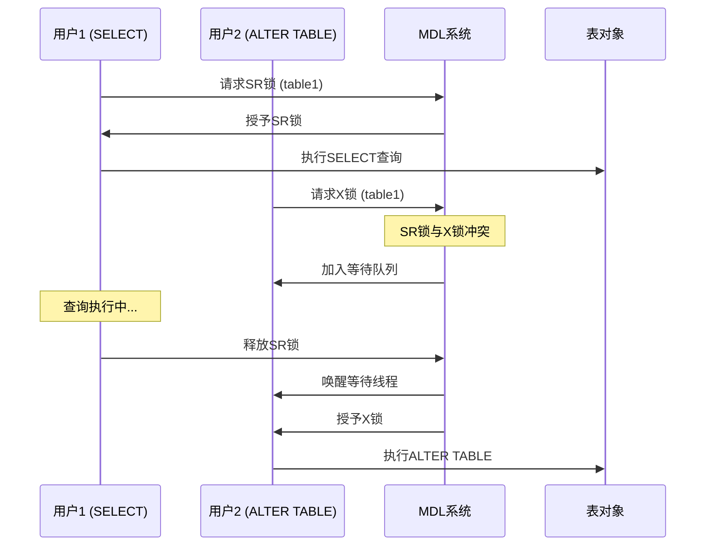

#### 场景2：全局读锁机制

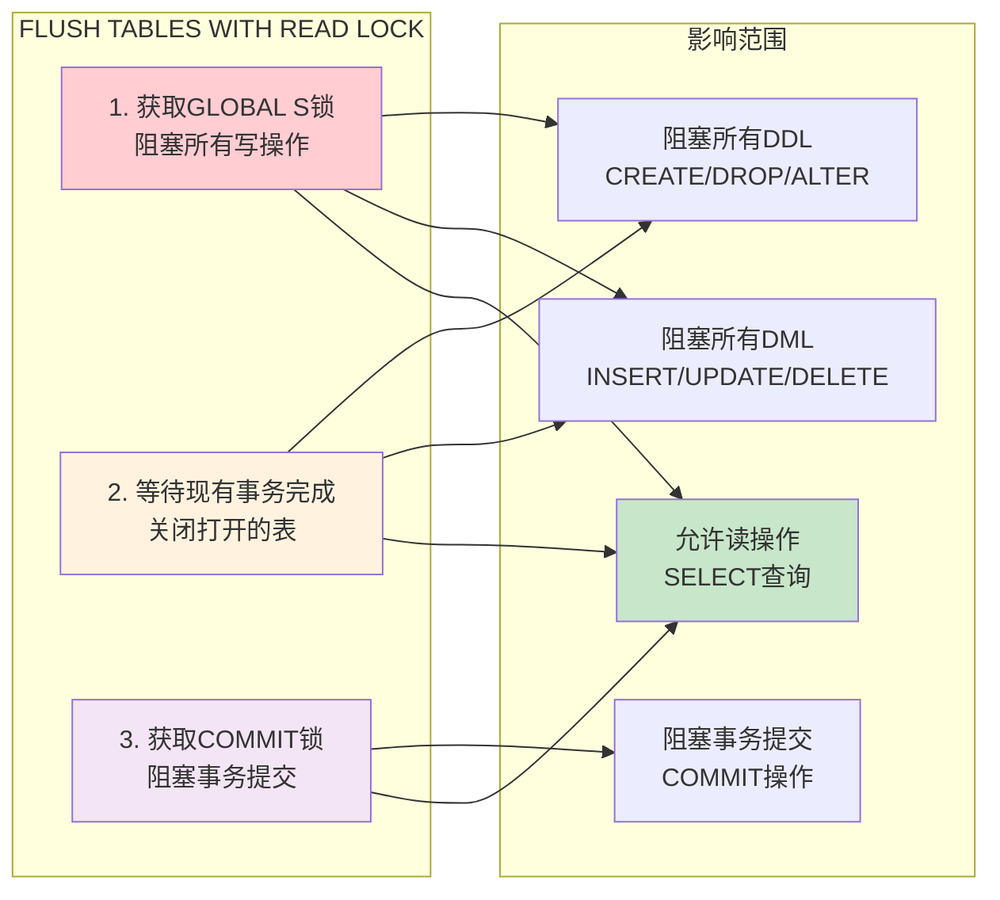

## MDL 性能优化与监控

### 1. 性能监控指标

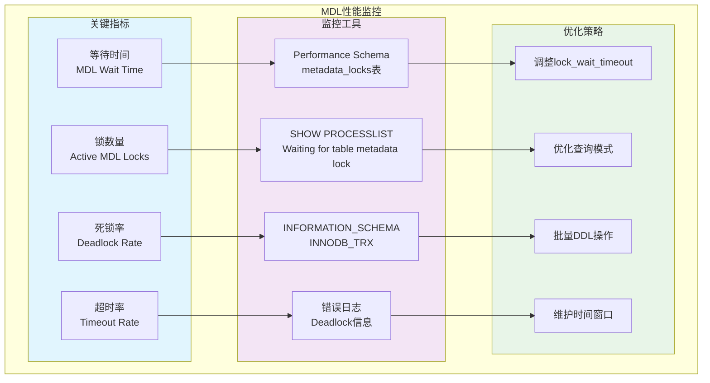

### 2. 性能调优SQL

```sql
-- 1. 监控当前MDL锁状态
SELECT 
    object_type,
    object_schema,
    object_name,
    lock_type,
    lock_duration,
    lock_status,
    processlist_id,
    processlist_info
FROM performance_schema.metadata_locks
WHERE object_name IS NOT NULL
ORDER BY object_schema, object_name;

-- 2. 查看等待MDL锁的会话
SELECT 
    p.id,
    p.user,
    p.host,
    p.db,
    p.command,
    p.time,
    p.state,
    p.info
FROM information_schema.processlist p
WHERE p.state LIKE '%metadata lock%'
ORDER BY p.time DESC;

-- 3. 分析MDL锁等待时间分布
SELECT 
    event_name,
    count_star as lock_count,
    sum_timer_wait/1000000000 as total_wait_seconds,
    avg_timer_wait/1000000 as avg_wait_milliseconds,
    max_timer_wait/1000000 as max_wait_milliseconds
FROM performance_schema.events_waits_summary_global_by_event_name
WHERE event_name LIKE '%mdl%'
    AND count_star > 0
ORDER BY sum_timer_wait DESC;

-- 4. 检查死锁历史
SELECT 
    engine,
    type,
    thread_id,
    processlist_id,
    object_schema,
    object_name,
    index_name,
    object_type,
    object_instance_begin,
    lock_type,
    lock_mode,
    lock_status,
    lock_data
FROM performance_schema.data_locks
WHERE lock_status = 'WAITING'
    AND engine = 'INNODB'
ORDER BY processlist_id;

-- 5. 优化建议SQL
SET GLOBAL lock_wait_timeout = 60;           -- 调整等待超时
SET GLOBAL innodb_deadlock_detect = ON;      -- 启用死锁检测
SHOW GLOBAL VARIABLES LIKE '%metadata%';     -- 查看相关配置
```

## MDL 最佳实践与故障排查

### 1. 最佳实践指南

#### ✅ 推荐做法

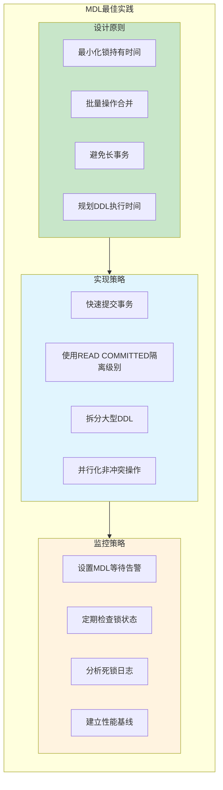

#### ❌ 常见误区

- **长时间持有事务**：在DDL期间保持长时间打开的事务
- **并发DDL操作**：同时执行多个影响相同对象的DDL
- **忽视锁等待**：不监控MDL锁等待情况
- **不当的维护时间**：在高峰期执行结构变更

### 2. 故障排查流程

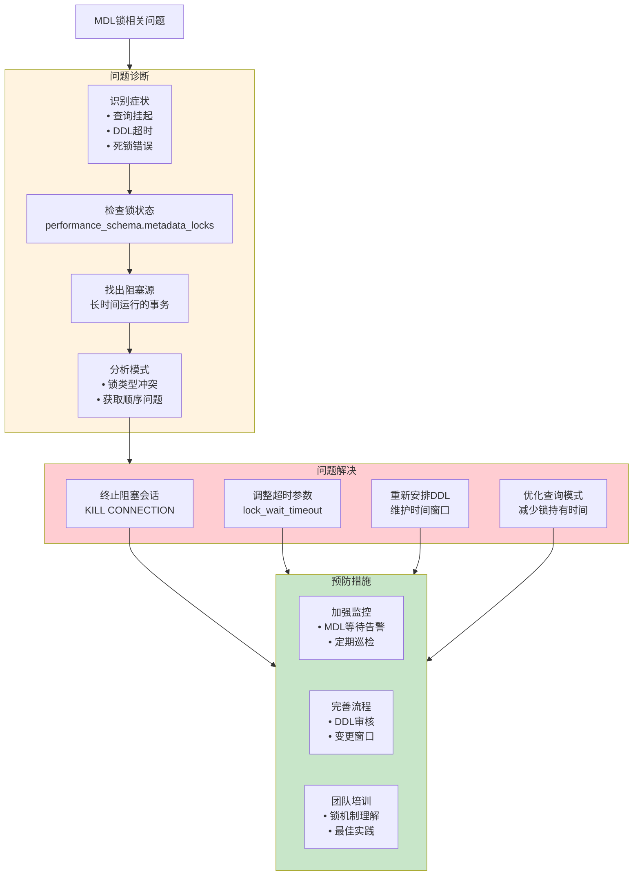

## 总结

### 1. MDL系统核心价值

- **🔒 元数据保护**: 确保并发环境下数据库结构的一致性
- **🚦 操作协调**: 协调DDL与DML操作，避免结构与数据不一致
- **⚡ 高性能**: 细粒度锁定，支持高并发操作
- **🛡️ 死锁处理**: 内建死锁检测和自动恢复机制

### 2. 关键设计思想

- **分层锁定**: 从全局到对象的多层次锁定体系
- **兼容性矩阵**: 复杂但高效的锁兼容性规则  
- **等待队列**: 有序的锁等待和唤醒机制
- **上下文管理**: 基于连接的锁生命周期管理

### 3. 实际应用指导

MySQL MDL系统是现代数据库并发控制的重要组成部分，通过深入理解其工作原理和优化策略，可以有效提升数据库系统在高并发环境下的稳定性和性能表现。正确使用MDL锁机制，是构建高可用MySQL应用的重要技术基础。
