# MySQL 非MDL锁系统深度技术分析

## 概述

**非MDL锁系统**是MySQL中除元数据锁(MDL)之外的所有锁机制的总称，主要包括表级锁(Table Lock)、行级锁(Row Lock)、用户级锁(User Lock)、全局读锁等。这些锁系统在不同层次上保护数据的完整性和一致性，与MDL锁配合构成完整的并发控制体系。

**核心特性**：
- **多层次保护**：从全局到行级的分层锁定机制
- **存储引擎相关**：不同存储引擎实现不同的锁策略
- **性能导向**：针对不同访问模式的优化锁机制
- **死锁处理**：完善的死锁检测和处理机制
- **兼容性控制**：复杂的锁兼容性规则

## MySQL 非MDL锁系统架构

### 1. 整体架构图

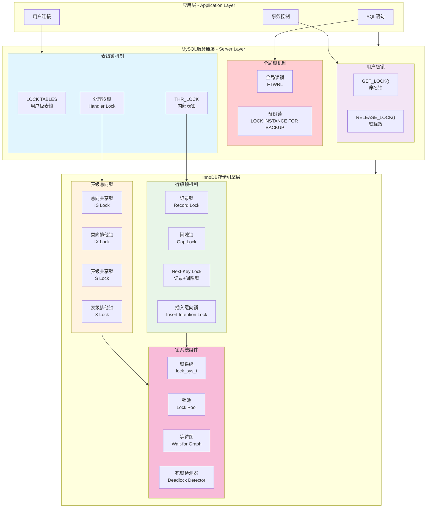

### 2. 锁粒度层次图

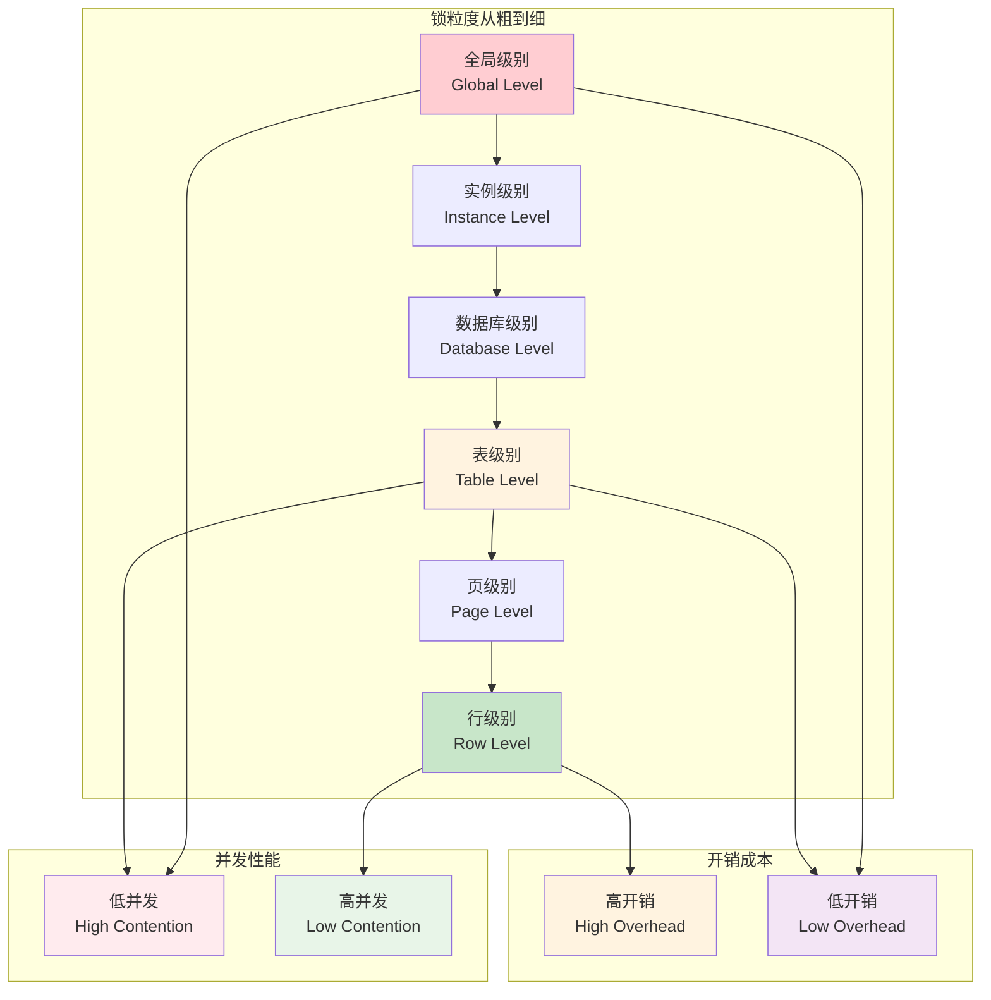

## 表级锁系统 (Table Level Locks)

### 1. THR_LOCK 表锁机制

**源码位置**: `include/thr_lock.h:50-122`

```cpp
/** 表锁类型定义 */
enum thr_lock_type {
    TL_IGNORE = -1,           // 忽略锁
    TL_UNLOCK,                // 解锁
    TL_READ_DEFAULT,          // 默认读锁(解析器用)
    TL_READ,                  // 读锁
    TL_READ_WITH_SHARED_LOCKS,// 共享读锁  
    TL_READ_HIGH_PRIORITY,    // 高优先级读锁
    TL_READ_NO_INSERT,        // 读锁,不允许并发插入
    TL_WRITE_ALLOW_WRITE,     // 写锁,允许其他写
    TL_WRITE_CONCURRENT_INSERT, // 并发插入写锁
    TL_WRITE_DEFAULT,         // 默认写锁(解析器用)
    TL_WRITE_LOW_PRIORITY,    // 低优先级写锁
    TL_WRITE,                 // 标准写锁
    TL_WRITE_ONLY             // 仅写锁(拒绝新请求)
};
```

#### 表锁兼容性矩阵

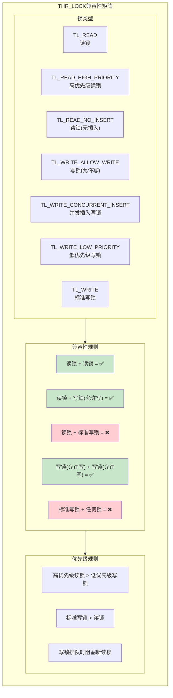

### 2. 表锁获取流程

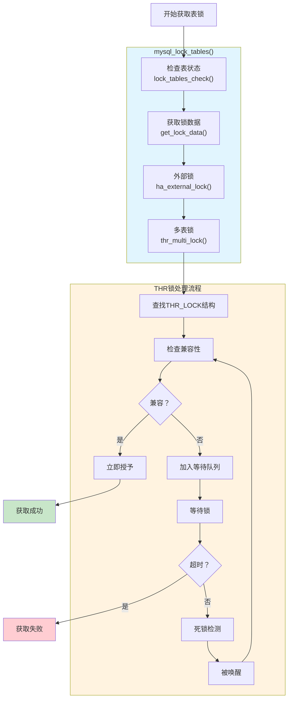

### 3. LOCK TABLES 语句处理

**源码位置**: `sql/lock.cc:144-352`

```cpp
/**
 * LOCK TABLES语句处理实现
 * 获取用户显式请求的表锁
 */
MYSQL_LOCK *mysql_lock_tables(THD *thd, TABLE **tables, size_t count,
                              uint flags) {
    int rc;
    MYSQL_LOCK *sql_lock;
    
    // 1. 检查表状态和权限
    if (lock_tables_check(thd, tables, count, flags)) 
        return nullptr;
    
    // 2. 创建锁数据结构
    if (!(sql_lock = get_lock_data(thd, tables, count, GET_LOCK_STORE_LOCKS)))
        return nullptr;
    
    // 3. 调用存储引擎的外部锁接口
    if (sql_lock->table_count &&
        lock_external(thd, sql_lock->table, sql_lock->table_count)) {
        reset_lock_data_and_free(&sql_lock);
        return nullptr;
    }
    
    // 4. 获取THR_LOCK锁
    rc = thr_multi_lock(sql_lock->locks + sql_lock->lock_count,
                        sql_lock->lock_count, &thd->lock_info, 
                        thd->variables.lock_wait_timeout);
    
    if (rc) {
        mysql_unlock_tables(thd, sql_lock);
        return nullptr;
    }
    
    return sql_lock;
}
```

## InnoDB 行级锁系统

### 1. 行锁类型架构

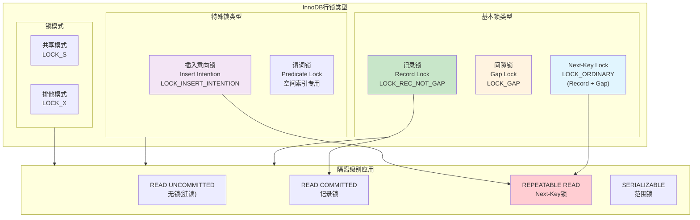

### 2. InnoDB 锁系统数据结构

**源码位置**: `storage/innobase/include/lock0lock.h:32-244`

```cpp
/** InnoDB锁系统核心数据结构 */
struct lock_sys_t {
    /** 保护锁系统的分片读写锁 */
    Sharded_rw_lock global_sharded_latch;
    
    /** 表锁队列的互斥锁数组 */
    ib_mutex_t *table_mutexes;
    
    /** 页面锁队列的互斥锁数组 */  
    ib_mutex_t *page_mutexes;
    
    /** 记录锁哈希表 */
    hash_table_t *rec_hash;
    
    /** 谓词锁哈希表(用于空间索引) */
    hash_table_t *prdt_hash;
    
    /** 表锁哈希表 */
    hash_table_t *table_hash;
    
    /** 等待图最后检测死锁的时间 */
    std::chrono::steady_clock::time_point last_deadlock_time;
};

/** 单个锁对象结构 */
struct lock_t {
    /** 事务指针 */
    trx_t *trx;
    
    /** 锁队列中的前后指针 */
    UT_LIST_NODE_T(lock_t) trx_locks;
    
    /** 锁类型和模式 */
    uint32_t type_mode;
    
    /** 记录锁或表锁的具体信息 */
    union {
        lock_table_t tab_lock;  // 表锁信息
        lock_rec_t rec_lock;    // 记录锁信息
    };
};
```

### 3. 行锁获取和释放流程

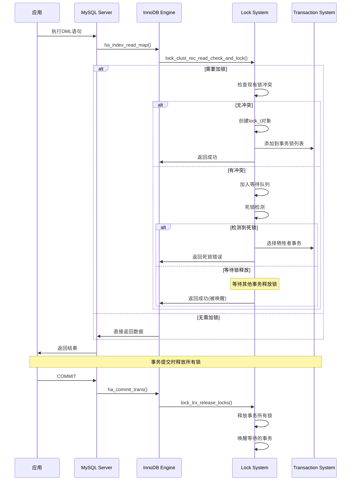

### 4. CATS锁调度算法

**源码位置**: `storage/innobase/include/lock0lock.h:158-244`

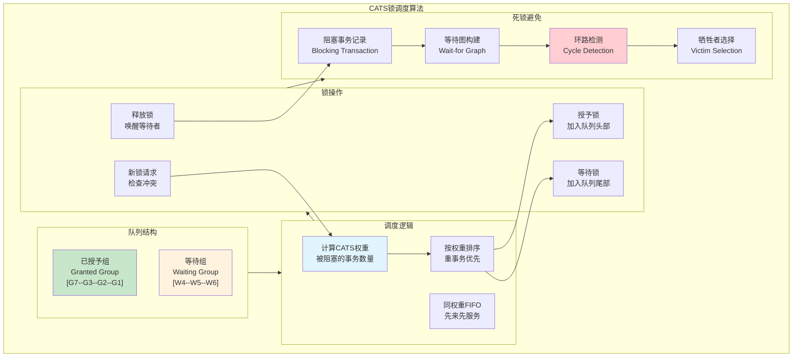

## 全局锁机制

### 1. 全局读锁 (FLUSH TABLES WITH READ LOCK)

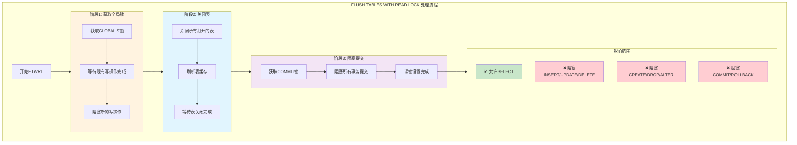

### 2. 备份锁 (LOCK INSTANCE FOR BACKUP)

**源码位置**: `sql/lock.cc:949-986`

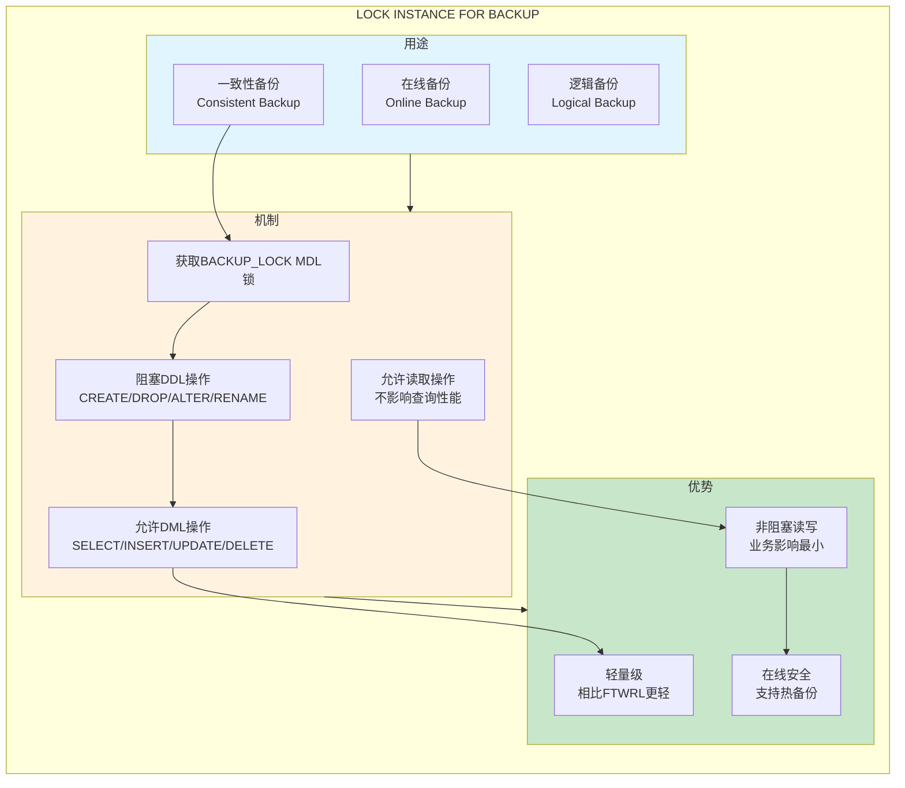

## 用户级锁机制

### 1. GET_LOCK() / RELEASE_LOCK() 函数

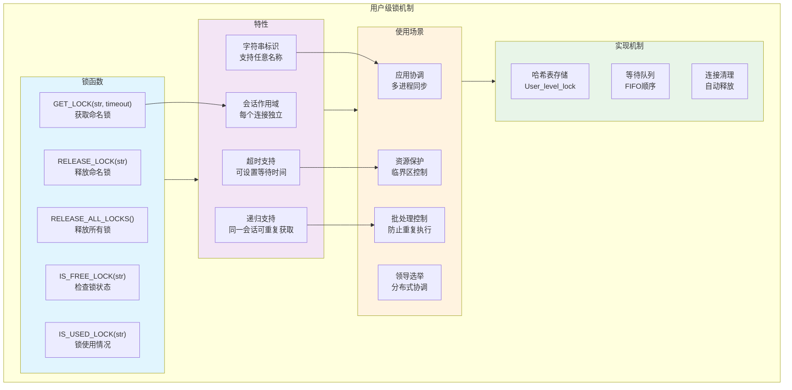

### 2. 用户级锁实现细节

**源码位置**: `sql/item_func.cc:6247-6356`

```cpp
/**
 * GET_LOCK() 函数实现
 * 获取用户级命名锁
 */
longlong Item_func_get_lock::val_int() {
    String *res = args[0]->val_str(&value);
    longlong timeout = args[1]->val_int();
    
    if (!res || !res->length()) {
        null_value = true;
        return 0;
    }
    
    THD *thd = current_thd;
    User_level_lock *ull;
    
    // 1. 在全局哈希表中查找锁
    mysql_mutex_lock(&LOCK_user_locks);
    
    if (!(ull = (User_level_lock *)my_hash_search(&hash_user_locks,
                                                  (uchar*)res->ptr(), 
                                                  res->length()))) {
        // 2. 锁不存在，创建新锁
        ull = new User_level_lock(res, thd);
        my_hash_insert(&hash_user_locks, (uchar*)ull);
        mysql_mutex_unlock(&LOCK_user_locks);
        return 1; // 成功获取
    }
    
    // 3. 锁已存在，检查所有者
    if (ull->owner == thd) {
        // 同一会话，增加引用计数
        ++ull->count;
        mysql_mutex_unlock(&LOCK_user_locks);
        return 1; // 成功获取
    }
    
    // 4. 锁被其他会话持有，需要等待
    mysql_cond_t wait_cond;
    mysql_cond_init(PSI_NOT_INSTRUMENTED, &wait_cond, NULL);
    
    // 添加到等待队列
    User_level_lock_waiter waiter(&wait_cond, thd);
    ull->waiting.push_back(&waiter);
    
    // 等待锁释放或超时
    struct timespec abstime;
    set_timespec_nsec(&abstime, timeout * 1000000ULL);
    
    int wait_result = mysql_cond_timedwait(&wait_cond, &LOCK_user_locks, &abstime);
    
    mysql_cond_destroy(&wait_cond);
    mysql_mutex_unlock(&LOCK_user_locks);
    
    if (wait_result == ETIMEDOUT) {
        return 0; // 超时
    }
    
    return thd->killed ? 0 : 1; // 成功或被终止
}
```

## 锁系统性能优化

### 1. InnoDB锁优化策略

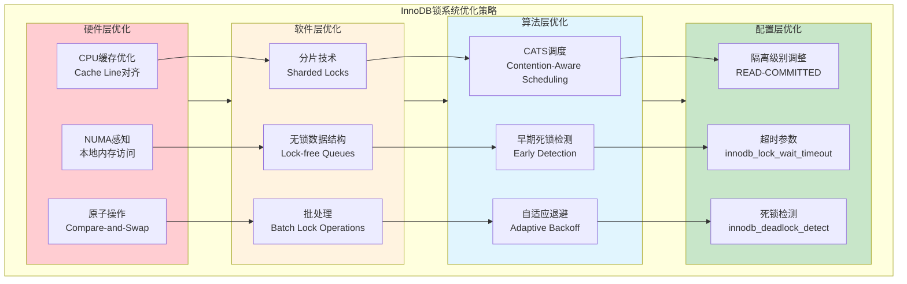

### 2. 性能监控指标

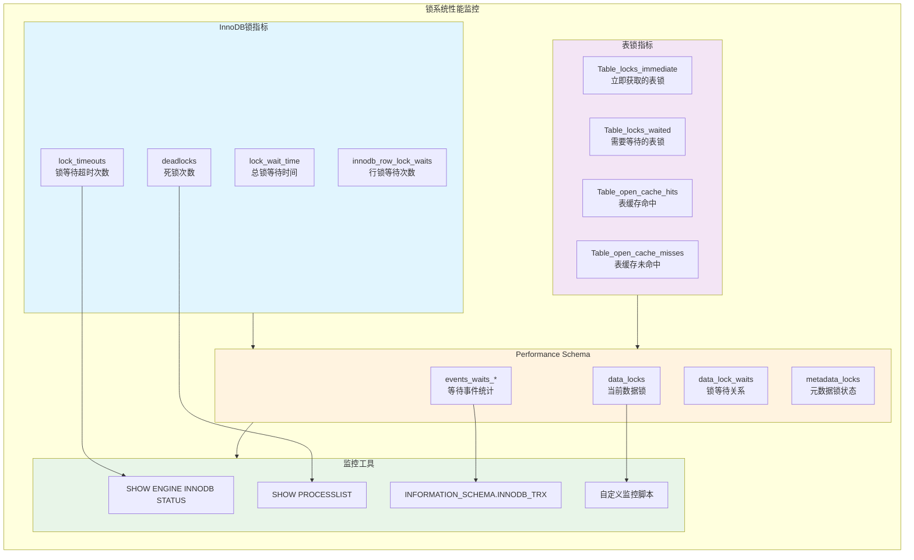

### 3. 优化建议与最佳实践

```sql
-- 1. InnoDB锁等待监控
SELECT 
    r.trx_id AS waiting_trx_id,
    r.trx_mysql_thread_id AS waiting_thread,
    r.trx_query AS waiting_query,
    b.trx_id AS blocking_trx_id,
    b.trx_mysql_thread_id AS blocking_thread,
    b.trx_query AS blocking_query
FROM information_schema.innodb_lock_waits w
INNER JOIN information_schema.innodb_trx b ON b.trx_id = w.blocking_trx_id
INNER JOIN information_schema.innodb_trx r ON r.trx_id = w.requesting_trx_id;

-- 2. 死锁信息查看
SHOW ENGINE INNODB STATUS;

-- 3. 表锁等待统计
SELECT 
    TABLE_SCHEMA,
    TABLE_NAME,
    LOCK_TYPE,
    LOCK_DURATION,
    COUNT(*) as lock_count
FROM performance_schema.metadata_locks
WHERE OBJECT_TYPE = 'TABLE'
GROUP BY TABLE_SCHEMA, TABLE_NAME, LOCK_TYPE, LOCK_DURATION
ORDER BY lock_count DESC;

-- 4. 用户级锁状态
SELECT 
    OBJECT_NAME as lock_name,
    OWNER_THREAD_ID,
    OWNER_EVENT_ID
FROM performance_schema.metadata_locks
WHERE OBJECT_TYPE = 'USER LEVEL LOCK'
    AND LOCK_STATUS = 'GRANTED';

-- 5. 锁系统配置优化
SET GLOBAL innodb_lock_wait_timeout = 50;        -- 锁等待超时
SET GLOBAL innodb_deadlock_detect = ON;          -- 启用死锁检测  
SET GLOBAL table_open_cache = 4000;              -- 表缓存大小
SET GLOBAL table_definition_cache = 2000;        -- 表定义缓存
SET GLOBAL lock_wait_timeout = 31536000;         -- 元数据锁超时
```

## 锁系统故障排查

### 1. 常见锁问题排查流程

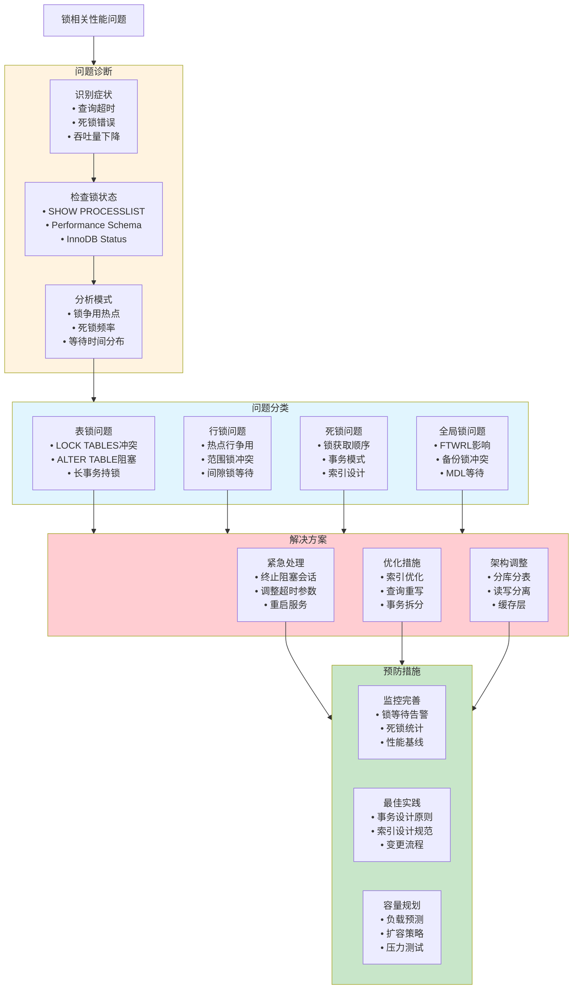

### 2. 死锁分析实例

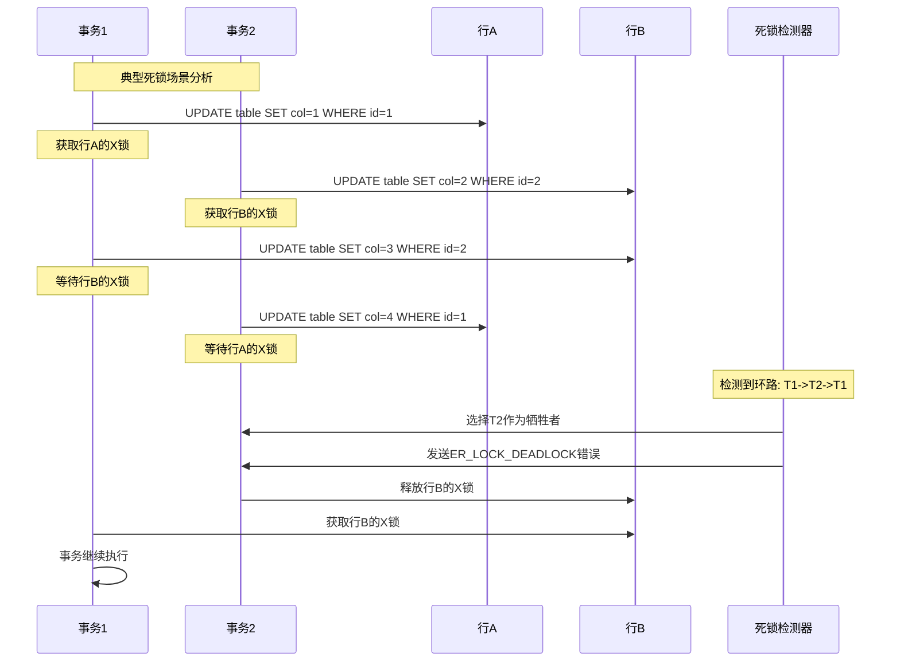

## 总结与实践指导

### 1. 非MDL锁系统核心价值

- **🔐 数据一致性**: 多层次锁机制保证并发访问下的数据完整性
- **⚡ 高性能**: 针对不同场景优化的锁粒度和算法
- **🛡️ 死锁处理**: 完善的死锁检测和自动恢复机制
- **🔧 灵活配置**: 丰富的配置选项适应不同业务需求

### 2. 最佳实践总结

#### ✅ 推荐做法

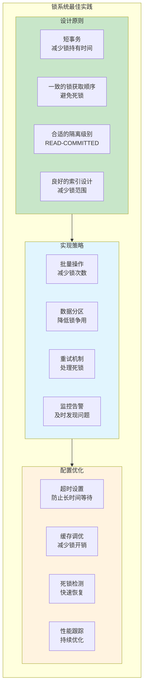

#### ❌ 常见误区

- **长时间持有锁**: 在事务中执行耗时操作
- **不当的锁顺序**: 不一致的锁获取顺序导致死锁
- **过度使用表锁**: 不必要地使用LOCK TABLES
- **忽视死锁处理**: 没有实现适当的重试逻辑

### 3. 性能调优指南

MySQL非MDL锁系统涉及多个层次的锁机制，每种锁都有其特定的应用场景和性能特征。通过深入理解各种锁的工作原理、合理选择锁粒度、优化事务设计，以及建立完善的监控体系，可以显著提升数据库系统的并发处理能力和整体性能。正确使用锁机制，是构建高性能、高可用MySQL应用的关键技术基础。
