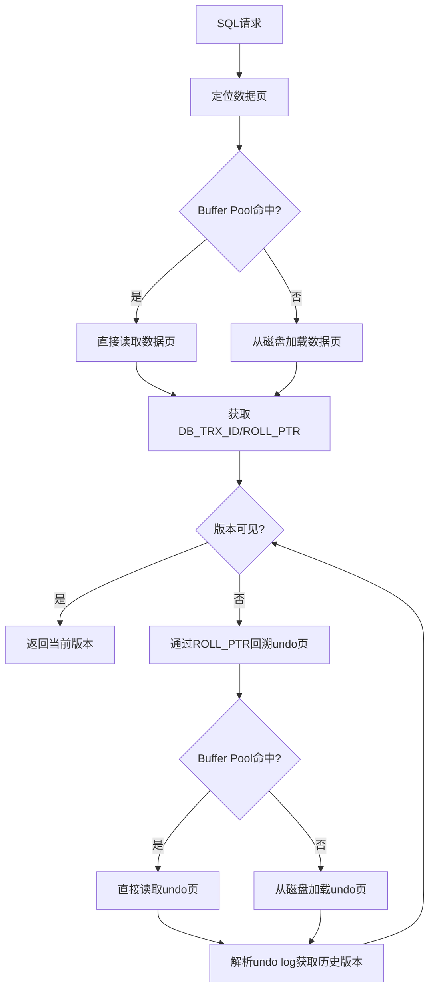
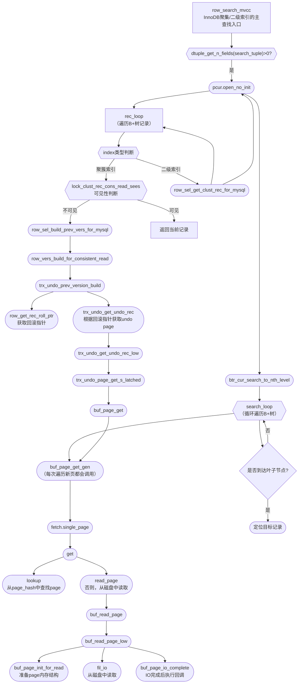

# MySQL MVCC 的源码剖析

## 1. MVCC基本原理与InnoDB实现概述
MVCC（多版本并发控制）是InnoDB实现高并发一致性读的核心机制。其本质是通过为每行数据维护多个版本，实现读写不加锁，提升并发性能。InnoDB通过隐藏列`DB_TRX_ID`（事务ID）、`DB_ROLL_PTR`（回滚指针）和undo log（回滚日志）来实现MVCC。

## 2. 关键数据结构
- **DB_TRX_ID / trx_id_t**：每行记录的最近一次修改该行的事务ID。
  - 相关源码：`storage/innobase/include/trx0types.h`，`typedef ib_id_t trx_id_t;`
- **DB_ROLL_PTR / roll_ptr_t**：指向undo log的指针，用于回溯历史版本。
  - 相关源码：`storage/innobase/include/trx0types.h`，`typedef ib_id_t roll_ptr_t;`
- **Undo Log**：记录了数据被修改前的旧值，支持回滚和一致性读。
  - 相关源码：`storage/innobase/trx/trx0undo.*`、`trx0rec.*`、`trx0roll.*`
- **ReadView**：一致性读视图，决定当前事务能"看到"哪些版本的数据。
  - 相关源码：`storage/innobase/include/read0types.h`、`read0read.h`、`trx0trx.h`

## 3. 版本可见性判断流程
InnoDB在一致性读时，会根据ReadView判断每条记录的DB_TRX_ID是否可见。核心流程如下：
- 读取记录的`DB_TRX_ID`，判断其与ReadView中的活跃事务ID关系。
- 若不可见，则通过`DB_ROLL_PTR`回溯undo log，获取上一个版本，直到找到可见版本或无历史版本。
- 相关源码入口：
  - [`row_sel_build_prev_vers`](../storage/innobase/row/row0sel.cc#L690)
  - [`row_vers_build_for_consistent_read`](../storage/innobase/row/row0vers.cc#L1254)
  - [`lock_clust_rec_cons_read_sees`](../storage/innobase/lock/lock0lock.cc#L234)
  - [`lock_sec_rec_cons_read_sees`](../storage/innobase/lock/lock0lock.cc#L271)
  - `ReadView`结构体与相关方法（`read0types.h`、`read0read.h`）

## 4. 典型SQL下的MVCC流程源码追踪
### 4.1 SELECT（快照读）
- 入口：[row_search_mvcc](../storage/innobase/row/row0sel.cc#L4526)
- 关键流程：
  1. 为当前事务分配[`trx_assign_read_view`](../storage/innobase/trx/trx0trx.cc#L2342)。
  2. 遍历聚集索引记录，判断每条记录的[`DB_TRX_ID`](#)是否在ReadView可见。
  3. 若不可见，通过[`DB_ROLL_PTR`](#)回溯undo log，获取历史版本。
  4. 返回可见版本数据。

### 4.2 UPDATE/DELETE
- 入口：[row_update_for_mysql](../storage/innobase/row/row0mysql.cc#L2944)、row_delete_for_mysql（未找到直接定义，实际调用为`row_delete_for_mysql_using_cursor`，见`row0mysql.cc`）
- 关键流程：
  1. 生成undo log，记录被修改前的旧值。
  2. 更新记录的`DB_TRX_ID`和`DB_ROLL_PTR`。
  3. 其他事务通过MVCC机制可见历史版本。

## 5. 相关源码文件与函数说明
- `trx0types.h`：定义`trx_id_t`、`roll_ptr_t`等类型。
- `trx0rec.h`、`trx0rec.cc`：undo log记录结构与操作。
- `trx0undo.h`、`trx0undo.cc`：undo log的管理与操作。
- `row0sel.cc`、`row0vers.cc`：一致性读、历史版本回溯的核心实现。
- `read0types.h`、`read0read.h`：ReadView结构与管理。
- `trx0trx.h`、`trx0trx.cc`：事务与ReadView的分配、管理。

## 6. 参考流程源码片段举例
```cpp
// 判断记录是否对当前ReadView可见（伪代码）
if (rec_trx_id < read_view->low_limit_id) {
    // 版本已提交，可见
} else if (rec_trx_id >= read_view->up_limit_id || read_view->contains(rec_trx_id)) {
    // 版本未提交，不可见，回溯undo log
} else {
    // 版本已提交，可见
}
```

## 7. 总结
MySQL InnoDB的MVCC通过隐藏列、undo log和ReadView等机制，实现了高效的多版本并发控制。源码中相关结构和流程高度模块化，便于理解和扩展。

## 8. MVCC实现中的数据页与Undo页读取

### 8.1 数据页（Data Page）读取流程
- InnoDB的数据存储在B+树的页（page）结构中，通常为16KB一页。
- 读取一条记录时，首先通过索引定位到对应的数据页。
- 相关源码入口：[row_search_mvcc](../storage/innobase/row/row0sel.cc#L4526)，内部会调用[btr_cur_search_to_nth_level](../storage/innobase/btr/btr0cur.cc#L637)等函数定位并读取数据页。

#### 关键函数
- [buf_page_get_gen](../storage/innobase/buf/buf0buf.cc#L4439) / [声明](../storage/innobase/include/buf0buf.h#L434)：Buffer Pool管理器，负责从磁盘或缓存中加载数据页。
- [btr_cur_search_to_nth_level](../storage/innobase/btr/btr0cur.cc#L637) / [声明](../storage/innobase/include/btr0cur.h#L133)：通过B+树索引查找并定位到目标数据页。
- [row_get_rec_trx_id](../storage/innobase/include/row0row.h#L58)、[row_get_rec_roll_ptr](../storage/innobase/include/row0row.h#L65)：从数据页记录中获取`DB_TRX_ID`和`DB_ROLL_PTR`。

### 8.2 Undo页（Undo Page）读取流程
- 一致性读发现当前数据版本不可见时，会通过`DB_ROLL_PTR`指针回溯到undo log。
- undo log以页（undo page）为单位存储在undo tablespace中。
- 相关源码入口：[trx_undo_get_undo_rec](../storage/innobase/trx/trx0rec.cc#L2416)、[trx_undo_page_get](../storage/innobase/include/trx0undo.h#L75)。

#### 关键函数
- [trx_undo_get_undo_rec](../storage/innobase/trx/trx0rec.cc#L2416)：根据`roll_ptr`定位并读取undo页，获取历史版本记录。
- [trx_undo_page_get](../storage/innobase/include/trx0undo.h#L75)：从undo tablespace中加载undo page。
- [buf_page_get_gen](../storage/innobase/buf/buf0buf.cc#L4439)：同样通过Buffer Pool加载undo页到内存。

### 8.3 典型源码流程（伪代码）
```cpp
// 1. 读取数据页
page = buf_page_get_gen(space_id, page_no, ...); // 先查Buffer Pool，未命中则从磁盘加载

// 2. 获取记录的DB_TRX_ID和DB_ROLL_PTR
trx_id = row_get_rec_trx_id(rec, index, offsets);
roll_ptr = row_get_rec_roll_ptr(rec, index, offsets);

// 3. 判断可见性，不可见则回溯undo
if (!read_view->changes_visible(trx_id)) {
    // 通过roll_ptr定位undo页
    undo_rec = trx_undo_get_undo_rec(roll_ptr, ...);
    // 可能需要多次回溯，直到找到可见版本或无历史版本
}
```

### 8.4 详细函数源码解读

#### 1. [buf_page_get_gen](../storage/innobase/buf/buf0buf.cc#L4439)
- 位置：[storage/innobase/buf/buf0buf.cc#L4439](../storage/innobase/buf/buf0buf.cc#L4439)
- 作用：从Buffer Pool获取指定space_id和page_no的页，若缓存未命中则从磁盘加载。
- 伪代码：
```cpp
buf_block_t* buf_page_get_gen(space_id_t space, page_no_t page_no, ...)
{
    // 1. 在Buffer Pool查找页
    // 2. 未命中则从磁盘加载
    // 3. 返回页指针
}
```

#### 2. [row_get_rec_trx_id](../storage/innobase/include/row0row.h#L58)、[row_get_rec_roll_ptr](../storage/innobase/include/row0row.h#L65)
- 位置：[storage/innobase/include/row0row.h](../storage/innobase/include/row0row.h)
- 作用：从记录中解析出`DB_TRX_ID`和`DB_ROLL_PTR`字段。
- 伪代码：
```cpp
trx_id_t row_get_rec_trx_id(const rec_t* rec, const dict_index_t* index, const ulint* offsets);
roll_ptr_t row_get_rec_roll_ptr(const rec_t* rec, const dict_index_t* index, const ulint* offsets);
```

#### 3. [trx_undo_get_undo_rec](../storage/innobase/trx/trx0rec.cc#L2416)
- 位置：[storage/innobase/trx/trx0rec.cc#L2416](../storage/innobase/trx/trx0rec.cc#L2416)
- 作用：根据`roll_ptr`定位undo页，解析undo log，获取历史版本。
- 伪代码：
```cpp
undo_rec_t* trx_undo_get_undo_rec(roll_ptr_t roll_ptr, ...)
{
    // 1. 解析roll_ptr，定位undo页
    // 2. 通过buf_page_get_gen加载undo页
    // 3. 解析undo log，返回历史版本
}
```

### 8.5 流程图



### 8.6 纵向函数链树状图（修正版）



> 上图展示了从`row_search_mvcc`发起，到数据页获取（`row_sel_get_clust_rec_for_mysql`→`pcur.open_no_init`→`btr_cur_search_to_nth_level`→`buf_page_get_gen`→Buffer Pool底层页读取全链路）以及回滚页（undo页）获取（`row_vers_build_for_consistent_read`→`trx_undo_prev_version_build`→`row_get_rec_roll_ptr`/`trx_undo_get_undo_rec`→`trx_undo_page_get`→`buf_page_get_gen`）的主要函数链路。

#### 函数链路跳转表（可点击跳转源码）

| 函数 | 跳转链接 |
|---|---|
| row_search_mvcc | [row0sel.cc#L4526](../storage/innobase/row/row0sel.cc#L4526) |
| row_sel_get_clust_rec_for_mysql | [调用](../storage/innobase/row/row0sel.cc#L5610) [row0sel.cc#L3148](../storage/innobase/row/row0sel.cc#L3148) |
| pcur.open_no_init | [调用](../storage/innobase/row/row0sel.cc#L3171) [btr0pcur.h#598](../storage/innobase/btr/btr0pcur.h#L598) |
| btr_cur_search_to_nth_level | [调用](../storage/innobase/btr/btr0pcur.h#L617) [btr0cur.cc#L638](../storage/innobase/btr/btr0cur.cc#L638) |
| buf_page_get_gen | [调用](../storage/innobase/btr/btr0cur.cc#L977) [buf0buf.cc#L4440](../storage/innobase/buf/buf0buf.cc#L4440) |
|  |  |
| row_sel_build_prev_vers_for_mysql | [调用](../storage/innobase/row/row0sel.cc#L5451) [row0sel.cc#L3087](../storage/innobase/row/row0sel.cc#L3087) |
| row_vers_build_for_consistent_read | [调用](../storage/innobase/row/row0sel.cc#L3102)[row0vers.cc#L1255](../storage/innobase/row/row0vers.cc#L1255) |
| trx_undo_prev_version_build | [调用](../storage/innobase/row/row0vers.cc#L1300) [trx0rec.cc#L2442](../storage/innobase/trx/trx0rec.cc#L2442) |
| row_get_rec_roll_ptr | [获取roll_ptr](../storage/innobase/trx/trx0rec.cc#L2471) [trx0rec.cc#L2470](../storage/innobase/trx/trx0rec.cc#L2470) |
| trx_undo_get_undo_rec | [调用](../storage/innobase/trx/trx0rec.cc#L2488) [trx0rec.cc#L2417](../storage/innobase/trx/trx0rec.cc#L2417) |
| trx_undo_get_undo_rec_low | [调用](../storage/innobase/trx/trx0rec.cc#L2428) [trx0rec.cc#L2371](../storage/innobase/trx/trx0rec.cc#L2371) |
| trx_undo_page_get_s_latched | [调用](../storage/innobase/trx/trx0rec.cc#L2394) [trx0undo.ic#L138](../storage/innobase/include/trx0undo.ic#L138) |
| buf_page_get | [调用](../storage/innobase/include/trx0undo.ic#L142) [buf0buf.h#L444](../storage/innobase/include/buf0buf.h#L444) |
| buf_page_get_gen | [调用](../storage/innobase/include/buf0buf.h#L447)  [buf0buf.cc#L4440](../storage/innobase/buf/buf0buf.cc#L4440) |
|  |  |
| fetch.single_page | [调用](../storage/innobase/include/buf0buf.cc#L4490)  [buf0buf.cc#L4288](../storage/innobase/buf/buf0buf.cc#L4288) |
| get | [调用](../storage/innobase/include/buf0buf.cc#L4294)  [buf0buf.cc#L3702](../storage/innobase/buf/buf0buf.cc#L3702) |
| lookup | [调用](../storage/innobase/include/buf0buf.cc#L3711)  [buf0buf.cc#L3702](../storage/innobase/buf/buf0buf.cc#L3702) |
| read_page | [调用](../storage/innobase/include/buf0buf.cc#L3734)  [buf0buf.cc#L4106](../storage/innobase/buf/buf0buf.cc#L4106) |
| buf_read_page | [调用](../storage/innobase/include/buf0buf.cc#L4107)  [buf0rea.cc#L289](../storage/innobase/buf/buf0rea.cc#L289) |
| buf_read_page_low | [调用](../storage/innobase/buf/buf0rea.cc#L294)  [buf0rea.cc#L66](../storage/innobase/buf/buf0rea.cc#L66) |
| buf_page_init_for_read | [调用](../storage/innobase/buf/buf0rea.cc#L95)   |
| fil_io | [调用](../storage/innobase/buf/buf0rea.cc#L127)   |
| buf_page_io_complete | [调用](../storage/innobase/buf/buf0rea.cc#L145)   |

---

