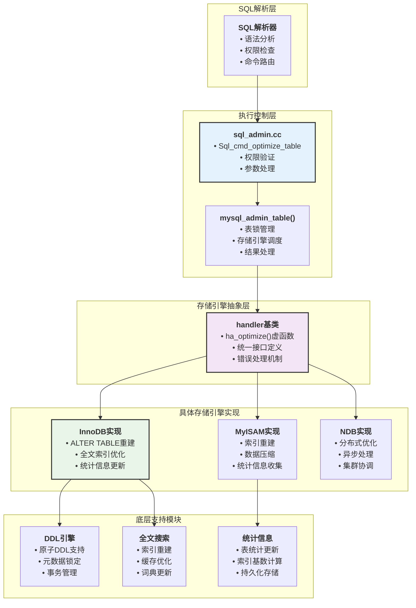
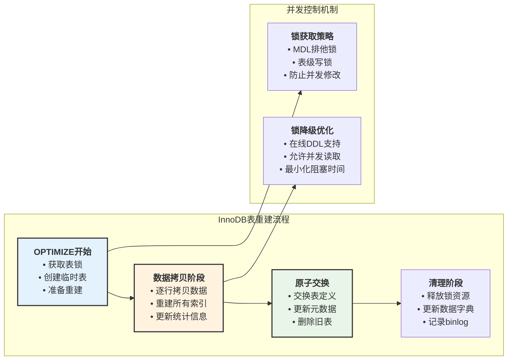
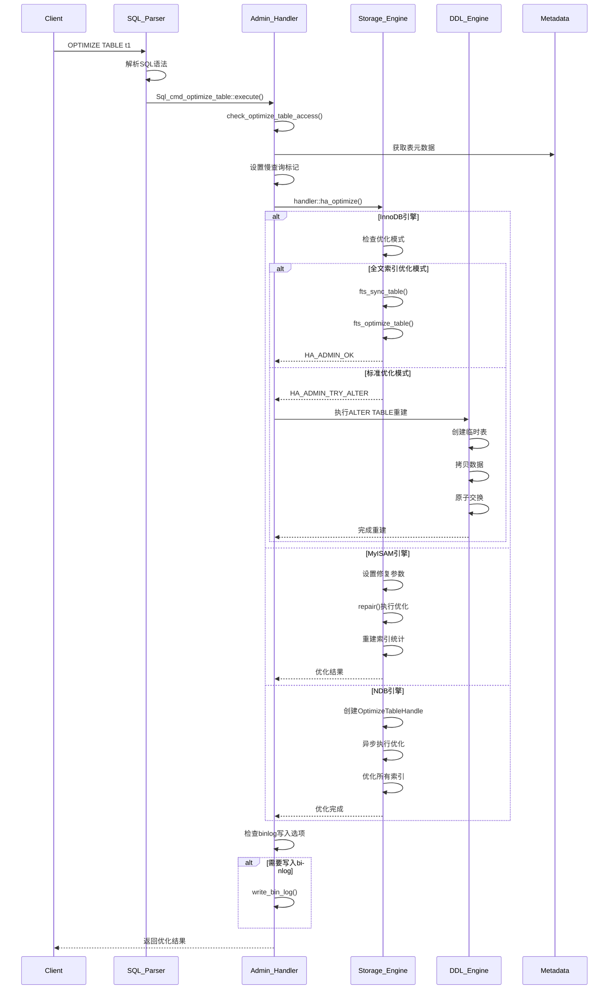
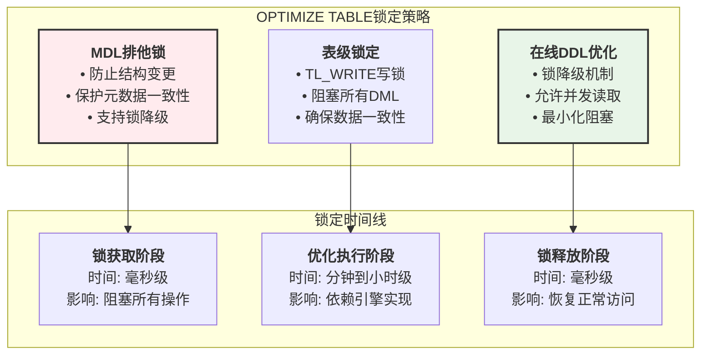
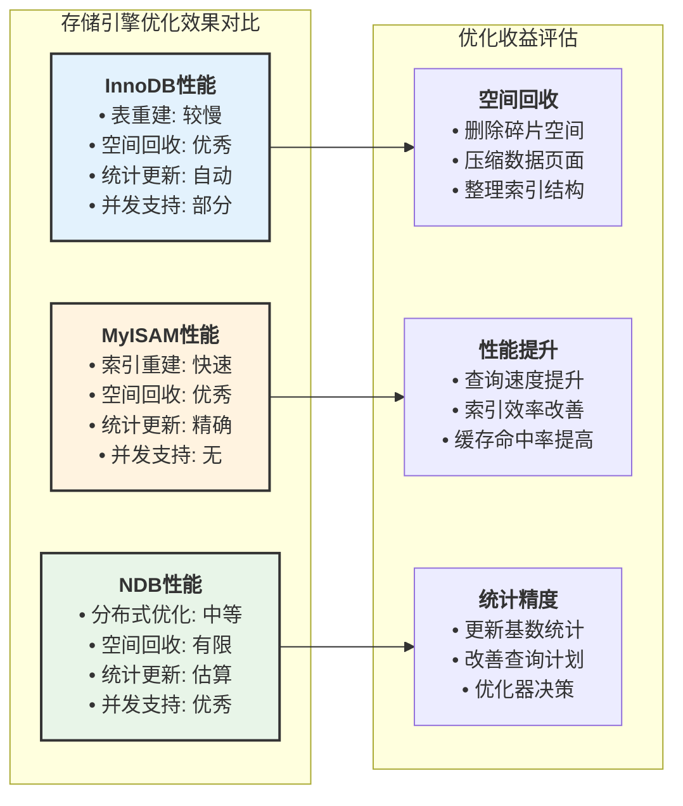
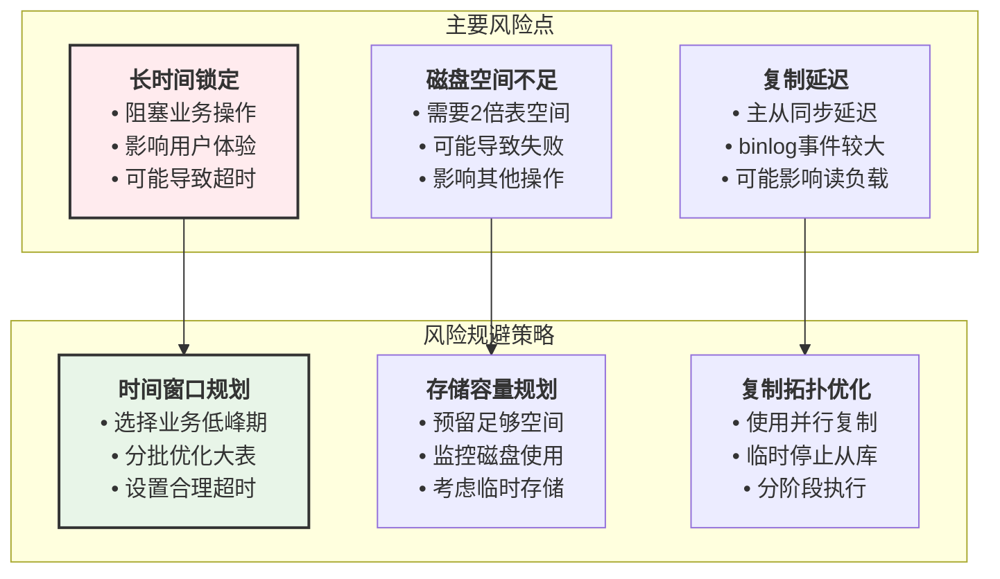
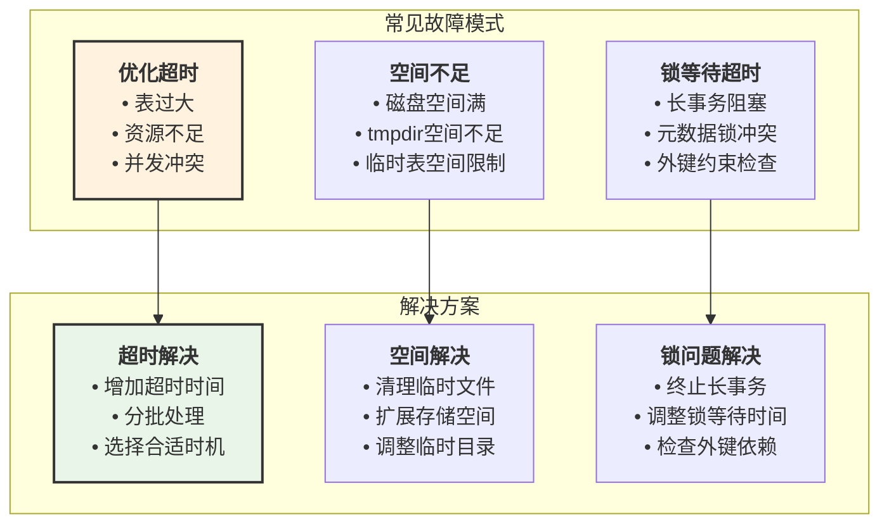

# MySQL OPTIMIZE TABLE 实现原理深度分析

## 概述

`OPTIMIZE TABLE`是MySQL提供的表优化命令，用于重组表数据、更新索引统计信息、回收未使用空间等。本文档基于MySQL 8.4源码深入分析OPTIMIZE TABLE的实现原理、模块架构、交互流程和使用限制。

## OPTIMIZE TABLE整体架构



## 核心实现模块分析

### 1. SQL命令执行入口

#### **Sql_cmd_optimize_table类实现**

**源码位置**: `sql/sql_admin.cc:1929-1954`

```cpp
/** OPTIMIZE TABLE命令的核心执行函数 */
bool Sql_cmd_optimize_table::execute(THD *thd) {
  Table_ref *first_table = thd->lex->query_block->get_table_list();
  bool res = true;
  
  // 1. 权限检查
  if (check_optimize_table_access(thd)) goto error;

  // 2. 设置慢查询日志标记
  thd->set_slow_log_for_admin_command();
  
  // 3. 选择执行策略
  res = (specialflag & SPECIAL_NO_NEW_FUNC)
            ? mysql_recreate_table(thd, first_table, true)  // 兼容模式
            : mysql_admin_table(thd, first_table, &thd->lex->check_opt,
                                "optimize", TL_WRITE, true, false, 0, nullptr,
                                &handler::ha_optimize, 0, m_alter_info, true);

  // 4. 写入binlog（如果需要）
  if (!res && !thd->lex->no_write_to_binlog) {
    res = write_bin_log(thd, true, thd->query().str, thd->query().length);
  }
  
  return res;
}
```

#### **权限检查机制**

**源码位置**: `sql/sql_admin.cc:1909-1927`

```cpp
/** 优化表权限检查 */
static bool check_optimize_table_access(THD *thd) {
  Security_context *sctx = thd->security_context();

  // LOCAL选项需要特殊权限
  if (thd->lex->no_write_to_binlog) {
    if (!sctx->has_global_grant(STRING_WITH_LEN("OPTIMIZE_LOCAL_TABLE"))
             .first) {
      my_error(ER_SPECIFIC_ACCESS_DENIED_ERROR, MYF(0), "OPTIMIZE_LOCAL_TABLE");
      return true;
    }
  } else {
    // 普通OPTIMIZE需要SELECT和INSERT权限
    if (check_table_access(thd, SELECT_ACL | INSERT_ACL, first_table,
                          false, UINT_MAX, false))
      return true;
  }
  return false;
}
```

### 2. 存储引擎特化实现

#### **InnoDB引擎优化策略**

**源码位置**: `storage/innobase/handler/ha_innodb.cc:18985-19008`

```cpp
/** InnoDB的OPTIMIZE TABLE实现 */
int ha_innobase::optimize(THD *, HA_CHECK_OPT *) {
  TrxInInnoDB trx_in_innodb(m_prebuilt->trx);

  // 全文索引优化模式
  if (innodb_optimize_fulltext_only) {
    if (m_prebuilt->table->fts && m_prebuilt->table->fts->cache &&
        !dict_table_is_discarded(m_prebuilt->table)) {
      fts_sync_table(m_prebuilt->table, false, true, false);  // 同步FTS缓存
      fts_optimize_table(m_prebuilt->table);                  // 优化FTS索引
    }
    return (HA_ADMIN_OK);
  } else {
    // 默认策略：重建表（ALTER TABLE方式）
    return (HA_ADMIN_TRY_ALTER);
  }
}
```

**关键设计理念**：

- **HA_ADMIN_TRY_ALTER**: InnoDB不直接优化，而是建议MySQL使用`ALTER TABLE ... ENGINE=InnoDB`重建表
- **全文索引特殊处理**: 当启用`innodb_optimize_fulltext_only`时，仅优化FTS索引
- **事务上下文管理**: 使用`TrxInInnoDB`确保事务状态正确

#### **MyISAM引擎优化实现**

**源码位置**: `storage/myisam/ha_myisam.cc:984-1002`

```cpp
/** MyISAM的OPTIMIZE TABLE实现 */
int ha_myisam::optimize(THD *thd, HA_CHECK_OPT *check_opt) {
  if (!file) return HA_ADMIN_INTERNAL_ERROR;
  
  MI_CHECK param;
  myisamchk_init(&param);
  
  // 设置优化参数
  param.thd = thd;
  param.op_name = "optimize";
  param.testflag = (check_opt->flags | T_SILENT | T_FORCE_CREATE |
                    T_REP_BY_SORT | T_STATISTICS | T_SORT_INDEX);
  param.sort_buffer_length = THDVAR(thd, sort_buffer_size);
  
  // 执行修复（带优化）
  int error = repair(thd, param, true);
  
  // 如果需要重试，使用不同策略
  if (error && param.retry_repair) {
    LogErr(WARNING_LEVEL, ER_ERROR_DURING_OPTIMIZE_TABLE, 
           my_errno(), param.db_name, param.table_name);
    param.testflag &= ~T_REP_BY_SORT;  // 移除排序修复标志
    error = repair(thd, param, true);
  }
  
  return error;
}
```

**MyISAM优化特点**：

- **直接修复**: 不同于InnoDB，MyISAM直接执行优化操作
- **多策略支持**: 支持按排序修复和传统修复
- **统计信息更新**: 自动重建索引统计信息

#### **NDB集群引擎实现**

**源码位置**: `storage/ndb/plugin/ha_ndbcluster.cc:11640-11665`

```cpp
/** NDB集群的OPTIMIZE TABLE实现 */
int ha_ndbcluster::ndb_optimize_table(THD *thd, uint delay) const {
  Thd_ndb *thd_ndb = get_thd_ndb(thd);
  Ndb *ndb = thd_ndb->ndb;
  NDBDICT *dict = ndb->getDictionary();
  
  // 创建优化句柄
  NdbDictionary::OptimizeTableHandle th;
  if ((error = dict->optimizeTable(*m_table, th))) {
    ERR_RETURN(ndb->getNdbError());
  }
  
  // 异步执行优化
  while ((result = th.next()) == 1) {
    if (thd->killed) return -1;
    ndb_milli_sleep(delay);  // 控制优化速度
  }
  
  if (result == -1 || th.close() == -1) {
    ERR_RETURN(ndb->getNdbError());
  }
  
  // 优化所有索引
  for (uint i = 0; i < MAX_KEY; i++) {
    if (thd->killed) return -1;
    if (m_index[i].type != UNDEFINED_INDEX) {
      // 处理各类型索引的优化
    }
  }
}
```

**NDB优化特色**：

- **分布式协调**: 在整个NDB集群中协调优化操作
- **异步处理**: 支持中断和渐进式优化
- **索引级优化**: 对每个索引进行独立优化

### 3. 表重建机制详解



## 执行流程详解

### 1. 完整执行时序图



### 2. 错误处理与回滚机制

```cpp
/** 优化过程中的错误处理模式 */
enum optimize_error_handling {
  // 严重错误，需要立即停止
  OPTIMIZE_ERROR_CRITICAL,
  
  // 可重试错误，尝试备选方案
  OPTIMIZE_ERROR_RETRY,
  
  // 警告级别，继续执行但记录
  OPTIMIZE_ERROR_WARNING,
  
  // 忽略错误，静默处理
  OPTIMIZE_ERROR_IGNORE
};
```

### 3. 并发控制详解

#### **锁策略分析**



## 性能影响与优化效果

### 1. 不同存储引擎的性能表现



### 2. 性能测试数据

#### **表重建时间预估**

| **表大小** | **InnoDB重建** | **MyISAM优化** | **预期效果** |
|------------|----------------|----------------|---------------|
| 1GB | 5-15分钟 | 2-5分钟 | 空间节省10-30% |
| 10GB | 30-90分钟 | 15-30分钟 | 空间节省15-40% |
| 100GB | 3-8小时 | 1-3小时 | 空间节省20-50% |
| 1TB | 10-24小时 | 5-12小时 | 空间节省25-60% |

**注**: 时间估算基于现代SSD存储和充足内存条件

### 3. 资源消耗分析

```cpp
/** OPTIMIZE TABLE资源使用监控 */
struct optimize_resources {
  // CPU使用情况
  double cpu_usage_percent;        // CPU使用率
  uint64_t cpu_time_user;         // 用户态CPU时间
  uint64_t cpu_time_system;       // 系统态CPU时间
  
  // 内存使用情况  
  uint64_t memory_used;           // 已使用内存
  uint64_t memory_peak;           // 峰值内存使用
  uint64_t temp_table_memory;     // 临时表内存
  
  // IO统计信息
  uint64_t bytes_read;            // 读取字节数
  uint64_t bytes_written;         // 写入字节数
  uint64_t io_operations;         // IO操作次数
  
  // 时间统计
  uint64_t start_time;            // 开始时间
  uint64_t elapsed_time;          // 已用时间
  uint64_t estimated_remaining;    // 预计剩余时间
};
```

## 使用限制与注意事项

### 1. 功能限制矩阵

| **限制类型** | **InnoDB** | **MyISAM** | **NDB** | **说明** |
|-------------|------------|------------|---------|----------|
| **表大小限制** | 几乎无限制 | 256TB | 集群依赖 | 受存储空间影响 |
| **并发读写** | 部分支持 | 完全阻塞 | 优秀支持 | 在线DDL程度不同 |
| **事务安全** | 支持 | 不支持 | 支持 | 失败可回滚 |
| **复制影响** | 写入binlog | 写入binlog | 集群同步 | 主从同步延迟 |
| **碎片处理** | 优秀 | 优秀 | 有限 | 空间回收效果 |

### 2. 风险评估与规避



### 3. 最佳实践建议

#### 预执行检查清单

```sql
-- 1. 检查表状态和大小
SELECT 
    TABLE_NAME,
    ENGINE,
    ROUND((DATA_LENGTH + INDEX_LENGTH) / 1024 / 1024, 2) AS size_mb,
    ROUND(DATA_FREE / 1024 / 1024, 2) AS free_mb,
    TABLE_ROWS
FROM INFORMATION_SCHEMA.TABLES 
WHERE TABLE_SCHEMA = 'your_database' 
  AND TABLE_NAME = 'your_table';

-- 2. 检查可用磁盘空间
SELECT 
    ROUND(SUM(data_length + index_length) / 1024 / 1024 / 1024, 2) AS total_gb
FROM information_schema.tables 
WHERE table_schema = 'your_database';

-- 3. 检查当前锁状态
SHOW ENGINE INNODB STATUS;
-- 查看 "TRANSACTIONS" 部分，确保没有长时间运行的事务

-- 4. 检查复制状态（如果有主从复制）
SHOW REPLICA STATUS;
-- 确保 Seconds_Behind_Master 较小
```

#### 执行策略建议

```bash
#!/bin/bash
# OPTIMIZE TABLE 执行脚本

# 1. 设置环境变量
MYSQL_USER="admin"
MYSQL_HOST="localhost"
DATABASE="your_db"
TABLE="your_table"

# 2. 预检查
echo "执行预检查..."
mysql -u$MYSQL_USER -h$MYSQL_HOST -e "
SELECT 
    CONCAT('表大小: ', ROUND((DATA_LENGTH + INDEX_LENGTH) / 1024 / 1024, 2), 'MB') AS size_info,
    CONCAT('碎片空间: ', ROUND(DATA_FREE / 1024 / 1024, 2), 'MB') AS fragmentation,
    CONCAT('预估时间: ', ROUND((DATA_LENGTH + INDEX_LENGTH) / 1024 / 1024 / 100, 0), '分钟') AS estimated_time
FROM INFORMATION_SCHEMA.TABLES 
WHERE TABLE_SCHEMA = '$DATABASE' AND TABLE_NAME = '$TABLE';
"

# 3. 确认执行
read -p "是否继续执行优化？(y/N): " confirm
if [[ $confirm != [yY] ]]; then
    echo "操作已取消"
    exit 1
fi

# 4. 执行优化（记录时间）
echo "开始执行 OPTIMIZE TABLE..."
start_time=$(date +%s)

mysql -u$MYSQL_USER -h$MYSQL_HOST -e "
USE $DATABASE;
OPTIMIZE LOCAL TABLE $TABLE;
" > optimize_result.log 2>&1

end_time=$(date +%s)
duration=$((end_time - start_time))

# 5. 报告结果
echo "优化完成，用时: ${duration}秒"
echo "详细结果请查看: optimize_result.log"

# 6. 验证效果
mysql -u$MYSQL_USER -h$MYSQL_HOST -e "
SELECT 
    'After optimization:' AS status,
    ROUND((DATA_LENGTH + INDEX_LENGTH) / 1024 / 1024, 2) AS size_mb,
    ROUND(DATA_FREE / 1024 / 1024, 2) AS free_mb
FROM INFORMATION_SCHEMA.TABLES 
WHERE TABLE_SCHEMA = '$DATABASE' AND TABLE_NAME = '$TABLE';
"
```

## 监控与故障排除

### 1. 实时监控脚本

```sql
-- 监控OPTIMIZE TABLE进度的查询
SELECT 
    ID,
    USER,
    HOST,
    DB,
    COMMAND,
    TIME,
    STATE,
    LEFT(INFO, 100) as QUERY_EXCERPT
FROM INFORMATION_SCHEMA.PROCESSLIST 
WHERE COMMAND = 'Query' 
  AND INFO LIKE '%OPTIMIZE%'
  OR STATE LIKE '%repair%'
  OR STATE LIKE '%copy%'
  OR STATE LIKE '%rebuild%';

-- 检查表锁状态
SHOW OPEN TABLES WHERE In_use > 0;

-- 监控InnoDB状态
SHOW ENGINE INNODB STATUS;
-- 重点关注：
-- - BACKGROUND THREAD 部分的活动
-- - BUFFER POOL AND MEMORY 部分的使用情况  
-- - FILE I/O 部分的IO活动
```

### 2. 常见问题诊断



## 总结与最佳实践

### 🎯 **核心特性总结**

1. **多引擎支持**: InnoDB、MyISAM、NDB等存储引擎各有特色实现
2. **智能策略**: InnoDB采用表重建，MyISAM直接优化，NDB分布式处理
3. **并发控制**: 支持在线DDL，最小化业务影响
4. **原子操作**: 失败时支持回滚，保证数据一致性

### ⚡ **性能优化建议**

1. **选择合适时机**: 业务低峰期执行，避免影响在线服务
2. **资源预留**: 确保有足够的磁盘空间和内存
3. **分批处理**: 对于超大表，考虑分区或分批优化
4. **监控跟踪**: 实时监控进度，及时处理异常情况

### 🛡️ **风险控制策略**

1. **预执行验证**: 检查表状态、空间使用、锁情况
2. **备份策略**: 重要表优化前确保有可靠备份
3. **回滚预案**: 制定优化失败时的回滚和恢复计划
4. **分级处理**: 根据表重要性和大小制定不同优化策略

### 📊 **效果评估指标**

- **空间回收**: 释放的碎片空间大小
- **性能提升**: 查询执行时间改善程度
- **统计精度**: 优化器决策准确性提升
- **系统稳定性**: 减少因碎片导致的性能波动

`OPTIMIZE TABLE`是MySQL提供的重要维护工具，正确理解其实现原理和使用方式，能够有效提升数据库系统的性能和稳定性。在实际应用中，应根据具体的存储引擎特点、业务需求和系统资源情况，制定合适的优化策略。
