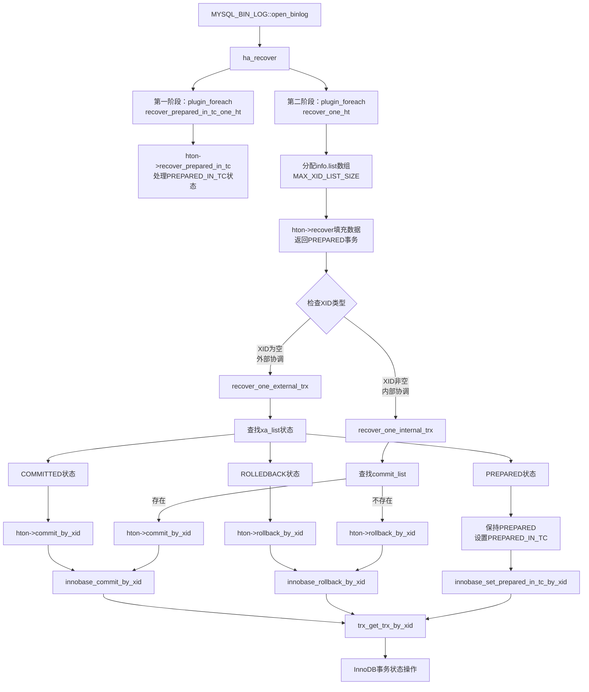
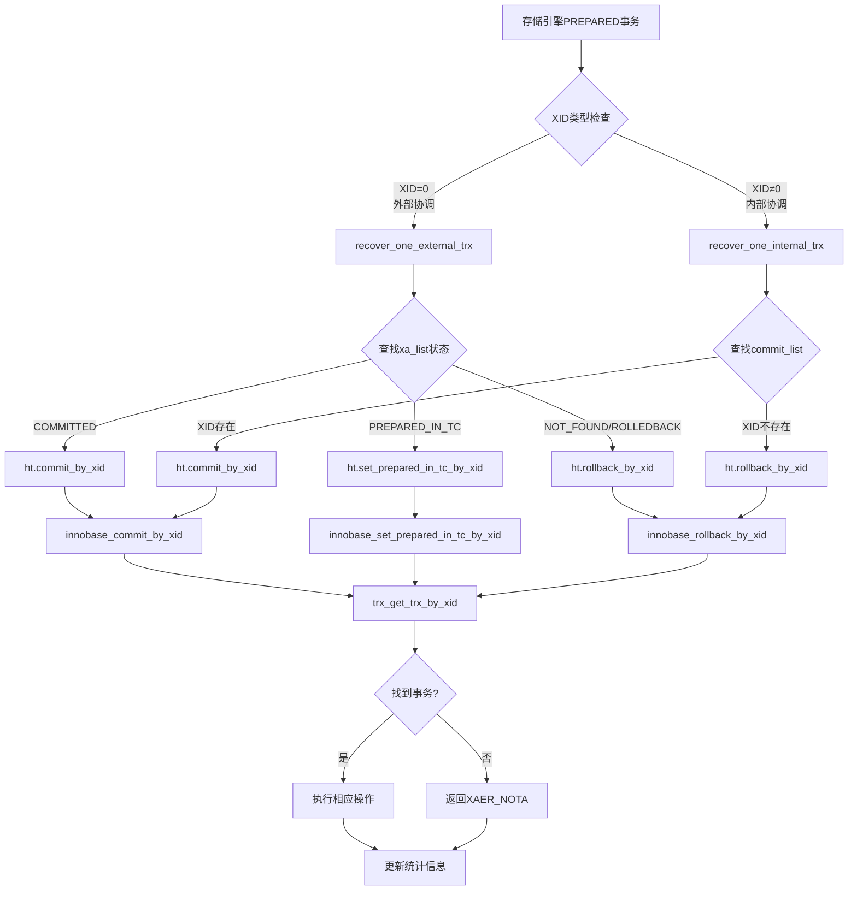

# MySQL 8.4 崩溃恢复调用链路分析

## 概述

本文档详细分析MySQL 8.4中`ha_recover`函数到InnoDB存储引擎层的完整调用路径，展示崩溃恢复的具体实现机制。

## 完整调用链路图



## 关键问题澄清

### 1. **第一阶段和第二阶段是否有交集？**

**答案：没有交集，处理完全不同的事务状态**

- **第一阶段** (`recover_prepared_in_tc_one_ht`): 
  - 只处理**PREPARED_IN_TC**状态的XA事务
  - 这些事务已经在事务协调器(TC)中被标记为prepared
  - 主要用于XA事务的特殊恢复场景

- **第二阶段** (`recover_one_ht`):
  - 处理所有**PREPARED**状态的事务（包括内部和外部协调）
  - 进行实际的提交/回滚决策

### 2. **`info->list` 数据从哪里来？**

**位置：** `sql/xa.cc:320-324`

```cpp
// 在ha_recover函数中动态分配
for (info.len = MAX_XID_LIST_SIZE;
     info.list == nullptr && info.len > MIN_XID_LIST_SIZE; info.len /= 2) {
  info.list = new (std::nothrow) XA_recover_txn[info.len];
}

// 数据填充过程
while ((got = ht->recover(ht, info->list, info->len, mem_root)) > 0) {
  // 存储引擎将PREPARED事务信息填充到info.list数组中
}
```

**数据流程：**
1. `ha_recover`分配`XA_recover_txn`数组作为`info.list`
2. 调用各存储引擎的`recover`函数填充数据
3. InnoDB通过`innobase_xa_recover` → `trx_recover_tc_for_mysql`填充prepared事务信息

### 3. **XA和非XA事务的区分处理**

**位置：** `sql/xa/recovery.cc:207-232`

```cpp
for (int i = 0; i < got; ++i) {
  auto &xa_trx = info->list[i];
  my_xid xid = xa_trx.id.get_my_xid();

  if (!xid) {  // ✅ 外部协调事务 (XA事务)
    ::recover_one_external_trx(*info, *ht, xa_trx, external_stats);
    ++info->found_foreign_xids;
    continue;
  }

  // ✅ 内部协调事务 (普通事务)
  ::recover_one_internal_trx(*info, *ht, xa_trx, xid, internal_stats);
  ++info->found_my_xids;
}
```

**区分标准：**
- **XA事务**: `xid.get_my_xid() == 0` (外部协调)
- **普通事务**: `xid.get_my_xid() != 0` (内部协调)

## 详细调用链路分析

### 1. 入口函数：`ha_recover`

**位置：** `sql/xa.cc:270`

```cpp
int ha_recover(Xid_commit_list *commit_list, Xa_state_list *xa_list) {
  xarecover_st info;
  info.commit_list = commit_list;    // m_internal_xids (已确认提交事务)
  info.xa_list = xa_list;           // m_external_xids (XA事务状态)
  
  // 两阶段调用所有存储引擎
  plugin_foreach(nullptr, xa::recovery::recover_prepared_in_tc_one_ht,
                 MYSQL_STORAGE_ENGINE_PLUGIN, &info);
  plugin_foreach(nullptr, xa::recovery::recover_one_ht,
                 MYSQL_STORAGE_ENGINE_PLUGIN, &info);
}
```

**功能：**
- 协调所有存储引擎的崩溃恢复过程
- 传递binlog扫描得到的已确认提交事务列表(`commit_list`)
- 收集各存储引擎的prepared事务状态

### 2. 第一阶段：收集PREPARED_IN_TC事务

**位置：** `sql/xa/recovery.cc:181`

```cpp
bool xa::recovery::recover_prepared_in_tc_one_ht(THD *, plugin_ref plugin, void *arg) {
  handlerton *ht = plugin_data<handlerton *>(plugin);
  xarecover_st *info = static_cast<struct xarecover_st *>(arg);
  
  if (ht->state == SHOW_OPTION_YES && ht->recover_prepared_in_tc) {
    assert(info->xa_list != nullptr);
    return ht->recover_prepared_in_tc(ht, *info->xa_list);
  }
  return false;
}
```

**功能：**
- 收集处于`PREPARED_IN_TC`状态的XA事务
- 这些事务在TC(事务协调器)中已被标记为prepared
- 用于处理分布式事务的特殊情况

### 3. 第二阶段：处理所有PREPARED事务

**位置：** `sql/xa/recovery.cc:190`

```cpp
bool xa::recovery::recover_one_ht(THD *, plugin_ref plugin, void *arg) {
  handlerton *ht = plugin_data<handlerton *>(plugin);
  xarecover_st *info = static_cast<struct xarecover_st *>(arg);
  
  // 🔥 关键：分配和填充info->list数组
  while ((got = ht->recover(ht, info->list, info->len, mem_root)) > 0) {
    for (int i = 0; i < got; ++i) {
      auto &xa_trx = info->list[i];
      my_xid xid = xa_trx.id.get_my_xid();
      
      if (!xid) {  // XA事务处理
        ::recover_one_external_trx(*info, *ht, xa_trx, external_stats);
      } else {     // 普通事务处理  
        ::recover_one_internal_trx(*info, *ht, xa_trx, xid, internal_stats);
      }
    }
  }
}
```

### 4. 内部协调事务恢复：`recover_one_internal_trx`

**位置：** `sql/xa/recovery.cc:261`

```cpp
void recover_one_internal_trx(xarecover_st const &info, handlerton &ht,
                              XA_recover_txn const &xa_trx, my_xid xid,
                              ::recovery_statistics &stats) {
  // 🎯 关键决策逻辑
  if (info.commit_list ? info.commit_list->count(xid) != 0
                       : tc_heuristic_recover == TC_HEURISTIC_RECOVER_COMMIT) {
    // ✅ 在binlog commit_list中找到 → COMMIT
    exec_status = ht.commit_by_xid(&ht, const_cast<XID *>(&xa_trx.id));
  } else {
    // ❌ 不在binlog commit_list中 → ROLLBACK
    exec_status = ht.rollback_by_xid(&ht, const_cast<XID *>(&xa_trx.id));
  }
}
```

**功能：**
- 根据binlog的`commit_list`决定普通事务fate
- 在列表中：调用`commit_by_xid`提交
- 不在列表中：调用`rollback_by_xid`回滚

### 5. 外部协调事务恢复：`recover_one_external_trx`

**位置：** `sql/xa/recovery.cc:295`

```cpp
void recover_one_external_trx(xarecover_st const &info, handlerton &ht,
                              XA_recover_txn const &xa_trx,
                              ::recovery_statistics &stats) {
  enum_ha_recover_xa_state state = enum_ha_recover_xa_state::NOT_FOUND;
  
  if (info.xa_list != nullptr) {
    state = info.xa_list->find(xa_trx.id);  // 🔍 查找XA事务状态
  }

  switch (state) {
    case enum_ha_recover_xa_state::COMMITTED:
    case enum_ha_recover_xa_state::COMMITTED_WITH_ONEPHASE:
      // ✅ XA事务已提交 → COMMIT
      exec_status = ht.commit_by_xid(&ht, const_cast<XID *>(&xa_trx.id));
      break;
      
    case enum_ha_recover_xa_state::PREPARED_IN_TC:
      // 🔄 XA事务仍在准备状态 → 保持PREPARED，设置PREPARED_IN_TC
      if (ht.set_prepared_in_tc_by_xid != nullptr) {
        exec_status = ht.set_prepared_in_tc_by_xid(&ht, const_cast<XID *>(&xa_trx.id));
      }
      break;
      
    case enum_ha_recover_xa_state::NOT_FOUND:
    case enum_ha_recover_xa_state::ROLLEDBACK:
    default:
      // ❌ XA事务未找到或已回滚 → ROLLBACK  
      exec_status = ht.rollback_by_xid(&ht, const_cast<XID *>(&xa_trx.id));
      break;
  }
}
```

**功能：**
- 根据`xa_list`中的XA事务状态决定fate
- `COMMITTED`: 提交事务
- `PREPARED_IN_TC`: 保持prepared状态，设置存储引擎标记
- `NOT_FOUND`/`ROLLEDBACK`: 回滚事务

## InnoDB引擎层实现分析

### 6. InnoDB恢复入口：`innobase_xa_recover`

**位置：** `storage/innobase/handler/ha_innodb.cc:4831`

```cpp
static int innobase_xa_recover(handlerton *, XID *xid_list, uint len) {
  if (len == 0 || xid_list == nullptr) return 0;
  
  // 调用InnoDB事务层恢复函数
  return trx_recover_for_mysql(xid_list, len);
}
```

### 7. InnoDB事务恢复核心：`trx_recover_for_mysql`

**位置：** `storage/innobase/trx/trx0roll.cc:872`

```cpp
ulint trx_recover_for_mysql(XID *xid_list, ulint len) {
  if (srv_read_only_mode) return 0;
  if (!srv_was_started) return 0;
  
  return trx_recover_tc_for_mysql(xid_list, len);
}
```

### 8. 事务协调器恢复：`trx_recover_tc_for_mysql`

**位置：** `storage/innobase/trx/trx0roll.cc:831`

```cpp
static ulint trx_recover_tc_for_mysql(XID *xid_list, ulint len) {
  ulint count = 0;
  
  mutex_enter(&trx_sys->mutex);  // 🔒 获取全局事务系统锁
  
  // 🔄 遍历所有活跃事务
  for (trx_t *trx = UT_LIST_GET_FIRST(trx_sys->trx_list);
       trx != nullptr && count < len;
       trx = UT_LIST_GET_NEXT(trx_list, trx)) {
    
    if (trx->state == TRX_STATE_PREPARED) {  // ✅ 只处理PREPARED状态
      xid_list[count] = trx->xid;           // 复制XID到输出列表
      if (trx->xid.gtrid_length == 0) {     // 处理内部XID格式
        trx->xid.gtrid_length = static_cast<long>(sizeof(trx->id));
      }
      count++;
    }
  }
  
  mutex_exit(&trx_sys->mutex);  // 🔓 释放锁
  return count;
}
```

### 9. 事务提交恢复：`innobase_commit_by_xid`

**位置：** `storage/innobase/handler/ha_innodb.cc:4775`

```cpp
static int innobase_commit_by_xid(handlerton *, XID *xid) {
  trx_t *trx = trx_get_trx_by_xid(xid);  // 🔍 根据XID查找事务
  
  if (trx != nullptr) {
    innobase_commit_low(trx);  // ✅ 提交事务
    return XA_OK;
  } else {
    return XAER_NOTA;  // ❌ XID not found
  }
}
```

### 10. 事务回滚恢复：`innobase_rollback_by_xid`

**位置：** `storage/innobase/handler/ha_innodb.cc:4798`

```cpp
static int innobase_rollback_by_xid(handlerton *, XID *xid) {
  trx_t *trx = trx_get_trx_by_xid(xid);  // 🔍 根据XID查找事务
  
  if (trx != nullptr) {
    int ret = innobase_rollback_trx(trx);  // ❌ 回滚事务
    return ret;
  } else {
    return XAER_NOTA;  // ❌ XID not found
  }
}
```

### 11. XID查找核心：`trx_get_trx_by_xid`

**位置：** `storage/innobase/trx/trx0trx.cc:2654`

```cpp
trx_t *trx_get_trx_by_xid(const XID *xid) {
  mutex_enter(&trx_sys->mutex);  // 🔒 获取系统锁
  
  // 🔄 遍历所有事务查找匹配的XID
  for (trx_t *trx = UT_LIST_GET_FIRST(trx_sys->trx_list);
       trx != nullptr;
       trx = UT_LIST_GET_NEXT(trx_list, trx)) {
    
    if (trx->state == TRX_STATE_PREPARED) {  // ✅ 只检查PREPARED事务
      if (xid->eq(&trx->xid)) {              // 🎯 XID精确匹配
        mutex_exit(&trx_sys->mutex);
        return trx;
      }
    }
  }
  
  mutex_exit(&trx_sys->mutex);
  return nullptr;  // ❌ 未找到
}
```

## 恢复决策算法

### 完整决策流程



### 关键数据结构

#### `xarecover_st` 结构

**位置：** `sql/xa/recovery.h:22`

```cpp
struct xarecover_st {
  int len, found_foreign_xids, found_my_xids;
  XA_recover_txn *list;                    // 🎯 存储引擎填充的事务数组
  Xid_commit_list const *commit_list;      // 🎯 binlog已确认提交的内部事务
  Xa_state_list *xa_list;                  // 🎯 binlog扫描到的XA事务状态
  bool dry_run;
};
```

#### InnoDB事务状态

```cpp
enum trx_state_t {
  TRX_STATE_NOT_STARTED,    // 未开始
  TRX_STATE_ACTIVE,         // 活跃
  TRX_STATE_PREPARED,       // ✅ 已准备(2PC第一阶段完成)
  TRX_STATE_COMMITTED_IN_MEMORY  // 已提交
};
```

## `info->list` 数据填充详细过程

本节详细展开`info->list`如何从InnoDB全局事务列表中获取PREPARED状态事务并填充到数组中的完整过程。

### 数据来源：InnoDB全局事务系统

**核心数据结构：** `trx_sys->rw_trx_list`

```cpp
// 位置：storage/innobase/include/trx0sys.h
struct trx_sys_t {
  TrxSysMutex mutex;                    // 🔒 全局事务系统互斥锁
  trx_list_t rw_trx_list;              // 🎯 所有读写事务的双向链表
  trx_list_t mysql_trx_list;           // MySQL层事务链表
  ulint n_prepared_trx;                // PREPARED状态事务计数
  // ... 其他字段
};
```

**事务对象结构：** `trx_t`

```cpp
// 位置：storage/innobase/include/trx0trx.h
struct trx_t {
  trx_id_t id;                         // 事务ID
  XID xid;                            // 🎯 X/Open XA事务标识符
  trx_state_t state;                  // 🎯 事务状态 (PREPARED/ACTIVE/etc.)
  THD *mysql_thd;                     // MySQL线程句柄
  bool is_recovered;                  // 是否为恢复的事务
  // ... 其他字段
};
```

### 填充流程详细分析

#### 步骤1：数组动态分配

**位置：** `sql/xa.cc:320-324`

```cpp
// 🔧 动态分配XA_recover_txn数组，从大到小尝试分配
for (info.len = MAX_XID_LIST_SIZE;                    // 默认1024
     info.list == nullptr && info.len > MIN_XID_LIST_SIZE; // 最小128  
     info.len /= 2) {                                 // 分配失败则减半重试
  info.list = new (std::nothrow) XA_recover_txn[info.len];
}

// 🚨 分配失败则报告内存不足错误
if (!info.list) {
  LogErr(ERROR_LEVEL, ER_SERVER_OUTOFMEMORY, 
         static_cast<int>(info.len * sizeof(XID)));
  return 1;
}
```

#### 步骤2：调用存储引擎填充数据

**调用链路：**
```
recover_one_ht → ht->recover → innobase_xa_recover → trx_recover_for_mysql → trx_recover_tc_for_mysql
```

#### 步骤3：InnoDB核心填充逻辑 - `trx_recover_tc_for_mysql`

**位置：** `storage/innobase/trx/trx0trx.cc:3262`

```cpp
static ulint trx_recover_tc_for_mysql(XA_recover_txn *txn_list, ulint len, 
                                      MEM_ROOT *mem_root) {
  ulint count = 0;
  
  // 🔒 获取全局事务系统锁，保护事务列表访问
  trx_sys_mutex_enter();
  
  // 🔄 遍历InnoDB全局读写事务列表
  for (const trx_t *trx : trx_sys->rw_trx_list) {
    assert_trx_in_rw_list(trx);  // 调试断言：确保事务在RW列表中
    
    // 🎯 状态检查：只处理PREPARED状态的事务
    if (trx_state_eq(trx, TRX_STATE_PREPARED)) {
      
      // 🏗️ 填充XA_recover_txn结构
      if (get_info_about_prepared_transaction(&txn_list[count], trx, mem_root)) {
        break;  // 内存分配失败，中止填充
      }
      
      // 📊 记录调试信息
      if (count == 0) {
        ib::info(ER_IB_MSG_1207) << "Starting recovery for XA transactions...";
      }
      
      ib::info(ER_IB_MSG_1208) << "Transaction " << trx_get_id_for_print(trx)
                               << " in prepared state after recovery";
      
      ib::info(ER_IB_MSG_1209) << "Transaction contains changes to " 
                               << trx->undo_no << " rows";
      
      count++;
      
      // 🛑 数组满了，停止填充
      if (count == len) break;
    }
  }
  
  // 🔓 释放全局事务系统锁
  trx_sys_mutex_exit();
  
  // 📈 统计信息
  if (count > 0) {
    ib::info(ER_IB_MSG_1210) << count << " transactions in prepared state after recovery";
  }
  
  return count;  // 返回实际填充的事务数量
}
```

#### 步骤4：事务信息提取函数

**位置：** `storage/innobase/trx/trx0trx.cc:3213`

```cpp
static bool get_info_about_prepared_transaction(XA_recover_txn *txn_info, 
                                                const trx_t *trx, 
                                                MEM_ROOT *mem_root) {
  // 🆔 复制XID信息
  txn_info->id = *trx->xid;  // 深拷贝XA事务标识符
  
  // 📋 填充涉及的表信息（用于MDL锁恢复）
  if (!trx->mod_tables.empty()) {
    // 🏗️ 分配表名列表内存
    txn_info->mod_tables = new (mem_root) List<st_handler_tablename>;
    if (!txn_info->mod_tables) return true;  // 内存分配失败
    
    // 🔄 遍历事务修改的所有表
    for (const auto &table_entry : trx->mod_tables) {
      const dict_table_t *dd_table = table_entry.first;
      
      // 🏷️ 分配表名结构体
      st_handler_tablename *table_name = 
          new (mem_root) st_handler_tablename;
      if (!table_name) return true;
      
      // 📝 获取表名和数据库名
      if (get_table_name_info(table_name, dd_table, mem_root)) {
        return true;  // 获取表信息失败
      }
      
      // ➕ 添加到表名列表
      txn_info->mod_tables->push_back(table_name);
    }
  } else {
    txn_info->mod_tables = nullptr;  // 没有修改的表
  }
  
  return false;  // 成功
}
```

### 数据填充流程图

```mermaid
sequenceDiagram
    participant HA as **ha_recover**
    participant PE as **plugin_foreach**
    participant RO as **recover_one_ht**
    participant IE as **innobase_xa_recover**
    participant TM as **trx_recover_tc_for_mysql**
    participant TS as **trx_sys_rw_trx_list**
    
    HA->>HA: 分配info.list数组<br/>(MAX_XID_LIST_SIZE=1024)
    HA->>PE: plugin_foreach调用所有存储引擎
    PE->>RO: 调用recover_one_ht处理InnoDB
    RO->>IE: hton recover(info.list, info.len)
    IE->>TM: trx_recover_tc_for_mysql(xid_list, len)
    
    TM->>TM: trx_sys_mutex_enter()
    Note over TM: 🔒 获取事务系统互斥锁
    
    loop 遍历所有读写事务
        TM->>TS: 获取下一个事务trx
        TS->>TM: 返回事务对象
        
        alt trx->state == TRX_STATE_PREPARED
            TM->>TM: get_info_about_prepared_transaction()
            Note right of TM: 填充XID信息<br/>填充表名列表<br/>设置恢复标志
            TM->>TM: txn_list[count++] = 事务信息
        else trx->state != PREPARED
            Note right of TM: 跳过非PREPARED事务
        end
        
        alt count >= len
            Note right of TM: 数组已满，停止填充
            break
        end
    end
    
    TM->>TM: trx_sys_mutex_exit()
    Note over TM: 🔓 释放事务系统互斥锁
    TM->>IE: return count (实际填充数量)
    IE->>RO: 返回PREPARED事务数量
    RO->>PE: 处理填充的事务数据
    PE->>HA: 完成所有存储引擎处理
```

### 内存管理和性能优化

#### 内存分配策略
```cpp
// 🎯 分配策略：从大到小尝试
MAX_XID_LIST_SIZE = 1024    // 首次尝试
    ↓ (分配失败)
512                         // 减半重试
    ↓ (分配失败)  
256                         // 继续减半
    ↓ (分配失败)
128 = MIN_XID_LIST_SIZE    // 最小尝试
    ↓ (分配失败)
报告内存不足错误             // 完全失败
```

#### 批量处理机制
```cpp
// 🔄 批量填充循环
while ((got = ht->recover(ht, info->list, info->len, mem_root)) > 0) {
  // got: 本次实际获取到的事务数量 (≤ info->len)
  
  for (int i = 0; i < got; ++i) {
    // 处理本批次的每个事务
    process_transaction(info->list[i]);
  }
  
  // 如果got < info->len，说明所有事务已处理完毕
  if (got < info->len) break;
  
  // 否则继续下一批次处理
}
```

### 关键设计考虑

#### 1. **并发安全**
- 使用`trx_sys->mutex`保护全局事务列表访问
- 确保在遍历过程中事务状态不会改变

#### 2. **内存效率**
- 动态分配避免内存浪费
- 失败时自动降级到更小的数组大小

#### 3. **状态一致性**
- 只处理`TRX_STATE_PREPARED`状态事务
- 严格验证事务状态合法性

#### 4. **恢复完整性**
- 记录修改的表信息用于MDL锁恢复
- 保留事务的所有必要元数据

这个详细的填充过程确保了崩溃恢复时能够准确识别和处理所有需要恢复的PREPARED事务，为后续的提交/回滚决策提供完整的数据基础。

## 性能考虑

### 锁机制
- **全局锁**：`trx_sys->mutex` 保护事务列表遍历
- **锁粒度**：整个恢复过程持有系统级锁
- **锁竞争**：恢复期间阻塞新事务创建

### 扫描效率
- **线性扫描**：O(n) 复杂度遍历所有活跃事务
- **过滤条件**：只处理`TRX_STATE_PREPARED`状态事务
- **批量处理**：通过`info.len`控制批量大小，避免内存溢出

## 错误处理

### 异常情况
1. **XID不匹配**：返回`XAER_NOTA`
2. **事务状态错误**：跳过非PREPARED事务
3. **系统未启动**：直接返回0个事务
4. **只读模式**：跳过恢复过程

### 容错机制
- **渐进恢复**：批量处理事务，避免内存溢出
- **状态检查**：严格验证事务状态合法性
- **资源释放**：确保锁资源正确释放
- **统计跟踪**：记录成功/失败统计，便于问题诊断

## 总结

MySQL 8.4的崩溃恢复机制通过精心设计的多层调用链，实现了高效可靠的事务恢复：

1. **分层设计**：Server层协调，存储引擎层执行
2. **两阶段恢复**：第一阶段处理PREPARED_IN_TC，第二阶段处理所有PREPARED
3. **精确区分**：基于XID值区分XA和普通事务，采用不同决策逻辑
4. **状态驱动**：基于binlog扫描结果的精确恢复决策
5. **性能优化**：批量处理和线性扫描优化
6. **错误处理**：完善的异常处理和统计机制

这种设计确保了在各种崩溃场景下，MySQL都能准确恢复到一致状态，保证了ACID属性的完整实现。
