# MySQL Clone克隆管理命令深度解析

## 概述

本文档详细解析MySQL Clone插件的管理命令，从**源码层面**深入分析命令执行流程、架构设计和可观测性信息的采集与存储机制。Clone插件允许在本地或远程复制InnoDB数据。

**基于源码**: `plugin/clone/src/clone_plugin.cc`, `plugin/clone/src/clone_client.cc`, `plugin/clone/src/clone_server.cc`

---

## 第一部分：Clone管理命令总览

### 1.1 核心管理命令列表

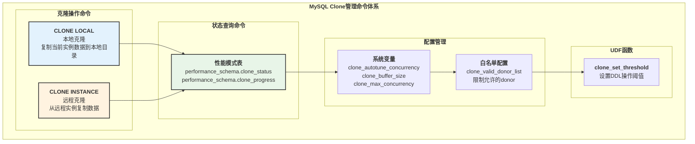

**命令详细列表**:

| 命令类型 | 语法 | 权限 | 说明 |
|---------|------|------|------|
| `CLONE LOCAL` | `CLONE LOCAL DATA DIRECTORY = '/path'` | BACKUP_ADMIN | 克隆本地实例到指定目录 |
| `CLONE INSTANCE` | `CLONE INSTANCE FROM 'user'@'host':port IDENTIFIED BY 'password'` | BACKUP_ADMIN, CLONE_ADMIN | 从远程实例克隆数据 |
| `SELECT * FROM clone_status` | Performance Schema查询 | SELECT | 查看克隆状态 |
| `SELECT * FROM clone_progress` | Performance Schema查询 | SELECT | 查看克隆进度 |

---

## 第二部分：CLONE LOCAL 源码深度解析

### 2.1 CLONE LOCAL 架构

**源码位置**: `plugin/clone/src/clone_plugin.cc:464-479`

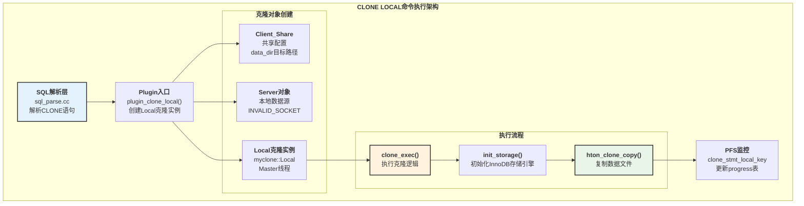

### 2.2 CLONE LOCAL 时序图

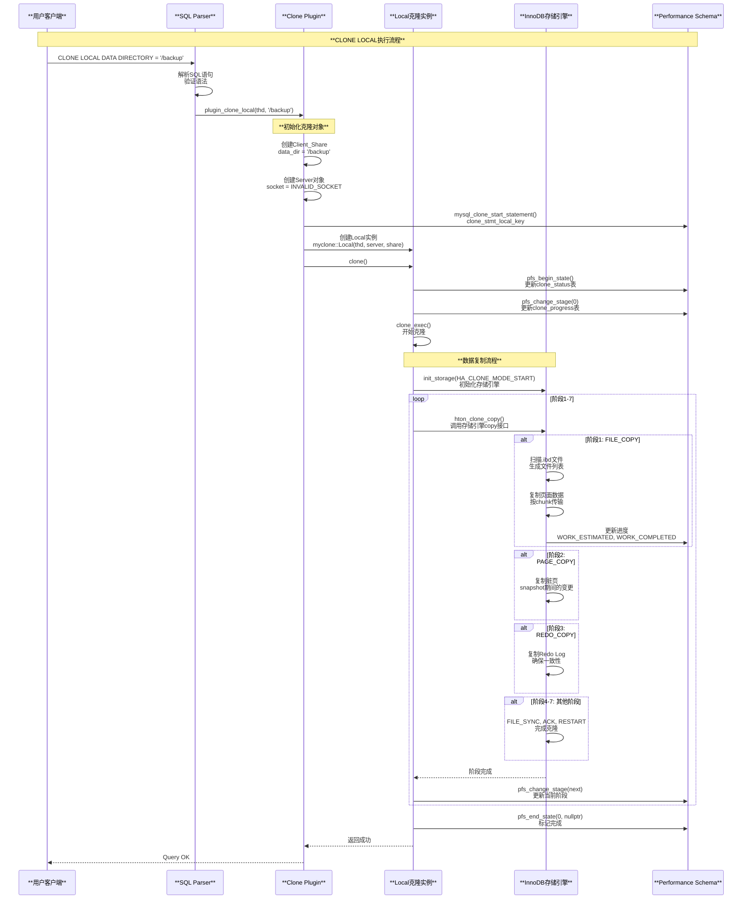

### 2.3 CLONE LOCAL 关键源码

**源码位置**: `plugin/clone/src/clone_plugin.cc:464-479`

```cpp
static int plugin_clone_local(THD *thd, const char *data_dir) {
  // 1. 创建Client共享配置
  myclone::Client_Share client_share(
      nullptr, 0, nullptr, nullptr, data_dir, 0);

  // 2. 创建Server对象（本地克隆不需要网络socket）
  myclone::Server server(thd, MYSQL_INVALID_SOCKET);

  // 3. 更新Performance Schema监控
  mysql_service_clone_protocol->mysql_clone_start_statement(
      thd, PSI_NOT_INSTRUMENTED, clone_stmt_local_key);

  // 4. 创建Local克隆实例（Master线程）
  myclone::Local clone_inst(thd, &server, &client_share, 0, true);

  // 5. 执行克隆
  auto error = clone_inst.clone();

  return (error);
}
```

**Local::clone()实现** (`plugin/clone/src/clone_local.cc:63-85`):

```cpp
int Local::clone() {
  // 1. 开始PFS状态跟踪
  auto err = m_clone_client.pfs_begin_state();
  if (err != 0) {
    return (err);
  }

  // 2. 切换到第一个阶段
  m_clone_client.pfs_change_stage(0);

  // 3. 执行克隆
  err = clone_exec();

  // 4. 结束PFS状态
  const char *err_mesg = nullptr;
  uint32_t err_number = 0;
  auto thd = m_clone_client.get_thd();

  mysql_service_clone_protocol->mysql_clone_get_error(
      thd, &err_number, &err_mesg);
  m_clone_client.pfs_end_state(err_number, err_mesg);
  
  return (err);
}
```

---

## 第三部分：CLONE INSTANCE 源码深度解析

### 3.1 CLONE INSTANCE 架构

**源码位置**: `plugin/clone/src/clone_plugin.cc:490-514`

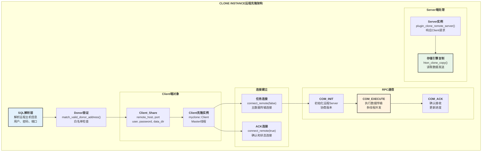

### 3.2 CLONE INSTANCE 完整时序图

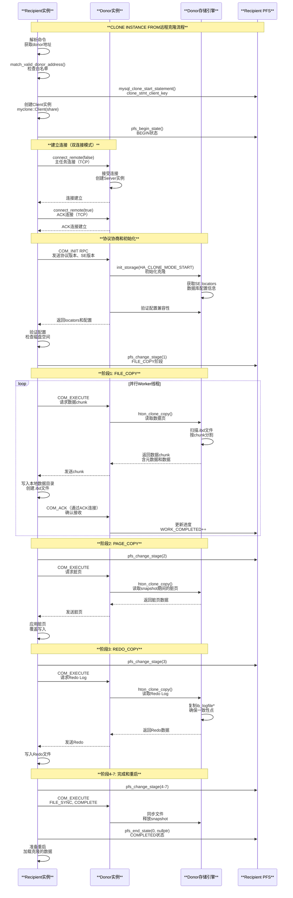

### 3.3 CLONE INSTANCE 关键源码

**源码位置**: `plugin/clone/src/clone_plugin.cc:490-514`

```cpp
static int plugin_clone_remote_client(
    THD *thd, const char *remote_host, uint remote_port,
    const char *remote_user, const char *remote_passwd,
    const char *data_dir, int ssl_mode) {
  
  // 1. 验证donor地址是否在白名单中
  auto error = match_valid_donor_address(thd, remote_host, remote_port);
  if (error != 0) {
    return (error);
  }

  // 2. 创建Client共享配置
  myclone::Client_Share client_share(
      remote_host, remote_port, remote_user, remote_passwd,
      data_dir, ssl_mode);

  // 3. 更新PFS监控
  mysql_service_clone_protocol->mysql_clone_start_statement(
      thd, PSI_NOT_INSTRUMENTED, clone_stmt_client_key);

  // 4. 创建Client克隆实例
  myclone::Client clone_inst(thd, &client_share, 0, true);

  // 5. 执行远程克隆
  error = clone_inst.clone();

  return (error);
}
```

**Client::clone()实现** (`plugin/clone/src/clone_client.cc:702-800`):

```cpp
int Client::clone() {
  bool restart = false;
  uint restart_count = 0;
  auto num_workers = get_max_concurrency() - 1;

  // 开始PFS状态
  auto err = pfs_begin_state();
  if (err != 0) {
    return (err);
  }

  do {
    ++restart_count;

    // 建立主任务连接
    err = connect_remote(restart, false);
    if (err != 0) {
      break;
    }

    // 建立ACK连接
    err = connect_remote(restart, true);
    if (err != 0) {
      break;
    }

    // 选择RPC命令
    auto rpc_com = is_master() ? COM_INIT : COM_ATTACH;
    if (restart) {
      rpc_com = COM_REINIT;
    }

    // 发送初始化命令
    err = remote_command(rpc_com, false);
    if (err != 0) {
      break;
    }

    // 执行克隆（多线程并发）
    err = clone_exec(num_workers);
    
    // 根据返回值决定是否重启
    if (err == ER_CLONE_DONOR_RESTART) {
      restart = true;
      continue;
    }
    break;
  } while (true);

  return (err);
}
```

---

## 第四部分：克隆阶段详解

### 4.1 克隆七阶段架构

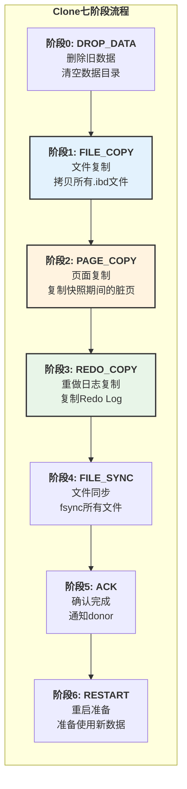

**阶段详细说明**:

| 阶段 | 枚举值 | 说明 | 工作内容 |
|-----|-------|------|---------|
| DROP_DATA | 0 | 删除数据 | 清空recipient的数据目录 |
| FILE_COPY | 1 | 文件复制 | 复制所有InnoDB数据文件(.ibd), 按chunk分块传输 |
| PAGE_COPY | 2 | 页面复制 | 复制FILE_COPY期间修改的脏页 |
| REDO_COPY | 3 | Redo复制 | 复制Redo Log, 确保一致性恢复点 |
| FILE_SYNC | 4 | 文件同步 | fsync所有文件到磁盘 |
| ACK | 5 | 确认 | 通知donor完成, 释放快照 |
| RESTART | 6 | 重启 | Recipient准备重启使用新数据 |

### 4.2 并发控制机制

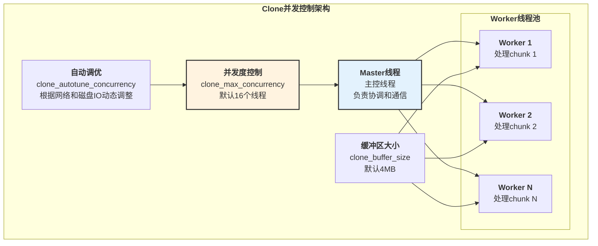

---

## 第五部分：可观测性信息深度解析

### 5.1 可观测性架构

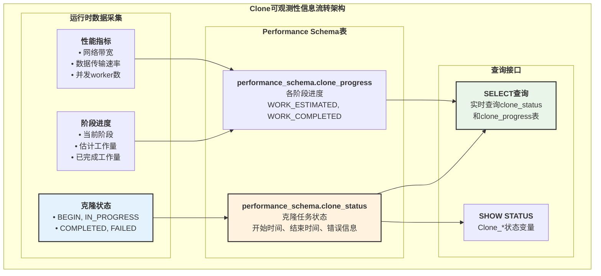

### 5.2 Performance Schema表结构

**clone_status表结构**:

| 字段 | 类型 | 说明 |
|------|------|------|
| `ID` | BIGINT | 克隆任务ID |
| `PID` | BIGINT | 进程ID |
| `STATE` | VARCHAR | 状态: Not Started, In Progress, Completed, Failed |
| `BEGIN_TIME` | TIMESTAMP | 开始时间 |
| `END_TIME` | TIMESTAMP | 结束时间 |
| `SOURCE` | VARCHAR | 数据源: LOCAL或远程主机地址 |
| `DESTINATION` | VARCHAR | 目标目录 |
| `ERROR_NO` | INT | 错误号 |
| `ERROR_MESSAGE` | VARCHAR | 错误消息 |
| `BINLOG_FILE` | VARCHAR | Binlog文件名 |
| `BINLOG_POSITION` | BIGINT | Binlog位置 |
| `GTID_EXECUTED` | LONGTEXT | 已执行的GTID集合 |

**clone_progress表结构**:

| 字段 | 类型 | 说明 |
|------|------|------|
| `ID` | BIGINT | 克隆任务ID |
| `STAGE` | VARCHAR | 阶段名称: DROP DATA, FILE COPY, PAGE COPY等 |
| `STATE` | VARCHAR | 阶段状态: Not Started, In Progress, Completed |
| `BEGIN_TIME` | TIMESTAMP | 阶段开始时间 |
| `END_TIME` | TIMESTAMP | 阶段结束时间 |
| `THREADS` | INT | 当前worker线程数 |
| `ESTIMATE` | BIGINT | 估计工作量（字节） |
| `DATA` | BIGINT | 已完成工作量（字节） |
| `NETWORK` | BIGINT | 网络传输字节数 |
| `DATA_SPEED` | BIGINT | 数据传输速率（字节/秒） |
| `NETWORK_SPEED` | BIGINT | 网络传输速率（字节/秒） |

### 5.3 数据采集与更新流程

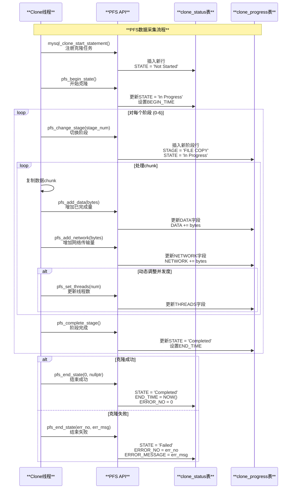

### 5.4 监控SQL示例

**查看克隆状态**:

```sql
-- 查看当前克隆任务状态
SELECT 
    ID,
    STATE,
    BEGIN_TIME,
    END_TIME,
    TIMESTAMPDIFF(SECOND, BEGIN_TIME, IFNULL(END_TIME, NOW())) AS duration_seconds,
    SOURCE,
    DESTINATION,
    ERROR_NO,
    ERROR_MESSAGE
FROM performance_schema.clone_status
ORDER BY ID DESC
LIMIT 10;
```

**查看克隆进度**:

```sql
-- 查看各阶段进度
SELECT 
    p.STAGE,
    p.STATE,
    p.THREADS,
    ROUND(p.ESTIMATE / 1024 / 1024 / 1024, 2) AS estimate_gb,
    ROUND(p.DATA / 1024 / 1024 / 1024, 2) AS completed_gb,
    ROUND(p.DATA * 100.0 / NULLIF(p.ESTIMATE, 0), 2) AS progress_pct,
    ROUND(p.DATA_SPEED / 1024 / 1024, 2) AS data_speed_mbps,
    ROUND(p.NETWORK_SPEED / 1024 / 1024, 2) AS network_speed_mbps,
    TIMESTAMPDIFF(SECOND, p.BEGIN_TIME, IFNULL(p.END_TIME, NOW())) AS duration_seconds
FROM performance_schema.clone_progress p
JOIN performance_schema.clone_status s ON p.ID = s.ID
WHERE s.STATE = 'In Progress'
ORDER BY p.STAGE;
```

**计算剩余时间**:

```sql
-- 估算剩余时间
SELECT 
    STAGE,
    ROUND((ESTIMATE - DATA) / NULLIF(DATA_SPEED, 0)) AS estimated_remaining_seconds,
    SEC_TO_TIME(ROUND((ESTIMATE - DATA) / NULLIF(DATA_SPEED, 0))) AS remaining_time
FROM performance_schema.clone_progress
WHERE STATE = 'In Progress' AND DATA_SPEED > 0;
```

---

## 第六部分：配置与优化

### 6.1 系统变量详解

| 变量名 | 默认值 | 说明 | 优化建议 |
|-------|-------|------|---------|
| `clone_autotune_concurrency` | ON | 自动调整并发度 | 生产环境建议开启 |
| `clone_buffer_size` | 4MB | 每个线程的缓冲区大小 | 大文件可增大到16MB |
| `clone_ddl_timeout` | 300s | DDL操作超时时间 | 根据DDL复杂度调整 |
| `clone_donor_timeout_after_network_failure` | 5分钟 | 网络故障后donor超时 | 网络不稳定可增大 |
| `clone_enable_compression` | OFF | 启用压缩 | 网络带宽受限时开启 |
| `clone_max_concurrency` | 16 | 最大并发线程数 | 高性能服务器可增大到32 |
| `clone_max_data_bandwidth` | 0 | 最大数据带宽（MB/s） | 限流使用，0表示无限制 |
| `clone_max_network_bandwidth` | 0 | 最大网络带宽（MB/s） | 限流使用，0表示无限制 |
| `clone_valid_donor_list` | NULL | 允许的donor列表 | 安全考虑，配置白名单 |

### 6.2 性能优化策略

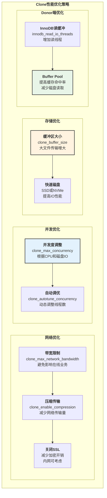

---

## 第七部分：故障排查

### 7.1 常见错误及解决方案

| 错误码 | 错误信息 | 原因 | 解决方案 |
|-------|---------|------|---------|
| ER_CLONE_DONOR | Clone Donor Error | Donor端错误 | 检查donor日志，确保donor正常运行 |
| ER_CLONE_PROTOCOL | Clone Protocol Error | 协议不兼容 | 确保recipient和donor版本兼容 |
| ER_CLONE_DONOR_VERSION | Version mismatch | 版本不匹配 | 升级或降级到相同版本 |
| ER_CLONE_OS | OS mismatch | 操作系统不匹配 | 确保相同的操作系统 |
| ER_CLONE_CHARSET | Charset mismatch | 字符集不匹配 | 统一字符集配置 |
| ER_CLONE_CONFIG | Configuration error | 配置不兼容 | 检查innodb_page_size等配置 |
| ER_CLONE_SYS_CONFIG | System config error | 系统配置错误 | 检查datadir权限和磁盘空间 |
| ER_CLONE_DISK_SPACE | Insufficient disk space | 磁盘空间不足 | 清理磁盘或扩容 |
| ER_CLONE_NETWORK | Network error | 网络错误 | 检查网络连接和防火墙 |

### 7.2 诊断流程

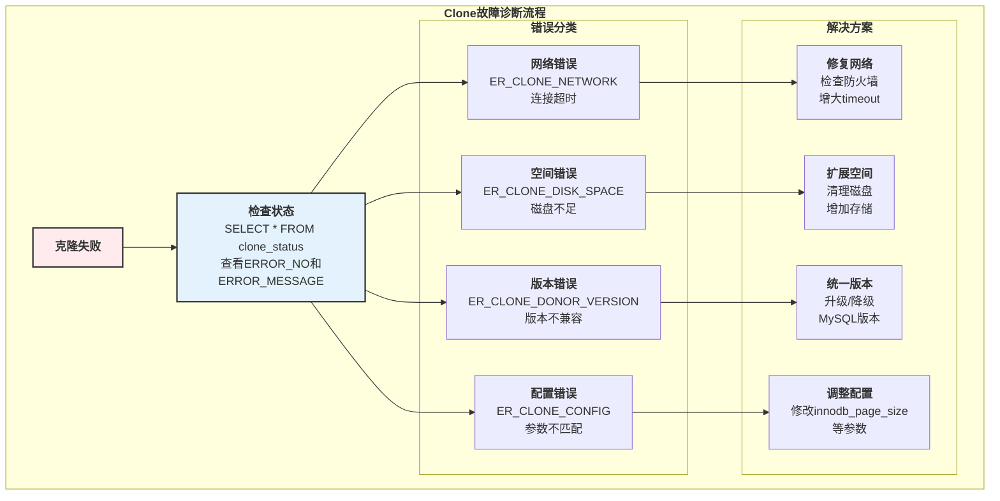

---

## 总结

### 核心要点回顾

**命令管理**:

- **CLONE LOCAL**: 本地克隆，复制当前实例数据到指定目录
- **CLONE INSTANCE**: 远程克隆，从远程donor实例复制数据
- 七阶段流程：DROP_DATA, FILE_COPY, PAGE_COPY, REDO_COPY, FILE_SYNC, ACK, RESTART

**架构特点**:

- **双连接模式**: 主任务连接传输数据，ACK连接确认进度
- **多线程并发**: Master线程协调，Worker线程池并行传输
- **增量复制**: FILE_COPY后，PAGE_COPY处理脏页，REDO_COPY保证一致性
- **自动调优**: clone_autotune_concurrency动态调整并发度

**可观测性**:

- **Performance Schema表**: clone_status显示整体状态，clone_progress显示各阶段进度
- **实时监控**: 可查询估计工作量、已完成量、传输速率、剩余时间
- **错误追踪**: 详细的错误号和错误消息

**最佳实践**:

- 配置clone_valid_donor_list白名单，提高安全性
- 根据硬件资源调整clone_max_concurrency和clone_buffer_size
- 网络受限时开启clone_enable_compression
- 使用Performance Schema表实时监控进度和性能

MySQL Clone插件提供了高效、可靠的数据复制能力，是快速搭建副本、灾难恢复的重要工具。

---

## 第八部分：Clone内部RPC协议深度解析

### 8.1 Clone RPC命令体系

**源码位置**: `plugin/clone/src/clone_server.cc:204-249`

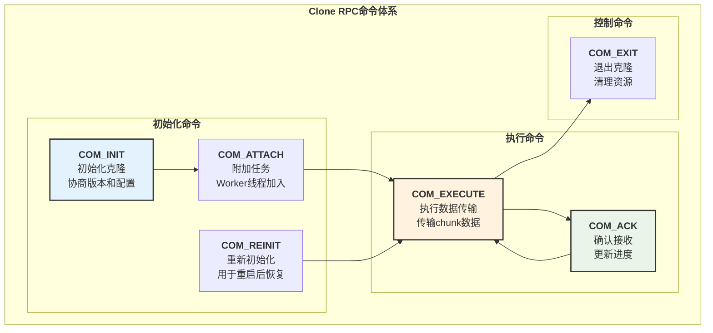

### 8.2 Clone RPC协议格式

**COM_INIT协议**:

```text
COM_INIT Request (Recipient -> Donor):
+----------------------+----------------+------------------------------------+
| 字段                 | 类型           | 说明                              |
+----------------------+----------------+------------------------------------+
| command              | int<1>         | COM_INIT (1)                      |
| protocol_version     | int<1>         | Clone协议版本                     |
| donor_locator_len    | int<4>         | Donor locator长度                 |
| donor_locator        | string<VAR>    | Donor locator数据                 |
+----------------------+----------------+------------------------------------+

COM_INIT Response (Donor -> Recipient):
+----------------------+----------------+------------------------------------+
| 字段                 | 类型           | 说明                              |
+----------------------+----------------+------------------------------------+
| response_code        | int<1>         | 0=成功, 非0=错误                  |
| error_num            | int<4>         | 错误号                            |
| se_protocol_version  | int<1>         | 存储引擎协议版本                  |
| se_locator_len       | int<4>         | SE locator长度                    |
| se_locator           | blob           | SE locator数据（配置信息）        |
+----------------------+----------------+------------------------------------+
```

**COM_EXECUTE协议**:

```text
COM_EXECUTE Request (Recipient -> Donor):
+----------------------+----------------+------------------------------------+
| 字段                 | 类型           | 说明                              |
+----------------------+----------------+------------------------------------+
| command              | int<1>         | COM_EXECUTE (4)                   |
| task_id              | int<4>         | 任务ID（worker编号）              |
| chunk_num            | int<4>         | 请求的chunk编号                   |
| block_num            | int<4>         | 请求的block编号                   |
+----------------------+----------------+------------------------------------+

COM_EXECUTE Response (Donor -> Recipient):
+----------------------+----------------+------------------------------------+
| 字段                 | 类型           | 说明                              |
+----------------------+----------------+------------------------------------+
| response_code        | int<1>         | 0=成功, 非0=错误                  |
| state                | int<1>         | 传输状态                          |
| chunk_num            | int<4>         | 当前chunk编号                     |
| block_num            | int<4>         | 当前block编号                     |
| data_len             | int<4>         | 数据长度                          |
| file_metadata_len    | int<4>         | 文件元数据长度                    |
| file_metadata        | blob           | 文件元数据（路径、大小等）        |
| data                 | blob           | 实际数据块                        |
+----------------------+----------------+------------------------------------+
```

**COM_ACK协议**:

```text
COM_ACK Request (Recipient -> Donor via ACK connection):
+----------------------+----------------+------------------------------------+
| 字段                 | 类型           | 说明                              |
+----------------------+----------------+------------------------------------+
| command              | int<1>         | COM_ACK (5)                       |
| task_id              | int<4>         | 任务ID                            |
| chunk_num            | int<4>         | 已接收的chunk编号                 |
| block_num            | int<4>         | 已接收的block编号                 |
| data_size            | int<8>         | 已接收的数据大小                  |
+----------------------+----------------+------------------------------------+
```

### 8.3 Donor/Recipient完整交互时序

```mermaid
sequenceDiagram
    participant RECIP_MASTER as **Recipient Master线程**
    participant RECIP_WORKERS as **Recipient Workers**
    participant DONOR_MASTER as **Donor Master线程**
    participant DONOR_SE as **Donor存储引擎**
    participant ACK_CONN as **ACK连接**

    Note over RECIP_MASTER,ACK_CONN: **Clone完整RPC交互协议**

    Note over RECIP_MASTER: **阶段1: 初始化**
    
    RECIP_MASTER->>DONOR_MASTER: COM_INIT<br/>• protocol_version<br/>• donor_locator
    
    DONOR_MASTER->>DONOR_SE: init_storage(HA_CLONE_MODE_START)<br/>初始化存储引擎
    DONOR_SE->>DONOR_SE: 创建snapshot<br/>生成locators
    DONOR_SE-->>DONOR_MASTER: se_locator<br/>• innodb_page_size<br/>• innodb_data_file_path<br/>• redo_log_size等
    
    DONOR_MASTER-->>RECIP_MASTER: Response<br/>• se_protocol_version<br/>• se_locator
    
    RECIP_MASTER->>RECIP_MASTER: 验证配置兼容性<br/>• page_size匹配<br/>• 版本兼容
    
    Note over RECIP_MASTER: **阶段2: 启动Workers**
    
    RECIP_MASTER->>RECIP_MASTER: 创建Worker线程<br/>数量: clone_max_concurrency
    
    loop 对每个Worker
        RECIP_WORKERS->>DONOR_MASTER: COM_ATTACH<br/>• task_id = worker_id<br/>• locator
        
        DONOR_MASTER->>DONOR_SE: init_storage(HA_CLONE_MODE_ADD_TASK)<br/>添加任务
        DONOR_MASTER-->>RECIP_WORKERS: Response: OK
    end
    
    Note over RECIP_MASTER,DONOR_SE: **阶段3: FILE_COPY数据传输**
    
    loop 并行传输（多个workers）
        RECIP_WORKERS->>DONOR_MASTER: COM_EXECUTE<br/>• task_id<br/>• chunk_num = 0<br/>• block_num = 0
        
        DONOR_MASTER->>DONOR_SE: hton_clone_copy()<br/>读取数据chunk
        
        alt 第一个chunk（包含文件元数据）
            DONOR_SE->>DONOR_SE: 扫描.ibd文件列表<br/>计算总大小
            DONOR_SE-->>DONOR_MASTER: file_metadata<br/>• file_name<br/>• file_size<br/>• tablespace_id
        end
        
        DONOR_SE->>DONOR_SE: 读取数据页<br/>按clone_buffer_size分块
        DONOR_SE-->>DONOR_MASTER: data chunk<br/>• 数据内容<br/>• chunk_num<br/>• state
        
        DONOR_MASTER-->>RECIP_WORKERS: Response<br/>• file_metadata<br/>• data<br/>• data_len
        
        RECIP_WORKERS->>RECIP_WORKERS: 写入本地文件<br/>创建.ibd文件
        
        Note over ACK_CONN: **通过ACK连接确认**
        RECIP_WORKERS->>ACK_CONN: COM_ACK<br/>• chunk_num<br/>• data_size
        ACK_CONN->>DONOR_MASTER: 转发ACK
        DONOR_MASTER->>DONOR_MASTER: 更新PFS进度<br/>DATA += data_size
        
        alt 动态调整并发度
            DONOR_MASTER->>DONOR_MASTER: 根据网络和磁盘IO<br/>调整active_workers
            
            alt 网络慢或磁盘慢
                DONOR_MASTER->>DONOR_MASTER: 减少active_workers
            else 资源充足
                DONOR_MASTER->>DONOR_MASTER: 增加active_workers
            end
        end
        
        alt 达到chunk末尾
            RECIP_WORKERS->>DONOR_MASTER: COM_EXECUTE (下一个chunk)
        end
    end
    
    Note over RECIP_MASTER,DONOR_SE: **阶段4: PAGE_COPY脏页传输**
    
    RECIP_WORKERS->>DONOR_MASTER: COM_EXECUTE (PAGE_COPY阶段)
    DONOR_MASTER->>DONOR_SE: hton_clone_copy()<br/>读取脏页
    DONOR_SE->>DONOR_SE: 扫描Buffer Pool<br/>找到FILE_COPY期间修改的页
    DONOR_SE-->>DONOR_MASTER: 脏页数据
    DONOR_MASTER-->>RECIP_WORKERS: 脏页chunk
    RECIP_WORKERS->>RECIP_WORKERS: 覆盖写入对应页<br/>in-place update
    
    Note over RECIP_MASTER,DONOR_SE: **阶段5: REDO_COPY日志传输**
    
    RECIP_WORKERS->>DONOR_MASTER: COM_EXECUTE (REDO_COPY阶段)
    DONOR_MASTER->>DONOR_SE: hton_clone_copy()<br/>读取Redo Log
    DONOR_SE->>DONOR_SE: 复制ib_logfile*<br/>从snapshot点开始
    DONOR_SE-->>DONOR_MASTER: Redo log数据
    DONOR_MASTER-->>RECIP_WORKERS: Redo chunk
    RECIP_WORKERS->>RECIP_WORKERS: 写入ib_logfile0, ib_logfile1
    
    Note over RECIP_MASTER,DONOR_SE: **阶段6: 完成和清理**
    
    RECIP_WORKERS->>DONOR_MASTER: COM_EXECUTE (FILE_SYNC)
    DONOR_MASTER->>DONOR_SE: fsync所有文件
    
    RECIP_WORKERS->>DONOR_MASTER: COM_EXECUTE (COMPLETE)
    DONOR_MASTER->>DONOR_SE: 释放snapshot
    
    RECIP_WORKERS->>DONOR_MASTER: COM_EXIT
    DONOR_MASTER->>DONOR_MASTER: 清理任务<br/>释放资源
```

---

## 第九部分：Clone参数完整详解

### 9.1 并发控制参数详解

**源码位置**: `plugin/clone/src/clone_client.cc:699-707`

| 参数 | 默认值 | 范围 | 说明 | 功能时序 |
|------|-------|------|------|---------|
| `clone_max_concurrency` | 16 | 1-128 | 最大并发Worker线程数 | 见9.2节 |
| `clone_autotune_concurrency` | ON | ON/OFF | 自动调整并发度 | 见9.3节 |

### 9.2 clone_max_concurrency 功能时序

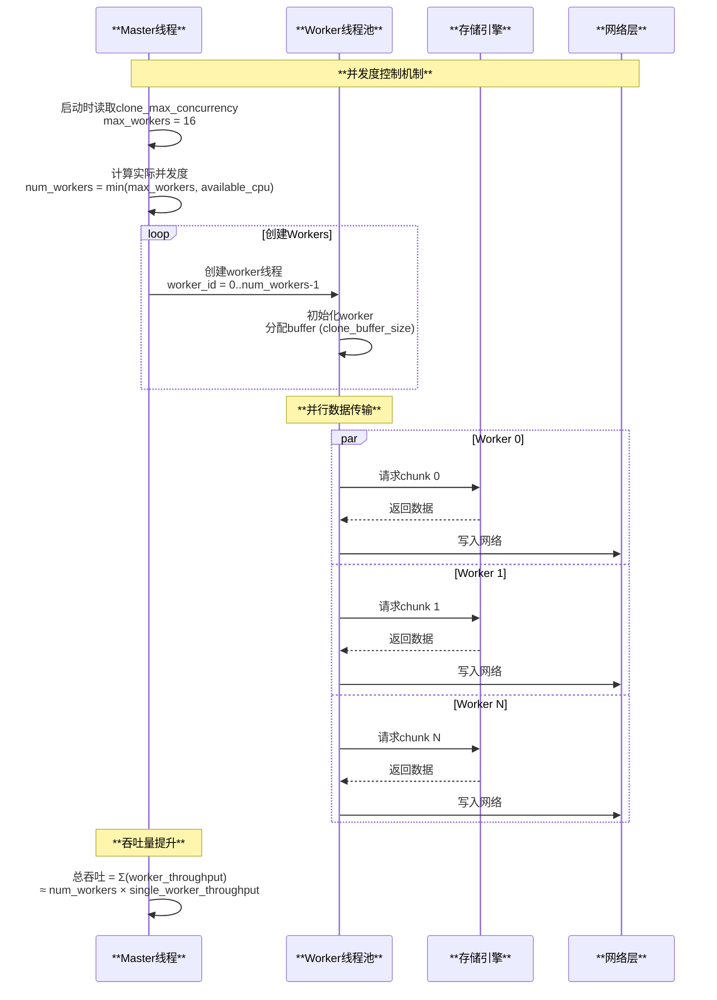

### 9.3 clone_autotune_concurrency 自动调优

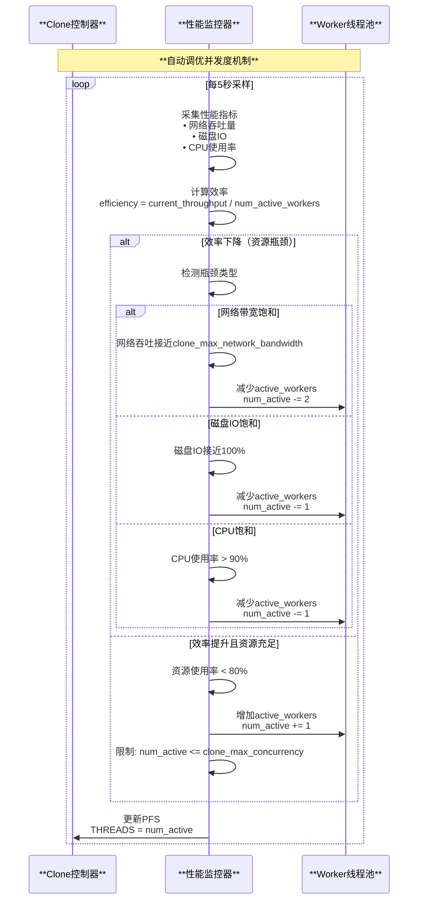

### 9.4 缓冲区和传输参数

| 参数 | 默认值 | 范围 | 说明 | 优化建议 |
|------|-------|------|------|---------|
| `clone_buffer_size` | 4MB | 1MB-128MB | 每个Worker的缓冲区大小 | 大文件场景增大到16MB |
| `clone_max_data_bandwidth` | 0 (unlimited) | 0-ULONG_MAX (MB/s) | 最大数据带宽限制 | 0表示不限制 |
| `clone_max_network_bandwidth` | 0 (unlimited) | 0-ULONG_MAX (MB/s) | 最大网络带宽限制 | 避免影响在线业务 |

### 9.5 带宽限制功能时序

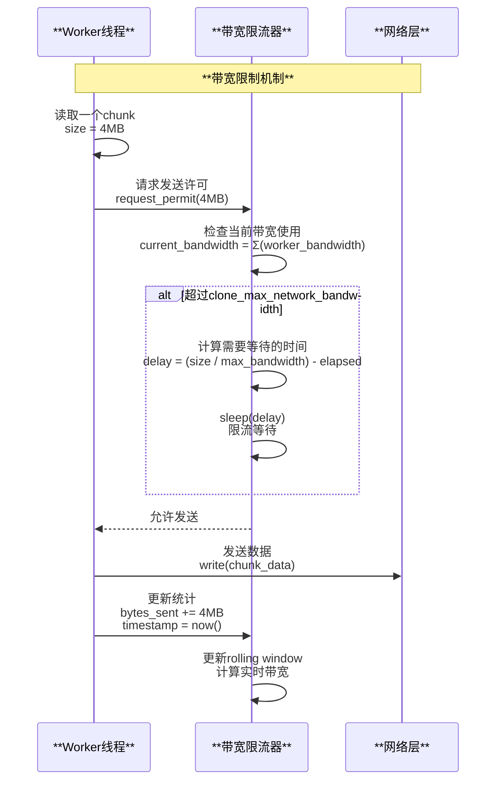

### 9.6 压缩参数

| 参数 | 默认值 | 范围 | 说明 | 源码位置 |
|------|-------|------|------|---------|
| `clone_enable_compression` | OFF | ON/OFF | 启用数据压缩传输 | `plugin/clone/src/clone_client.cc` |
| `clone_compression_algorithm` | zstd | zstd, lz4 | 压缩算法 | MySQL 8.0.30+ |
| `clone_compression_level` | 3 | 1-22 (zstd) | 压缩级别，越高压缩率越高但速度越慢 | 默认平衡设置 |

### 9.7 压缩传输时序

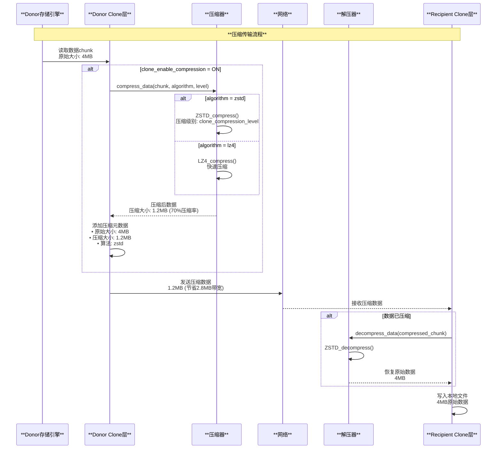

### 9.8 超时和错误处理参数

| 参数 | 默认值 | 范围 | 说明 |
|------|-------|------|------|
| `clone_ddl_timeout` | 300 | 0-INT_MAX | DDL操作超时（秒） |
| `clone_donor_timeout_after_network_failure` | 5分钟 | 0-INT_MAX | Donor网络故障后的超时 |

### 9.9 错误处理和重试时序

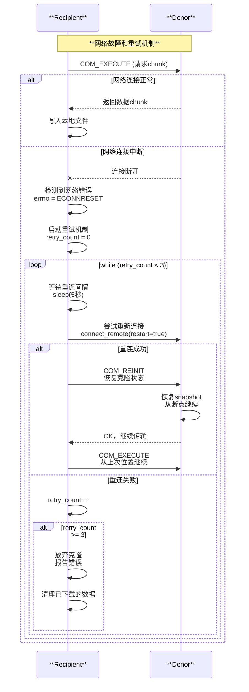

### 9.10 Donor白名单参数

| 参数 | 默认值 | 说明 | 安全建议 |
|------|-------|------|---------|
| `clone_valid_donor_list` | NULL (允许所有) | 允许的Donor地址列表，格式: 'host1:port1,host2:port2' | 生产环境必须配置白名单 |

### 9.11 白名单验证时序

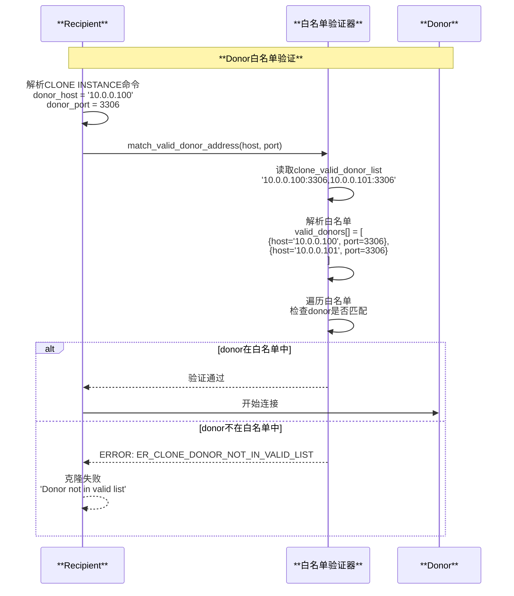

---

## 第十部分：Clone监控和诊断增强

### 10.1 实时监控SQL扩展

**监控传输速率趋势**:

```sql
-- 实时监控各阶段的传输速率（每秒更新）
SELECT 
    ID,
    STAGE,
    STATE,
    THREADS AS active_workers,
    ROUND(DATA / 1024 / 1024 / 1024, 2) AS completed_gb,
    ROUND(ESTIMATE / 1024 / 1024 / 1024, 2) AS total_gb,
    ROUND(DATA * 100.0 / NULLIF(ESTIMATE, 0), 2) AS progress_pct,
    ROUND(DATA_SPEED / 1024 / 1024, 2) AS data_mbps,
    ROUND(NETWORK_SPEED / 1024 / 1024, 2) AS network_mbps,
    -- 压缩率计算
    CASE 
        WHEN NETWORK > 0 THEN ROUND((1 - NETWORK * 1.0 / DATA) * 100, 2)
        ELSE 0
    END AS compression_ratio_pct,
    -- 预计剩余时间
    CASE 
        WHEN DATA_SPEED > 0 THEN 
            SEC_TO_TIME(ROUND((ESTIMATE - DATA) / DATA_SPEED))
        ELSE 'N/A'
    END AS eta
FROM performance_schema.clone_progress
WHERE STATE = 'In Progress'
ORDER BY BEGIN_TIME DESC;
```

**监控并发度自动调整**:

```sql
-- 观察自动调优如何调整并发度
SELECT 
    p.STAGE,
    p.THREADS AS current_workers,
    p.DATA_SPEED / 1024 / 1024 AS data_mbps,
    p.NETWORK_SPEED / 1024 / 1024 AS network_mbps,
    -- 每个Worker的平均速率
    ROUND(p.DATA_SPEED / NULLIF(p.THREADS, 0) / 1024 / 1024, 2) AS mbps_per_worker,
    TIMESTAMPDIFF(SECOND, p.BEGIN_TIME, NOW()) AS elapsed_seconds
FROM performance_schema.clone_progress p
WHERE p.STATE = 'In Progress'
ORDER BY p.BEGIN_TIME DESC;
```

### 10.2 故障诊断增强

**诊断慢速克隆**:

```sql
-- 诊断克隆慢的原因
SELECT 
    'Network Bottleneck' AS issue,
    CASE 
        WHEN NETWORK_SPEED < 100*1024*1024 THEN 'YES - Network < 100MB/s'
        ELSE 'NO'
    END AS detected,
    CONCAT(ROUND(NETWORK_SPEED/1024/1024, 2), ' MB/s') AS current_speed
FROM performance_schema.clone_progress
WHERE STATE = 'In Progress'

UNION ALL

SELECT 
    'Disk Bottleneck' AS issue,
    CASE 
        WHEN DATA_SPEED < NETWORK_SPEED * 0.7 THEN 'YES - Disk slower than network'
        ELSE 'NO'
    END AS detected,
    CONCAT(ROUND(DATA_SPEED/1024/1024, 2), ' MB/s') AS current_speed
FROM performance_schema.clone_progress
WHERE STATE = 'In Progress'

UNION ALL

SELECT 
    'Low Concurrency' AS issue,
    CASE 
        WHEN THREADS < 4 THEN 'YES - Only few workers active'
        ELSE 'NO'
    END AS detected,
    CAST(THREADS AS CHAR) AS current_speed
FROM performance_schema.clone_progress
WHERE STATE = 'In Progress';
```

MySQL Clone插件通过高效的并行传输、智能的带宽控制和完善的错误恢复机制，提供了可靠的数据克隆能力，是快速部署副本和灾难恢复的关键工具。
