# MySQL Group Replication(MGR)管理命令深度解析

## 概述

本文档详细解析MySQL Group Replication（MGR）的管理命令，从**源码层面**深入分析命令执行流程、架构设计和可观测性信息的采集与存储机制。MGR提供了多主和单主模式的分布式数据库复制方案。

**基于源码**: `plugin/group_replication/src/plugin.cc`, `plugin/group_replication/src/group_actions/`, `sql/sql_parse.cc`

---

## 第一部分：MGR管理命令总览

### 1.1 核心管理命令列表

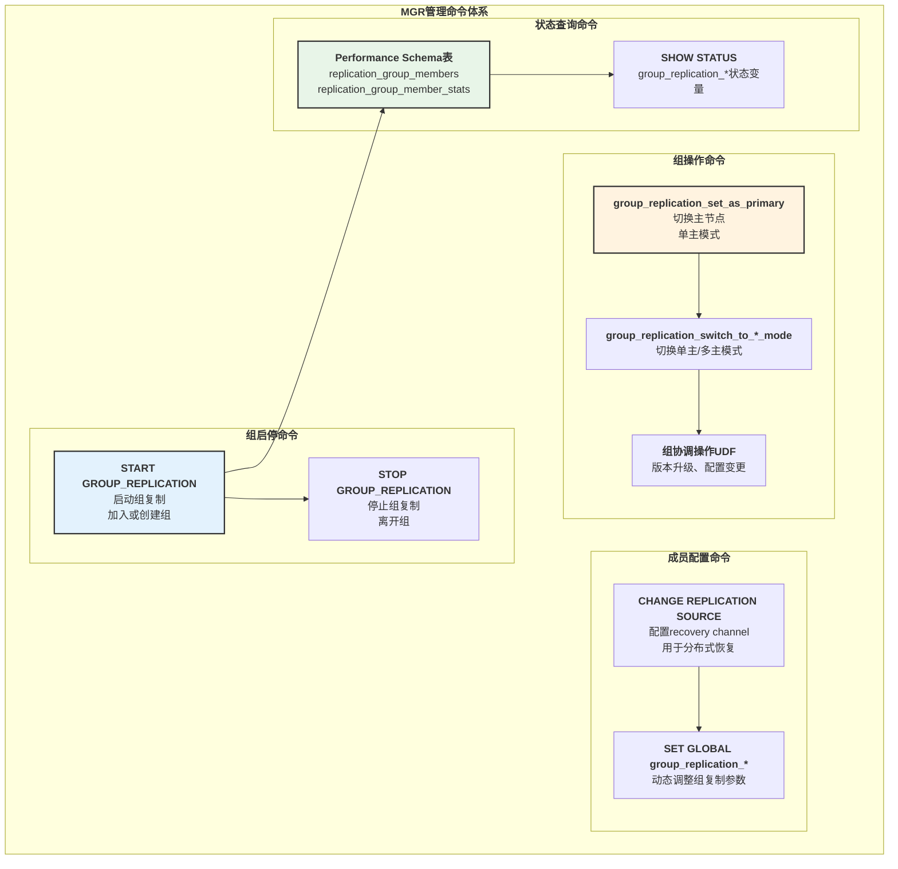

**命令详细列表**:

| 命令类型 | 语法 | 权限 | 说明 |
|---------|------|------|------|
| `START GROUP_REPLICATION` | `START GROUP_REPLICATION [USER='user', PASSWORD='pwd']` | GROUP_REPLICATION_ADMIN | 启动组复制插件 |
| `STOP GROUP_REPLICATION` | `STOP GROUP_REPLICATION` | GROUP_REPLICATION_ADMIN | 停止组复制 |
| `group_replication_set_as_primary` | `SELECT group_replication_set_as_primary('uuid')` | GROUP_REPLICATION_ADMIN | 设置新主节点 |
| `group_replication_switch_to_single_primary_mode` | `SELECT group_replication_switch_to_single_primary_mode('uuid')` | GROUP_REPLICATION_ADMIN | 切换到单主模式 |
| `group_replication_switch_to_multi_primary_mode` | `SELECT group_replication_switch_to_multi_primary_mode()` | GROUP_REPLICATION_ADMIN | 切换到多主模式 |
| `SELECT * FROM replication_group_members` | Performance Schema查询 | SELECT | 查看组成员信息 |
| `SELECT * FROM replication_group_member_stats` | Performance Schema查询 | SELECT | 查看组成员统计 |

---

## 第二部分：START GROUP_REPLICATION 源码深度解析

### 2.1 START GROUP_REPLICATION 架构

**源码位置**: `plugin/group_replication/src/plugin.cc:564-745`

```mermaid
graph TB
    subgraph "<b>START GROUP_REPLICATION命令执行架构</b>"
        PARSE["<b>SQL解析层</b><br/>sql_parse.cc<br/>SQLCOM_START_GROUP_REPLICATION"]
        
        PLUGIN_ENTRY["<b>Plugin入口</b><br/>plugin_group_replication_start()<br/>权限检查和状态验证"]
        
        subgraph "<b>前置检查</b>"
            CHECK_CONFIG["<b>配置检查</b><br/>check_if_server_properly_configured()<br/>检查binlog、GTID等"]
            CHECK_NAME["<b>组名检查</b><br/>check_group_name_string()<br/>验证group_name有效性"]
            CHECK_SSL["<b>SSL检查</b><br/>check_recovery_ssl_string()<br/>验证SSL配置"]
        end
        
        subgraph "<b>核心启动流程</b>"
            INIT_COMPONENTS["<b>初始化组件</b><br/>plugin_group_replication_start_inner()<br/>GCS、事件处理器等"]
            INIT_GCS["<b>GCS初始化</b><br/>gcs_module->initialize()<br/>初始化通信层"]
            SET_READ_ONLY["<b>设置只读模式</b><br/>enable_super_read_only_mode()<br/>加入组前保护数据"]
            START_APPLIER["<b>启动Applier</b><br/>applier_module->setup_applier_module()<br/>启动SQL线程"]
            JOIN_GROUP["<b>加入组</b><br/>gcs_module->join()<br/>通过Paxos协议加入"]
        end
        
        RECOVERY["<b>分布式恢复</b><br/>recovery_module<br/>从组内成员恢复数据"]
    end
    
    PARSE --> PLUGIN_ENTRY
    PLUGIN_ENTRY --> CHECK_CONFIG
    PLUGIN_ENTRY --> CHECK_NAME
    PLUGIN_ENTRY --> CHECK_SSL
    CHECK_SSL --> INIT_COMPONENTS
    INIT_COMPONENTS --> INIT_GCS
    INIT_GCS --> SET_READ_ONLY
    SET_READ_ONLY --> START_APPLIER
    START_APPLIER --> JOIN_GROUP
    JOIN_GROUP --> RECOVERY
    
    style PARSE fill:#e3f2fd,stroke:#333,stroke-width:2px
    style INIT_COMPONENTS fill:#fff3e0,stroke:#333,stroke-width:2px
    style JOIN_GROUP fill:#e8f5e8,stroke:#333,stroke-width:2px
```

### 2.2 START GROUP_REPLICATION 时序图

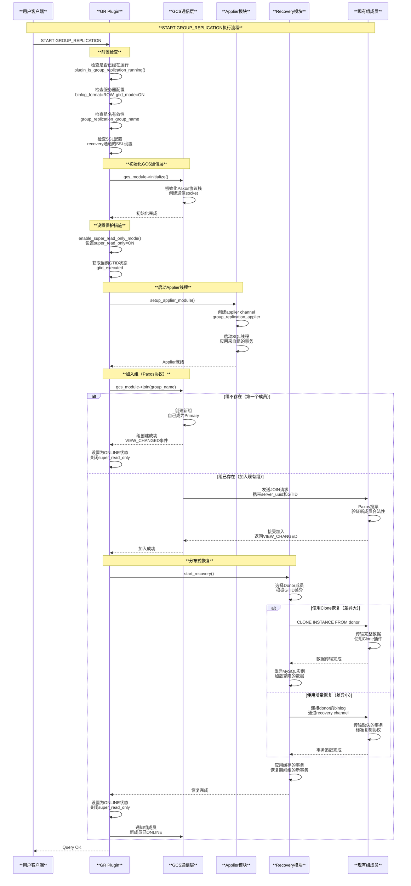

### 2.3 START GROUP_REPLICATION 关键源码

**源码位置**: `plugin/group_replication/src/plugin.cc:564-640`

```cpp
int plugin_group_replication_start(char **error_message) {
  DBUG_TRACE;

  // 1. 检查插件是否正在卸载
  if (lv.plugin_is_being_uninstalled) {
    std::string err_msg("Group Replication plugin is being uninstalled.");
    *error_message = (char *)my_malloc(PSI_NOT_INSTRUMENTED, 
                                       err_msg.length() + 1, MYF(0));
    strcpy(*error_message, err_msg.c_str());
    return GROUP_REPLICATION_COMMAND_FAILURE;
  }

  // 2. 获取写锁
  Checkable_rwlock::Guard g(*lv.plugin_running_lock,
                            Checkable_rwlock::WRITE_LOCK);
  int error = 0;

  // 3. 检查是否已经在运行
  if (plugin_is_group_replication_running()) {
    error = GROUP_REPLICATION_ALREADY_RUNNING;
    goto err;
  }

  // 4. 检查服务器配置
  if (check_if_server_properly_configured()) {
    error = GROUP_REPLICATION_CONFIGURATION_ERROR;
    goto err;
  }

  // 5. 检查组名
  if (check_group_name_string(ov.group_name_var)) {
    error = GROUP_REPLICATION_CONFIGURATION_ERROR;
    goto err;
  }

  // 6. 检查SSL配置
  if (check_recovery_ssl_string(ov.recovery_ssl_ca_var, "ssl_ca") ||
      check_recovery_ssl_string(ov.recovery_ssl_cert_var, "ssl_cert") ||
      check_recovery_ssl_string(ov.recovery_ssl_key_var, "ssl_key")) {
    error = GROUP_REPLICATION_CONFIGURATION_ERROR;
    goto err;
  }

  // 7. 调用内部启动函数
  error = plugin_group_replication_start_inner(error_message, nullptr);

err:
  return error;
}
```

**内部启动函数** (`plugin.cc:745-1100`):

```cpp
static int plugin_group_replication_start_inner(
    char **error_message, 
    Delayed_initialization_thread *delayed_init_thd) {
  
  int error = 0;
  
  // 1. 建立SQL API连接
  Sql_service_command_interface sql_command_interface;
  if (sql_command_interface.establish_session_connection(
          sql_api_isolation, GROUPREPL_USER, lv.plugin_info_ptr)) {
    error = 1;
    goto err;
  }

  // 2. 初始化GCS模块
  if ((error = gcs_module->initialize())) {
    goto err;
  }

  // 3. 设置super_read_only模式
  bool read_only_mode = false, super_read_only_mode = false;
  get_read_mode_state(&read_only_mode, &super_read_only_mode);
  
  if (!super_read_only_mode) {
    if (enable_super_read_only_mode(&sql_command_interface)) {
      error = 1;
      goto err;
    }
  }

  // 4. 初始化各个模块
  if (init_group_sidno()) {
    error = 1;
    goto err;
  }

  // 5. 启动applier模块
  if (applier_module->setup_applier_module(
          CHANNEL_APPLIER_THREAD | CHANNEL_RECEIVER_THREAD,
          false, nullptr, nullptr, nullptr)) {
    error = 1;
    goto err;
  }

  // 6. 加入组
  view_change_notifier->start_view_modification();
  
  Gcs_operations::enum_gcs_error gcs_error = 
      gcs_module->join(*events_handler->get_notification_context());
      
  if (gcs_error != Gcs_operations::ERROR_OK) {
    error = 1;
    goto err;
  }

  // 7. 等待视图变更
  if (view_change_notifier->wait_for_view_modification()) {
    error = 1;
    goto err;
  }

  return 0;

err:
  // 清理和错误处理
  plugin_group_replication_leave_group();
  return error;
}
```

---

## 第三部分：STOP GROUP_REPLICATION 源码深度解析

### 3.1 STOP GROUP_REPLICATION 时序图

**源码位置**: `plugin/group_replication/src/plugin.cc:1274-1400`

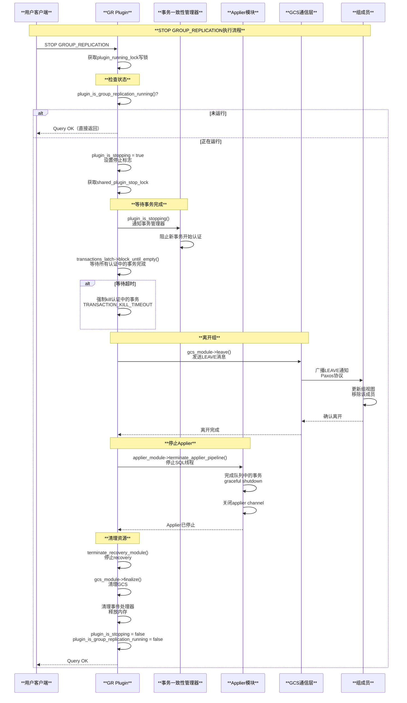

### 3.2 优雅停止机制

```mermaid
graph TB
    subgraph "<b>STOP GROUP_REPLICATION优雅停止流程</b>"
        STOP_REQ["<b>停止请求</b><br/>plugin_group_replication_stop()"]
        
        BLOCK_NEW["<b>阻止新事务</b><br/>transaction_consistency_manager<br/>拒绝新的认证请求"]
        
        subgraph "<b>等待事务完成</b>"
            WAIT_CERT["<b>等待认证队列</b><br/>transactions_latch<br/>最多60秒"]
            WAIT_APPLY["<b>等待应用队列</b><br/>certification_latch<br/>等待已认证事务应用"]
        end
        
        LEAVE_GROUP["<b>离开组</b><br/>gcs_module->leave()<br/>通过Paxos通知其他成员"]
        
        STOP_APPLIER["<b>停止Applier</b><br/>terminate_applier_pipeline()<br/>优雅关闭SQL线程"]
        
        CLEANUP["<b>清理资源</b><br/>释放GCS、Recovery等模块"]
        
        FINAL["<b>完成</b><br/>plugin_is_group_replication_running = false"]
    end
    
    STOP_REQ --> BLOCK_NEW
    BLOCK_NEW --> WAIT_CERT
    WAIT_CERT --> WAIT_APPLY
    WAIT_APPLY --> LEAVE_GROUP
    LEAVE_GROUP --> STOP_APPLIER
    STOP_APPLIER --> CLEANUP
    CLEANUP --> FINAL
    
    style STOP_REQ fill:#e3f2fd,stroke:#333,stroke-width:2px
    style WAIT_CERT fill:#fff3e0,stroke:#333,stroke-width:2px
    style LEAVE_GROUP fill:#e8f5e8,stroke:#333,stroke-width:2px
```

---

## 第四部分：组协调操作（Group Actions）

### 4.1 Primary选举架构

**源码位置**: `plugin/group_replication/src/group_actions/`

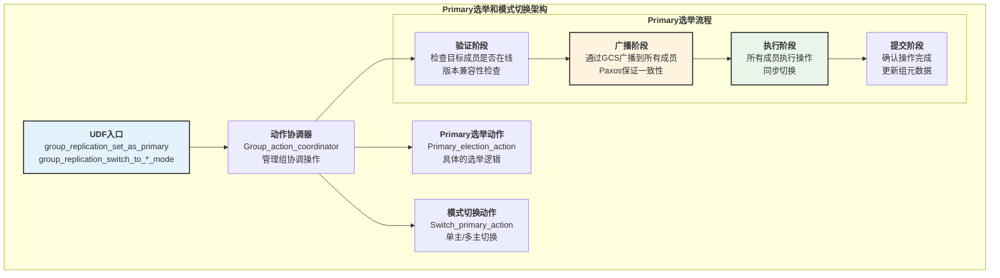

### 4.2 Primary选举时序图

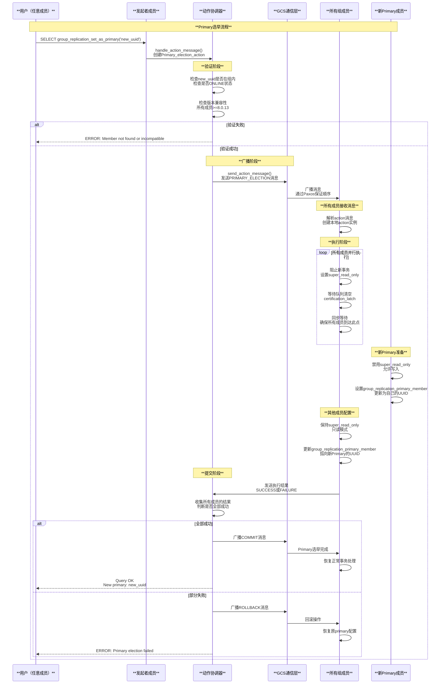

---

## 第五部分：可观测性信息深度解析

### 5.1 可观测性架构

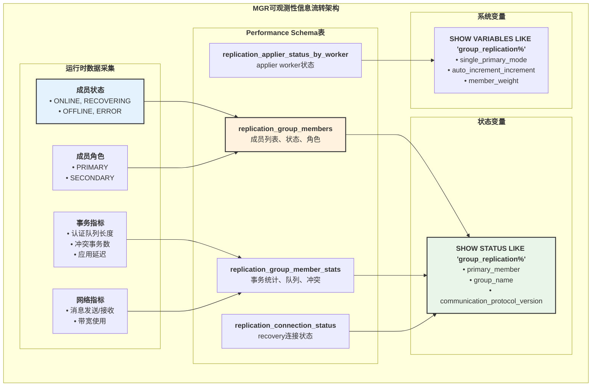

### 5.2 Performance Schema表详解

**replication_group_members表结构**:

| 字段 | 类型 | 说明 |
|------|------|------|
| `CHANNEL_NAME` | VARCHAR | 通道名称（group_replication_applier） |
| `MEMBER_ID` | VARCHAR | 成员UUID（server_uuid） |
| `MEMBER_HOST` | VARCHAR | 成员主机名 |
| `MEMBER_PORT` | INT | 成员端口号 |
| `MEMBER_STATE` | VARCHAR | 成员状态: ONLINE, RECOVERING, OFFLINE, ERROR, UNREACHABLE |
| `MEMBER_ROLE` | VARCHAR | 成员角色: PRIMARY, SECONDARY |
| `MEMBER_VERSION` | VARCHAR | MySQL版本 |
| `MEMBER_COMMUNICATION_STACK` | VARCHAR | 通信协议栈: XCom或MySQL |

**replication_group_member_stats表结构**:

| 字段 | 类型 | 说明 |
|------|------|------|
| `CHANNEL_NAME` | VARCHAR | 通道名称 |
| `VIEW_ID` | VARCHAR | 当前视图ID |
| `MEMBER_ID` | VARCHAR | 成员UUID |
| `COUNT_TRANSACTIONS_IN_QUEUE` | BIGINT | 认证队列中的事务数 |
| `COUNT_TRANSACTIONS_CHECKED` | BIGINT | 已检查的事务数 |
| `COUNT_CONFLICTS_DETECTED` | BIGINT | 检测到的冲突事务数 |
| `COUNT_TRANSACTIONS_ROWS_VALIDATING` | BIGINT | 正在验证行的事务数 |
| `TRANSACTIONS_COMMITTED_ALL_MEMBERS` | LONGTEXT | 所有成员都已提交的GTID集合 |
| `LAST_CONFLICT_FREE_TRANSACTION` | VARCHAR | 最后一个无冲突事务的GTID |
| `COUNT_TRANSACTIONS_REMOTE_IN_APPLIER_QUEUE` | BIGINT | applier队列中的远程事务数 |
| `COUNT_TRANSACTIONS_REMOTE_APPLIED` | BIGINT | 已应用的远程事务数 |
| `COUNT_TRANSACTIONS_LOCAL_PROPOSED` | BIGINT | 本地提出的事务数 |
| `COUNT_TRANSACTIONS_LOCAL_ROLLBACK` | BIGINT | 本地回滚的事务数 |

### 5.3 数据采集与更新流程

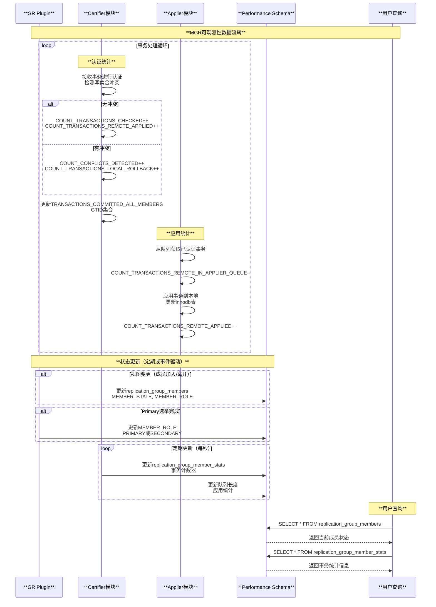

### 5.4 监控SQL示例

**查看组成员状态**:

```sql
-- 查看所有组成员及其状态
SELECT 
    MEMBER_ID,
    MEMBER_HOST,
    MEMBER_PORT,
    MEMBER_STATE,
    MEMBER_ROLE,
    MEMBER_VERSION,
    IF(MEMBER_STATE = 'ONLINE', 
       'HEALTHY', 
       CONCAT('ISSUE: ', MEMBER_STATE)) AS health_status
FROM performance_schema.replication_group_members
ORDER BY MEMBER_ROLE DESC, MEMBER_HOST;
```

**查看Primary成员**:

```sql
-- 查看当前Primary成员
SELECT 
    MEMBER_ID,
    MEMBER_HOST,
    MEMBER_PORT,
    MEMBER_VERSION
FROM performance_schema.replication_group_members
WHERE MEMBER_ROLE = 'PRIMARY';

-- 或使用状态变量
SHOW STATUS LIKE 'group_replication_primary_member';
```

**查看事务冲突统计**:

```sql
-- 查看每个成员的事务冲突情况
SELECT 
    m.MEMBER_HOST,
    m.MEMBER_PORT,
    m.MEMBER_ROLE,
    s.COUNT_TRANSACTIONS_CHECKED AS total_checked,
    s.COUNT_CONFLICTS_DETECTED AS conflicts,
    ROUND(s.COUNT_CONFLICTS_DETECTED * 100.0 / 
          NULLIF(s.COUNT_TRANSACTIONS_CHECKED, 0), 2) AS conflict_rate_pct,
    s.COUNT_TRANSACTIONS_LOCAL_ROLLBACK AS local_rollbacks
FROM performance_schema.replication_group_members m
JOIN performance_schema.replication_group_member_stats s
  ON m.MEMBER_ID = s.MEMBER_ID
WHERE m.MEMBER_STATE = 'ONLINE';
```

**查看认证队列和应用延迟**:

```sql
-- 查看认证队列和applier队列长度
SELECT 
    m.MEMBER_HOST,
    m.MEMBER_PORT,
    m.MEMBER_ROLE,
    s.COUNT_TRANSACTIONS_IN_QUEUE AS cert_queue_size,
    s.COUNT_TRANSACTIONS_REMOTE_IN_APPLIER_QUEUE AS applier_queue_size,
    s.COUNT_TRANSACTIONS_ROWS_VALIDATING AS validating_transactions
FROM performance_schema.replication_group_members m
JOIN performance_schema.replication_group_member_stats s
  ON m.MEMBER_ID = s.MEMBER_ID
WHERE m.MEMBER_STATE = 'ONLINE'
ORDER BY cert_queue_size DESC;
```

**查看已提交GTID一致性**:

```sql
-- 查看所有成员都已提交的GTID集合
SELECT 
    MEMBER_HOST,
    MEMBER_PORT,
    TRANSACTIONS_COMMITTED_ALL_MEMBERS,
    LAST_CONFLICT_FREE_TRANSACTION
FROM performance_schema.replication_group_member_stats s
JOIN performance_schema.replication_group_members m
  ON s.MEMBER_ID = m.MEMBER_ID
WHERE m.MEMBER_STATE = 'ONLINE';
```

---

## 第六部分：配置与优化

### 6.1 核心系统变量详解

| 变量名 | 默认值 | 说明 | 优化建议 |
|-------|-------|------|---------|
| `group_replication_group_name` | NULL | 组UUID | 必须配置，全组统一 |
| `group_replication_single_primary_mode` | ON | 单主模式 | 简化写入逻辑，推荐 |
| `group_replication_auto_increment_increment` | 7 | 自增步长 | 多主模式避免ID冲突 |
| `group_replication_bootstrap_group` | OFF | 引导组 | 仅第一个成员启动时设置 |
| `group_replication_flow_control_mode` | QUOTA | 流控模式 | QUOTA性能更好 |
| `group_replication_member_weight` | 50 | 成员权重 | Primary选举时的优先级 |
| `group_replication_consistency` | EVENTUAL | 一致性级别 | BEFORE/AFTER提高一致性 |
| `group_replication_exit_state_action` | READ_ONLY | 退出动作 | ABORT_SERVER用于严格场景 |
| `group_replication_unreachable_majority_timeout` | 0 | 少数派超时 | 网络分区处理策略 |
| `group_replication_communication_max_message_size` | 10MB | 最大消息大小 | 大事务需增大 |

### 6.2 性能优化策略

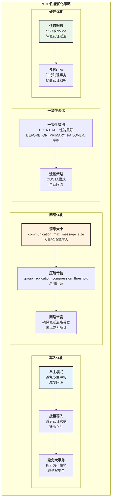

### 6.3 高可用配置

**推荐配置（3节点单主模式）**:

```sql
-- 节点1（Primary候选）
SET GLOBAL group_replication_group_name = 'aaaaaaaa-bbbb-cccc-dddd-eeeeeeeeeeee';
SET GLOBAL group_replication_local_address = '192.168.1.1:33061';
SET GLOBAL group_replication_group_seeds = '192.168.1.1:33061,192.168.1.2:33061,192.168.1.3:33061';
SET GLOBAL group_replication_single_primary_mode = ON;
SET GLOBAL group_replication_enforce_update_everywhere_checks = OFF;
SET GLOBAL group_replication_member_weight = 80;  -- 高权重，优先成为Primary
SET GLOBAL group_replication_consistency = 'BEFORE_ON_PRIMARY_FAILOVER';
SET GLOBAL group_replication_exit_state_action = 'READ_ONLY';
SET GLOBAL group_replication_bootstrap_group = ON;  -- 仅第一次启动
START GROUP_REPLICATION;
SET GLOBAL group_replication_bootstrap_group = OFF;

-- 节点2和节点3（Secondary）
SET GLOBAL group_replication_group_name = 'aaaaaaaa-bbbb-cccc-dddd-eeeeeeeeeeee';
SET GLOBAL group_replication_local_address = '192.168.1.2:33061';  -- 节点2地址
SET GLOBAL group_replication_group_seeds = '192.168.1.1:33061,192.168.1.2:33061,192.168.1.3:33061';
SET GLOBAL group_replication_single_primary_mode = ON;
SET GLOBAL group_replication_enforce_update_everywhere_checks = OFF;
SET GLOBAL group_replication_member_weight = 50;  -- 正常权重
SET GLOBAL group_replication_consistency = 'BEFORE_ON_PRIMARY_FAILOVER';
SET GLOBAL group_replication_exit_state_action = 'READ_ONLY';
START GROUP_REPLICATION;
```

---

## 第七部分：故障排查

### 7.1 常见问题诊断流程

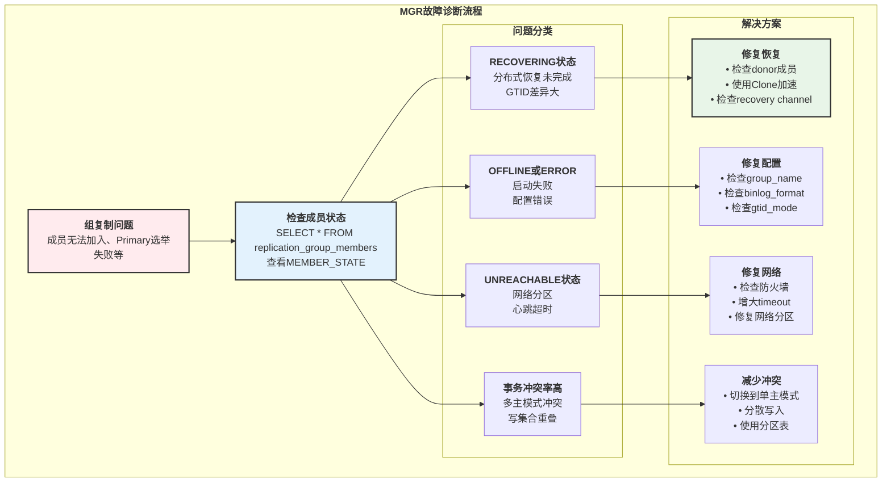

### 7.2 常见错误及解决方案

| 错误信息 | 原因 | 解决方案 |
|---------|------|---------|
| `Member configuration is not compatible with the group` | 配置不兼容 | 检查gtid_mode、binlog_format等配置 |
| `The member is already leaving or joining a group` | 操作冲突 | 等待当前操作完成 |
| `Timeout on wait for view after joining group` | 加入组超时 | 检查网络，增大group_replication_components_stop_timeout |
| `There is already a member with server_uuid` | UUID冲突 | 修改server_uuid，确保唯一性 |
| `This member has more executed transactions than those present in the group` | GTID超前 | 使用group_replication_allow_local_lower_version_join |
| `Certification database is not installed` | 认证数据库未初始化 | 检查mysql.gtid_executed表 |
| `Error on group communication engine start` | GCS初始化失败 | 检查group_replication_local_address和防火墙 |

---

## 总结

### 核心要点回顾

**命令管理**:

- **START GROUP_REPLICATION**: 启动组复制，加入或创建组，自动分布式恢复
- **STOP GROUP_REPLICATION**: 优雅停止，等待事务完成，通知组成员离开
- **Primary选举UDF**: group_replication_set_as_primary()，所有成员协同切换
- **模式切换UDF**: 单主/多主模式动态切换

**架构特点**:

- **Paxos协议**: GCS通信层基于Paxos，保证组成员视图一致性
- **分布式恢复**: 自动选择Clone或增量复制，快速追赶数据
- **认证机制**: 基于写集合的冲突检测，乐观并发控制
- **流控机制**: QUOTA模式自动限流，避免慢节点拖累整组

**可观测性**:

- **Performance Schema表**: replication_group_members、replication_group_member_stats
- **事务统计**: 认证队列、冲突检测、应用延迟
- **成员状态**: ONLINE、RECOVERING、OFFLINE、ERROR、UNREACHABLE

**最佳实践**:

- 使用单主模式（simple_primary_mode=ON）避免冲突
- 配置合理的member_weight，控制Primary选举
- 设置group_replication_consistency提高数据一致性
- 监控COUNT_CONFLICTS_DETECTED，及时发现冲突问题
- 使用group_replication_exit_state_action控制故障行为

MySQL Group Replication提供了高可用、自动故障转移的分布式复制方案，是构建弹性数据库架构的核心组件。

---

## 第八部分：MGR GCS通信协议深度解析

### 8.1 GCS (Group Communication System) 协议栈

**源码位置**: `plugin/group_replication/libmysqlgcs/`

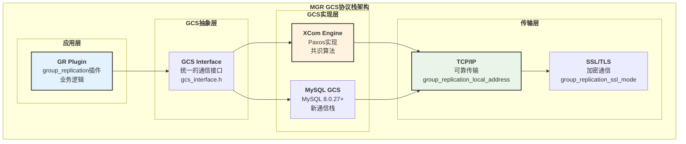

### 8.2 GCS消息类型

**源码位置**: `plugin/group_replication/libmysqlgcs/src/bindings/xcom/gcs_xcom_communication_interface.cc`

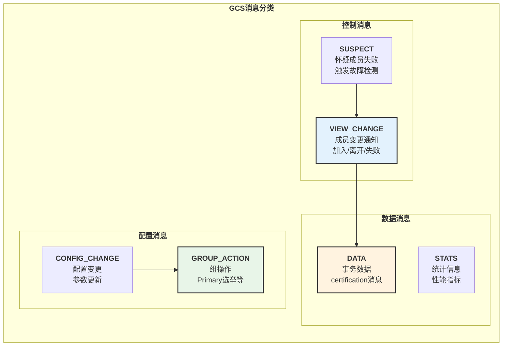

### 8.3 成员间Paxos协议交互

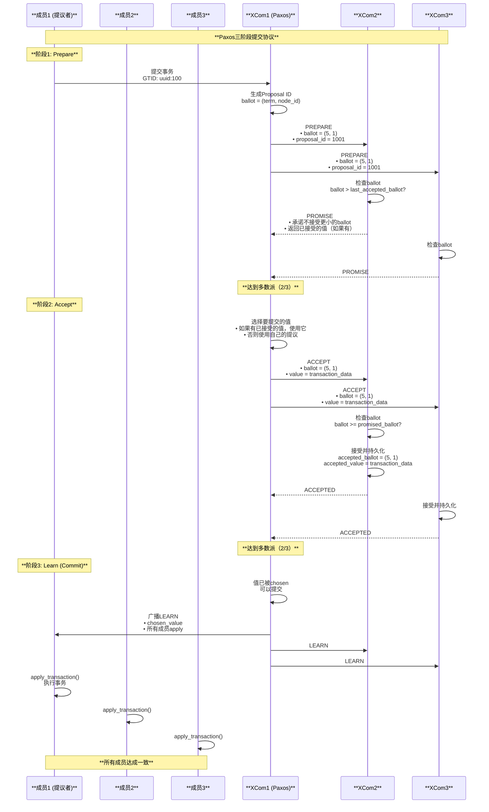

### 8.4 成员加入协议

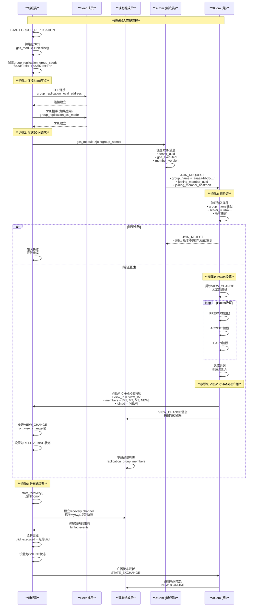

---

## 第九部分：MGR参数完整详解

### 9.1 组配置参数

| 参数 | 默认值 | 范围 | 说明 | 源码位置 |
|------|-------|------|------|---------|
| `group_replication_group_name` | NULL | UUID格式 | 组的唯一标识符 | 必须在所有成员上一致 |
| `group_replication_local_address` | NULL | host:port | 本成员的GCS监听地址 | `plugin/group_replication/src/plugin_variables.cc` |
| `group_replication_group_seeds` | NULL | host1:port1,host2:port2 | Seed成员列表，用于加入组 | 至少配置一个可用成员 |
| `group_replication_bootstrap_group` | OFF | ON/OFF | 是否引导创建新组 | 仅第一个成员启动时设置为ON |

### 9.2 bootstrap_group参数时序

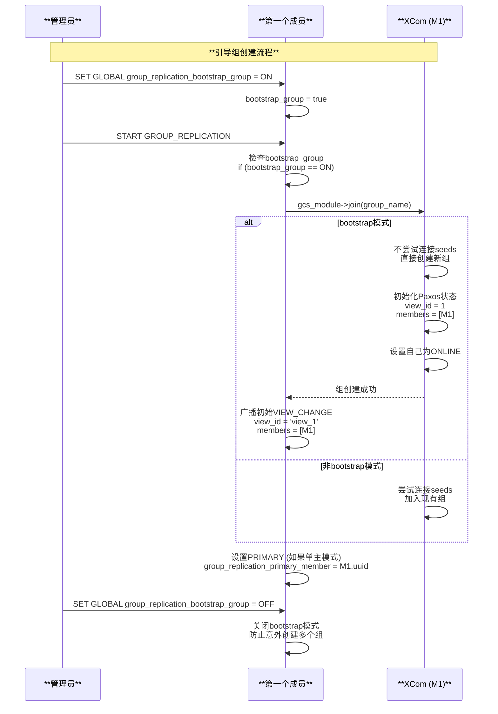

### 9.3 通信和超时参数

| 参数 | 默认值 | 范围 | 说明 | 用途 |
|------|-------|------|------|------|
| `group_replication_member_expel_timeout` | 5 | 0-3600 | 怀疑成员失败的超时时间（秒） | 故障检测 |
| `group_replication_unreachable_majority_timeout` | 0 | 0-31536000 | 少数派成员的超时（秒），0表示永久等待 | 网络分区处理 |
| `group_replication_communication_max_message_size` | 10MB | 0-1GB | 最大消息大小 | 大事务处理 |
| `group_replication_compression_threshold` | 1MB | 0-1GB | 启用压缩的阈值 | 节省带宽 |

### 9.4 故障检测机制

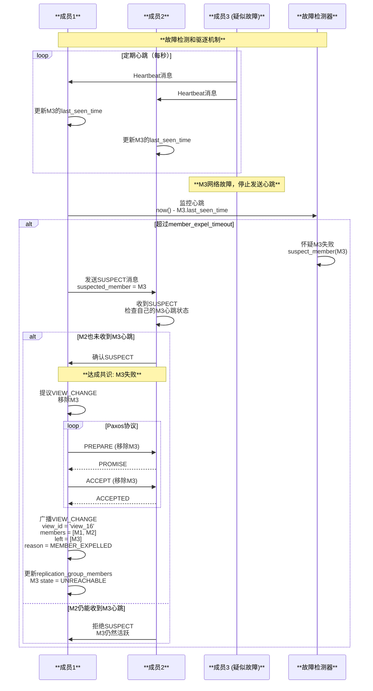

### 9.5 少数派处理参数

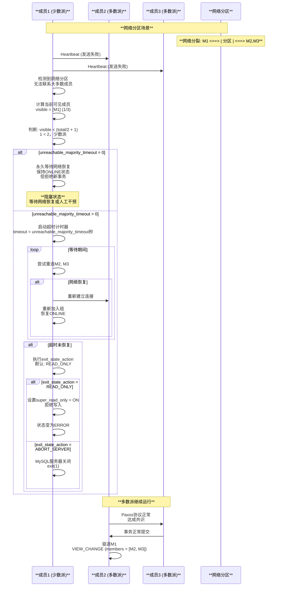

### 9.6 一致性参数

| 参数 | 默认值 | 选项 | 说明 | 性能影响 |
|------|-------|------|------|---------|
| `group_replication_consistency` | EVENTUAL | EVENTUAL, BEFORE, AFTER, BEFORE_AND_AFTER, BEFORE_ON_PRIMARY_FAILOVER | 事务一致性级别 | 越高一致性，性能越低 |
| `group_replication_transaction_size_limit` | 150MB | 0-2GB | 单个事务的最大大小 | 避免大事务阻塞组 |

### 9.7 一致性级别时序对比

```mermaid
sequenceDiagram
    participant CLIENT as **客户端**
    participant PRIMARY as **Primary成员**
    participant SECONDARY1 as **Secondary1**
    participant SECONDARY2 as **Secondary2**

    Note over CLIENT,SECONDARY2: **EVENTUAL vs BEFORE一致性对比**

    Note over PRIMARY: **场景A: EVENTUAL (默认)**
    
    CLIENT->>PRIMARY: BEGIN; INSERT INTO t1 VALUES(1);
    PRIMARY->>PRIMARY: 本地执行<br/>不等待secondaries
    PRIMARY->>PRIMARY: 广播给certification
    par 并行执行
        PRIMARY->>PRIMARY: 本地提交
    and
        PRIMARY->>SECONDARY1: 传播事务
        PRIMARY->>SECONDARY2: 传播事务
    end
    PRIMARY-->>CLIENT: Query OK (立即返回)
    
    Note over SECONDARY1: **可能存在延迟**<br/>Secondary还未应用事务
    
    CLIENT->>SECONDARY1: SELECT * FROM t1 WHERE id=1
    SECONDARY1-->>CLIENT: Empty set (事务还未到达)
    
    Note over PRIMARY: **场景B: BEFORE**
    
    CLIENT->>SECONDARY1: SET @@SESSION.group_replication_consistency = 'BEFORE'
    CLIENT->>SECONDARY1: SELECT * FROM t1
    
    SECONDARY1->>SECONDARY1: 检查队列中的事务<br/>确保所有先前的事务已应用
    
    alt 队列中有未应用事务
        SECONDARY1->>SECONDARY1: 阻塞查询<br/>等待事务应用完成
        loop 应用队列中的事务
            SECONDARY1->>SECONDARY1: apply_transaction()
        end
    end
    
    SECONDARY1->>SECONDARY1: 队列为空<br/>读取最新数据
    SECONDARY1-->>CLIENT: 返回结果 (保证是最新的)
    
    Note over PRIMARY: **场景C: BEFORE_AND_AFTER**
    
    CLIENT->>PRIMARY: SET @@SESSION.group_replication_consistency = 'BEFORE_AND_AFTER'
    CLIENT->>PRIMARY: BEGIN; UPDATE t1 SET val=2 WHERE id=1;
    
    PRIMARY->>PRIMARY: BEFORE: 等待之前所有事务完成
    PRIMARY->>PRIMARY: 执行UPDATE
    PRIMARY->>PRIMARY: 广播certification
    PRIMARY->>SECONDARY1: 传播事务
    PRIMARY->>SECONDARY2: 传播事务
    
    PRIMARY->>PRIMARY: AFTER: 等待所有成员ACK
    SECONDARY1->>SECONDARY1: apply_transaction()
    SECONDARY1-->>PRIMARY: ACK
    SECONDARY2->>SECONDARY2: apply_transaction()
    SECONDARY2-->>PRIMARY: ACK
    
    PRIMARY->>PRIMARY: 所有成员已应用<br/>强一致性保证
    PRIMARY-->>CLIENT: Query OK (耗时更长但一致性最强)
```

### 9.8 流控参数

| 参数 | 默认值 | 范围 | 说明 |
|------|-------|------|------|
| `group_replication_flow_control_mode` | QUOTA | DISABLED, QUOTA | 流控模式 |
| `group_replication_flow_control_certifier_threshold` | 25000 | 0-ULONG_MAX | Certifier队列阈值 |
| `group_replication_flow_control_applier_threshold` | 25000 | 0-ULONG_MAX | Applier队列阈值 |

### 9.9 流控机制时序

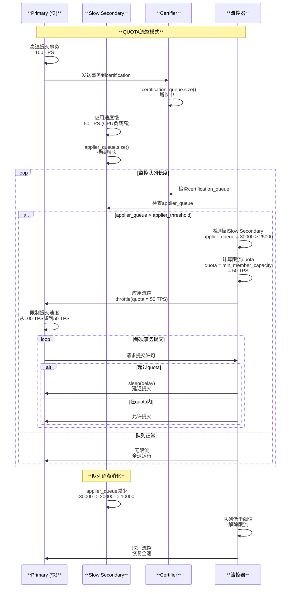

---

## 第十部分：MGR监控和诊断增强

### 10.1 实时监控SQL扩展

**监控组成员健康状态**:

```sql
-- 全面监控组成员状态
SELECT 
    m.MEMBER_ID,
    m.MEMBER_HOST,
    m.MEMBER_PORT,
    m.MEMBER_STATE,
    m.MEMBER_ROLE,
    CASE m.MEMBER_STATE
        WHEN 'ONLINE' THEN '健康'
        WHEN 'RECOVERING' THEN '恢复中'
        WHEN 'OFFLINE' THEN '离线'
        WHEN 'ERROR' THEN '错误'
        WHEN 'UNREACHABLE' THEN '不可达'
    END AS state_cn,
    s.COUNT_TRANSACTIONS_IN_QUEUE AS cert_queue,
    s.COUNT_CONFLICTS_DETECTED AS conflicts,
    s.COUNT_TRANSACTIONS_REMOTE_IN_APPLIER_QUEUE AS applier_queue,
    ROUND(s.COUNT_CONFLICTS_DETECTED * 100.0 / 
          NULLIF(s.COUNT_TRANSACTIONS_CHECKED, 0), 2) AS conflict_rate_pct
FROM performance_schema.replication_group_members m
LEFT JOIN performance_schema.replication_group_member_stats s
  ON m.MEMBER_ID = s.MEMBER_ID
ORDER BY m.MEMBER_ROLE DESC, m.MEMBER_HOST;
```

**诊断流控状态**:

```sql
-- 检测是否触发流控
SELECT 
    @@group_replication_flow_control_mode AS flow_control_mode,
    @@group_replication_flow_control_certifier_threshold AS cert_threshold,
    @@group_replication_flow_control_applier_threshold AS applier_threshold,
    MAX(s.COUNT_TRANSACTIONS_IN_QUEUE) AS max_cert_queue,
    MAX(s.COUNT_TRANSACTIONS_REMOTE_IN_APPLIER_QUEUE) AS max_applier_queue,
    CASE 
        WHEN MAX(s.COUNT_TRANSACTIONS_IN_QUEUE) > @@group_replication_flow_control_certifier_threshold
        THEN 'YES - Certifier队列超过阈值'
        WHEN MAX(s.COUNT_TRANSACTIONS_REMOTE_IN_APPLIER_QUEUE) > @@group_replication_flow_control_applier_threshold
        THEN 'YES - Applier队列超过阈值'
        ELSE 'NO - 队列正常'
    END AS flow_control_triggered
FROM performance_schema.replication_group_member_stats s;
```

MySQL Group Replication通过Paxos共识协议和完善的故障检测机制，提供了高可用、自动故障转移的分布式复制方案。以上补充了详细的GCS通信协议、成员间交互时序、以及完整的参数说明和流控机制。
