# MySQL 多线程复制(MTS)管理命令深度解析

## 概述

本文档详细解析MySQL多线程复制（Multi-Threaded Slave, MTS）的管理命令，从**源码层面**深入分析命令执行流程、架构设计和可观测性信息的采集与存储机制。

**基于源码**: `sql/rpl_replica.cc`, `sql/rpl_rli_pdb.cc`, `sql/sql_parse.cc`

---

## 第一部分：MTS管理命令总览

### 1.1 核心管理命令列表

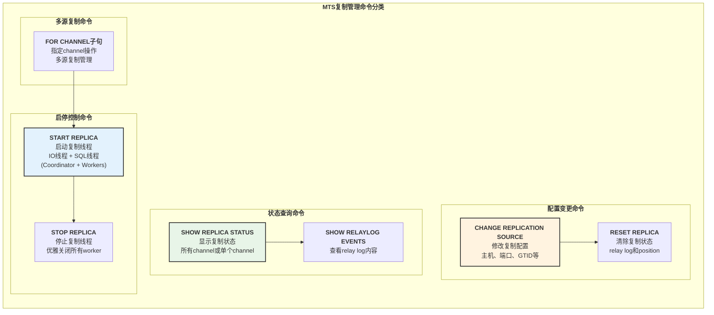

**命令详细列表**:

| 命令 | 语法示例 | 权限 | 说明 |
|------|---------|------|------|
| `START REPLICA` | `START REPLICA [IO_THREAD\|SQL_THREAD]` | REPLICATION_SLAVE_ADMIN | 启动复制线程 |
| `STOP REPLICA` | `STOP REPLICA [IO_THREAD\|SQL_THREAD]` | REPLICATION_SLAVE_ADMIN | 停止复制线程 |
| `CHANGE REPLICATION SOURCE` | `CHANGE REPLICATION SOURCE TO option` | REPLICATION_SLAVE_ADMIN | 修改复制源配置 |
| `RESET REPLICA` | `RESET REPLICA [ALL]` | REPLICATION_SLAVE_ADMIN | 重置复制状态 |
| `SHOW REPLICA STATUS` | `SHOW REPLICA STATUS [FOR CHANNEL 'ch']` | REPLICATION CLIENT | 查看复制状态 |
| `SHOW RELAYLOG EVENTS` | `SHOW RELAYLOG EVENTS [IN 'log']` | REPLICATION SLAVE | 查看relay log事件 |

---

## 第二部分：START REPLICA 源码深度解析

### 2.1 START REPLICA 命令架构

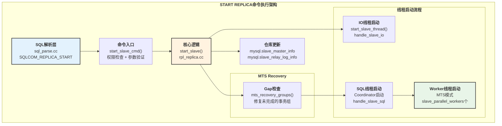

### 2.2 START REPLICA 时序图

**源码位置**: `sql/rpl_replica.cc:8888-9092`

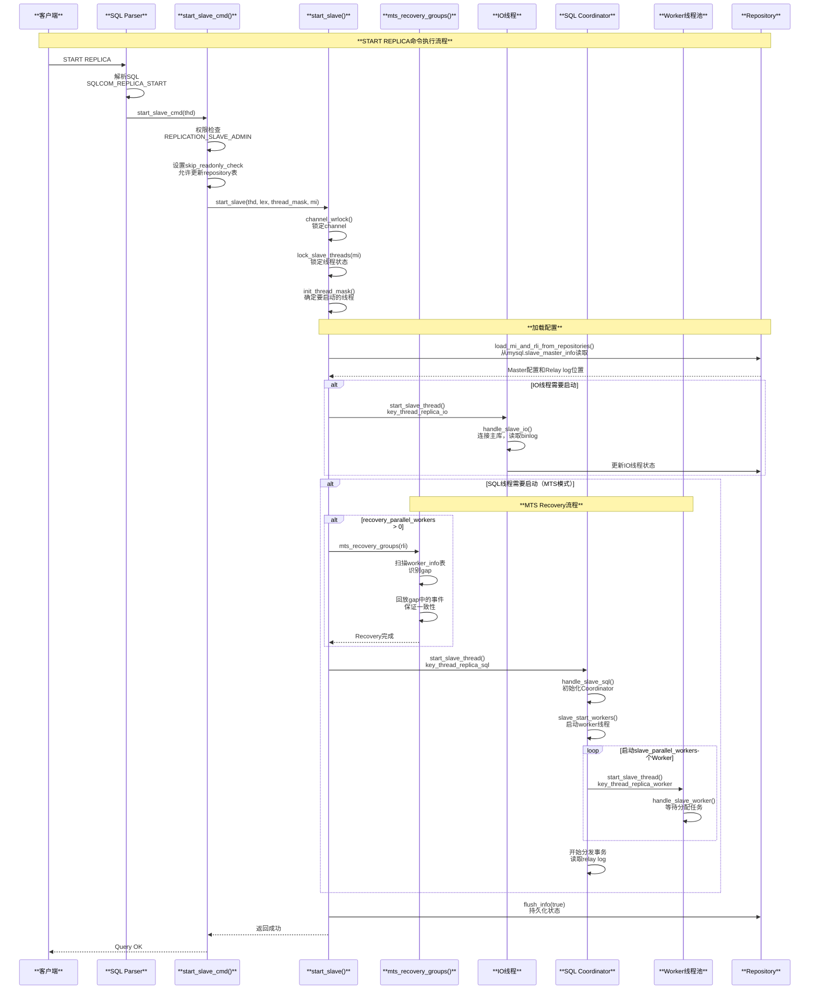

### 2.3 START REPLICA 源码关键路径

**源码位置**: `sql/rpl_replica.cc:8888-9092`

```cpp
// 入口函数
bool start_slave(THD *thd, LEX_REPLICA_CONNECTION *connection_param,
                 LEX_SOURCE_INFO *master_param, int thread_mask_input,
                 Master_info *mi, bool set_mts_settings) {
  // 1. 权限检查
  Security_context *sctx = thd->security_context();
  if (!sctx->check_access(SUPER_ACL) &&
      !sctx->has_global_grant("REPLICATION_SLAVE_ADMIN")) {
    my_error(ER_SPECIFIC_ACCESS_DENIED_ERROR, MYF(0),
             "SUPER or REPLICATION_SLAVE_ADMIN");
    return true;
  }

  // 2. 锁定channel和线程
  mi->channel_wrlock();
  lock_slave_threads(mi);
  
  // 3. 确定要启动的线程
  init_thread_mask(&thread_mask, mi, true);
  if (thread_mask_input) {
    thread_mask &= thread_mask_input;
  }

  // 4. 加载配置
  if (load_mi_and_rli_from_repositories(mi, false, thread_mask)) {
    // 错误处理
  }

  // 5. 启动线程
  if (start_slave_threads(...)) {
    // 启动IO线程、SQL Coordinator、Workers
  }
}
```

**MTS Recovery关键代码** (`sql/rpl_rli_pdb.cc:2134-2138`):

```cpp
// MTS Recovery: 修复gap
if (mi->rli->recovery_parallel_workers != 0) {
  if (mts_recovery_groups(mi->rli)) {
    is_error = true;
    my_error(ER_MTA_RECOVERY_FAILURE, MYF(0));
  }
}
```

---

## 第三部分：STOP REPLICA 源码深度解析

### 3.1 STOP REPLICA 时序图

**源码位置**: `sql/rpl_replica.cc:3754-3776`

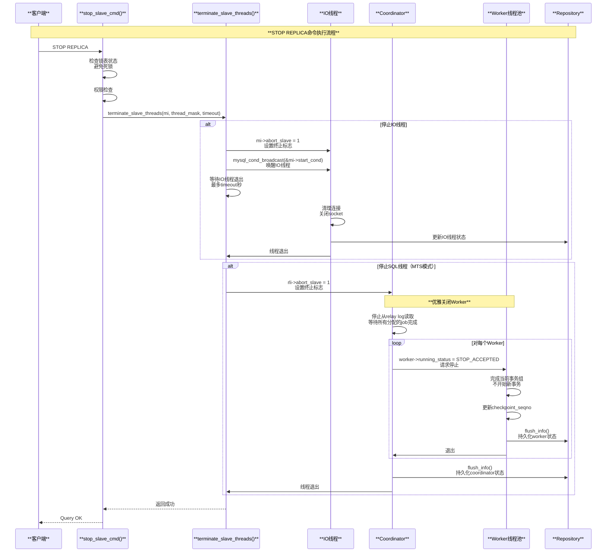

### 3.2 优雅关闭机制

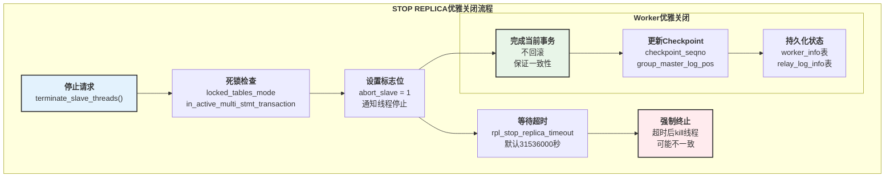

---

## 第四部分：CHANGE REPLICATION SOURCE 深度解析

### 4.1 CHANGE REPLICATION SOURCE 架构

**源码位置**: `sql/rpl_replica.cc:11052-11660`

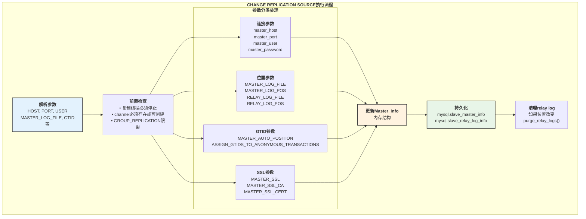

### 4.2 关键参数详解

| 参数类别 | 参数名 | 说明 | 源码字段 |
|---------|-------|------|---------|
| **连接信息** | `SOURCE_HOST` | 主库主机名或IP | `mi->host` |
| | `SOURCE_PORT` | 主库端口号 | `mi->port` |
| | `SOURCE_USER` | 复制用户名 | `mi->user` |
| | `SOURCE_PASSWORD` | 复制密码 | `mi->password` |
| **位置信息** | `SOURCE_LOG_FILE` | 主库binlog文件名 | `mi->master_log_name` |
| | `SOURCE_LOG_POS` | 主库binlog位置 | `mi->master_log_pos` |
| | `RELAY_LOG_FILE` | relay log文件名 | `rli->group_relay_log_name` |
| | `RELAY_LOG_POS` | relay log位置 | `rli->group_relay_log_pos` |
| **GTID模式** | `SOURCE_AUTO_POSITION` | 启用GTID自动定位 | `mi->is_auto_position()` |
| | `ASSIGN_GTIDS_TO_ANONYMOUS_TRANSACTIONS` | 匿名事务GTID分配 | `mi->assign_gtids_to_anonymous_transactions_type` |
| **SSL配置** | `SOURCE_SSL` | 启用SSL连接 | `mi->ssl` |
| | `SOURCE_SSL_CA` | CA证书路径 | `mi->ssl_ca` |
| | `SOURCE_SSL_CERT` | 客户端证书 | `mi->ssl_cert` |

---

## 第五部分：可观测性信息深度解析

### 5.1 可观测性架构

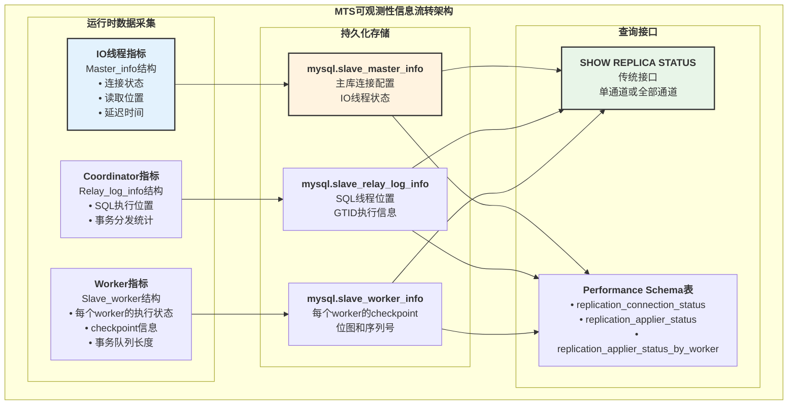

### 5.2 数据采集与更新流程

**源码位置**: `sql/rpl_rli_pdb.cc:188-225`

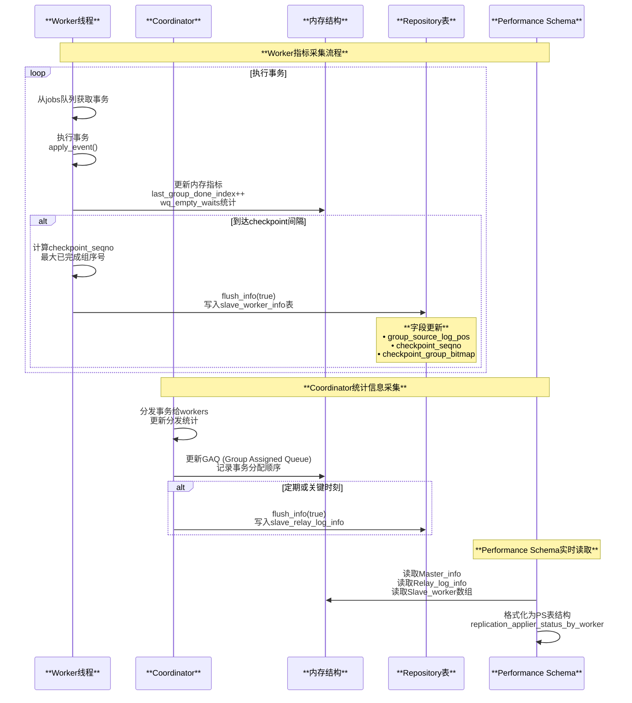

### 5.3 slave_worker_info 表结构

**源码位置**: `sql/rpl_rli_pdb.cc:190-225`

```cpp
const char *info_slave_worker_fields[] = {
    "id",                             // Worker ID
    "group_relay_log_name",           // Worker执行到的relay log文件
    "group_relay_log_pos",            // Worker执行到的relay log位置
    "group_source_log_name",          // 对应的主库binlog文件
    "group_source_log_pos",           // 对应的主库binlog位置
    "checkpoint_relay_log_name",      // Checkpoint时的relay log文件
    "checkpoint_relay_log_pos",       // Checkpoint时的relay log位置
    "checkpoint_source_log_name",     // Checkpoint时的主库binlog文件
    "checkpoint_source_log_pos",      // Checkpoint时的主库binlog位置
    "checkpoint_seqno",               // Checkpoint序列号
    "checkpoint_group_size",          // Checkpoint组大小
    "checkpoint_group_bitmap",        // 已完成事务的位图
    "channel_name"                    // Channel名称
};
```

**字段详解**:

| 字段 | 类型 | 说明 | 用途 |
|-----|------|------|------|
| `id` | INT | Worker ID (0-N) | 标识worker |
| `group_source_log_pos` | BIGINT | 主库binlog位置 | 崩溃恢复时定位 |
| `checkpoint_seqno` | BIGINT UNSIGNED | 最大已完成事务序号 | Gap检测 |
| `checkpoint_group_bitmap` | BLOB | 完成状态位图 | 标识哪些事务已完成 |

### 5.4 SHOW REPLICA STATUS 输出解析

**关键字段详解**:

| 字段 | 说明 | MTS特有 |
|------|------|--------|
| `Slave_IO_Running` | IO线程运行状态 | ❌ |
| `Slave_SQL_Running` | SQL线程（Coordinator）运行状态 | ❌ |
| `Slave_SQL_Running_State` | SQL线程当前状态描述 | ✅ 显示"Waiting for workers to process queue" |
| `Master_Log_File` | 当前读取的主库binlog文件 | ❌ |
| `Read_Master_Log_Pos` | IO线程读取的主库binlog位置 | ❌ |
| `Relay_Log_File` | 当前执行的relay log文件 | ❌ |
| `Relay_Log_Pos` | Coordinator读取的relay log位置 | ❌ |
| `Exec_Master_Log_Pos` | 已执行到的主库binlog位置 | ✅ 所有workers中最小的位置 |
| `Seconds_Behind_Master` | 复制延迟（秒） | ✅ 根据workers计算 |
| `Last_IO_Errno` | IO线程最后错误号 | ❌ |
| `Last_SQL_Errno` | SQL线程最后错误号 | ✅ 可能来自任何worker |
| `Retrieved_Gtid_Set` | IO线程已检索的GTID集合 | ❌ |
| `Executed_Gtid_Set` | 已执行的GTID集合 | ✅ 所有workers执行的GTID |

---

## 第六部分：Performance Schema 监控

### 6.1 Performance Schema 复制表

```mermaid
graph LR
    subgraph "<b>Performance Schema复制监控表</b>"
        subgraph "<b>连接状态表</b>"
            CONN_CONFIG["<b>replication_connection_configuration</b><br/>连接配置信息<br/>主库地址、用户等"]
            CONN_STATUS["<b>replication_connection_status</b><br/>IO线程状态<br/>GTID、延迟等"]
        end
        
        subgraph "<b>应用状态表</b>"
            APPLIER_CONFIG["<b>replication_applier_configuration</b><br/>SQL线程配置<br/>并行度等"]
            APPLIER_STATUS["<b>replication_applier_status</b><br/>Coordinator状态"]
            APPLIER_BY_COORD["<b>replication_applier_status_by_coordinator</b><br/>Coordinator详情"]
            APPLIER_BY_WORKER["<b>replication_applier_status_by_worker</b><br/>每个Worker详细状态"]
        end
        
        subgraph "<b>组复制表（MGR）</b>"
            GR_MEMBERS["<b>replication_group_members</b><br/>组成员信息"]
            GR_MEMBER_STATS["<b>replication_group_member_stats</b><br/>成员统计信息"]
        end
    end
    
    CONN_CONFIG --> CONN_STATUS
    APPLIER_CONFIG --> APPLIER_STATUS
    APPLIER_STATUS --> APPLIER_BY_COORD
    APPLIER_BY_COORD --> APPLIER_BY_WORKER
    
    style CONN_STATUS fill:#e3f2fd,stroke:#333,stroke-width:2px
    style APPLIER_BY_WORKER fill:#e8f5e8,stroke:#333,stroke-width:2px
```

### 6.2 监控SQL示例

**查看Worker状态**:

```sql
-- 查看所有Worker的当前状态
SELECT 
    CHANNEL_NAME,
    WORKER_ID,
    THREAD_ID,
    SERVICE_STATE,
    LAST_ERROR_NUMBER,
    LAST_ERROR_MESSAGE,
    LAST_ERROR_TIMESTAMP,
    LAST_APPLIED_TRANSACTION,
    LAST_APPLIED_TRANSACTION_ORIGINAL_COMMIT_TIMESTAMP,
    LAST_APPLIED_TRANSACTION_END_APPLY_TIMESTAMP,
    APPLYING_TRANSACTION,
    APPLYING_TRANSACTION_ORIGINAL_COMMIT_TIMESTAMP
FROM performance_schema.replication_applier_status_by_worker
ORDER BY CHANNEL_NAME, WORKER_ID;
```

**查看复制延迟**:

```sql
-- 查看每个Worker的复制延迟
SELECT 
    CHANNEL_NAME,
    WORKER_ID,
    SERVICE_STATE,
    TIMESTAMPDIFF(
        SECOND,
        LAST_APPLIED_TRANSACTION_ORIGINAL_COMMIT_TIMESTAMP,
        LAST_APPLIED_TRANSACTION_END_APPLY_TIMESTAMP
    ) AS apply_latency_seconds,
    TIMESTAMPDIFF(
        SECOND,
        APPLYING_TRANSACTION_ORIGINAL_COMMIT_TIMESTAMP,
        NOW()
    ) AS current_transaction_delay
FROM performance_schema.replication_applier_status_by_worker
WHERE SERVICE_STATE = 'ON';
```

**监控Coordinator状态**:

```sql
-- 查看Coordinator分发情况
SELECT 
    c.CHANNEL_NAME,
    c.SERVICE_STATE AS coordinator_state,
    a.SERVICE_STATE AS applier_state,
    a.REMAINING_DELAY,
    a.COUNT_TRANSACTIONS_IN_QUEUE,
    a.COUNT_TRANSACTIONS_RETRIES
FROM performance_schema.replication_applier_status_by_coordinator c
JOIN performance_schema.replication_applier_status a
  ON c.CHANNEL_NAME = a.CHANNEL_NAME;
```

---

## 第七部分：故障排查与优化

### 7.1 常见问题诊断流程

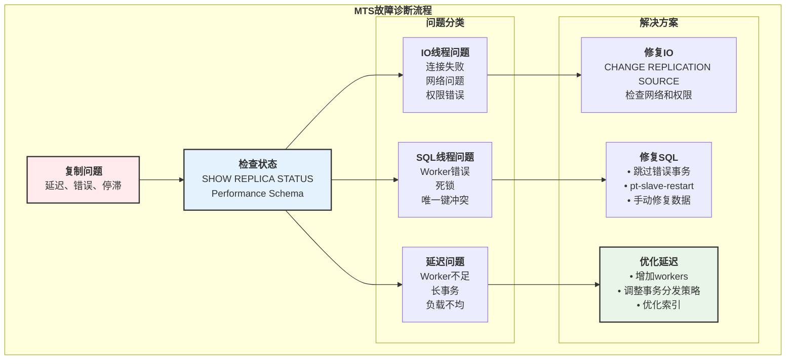

### 7.2 性能优化参数

| 参数 | 默认值 | 说明 | 优化建议 |
|------|-------|------|---------|
| `slave_parallel_workers` | 4 | Worker线程数 | 根据CPU核心数调整，通常4-32 |
| `slave_parallel_type` | LOGICAL_CLOCK | 并行模式 | DATABASE: 按库并行, LOGICAL_CLOCK: 按组提交并行 |
| `slave_preserve_commit_order` | ON | 保持提交顺序 | 保证主从一致性，性能略低 |
| `slave_pending_jobs_size_max` | 128MB | 队列最大大小 | 增大可提高吞吐，但占用更多内存 |
| `slave_transaction_retries` | 10 | 事务重试次数 | 遇到临时错误时重试 |
| `rpl_stop_replica_timeout` | 31536000 | STOP超时时间 | 1年，避免强制kill |

---

## 总结

### 核心要点回顾

**命令管理**:

- **START REPLICA**: 启动IO线程、Coordinator和Workers，包含MTS Recovery
- **STOP REPLICA**: 优雅关闭，等待Workers完成当前事务
- **CHANGE REPLICATION SOURCE**: 修改连接配置和复制位置
- **SHOW REPLICA STATUS**: 查看整体复制状态

**架构特点**:

- **Coordinator-Worker模式**: Coordinator分发事务，Workers并行执行
- **GAQ (Group Assigned Queue)**: 维护事务分配顺序，保证一致性
- **Checkpoint机制**: 定期持久化Worker状态，支持崩溃恢复
- **Gap Recovery**: 启动时修复未完成的事务组

**可观测性**:

- **Repository表**: slave_master_info、slave_relay_log_info、slave_worker_info
- **Performance Schema**: 实时监控每个Worker的执行状态
- **SHOW REPLICA STATUS**: 传统监控接口，展示整体状态

**最佳实践**:

- 根据工作负载调整`slave_parallel_workers`
- 使用`LOGICAL_CLOCK`模式获得更好的并行度
- 定期监控Performance Schema表，及时发现延迟和错误
- 合理设置`slave_preserve_commit_order`平衡一致性和性能

MySQL MTS通过多线程并行复制，显著提升了复制性能，是高可用架构的重要组成部分。

---

## 第八部分：RESET REPLICA 命令深度解析

### 8.1 RESET REPLICA 架构

**源码位置**: `sql/rpl_replica.cc:9185-9426`

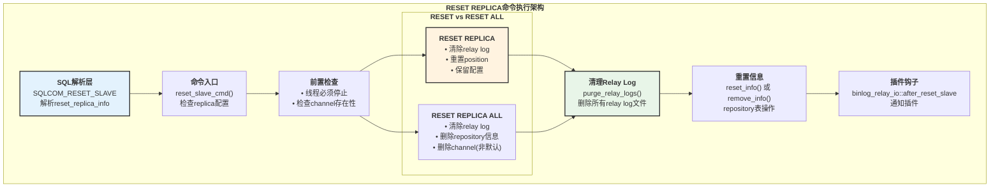

### 8.2 RESET REPLICA 时序图

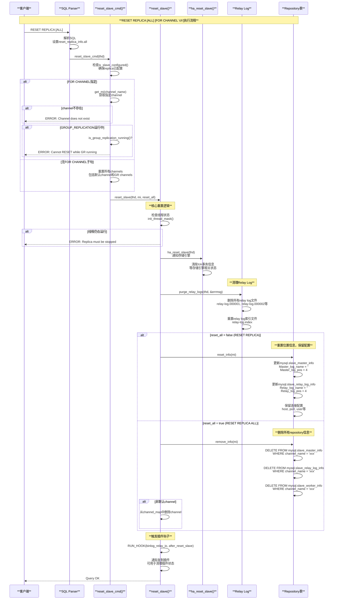

### 8.3 RESET REPLICA 关键源码

**源码位置**: `sql/rpl_replica.cc:9279-9330`

```cpp
int reset_slave(THD *thd, Master_info *mi, bool reset_all) {
  int thread_mask = 0, error = 0;
  const char *errmsg = "Unknown error occurred while reseting replica";
  
  // 1. 跳过只读检查（需要更新repository表）
  thd->set_skip_readonly_check();
  mi->channel_wrlock();

  // 2. 锁定并检查线程状态
  lock_slave_threads(mi);
  init_thread_mask(&thread_mask, mi, false);
  if (thread_mask) {
    // 有线程仍在运行，拒绝执行
    my_error(ER_REPLICA_CHANNEL_MUST_STOP, MYF(0), mi->get_channel());
    error = ER_REPLICA_CHANNEL_MUST_STOP;
    goto err;
  }

  // 3. 通知存储引擎
  ha_reset_slave(thd);

  // 4. 清除relay logs
  if ((error = mi->rli->purge_relay_logs(
          thd, &errmsg, reset_all && !is_default_channel))) {
    my_error(ER_RELAY_LOG_FAIL, MYF(0), errmsg);
    goto err;
  }

  // 5. 重置或删除repository信息
  if ((reset_all && remove_info(mi)) ||
      (!reset_all && reset_info(mi))) {
    error = ER_UNKNOWN_ERROR;
    my_error(ER_UNKNOWN_ERROR, MYF(0));
    goto err;
  }

  // 6. 触发after_reset_slave钩子
  (void)RUN_HOOK(binlog_relay_io, after_reset_slave, (thd, mi));

err:
  unlock_slave_threads(mi);
  mi->channel_unlock();
  return error;
}
```

---

## 第九部分：SHOW REPLICA STATUS 命令深度解析

### 9.1 SHOW REPLICA STATUS 时序图

**源码位置**: `sql/rpl_replica.cc:3744-3983`

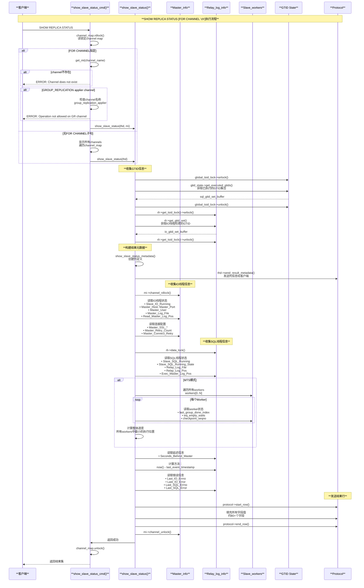

### 9.2 SHOW REPLICA STATUS 字段分类

**源码位置**: `sql/rpl_replica.cc:3310-3550`

**IO线程相关字段**:

| 字段 | 类型 | 说明 | 来源 |
|------|------|------|------|
| `Slave_IO_State` | VARCHAR | IO线程状态描述 | `mi->slave_running_state` |
| `Slave_IO_Running` | VARCHAR | IO线程是否运行 | `mi->slave_running` |
| `Master_Host` | VARCHAR | 主库主机名 | `mi->host` |
| `Master_Port` | INT | 主库端口 | `mi->port` |
| `Master_User` | VARCHAR | 复制用户名 | `mi->user` |
| `Master_Log_File` | VARCHAR | 当前读取的主库binlog文件 | `mi->get_master_log_name()` |
| `Read_Master_Log_Pos` | BIGINT | IO线程读取的主库binlog位置 | `mi->get_master_log_pos()` |
| `Master_Retry_Count` | BIGINT | 连接失败重试次数 | `mi->retry_count` |
| `Master_Connect_Retry` | INT | 重试间隔（秒） | `mi->connect_retry` |

**SQL线程相关字段**:

| 字段 | 类型 | 说明 | 来源 |
|------|------|------|------|
| `Slave_SQL_Running` | VARCHAR | SQL线程是否运行 | `rli->slave_running` |
| `Slave_SQL_Running_State` | VARCHAR | SQL线程状态描述 | `rli->sql_thread_status` |
| `Relay_Log_File` | VARCHAR | 当前执行的relay log文件 | `rli->get_group_relay_log_name()` |
| `Relay_Log_Pos` | BIGINT | Relay log中的执行位置 | `rli->get_group_relay_log_pos()` |
| `Relay_Log_Space` | BIGINT | Relay log总大小 | `rli->log_space_total` |
| `Exec_Master_Log_Pos` | BIGINT | 对应主库binlog的执行位置 | `rli->get_group_master_log_pos()` |
| `Until_Condition` | VARCHAR | START REPLICA UNTIL条件 | `rli->until_condition` |
| `Until_Log_File` | VARCHAR | UNTIL指定的日志文件 | `rli->until_log_name` |
| `Until_Log_Pos` | BIGINT | UNTIL指定的位置 | `rli->until_log_pos` |

**复制延迟和错误字段**:

| 字段 | 类型 | 说明 | 计算方法 |
|------|------|------|---------|
| `Seconds_Behind_Master` | INT | 复制延迟（秒） | `now() - last_event_timestamp` (NULL表示未连接) |
| `Last_IO_Errno` | INT | IO线程最后错误号 | `mi->last_error().number` |
| `Last_IO_Error` | VARCHAR | IO线程最后错误消息 | `mi->last_error().message` |
| `Last_IO_Error_Timestamp` | TIMESTAMP | IO错误时间戳 | `mi->last_error().timestamp` |
| `Last_SQL_Errno` | INT | SQL线程最后错误号 | `rli->last_error().number` |
| `Last_SQL_Error` | VARCHAR | SQL线程最后错误消息 | `rli->last_error().message` |
| `Last_SQL_Error_Timestamp` | TIMESTAMP | SQL错误时间戳 | `rli->last_error().timestamp` |

**GTID相关字段**:

| 字段 | 类型 | 说明 | 来源 |
|------|------|------|------|
| `Retrieved_Gtid_Set` | LONGTEXT | IO线程已检索的GTID集合 | `rli->get_gtid_set()->to_string()` |
| `Executed_Gtid_Set` | LONGTEXT | 已执行的GTID集合 | `gtid_state->get_executed_gtids()->to_string()` |
| `Auto_Position` | INT | 是否启用GTID自动定位 | `mi->is_auto_position()` |

---

## 第十部分：SHOW RELAYLOG EVENTS 命令深度解析

### 10.1 SHOW RELAYLOG EVENTS 时序图

**源码位置**: `sql/rpl_rli.cc:1497-1540`, `sql/binlog.cc:3636-3748`

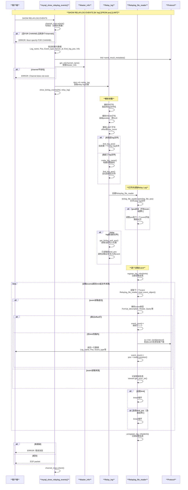

### 10.2 Relay Log Event格式

**源码位置**: `sql/log_event.h`, `libbinlogevents/include/binlog_event.h`

```mermaid
graph TB
    subgraph "<b>Relay Log Event结构</b>"
        subgraph "<b>Event Header (19字节)</b>"
            TIMESTAMP["<b>timestamp</b><br/>4字节<br/>事件发生时间（秒）"]
            EVENT_TYPE["<b>event_type</b><br/>1字节<br/>事件类型枚举"]
            SERVER_ID["<b>server_id</b><br/>4字节<br/>产生此event的服务器ID"]
            EVENT_LEN["<b>event_length</b><br/>4字节<br/>整个event的长度"]
            LOG_POS["<b>log_pos</b><br/>4字节<br/>下一个event的position"]
            FLAGS["<b>flags</b><br/>2字节<br/>事件标志位"]
        end
        
        subgraph "<b>Event Data</b>"
            POST_HEADER["<b>Post-header</b><br/>固定长度<br/>事件类型特定数据"]
            PAYLOAD["<b>Payload</b><br/>可变长度<br/>事件的主要内容"]
        end
        
        CHECKSUM["<b>Checksum (可选)</b><br/>4字节<br/>CRC32校验和"]
    end
    
    TIMESTAMP --> EVENT_TYPE
    EVENT_TYPE --> SERVER_ID
    SERVER_ID --> EVENT_LEN
    EVENT_LEN --> LOG_POS
    LOG_POS --> FLAGS
    FLAGS --> POST_HEADER
    POST_HEADER --> PAYLOAD
    PAYLOAD --> CHECKSUM
    
    style TIMESTAMP fill:#e3f2fd,stroke:#333,stroke-width:2px
    style EVENT_TYPE fill:#fff3e0,stroke:#333,stroke-width:2px
    style PAYLOAD fill:#e8f5e8,stroke:#333,stroke-width:2px
```

**常见Event类型**:

| Event Type | 枚举值 | 说明 | 用途 |
|-----------|-------|------|------|
| `FORMAT_DESCRIPTION_EVENT` | 15 | 格式描述事件 | relay log文件开头，描述binlog格式版本 |
| `ROTATE_EVENT` | 4 | 轮转事件 | relay log切换到新文件 |
| `PREVIOUS_GTIDS_LOG_EVENT` | 35 | 之前的GTID集合 | 记录之前relay log中的GTIDs |
| `GTID_LOG_EVENT` | 33 | GTID事件 | 标识事务的GTID |
| `QUERY_EVENT` | 2 | 查询事件 | DDL语句、BEGIN/COMMIT等 |
| `XID_EVENT` | 16 | XID事件 | 事务提交（InnoDB） |
| `TABLE_MAP_EVENT` | 19 | 表映射事件 | 行事件前的表定义 |
| `WRITE_ROWS_EVENT` | 30 | 写行事件 | INSERT操作的行数据 |
| `UPDATE_ROWS_EVENT` | 31 | 更新行事件 | UPDATE操作的行数据 |
| `DELETE_ROWS_EVENT` | 32 | 删除行事件 | DELETE操作的行数据 |

---

## 第十一部分：MySQL复制协议深度解析

### 11.1 MySQL复制协议概览

```mermaid
graph TB
    subgraph "<b>MySQL复制协议完整流程</b>"
        subgraph "<b>连接建立阶段</b>"
            CONNECT["<b>1. TCP连接</b><br/>Slave连接Master<br/>3306端口"]
            HANDSHAKE["<b>2. 握手协议</b><br/>Protocol::HandshakeV10<br/>交换能力和版本"]
            AUTH["<b>3. 认证</b><br/>Protocol::HandshakeResponse<br/>用户名、密码验证"]
        end
        
        subgraph "<b>复制注册阶段</b>"
            REGISTER["<b>4. COM_REGISTER_SLAVE</b><br/>Slave向Master注册<br/>报告server_id、host、port"]
            BINLOG_CHECKSUM["<b>5. SET @master_binlog_checksum</b><br/>协商binlog校验和算法"]
            HEARTBEAT["<b>6. SET @master_heartbeat_period</b><br/>设置心跳间隔"]
        end
        
        subgraph "<b>Binlog请求阶段</b>"
            DUMP["<b>7. COM_BINLOG_DUMP</b><br/>或COM_BINLOG_DUMP_GTID<br/>请求binlog stream"]
        end
        
        subgraph "<b>事件传输阶段</b>"
            STREAM["<b>8. Binlog Event Stream</b><br/>持续发送binlog events<br/>直到断开或错误"]
            HEARTBEAT_PKT["<b>9. Heartbeat Packet</b><br/>心跳包（无事件时）<br/>保持连接活跃"]
        end
    end
    
    CONNECT --> HANDSHAKE
    HANDSHAKE --> AUTH
    AUTH --> REGISTER
    REGISTER --> BINLOG_CHECKSUM
    BINLOG_CHECKSUM --> HEARTBEAT
    HEARTBEAT --> DUMP
    DUMP --> STREAM
    STREAM --> HEARTBEAT_PKT
    HEARTBEAT_PKT --> STREAM
    
    style CONNECT fill:#e3f2fd,stroke:#333,stroke-width:2px
    style REGISTER fill:#fff3e0,stroke:#333,stroke-width:2px
    style STREAM fill:#e8f5e8,stroke:#333,stroke-width:2px
```

### 11.2 COM_REGISTER_SLAVE 协议

**源码位置**: `sql/rpl_source.cc:142-240`

**协议格式**:

```text
Packet Type: COM_REGISTER_SLAVE (0x15 = 21)

Packet Layout:
+----------------------+----------------+------------------------------------+
| 字段                 | 类型           | 说明                              |
+----------------------+----------------+------------------------------------+
| command              | int<1>         | [0x15] COM_REGISTER_SLAVE         |
| server_id            | int<4>         | Slave的server_id                  |
| host_len             | int<1>         | hostname长度                      |
| host                 | string<VAR>    | Slave的hostname (report_host)     |
| user_len             | int<1>         | username长度                      |
| user                 | string<VAR>    | Slave的username (report_user)     |
| password_len         | int<1>         | password长度                      |
| password             | string<VAR>    | Slave的password (report_password) |
| port                 | int<2>         | Slave的端口 (report_port)         |
| rpl_recovery_rank    | int<4>         | 已废弃，值为0                     |
| master_id            | int<4>         | Master的server_id                 |
+----------------------+----------------+------------------------------------+
```

**时序图**:

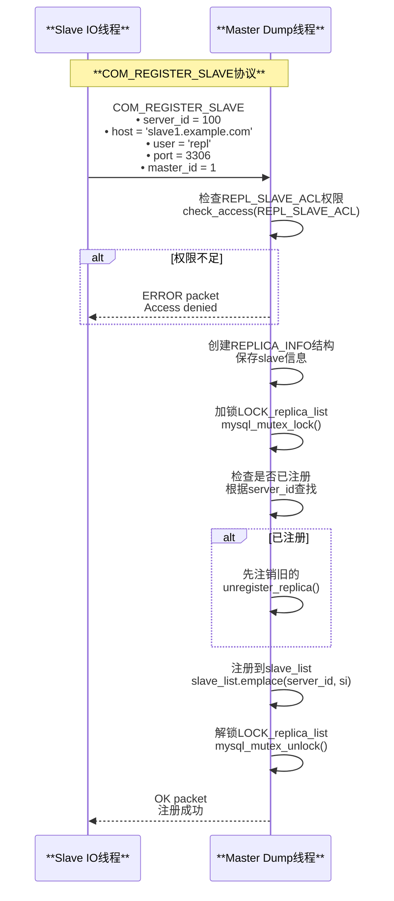

### 11.3 COM_BINLOG_DUMP 和 COM_BINLOG_DUMP_GTID 协议

**COM_BINLOG_DUMP协议格式** (基于位置的复制):

```text
Packet Type: COM_BINLOG_DUMP (0x12 = 18)

Packet Layout:
+----------------------+----------------+------------------------------------+
| 字段                 | 类型           | 说明                              |
+----------------------+----------------+------------------------------------+
| command              | int<1>         | [0x12] COM_BINLOG_DUMP            |
| binlog_pos           | int<4>         | 开始读取的binlog位置              |
| flags                | int<2>         | BINLOG_DUMP_NON_BLOCK (0x01)      |
| server_id            | int<4>         | Slave的server_id                  |
| binlog_filename      | string<EOF>    | 开始读取的binlog文件名            |
+----------------------+----------------+------------------------------------+
```

**COM_BINLOG_DUMP_GTID协议格式** (基于GTID的复制):

```text
Packet Type: COM_BINLOG_DUMP_GTID (0x1E = 30)

Packet Layout:
+----------------------+----------------+------------------------------------+
| 字段                 | 类型           | 说明                              |
+----------------------+----------------+------------------------------------+
| command              | int<1>         | [0x1E] COM_BINLOG_DUMP_GTID       |
| flags                | int<2>         | 标志位                            |
| server_id            | int<4>         | Slave的server_id                  |
| binlog_name_len      | int<4>         | binlog文件名长度                  |
| binlog_name          | string<VAR>    | binlog文件名                      |
| binlog_pos           | int<8>         | binlog位置（64位）                |
| data_size            | int<4>         | GTID集合的编码大小                |
| data                 | string<VAR>    | 已执行的GTID集合（编码）          |
+----------------------+----------------+------------------------------------+
```

**完整复制协议时序图**:

```mermaid
sequenceDiagram
    participant SLAVE_IO as **Slave IO线程**
    participant SLAVE_SQL as **Slave SQL线程**
    participant MASTER_DUMP as **Master Dump线程**
    participant MASTER_BINLOG as **Master Binlog**

    Note over SLAVE_IO,MASTER_BINLOG: **完整复制协议交互流程**

    Note over SLAVE_IO: **1. 连接建立**
    SLAVE_IO->>MASTER_DUMP: TCP连接 (host:3306)
    MASTER_DUMP-->>SLAVE_IO: Handshake V10<br/>• protocol_version<br/>• server_version<br/>• capabilities
    SLAVE_IO->>MASTER_DUMP: HandshakeResponse<br/>• username<br/>• password<br/>• client_capabilities
    MASTER_DUMP->>MASTER_DUMP: 验证用户凭证
    MASTER_DUMP-->>SLAVE_IO: OK packet (认证成功)
    
    Note over SLAVE_IO: **2. 注册Slave**
    SLAVE_IO->>MASTER_DUMP: COM_REGISTER_SLAVE<br/>• server_id<br/>• host, port<br/>• user
    MASTER_DUMP->>MASTER_DUMP: 保存到slave_list
    MASTER_DUMP-->>SLAVE_IO: OK packet
    
    Note over SLAVE_IO: **3. 协商参数**
    SLAVE_IO->>MASTER_DUMP: SET @master_binlog_checksum = @@global.binlog_checksum
    MASTER_DUMP-->>SLAVE_IO: OK packet
    SLAVE_IO->>MASTER_DUMP: SELECT @master_binlog_checksum
    MASTER_DUMP-->>SLAVE_IO: Result: 'CRC32' 或 'NONE'
    
    SLAVE_IO->>MASTER_DUMP: SET @master_heartbeat_period = HEARTBEAT_INTERVAL
    MASTER_DUMP-->>SLAVE_IO: OK packet
    
    Note over SLAVE_IO: **4. 请求Binlog Stream**
    
    alt GTID模式
        SLAVE_IO->>MASTER_DUMP: COM_BINLOG_DUMP_GTID<br/>• flags = 0<br/>• server_id = 100<br/>• binlog_name = ''<br/>• binlog_pos = 4<br/>• gtid_executed = 'uuid:1-50'
        MASTER_DUMP->>MASTER_DUMP: 解析GTID集合<br/>确定需要发送的事务
    else 位置模式
        SLAVE_IO->>MASTER_DUMP: COM_BINLOG_DUMP<br/>• binlog_pos = 12345<br/>• flags = BINLOG_DUMP_NON_BLOCK<br/>• server_id = 100<br/>• binlog_filename = 'mysql-bin.000003'
        MASTER_DUMP->>MASTER_DUMP: 定位到指定文件和位置
    end
    
    MASTER_DUMP->>MASTER_BINLOG: mysql_binlog_send()<br/>开始发送binlog events
    
    Note over MASTER_DUMP: **5. Binlog Event Stream**
    
    loop 持续发送events
        MASTER_BINLOG->>MASTER_BINLOG: 读取下一个event<br/>Binlog_file_reader
        
        alt 有新event
            MASTER_BINLOG->>MASTER_DUMP: event_data
            
            alt GTID模式且event已执行
                MASTER_DUMP->>MASTER_DUMP: 跳过此event<br/>在slave的gtid_executed中
            else 需要发送
                MASTER_DUMP->>SLAVE_IO: Network Packet<br/>• packet_length<br/>• OK byte (0x00)<br/>• event_data
                
                SLAVE_IO->>SLAVE_IO: 验证校验和<br/>CRC32 check
                SLAVE_IO->>SLAVE_IO: 写入relay log<br/>queue_event()
                SLAVE_IO->>SLAVE_SQL: 通知SQL线程<br/>有新event可用
            end
        else 无新event（追上master）
            MASTER_DUMP->>MASTER_DUMP: 等待新event<br/>或发送心跳
            
            alt 心跳间隔已到
                MASTER_DUMP->>SLAVE_IO: Heartbeat Packet<br/>• OK byte (0x00)<br/>• log_file_name<br/>• log_pos
                SLAVE_IO->>SLAVE_IO: 更新heartbeat接收时间<br/>mi->last_heartbeat
            end
        end
        
        alt Slave断开或错误
            SLAVE_IO->>MASTER_DUMP: 断开连接
            MASTER_DUMP->>MASTER_DUMP: 清理dump线程资源
            MASTER_DUMP->>MASTER_DUMP: unregister_replica()
        end
    end
```

### 11.4 Binlog Event网络传输格式

**Event Packet格式**:

```text
OK Packet (Event Data):
+------------------+----------------+----------------------------------+
| 字段             | 类型           | 说明                             |
+------------------+----------------+----------------------------------+
| packet_length    | int<3>         | 数据包长度（不含4字节头）        |
| packet_number    | int<1>         | 数据包序号                       |
| OK byte          | int<1>         | [0x00] 表示成功                  |
| event_data       | string<VAR>    | 完整的binlog event               |
+------------------+----------------+----------------------------------+

event_data包含:
  - Event Header (19字节)
  - Event Post-header (固定长度，依赖event类型)
  - Event Payload (可变长度)
  - Checksum (4字节，如果启用)
```

**Heartbeat Packet格式**:

```text
Heartbeat Packet:
+------------------+----------------+----------------------------------+
| 字段             | 类型           | 说明                             |
+------------------+----------------+----------------------------------+
| packet_length    | int<3>         | 数据包长度                       |
| packet_number    | int<1>         | 数据包序号                       |
| OK byte          | int<1>         | [0x00]                           |
| log_file_name    | string<NUL>    | 当前binlog文件名                 |
| log_pos          | int<8>         | 当前binlog位置                   |
+------------------+----------------+----------------------------------+
```

---

## 第十二部分：复制参数完整详解

### 12.1 连接和重试参数

**源码位置**: `sql/sys_vars.cc:6703-6856`, `sql/rpl_replica.cc:8418-8615`

| 参数 | 默认值 | 范围 | 说明 | 设置方式 |
|------|-------|------|------|---------|
| `master_connect_retry` | 60 | 1-INT_MAX | 连接失败后的重试间隔（秒） | CHANGE REPLICATION SOURCE TO MASTER_CONNECT_RETRY=60 |
| `master_retry_count` | 86400 | 0-ULONG_MAX | 连接失败的最大重试次数，0表示无限重试 | CHANGE REPLICATION SOURCE TO MASTER_RETRY_COUNT=0 |
| `replica_net_timeout` | 60 | 1-LONG_TIMEOUT | 网络读写超时（秒），超时后中止连接 | SET GLOBAL replica_net_timeout = 60 |
| `slave_compressed_protocol` | OFF | ON/OFF | 是否使用压缩协议传输binlog | SET GLOBAL slave_compressed_protocol = ON |

**连接重试逻辑时序图**:

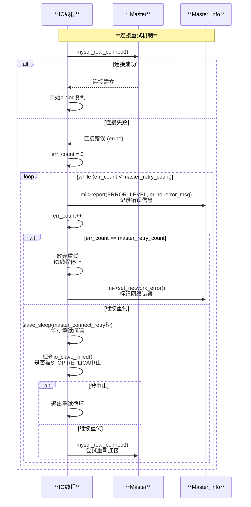

### 12.2 Binlog读取和心跳参数

| 参数 | 默认值 | 范围 | 说明 | 源码位置 |
|------|-------|------|------|---------|
| `master_heartbeat_period` | replica_net_timeout/2 | 0-4294967 | 心跳间隔（秒），0表示禁用 | `sql/rpl_mi.h:heartbeat` |
| `replica_max_allowed_packet` | 1GB | 1024-1GB | IO线程接收的最大packet大小 | `sql/rpl_replica.cc:8436` |
| `slave_skip_errors` | OFF | OFF / error_code_list / ALL | 跳过的错误代码列表 | `sql/sys_vars.cc:6743` |

**心跳机制时序图**:

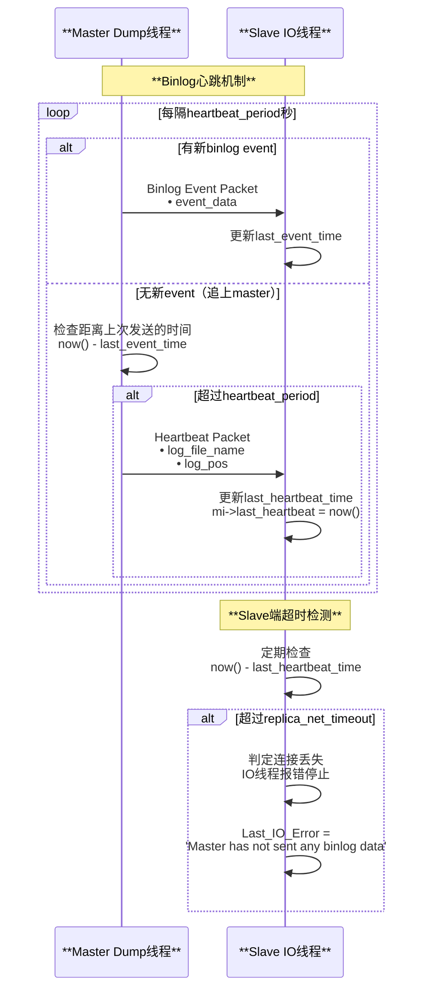

### 12.3 SQL线程执行参数

| 参数 | 默认值 | 范围 | 说明 | 源码位置 |
|------|-------|------|------|---------|
| `replica_transaction_retries` | 10 | 0-ULONG_MAX | 事务因死锁等临时错误时的重试次数 | `sql/sys_vars.cc:6835` |
| `replica_parallel_workers` | 4 | 0-1024 | MTS并行worker线程数 | `sql/sys_vars.cc:6846` |
| `replica_parallel_type` | LOGICAL_CLOCK | DATABASE / LOGICAL_CLOCK | MTS并行策略 | `sql/sys_vars.cc` |
| `replica_preserve_commit_order` | ON | ON/OFF | 是否保持主库提交顺序 | `sql/sys_vars.cc` |
| `replica_pending_jobs_size_max` | 128MB | 1024-16EB | worker队列最大大小 | `sql/sys_vars.cc` |
| `sql_replica_skip_counter` | 0 | 0-UINT_MAX | 跳过的event数量（非GTID模式） | `sql/sys_vars.cc:6734` |

**事务重试机制**:

```mermaid
sequenceDiagram
    participant WORKER as **Worker线程**
    participant INNODB as **InnoDB引擎**
    participant CERTIFIER as **Certifier**

    Note over WORKER,CERTIFIER: **事务执行与重试**

    WORKER->>WORKER: 从jobs队列获取事务
    WORKER->>INNODB: BEGIN
    
    loop 尝试执行事务
        WORKER->>INNODB: 执行SQL语句<br/>UPDATE/INSERT/DELETE
        
        alt 执行成功
            WORKER->>INNODB: COMMIT
            INNODB-->>WORKER: 提交成功
            WORKER->>WORKER: 更新checkpoint
        else 临时错误（死锁、锁等待超时）
            INNODB-->>WORKER: 错误码 (ER_LOCK_DEADLOCK等)
            WORKER->>WORKER: retry_count++
            
            alt retry_count < replica_transaction_retries
                WORKER->>INNODB: ROLLBACK
                WORKER->>WORKER: 短暂延迟<br/>避免立即重试
                WORKER->>WORKER: 重新开始事务
            else 达到最大重试次数
                WORKER->>WORKER: 记录错误<br/>SQL线程停止
                WORKER->>CERTIFIER: 报告失败
            end
        else 永久性错误（主键冲突、数据类型错误）
            INNODB-->>WORKER: 错误码
            WORKER->>WORKER: 不重试<br/>SQL线程停止
        end
    end
```

### 12.4 CHANGE REPLICATION SOURCE 完整时序图

```mermaid
sequenceDiagram
    participant CLIENT as **客户端**
    participant CMD as **change_master_cmd()**
    participant CHANGE as **change_master()**
    participant MI as **Master_info**
    participant RLI as **Relay_log_info**
    participant REPO as **Repository表**

    Note over CLIENT,REPO: **CHANGE REPLICATION SOURCE完整流程**

    CLIENT->>CMD: CHANGE REPLICATION SOURCE TO<br/>MASTER_HOST='10.0.0.1',<br/>MASTER_PORT=3306,<br/>MASTER_USER='repl',<br/>MASTER_PASSWORD='pwd',<br/>MASTER_LOG_FILE='mysql-bin.000005',<br/>MASTER_LOG_POS=12345,<br/>MASTER_CONNECT_RETRY=60,<br/>MASTER_RETRY_COUNT=10
    
    CMD->>CMD: channel_map.wrlock()<br/>写锁定channel map
    
    CMD->>CMD: 检查is_slave_configured()
    
    alt 复制未配置
        CMD-->>CLIENT: ERROR: Replica not configured
    end
    
    alt GROUP_REPLICATION channel
        CMD->>CMD: 检查channel名称
        CMD->>CMD: 检查GR是否运行
        
        alt GR运行中
            CMD-->>CLIENT: ERROR: Cannot change while GR running
        end
    end
    
    CMD->>CMD: 获取或创建channel<br/>get_mi(channel_name)
    
    CMD->>CHANGE: change_master(thd, mi, lex_mi)
    
    Note over CHANGE: **验证参数**
    
    alt 同时设置FILE+POS和AUTO_POSITION
        CHANGE-->>CLIENT: ERROR: Cannot specify both
    end
    
    alt MASTER_AUTO_POSITION=1 且 gtid_mode!=ON
        CHANGE-->>CLIENT: ERROR: Requires gtid_mode=ON
    end
    
    Note over CHANGE: **检查复制线程状态**
    
    CHANGE->>MI: lock_slave_threads(mi)
    CHANGE->>MI: init_thread_mask()
    
    alt IO线程或SQL线程正在运行
        alt 修改连接参数或位置
            CHANGE-->>CLIENT: ERROR: Replica must be stopped
        end
    end
    
    Note over CHANGE: **更新Master_info配置**
    
    alt 修改连接信息
        CHANGE->>MI: mi->host = new_host
        CHANGE->>MI: mi->port = new_port
        CHANGE->>MI: mi->user = new_user
        CHANGE->>MI: mi->password = new_password
    end
    
    alt 修改SSL配置
        CHANGE->>MI: mi->ssl = 1
        CHANGE->>MI: mi->ssl_ca = ssl_ca_path
        CHANGE->>MI: mi->ssl_cert = ssl_cert_path
    end
    
    alt 修改重试参数
        CHANGE->>MI: mi->connect_retry = master_connect_retry
        CHANGE->>MI: mi->retry_count = master_retry_count
    end
    
    alt 修改binlog位置（FILE+POS模式）
        CHANGE->>MI: mi->set_master_log_name(log_file)
        CHANGE->>MI: mi->set_master_log_pos(log_pos)
        
        Note over RLI: **清理relay log（如果位置改变）**
        CHANGE->>RLI: purge_relay_logs(thd)<br/>删除旧的relay logs
        CHANGE->>RLI: rli->set_group_master_log_name('')
        CHANGE->>RLI: rli->set_group_master_log_pos(0)
        CHANGE->>RLI: rli->set_group_relay_log_name('')
        CHANGE->>RLI: rli->set_group_relay_log_pos(0)
    end
    
    alt 启用AUTO_POSITION（GTID模式）
        CHANGE->>MI: mi->set_auto_position(true)
        CHANGE->>MI: 清除FILE+POS信息
    end
    
    Note over REPO: **持久化到Repository**
    
    CHANGE->>MI: mi->flush_info(true)
    MI->>REPO: 更新mysql.slave_master_info<br/>• Host, Port, User<br/>• Master_log_name, Master_log_pos<br/>• Connect_retry, Retry_count<br/>• Ssl_*等
    
    CHANGE->>RLI: rli->flush_info(true)
    RLI->>REPO: 更新mysql.slave_relay_log_info<br/>• Master_log_name, Master_log_pos<br/>• Sql_delay等
    
    CHANGE->>MI: unlock_slave_threads(mi)
    CHANGE->>CMD: 返回成功
    CMD->>CMD: channel_map.unlock()
    CMD-->>CLIENT: Query OK
```

### 12.5 复制位置和延迟参数

| 参数 | 默认值 | 说明 | 设置方式 |
|------|-------|------|---------|
| `SOURCE_LOG_FILE` | - | 开始读取的主库binlog文件名 | CHANGE REPLICATION SOURCE TO SOURCE_LOG_FILE='mysql-bin.000003' |
| `SOURCE_LOG_POS` | - | 开始读取的主库binlog位置 | CHANGE REPLICATION SOURCE TO SOURCE_LOG_POS=12345 |
| `RELAY_LOG_FILE` | - | SQL线程开始执行的relay log文件 | CHANGE REPLICATION SOURCE TO RELAY_LOG_FILE='relay-log.000002' |
| `RELAY_LOG_POS` | - | SQL线程开始执行的relay log位置 | CHANGE REPLICATION SOURCE TO RELAY_LOG_POS=6789 |
| `SOURCE_AUTO_POSITION` | 0 | 启用GTID自动定位 | CHANGE REPLICATION SOURCE TO SOURCE_AUTO_POSITION=1 |
| `SOURCE_DELAY` | 0 | SQL线程延迟执行（秒） | CHANGE REPLICATION SOURCE TO SOURCE_DELAY=3600 |

**SOURCE_DELAY延迟复制实现**:

```mermaid
sequenceDiagram
    participant COORD as **Coordinator**
    participant QUEUE as **Event队列**
    participant WORKER as **Worker线程**

    Note over COORD,WORKER: **延迟复制机制 (SOURCE_DELAY)**

    COORD->>QUEUE: 从relay log读取event
    QUEUE->>QUEUE: 读取event的timestamp<br/>original_commit_timestamp
    
    QUEUE->>QUEUE: 计算延迟时间<br/>delay_until = original_timestamp + SOURCE_DELAY
    
    alt 当前时间 < delay_until
        QUEUE->>QUEUE: 等待至delay_until<br/>sleep(delay_until - now())
        
        loop 等待期间
            QUEUE->>QUEUE: 检查是否被STOP REPLICA中止
            
            alt 被中止
                QUEUE->>QUEUE: 退出等待
            end
        end
    end
    
    QUEUE->>WORKER: 分发event给worker<br/>现在可以执行了
    WORKER->>WORKER: 执行event<br/>apply_event()
```

MySQL MTS通过多线程并行复制，显著提升了复制性能，是高可用架构的重要组成部分。以上补充了详细的命令执行流程、MySQL复制协议细节、以及完整的参数说明和实现机制。
