# MySQL Group Replication RPC协议深度解析

## 概述

本文档专门深入解析MySQL Group Replication使用的RPC（Remote Procedure Call）协议，包括GCS (Group Communication System)架构、XCom Paxos协议、消息格式和成员间通信机制。

**基于源码**: `plugin/group_replication/libmysqlgcs/`, `plugin/group_replication/src/`

---

## 第一部分：GCS RPC协议栈架构

### 1.1 整体架构

**源码位置**: `plugin/group_replication/libmysqlgcs/include/mysql/gcs/gcs_interface.h`

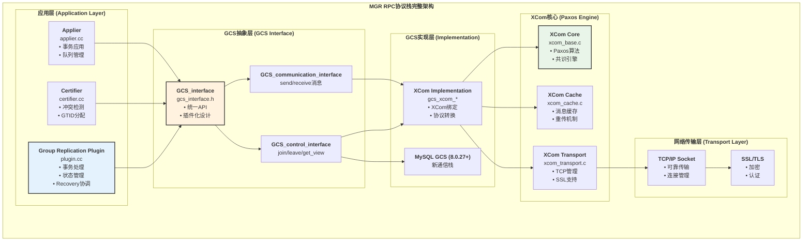

### 1.2 GCS接口层模块

| 模块 | 源码文件 | 功能 | 关键API |
|------|---------|------|---------|
| **Control Interface** | `gcs_control_interface.h` | 组成员管理 | `join()`, `leave()`, `belongs_to_group()` |
| **Communication Interface** | `gcs_communication_interface.h` | 消息收发 | `send_message()`, `add_event_listener()` |
| **Group Management Interface** | `gcs_group_management_interface.h` | 组配置管理 | `get_peers()`, `get_view()` |
| **Statistics Interface** | `gcs_statistics_interface.h` | 统计信息 | `get_stats()` |

---

## 第二部分：XCom Paxos协议详解

### 2.1 XCom消息类型

**源码位置**: `plugin/group_replication/libmysqlgcs/src/bindings/xcom/xcom/pax_msg.h`

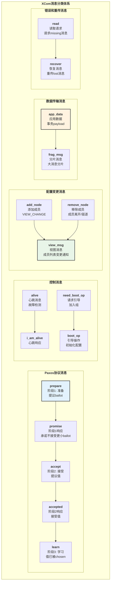

### 2.2 Paxos消息格式

**源码位置**: `plugin/group_replication/libmysqlgcs/src/bindings/xcom/xcom/pax_msg.h:pax_msg`

```text
pax_msg结构（Paxos消息）:
+----------------------+----------------+------------------------------------+
| 字段                 | 类型           | 说明                              |
+----------------------+----------------+------------------------------------+
| op                   | pax_op         | 消息类型(prepare/accept/learn等)  |
| synode               | synode_no      | Synode编号(epoch:msgno:node)      |
| proposal             | ballot         | Ballot编号(cnt:node)              |
| a                    | pax_msg*       | 接受阶段的值指针                  |
| from                 | node_no        | 发送方节点编号                    |
| to                   | node_no        | 接收方节点编号                    |
| force_delivery       | int            | 强制投递标志                      |
| refcnt               | int            | 引用计数                          |
| msg_type             | pax_msg_type   | 消息业务类型                      |
| max_synode           | synode_no      | 最大已知synode                    |
| delivered_msg        | synode_no      | 已投递消息编号                    |
| app_data             | app_data_ptr   | 应用数据指针                      |
| cli_err              | int            | 客户端错误码                      |
+----------------------+----------------+------------------------------------+

synode_no结构（Synode编号）:
+----------------------+----------------+------------------------------------+
| 字段                 | 类型           | 说明                              |
+----------------------+----------------+------------------------------------+
| group_id             | uint32_t       | 组ID（epoch编号）                 |
| msgno                | uint64_t       | 消息序号（单调递增）              |
| node                 | node_no        | 节点编号（提议者）                |
+----------------------+----------------+------------------------------------+

ballot结构（Ballot编号）:
+----------------------+----------------+------------------------------------+
| 字段                 | 类型           | 说明                              |
+----------------------+----------------+------------------------------------+
| cnt                  | int32_t        | 轮次计数（提议编号）              |
| node                 | node_no        | 节点编号（提议者）                |
+----------------------+----------------+------------------------------------+
```

### 2.3 完整Paxos协议时序

```mermaid
sequenceDiagram
    participant A as **节点A (Proposer)**
    participant B as **节点B (Acceptor)**
    participant C as **节点C (Acceptor)**
    participant L as **所有节点 (Learners)**

    Note over A,L: **XCom Paxos完整协议流程**

    Note over A: **提议者A接收到应用数据**
    A->>A: 接收app_data<br/>事务payload
    A->>A: 分配synode<br/>synode = {epoch=5, msgno=1001, node=A}
    A->>A: 生成ballot<br/>ballot = {cnt=1, node=A}
    
    Note over A,C: **阶段1: Prepare**
    
    A->>A: 构造prepare消息<br/>pax_msg{<br/>  op=prepare,<br/>  synode={5,1001,A},<br/>  proposal={1,A}<br/>}
    
    par 并行发送
        A->>B: prepare消息
        A->>C: prepare消息
    end
    
    B->>B: 检查proposal<br/>proposal > last_promised?
    
    alt proposal大于last_promised
        B->>B: 记录promised_ballot = {1,A}
        B->>B: 返回已接受的值(如果有)<br/>accepted_ballot, accepted_value
        B->>A: promise消息<br/>pax_msg{<br/>  op=promise,<br/>  synode={5,1001,A},<br/>  a=previous_accepted<br/>}
    else proposal不大于last_promised
        B->>A: nack消息<br/>拒绝prepare
    end
    
    C->>C: 检查并promise
    C->>A: promise消息
    
    Note over A: **达到多数派（2/3）**
    
    A->>A: 收到2个promise<br/>检查返回的accepted_value
    
    alt 有accepted_value
        A->>A: 选择最大ballot的value<br/>value = highest_ballot_value
    else 无accepted_value
        A->>A: 使用自己的value<br/>value = app_data
    end
    
    Note over A,C: **阶段2: Accept**
    
    A->>A: 构造accept消息<br/>pax_msg{<br/>  op=accept,<br/>  synode={5,1001,A},<br/>  proposal={1,A},<br/>  a->app_data=value<br/>}
    
    par 并行发送
        A->>B: accept消息
        A->>C: accept消息
    end
    
    B->>B: 检查proposal<br/>proposal >= promised_ballot?
    
    alt proposal有效
        B->>B: 持久化<br/>accepted_ballot = {1,A}<br/>accepted_value = value
        B->>B: 写入XCom缓存<br/>xcom_cache[synode] = value
        B->>A: accepted消息<br/>pax_msg{<br/>  op=accepted,<br/>  synode={5,1001,A}<br/>}
    else proposal无效
        B->>A: nack消息<br/>拒绝accept
    end
    
    C->>C: 持久化accepted
    C->>A: accepted消息
    
    Note over A: **达到多数派（2/3）**
    
    A->>A: 值已被chosen<br/>synode={5,1001,A}<br/>的值达成共识
    
    Note over A,L: **阶段3: Learn**
    
    A->>A: 构造learn消息<br/>pax_msg{<br/>  op=learn,<br/>  synode={5,1001,A},<br/>  a->app_data=value<br/>}
    
    par 广播learn
        A->>A: 投递给本地应用
        A->>B: learn消息
        A->>C: learn消息
    end
    
    L->>L: 按synode顺序投递<br/>确保FIFO顺序
    L->>L: 调用GCS回调<br/>on_message_received(app_data)
    
    Note over L: **应用层处理**
    L->>L: Certifier检查冲突<br/>Applier应用事务
```

---

## 第三部分：成员加入和离开RPC流程

### 3.1 成员加入RPC详解

**源码位置**: `plugin/group_replication/libmysqlgcs/src/bindings/xcom/gcs_xcom_control_interface.cc:join()`

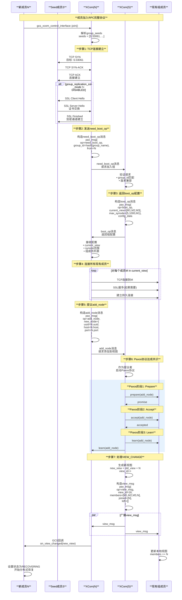

### 3.2 成员离开RPC详解

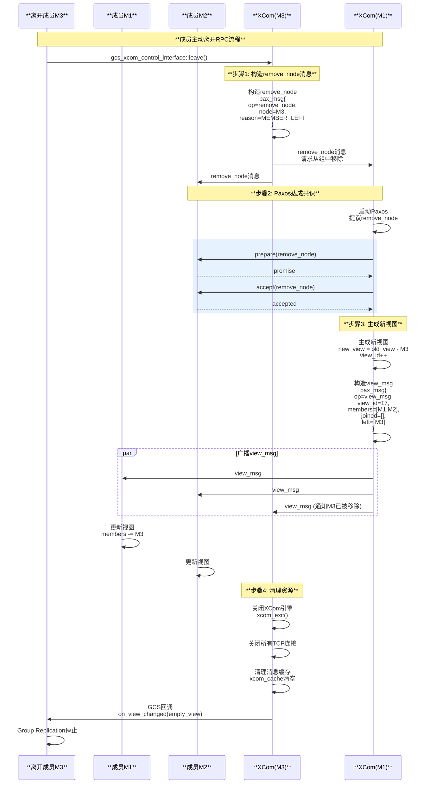

---

## 第四部分：心跳和故障检测RPC

### 4.1 心跳机制

**源码位置**: `plugin/group_replication/libmysqlgcs/src/bindings/xcom/xcom/xcom_base.c`

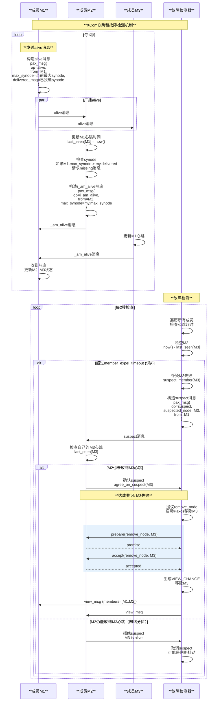

### 4.2 消息重传机制

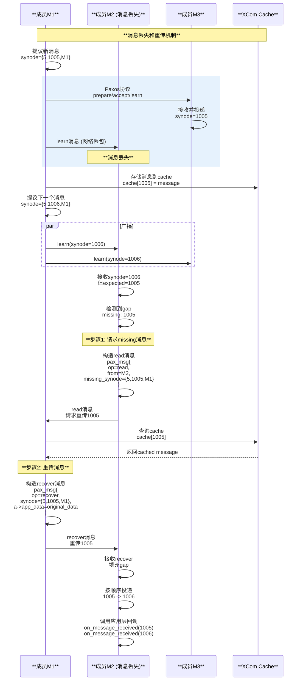

---

## 第五部分：XCom缓存和性能优化

### 5.1 XCom Cache架构

**源码位置**: `plugin/group_replication/libmysqlgcs/src/bindings/xcom/xcom/xcom_cache.c`

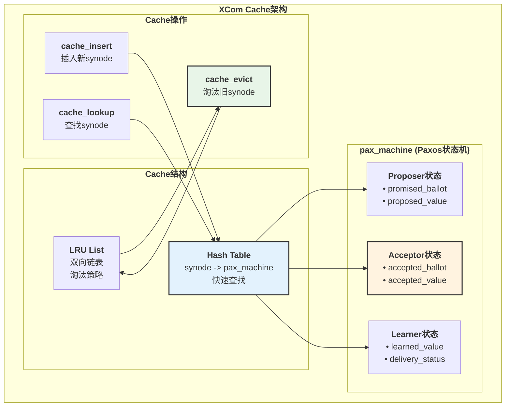

### 5.2 Cache生命周期

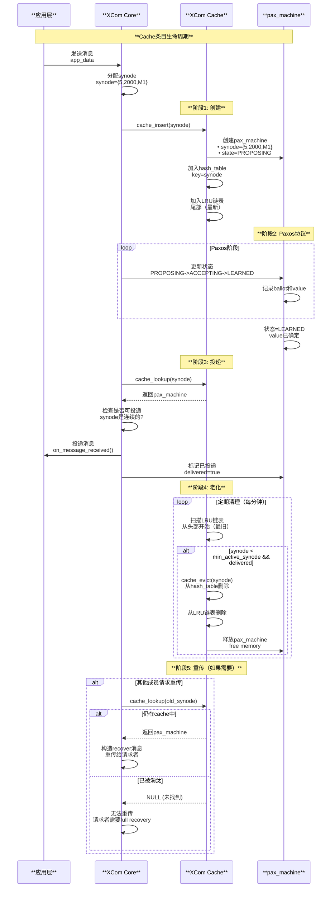

---

## 总结

### MGR RPC协议核心特点

**协议栈分层**:

- **应用层**: Group Replication插件，业务逻辑
- **GCS层**: 统一抽象接口，隔离实现细节
- **XCom层**: Paxos共识算法，保证一致性
- **传输层**: TCP/SSL，可靠加密通信

**Paxos协议**:

- **三阶段**: Prepare → Accept → Learn
- **多数派**: 至少(N/2+1)个节点同意
- **持久化**: accepted值持久化到XCom cache
- **FIFO保证**: 按synode顺序投递消息

**故障检测**:

- **心跳机制**: alive/i_am_alive消息，每秒一次
- **超时驱逐**: member_expel_timeout（默认5秒）
- **分区处理**: unreachable_majority_timeout，少数派自动降级

**性能优化**:

- **XCom Cache**: Hash table + LRU，快速查找和淘汰
- **消息重传**: 支持gap填充，自动恢复丢失消息
- **并行处理**: 多线程处理Paxos消息

**可靠性保证**:

- **消息持久化**: accepted值持久化
- **自动恢复**: 通过read/recover机制
- **视图一致性**: VIEW_CHANGE通过Paxos达成共识

MySQL Group Replication的RPC协议通过XCom Paxos实现了分布式共识，提供了高可用、自动故障转移和强一致性保证。

---

## 第六部分：RPC协议定义和序列化机制

### 6.1 XDR (External Data Representation) 协议定义

**源码位置**: `plugin/group_replication/libmysqlgcs/src/bindings/xcom/xcom/xcom_vp.x`

MGR使用**XDR**（External Data Representation）作为RPC的IDL（Interface Definition Language）和序列化协议。

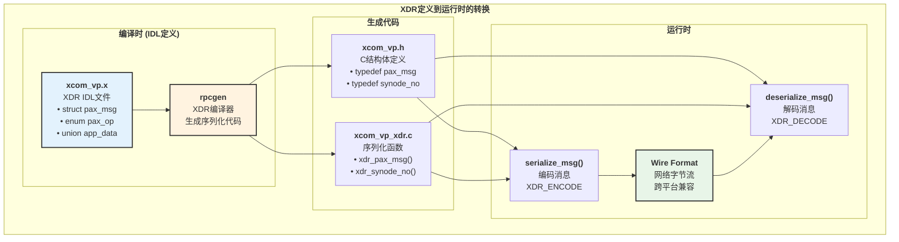

### 6.2 pax_msg结构XDR定义

**源码**: `plugin/group_replication/libmysqlgcs/src/bindings/xcom/xcom/xcom_vp.x:506-569`

```c
// XDR IDL定义
struct pax_msg {
  node_no to;             /* 目标节点编号 */
  node_no from;           /* 源节点编号 */
  uint32_t group_id;      /* 组ID（epoch） */
  synode_no max_synode;   /* Gossip：最大已知synode */
  start_t start_type;     /* 启动类型（已废弃） */
  ballot reply_to;        /* 回复给哪个ballot */
  ballot proposal;        /* 提议编号（Paxos ballot） */
  pax_op op;              /* 操作码：prepare/accept/learn等 */
  synode_no synode;       /* 消息编号（Paxos实例） */
  pax_msg_type msg_type;  /* 消息类型：normal/noop */
  bit_set *receivers;     /* 接收者位图 */
  app_data *a;            /* 应用数据payload */
  snapshot *snap;         /* 快照（未使用） */
  gcs_snapshot *gcs_snap; /* GCS快照（gcs_snapshot_op时） */
  client_reply_code cli_err; /* 客户端错误码 */
  bool force_delivery;    /* 强制投递标志 */
  int32_t refcnt;         /* 引用计数 */
  synode_no delivered_msg;/* Gossip：最后投递的消息 */
  xcom_event_horizon event_horizon; /* 事件视界 */
  synode_app_data_array requested_synode_app_data; /* 请求的synode数据 */
  reply_data *rd;         /* 回复数据 */
};
```

### 6.3 消息序列化格式

**源码位置**: `plugin/group_replication/libmysqlgcs/src/bindings/xcom/xcom/xcom_transport.h:35-52`

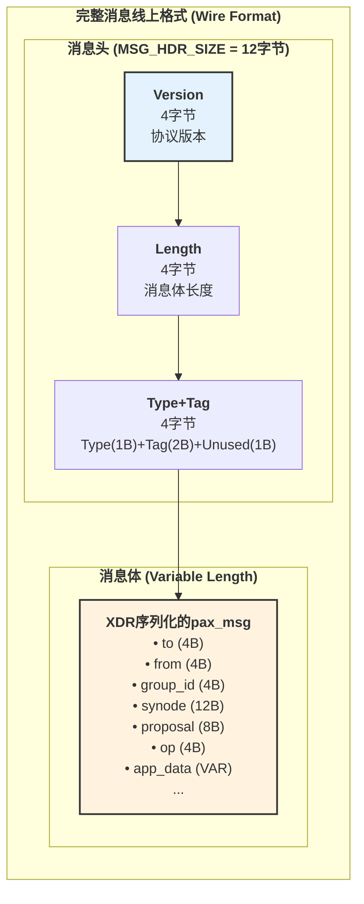

**消息头字段详解**:

```text
消息头布局 (12字节):
+-------------------+--------+--------+------------------------------------+
| 字段              | 偏移   | 大小   | 说明                              |
+-------------------+--------+--------+------------------------------------+
| version           | 0      | 4B     | XCom协议版本(x_1_0..x_1_9)        |
| length            | 4      | 4B     | 消息体长度（不包括头部）          |
| type              | 8      | 1B     | 消息类型:                         |
|                   |        |        | • 0=x_normal (正常消息)           |
|                   |        |        | • 1=x_version_req (版本协商请求)  |
|                   |        |        | • 2=x_version_reply (版本协商响应)|
| tag               | 9      | 2B     | 标签（协商时用于匹配请求/响应）   |
| unused            | 11     | 1B     | 保留字段                          |
+-------------------+--------+--------+------------------------------------+

示例（假设pax_msg序列化后200字节）:
总长度 = 12 (header) + 200 (body) = 212字节

字节流:
[0x00 0x00 0x01 0x09] <- version = x_1_9 (9)
[0x00 0x00 0x00 0xC8] <- length = 200 (0xC8)
[0x00 0x02 0x9A 0x00] <- type=0, tag=666(0x029A), unused=0
[... 200字节XDR序列化的pax_msg ...]
```

### 6.4 序列化和反序列化流程

**源码位置**: `plugin/group_replication/libmysqlgcs/src/bindings/xcom/xcom/xcom_transport.cc:549-570`

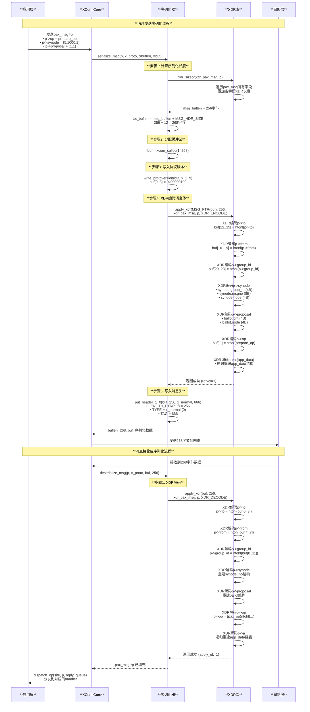

### 6.5 XDR多版本支持

**源码位置**: `plugin/group_replication/libmysqlgcs/src/bindings/xcom/xcom/xcom_transport.cc:536-556`

MGR支持多个XCom协议版本，实现向后兼容：

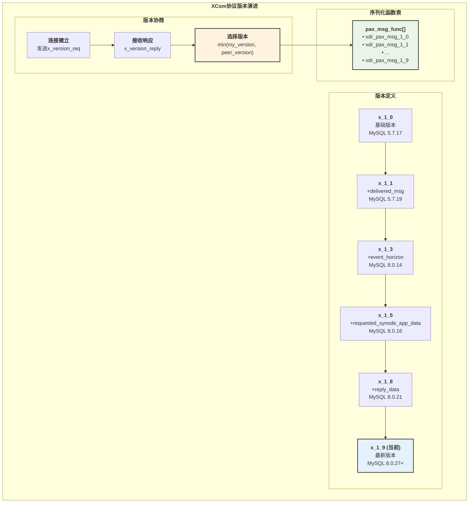

**版本协商时序**:

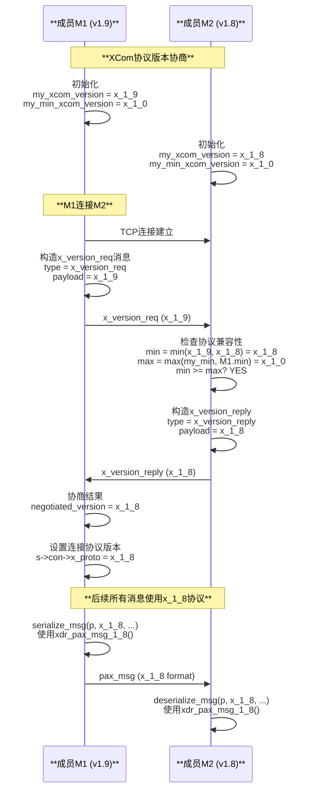

---

## 第七部分：RPC调用机制

### 7.1 消息发送调用链

**源码位置**: `plugin/group_replication/libmysqlgcs/src/bindings/xcom/xcom/xcom_base.cc:1596-1622`

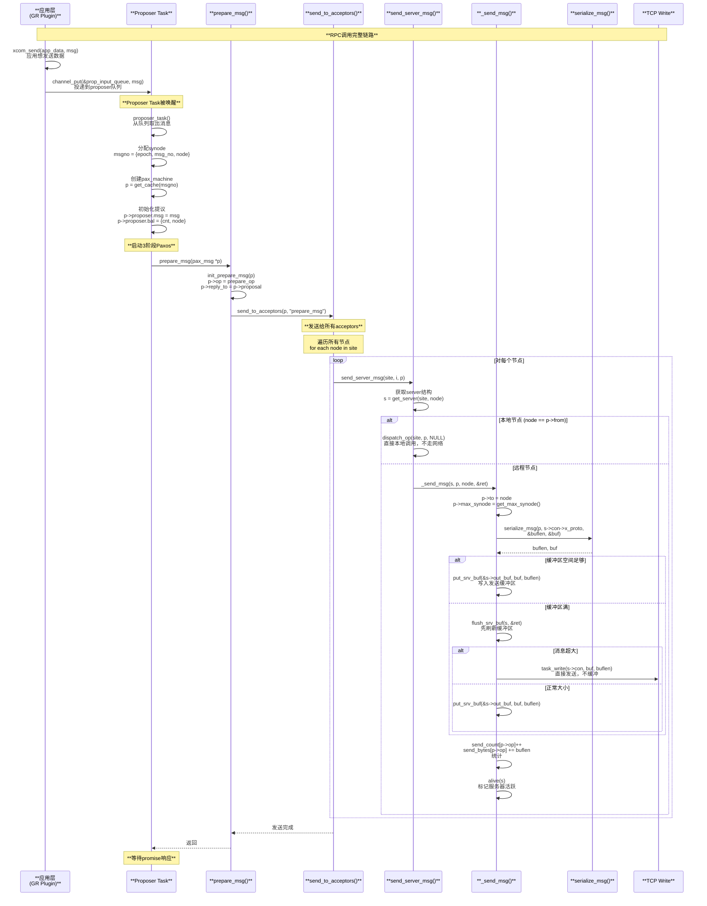

### 7.2 消息接收和分发

**源码位置**: `plugin/group_replication/libmysqlgcs/src/bindings/xcom/xcom/xcom_base.cc:6425-6457`

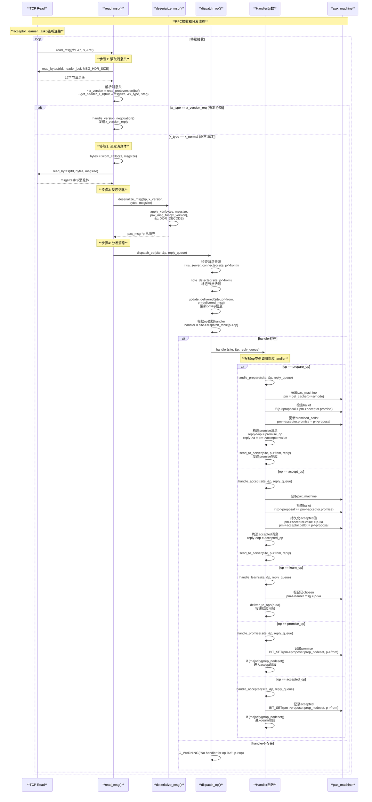

### 7.3 Dispatch Table（分发表）

**源码位置**: `plugin/group_replication/libmysqlgcs/src/bindings/xcom/xcom/xcom_base.cc:6374-6400`

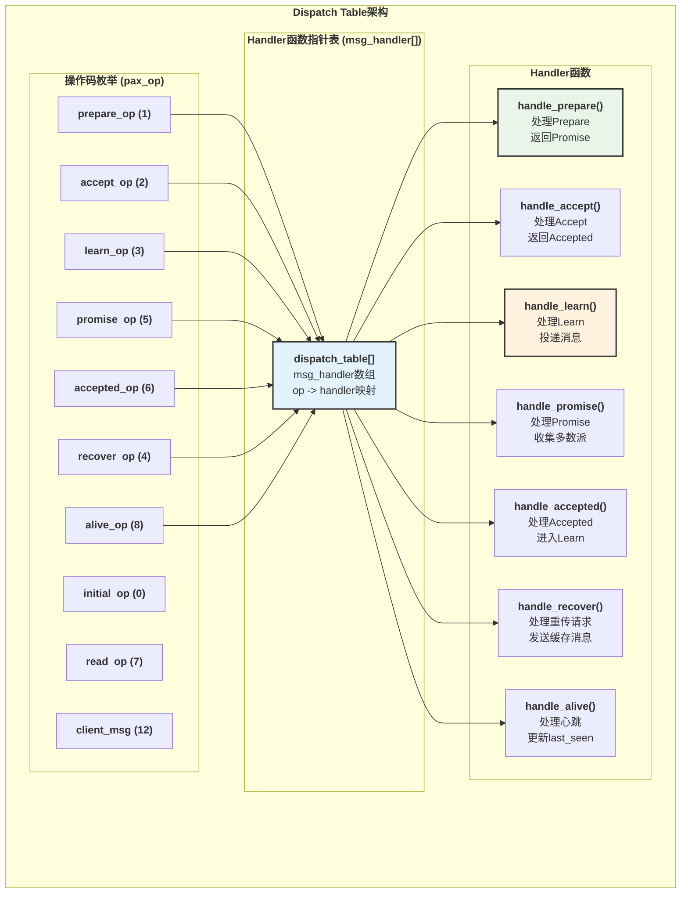

**Dispatch Table初始化**:

```c
// 源码: plugin/group_replication/libmysqlgcs/src/bindings/xcom/xcom/xcom_base.cc
static msg_handler dispatch_table[LAST_OP] = {
    [initial_op] = handle_initial,
    [prepare_op] = handle_prepare,
    [ack_prepare_op] = handle_ack_prepare,
    [accept_op] = handle_accept,
    [ack_accept_op] = handle_ack_accept,
    [learn_op] = handle_learn,
    [recover_learn_op] = handle_recover_learn,
    [multi_noop_learn_op] = handle_multi_noop_learn,
    [promise_op] = handle_promise,
    [accepted_op] = handle_accepted,
    [read_op] = handle_read,
    [recover_op] = handle_recover,
    [alive_op] = handle_alive,
    [i_am_alive_op] = handle_i_am_alive,
    [need_boot_op] = handle_need_boot,
    [boot_op] = handle_boot,
    [client_msg] = handle_client_msg,
    [add_node_op] = handle_add_node,
    [remove_node_op] = handle_remove_node,
    [view_msg] = handle_view_msg,
    [synode_request] = handle_synode_request,
    [synode_allocated] = handle_synode_allocated,
    ...
};
```

---

## 第八部分：RPC完整交互原理

### 8.1 同步RPC vs 异步RPC

MGR XCom使用**异步RPC**模型，基于协程（Task）实现非阻塞通信。

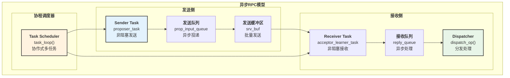

### 8.2 完整Paxos RPC交互示例

以一个完整的3阶段Paxos为例，展示RPC交互的全貌：

```mermaid
sequenceDiagram
    participant APP as **应用层**
    participant TASK_A as **Task A<br/>(proposer_task)**
    participant SERIAL_A as **序列化器A**
    participant NET_A as **网络A->B**
    participant NET_B as **网络B**
    participant RECV_B as **Task B<br/>(acceptor_task)**
    participant DESERIAL_B as **反序列化器B**
    participant HANDLER_B as **Handler B**
    participant SERIAL_B as **序列化器B**
    participant NET_B2A as **网络B->A**
    participant RECV_A as **接收器A**

    Note over APP,RECV_A: **完整Paxos RPC交互（3阶段）**

    rect rgb(230, 242, 253)
        Note over APP,RECV_A: **阶段1: Prepare RPC**
        
        APP->>TASK_A: xcom_send(app_data)<br/>客户端请求
        
        TASK_A->>TASK_A: 分配synode<br/>synode = {5, 1000, A}
        TASK_A->>TASK_A: 构造prepare消息<br/>pax_msg{<br/>  op=prepare_op,<br/>  synode={5,1000,A},<br/>  proposal={1,A}<br/>}
        
        TASK_A->>SERIAL_A: serialize_msg(prepare_msg)
        SERIAL_A->>SERIAL_A: XDR编码<br/>• header: version+length+type<br/>• body: XDR(pax_msg)
        SERIAL_A-->>TASK_A: buf[268字节]
        
        TASK_A->>NET_A: task_write(buf, 268)
        NET_A->>NET_B: TCP传输
        
        RECV_B->>NET_B: task_read(buf, 268)
        RECV_B->>DESERIAL_B: deserialize_msg(buf)
        DESERIAL_B->>DESERIAL_B: XDR解码<br/>重建pax_msg结构
        DESERIAL_B-->>RECV_B: pax_msg *p
        
        RECV_B->>HANDLER_B: dispatch_op(p)<br/>调用handle_prepare()
        
        HANDLER_B->>HANDLER_B: 获取pax_machine<br/>pm = get_cache({5,1000,A})
        HANDLER_B->>HANDLER_B: 检查ballot<br/>p->proposal > pm->acceptor.promise?
        
        alt ballot有效
            HANDLER_B->>HANDLER_B: 更新promise<br/>pm->acceptor.promise = {1,A}
            HANDLER_B->>HANDLER_B: 构造promise消息<br/>pax_msg{<br/>  op=promise_op,<br/>  synode={5,1000,A},<br/>  reply_to={1,A},<br/>  a=pm->acceptor.value<br/>}
        else ballot无效
            HANDLER_B->>HANDLER_B: 构造nack消息<br/>拒绝prepare
        end
        
        HANDLER_B->>SERIAL_B: serialize_msg(promise_msg)
        SERIAL_B-->>HANDLER_B: buf[200字节]
        
        HANDLER_B->>NET_B2A: task_write(buf, 200)
        NET_B2A->>NET_A: TCP传输
        
        RECV_A->>NET_A: task_read(buf, 200)
        RECV_A->>RECV_A: deserialize_msg(buf)
        RECV_A->>TASK_A: dispatch_op(promise_msg)
        
        TASK_A->>TASK_A: handle_promise()<br/>BIT_SET(prep_nodeset, B)
        TASK_A->>TASK_A: 检查多数派<br/>count(prep_nodeset) >= majority?
    end
    
    rect rgb(255, 243, 224)
        Note over APP,RECV_A: **阶段2: Accept RPC**
        
        TASK_A->>TASK_A: 多数派达成<br/>进入Accept阶段
        TASK_A->>TASK_A: 构造accept消息<br/>pax_msg{<br/>  op=accept_op,<br/>  synode={5,1000,A},<br/>  proposal={1,A},<br/>  a=app_data<br/>}
        
        TASK_A->>SERIAL_A: serialize_msg(accept_msg)
        SERIAL_A-->>TASK_A: buf[512字节]
        
        TASK_A->>NET_A: task_write(buf, 512)
        NET_A->>NET_B: TCP传输
        
        RECV_B->>NET_B: task_read(buf, 512)
        RECV_B->>DESERIAL_B: deserialize_msg(buf)
        DESERIAL_B-->>RECV_B: pax_msg *p
        
        RECV_B->>HANDLER_B: dispatch_op(p)<br/>调用handle_accept()
        
        HANDLER_B->>HANDLER_B: 获取pax_machine
        HANDLER_B->>HANDLER_B: 检查ballot<br/>p->proposal >= pm->acceptor.promise?
        
        alt ballot有效
            HANDLER_B->>HANDLER_B: 持久化accepted值<br/>pm->acceptor.value = p->a<br/>pm->acceptor.ballot = {1,A}
            HANDLER_B->>HANDLER_B: 写入XCom Cache<br/>cache[{5,1000,A}] = p->a
            HANDLER_B->>HANDLER_B: 构造accepted消息<br/>pax_msg{<br/>  op=accepted_op,<br/>  synode={5,1000,A},<br/>  reply_to={1,A}<br/>}
        end
        
        HANDLER_B->>SERIAL_B: serialize_msg(accepted_msg)
        SERIAL_B-->>HANDLER_B: buf[180字节]
        
        HANDLER_B->>NET_B2A: task_write(buf, 180)
        NET_B2A->>NET_A: TCP传输
        
        RECV_A->>NET_A: task_read(buf, 180)
        RECV_A->>RECV_A: deserialize_msg(buf)
        RECV_A->>TASK_A: dispatch_op(accepted_msg)
        
        TASK_A->>TASK_A: handle_accepted()<br/>BIT_SET(prop_nodeset, B)
        TASK_A->>TASK_A: 检查多数派<br/>count(prop_nodeset) >= majority?
    end
    
    rect rgb(232, 245, 233)
        Note over APP,RECV_A: **阶段3: Learn RPC（广播）**
        
        TASK_A->>TASK_A: 多数派达成<br/>值已被chosen<br/>进入Learn阶段
        TASK_A->>TASK_A: 构造learn消息<br/>pax_msg{<br/>  op=learn_op,<br/>  synode={5,1000,A},<br/>  a=chosen_value<br/>}
        
        TASK_A->>SERIAL_A: serialize_msg(learn_msg)
        SERIAL_A-->>TASK_A: buf[500字节]
        
        par 广播learn到所有节点
            TASK_A->>NET_A: broadcast(buf, 500)
            NET_A->>NET_B: TCP传输
        end
        
        RECV_B->>NET_B: task_read(buf, 500)
        RECV_B->>DESERIAL_B: deserialize_msg(buf)
        DESERIAL_B-->>RECV_B: pax_msg *p
        
        RECV_B->>HANDLER_B: dispatch_op(p)<br/>调用handle_learn()
        
        HANDLER_B->>HANDLER_B: 标记已chosen<br/>pm->learner.msg = p->a
        HANDLER_B->>HANDLER_B: 检查投递条件<br/>synode是连续的?
        
        alt 可以投递
            HANDLER_B->>HANDLER_B: deliver_to_app(p->a)<br/>GCS回调on_message_received()
        else 存在gap
            HANDLER_B->>HANDLER_B: 缓存消息<br/>等待前序消息
        end
    end
```

### 8.3 RPC错误处理和重试

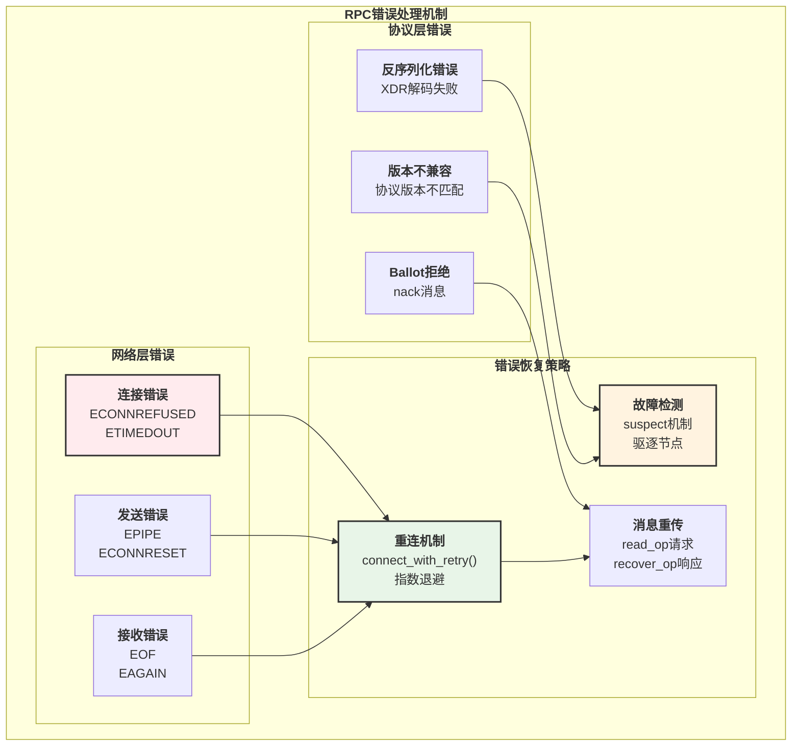

### 8.4 错误处理时序示例

```mermaid
sequenceDiagram
    participant A as **节点A**
    participant B as **节点B**
    participant NET as **网络**

    Note over A,NET: **场景1: 网络连接中断**

    A->>A: send_msg(prepare)
    A->>NET: TCP write
    
    Note over NET: **网络中断**
    
    NET--xB: 连接中断 (ECONNRESET)
    
    A->>A: 检测到错误<br/>errno = ECONNRESET
    A->>A: 标记连接失效<br/>s->con->fd = -1
    
    loop 重连尝试
        A->>A: sleep(1秒)<br/>等待重连间隔
        A->>NET: connect(B.host, B.port)
        
        alt 重连成功
            NET-->>A: 连接建立
            A->>A: 重建连接<br/>s->con->fd = new_fd
            A->>B: 重新发送prepare
        else 重连失败
            A->>A: 重试次数++
            
            alt 超过最大重试次数
                A->>A: 标记节点为SUSPECT<br/>suspect_member(B)
                A->>A: 广播SUSPECT消息
            end
        end
    end
    
    Note over A,NET: **场景2: 消息丢失**
    
    A->>B: learn(synode=1000)
    
    Note over NET: **消息在网络中丢失**
    
    A->>B: learn(synode=1001)
    B->>B: 接收synode=1001<br/>但expected=1000<br/>检测到gap
    
    B->>B: 构造read消息<br/>pax_msg{<br/>  op=read_op,<br/>  synode=1000<br/>}
    
    B->>A: read(synode=1000)<br/>请求重传
    
    A->>A: 查询XCom Cache<br/>cache[1000]
    
    alt 消息在cache中
        A->>A: 构造recover消息<br/>pax_msg{<br/>  op=recover_op,<br/>  synode=1000,<br/>  a=cached_data<br/>}
        A->>B: recover(synode=1000)
        B->>B: 填充gap<br/>投递1000和1001
    else 消息已被淘汰
        A->>B: 无法重传<br/>B需要full recovery
        B->>B: 启动recovery流程<br/>从其他节点同步
    end
```

---

## 第九部分：RPC底层网络和线程模型

### 9.1 网络传输层架构

**源码位置**: `plugin/group_replication/libmysqlgcs/src/bindings/xcom/xcom/xcom_transport.cc`

```mermaid
graph TB
    subgraph "<b>XCom网络传输架构</b>"
        subgraph "<b>连接管理</b>"
            SERVER_POOL["<b>Server Pool</b><br/>all_servers[]<br/>维护所有连接"]
            CONN_DESC["<b>connection_descriptor</b><br/>• fd<br/>• x_proto<br/>• ssl_fd"]
        end
        
        subgraph "<b>缓冲区管理</b>"
            SEND_BUF["<b>发送缓冲区</b><br/>srv_buf out_buf<br/>• 批量发送<br/>• 减少系统调用"]
            RECV_BUF["<b>接收缓冲区</b><br/>• 流式接收<br/>• 粘包处理"]
        end
        
        subgraph "<b>SSL/TLS支持</b>"
            SSL_CTX["<b>SSL Context</b><br/>• 证书验证<br/>• 加密套件"]
            SSL_CONN["<b>SSL Connection</b><br/>• SSL_read()<br/>• SSL_write()"]
        end
        
        subgraph "<b>协程IO</b>"
            TASK_READ["<b>task_read()</b><br/>非阻塞读<br/>协程yield"]
            TASK_WRITE["<b>task_write()</b><br/>非阻塞写<br/>协程yield"]
        end
    end
    
    SERVER_POOL --> CONN_DESC
    CONN_DESC --> SEND_BUF
    CONN_DESC --> RECV_BUF
    CONN_DESC --> SSL_CONN
    
    SSL_CTX --> SSL_CONN
    
    SEND_BUF --> TASK_WRITE
    RECV_BUF --> TASK_READ
    
    SSL_CONN --> TASK_READ
    SSL_CONN --> TASK_WRITE
    
    style SERVER_POOL fill:#e3f2fd,stroke:#333,stroke-width:2px
    style SEND_BUF fill:#fff3e0,stroke:#333,stroke-width:2px
    style TASK_READ fill:#e8f5e8,stroke:#333,stroke-width:2px
```

### 9.2 协程（Task）模型

XCom使用**协作式协程**（Cooperative Coroutine）实现异步IO，避免线程上下文切换开销。

```mermaid
graph TB
    subgraph "<b>XCom协程调度模型</b>"
        subgraph "<b>核心Task</b>"
            MAIN_TASK["<b>main_task</b><br/>XCom主循环"]
            PROP_TASK["<b>proposer_task</b><br/>处理客户端请求"]
            ACC_TASK["<b>acceptor_learner_task</b><br/>接收网络消息"]
            DET_TASK["<b>detector_task</b><br/>故障检测"]
            EXEC_TASK["<b>executor_task</b><br/>执行Paxos"]
        end
        
        subgraph "<b>任务调度器</b>"
            SCHEDULER["<b>task_loop()</b><br/>• 轮询所有task<br/>• 协作式调度<br/>• 无抢占"]
            TASK_QUEUE["<b>任务队列</b><br/>runnable tasks<br/>按优先级排序"]
        end
        
        subgraph "<b>同步原语</b>"
            CHANNEL["<b>Channel</b><br/>• 消息传递<br/>• 阻塞/唤醒"]
            WAIT["<b>task_wait()</b><br/>• yield控制权<br/>• 等待事件"]
            WAKEUP["<b>task_wakeup()</b><br/>• 唤醒task<br/>• 加入runnable队列"]
        end
    end
    
    SCHEDULER --> TASK_QUEUE
    TASK_QUEUE --> MAIN_TASK
    TASK_QUEUE --> PROP_TASK
    TASK_QUEUE --> ACC_TASK
    TASK_QUEUE --> DET_TASK
    TASK_QUEUE --> EXEC_TASK
    
    CHANNEL --> WAIT
    CHANNEL --> WAKEUP
    WAIT --> SCHEDULER
    WAKEUP --> SCHEDULER
    
    style SCHEDULER fill:#e3f2fd,stroke:#333,stroke-width:2px
    style CHANNEL fill:#fff3e0,stroke:#333,stroke-width:2px
    style TASK_QUEUE fill:#e8f5e8,stroke:#333,stroke-width:2px
```

### 9.3 协程调度时序

```mermaid
sequenceDiagram
    participant SCHED as **调度器<br/>(task_loop)**
    participant TASK_A as **Task A<br/>(proposer)**
    participant CHAN as **Channel**
    participant TASK_B as **Task B<br/>(acceptor)**

    Note over SCHED,TASK_B: **协程调度示例**

    loop task_loop()
        SCHED->>SCHED: 从runnable队列取出Task A
        
        SCHED->>TASK_A: 恢复执行<br/>从上次yield点继续
        
        TASK_A->>TASK_A: 执行代码<br/>构造pax_msg
        TASK_A->>CHAN: channel_put(&prop_queue, msg)<br/>投递消息
        
        CHAN->>CHAN: 将msg加入队列
        CHAN->>SCHED: task_wakeup(Task B)<br/>唤醒等待者
        
        TASK_A->>TASK_A: TASK_CALL(task_write(...))<br/>发起IO操作
        
        alt IO未完成
            TASK_A->>SCHED: yield控制权<br/>Task A进入waiting状态
            
            SCHED->>SCHED: Task A移出runnable队列<br/>加入waiting队列
        end
        
        SCHED->>SCHED: 从runnable队列取出Task B
        
        SCHED->>TASK_B: 恢复执行
        
        TASK_B->>CHAN: channel_get(&prop_queue, &msg)<br/>取出消息
        
        alt 队列为空
            TASK_B->>SCHED: yield控制权<br/>Task B进入waiting状态
        else 队列有消息
            CHAN-->>TASK_B: 返回msg
            TASK_B->>TASK_B: 处理消息<br/>dispatch_op(msg)
        end
        
        SCHED->>SCHED: 检查IO事件<br/>epoll/select
        
        alt Task A的IO完成
            SCHED->>SCHED: task_wakeup(Task A)<br/>移回runnable队列
        end
        
        SCHED->>SCHED: 下一轮调度
    end
```

### 9.4 发送缓冲区优化

```mermaid
graph TB
    subgraph "<b>发送缓冲区批量发送机制</b>"
        subgraph "<b>缓冲区结构 (srv_buf)</b>"
            BUF_DATA["<b>buf[]</b><br/>32KB固定缓冲区"]
            BUF_PTR["<b>n</b><br/>当前写入位置"]
            BUF_FREE["<b>free_space</b><br/>剩余空间"]
        end
        
        subgraph "<b>写入策略</b>"
            SMALL_MSG["<b>小消息</b><br/>< 剩余空间<br/>→ 写入缓冲区"]
            LARGE_MSG["<b>大消息</b><br/>> 缓冲区大小<br/>→ 直接发送"]
            BUF_FULL["<b>缓冲区满</b><br/>→ flush_srv_buf()"]
        end
        
        subgraph "<b>发送优化</b>"
            BATCH["<b>批量发送</b><br/>减少系统调用<br/>提高吞吐"]
            NAGLE["<b>Nagle算法</b><br/>TCP_NODELAY=0<br/>自动合并小包"]
        end
    end
    
    SMALL_MSG --> BUF_DATA
    BUF_DATA --> BUF_PTR
    BUF_PTR --> BUF_FREE
    
    BUF_FULL --> BATCH
    LARGE_MSG --> BATCH
    
    BATCH --> NAGLE
    
    style BUF_DATA fill:#e3f2fd,stroke:#333,stroke-width:2px
    style BATCH fill:#fff3e0,stroke:#333,stroke-width:2px
```

### 9.5 性能优化总结

**MGR RPC性能优化策略**:

1. **XDR序列化优化**:
   - 二进制编码，紧凑高效
   - 网络字节序，跨平台兼容
   - 零拷贝序列化（直接写入发送缓冲区）

2. **网络传输优化**:
   - 发送缓冲区批量发送，减少系统调用
   - SSL/TLS硬件加速（AES-NI）
   - TCP_NODELAY可配置

3. **协程异步IO**:
   - 单线程处理大量连接，避免线程切换
   - 协作式调度，无锁设计
   - epoll/kqueue高性能IO多路复用

4. **消息缓存**:
   - XCom Cache支持消息重传
   - Hash Table + LRU快速查找
   - 避免重复序列化

5. **Paxos优化**:
   - 2阶段Fast Paxos（无冲突场景）
   - Multi-Paxos（共享Prepare阶段）
   - Pipeline并发提议

**性能指标**（典型场景）:

| 指标 | 值 | 说明 |
|------|---|------|
| **消息延迟** | < 1ms | 本地网络，prepare->learn往返 |
| **吞吐量** | 10K+ TPS | 3节点组，小事务 |
| **序列化开销** | < 100μs | 1KB消息XDR编码 |
| **内存开销** | ~100MB | XCom Cache + 连接缓冲区 |

MySQL Group Replication的RPC协议通过XDR标准化序列化、协程异步IO和Paxos共识算法，实现了高性能、高可用的分布式通信。

---

## 第十部分：XCom RPC vs gRPC 对比分析

### 10.1 核心架构对比

```mermaid
graph TB
    subgraph "<b>XCom RPC架构</b>"
        subgraph "<b>协议栈</b>"
            XCOM_IDL["<b>XDR IDL</b><br/>xcom_vp.x<br/>rpcgen生成C代码"]
            XCOM_SERIAL["<b>XDR序列化</b><br/>二进制编码<br/>网络字节序"]
            XCOM_TRANS["<b>TCP + SSL</b><br/>自定义传输<br/>协程异步IO"]
        end
        
        subgraph "<b>特性</b>"
            XCOM_PAXOS["<b>Paxos集成</b><br/>共识算法内置"]
            XCOM_TASK["<b>协程模型</b><br/>单线程异步"]
            XCOM_CACHE["<b>XCom Cache</b><br/>消息重传"]
        end
    end
    
    subgraph "<b>gRPC架构</b>"
        subgraph "<b>协议栈</b>"
            GRPC_IDL["<b>Protocol Buffers</b><br/>.proto文件<br/>protoc生成多语言"]
            GRPC_SERIAL["<b>Protobuf序列化</b><br/>变长编码<br/>向后兼容"]
            GRPC_TRANS["<b>HTTP/2 + TLS</b><br/>标准协议<br/>流多路复用"]
        end
        
        subgraph "<b>特性</b>"
            GRPC_STREAM["<b>多种RPC模式</b><br/>Unary/Stream/Bidi"]
            GRPC_ASYNC["<b>线程池模型</b><br/>多线程异步"]
            GRPC_LOAD["<b>负载均衡</b><br/>客户端LB"]
        end
    end
    
    XCOM_IDL --> XCOM_SERIAL
    XCOM_SERIAL --> XCOM_TRANS
    XCOM_TRANS --> XCOM_PAXOS
    XCOM_PAXOS --> XCOM_TASK
    XCOM_TASK --> XCOM_CACHE
    
    GRPC_IDL --> GRPC_SERIAL
    GRPC_SERIAL --> GRPC_TRANS
    GRPC_TRANS --> GRPC_STREAM
    GRPC_STREAM --> GRPC_ASYNC
    GRPC_ASYNC --> GRPC_LOAD
    
    style XCOM_IDL fill:#e3f2fd,stroke:#333,stroke-width:2px
    style GRPC_IDL fill:#fff3e0,stroke:#333,stroke-width:2px
    style XCOM_PAXOS fill:#e8f5e8,stroke:#333,stroke-width:2px
```

### 10.2 详细对比表

| 对比维度 | **XCom RPC** | **gRPC** |
|---------|-------------|---------|
| **IDL语言** | XDR (External Data Representation) | Protocol Buffers |
| **IDL编译器** | rpcgen (C语言) | protoc (多语言：C++/Java/Python/Go等) |
| **序列化格式** | XDR二进制（固定长度+网络字节序） | Protobuf（变长编码+Tag-Length-Value） |
| **传输协议** | 自定义TCP + 12字节Header | HTTP/2 + 标准Header |
| **多路复用** | 单连接多消息（顺序） | HTTP/2 Stream（并发） |
| **RPC模式** | 请求-响应（异步回调） | Unary/ServerStream/ClientStream/BidiStream |
| **IO模型** | 协程（Cooperative Coroutine） | 线程池（Thread Pool） |
| **并发模型** | 单线程+异步IO | 多线程+异步IO |
| **SSL/TLS** | 手动SSL_read/SSL_write | 自动TLS握手（ALPN） |
| **流控** | 自定义缓冲区 | HTTP/2流控（Window Update） |
| **负载均衡** | 无（应用层选择节点） | 客户端LB（gRPC-LB协议） |
| **服务发现** | 静态配置（group_seeds） | 支持DNS/Consul等 |
| **超时控制** | 手动超时检测 | Deadline传播 |
| **元数据** | 无标准化元数据 | HTTP/2 Headers（自定义metadata） |
| **跨语言** | 仅C/C++ | 多语言（官方支持10+语言） |
| **协议版本** | 手动版本协商（x_1_0到x_1_9） | Protobuf向后兼容 |
| **错误处理** | 自定义errno | 标准gRPC Status Code |
| **重试机制** | 手动重连+重传 | 自动重试策略（Retry Policy） |
| **压缩** | 无内置压缩 | gzip/deflate/snappy |
| **监控指标** | 自定义统计（send_count/send_bytes） | OpenTelemetry集成 |
| **生态系统** | MySQL专用 | 通用RPC框架（广泛应用） |

### 10.3 序列化格式对比

#### XDR序列化示例

```text
pax_msg{to=2, from=1, synode={5,1000,1}, op=prepare_op}

XDR编码（16进制）:
+--------+--------+--------+--------+
| 00 00 00 02 | to = 2            | 4字节固定
| 00 00 00 01 | from = 1          | 4字节固定
| 00 00 00 05 | group_id = 5      | 4字节固定
| 00 00 00 05 | synode.group_id   | 4字节固定
| 00 00 00 00 00 00 03 E8 | msgno=1000 | 8字节固定
| 00 00 00 01 | synode.node = 1   | 4字节固定
| 00 00 00 01 | op = prepare_op   | 4字节固定
...
+--------+--------+--------+--------+

特点：固定长度，网络字节序（大端），解析快
```

#### Protobuf序列化示例

```text
message PaxMsg {
  uint32 to = 1;
  uint32 from = 2;
  Synode synode = 3;
  PaxOp op = 4;
}

Protobuf编码（16进制）:
+--------+--------+--------+
| 08 02  | tag=1(to), varint=2        | 2字节变长
| 10 01  | tag=2(from), varint=1      | 2字节变长
| 1A 0C  | tag=3(synode), length=12   | 2字节+子消息
| ...    | synode内容                 | 12字节
| 20 01  | tag=4(op), varint=1        | 2字节变长
+--------+--------+--------+

特点：变长编码，Tag-Length-Value，更紧凑，向后兼容
```

### 10.4 消息发送对比

#### XCom RPC发送流程

```mermaid
sequenceDiagram
    participant APP as **应用**
    participant XCOM as **XCom**
    participant XDR as **XDR**
    participant TCP as **TCP**

    APP->>XCOM: xcom_send(app_data)
    XCOM->>XCOM: 分配synode<br/>创建pax_msg
    XCOM->>XDR: xdr_pax_msg(ENCODE)
    XDR->>XDR: 固定长度编码<br/>• to: 4B<br/>• from: 4B<br/>• synode: 16B
    XDR-->>XCOM: 二进制buf
    XCOM->>XCOM: 添加12字节Header<br/>• version<br/>• length<br/>• type+tag
    XCOM->>TCP: write(buf, buflen)
    TCP-->>TCP: 单连接顺序发送
```

#### gRPC发送流程

```mermaid
sequenceDiagram
    participant APP as **应用**
    participant GRPC as **gRPC Stub**
    participant PROTO as **Protobuf**
    participant HTTP2 as **HTTP/2**

    APP->>GRPC: stub.SendMessage(msg)
    GRPC->>PROTO: msg.SerializeToString()
    PROTO->>PROTO: 变长编码<br/>• varint<br/>• Tag-Length-Value
    PROTO-->>GRPC: 二进制payload
    GRPC->>GRPC: 构造HTTP/2帧<br/>• HEADERS帧<br/>• DATA帧
    GRPC->>HTTP2: stream_id=3 (新stream)
    HTTP2-->>HTTP2: 多路复用<br/>多个stream并发
```

### 10.5 性能对比

| 性能指标 | **XCom RPC** | **gRPC** | 说明 |
|---------|-------------|---------|------|
| **序列化速度** | 极快（固定长度） | 快（变长编码） | XDR更快，但消息更大 |
| **消息大小** | 较大（固定长度浪费） | 较小（变长紧凑） | Protobuf平均小20-50% |
| **解析开销** | 低（无需解析tag） | 中（需要解析tag） | XDR直接memcpy |
| **并发性** | 低（单连接顺序） | 高（HTTP/2多路复用） | gRPC同时多个RPC |
| **延迟** | 极低（< 1ms） | 低（1-5ms） | XCom协程切换快 |
| **吞吐量** | 高（10K+ TPS） | 极高（100K+ TPS） | gRPC线程池并发高 |
| **内存占用** | 低（单线程） | 高（线程池+连接池） | XCom ~100MB，gRPC ~500MB |
| **CPU占用** | 低（协程无切换） | 中（线程切换） | XCom单核，gRPC多核 |

### 10.6 使用场景对比

#### XCom RPC适用场景

**优势**:

- ✅ **低延迟要求**：协程模型，微秒级延迟
- ✅ **嵌入式系统**：单线程，内存占用低
- ✅ **强一致性**：Paxos内置，共识协议集成
- ✅ **定制化需求**：完全控制协议细节
- ✅ **简单部署**：无外部依赖

**劣势**:

- ❌ 跨语言支持差（仅C/C++）
- ❌ 生态系统小（MySQL专用）
- ❌ 并发性受限（单线程瓶颈）
- ❌ 无标准工具链（监控、追踪）

**典型应用**:

- MySQL Group Replication（共识协议）
- 数据库内核通信（低延迟）
- 嵌入式分布式系统

#### gRPC适用场景

**优势**:

- ✅ **跨语言通信**：支持10+语言
- ✅ **微服务架构**：标准RPC框架
- ✅ **高并发**：HTTP/2多路复用
- ✅ **丰富功能**：流式RPC、负载均衡、服务发现
- ✅ **成熟生态**：监控（Prometheus）、追踪（Jaeger）

**劣势**:

- ❌ 延迟较高（HTTP/2开销）
- ❌ 内存占用大（线程池）
- ❌ 依赖复杂（HTTP/2库、Protobuf）

**典型应用**:

- 微服务间通信（Kubernetes）
- API Gateway
- 云原生应用（gRPC-Web）

### 10.7 为什么MySQL选择XCom RPC而非gRPC？

**历史原因**:

- MGR开发于2014年，当时gRPC还未发布（2015年）
- XCom基于Paxos，是专门为共识协议设计的

**技术原因**:

1. **低延迟优先**:
   - MGR需要微秒级延迟（共识协议对延迟敏感）
   - gRPC的HTTP/2开销不可接受

2. **紧密集成**:
   - XCom与Paxos深度集成（pax_msg就是Paxos消息）
   - gRPC需要额外的适配层

3. **资源受限**:
   - 数据库进程已占用大量资源
   - XCom单线程协程模型资源占用极低

4. **简单可控**:
   - 数据库内核需要完全控制通信细节
   - gRPC过于复杂，依赖多

5. **无需跨语言**:
   - MySQL核心是C/C++
   - 不需要多语言支持

**如果今天重新设计，可能会选择gRPC吗？**

可能不会，因为：

- **延迟要求**: Paxos共识需要极低延迟
- **紧密耦合**: XCom与Paxos是一体化设计
- **成熟稳定**: XCom已在生产环境验证多年

但gRPC可能用于：

- MySQL Router与MGR的管理接口
- 监控数据导出（非关键路径）
- 客户端SDK（多语言支持）

---

## 总结对比

| 维度 | **XCom RPC** | **gRPC** | **选择建议** |
|------|------------|---------|-------------|
| **定位** | 数据库内核专用RPC | 通用微服务RPC | 根据场景选择 |
| **性能** | 极致低延迟 | 高吞吐 | 延迟敏感→XCom |
| **生态** | MySQL专用 | 云原生标准 | 通用服务→gRPC |
| **复杂度** | 简单（单线程） | 复杂（多线程+HTTP/2） | 资源受限→XCom |
| **适用性** | 共识协议 | 微服务通信 | 看业务需求 |

**核心结论**:

- **XCom RPC**: 为极致性能和共识协议优化，适合数据库内核
- **gRPC**: 为通用性和生态优化，适合微服务架构

两者都是优秀的RPC框架，选择取决于具体需求。MySQL Group Replication选择XCom是基于其特定的性能和集成需求做出的正确决策。
