# MySQL半同步复制深度技术分析

## 概述

MySQL半同步复制(Semi-Synchronous Replication)是MySQL 5.5引入的一种增强型复制机制，它在传统异步复制的基础上增加了确认机制，确保主服务器在收到至少一个从服务器的确认后才提交事务，从而在数据安全性和性能之间取得平衡。

基于MySQL源码分析，半同步复制通过插件机制实现，包含`rpl_semi_sync_source`(主端)和`rpl_semi_sync_replica`(从端)两个插件。

## 半同步复制架构分析

### 整体架构图

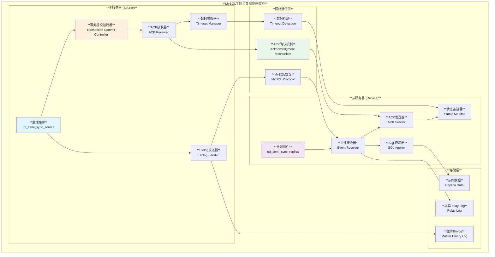

### 核心组件详解

#### 1. 主端插件 (rpl_semi_sync_source)

**源码位置**: `plugin/semisync/semisync_source_plugin.cc`

```cpp
// plugin/semisync/semisync_source_plugin.cc:139-161
if (semi_sync_slave != 0) {
  if (ack_receiver->add_slave(current_thd)) {
    LogErr(ERROR_LEVEL, ER_SEMISYNC_FAILED_REGISTER_REPLICA_TO_RECEIVER);
    return -1;
  }
  
  THR_RPL_SEMI_SYNC_DUMP = true;
  
  /* One more semi-sync slave */
  repl_semisync->add_slave();
  
  /* Tell server it will observe the transmission.*/
  param->set_observe_flag();
  
  /*
    Let's assume this semi-sync slave has already received all
    binlog events before the filename and position it requests.
  */
  repl_semisync->handleAck(param->server_id, log_file, log_pos);
}
```

**主要功能**:
- **从服务器注册**: 管理半同步从服务器列表
- **ACK等待**: 等待从服务器确认
- **超时控制**: 管理确认超时机制
- **降级机制**: 超时后自动降级为异步复制

#### 2. 从端插件 (rpl_semi_sync_replica)

**源码位置**: `plugin/semisync/semisync_replica_plugin.cc`

```cpp
// plugin/semisync/semisync_replica_plugin.cc:95-114
static int has_source_semisync(MYSQL *mysql, std::string name) {
  /* Check if source server has semi-sync plugin installed */
  std::string query = "SELECT @@global.rpl_semi_sync_" + name + "_enabled";
  if (mysql_real_query(mysql, query.c_str(),
                       static_cast<ulong>(query.length()))) {
    uint mysql_error = mysql_errno(mysql);
    if (mysql_error == ER_UNKNOWN_SYSTEM_VARIABLE)
      return 0;
    else {
      LogPluginErr(ERROR_LEVEL, ER_SEMISYNC_EXECUTION_FAILED_ON_SOURCE,
                   query.c_str(), mysql_error);
      return -1;
    }
  }
  return 1;
}
```

**主要功能**:
- **主服务器检测**: 检查主服务器是否支持半同步
- **事件接收**: 接收并处理binlog事件
- **ACK发送**: 向主服务器发送确认
- **状态同步**: 维护半同步状态

## 半同步复制实现原理深度分析

### 事务提交流程

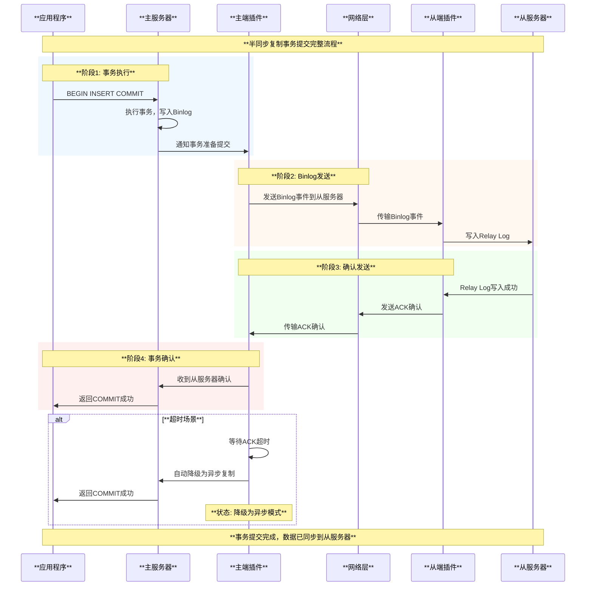

### 核心机制详解

#### 1. ACK确认机制

**源码实现**:
```cpp
// plugin/semisync/semisync_replica.cc:57+
int ReplSemiSyncSlave::slaveReadSyncHeader(const char *header,
                                           unsigned long total_len,
                                           int  *need_reply,
                                           const char **payload,
                                           unsigned long *payload_len) {
  // 解析同步头部
  // 判断是否需要发送ACK
  // 设置reply标志
}
```

**确认流程**:
1. **事件标识**: 主服务器标记需要确认的binlog事件
2. **接收处理**: 从服务器接收事件并写入relay log
3. **ACK发送**: 从服务器发送确认消息
4. **等待机制**: 主服务器等待确认或超时

#### 2. 超时降级机制

**参数控制**:
- `rpl_semi_sync_source_timeout`: 默认10秒
- 超时后自动切换为异步模式
- 从服务器恢复后自动切换回半同步模式

**降级逻辑**:
```cpp
// 伪代码示例
if (wait_for_ack_timeout()) {
    // 记录告警日志
    log_warning("Semi-sync replication timeout, fallback to async");
    
    // 切换为异步模式
    semi_sync_enabled = false;
    
    // 继续事务提交
    commit_transaction();
}
```

#### 3. 从服务器注册机制

**注册流程**:
```cpp
// plugin/semisync/semisync_replica_plugin.cc:138-144
const char *query =
    "SET @rpl_semi_sync_replica = 1, @rpl_semi_sync_slave = 1";
if (mysql_real_query(mysql, query, static_cast<ulong>(strlen(query)))) {
  LogPluginErr(ERROR_LEVEL, ER_SEMISYNC_REPLICA_SET_FAILED);
  return 1;
}
```

**注册机制**:
1. **变量设置**: 从服务器设置半同步标识变量
2. **主服务器检测**: 主服务器检测从服务器半同步支持
3. **列表维护**: 主服务器维护半同步从服务器列表
4. **状态同步**: 持续监控从服务器状态

## 半同步复制详细流程分析

### 启动流程

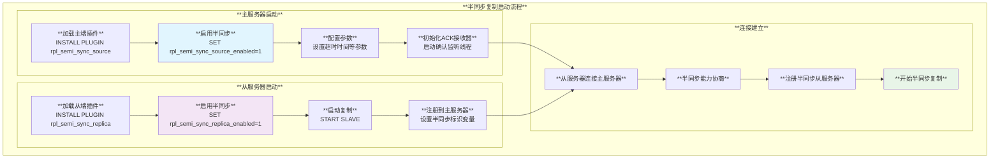

### 运行时流程

#### 1. 正常复制流程

```cpp
// 基于插件源码的流程逻辑
1. 应用程序提交事务
2. 主服务器写入binlog
3. 半同步插件拦截binlog事件
4. 发送事件到从服务器
5. 从服务器写入relay log
6. 从服务器发送ACK确认
7. 主服务器收到确认后完成提交
```

#### 2. 异常处理流程

**网络中断处理**:
- 从服务器断开连接
- 主服务器检测到连接中断
- 从半同步列表中移除该从服务器
- 如果没有其他半同步从服务器，降级为异步模式

**超时处理**:
- 等待ACK确认超时
- 记录告警日志
- 自动降级为异步模式
- 事务继续提交

## 半同步复制使用方法

### 安装和配置

#### 1. 安装插件

```sql
-- 主服务器安装
INSTALL PLUGIN rpl_semi_sync_source SONAME 'semisync_source.so';

-- 从服务器安装  
INSTALL PLUGIN rpl_semi_sync_replica SONAME 'semisync_replica.so';
```

#### 2. 启用半同步复制

```sql
-- 主服务器配置
SET GLOBAL rpl_semi_sync_source_enabled = 1;
SET GLOBAL rpl_semi_sync_source_timeout = 10000; -- 10秒超时

-- 从服务器配置
SET GLOBAL rpl_semi_sync_replica_enabled = 1;

-- 重启复制以生效
STOP SLAVE IO_THREAD;
START SLAVE IO_THREAD;
```

#### 3. 持久化配置

**my.cnf配置**:
```ini
[mysqld]
# 主服务器配置
plugin-load-add=rpl_semi_sync_source=semisync_source.so
rpl_semi_sync_source_enabled=1
rpl_semi_sync_source_timeout=10000
rpl_semi_sync_source_wait_for_replica_count=1

# 从服务器配置  
plugin-load-add=rpl_semi_sync_replica=semisync_replica.so
rpl_semi_sync_replica_enabled=1
```

### 控制参数详解

#### 主服务器参数表

| **参数名** | **默认值** | **说明** |
|----------|-----------|----------|
| `rpl_semi_sync_source_enabled` | OFF | **是否启用主端半同步复制** |
| `rpl_semi_sync_source_timeout` | 10000 | **等待ACK确认超时时间(毫秒)** |
| `rpl_semi_sync_source_wait_for_replica_count` | 1 | **需要等待确认的从服务器数量** |
| `rpl_semi_sync_source_wait_point` | AFTER_SYNC | **等待确认的时机** |
| `rpl_semi_sync_source_wait_no_replica` | ON | **无从服务器时是否等待** |

#### 从服务器参数表

| **参数名** | **默认值** | **说明** |
|----------|-----------|----------|
| `rpl_semi_sync_replica_enabled` | OFF | **是否启用从端半同步复制** |
| `rpl_semi_sync_replica_trace_level` | 32 | **跟踪日志级别** |

#### 状态变量监控

```sql
-- 主服务器状态监控
SHOW STATUS LIKE 'Rpl_semi_sync_source%';

-- 关键状态变量
Rpl_semi_sync_source_status                 | ON
Rpl_semi_sync_source_clients                | 2
Rpl_semi_sync_source_yes_tx                 | 1000
Rpl_semi_sync_source_no_tx                  | 5
Rpl_semi_sync_source_wait_sessions          | 0
Rpl_semi_sync_source_wait_pos_backtraverse  | 0
Rpl_semi_sync_source_avg_net_wait_time      | 1500
Rpl_semi_sync_source_avg_trx_wait_time      | 2000
Rpl_semi_sync_source_net_wait_time          | 15000000
Rpl_semi_sync_source_net_waits               | 10000
Rpl_semi_sync_source_no_times               | 5
Rpl_semi_sync_source_timefunc_failures      | 0
Rpl_semi_sync_source_tx_wait_time           | 20000000
Rpl_semi_sync_source_tx_waits               | 10000

-- 从服务器状态监控
SHOW STATUS LIKE 'Rpl_semi_sync_replica%';

Rpl_semi_sync_replica_status                | ON
```

### 最佳实践配置

#### 1. 生产环境推荐配置

```sql
-- 主服务器最佳实践配置
SET GLOBAL rpl_semi_sync_source_enabled = 1;
SET GLOBAL rpl_semi_sync_source_timeout = 1000;  -- 1秒超时，平衡性能和数据安全
SET GLOBAL rpl_semi_sync_source_wait_for_replica_count = 1;  -- 至少1个从服务器确认
SET GLOBAL rpl_semi_sync_source_wait_point = 'AFTER_SYNC';  -- 推荐设置

-- 从服务器最佳实践配置
SET GLOBAL rpl_semi_sync_replica_enabled = 1;
```

#### 2. 高可用环境配置

```sql
-- 多从服务器环境
SET GLOBAL rpl_semi_sync_source_wait_for_replica_count = 2;  -- 需要2个从服务器确认
SET GLOBAL rpl_semi_sync_source_timeout = 5000;  -- 稍长超时时间

-- 跨地域环境
SET GLOBAL rpl_semi_sync_source_timeout = 3000;  -- 考虑网络延迟
```

## 故障恢复机制

### 故障类型和处理

#### 1. 网络中断故障

**故障现象**:
- 从服务器突然断开连接
- ACK确认消息丢失
- 网络延迟导致超时

**处理机制**:
```sql
-- 检测网络中断
SHOW STATUS LIKE 'Rpl_semi_sync_source_clients';

-- 自动处理逻辑
1. 主服务器检测连接中断
2. 从半同步列表移除故障从服务器  
3. 评估剩余从服务器数量
4. 如果不满足最小要求，降级为异步模式
```

#### 2. 从服务器故障

**故障恢复流程**:

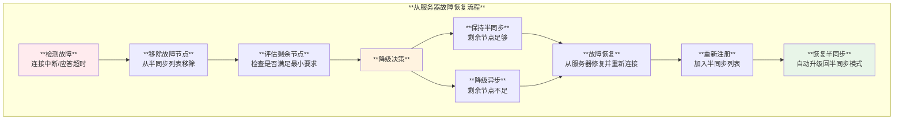

#### 3. 主服务器故障

**故障转移处理**:
1. **检测主服务器故障**
2. **选举新的主服务器**
3. **重新配置半同步复制**
4. **从服务器重新连接**

### 监控和告警

#### 1. 关键监控指标

```sql
-- 监控脚本示例
CREATE VIEW semi_sync_monitor AS
SELECT 
    'semi_sync_status' as metric,
    VARIABLE_VALUE as value
FROM performance_schema.global_status 
WHERE VARIABLE_NAME = 'Rpl_semi_sync_source_status'
UNION ALL
SELECT 
    'semi_sync_clients' as metric,
    VARIABLE_VALUE as value  
FROM performance_schema.global_status
WHERE VARIABLE_NAME = 'Rpl_semi_sync_source_clients'
UNION ALL
SELECT 
    'avg_wait_time' as metric,
    VARIABLE_VALUE as value
FROM performance_schema.global_status
WHERE VARIABLE_NAME = 'Rpl_semi_sync_source_avg_trx_wait_time';
```

#### 2. 告警规则设置

```bash
#!/bin/bash
# 半同步复制监控脚本

# 检查半同步状态
SEMI_SYNC_STATUS=$(mysql -e "SHOW STATUS LIKE 'Rpl_semi_sync_source_status'" | grep Rpl_semi_sync_source_status | awk '{print $2}')

if [ "$SEMI_SYNC_STATUS" != "ON" ]; then
    echo "ALERT: Semi-sync replication is disabled!" 
    # 发送告警
fi

# 检查从服务器数量
REPLICA_COUNT=$(mysql -e "SHOW STATUS LIKE 'Rpl_semi_sync_source_clients'" | grep Rpl_semi_sync_source_clients | awk '{print $2}')

if [ $REPLICA_COUNT -lt 1 ]; then
    echo "ALERT: No semi-sync replicas connected!"
    # 发送告警
fi

# 检查平均等待时间
AVG_WAIT_TIME=$(mysql -e "SHOW STATUS LIKE 'Rpl_semi_sync_source_avg_trx_wait_time'" | grep Rpl_semi_sync_source_avg_trx_wait_time | awk '{print $2}')

if [ $AVG_WAIT_TIME -gt 5000 ]; then  # 5秒
    echo "ALERT: Semi-sync wait time too high: ${AVG_WAIT_TIME}ms"
    # 发送告警
fi
```

## 进度状态更新机制

### 状态跟踪架构

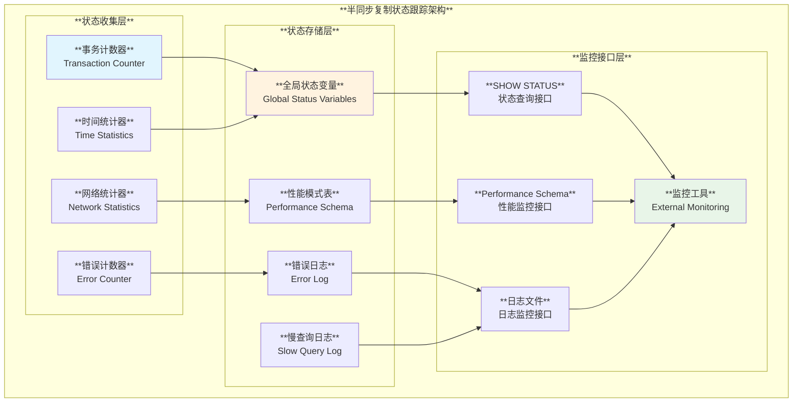

### 状态更新机制

#### 1. 实时状态更新

**事务级别更新**:
- 每个事务提交时更新计数器
- 记录等待时间和网络延迟
- 更新平均响应时间统计

**连接级别更新**:
- 从服务器连接/断开时更新客户端数量
- 维护活跃半同步连接列表
- 跟踪连接状态变化

#### 2. 性能统计更新

```sql
-- 性能统计示例
SELECT 
    VARIABLE_NAME,
    VARIABLE_VALUE,
    CASE 
        WHEN VARIABLE_NAME = 'Rpl_semi_sync_source_avg_net_wait_time' 
        THEN CONCAT(ROUND(VARIABLE_VALUE/1000, 2), ' ms')
        WHEN VARIABLE_NAME = 'Rpl_semi_sync_source_avg_trx_wait_time'
        THEN CONCAT(ROUND(VARIABLE_VALUE/1000, 2), ' ms')  
        ELSE VARIABLE_VALUE
    END AS formatted_value
FROM performance_schema.global_status
WHERE VARIABLE_NAME LIKE 'Rpl_semi_sync_source_%'
ORDER BY VARIABLE_NAME;
```

## 复制线程协作机制深入分析

### MySQL复制线程架构

基于MySQL源码分析 (`sql/rpl_replica.h:108-131`)，MySQL复制采用**双线程协作模型**：

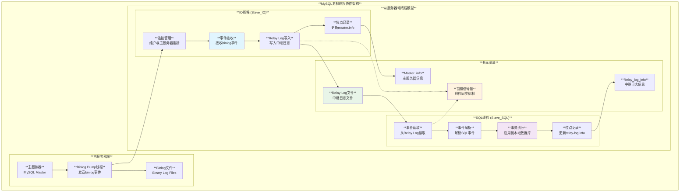

### 线程协作详细机制

#### 1. IO线程工作流程

**源码位置**: `sql/rpl_replica.cc:5351` (`handle_slave_io`)

**关键职责**:
- **连接维护**: 与主服务器建立和维护持久连接
- **事件接收**: 从主服务器读取binlog事件
- **中继日志写入**: 将事件写入本地Relay Log
- **位点管理**: 更新和维护复制位点信息

#### 2. SQL线程工作流程

**源码位置**: `sql/rpl_rli.h:130-204` (Relay_log_info定义)

**关键职责**:
- **事件读取**: 从Relay Log读取事件
- **事务解析**: 解析和验证事务内容
- **本地执行**: 应用事务到本地数据库
- **状态维护**: 更新执行位点和状态信息

### 线程间同步机制

基于源码 (`sql/rpl_replica.h:134-352`)，MySQL复制采用多级锁机制：

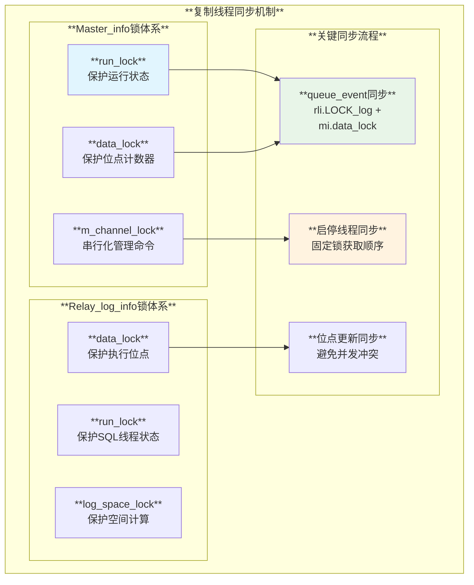

### 故障恢复和断点续传

#### 1. IO线程断点续传

**位点恢复机制**:
1. **位点持久化**: 实时将位点写入master.info
2. **重连恢复**: 从记录位点请求主服务器继续发送
3. **去重处理**: 处理网络重传可能的重复事件

#### 2. SQL线程并发执行协调机制

**多线程应用者(MTS)架构深度分析**:

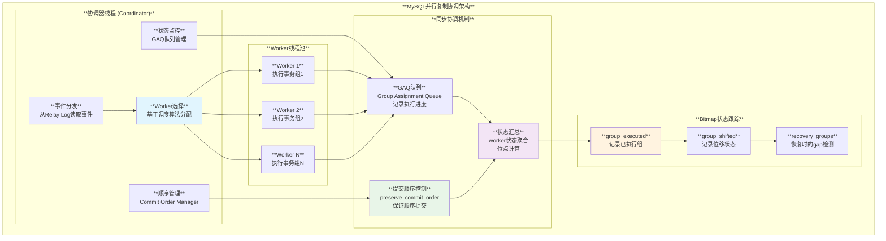

##### Worker线程状态协调机制

**基于源码的状态管理** (`sql/rpl_replica_commit_order_manager.h:59-106`):

```cpp
// Worker线程状态转换流程
enum Worker_Stage {
  REGISTERED,        // 已注册，开始应用事务
  FINISHED_APPLYING, // 应用完成，检查是否需要等待
  REQUESTED_GRANT,   // 等待前序worker提交完成
  WAITED,           // 等待结束，准备提交
  RELEASE_NEXT,     // 提交完成，释放下一个worker
  FINISHED          // 完全完成，可接受新事务
};

// 状态协调逻辑
class Worker_Coordinator {
  // 状态汇总机制
  void aggregate_worker_states() {
    uint64_t min_executed_pos = UINT64_MAX;
    bool all_workers_idle = true;
    
    for (auto& worker : workers) {
      if (worker.state != FINISHED) {
        all_workers_idle = false;
      }
      min_executed_pos = min(min_executed_pos, worker.executed_pos);
    }
    
    // 更新全局执行位点为所有worker的最小位点
    global_executed_pos = min_executed_pos;
    coordinator_can_advance = all_workers_idle;
  }
};
```

##### Bitmap状态记录机制

**Bitmap生成和使用** (基于 `sql/rpl_rli_pdb.cc:428-444`):

```cpp
// Bitmap初始化逻辑
int Slave_worker::rli_init_info(bool is_gaps_collecting_phase) {
  // 根据恢复模式决定bitmap大小
  size_t num_bits = is_gaps_collecting_phase 
                   ? MTS_MAX_BITS_IN_GROUP      // Gap收集阶段
                   : c_rli->checkpoint_group;   // 正常运行阶段
  
  // 初始化两个核心bitmap
  bitmap_init(&group_executed, nullptr, num_bits);  // 记录已执行的组
  bitmap_init(&group_shifted, nullptr, num_bits);   // 记录位移状态
  
  return 0;
}

// Bitmap使用示例
class Bitmap_Manager {
  // 标记事务组为已执行
  void mark_group_executed(uint group_id) {
    bitmap_set_bit(&group_executed, group_id);
    
    // 检查是否可以前移低水位标记
    while (bitmap_is_set(&group_executed, lwm_group_id)) {
      bitmap_set_bit(&group_shifted, lwm_group_id);
      bitmap_clear_bit(&group_executed, lwm_group_id);
      lwm_group_id++;
    }
  }
  
  // 检测gap
  std::vector<uint> detect_gaps() {
    std::vector<uint> gaps;
    for (uint i = lwm_group_id; i < max_group_id; i++) {
      if (!bitmap_is_set(&group_executed, i)) {
        gaps.push_back(i);
      }
    }
    return gaps;
  }
};
```

#### 6. Bitmap数据转换深度解析

**Bitmap的数据来源和转换算法**:

Bitmap在MySQL MTS中主要由以下数据源转换而来：

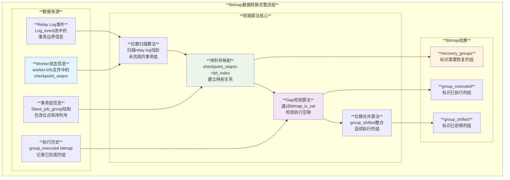

##### 详细转换算法分析

**1. Worker状态信息收集** (基于 `sql/rpl_replica.cc:6322-6352`):

```cpp
// 从worker.info文件收集状态信息的算法
for (uint id = 0; id < rli->recovery_parallel_workers; id++) {
  Slave_worker *worker = Rpl_info_factory::create_worker(
      INFO_REPOSITORY_TABLE, id, rli, true);
  
  // 比较worker位点与当前协调器位点
  LOG_POS_COORD w_last = {
      const_cast<char *>(worker->get_group_master_log_name()),
      worker->get_group_master_log_pos()
  };
  
  if (mts_event_coord_cmp(&w_last, &cp) > 0) {
    // Worker位点超前于协调器位点，说明有未完成的工作
    job_worker.worker = worker;
    job_worker.checkpoint_log_pos = worker->checkpoint_master_log_pos;
    job_worker.checkpoint_log_name = worker->checkpoint_master_log_name;
    
    above_lwm_jobs.push_back(job_worker);  // 收集需要恢复的worker
  }
}
```

**2. Relay Log扫描算法** (基于 `sql/rpl_replica.cc:6410-6490`):

```cpp
// 核心的bitmap构建算法
class Bitmap_Converter {
  void convert_worker_state_to_bitmap(Slave_worker *w, MY_BITMAP *groups) {
    uint recovery_group_cnt = 0;
    
    // 1. 扫描relay log找到worker的最后执行位置
    while (!reached_worker_position) {
      Log_event *ev = read_next_event_from_relay_log();
      
      if (event_matches_worker_position(ev, w)) {
        recovery_group_cnt = count_groups_processed;
        
        // 2. 关键转换：从worker的group_executed bitmap复制到recovery bitmap
        for (uint i = (w->worker_checkpoint_seqno + 1) - recovery_group_cnt,
                  j = 0;
             i <= w->worker_checkpoint_seqno; 
             i++, j++) {
          
          if (bitmap_is_set(&w->group_executed, i)) {
            // 设置recovery_groups bitmap对应位
            bitmap_test_and_set(groups, j);
          }
        }
        
        reached_worker_position = true;
      } else {
        recovery_group_cnt++;  // 计数未执行的组
      }
    }
  }
};
```

**3. 序列号到位索引的映射算法**:

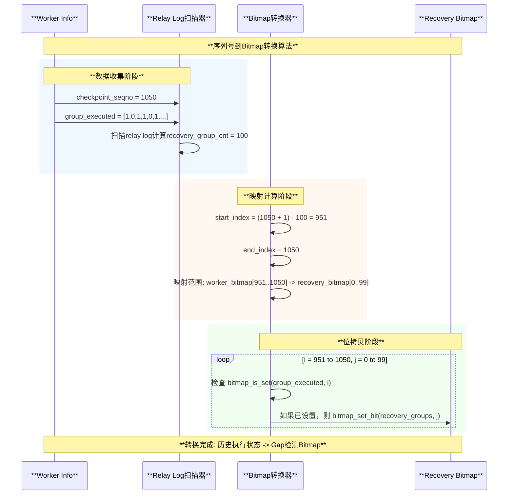

##### 转换算法的数学原理

**索引映射公式**:

```cpp
// 关键的索引映射算法
class Index_Mapping_Algorithm {
  /*
   * 输入数据:
   * - worker_checkpoint_seqno: Worker最后执行的序列号 (如: 1050)
   * - recovery_group_cnt: 通过relay log扫描计算的组数量 (如: 100)  
   * - group_executed: Worker的历史执行bitmap
   *
   * 输出数据:
   * - recovery_groups: 用于恢复的gap检测bitmap
   */
  
  void map_indices() {
    // 计算源bitmap的起始索引
    uint start_index = (worker_checkpoint_seqno + 1) - recovery_group_cnt;
    uint end_index = worker_checkpoint_seqno;
    
    // 映射公式: source_index -> target_index
    for (uint source_idx = start_index, target_idx = 0;
         source_idx <= end_index;
         source_idx++, target_idx++) {
      
      if (bitmap_is_set(&worker->group_executed, source_idx)) {
        bitmap_set_bit(&recovery_groups, target_idx);
      }
    }
  }
  
  /*
   * 转换示例:
   * 假设 worker_checkpoint_seqno = 1050, recovery_group_cnt = 100
   * 则映射关系为:
   * - group_executed[951] -> recovery_groups[0]
   * - group_executed[952] -> recovery_groups[1]  
   * - ...
   * - group_executed[1050] -> recovery_groups[99]
   */
};
```

##### 转换算法的优化特性

**1. 内存优化**: 
- 动态调整bitmap大小 (`MTS_MAX_BITS_IN_GROUP` vs `checkpoint_group`)
- 惰性初始化 (`recovery_groups_inited` 标志)
- 及时清理 (`bitmap_free` 在不需要时释放)

**2. 性能优化**:
- 顺序扫描而非随机访问
- 位运算操作 (`bitmap_test_and_set`) 的高效性
- 批量处理多个worker的状态

**3. 准确性保证**:
- 事务边界检测确保完整性
- 多Worker状态的统一聚合 (`RB |= w.B`)
- GTID模式下的自动跳过优化

这种复杂的转换机制确保了：
- **数据完整性**: 所有未完成的事务组都被正确识别
- **恢复精度**: Gap检测精确到事务组级别
- **性能效率**: 位运算操作保证了高效的状态检查
- **扩展性**: 支持任意数量的Worker和事务组

#### 3. 故障重启恢复机制

**MTS恢复完整流程** (基于 `sql/rpl_replica.cc:6259-6315`):

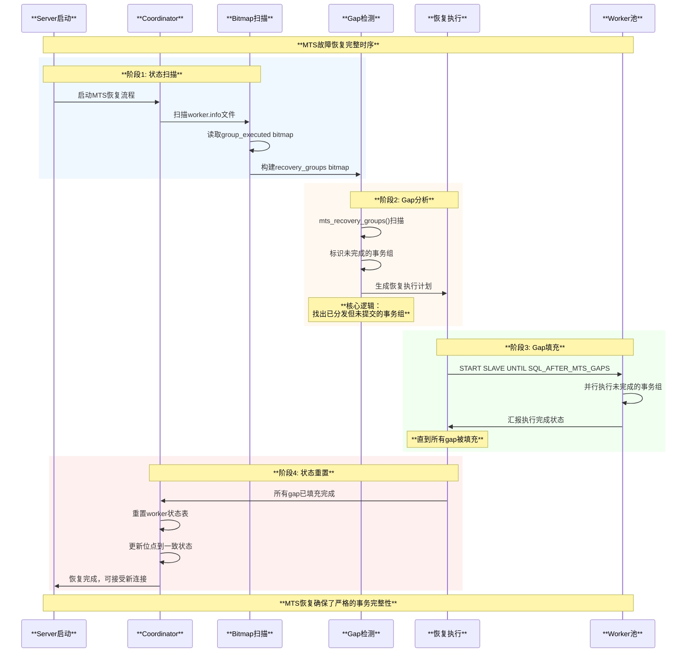

**Gap检测和Bitmap使用详解**:

```cpp
// 基于sql/rpl_replica.cc:6259的恢复逻辑
bool mts_recovery_groups(Relay_log_info *rli) {
  MY_BITMAP *groups = &rli->recovery_groups;  // 恢复用的bitmap
  
  // 1. 初始化recovery bitmap
  bitmap_init(groups, nullptr, MTS_MAX_BITS_IN_GROUP);
  
  // 2. 扫描relay log，标记已分发但可能未完成的组  
  while (scan_relay_log_for_groups()) {
    if (group_was_assigned_to_worker(group_id) && 
        !group_was_committed(group_id)) {
      // 标记为需要恢复的gap
      bitmap_set_bit(groups, group_id);
      recovery_group_cnt++;
    }
  }
  
  // 3. 如果发现gap，启动恢复流程
  if (recovery_group_cnt > 0) {
    rli->mts_recovery_group_cnt = recovery_group_cnt;
    return true;  // 需要恢复
  }
  
  return false;  // 无需恢复
}
```

#### 4. 位点状态汇总机制

**多Worker位点聚合算法**:

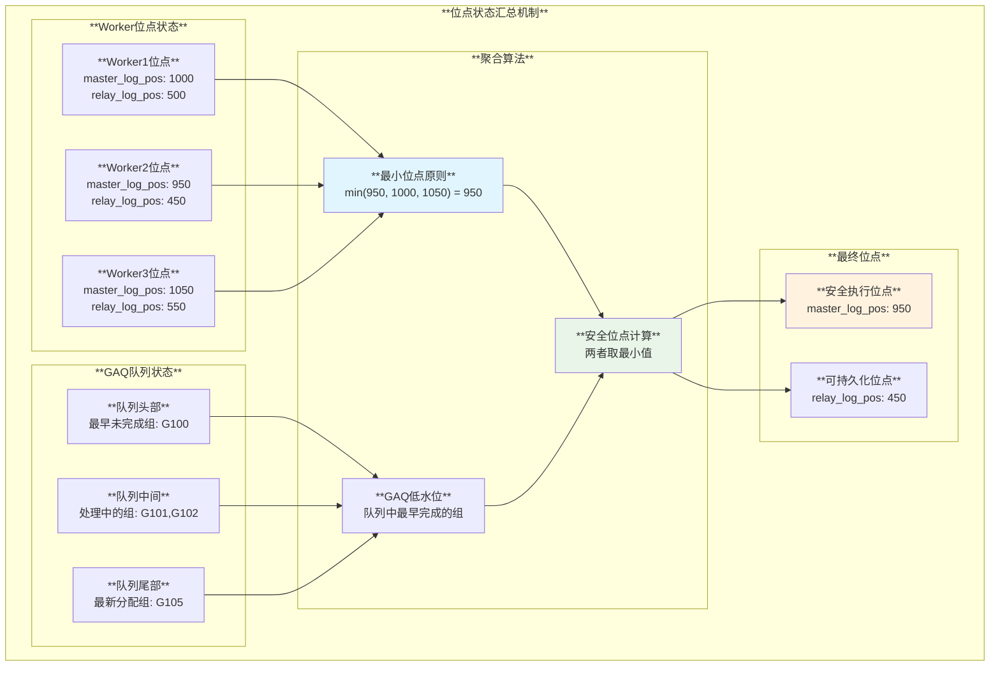

**源码实现的位点汇总逻辑**:

```cpp
// 基于GAQ队列的位点聚合
class Group_Assignment_Queue {
  // 计算安全的执行位点
  LOG_POS_COORD get_safe_executed_position() {
    LOG_POS_COORD safe_pos = {nullptr, 0};
    
    // 1. 获取GAQ中的低水位位点
    if (gaq_head_completed()) {
      safe_pos = gaq.front().master_log_pos_coord;
    }
    
    // 2. 与所有worker的最小位点比较
    for (auto& worker : workers) {
      if (worker.master_log_pos < safe_pos.pos) {
        safe_pos.pos = worker.master_log_pos;
        strcpy(safe_pos.file, worker.master_log_name);
      }
    }
    
    return safe_pos;  // 返回最保守的安全位点
  }
};
```

这种复杂的协调机制确保了：
1. **并发安全**: 多个Worker可以并行执行不冲突的事务
2. **顺序保证**: 通过Commit Order Manager维持提交顺序  
3. **故障恢复**: 通过Bitmap准确记录执行状态，支持精确的gap恢复
4. **状态一致**: 通过GAQ和位点聚合算法维护全局一致的执行位点

#### 5. 主库Offline模式自动重连机制

**MySQL主库离线场景的智能重连系统**:


##### 自动重连核心机制

**基于源码的重连逻辑** (`sql/rpl_replica.cc:8558-8615`):

```cpp
// IO线程自动重连实现
bool connect_to_master(THD *thd, MYSQL *mysql, Master_info *mi, 
                       bool reconnect, bool suppress_warnings) {
  uint err_count = 0;
  bool replica_was_killed = false;
  bool connected = false;
  
  while (!connected) {
    // 1. 检查线程是否被杀死
    replica_was_killed = io_slave_killed(thd, mi);
    if (replica_was_killed) break;
    
    // 2. 尝试连接（重连或新建连接）
    if (reconnect) {
      connected = !mysql_reconnect(mysql);
    } else {
      connected = mysql_real_connect(mysql, host, user, password, 
                                   nullptr, port, nullptr, client_flag);
    }
    
    if (connected) break;  // 连接成功
    
    // 3. 连接失败处理
    last_errno = mysql_errno(mysql);
    mi->report(ERROR_LEVEL, last_errno,
              "Error %s to source '%s@%s:%d'. "
              "This was attempt %lu/%lu, with a delay of %d seconds "
              "between attempts. Message: %s",
              (reconnect ? "reconnecting" : "connecting"), 
              mi->get_user(), host, port, err_count + 1, 
              mi->retry_count, mi->connect_retry, mysql_error(mysql));
    
    // 4. 重试控制
    if (++err_count == mi->retry_count) {
      if (is_network_error(last_errno)) mi->set_network_error();
      replica_was_killed = true;
      break;
    }
    
    // 5. 等待重试间隔
    slave_sleep(thd, mi->connect_retry, io_slave_killed, mi);
  }
  
  return !replica_was_killed && connected;
}
```

##### 智能重连参数控制

**重连行为控制参数**:

```sql
-- 重连相关系统变量
SET GLOBAL slave_net_timeout = 60;           -- 网络超时时间
SET GLOBAL master_connect_retry = 60;        -- 重连间隔（秒）  
SET GLOBAL master_retry_count = 86400;       -- 最大重试次数（默认0=无限重试）
SET GLOBAL slave_compressed_protocol = ON;   -- 启用压缩协议减少网络负载

-- 查看重连状态
SHOW SLAVE STATUS\G
-- 关键字段：
-- Slave_IO_Running: 当前IO线程状态
-- Last_IO_Error: 最后的IO错误信息  
-- Last_IO_Errno: 最后的错误码
-- Master_Retry_Count: 当前重试次数
```

##### 异步连接故障切换(ACF)机制

**高级自动重连特性** (MySQL 8.0.22+):

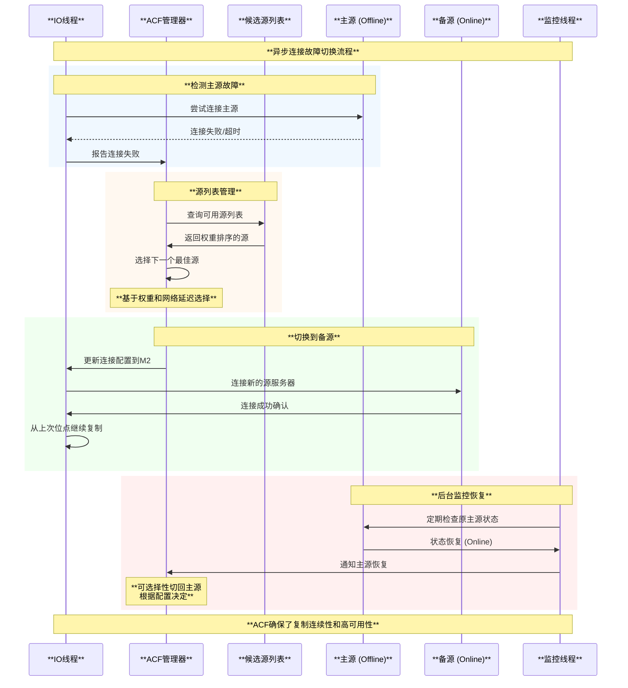

**ACF配置和使用**:

```sql
-- 启用异步连接故障切换
CHANGE REPLICATION SOURCE TO 
    SOURCE_AUTO_POSITION = 1,
    SOURCE_CONNECTION_AUTO_FAILOVER = 1;

-- 添加候选源服务器
SELECT asynchronous_connection_failover_add_source(
    'channel_name', 'host2', 3306, '', 90);  -- 权重90
SELECT asynchronous_connection_failover_add_source(
    'channel_name', 'host3', 3306, '', 80);  -- 权重80

-- 查看源服务器列表
SELECT * FROM performance_schema.replication_asynchronous_connection_failover;

-- 监控切换状态  
SELECT * FROM performance_schema.replication_connection_status;
```

##### Offline模式恢复时序

**主库从Offline到Online的完整恢复流程**:

```cpp
// 基于sql/rpl_replica.cc:5296的重连恢复逻辑
int safe_reconnect_after_offline(THD *thd, MYSQL *mysql, Master_info *mi) {
  // 1. 设置重连状态
  mi->slave_running = MYSQL_SLAVE_RUN_NOT_CONNECT;
  THD_STAGE_INFO(thd, stage_replica_waiting_to_reconnect);
  
  // 2. 清理旧连接
  thd->clear_active_vio();
  end_server(mysql);
  
  // 3. 递增重试计数
  if ((*retry_count)++) {
    if (*retry_count > mi->retry_count) return 1;  // 达到最大重试次数
    slave_sleep(thd, mi->connect_retry, io_slave_killed, mi);
  }
  
  // 4. 检查是否被停止
  if (check_io_slave_killed(thd, mi, "Killed while waiting to reconnect"))
    return 1;
    
  // 5. 开始重连尝试
  THD_STAGE_INFO(thd, stage_replica_reconnecting);
  
  // 6. 记录重连信息
  if (!suppress_warnings) {
    mi->report(WARNING_LEVEL, ER_REPLICA_SOURCE_COM_FAILURE,
              "Lost connection to MySQL server at '%s', retrying",
              mi->host);
  }
  
  // 7. 执行安全重连
  if (safe_reconnect(thd, mysql, mi, true) || io_slave_killed(thd, mi)) {
    return 1;  // 重连失败或被终止
  }
  
  return 0;  // 重连成功
}
```

**关键特性**:

1. **无损切换**: 通过精确的位点记录，确保没有事务丢失
2. **智能延迟**: 使用指数退避算法避免频繁重连
3. **错误分类**: 区分网络错误和服务器错误，采用不同策略
4. **监控集成**: 实时更新`performance_schema`中的状态信息
5. **故障感知**: 结合ACF实现智能的源服务器切换

这种机制确保了MySQL复制在面对主库临时offline时能够：
- **自动检测**: 快速发现连接中断
- **智能重试**: 采用合理的重试策略避免资源浪费  
- **无缝恢复**: 主库online后立即恢复复制
- **高可用保障**: 通过ACF实现自动故障切换

## 事务顺序应用机制

### 主从事务顺序一致性保证机制

MySQL复制通过多层机制确保主从服务器的事务顺序完全一致：

#### 1. Binlog顺序写入保证

**源码位置**: `sql/binlog.cc` - binlog写入机制

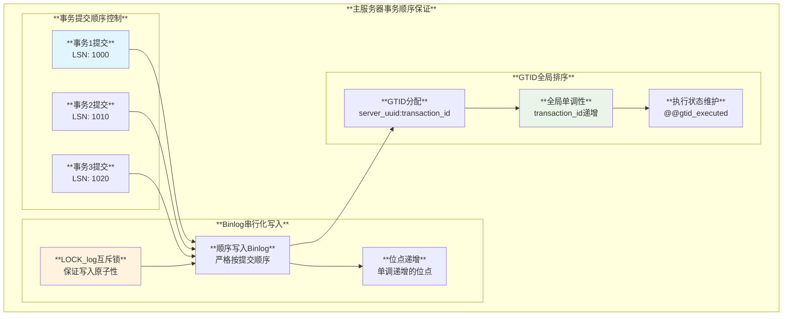

#### 2. 网络传输顺序保证

**Binlog Dump线程机制**:

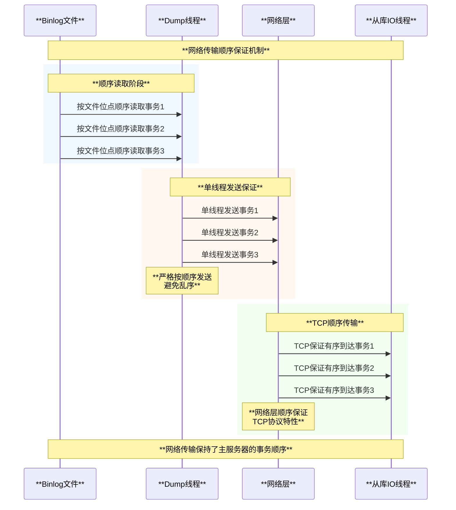

#### 3. 从服务器应用顺序保证

**SQL线程顺序执行机制**:

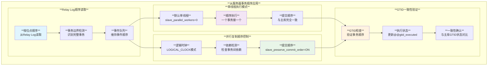

#### 4. 并行复制中的顺序保证

**基于逻辑时钟的并行复制** (MySQL 5.7+):

```sql
-- 并行复制配置
SET GLOBAL slave_parallel_type = 'LOGICAL_CLOCK';
SET GLOBAL slave_parallel_workers = 4;
SET GLOBAL slave_preserve_commit_order = ON;  -- 关键！保证提交顺序
```

**顺序保证机制**:
1. **组提交逻辑时钟**: 主服务器为同时提交的事务分配相同的逻辑时钟
2. **并行执行**: 不同逻辑时钟的事务可以并行执行
3. **串行提交**: 所有事务按照原始顺序串行提交

**逻辑时钟实现原理**:
```cpp
// 基于源码逻辑的伪代码
class Logical_clock {
  // 主服务器端：为组提交分配逻辑时钟
  uint64 assign_clock_for_group_commit(std::vector<Transaction*>& txn_group) {
    uint64 clock = next_clock_value++;
    for (auto& txn : txn_group) {
      txn->logical_clock = clock;
    }
    return clock;
  }
  
  // 从服务器端：基于逻辑时钟确定并行度
  bool can_execute_parallel(Transaction* txn1, Transaction* txn2) {
    return txn1->logical_clock != txn2->logical_clock;
  }
};
```

### 顺序保证架构总览

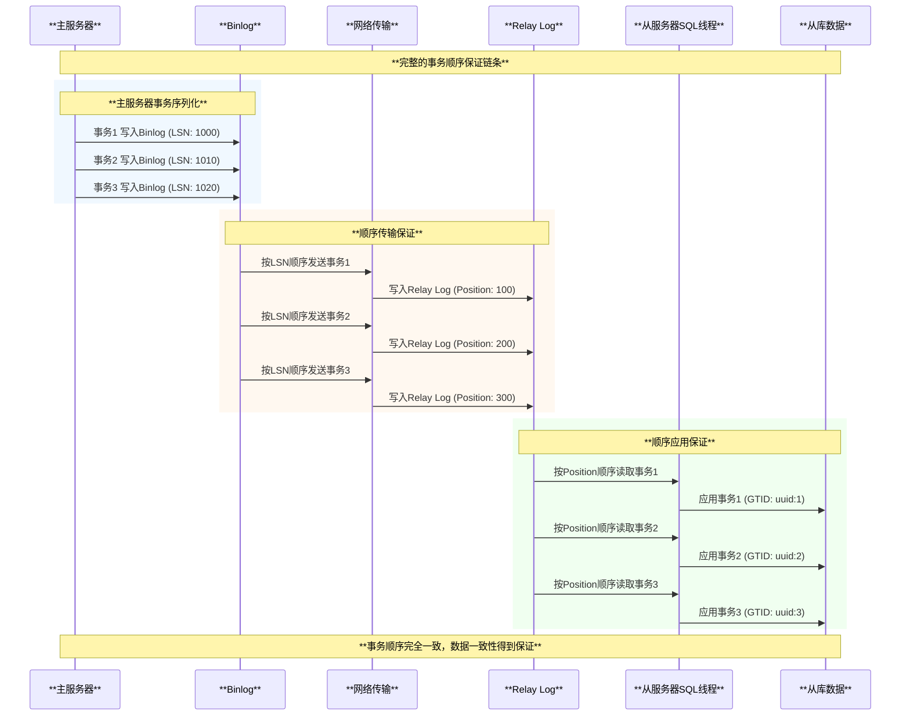

### 顺序控制机制

#### 1. Binlog顺序控制

**LSN序列化**:
- 主服务器按照提交顺序写入Binlog
- 每个事务分配唯一的LSN
- Binlog事件严格按照LSN顺序记录

**GTID顺序控制**:
- 每个事务分配全局唯一GTID
- GTID严格按照事务提交顺序递增
- 从服务器按照GTID顺序应用事务

#### 2. 网络传输顺序保证

**单线程发送**:
- Dump线程按照Binlog顺序发送事件
- 保证网络传输的先后顺序
- 避免并发发送导致的顺序混乱

**确认顺序控制**:
- ACK确认必须按照事务顺序返回
- 保证主服务器接收确认的顺序性
- 维护一致的确认状态

#### 3. 从服务器应用顺序

**单线程应用**:
```sql
-- 传统单线程SQL应用
-- 保证严格的事务顺序
slave-parallel-workers = 0
```

**并行复制顺序控制**:
```sql  
-- 基于GTID的并行复制
slave-parallel-type = LOGICAL_CLOCK
slave-parallel-workers = 4
slave-preserve-commit-order = ON  -- 保证提交顺序
```

**并行复制机制**:
- **逻辑时钟**: 基于binlog组提交的逻辑时钟
- **提交顺序**: 保证最终提交顺序与主服务器一致
- **依赖检测**: 检测事务间的依赖关系
- **顺序提交**: 按照原始顺序提交事务

### 一致性保证

#### 1. 读一致性保证

**半同步确认后的读一致性**:
- 主服务器提交事务后立即可读
- 从服务器确认后数据已落盘
- 保证读取到已确认的最新数据

#### 2. 写一致性保证

**事务提交一致性**:
- 主服务器等待从服务器确认后提交
- 保证提交的事务至少在一个从服务器上有备份
- 降低数据丢失风险

#### 3. 崩溃恢复一致性

**主服务器崩溃恢复**:
- 未收到确认的事务可能需要回滚
- 基于从服务器状态进行数据修复
- 保证数据的最终一致性

## 总结

MySQL半同步复制作为介于异步复制和同步复制之间的复制方案，在数据安全性和系统性能之间取得了良好的平衡，具有以下**核心优势**：

### 技术优势

1. **数据安全性提升**: 确保事务至少在一个从服务器上有备份
2. **性能影响可控**: 相比完全同步复制，性能影响较小
3. **自动降级保护**: 异常情况下自动降级为异步模式，保证可用性
4. **插件化架构**: 模块化设计，易于维护和扩展

### 架构优势

1. **双端插件设计**: 主从分离的插件架构，职责清晰
2. **ACK确认机制**: 可靠的确认机制，保证数据传输确认
3. **超时保护机制**: 智能的超时和降级机制，保证系统稳定性
4. **状态监控完善**: 丰富的状态变量和监控指标

### 应用价值

1. **金融级数据保护**: 适用于对数据安全性要求较高的业务场景
2. **高可用架构支撑**: 为MySQL主从架构提供更可靠的数据保护
3. **运维监控友好**: 完善的监控指标便于运维管理
4. **故障自动恢复**: 自动化的故障检测和恢复机制

### 适用场景

1. **核心业务系统**: 订单、支付、账务等核心业务
2. **数据一致性要求高**: 需要保证数据不丢失的场景  
3. **读写分离架构**: 需要保证读取数据一致性的架构
4. **灾备环境**: 异地灾备环境的数据同步

MySQL半同步复制通过精妙的ACK确认机制和智能的降级保护，为MySQL复制架构提供了一个可靠、高效、易用的数据保护解决方案，是现代MySQL高可用架构中不可或缺的重要组件。
