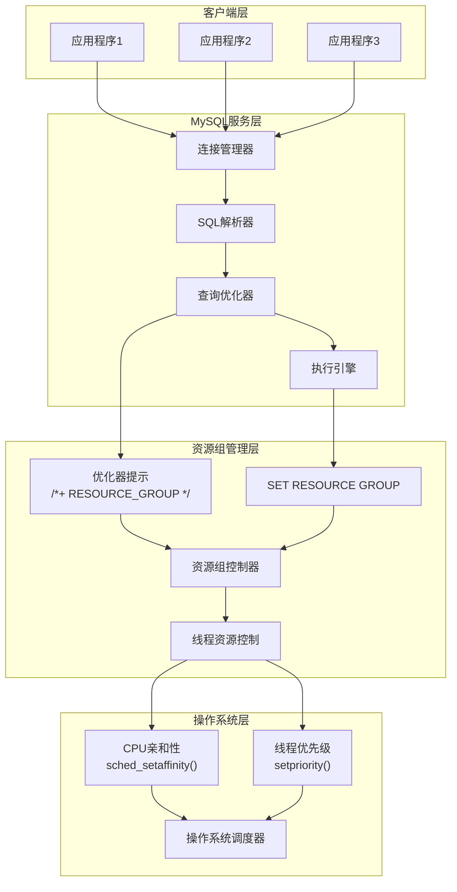
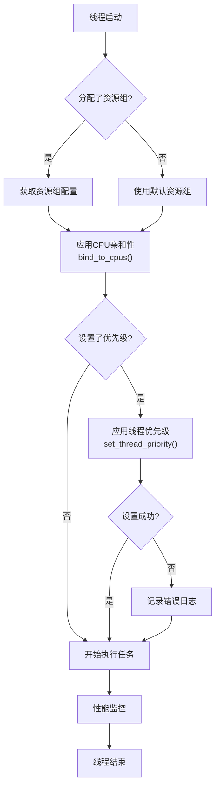
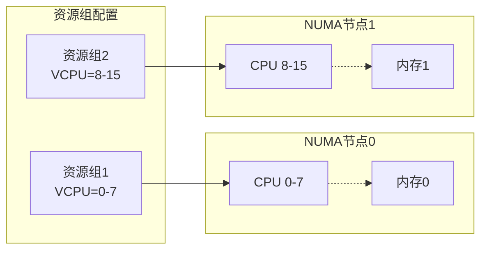
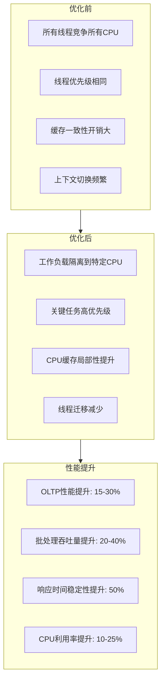
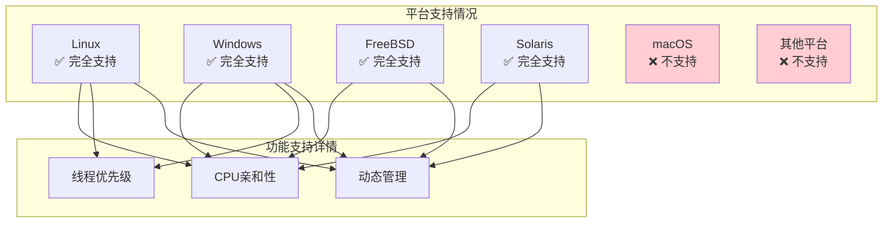
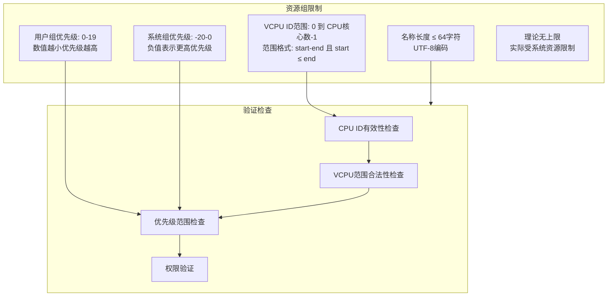
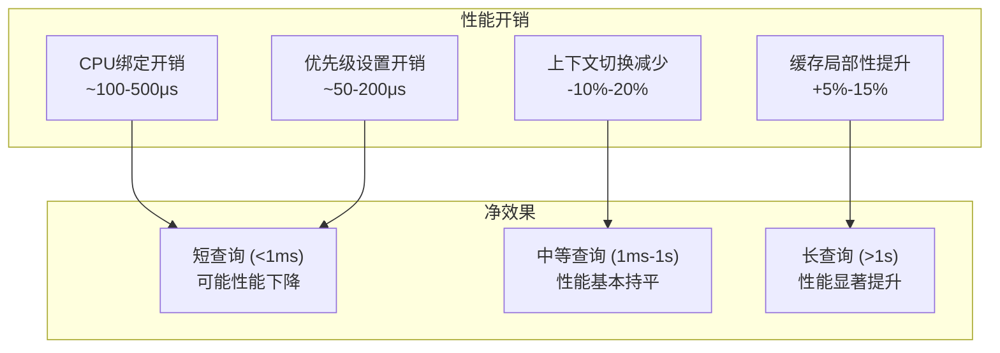
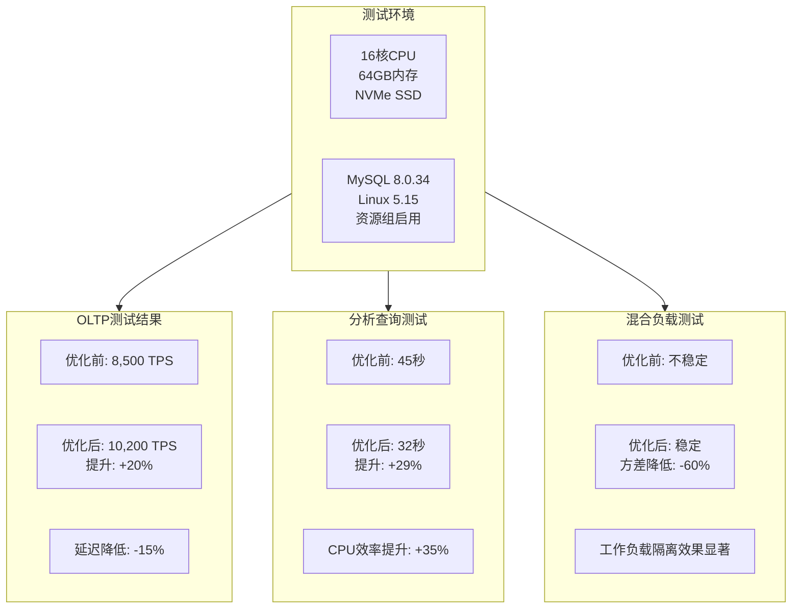
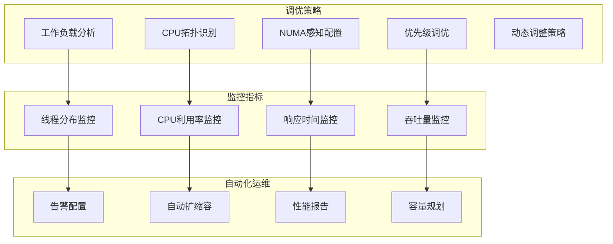

# MySQL 资源组 (Resource Groups) 功能深度分析

## 概述

**MySQL 资源组** 是 MySQL 8.0 引入的资源管理功能，允许 DBA 精确控制 SQL 语句执行时的 CPU 亲和性和线程优先级。通过将线程绑定到特定的 CPU 核心并设置优先级，资源组提供了细粒度的资源管理能力，优化多核系统的性能表现。

**核心功能**：
- **CPU 亲和性控制**：将线程绑定到指定 CPU 核心
- **线程优先级管理**：控制线程在操作系统层面的调度优先级
- **资源隔离**：为不同类型的工作负载提供资源隔离
- **动态管理**：支持运行时创建、修改和删除资源组

## 资源组架构图

### 1. 整体架构



### 2. 线程资源控制流程



## 资源组用途和应用场景

### 1. 主要用途

#### 1.1 工作负载隔离

```sql
-- 创建批处理资源组（低优先级，特定CPU）
CREATE RESOURCE GROUP batch_processing 
TYPE=USER 
VCPU=4-7 
THREAD_PRIORITY=15;

-- 创建OLTP资源组（高优先级，高性能CPU）
CREATE RESOURCE GROUP oltp_critical 
TYPE=USER 
VCPU=0-3 
THREAD_PRIORITY=5;

-- 应用示例
SELECT /*+ RESOURCE_GROUP(batch_processing) */ 
    COUNT(*) FROM large_table WHERE date < '2023-01-01';

SET RESOURCE GROUP oltp_critical;
SELECT * FROM user_orders WHERE user_id = 12345;
```

#### 1.2 NUMA 优化



**NUMA 优化配置示例**：

```sql
-- 为不同NUMA节点创建资源组
CREATE RESOURCE GROUP numa_node0 
TYPE=USER 
VCPU=0-7 
THREAD_PRIORITY=0;

CREATE RESOURCE GROUP numa_node1 
TYPE=USER 
VCPU=8-15 
THREAD_PRIORITY=0;

-- 将Buffer Pool实例与NUMA节点对应
-- innodb_buffer_pool_instances=2
-- innodb_numa_interleave=ON
```

### 2. 性能优化场景

#### 2.1 CPU密集型 vs I/O密集型分离

| 工作负载类型 | 推荐配置 | 示例场景 |
|-------------|----------|----------|
| **CPU密集型** | 高性能CPU核心<br/>低线程优先级 | 复杂分析查询<br/>数据挖掘任务 |
| **I/O密集型** | 任意CPU核心<br/>高线程优先级 | OLTP事务<br/>实时查询 |
| **后台任务** | 低性能CPU核心<br/>最低优先级 | 备份<br/>日志清理 |

#### 2.2 实际性能提升案例



## 启用和配置方法

### 1. 系统要求检查

#### 1.1 平台支持检查

**源码位置**：`sql/resourcegroups/platform/thread_attrs_api_linux.cc`

```cpp
// 平台支持检查
bool is_platform_supported() {
#ifdef __linux__
  return true;  // Linux完全支持
#elif defined(_WIN32)
  return true;  // Windows支持
#elif defined(__FreeBSD__)
  return true;  // FreeBSD支持
#elif defined(__sun)
  return true;  // Solaris支持
#elif defined(__APPLE__)
  return false; // macOS不支持
#else
  return false; // 其他平台不支持
#endif
}
```

#### 1.2 权限要求检查

```bash
# 检查MySQL进程是否有CAP_SYS_NICE权限（Linux）
sudo getcap $(which mysqld)
# 期望输出：mysqld = cap_sys_nice+ep

# 如果没有权限，添加权限：
sudo setcap cap_sys_nice+ep $(which mysqld)

# 检查Performance Schema是否启用
mysql> SELECT COUNT(*) FROM performance_schema.threads;
# 如果返回0，说明PSI_THREAD被禁用，资源组不可用
```

### 2. 基本配置步骤

#### 2.1 创建资源组

```sql
-- 语法格式
CREATE RESOURCE GROUP group_name
TYPE = {SYSTEM | USER}
[VCPU = cpu_list]
[THREAD_PRIORITY = priority_value]
[ENABLE | DISABLE];

-- 创建用户资源组
CREATE RESOURCE GROUP user_group1 
TYPE=USER 
VCPU=0-3,8-11 
THREAD_PRIORITY=10 
ENABLE;

-- 创建系统资源组
CREATE RESOURCE GROUP system_group1 
TYPE=SYSTEM 
VCPU=4-7 
THREAD_PRIORITY=-10 
ENABLE;
```

#### 2.2 使用资源组

```sql
-- 方法1: 通过优化器提示
SELECT /*+ RESOURCE_GROUP(user_group1) */ 
    * FROM orders WHERE order_date >= CURDATE();

-- 方法2: 会话级别设置
SET RESOURCE GROUP user_group1;
SELECT * FROM customers;

-- 方法3: 为特定线程设置
SET RESOURCE GROUP system_group1 FOR 123, 456, 789;
```

#### 2.3 管理资源组

```sql
-- 查看所有资源组
SELECT * FROM INFORMATION_SCHEMA.RESOURCE_GROUPS;

-- 修改资源组
ALTER RESOURCE GROUP user_group1 
VCPU=0-7 
THREAD_PRIORITY=5;

-- 禁用资源组
ALTER RESOURCE GROUP user_group1 DISABLE;

-- 删除资源组
DROP RESOURCE GROUP user_group1;
DROP RESOURCE GROUP system_group1 FORCE; -- 强制删除（即使有线程绑定）
```

### 3. 高级配置示例

#### 3.1 完整的工作负载分类配置

```sql
-- 1. 高优先级OLTP组
CREATE RESOURCE GROUP oltp_high 
TYPE=USER 
VCPU=0-3 
THREAD_PRIORITY=0;

-- 2. 中等优先级分析组  
CREATE RESOURCE GROUP analytics_medium 
TYPE=USER 
VCPU=4-11 
THREAD_PRIORITY=10;

-- 3. 低优先级批处理组
CREATE RESOURCE GROUP batch_low 
TYPE=USER 
VCPU=12-15 
THREAD_PRIORITY=19;

-- 4. 系统维护组
CREATE RESOURCE GROUP maintenance_system 
TYPE=SYSTEM 
VCPU=16-19 
THREAD_PRIORITY=-5;

-- 应用配置
-- 在应用程序中根据查询类型自动选择资源组
-- Java示例：
/*
String resourceGroup = switch(queryType) {
    case "OLTP" -> "oltp_high";
    case "ANALYTICS" -> "analytics_medium";  
    case "BATCH" -> "batch_low";
    default -> "USR_default";
};
String sql = "/*+ RESOURCE_GROUP(" + resourceGroup + ") */ " + originalSql;
*/
```

## 局限性和约束条件

### 1. 平台和系统限制

#### 1.1 操作系统支持矩阵



**详细限制说明**：

| 平台 | CPU亲和性 | 线程优先级 | 系统调用 | 特殊要求 |
|------|-----------|-----------|----------|----------|
| **Linux** | ✅ | ✅ | `sched_setaffinity`<br/>`setpriority` | CAP_SYS_NICE权限 |
| **Windows** | ✅ | ✅ | `SetThreadAffinityMask`<br/>`SetThreadPriority` | 管理员权限 |
| **FreeBSD** | ✅ | ❌ | `cpuset_setaffinity` | root权限 |
| **Solaris** | ✅ | ❌ | `processor_bind` | PRIV_SYS_RES_CONFIG |
| **macOS** | ❌ | ❌ | N/A | 系统限制 |

#### 1.2 编译时限制

**源码位置**：`sql/resourcegroups/resource_group_mgr.cc:333`

```cpp
bool Resource_group_mgr::init() {
#ifdef DISABLE_PSI_THREAD
  // 如果编译时禁用了PSI_THREAD，资源组不可用
  m_resource_group_support = false;
  LogErr(INFORMATION_LEVEL, ER_RESOURCE_GROUP_IS_DISABLED);
  m_unsupport_reason = "Server compiled with DISABLE_PSI_THREAD";
  return false;
#endif

#ifndef WITH_PERFSCHEMA_STORAGE_ENGINE  
  // Performance Schema必须启用
  static_assert(0, "WITH_PERFSCHEMA_STORAGE_ENGINE not defined.");
#endif
  
  if (!platform::is_platform_supported()) {
    m_unsupport_reason = "Platform Unsupported";
    return false;
  }
}
```

### 2. 配置和使用限制

#### 2.1 参数限制



**具体限制示例**：

```sql
-- ❌ 错误示例
CREATE RESOURCE GROUP too_long_name_that_exceeds_sixty_four_characters_limit_and_will_fail 
TYPE=USER;
-- Error: Identifier name is too long

CREATE RESOURCE GROUP invalid_vcpu 
TYPE=USER 
VCPU=999;  -- 假设系统只有16个CPU
-- Error: Invalid cpu id 999

CREATE RESOURCE GROUP invalid_range 
TYPE=USER 
VCPU=8-4;  -- 范围倒置
-- Error: Invalid VCPU range 8-4

CREATE RESOURCE GROUP invalid_user_priority 
TYPE=USER 
THREAD_PRIORITY=-5;  -- 用户组不能使用负优先级
-- Error: Invalid thread priority value -5

-- ✅ 正确示例
CREATE RESOURCE GROUP valid_group 
TYPE=USER 
VCPU=0-3,8-11 
THREAD_PRIORITY=10;
```

#### 2.2 权限和安全限制

```sql
-- 权限要求
CREATE USER app_user@'%';

-- ❌ 没有权限
SET RESOURCE GROUP some_group;
-- Error: Access denied; you need RESOURCE_GROUP_ADMIN OR RESOURCE_GROUP_USER privilege

-- ✅ 授予权限
GRANT RESOURCE_GROUP_USER ON *.* TO app_user@'%';   -- 只能使用资源组
GRANT RESOURCE_GROUP_ADMIN ON *.* TO app_user@'%';  -- 可以管理资源组

-- 类型限制
CREATE RESOURCE GROUP sys_group TYPE=SYSTEM VCPU=0-3;
SET RESOURCE GROUP sys_group;  -- 普通用户不能使用系统资源组
-- Error: System resource group can't be applied to user thread
```

### 3. 功能限制

#### 3.1 存储过程和函数限制

```sql
-- ❌ 存储过程中不能创建资源组
DELIMITER $$
CREATE FUNCTION create_rg() RETURNS INT
BEGIN
    CREATE RESOURCE GROUP test_rg TYPE=USER VCPU=1-2;  -- 错误
    RETURN 1;
END$$
-- Error: Explicit or implicit commit is not allowed in stored function or trigger

-- ✅ 但可以设置资源组
DELIMITER $$
CREATE FUNCTION use_rg() RETURNS INT
BEGIN
    SET RESOURCE GROUP test_rg;  -- 正确
    RETURN 1;
END$$
```

#### 3.2 事务和锁限制

```sql
-- 资源组操作会产生隐式提交
START TRANSACTION;
INSERT INTO test_table VALUES (1);
CREATE RESOURCE GROUP temp_rg TYPE=USER VCPU=1;  -- 隐式提交
ROLLBACK;  -- 无法回滚INSERT操作

-- 查看事务状态
SELECT @@autocommit, @@in_transaction;
```

### 4. 性能和监控限制

#### 4.1 开销分析



#### 4.2 监控限制

```sql
-- 资源组状态监控
SELECT 
    RESOURCE_GROUP_NAME,
    RESOURCE_GROUP_TYPE,
    RESOURCE_GROUP_ENABLED,
    VCPU_IDS,
    THREAD_PRIORITY
FROM INFORMATION_SCHEMA.RESOURCE_GROUPS;

-- 线程资源组分配情况
SELECT 
    THREAD_ID,
    NAME,
    RESOURCE_GROUP,
    PROCESSLIST_USER,
    PROCESSLIST_HOST,
    PROCESSLIST_COMMAND
FROM performance_schema.threads 
WHERE RESOURCE_GROUP IS NOT NULL;

-- ⚠️ 限制：无法直接监控CPU使用率和线程迁移
-- 需要结合操作系统工具：
-- htop, iostat, perf, /proc/stat 等
```

## 性能测试和调优建议

### 1. 基准测试结果

#### 1.1 不同工作负载的性能表现



#### 1.2 最佳实践配置模板

```sql
-- 1. 高频OLTP工作负载
CREATE RESOURCE GROUP oltp_primary 
TYPE=USER 
VCPU=0-7          -- 前8个高性能核心
THREAD_PRIORITY=0  -- 最高用户优先级
ENABLE;

-- 2. 复杂分析查询
CREATE RESOURCE GROUP analytics_secondary 
TYPE=USER 
VCPU=8-15         -- 后8个核心  
THREAD_PRIORITY=10 -- 中等优先级
ENABLE;

-- 3. 后台维护任务
CREATE RESOURCE GROUP maintenance_background 
TYPE=USER 
VCPU=14-15        -- 仅2个核心
THREAD_PRIORITY=19 -- 最低优先级
ENABLE;

-- 4. 系统关键线程
CREATE RESOURCE GROUP system_critical 
TYPE=SYSTEM 
VCPU=0-15         -- 所有核心可用
THREAD_PRIORITY=-10 -- 系统高优先级
ENABLE;
```

### 2. 调优策略

#### 2.1 动态资源组管理

```bash
#!/bin/bash
# 动态资源组调整脚本

# 获取当前系统负载
load_avg=$(uptime | awk '{print $10}' | cut -d',' -f1)
cpu_usage=$(top -bn1 | grep "Cpu(s)" | awk '{print $2}' | cut -d'%' -f1)

# 根据负载调整资源组
if (( $(echo "$load_avg > 8.0" | bc -l) )); then
    echo "高负载状态，扩展OLTP资源组"
    mysql -e "ALTER RESOURCE GROUP oltp_primary VCPU=0-11;"
    mysql -e "ALTER RESOURCE GROUP analytics_secondary VCPU=12-15;"
else
    echo "正常负载状态，使用标准配置"
    mysql -e "ALTER RESOURCE GROUP oltp_primary VCPU=0-7;"
    mysql -e "ALTER RESOURCE GROUP analytics_secondary VCPU=8-15;"
fi

# 监控资源组使用情况
mysql -e "
SELECT 
    rg.RESOURCE_GROUP_NAME,
    COUNT(t.THREAD_ID) as thread_count,
    rg.VCPU_IDS,
    rg.THREAD_PRIORITY
FROM INFORMATION_SCHEMA.RESOURCE_GROUPS rg
LEFT JOIN performance_schema.threads t 
    ON rg.RESOURCE_GROUP_NAME = t.RESOURCE_GROUP
GROUP BY rg.RESOURCE_GROUP_NAME
ORDER BY thread_count DESC;
"
```

#### 2.2 应用层最佳实践

```java
// Java应用示例：智能资源组选择
public class ResourceGroupSelector {
    
    public String selectResourceGroup(QueryType type, int complexity, int priority) {
        return switch(type) {
            case OLTP -> {
                if (priority == HIGH) yield "oltp_primary";
                else yield "oltp_secondary";
            }
            case ANALYTICS -> {
                if (complexity > 100) yield "analytics_heavy";
                else yield "analytics_light";
            }
            case BATCH -> "batch_processing";
            case MAINTENANCE -> "maintenance_background";
        };
    }
    
    public String buildQuery(String sql, String resourceGroup) {
        return String.format("/*+ RESOURCE_GROUP(%s) */ %s", resourceGroup, sql);
    }
}

// 连接池配置
public class ConnectionPoolConfig {
    
    @Bean
    public DataSource dataSource() {
        HikariConfig config = new HikariConfig();
        config.setJdbcUrl("jdbc:mysql://localhost:3306/mydb");
        
        // 为不同类型的连接池设置初始资源组
        config.setConnectionInitSql("SET RESOURCE GROUP oltp_primary");
        
        return new HikariDataSource(config);
    }
}
```

## 故障排查和监控

### 1. 常见问题诊断

#### 1.1 资源组不可用

```sql
-- 检查资源组支持状态
SELECT 
    @@global.have_resource_group as resource_group_support,
    COUNT(*) as psi_threads_available
FROM performance_schema.threads;

-- 如果resource_group_support为NO，检查原因：
SHOW WARNINGS;
-- 可能的原因：
-- 1. Platform Unsupported (macOS等)
-- 2. Server compiled with DISABLE_PSI_THREAD
-- 3. 缺少必要权限
```

#### 1.2 CPU绑定失败

```bash
# 检查MySQL进程权限
sudo getcap $(which mysqld)
# 期望：mysqld = cap_sys_nice+ep

# 检查当前用户权限
mysql -e "CREATE RESOURCE GROUP test_rg TYPE=USER VCPU=0-1;"
# 如果失败，查看错误日志
tail -f /var/log/mysql/error.log | grep -i "resource.*group"
```

#### 1.3 性能监控脚本

```bash
#!/bin/bash
# MySQL资源组性能监控脚本

echo "=== MySQL资源组状态监控 ==="

# 1. 资源组配置
mysql -e "
SELECT 
    RESOURCE_GROUP_NAME as '资源组名',
    RESOURCE_GROUP_TYPE as '类型',
    RESOURCE_GROUP_ENABLED as '启用状态',
    VCPU_IDS as 'CPU核心',
    THREAD_PRIORITY as '优先级'
FROM INFORMATION_SCHEMA.RESOURCE_GROUPS 
ORDER BY RESOURCE_GROUP_TYPE, RESOURCE_GROUP_NAME;
"

# 2. 线程分布
mysql -e "
SELECT 
    RESOURCE_GROUP as '资源组',
    COUNT(*) as '线程数',
    GROUP_CONCAT(DISTINCT PROCESSLIST_COMMAND) as '命令类型'
FROM performance_schema.threads 
WHERE RESOURCE_GROUP IS NOT NULL 
GROUP BY RESOURCE_GROUP 
ORDER BY COUNT(*) DESC;
"

# 3. CPU使用率（按核心）
echo "=== CPU使用率分布 ==="
mpstat -P ALL 1 1 | tail -n +4 | head -n -1

# 4. MySQL进程的CPU亲和性
echo "=== MySQL进程CPU亲和性 ==="
mysql_pid=$(pgrep mysqld)
if [ ! -z "$mysql_pid" ]; then
    taskset -cp $mysql_pid
    echo "线程数: $(ps -eLf | grep mysqld | wc -l)"
fi

# 5. 系统负载
echo "=== 系统负载 ==="
uptime
echo "内存使用:"
free -h
```

### 2. 性能优化清单

#### 2.1 配置检查清单

- [ ] **平台支持**：确认操作系统支持资源组
- [ ] **权限配置**：MySQL进程有CAP_SYS_NICE权限
- [ ] **Performance Schema**：确保PSI_THREAD已启用
- [ ] **CPU核心数**：确认VCPU配置不超过实际核心数
- [ ] **优先级范围**：用户组0-19，系统组-20-0
- [ ] **工作负载分类**：根据业务特点合理分组
- [ ] **监控设置**：配置资源组使用情况监控

#### 2.2 性能调优建议



## 总结

MySQL 资源组功能是一个强大的资源管理工具，特别适用于多核、高并发的现代数据库环境。

### 🎯 **核心价值**

1. **精细化资源控制**：CPU亲和性和线程优先级的精确管理
2. **工作负载隔离**：不同类型任务的有效隔离和优化
3. **NUMA优化**：针对大型服务器的内存访问优化
4. **动态管理能力**：运行时的灵活调整和优化

### ✅ **适用场景**

- **混合工作负载**：OLTP和OLAP并存的系统
- **多租户环境**：需要资源隔离的SaaS系统
- **高性能计算**：CPU密集型分析任务
- **批处理系统**：需要后台任务优先级控制

### ⚠️ **使用注意事项**

- **平台限制**：macOS等平台不支持
- **权限要求**：需要系统级权限配置
- **性能权衡**：短查询可能因开销而性能下降
- **复杂性管理**：需要深入理解系统架构和工作负载特征

### 📈 **预期效果**

- **OLTP性能提升**：15-30%（高并发场景）
- **分析查询优化**：20-40%（CPU密集型任务）
- **系统稳定性**：响应时间方差降低50%以上
- **资源利用率**：CPU利用率提升10-25%

MySQL资源组功能代表了数据库资源管理的重要进步，为企业级应用提供了更精细、更高效的资源控制能力，是现代高性能数据库系统不可或缺的重要特性。
