# MySQL InnoDB 数据存储结构深度解析

## 概述

本文档详细解析MySQL InnoDB存储引擎的数据存储结构，从**表空间文件物理结构**到**页面结构**再到**行记录格式**，细化到**字节级别**，帮助深入理解InnoDB的数据组织方式。

**基于源码**: `storage/innobase/include/`目录下的fil0types.h, fsp0fsp.h, page0types.h, rem0types.h等头文件

---

## 第一部分：InnoDB表空间文件物理结构

### 1.1 表空间文件整体结构

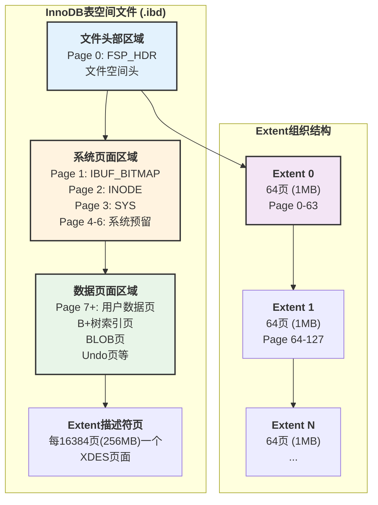

**源码位置**: `storage/innobase/include/fsp0types.h:64-69`

```cpp
/** File space extent size in pages
page size | file space extent size
----------+-----------------------
   4 KiB  | 256 pages = 1 MiB
   8 KiB  | 128 pages = 1 MiB
  16 KiB  |  64 pages = 1 MiB (默认)
  32 KiB  |  64 pages = 2 MiB
  64 KiB  |  64 pages = 4 MiB
*/
#define FSP_EXTENT_SIZE \
  static_cast<page_no_t>((UNIV_PAGE_SIZE <= (16384) \
    ? (1048576 / UNIV_PAGE_SIZE) \
    : ((UNIV_PAGE_SIZE <= (32768)) ? (2097152 / UNIV_PAGE_SIZE) \
                                   : (4194304 / UNIV_PAGE_SIZE))))
```

### 1.2 Page 0: 文件空间头部详细结构

**源码位置**: `storage/innobase/include/fsp0fsp.h:127-179`

```mermaid
graph LR
    subgraph "<b>Page 0 字节级结构 (FSP_HDR页)</b>"
        FIL_HEADER["<b>FIL Header</b><br/>38字节<br/>0-37"]
        
        FSP_HEADER["<b>FSP Header</b><br/>112字节<br/>38-149"]
        
        XDES_ARRAY["<b>XDES数组</b><br/>256个Extent描述符<br/>150-16533"]
        
        EMPTY_SPACE["<b>空闲空间</b><br/>16534-16376"]
        
        FIL_TRAILER["<b>FIL Trailer</b><br/>8字节<br/>16376-16383"]
    end
    
    subgraph "<b>FSP Header详细字段</b>"
        FSP_SPACE_ID["<b>FSP_SPACE_ID</b><br/>0-3: Space ID<br/>4字节"]
        FSP_SIZE["<b>FSP_SIZE</b><br/>8-11: 当前大小<br/>4字节"]
        FSP_FREE_LIMIT["<b>FSP_FREE_LIMIT</b><br/>12-15: 空闲限制<br/>4字节"]
        FSP_FLAGS["<b>FSP_SPACE_FLAGS</b><br/>16-19: 标志位<br/>4字节"]
        FSP_FRAG["<b>FSP_FRAG_N_USED</b><br/>20-23: 碎片页数<br/>4字节"]
        FSP_FREE["<b>FSP_FREE</b><br/>24-39: 空闲extent链表<br/>16字节"]
        FSP_FREE_FRAG["<b>FSP_FREE_FRAG</b><br/>40-55: 部分空闲链表<br/>16字节"]
        FSP_FULL_FRAG["<b>FSP_FULL_FRAG</b><br/>56-71: 完全使用链表<br/>16字节"]
        FSP_SEG_ID["<b>FSP_SEG_ID</b><br/>72-79: 下一个segment ID<br/>8字节"]
    end
    
    FIL_HEADER --> FSP_HEADER
    FSP_HEADER --> XDES_ARRAY
    XDES_ARRAY --> EMPTY_SPACE
    EMPTY_SPACE --> FIL_TRAILER
    
    FSP_HEADER --> FSP_SPACE_ID
    FSP_SPACE_ID --> FSP_SIZE
    FSP_SIZE --> FSP_FREE_LIMIT
    FSP_FREE_LIMIT --> FSP_FLAGS
    FSP_FLAGS --> FSP_FRAG
    FSP_FRAG --> FSP_FREE
    FSP_FREE --> FSP_FREE_FRAG
    FSP_FREE_FRAG --> FSP_FULL_FRAG
    FSP_FULL_FRAG --> FSP_SEG_ID
    
    style FIL_HEADER fill:#ffebee,stroke:#333,stroke-width:2px
    style FSP_HEADER fill:#e3f2fd,stroke:#333,stroke-width:2px
    style XDES_ARRAY fill:#fff3e0,stroke:#333,stroke-width:2px
    style FIL_TRAILER fill:#e8f5e8,stroke:#333,stroke-width:2px
```

**FSP Header 字节级映射表**:

| 偏移量 | 长度 | 字段名 | 数据类型 | 说明 |
|-------|-----|--------|---------|------|
| **38** | 4 | `FSP_SPACE_ID` | uint32 | 表空间ID |
| **42** | 4 | `FSP_NOT_USED` | uint32 | 未使用（历史字段） |
| **46** | 4 | `FSP_SIZE` | uint32 | 当前表空间大小（页数） |
| **50** | 4 | `FSP_FREE_LIMIT` | uint32 | 空闲列表初始化限制 |
| **54** | 4 | `FSP_SPACE_FLAGS` | uint32 | 表空间标志（压缩、格式等） |
| **58** | 4 | `FSP_FRAG_N_USED` | uint32 | FSP_FREE_FRAG中已使用页数 |
| **62** | 16 | `FSP_FREE` | FLST_BASE_NODE | 完全空闲的extent链表基节点 |
| **78** | 16 | `FSP_FREE_FRAG` | FLST_BASE_NODE | 有空闲页的extent链表 |
| **94** | 16 | `FSP_FULL_FRAG` | FLST_BASE_NODE | 完全使用的extent链表 |
| **110** | 8 | `FSP_SEG_ID` | uint64 | 下一个未使用的segment ID |
| **118** | 16 | `FSP_SEG_INODES_FULL` | FLST_BASE_NODE | 已满的inode页链表 |
| **134** | 16 | `FSP_SEG_INODES_FREE` | FLST_BASE_NODE | 有空闲的inode页链表 |

### 1.3 Extent描述符 (XDES) 结构

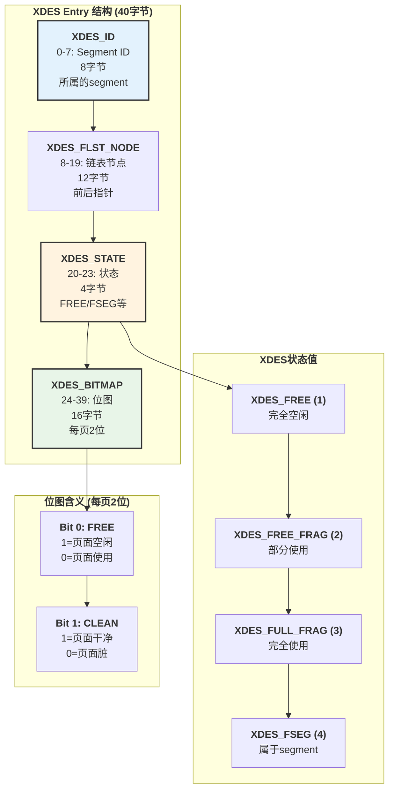

**源码位置**: `storage/innobase/include/fsp0fsp.h:240-311`

**XDES Entry 字节级映射表**:

| 偏移量 | 长度 | 字段名 | 说明 |
|-------|-----|--------|------|
| **0** | 8 | `XDES_ID` | 该extent所属的Segment ID (如果属于某个segment) |
| **8** | 12 | `XDES_FLST_NODE` | 链表节点，包含前后指针(6+6字节) |
| **20** | 4 | `XDES_STATE` | Extent状态: FREE(1), FREE_FRAG(2), FULL_FRAG(3), FSEG(4) |
| **24** | 16 | `XDES_BITMAP` | 位图，每页2位，64页需128位=16字节 |

---

## 第二部分：InnoDB页面结构

### 2.1 通用页面结构 (16KB)

```mermaid
graph TB
    subgraph "<b>InnoDB页面完整结构 (16384字节)</b>"
        subgraph "<b>FIL Header (38字节)</b>"
            FIL_CHKSUM["<b>0-3</b><br/>FIL_PAGE_SPACE_OR_CHKSUM<br/>校验和/Space ID"]
            FIL_OFFSET["<b>4-7</b><br/>FIL_PAGE_OFFSET<br/>页号"]
            FIL_PREV["<b>8-11</b><br/>FIL_PAGE_PREV<br/>前一页"]
            FIL_NEXT["<b>12-15</b><br/>FIL_PAGE_NEXT<br/>后一页"]
            FIL_LSN["<b>16-23</b><br/>FIL_PAGE_LSN<br/>最后修改LSN"]
            FIL_TYPE["<b>24-25</b><br/>FIL_PAGE_TYPE<br/>页类型"]
            FIL_FLUSH_LSN["<b>26-33</b><br/>FIL_PAGE_FILE_FLUSH_LSN<br/>刷盘LSN"]
            FIL_SPACE_ID["<b>34-37</b><br/>FIL_PAGE_SPACE_ID<br/>表空间ID"]
        end
        
        PAGE_BODY["<b>页面主体</b><br/>38-16376<br/>16338字节<br/>具体内容取决于页类型"]
        
        subgraph "<b>FIL Trailer (8字节)</b>"
            FIL_OLD_CHKSUM["<b>16376-16379</b><br/>Old Checksum<br/>旧校验和"]
            FIL_LSN_LOW["<b>16380-16383</b><br/>LSN Low 32-bit<br/>LSN低32位"]
        end
    end
    
    FIL_CHKSUM --> FIL_OFFSET
    FIL_OFFSET --> FIL_PREV
    FIL_PREV --> FIL_NEXT
    FIL_NEXT --> FIL_LSN
    FIL_LSN --> FIL_TYPE
    FIL_TYPE --> FIL_FLUSH_LSN
    FIL_FLUSH_LSN --> FIL_SPACE_ID
    FIL_SPACE_ID --> PAGE_BODY
    PAGE_BODY --> FIL_OLD_CHKSUM
    FIL_OLD_CHKSUM --> FIL_LSN_LOW
    
    style FIL_CHKSUM fill:#ffebee,stroke:#333,stroke-width:2px
    style PAGE_BODY fill:#e3f2fd,stroke:#333,stroke-width:2px
    style FIL_OLD_CHKSUM fill:#e8f5e8,stroke:#333,stroke-width:2px
```

**源码位置**: `storage/innobase/include/fil0types.h:39-119`

**FIL Header 字节级映射表**:

| 偏移量 | 长度 | 字段名 | 数据类型 | 说明 |
|-------|-----|--------|---------|------|
| **0** | 4 | `FIL_PAGE_SPACE_OR_CHKSUM` | uint32 | 新版本存储校验和，旧版本存储Space ID |
| **4** | 4 | `FIL_PAGE_OFFSET` | uint32 | 页号（Page Number） |
| **8** | 4 | `FIL_PAGE_PREV` | uint32 | 前一页页号（双向链表） |
| **12** | 4 | `FIL_PAGE_NEXT` | uint32 | 后一页页号（双向链表） |
| **16** | 8 | `FIL_PAGE_LSN` | uint64 | 页面最后修改的LSN |
| **24** | 2 | `FIL_PAGE_TYPE` | uint16 | 页面类型（见下表） |
| **26** | 8 | `FIL_PAGE_FILE_FLUSH_LSN` | uint64 | 刷盘LSN（仅Page 0使用） |
| **34** | 4 | `FIL_PAGE_SPACE_ID` | uint32 | 表空间ID |

### 2.2 页面类型详解

**源码位置**: `storage/innobase/include/fil0fil.h:1226-1320`

| 页面类型常量 | 数值 | 说明 | 用途 |
|------------|-----|------|------|
| `FIL_PAGE_TYPE_ALLOCATED` | 0 | 新分配的页 | 刚从extent分配，未初始化 |
| `FIL_PAGE_UNDO_LOG` | 2 | Undo日志页 | 存储事务回滚信息 |
| `FIL_PAGE_INODE` | 3 | Inode页 | 存储segment inode |
| `FIL_PAGE_IBUF_FREE_LIST` | 4 | Insert Buffer空闲列表 | Change Buffer管理 |
| `FIL_PAGE_IBUF_BITMAP` | 5 | Insert Buffer位图 | 跟踪可用空间 |
| `FIL_PAGE_TYPE_SYS` | 6 | 系统页 | 系统信息 |
| `FIL_PAGE_TYPE_TRX_SYS` | 7 | 事务系统页 | 事务系统数据 |
| `FIL_PAGE_TYPE_FSP_HDR` | 8 | 文件空间头 | 表空间头部（Page 0） |
| `FIL_PAGE_TYPE_XDES` | 9 | Extent描述符页 | 每256MB一个 |
| `FIL_PAGE_TYPE_BLOB` | 10 | BLOB页 | 未压缩的BLOB数据 |
| `FIL_PAGE_TYPE_ZBLOB` | 11 | 压缩BLOB第一页 | 压缩BLOB头 |
| `FIL_PAGE_TYPE_ZBLOB2` | 12 | 压缩BLOB后续页 | 压缩BLOB数据 |
| `FIL_PAGE_COMPRESSED` | 14 | 压缩页 | 透明页压缩 |
| `FIL_PAGE_ENCRYPTED` | 15 | 加密页 | 页面加密 |
| `FIL_PAGE_INDEX` | 17855 | B+树索引页 | **最常见**，存储索引数据 |
| `FIL_PAGE_RTREE` | 17854 | R树页 | 空间索引 |
| `FIL_PAGE_SDI` | 17853 | SDI索引页 | 序列化字典信息 |

### 2.3 INDEX页面详细结构

```mermaid
graph TB
    subgraph "<b>INDEX页面结构 (FIL_PAGE_INDEX)</b>"
        FIL_HDR["<b>FIL Header</b><br/>0-37<br/>38字节"]
        
        subgraph "<b>INDEX Header (36字节)</b>"
            PAGE_N_DIR_SLOTS["<b>38-39</b><br/>PAGE_N_DIR_SLOTS<br/>Page Directory槽数量"]
            PAGE_HEAP_TOP["<b>40-41</b><br/>PAGE_HEAP_TOP<br/>堆顶指针"]
            PAGE_N_HEAP["<b>42-43</b><br/>PAGE_N_HEAP<br/>堆中记录数<br/>bit15=格式标志"]
            PAGE_FREE["<b>44-45</b><br/>PAGE_FREE<br/>空闲记录链表头"]
            PAGE_GARBAGE["<b>46-47</b><br/>PAGE_GARBAGE<br/>已删除记录字节数"]
            PAGE_LAST_INSERT["<b>48-49</b><br/>PAGE_LAST_INSERT<br/>最后插入位置"]
            PAGE_DIRECTION["<b>50-51</b><br/>PAGE_DIRECTION<br/>插入方向"]
            PAGE_N_DIRECTION["<b>52-53</b><br/>PAGE_N_DIRECTION<br/>同方向插入数"]
            PAGE_N_RECS["<b>54-55</b><br/>PAGE_N_RECS<br/>用户记录数"]
            PAGE_MAX_TRX_ID["<b>56-63</b><br/>PAGE_MAX_TRX_ID<br/>最大事务ID"]
            PAGE_LEVEL["<b>64-65</b><br/>PAGE_LEVEL<br/>B+树层级"]
            PAGE_INDEX_ID["<b>66-73</b><br/>PAGE_INDEX_ID<br/>索引ID"]
        end
        
        FSEG_HDR["<b>FSEG Header (20字节)</b><br/>74-93<br/>Leaf/Non-Leaf段头"]
        
        SYSTEM_RECORDS["<b>系统记录</b><br/>94-125<br/>Infimum和Supremum"]
        
        USER_RECORDS["<b>用户记录</b><br/>126-16244<br/>实际数据记录"]
        
        FREE_SPACE["<b>空闲空间</b><br/>可变大小"]
        
        PAGE_DIRECTORY["<b>Page Directory</b><br/>16244-16375<br/>记录指针数组<br/>每项2字节"]
        
        FIL_TRAILER["<b>FIL Trailer</b><br/>16376-16383<br/>8字节"]
    end
    
    FIL_HDR --> PAGE_N_DIR_SLOTS
    PAGE_N_DIR_SLOTS --> PAGE_HEAP_TOP
    PAGE_HEAP_TOP --> PAGE_N_HEAP
    PAGE_N_HEAP --> PAGE_FREE
    PAGE_FREE --> PAGE_GARBAGE
    PAGE_GARBAGE --> PAGE_LAST_INSERT
    PAGE_LAST_INSERT --> PAGE_DIRECTION
    PAGE_DIRECTION --> PAGE_N_DIRECTION
    PAGE_N_DIRECTION --> PAGE_N_RECS
    PAGE_N_RECS --> PAGE_MAX_TRX_ID
    PAGE_MAX_TRX_ID --> PAGE_LEVEL
    PAGE_LEVEL --> PAGE_INDEX_ID
    PAGE_INDEX_ID --> FSEG_HDR
    FSEG_HDR --> SYSTEM_RECORDS
    SYSTEM_RECORDS --> USER_RECORDS
    USER_RECORDS --> FREE_SPACE
    FREE_SPACE --> PAGE_DIRECTORY
    PAGE_DIRECTORY --> FIL_TRAILER
    
    style FIL_HDR fill:#ffebee,stroke:#333,stroke-width:2px
    style PAGE_N_DIR_SLOTS fill:#e3f2fd,stroke:#333,stroke-width:2px
    style SYSTEM_RECORDS fill:#fff3e0,stroke:#333,stroke-width:2px
    style USER_RECORDS fill:#e8f5e8,stroke:#333,stroke-width:2px
    style PAGE_DIRECTORY fill:#f3e5f5,stroke:#333,stroke-width:2px
```

**源码位置**: `storage/innobase/include/page0types.h:45-89`

**INDEX Header 字节级映射表**:

| 偏移量 | 长度 | 字段名 | 说明 |
|-------|-----|--------|------|
| **38** | 2 | `PAGE_N_DIR_SLOTS` | Page Directory中槽的数量 |
| **40** | 2 | `PAGE_HEAP_TOP` | 堆中第一个空闲记录的指针 |
| **42** | 2 | `PAGE_N_HEAP` | 堆中记录数量，bit 15标识是否为COMPACT格式 |
| **44** | 2 | `PAGE_FREE` | 指向空闲记录链表的第一个记录 |
| **46** | 2 | `PAGE_GARBAGE` | 已删除记录占用的字节数 |
| **48** | 2 | `PAGE_LAST_INSERT` | 最后插入记录的位置 |
| **50** | 2 | `PAGE_DIRECTION` | 插入方向：PAGE_LEFT/PAGE_RIGHT/PAGE_NO_DIRECTION |
| **52** | 2 | `PAGE_N_DIRECTION` | 同一方向连续插入的记录数 |
| **54** | 2 | `PAGE_N_RECS` | 页面中用户记录的数量 |
| **56** | 8 | `PAGE_MAX_TRX_ID` | 修改该页的最大事务ID（仅二级索引） |
| **64** | 2 | `PAGE_LEVEL` | 页面在B+树中的层级，叶子节点=0 |
| **66** | 8 | `PAGE_INDEX_ID` | 该页所属的索引ID |

---

## 第三部分：InnoDB行记录格式

### 3.1 行格式类型对比

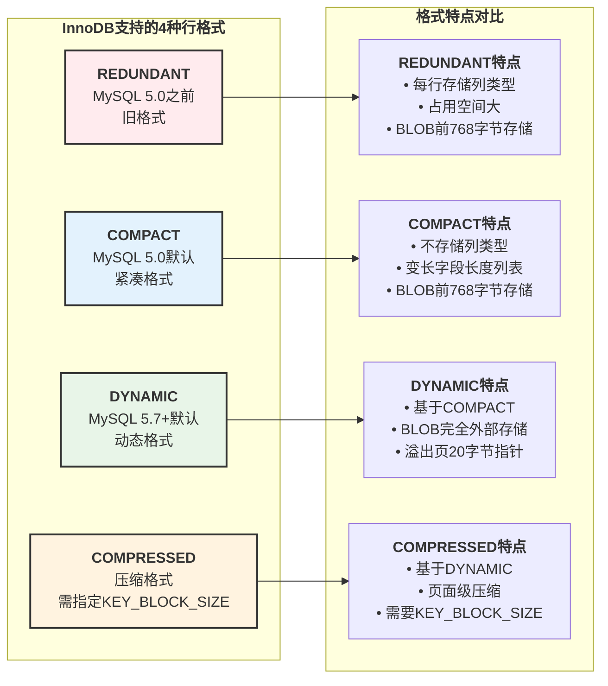

**源码位置**: `storage/innobase/include/rem0types.h:77-82`

```cpp
enum rec_format_enum {
  REC_FORMAT_REDUNDANT = 0,  /*!< REDUNDANT row format */
  REC_FORMAT_COMPACT = 1,    /*!< COMPACT row format */
  REC_FORMAT_COMPRESSED = 2, /*!< COMPRESSED row format */
  REC_FORMAT_DYNAMIC = 3     /*!< DYNAMIC row format */
};
```

### 3.2 COMPACT行格式详细结构


### 3.3 COMPACT行格式字节级示例

**示例表结构**:

```sql
CREATE TABLE user_compact (
  id INT PRIMARY KEY,
  name VARCHAR(50),
  age INT,
  email VARCHAR(100)
) ROW_FORMAT=COMPACT;

INSERT INTO user_compact VALUES (1, 'Alice', 25, 'alice@example.com');
```

**实际存储的字节序列分析**:


**字节级详细解析表**:

| 偏移 | 字节值 | 长度 | 字段 | 说明 |
|-----|-------|-----|------|------|
| **-2** | `0x11` | 1 | email长度 | 17字节（逆序第一个） |
| **-1** | `0x05` | 1 | name长度 | 5字节（逆序第二个） |
| **0** | `0x00` | 1 | NULL标志 | 无NULL列（0x00） |
| **1** | `0x00 0x00` | 2 | info/owned/heap | info=0, n_owned=0, heap_no=2 |
| **3** | `0x10 0x2B` | 2 | next_record | 指向下一条记录，偏移=-21 |
| **5** | `0x00000001` | 4 | id | 主键值=1 |
| **9** | `0x000000000539` | 6 | DB_TRX_ID | 事务ID=1337 |
| **15** | `0x82000001110110` | 7 | DB_ROLL_PTR | 回滚指针 |
| **22** | `0x00000019` | 4 | age | age=25 |
| **26** | `0x416C696365` | 5 | name | 'Alice' (UTF-8) |
| **31** | `0x616C696365...` | 17 | email | 'alice@&#8203;example.com' |

### 3.4 记录头详细位图

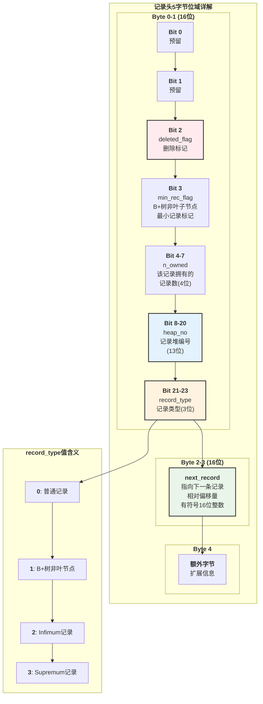

### 3.5 DYNAMIC行格式与BLOB处理

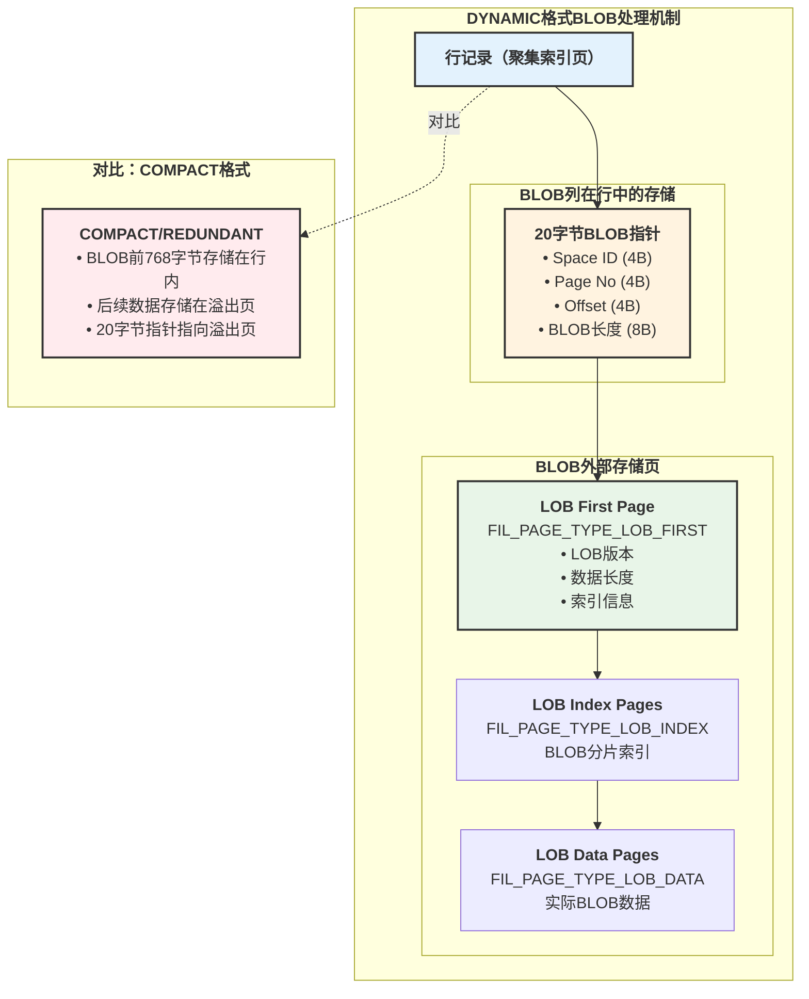

**BLOB指针20字节结构**:

| 偏移 | 长度 | 字段 | 说明 |
|-----|-----|------|------|
| **0** | 4 | Space ID | BLOB所在表空间ID |
| **4** | 4 | Page No | BLOB第一页页号 |
| **8** | 4 | Offset | 页内偏移量 |
| **12** | 8 | BLOB Length | BLOB总长度（字节） |

---

## 第四部分：数据读取流程

### 4.1 根据主键读取数据的完整流程

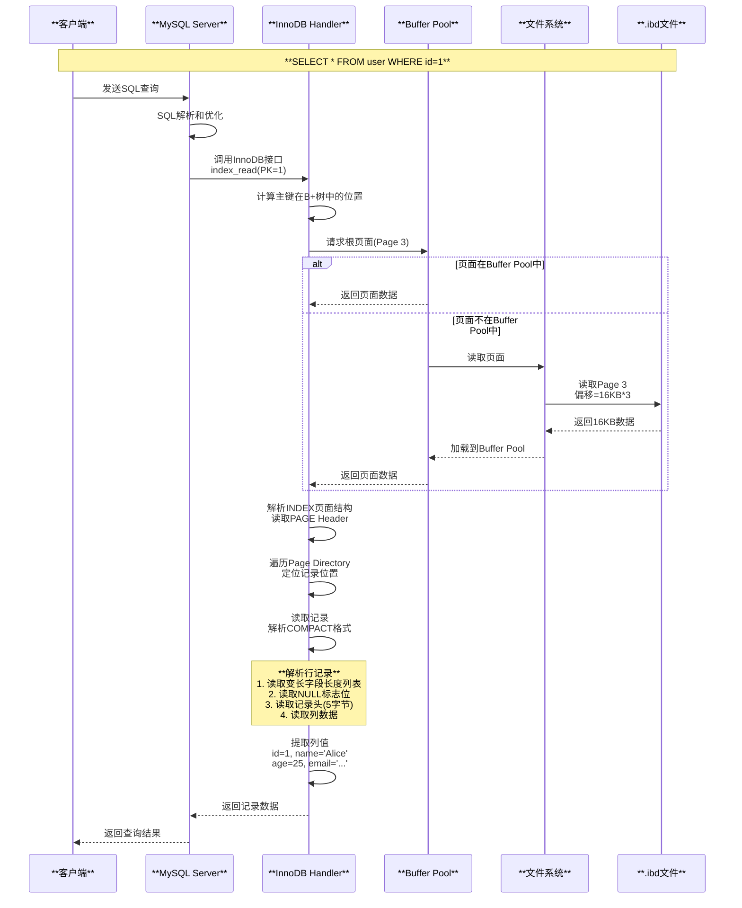

### 4.2 页面内记录查找流程

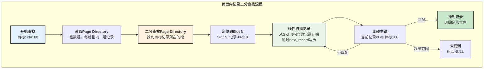

---

## 第五部分：性能优化与最佳实践

### 5.1 页面填充率与碎片化

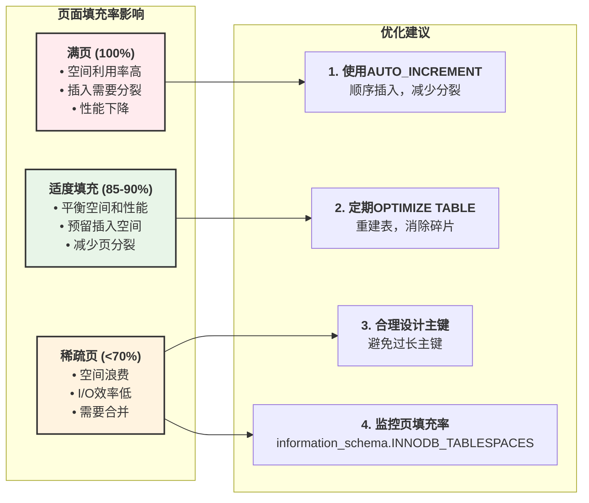

### 5.2 行格式选择建议

| 场景 | 推荐行格式 | 原因 |
|------|----------|------|
| **大BLOB/TEXT列** | DYNAMIC | BLOB完全外部存储，不占用主记录空间 |
| **压缩表** | COMPRESSED | 页面级压缩，节省空间 |
| **通用OLTP** | COMPACT | 空间效率和性能平衡 |
| **兼容性需求** | REDUNDANT | 与旧版本兼容 |
| **小VARCHAR** | COMPACT/DYNAMIC | 变长字段优化 |

### 5.3 监控与调试

```sql
-- 查看表空间信息
SELECT 
    NAME,
    FILE_SIZE / 1024 / 1024 AS size_mb,
    ALLOCATED_SIZE / 1024 / 1024 AS allocated_mb,
    FILE_FORMAT,
    ROW_FORMAT
FROM information_schema.INNODB_TABLESPACES
WHERE NAME LIKE 'your_database%';

-- 查看表统计信息
SELECT 
    TABLE_SCHEMA,
    TABLE_NAME,
    ROW_FORMAT,
    DATA_LENGTH / 1024 / 1024 AS data_mb,
    INDEX_LENGTH / 1024 / 1024 AS index_mb,
    DATA_FREE / 1024 / 1024 AS free_mb,
    (DATA_FREE / DATA_LENGTH * 100) AS fragmentation_pct
FROM information_schema.TABLES
WHERE ENGINE = 'InnoDB'
ORDER BY DATA_LENGTH DESC;

-- 查看页面类型分布
SELECT 
    PAGE_TYPE,
    COUNT(*) AS page_count,
    SUM(DATA_SIZE) / 1024 / 1024 AS size_mb
FROM information_schema.INNODB_BUFFER_PAGE
GROUP BY PAGE_TYPE
ORDER BY page_count DESC;
```

---

## 总结

### 核心要点回顾

1. **表空间文件结构**
   - Page 0存储FSP Header和XDES数组
   - Extent是1MB的连续页面组（64页×16KB）
   - XDES描述符管理Extent的分配和状态

2. **页面结构**
   - FIL Header (38B) + 页面主体 (16338B) + FIL Trailer (8B)
   - INDEX页包含Page Header、System Records、User Records、Page Directory
   - Page Directory支持二分查找，提高查询效率

3. **行记录格式**
   - COMPACT: 变长字段长度列表 + NULL标志 + 记录头 + 列数据
   - DYNAMIC: BLOB完全外部存储，主记录只存20字节指针
   - 记录头5字节包含关键元数据：heap_no、record_type、next_record等

4. **性能优化**
   - 合理选择行格式（DYNAMIC适合大BLOB）
   - 使用AUTO_INCREMENT主键减少页分裂
   - 定期OPTIMIZE TABLE消除碎片
   - 监控页面填充率和碎片率

这种精巧的存储结构设计，使得InnoDB能够在保证ACID特性的同时，实现高效的数据存储和检索。
