# MyRocks (RocksDB) 物理存储与内存结构深度解析

## 概述

本文档详细解析MySQL MyRocks存储引擎的物理存储结构和内存组织。MyRocks基于Facebook的**RocksDB**（LSM-Tree架构），提供高效的写入性能和压缩比。从**字节级别**深入分析文件格式、内存结构、以及读写流程。

**基于源码**: `storage/rocksdb/`

---

## 第一部分：MyRocks 文件组织架构

### 1.1 整体文件结构

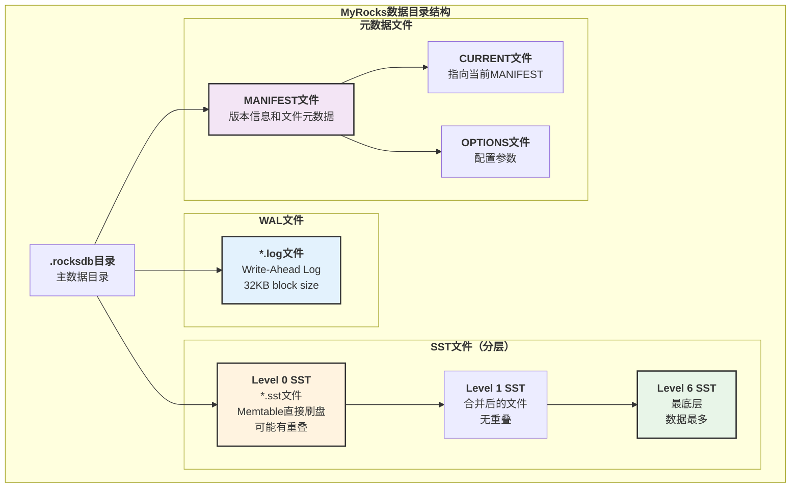

---

## 第二部分：WAL (Write-Ahead Log) 详细结构

### 2.1 WAL文件物理格式

**源码位置**: `storage/rocksdb/rocksdb/db/log_format.h:45-52`

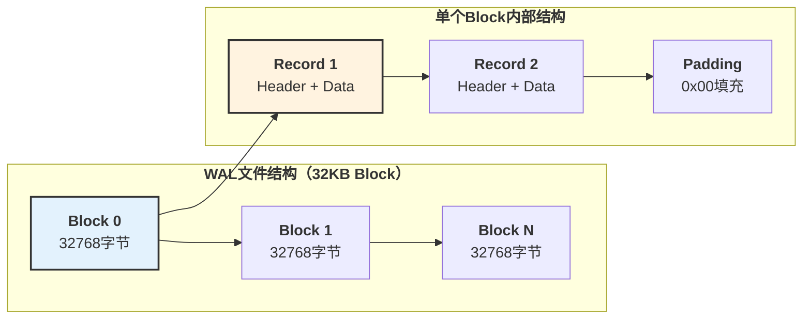

### 2.2 WAL Record 字节级结构

**源码位置**: `storage/rocksdb/rocksdb/db/log_writer.h:50-72`

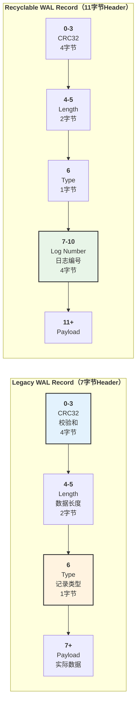

**WAL Record字节级映射表**:

| 偏移量 | 长度 | 字段名 | 数据类型 | 说明 |
|-------|-----|--------|---------|------|
| **0** | 4 | `CRC` | uint32 LE | CRC32校验和（type + payload） |
| **4** | 2 | `Length` | uint16 LE | Payload长度 |
| **6** | 1 | `Type` | uint8 | 记录类型（见下表） |
| **7** | 4 | `Log Number` | uint32 LE | **仅Recyclable格式**，日志文件编号 |
| **7/11** | N | `Payload` | bytes | 实际的WriteBatch数据 |

**WAL Record类型**:

| 类型值 | 常量名 | 说明 |
|-------|-------|------|
| **0** | `kZeroType` | 预分配文件的填充 |
| **1** | `kFullType` | 完整记录，单个block内 |
| **2** | `kFirstType` | 分片记录的第一部分 |
| **3** | `kMiddleType` | 分片记录的中间部分 |
| **4** | `kLastType` | 分片记录的最后部分 |
| **5-8** | `kRecyclable*` | 可回收格式（含Log Number） |

---

## 第三部分：SST文件详细结构

### 3.1 SST文件整体布局

```mermaid
graph TB
    subgraph "<b>SST文件完整结构</b>"
        subgraph "<b>Data Blocks</b>"
            DATA_BLOCK1["<b>Data Block 1</b><br/>KV pairs<br/>默认4KB"]
            DATA_BLOCK2["<b>Data Block 2</b><br/>KV pairs"]
            DATA_BLOCKN["<b>Data Block N</b><br/>KV pairs"]
        end
        
        COMPRESSION["<b>Compression Dict Block</b><br/>压缩字典（可选）"]
        
        META_INDEX["<b>MetaIndex Block</b><br/>指向Filter Block等"]
        
        FILTER["<b>Filter Block</b><br/>Bloom Filter<br/>加速查找"]
        
        INDEX["<b>Index Block</b><br/>Data Block索引<br/>Key -> Block Handle"]
        
        PROPERTIES["<b>Properties Block</b><br/>表属性和统计"]
        
        subgraph "<b>Footer（固定大小）</b>"
            FOOTER_MI["<b>MetaIndex Handle</b><br/>10字节"]
            FOOTER_IDX["<b>Index Handle</b><br/>10字节"]
            FOOTER_PADDING["<b>Padding</b><br/>填充"]
            FOOTER_MAGIC["<b>Magic Number</b><br/>8字节<br/>文件类型标识"]
        end
    end
    
    DATA_BLOCK1 --> DATA_BLOCK2
    DATA_BLOCK2 --> DATA_BLOCKN
    DATA_BLOCKN --> COMPRESSION
    COMPRESSION --> META_INDEX
    META_INDEX --> FILTER
    FILTER --> INDEX
    INDEX --> PROPERTIES
    PROPERTIES --> FOOTER_MI
    FOOTER_MI --> FOOTER_IDX
    FOOTER_IDX --> FOOTER_PADDING
    FOOTER_PADDING --> FOOTER_MAGIC
    
    style DATA_BLOCK1 fill:#e3f2fd,stroke:#333,stroke-width:2px
    style INDEX fill:#fff3e0,stroke:#333,stroke-width:2px
    style FOOTER_MAGIC fill:#e8f5e8,stroke:#333,stroke-width:2px
```

### 3.2 SST Footer 字节级结构

**源码位置**: `storage/rocksdb/rocksdb/table/format.h:132-180`

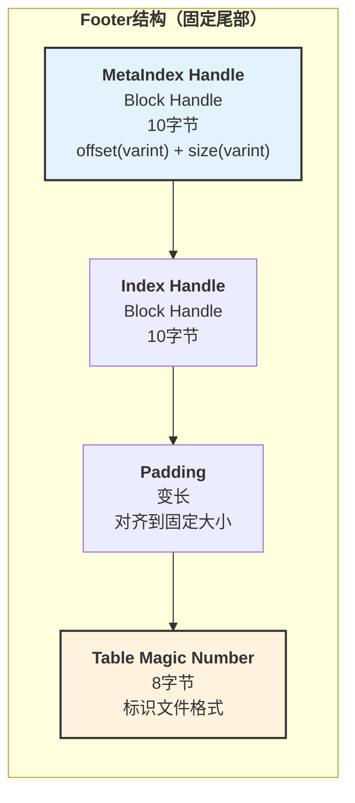

**Footer字段说明**:

| 字段 | 长度 | 说明 |
|-----|-----|------|
| `MetaIndex Block Handle` | ~10B | 指向MetaIndex Block的位置和大小 |
| `Index Block Handle` | ~10B | 指向Index Block的位置和大小 |
| Padding | 变长 | 填充至固定Footer大小 |
| `Magic Number` | 8B | 标识SST格式（Block-Based: 0x88e241b785f4cff7） |

**BlockHandle格式** (varint编码):

- **Offset**: Block在文件中的偏移量（varint64）
- **Size**: Block的大小（varint64）

### 3.3 Data Block 内部结构

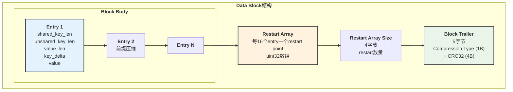

**Entry格式** (前缀压缩):

| 字段 | 编码 | 说明 |
|-----|-----|------|
| `shared_key_length` | varint32 | 与前一个key共享的前缀长度 |
| `unshared_key_length` | varint32 | 当前key的非共享部分长度 |
| `value_length` | varint32 | Value的长度 |
| `key_delta` | bytes | Key的非共享部分 |
| `value` | bytes | 实际的value数据 |

**示例**:

```text
Entry 1: key="apple", value="red"
  shared=0, unshared=5, value_len=3
  key_delta="apple", value="red"

Entry 2: key="application", value="software"
  shared=3, unshared=8, value_len=8
  key_delta="lication", value="software"
```

---

## 第四部分：MyRocks 内存结构

### 4.1 内存组件架构

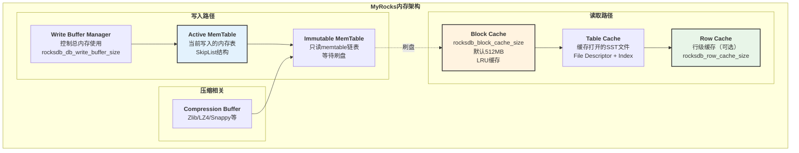

### 4.2 MemTable 结构详解

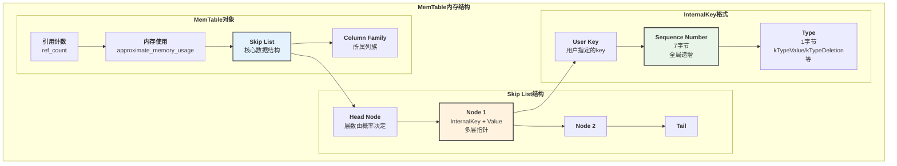

**InternalKey编码**:

```text
InternalKey = UserKey + SequenceNumber(7B) + ValueType(1B)
Total = UserKey.size() + 8 bytes
```

**ValueType枚举** (`storage/rocksdb/rocksdb/db/dbformat.h:39-74`):

| 类型值 | 常量名 | 说明 |
|-------|-------|------|
| **0x1** | `kTypeValue` | 普通value |
| **0x0** | `kTypeDeletion` | 删除标记 |
| **0x2** | `kTypeMerge` | Merge操作 |
| **0x7** | `kTypeSingleDeletion` | 单点删除 |
| **0xF** | `kTypeRangeDeletion` | 范围删除 |

### 4.3 Block Cache 详细结构

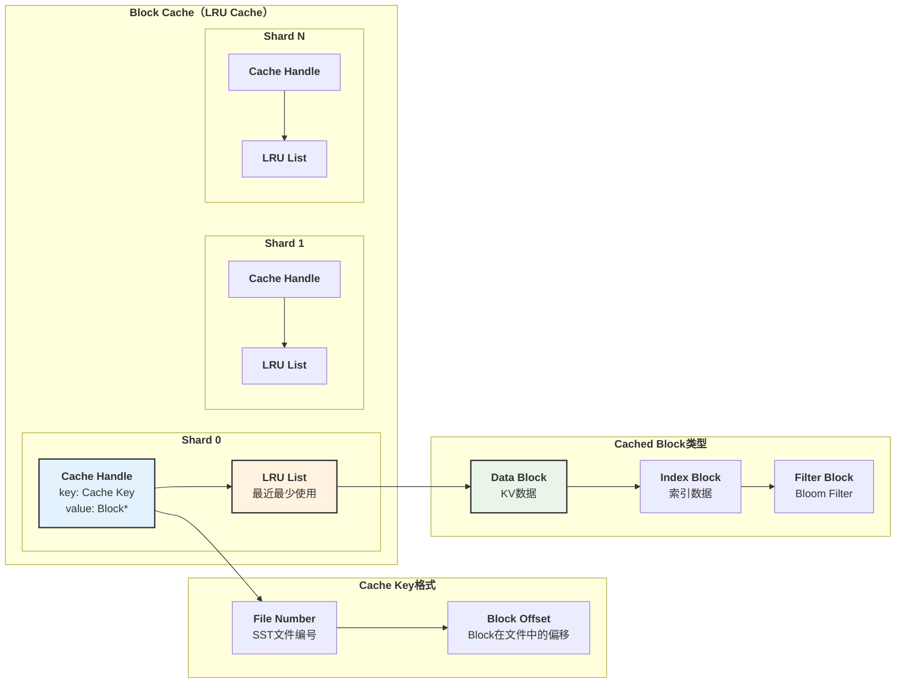

**Block Cache配置参数**:

| 参数 | 默认值 | 说明 |
|-----|-------|------|
| `rocksdb_block_cache_size` | 512MB | Block Cache总大小 |
| `rocksdb_cache_index_and_filter_blocks` | ON | 是否缓存Index和Filter |
| `rocksdb_pin_l0_filter_and_index_blocks_in_cache` | ON | L0层的Index/Filter常驻 |
| `rocksdb_cache_high_pri_pool_ratio` | 0.5 | 高优先级池比例 |

---

## 第五部分：MyRocks 读写流程

### 5.1 写入流程

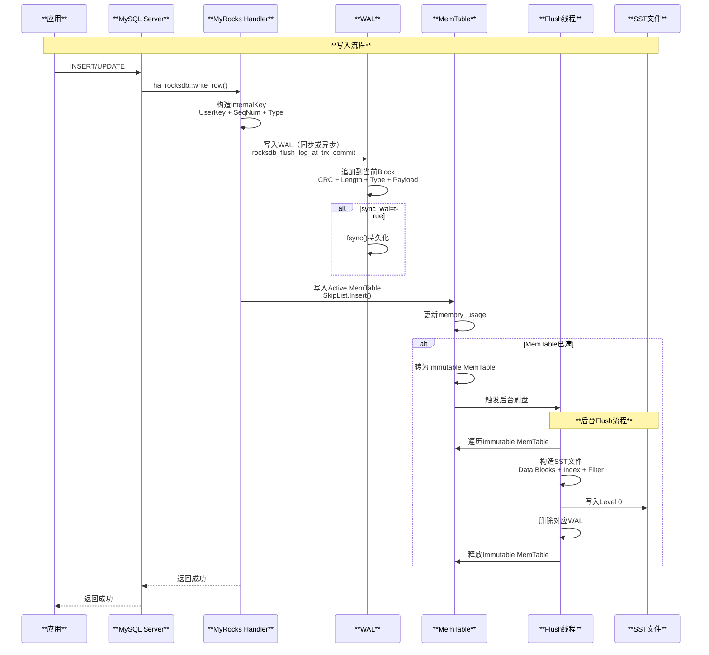

### 5.2 读取流程

```mermaid
sequenceDiagram
    participant APP as **应用**
    participant MYSQL as **MySQL Server**
    participant MYROCKS as **MyRocks Handler**
    participant MEMTABLE as **MemTable**
    participant BLOCK_CACHE as **Block Cache**
    participant SST as **SST文件**

    Note over APP,SST: **点查流程 (Get)**

    APP->>MYSQL: SELECT * WHERE pk=1
    MYSQL->>MYROCKS: ha_rocksdb::index_read()
    
    MYROCKS->>MYROCKS: 构造Lookup Key<br/>UserKey + MaxSeqNum
    
    Note over MYROCKS,MEMTABLE: **1. 查找MemTable**
    MYROCKS->>MEMTABLE: 查找Active MemTable
    
    alt 在MemTable中找到
        MEMTABLE-->>MYROCKS: 返回最新值
        MYROCKS-->>MYSQL: 返回结果
        MYSQL-->>APP: 返回行数据
    else 未找到
        MYROCKS->>MEMTABLE: 查找Immutable MemTables
        
        alt 在Immutable中找到
            MEMTABLE-->>MYROCKS: 返回值
        else 未找到
            Note over MYROCKS,SST: **2. 查找SST文件**
            
            loop Level 0 to Level 6
                MYROCKS->>BLOCK_CACHE: 查找Index Block
                
                alt Index在Cache中
                    BLOCK_CACHE-->>MYROCKS: 返回Index
                else Index不在Cache
                    MYROCKS->>SST: 读取Index Block
                    SST-->>MYROCKS: Index数据
                    MYROCKS->>BLOCK_CACHE: 缓存Index
                end
                
                MYROCKS->>MYROCKS: 二分查找Index<br/>定位Data Block
                
                MYROCKS->>BLOCK_CACHE: 查找Data Block
                
                alt Data在Cache中
                    BLOCK_CACHE-->>MYROCKS: 返回Block
                else Data不在Cache
                    MYROCKS->>SST: 读取Data Block
                    SST-->>MYROCKS: 解压缩Data
                    MYROCKS->>BLOCK_CACHE: 缓存Data Block
                end
                
                MYROCKS->>MYROCKS: Block内二分查找
                
                alt 找到key
                    MYROCKS-->>MYSQL: 返回值
                    break
                end
            end
        end
    end
```

### 5.3 Compaction 流程

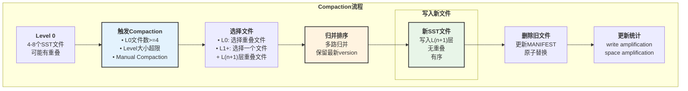

---

## 第六部分：性能优化与监控

### 6.1 关键性能参数

**写入优化**:

```sql
-- MemTable和WAL设置
SET GLOBAL rocksdb_db_write_buffer_size = 4294967296;  -- 4GB
SET GLOBAL rocksdb_write_buffer_size = 134217728;      -- 128MB per CF
SET GLOBAL rocksdb_max_write_buffer_number = 4;        -- Immutable数量
SET GLOBAL rocksdb_flush_log_at_trx_commit = 0;        -- 性能优先

-- WAL设置
SET GLOBAL rocksdb_wal_size_limit_mb = 0;  -- 不限制WAL大小
SET GLOBAL rocksdb_wal_ttl_seconds = 0;    -- WAL不过期
```

**读取优化**:

```sql
-- Block Cache设置
SET GLOBAL rocksdb_block_cache_size = 2147483648;  -- 2GB
SET GLOBAL rocksdb_cache_index_and_filter_blocks = 1;
SET GLOBAL rocksdb_pin_l0_filter_and_index_blocks_in_cache = 1;

-- Row Cache（可选）
SET GLOBAL rocksdb_row_cache_size = 1073741824;  -- 1GB

-- Bloom Filter
SET GLOBAL rocksdb_bloom_bits_per_key = 10;  -- 每key 10 bits
```

**Compaction优化**:

```sql
-- Compaction线程数
SET GLOBAL rocksdb_max_background_compactions = 4;
SET GLOBAL rocksdb_max_background_flushes = 2;

-- Level配置
SET GLOBAL rocksdb_level0_file_num_compaction_trigger = 4;
SET GLOBAL rocksdb_level0_slowdown_writes_trigger = 20;
SET GLOBAL rocksdb_level0_stop_writes_trigger = 36;
```

### 6.2 监控指标

```sql
-- 查看RocksDB统计信息
SELECT * FROM information_schema.ROCKSDB_DBSTATS;

-- 查看SST文件分布
SELECT * FROM information_schema.ROCKSDB_SST_PROPS;

-- 查看Compaction统计
SELECT * FROM information_schema.ROCKSDB_COMPACTION_STATS;

-- 关键指标监控
SHOW STATUS LIKE 'rocksdb_block_cache%';      -- Block Cache命中率
SHOW STATUS LIKE 'rocksdb_memtable%';         -- MemTable使用情况
SHOW STATUS LIKE 'rocksdb_num_keys_%';        -- Key统计
SHOW STATUS LIKE 'rocksdb_compaction_%';      -- Compaction统计
SHOW STATUS LIKE 'rocksdb_wal_%';             -- WAL统计
```

**关键指标**:

| 指标 | 说明 | 优化目标 |
|-----|------|---------|
| `rocksdb_block_cache_hit` | Block Cache命中次数 | 命中率>95% |
| `rocksdb_memtable_hit` | MemTable命中次数 | 越高越好 |
| `rocksdb_l0_num_files` | Level 0文件数 | <10个 |
| `rocksdb_compaction_pending` | 待Compaction文件数 | <50 |
| `rocksdb_write_stall_us` | 写入停顿时间 | 越少越好 |
| `rocksdb_wal_bytes` | WAL写入字节数 | 监控增长 |

### 6.3 LSM-Tree特性分析

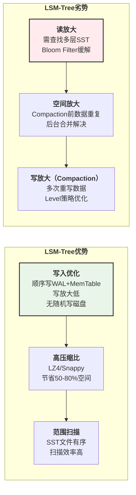

---

## 总结

### 核心要点回顾

**文件结构**:

- **WAL文件**: 32KB block，7/11字节header，顺序写入
- **SST文件**: 分层组织（L0-L6），Footer + Index + Data Blocks + Filter
- **MANIFEST**: 版本控制和文件元数据管理

**内存结构**:

- **MemTable**: SkipList实现，InternalKey = UserKey + SeqNum + Type
- **Block Cache**: LRU缓存，分Shard减少锁竞争
- **Write Buffer Manager**: 统一管理内存使用

**读写流程**:

- **写入**: WAL → MemTable → Immutable → Flush to L0
- **读取**: MemTable → Block Cache → SST (L0→L6)
- **Compaction**: 归并排序，消除重复，维护LSM-Tree

**性能特点**:

- **写入优化**: 顺序写，无随机写磁盘
- **读放大**: 多层查找，Bloom Filter和Cache优化
- **空间效率**: 高压缩比，Compaction消除冗余

**适用场景**:

- **写多读少**: 日志、时序数据、监控数据
- **范围查询**: 有序数据扫描
- **大数据量**: TB级别数据存储

MyRocks的LSM-Tree架构，为MySQL提供了高吞吐量的写入能力和优秀的压缩率，是OLTP和时序数据的理想选择。
