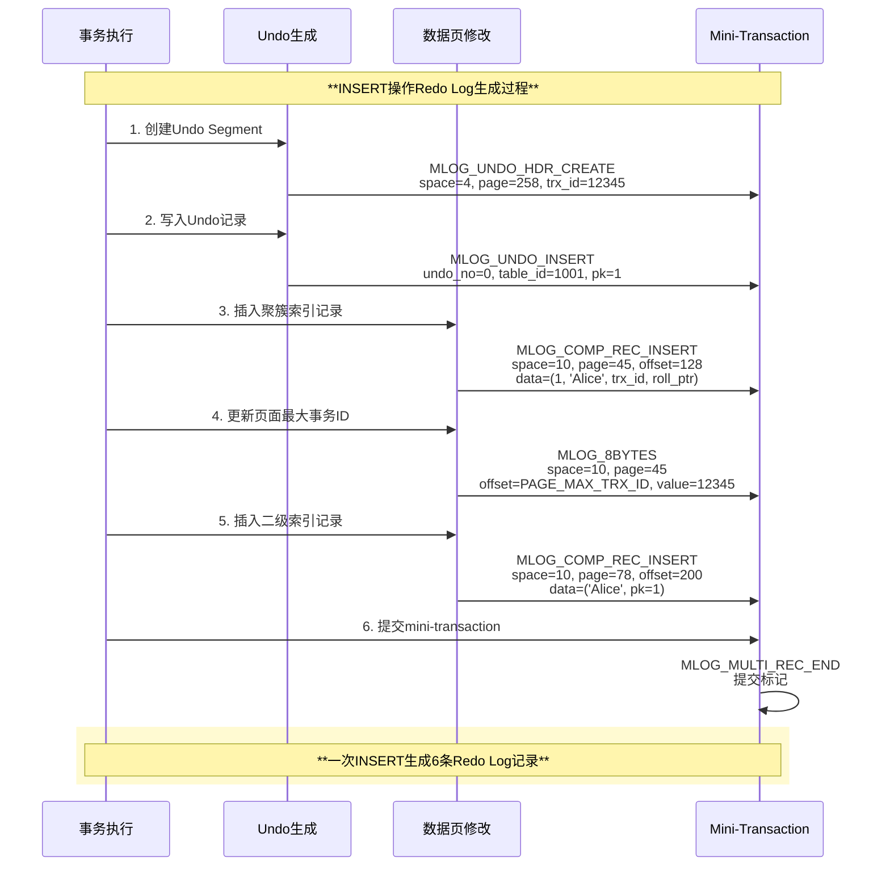
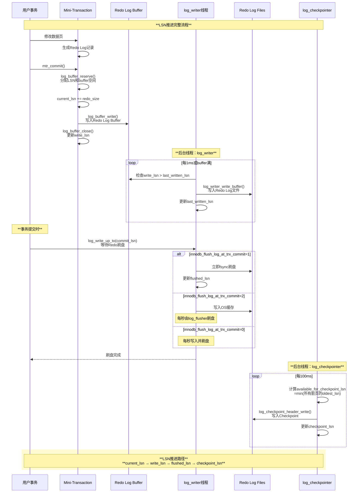
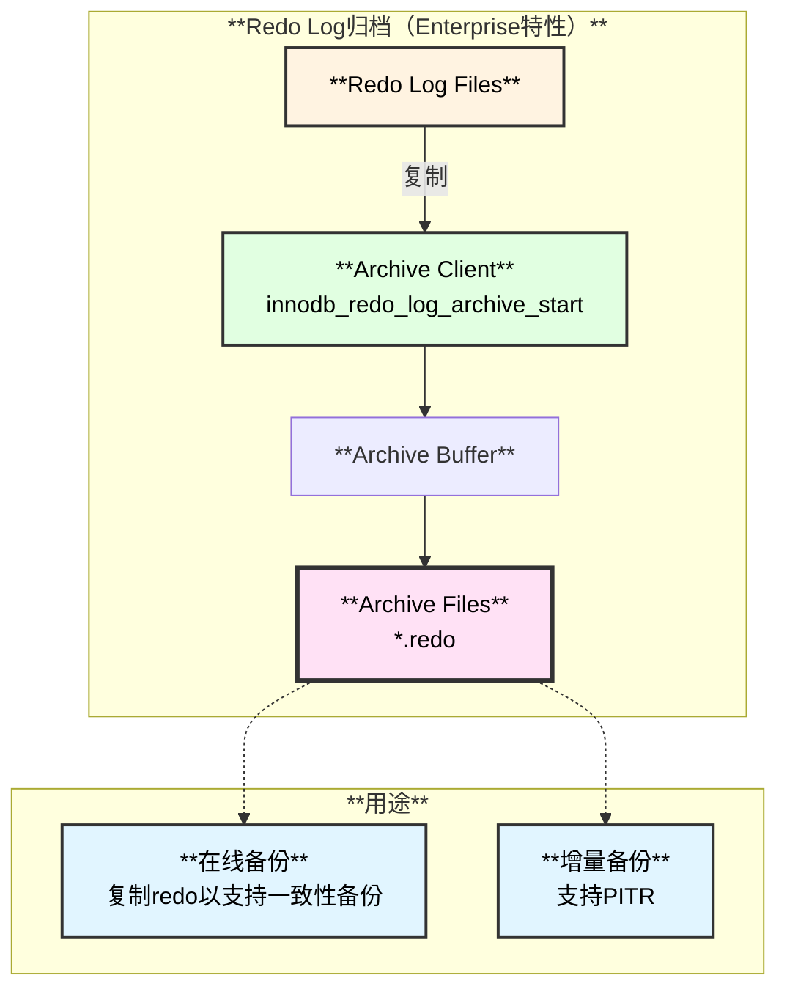
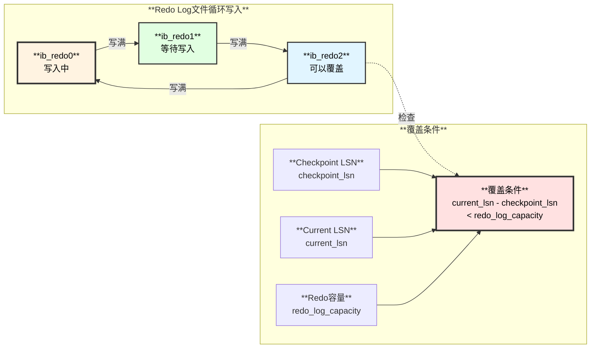
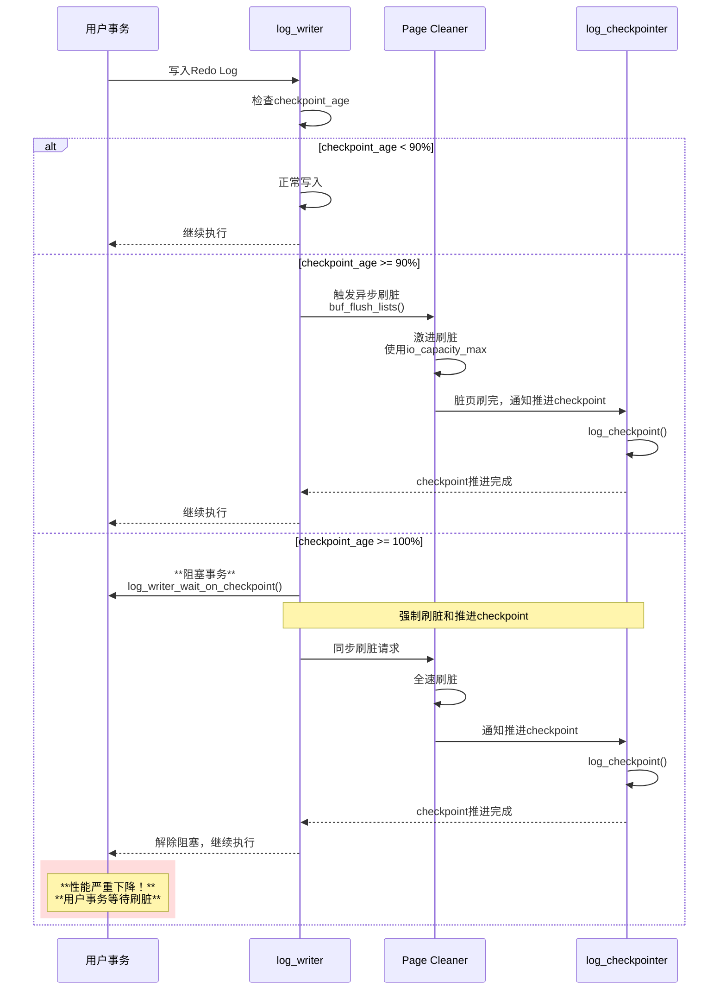
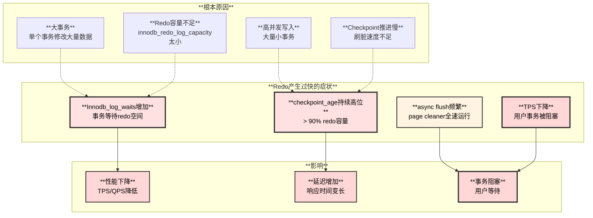
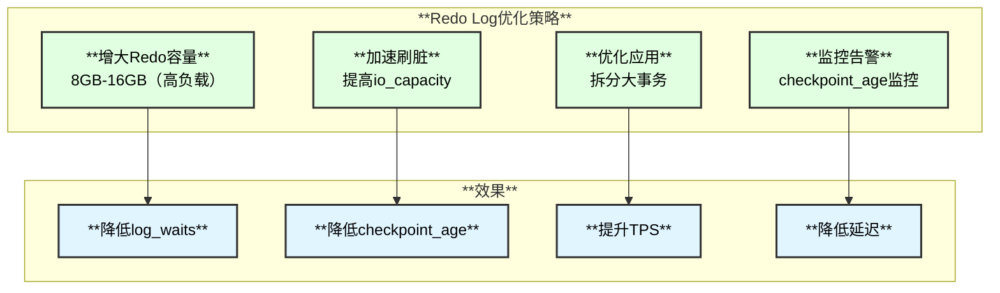

# MySQL 8.4.3 Redo Log详解

**版本**：基于 MySQL 8.4.3 / Percona Server  
**文档日期**：2025-11-09

---

## 1. Redo Log概述

### 1.1 什么是Redo Log

**Redo Log（重做日志）**是InnoDB存储引擎的核心组件，用于实现事务的持久性（Durability）和崩溃恢复。它记录了数据页的物理修改操作，遵循**WAL（Write-Ahead Logging）**原则：

- **先写Redo Log，再修改数据页**
- **事务提交时，只需保证Redo Log持久化**
- **数据页可以异步刷盘**

### 1.2 Redo Log架构图

```mermaid
graph TB
    subgraph "**InnoDB Redo Log系统**"
        USER["**用户事务**<br/>INSERT/UPDATE/DELETE"]
        MTR["**Mini-Transaction**<br/>mtr_t"]
        LOG_BUF["**Redo Log Buffer**<br/>log_sys->buf"]
        LOG_FILES["**Redo Log Files**<br/>ib_redo0, ib_redo1, ..."]
        
        WRITER["**log_writer线程**<br/>写入磁盘"]
        FLUSHER["**log_flusher线程**<br/>刷盘"]
        CHECKPOINTER["**log_checkpointer线程**<br/>推进checkpoint"]
        
        USER --> MTR
        MTR -->|mtr_commit| LOG_BUF
        LOG_BUF --> WRITER
        WRITER --> LOG_FILES
        WRITER --> FLUSHER
        FLUSHER --> LOG_FILES
        LOG_FILES -.-> CHECKPOINTER
    end
    
    subgraph "**LSN时间线**"
        LSN1["**Current LSN**<br/>当前最新LSN"]
        LSN2["**Write LSN**<br/>已写入buffer的LSN"]
        LSN3["**Flushed LSN**<br/>已刷盘的LSN"]
        LSN4["**Checkpoint LSN**<br/>checkpoint位点"]
        
        LSN1 --> LSN2
        LSN2 --> LSN3
        LSN3 --> LSN4
    end
    
    style USER fill:#e1f5ff,stroke:#333,stroke-width:2px,color:#000
    style MTR fill:#fff3e1,stroke:#333,stroke-width:3px,color:#000
    style LOG_BUF fill:#fff9d7,stroke:#333,stroke-width:2px,color:#000
    style LOG_FILES fill:#ffe1f5,stroke:#333,stroke-width:3px,color:#000
    style WRITER fill:#e1ffe1,stroke:#333,stroke-width:2px,color:#000
    style FLUSHER fill:#e1ffe1,stroke:#333,stroke-width:2px,color:#000
    style CHECKPOINTER fill:#e1ffe1,stroke:#333,stroke-width:2px,color:#000
```



---

## 2. Redo Log类型定义

### 2.1 Redo Log类型枚举

InnoDB定义了77种Redo Log类型（`storage/innobase/include/mtr0types.h:63`）：

```c
enum mlog_id_t {
  // ========== 基础类型（1-8字节写入） ==========
  MLOG_1BYTE = 1,              // 写入1字节
  MLOG_2BYTES = 2,             // 写入2字节
  MLOG_4BYTES = 4,             // 写入4字节
  MLOG_8BYTES = 8,             // 写入8字节
  
  // ========== 记录操作（ROW_FORMAT=REDUNDANT） ==========
  MLOG_REC_INSERT_8027 = 9,    // 插入记录（旧格式）
  MLOG_REC_CLUST_DELETE_MARK_8027 = 10,  // 标记聚簇索引删除
  MLOG_REC_SEC_DELETE_MARK = 11,         // 标记二级索引删除
  MLOG_REC_UPDATE_IN_PLACE_8027 = 13,    // 原地更新记录
  MLOG_REC_DELETE_8027 = 14,             // 删除记录
  
  // ========== 列表操作 ==========
  MLOG_LIST_END_DELETE_8027 = 15,        // 删除列表末尾
  MLOG_LIST_START_DELETE_8027 = 16,      // 删除列表开头
  MLOG_LIST_END_COPY_CREATED_8027 = 17,  // 复制列表末尾
  
  // ========== 页面操作 ==========
  MLOG_PAGE_REORGANIZE_8027 = 18,  // 页面重组织
  MLOG_PAGE_CREATE = 19,           // 创建页面
  
  // ========== Undo Log操作 ==========
  MLOG_UNDO_INSERT = 20,           // 插入Undo记录
  MLOG_UNDO_ERASE_END = 21,        // 擦除Undo末尾
  MLOG_UNDO_INIT = 22,             // 初始化Undo页面
  MLOG_UNDO_HDR_REUSE = 24,        // 重用Undo Header
  MLOG_UNDO_HDR_CREATE = 25,       // 创建Undo Header
  
  // ========== 其他操作 ==========
  MLOG_REC_MIN_MARK = 26,          // 标记最小记录
  MLOG_IBUF_BITMAP_INIT = 27,      // 初始化Insert Buffer位图
  MLOG_INIT_FILE_PAGE = 29,        // 初始化文件页
  MLOG_WRITE_STRING = 30,          // 写入字符串（任意长度数据）
  MLOG_MULTI_REC_END = 31,         // 多记录结束标记（提交标记）
  MLOG_DUMMY_RECORD = 32,          // 占位记录
  
  // ========== 文件操作 ==========
  MLOG_FILE_CREATE = 33,           // 创建文件
  MLOG_FILE_RENAME = 34,           // 重命名文件
  MLOG_FILE_DELETE = 35,           // 删除文件
  MLOG_FILE_EXTEND = 65,           // 扩展文件
  
  // ========== 压缩格式（COMPACT） ==========
  MLOG_COMP_REC_MIN_MARK = 36,     // 压缩格式最小记录标记
  MLOG_COMP_PAGE_CREATE = 37,      // 创建压缩页面
  MLOG_COMP_REC_INSERT_8027 = 38,  // 插入压缩记录
  MLOG_COMP_REC_CLUST_DELETE_MARK_8027 = 39,
  MLOG_COMP_REC_SEC_DELETE_MARK = 40,
  MLOG_COMP_REC_UPDATE_IN_PLACE_8027 = 41,
  MLOG_COMP_REC_DELETE_8027 = 42,
  MLOG_COMP_LIST_END_DELETE_8027 = 43,
  MLOG_COMP_LIST_START_DELETE_8027 = 44,
  MLOG_COMP_LIST_END_COPY_CREATED_8027 = 45,
  MLOG_COMP_PAGE_REORGANIZE_8027 = 46,
  
  // ========== 压缩页操作 ==========
  MLOG_ZIP_WRITE_NODE_PTR = 48,    // 写B树节点指针
  MLOG_ZIP_WRITE_BLOB_PTR = 49,    // 写BLOB指针
  MLOG_ZIP_WRITE_HEADER = 50,      // 写页头
  MLOG_ZIP_PAGE_COMPRESS = 51,     // 压缩页面
  MLOG_ZIP_PAGE_COMPRESS_NO_DATA_8027 = 52,
  MLOG_ZIP_PAGE_REORGANIZE_8027 = 53,
  
  // ========== R-Tree索引 ==========
  MLOG_PAGE_CREATE_RTREE = 57,     // 创建R-Tree页面
  MLOG_COMP_PAGE_CREATE_RTREE = 58,
  
  // ========== MySQL 8.0+新增类型 ==========
  MLOG_INIT_FILE_PAGE2 = 59,       // 初始化文件页（新版本）
  MLOG_INDEX_LOAD = 61,            // 索引加载（ALTER TABLE）
  MLOG_TABLE_DYNAMIC_META = 62,    // 表动态元数据
  
  // ========== SDI（序列化字典信息） ==========
  MLOG_PAGE_CREATE_SDI = 63,       // 创建SDI页面
  MLOG_COMP_PAGE_CREATE_SDI = 64,
  
  // ========== 测试类型 ==========
  MLOG_TEST = 66,                  // 测试专用
  
  // ========== MySQL 8.0优化后的类型 ==========
  MLOG_REC_INSERT = 67,            // 插入记录（新格式）
  MLOG_REC_CLUST_DELETE_MARK = 68, // 标记聚簇索引删除（新）
  MLOG_REC_DELETE = 69,            // 删除记录（新）
  MLOG_REC_UPDATE_IN_PLACE = 70,   // 原地更新（新）
  MLOG_LIST_END_COPY_CREATED = 71,
  MLOG_PAGE_REORGANIZE = 72,
  MLOG_ZIP_PAGE_REORGANIZE = 73,
  MLOG_ZIP_PAGE_COMPRESS_NO_DATA = 74,
  MLOG_LIST_END_DELETE = 75,
  MLOG_LIST_START_DELETE = 76,
  
  MLOG_BIGGEST_TYPE = MLOG_LIST_START_DELETE  // 最大类型值
};
```

### 2.2 Redo Log类型分类表

| **分类** | **类型** | **ID范围** | **用途** |
|---------|---------|-----------|---------|
| **基础写入** | `MLOG_1BYTE`, `MLOG_2BYTES`, `MLOG_4BYTES`, `MLOG_8BYTES` | 1-8 | 写入固定字节数 |
| **记录操作** | `MLOG_REC_INSERT`, `MLOG_REC_DELETE`, `MLOG_REC_UPDATE_IN_PLACE` | 67-70 | 表记录增删改 |
| **Undo操作** | `MLOG_UNDO_INSERT`, `MLOG_UNDO_HDR_CREATE`, `MLOG_UNDO_INIT` | 20-25 | Undo Log管理 |
| **页面操作** | `MLOG_PAGE_CREATE`, `MLOG_PAGE_REORGANIZE`, `MLOG_INIT_FILE_PAGE2` | 19, 59, 72 | 页面生命周期 |
| **通用写入** | `MLOG_WRITE_STRING` | 30 | 任意长度数据写入 |
| **提交标记** | `MLOG_MULTI_REC_END` | 31 | mini-transaction结束 |
| **文件操作** | `MLOG_FILE_CREATE`, `MLOG_FILE_DELETE`, `MLOG_FILE_EXTEND` | 33-35, 65 | 文件系统操作 |
| **压缩页** | `MLOG_ZIP_*` | 48-53, 73-74 | 压缩页特有操作 |

---

## 3. Redo Log样例详解

### 3.1 INSERT操作的Redo Log

**SQL语句：**

```sql
INSERT INTO t1 (id, name) VALUES (1, 'Alice');
```

**生成的Redo Log记录：**



**具体Redo Log内容（逻辑视图）：**

```
LSN: 123456780
Type: MLOG_UNDO_HDR_CREATE (25)
Space ID: 4 (undo tablespace)
Page No: 258
Offset: 0
Data: [trx_id=12345, undo_no=0, ...]

LSN: 123456850
Type: MLOG_UNDO_INSERT (20)
Space ID: 4
Page No: 258
Offset: 100
Data: [undo record: DELETE FROM t1 WHERE id=1]

LSN: 123456920
Type: MLOG_COMP_REC_INSERT (67)
Space ID: 10 (user tablespace)
Page No: 45 (clustered index leaf page)
Offset: 128
Data: [record: id=1, name='Alice', trx_id=12345, roll_ptr=...]

LSN: 123457000
Type: MLOG_8BYTES (8)
Space ID: 10
Page No: 45
Offset: PAGE_MAX_TRX_ID (58)
Data: 0x0000000000003039 (12345)

LSN: 123457080
Type: MLOG_COMP_REC_INSERT (67)
Space ID: 10
Page No: 78 (secondary index leaf page)
Offset: 200
Data: [index record: name='Alice', pk=1]

LSN: 123457150
Type: MLOG_MULTI_REC_END (31)
```

### 3.2 UPDATE操作的Redo Log

**SQL语句：**

```sql
UPDATE t1 SET name = 'Bob' WHERE id = 1;
```

**生成的Redo Log记录：**

```
LSN: 123458000
Type: MLOG_UNDO_INSERT (20)
Space ID: 4
Page No: 258
Offset: 150
Data: [undo record: UPDATE t1 SET name='Alice' WHERE id=1]

LSN: 123458080
Type: MLOG_REC_UPDATE_IN_PLACE (70)
Space ID: 10
Page No: 45
Offset: 128
Old Data: [name='Alice']
New Data: [name='Bob']
Update Vector: [field_no=1, old_len=5, new_len=3]

LSN: 123458160
Type: MLOG_8BYTES (8)
Space ID: 10
Page No: 45
Offset: PAGE_MAX_TRX_ID
Data: 0x000000000000303A (12346)

LSN: 123458240
Type: MLOG_REC_SEC_DELETE_MARK (11)
Space ID: 10
Page No: 78
Offset: 200
Data: [mark delete: name='Alice', pk=1]

LSN: 123458320
Type: MLOG_COMP_REC_INSERT (67)
Space ID: 10
Page No: 78
Offset: 250
Data: [new index record: name='Bob', pk=1]

LSN: 123458400
Type: MLOG_MULTI_REC_END (31)
```

### 3.3 DELETE操作的Redo Log

**SQL语句：**

```sql
DELETE FROM t1 WHERE id = 1;
```

**生成的Redo Log记录：**

```
LSN: 123459000
Type: MLOG_UNDO_INSERT (20)
Space ID: 4
Page No: 258
Offset: 200
Data: [undo record: INSERT INTO t1 VALUES (1, 'Bob')]

LSN: 123459080
Type: MLOG_REC_CLUST_DELETE_MARK (68)
Space ID: 10
Page No: 45
Offset: 128
Data: [mark delete bit, update trx_id=12347]

LSN: 123459160
Type: MLOG_REC_SEC_DELETE_MARK (11)
Space ID: 10
Page No: 78
Offset: 250
Data: [mark delete: name='Bob', pk=1]

LSN: 123459240
Type: MLOG_MULTI_REC_END (31)
```

### 3.4 COMMIT操作的Redo Log

**SQL语句：**

```sql
COMMIT;
```

**生成的Redo Log记录：**

```
LSN: 123460000
Type: MLOG_1BYTE (1)
Space ID: 4
Page No: 258
Offset: TRX_UNDO_STATE (0)
Old Value: 0x01 (TRX_UNDO_ACTIVE)
New Value: 0x04 (TRX_UNDO_TO_PURGE)

LSN: 123460080
Type: MLOG_MULTI_REC_END (31)
[Commit标记]
```

---

## 4. Redo Log推进机制

### 4.1 LSN推进流程图



### 4.2 LSN关键点详解

| **LSN类型** | **含义** | **更新时机** | **代码位置** |
|-----------|---------|------------|------------|
| **`log.sn`** | 当前最新的序列号（Sequence Number） | mtr_commit时递增 | `log0buf.cc:log_buffer_reserve()` |
| **`log.write_lsn`** | 已写入Redo Log Buffer的LSN | mtr_commit时更新 | `log0buf.cc:log_buffer_close()` |
| **`log.flushed_to_disk_lsn`** | 已刷盘的LSN | log_writer/log_flusher刷盘后更新 | `log0write.cc:log_writer_write_buffer()` |
| **`log.last_checkpoint_lsn`** | Checkpoint LSN | log_checkpointer推进checkpoint后更新 | `log0chkp.cc:log_checkpoint()` |

### 4.3 LSN推进代码路径

**完整调用链：**

```
1. 事务修改数据
   row_ins_clust_index_entry()  // row0ins.cc
   └─> page_cur_tuple_insert()  // page0cur.cc
       └─> mlog_write_ulint(..., MLOG_COMP_REC_INSERT, mtr)
           └─> mtr->m_log.push(log_record)  // 记录到mtr的log缓冲

2. Mini-transaction提交
   mtr_t::commit()  // mtr0mtr.cc:400
   └─> mtr_t::Command::execute()
       ├─> log_buffer_reserve(log, len)  // log0buf.cc:350
       │   ├─> log.sn += len  // 分配LSN
       │   └─> 返回(start_lsn, end_lsn)
       │
       ├─> log_buffer_write(log, str, str_len, start_lsn)  // log0buf.cc:500
       │   └─> 将redo记录复制到log buffer
       │
       └─> log_buffer_close(log, end_lsn)  // log0buf.cc:600
           └─> log.write_lsn = end_lsn  // 更新write_lsn

3. log_writer线程（后台持续运行）
   log_writer()  // log0write.cc:1500
   └─> while (srv_shutdown_state < SRV_SHUTDOWN_CLEANUP)
       ├─> 等待log.write_lsn > log.last_written_lsn
       ├─> log_writer_write_buffer(log)  // log0write.cc:1200
       │   ├─> pwrite(log_file, buffer, size, offset)
       │   └─> log.last_written_lsn = new_write_lsn
       │
       └─> std::this_thread::sleep_for(1ms)

4. 事务提交等待刷盘
   trx_commit_complete_for_mysql(trx)  // trx0trx.cc:2560
   └─> log_write_up_to(log, commit_lsn, true)  // log0write.cc:1800
       ├─> 等待log.flushed_to_disk_lsn >= commit_lsn
       ├─> 如果innodb_flush_log_at_trx_commit=1:
       │   └─> log_writer_wait_on_consumer()
       │       └─> 唤醒log_flusher线程
       └─> 返回（事务提交完成）

5. log_flusher线程（根据配置刷盘）
   log_flusher()  // log0write.cc:2000
   └─> while (srv_shutdown_state < SRV_SHUTDOWN_CLEANUP)
       ├─> 等待fsync请求
       ├─> log_data_blocks_flush(log)  // log0write.cc:1100
       │   ├─> fsync(log_file)  // 刷盘
       │   └─> log.flushed_to_disk_lsn = new_flushed_lsn
       │
       └─> std::this_thread::sleep_for(100ms)

6. log_checkpointer线程（推进checkpoint）
   log_checkpointer()  // log0chkp.cc:500
   └─> while (srv_shutdown_state < SRV_SHUTDOWN_CLEANUP)
       ├─> buf_pool_get_oldest_modification_approx()
       │   └─> 返回oldest_lsn（所有脏页的最小LSN）
       │
       ├─> log_checkpoint(log, oldest_lsn)  // log0chkp.cc:300
       │   ├─> log_checkpoint_header_write(log, checkpoint_lsn)
       │   └─> log.last_checkpoint_lsn = checkpoint_lsn
       │
       └─> std::this_thread::sleep_for(100ms)
```

---

## 5. Redo Log解析与归档

### 5.1 Redo Log解析函数

**恢复时解析Redo Log的核心函数（`log0recv.cc`）：**

```cpp
// 主解析函数
const byte *recv_parse_or_apply_log_rec_body(
    mlog_id_t type,       // Redo类型
    byte *ptr,            // Redo记录指针
    byte *end_ptr,        // Redo记录结束指针
    space_id_t space_id,  // 表空间ID
    page_no_t page_no,    // 页号
    buf_block_t *block,   // 页面Block（恢复时）
    mtr_t *mtr)           // Mini-transaction
{
  switch (type) {
    case MLOG_1BYTE:
      return mlog_parse_nbytes(MLOG_1BYTE, ptr, end_ptr, block, mtr);
      
    case MLOG_2BYTES:
      return mlog_parse_nbytes(MLOG_2BYTES, ptr, end_ptr, block, mtr);
      
    case MLOG_4BYTES:
      return mlog_parse_nbytes(MLOG_4BYTES, ptr, end_ptr, block, mtr);
      
    case MLOG_8BYTES:
      return mlog_parse_nbytes(MLOG_8BYTES, ptr, end_ptr, block, mtr);
      
    case MLOG_WRITE_STRING:
      return mlog_parse_string(ptr, end_ptr, block, mtr);
      
    case MLOG_REC_INSERT:
      return page_cur_parse_insert_rec(false, ptr, end_ptr, block, mtr);
      
    case MLOG_REC_CLUST_DELETE_MARK:
      return btr_cur_parse_del_mark_set_clust_rec(ptr, end_ptr, block, mtr);
      
    case MLOG_REC_UPDATE_IN_PLACE:
      return btr_cur_parse_update_in_place(ptr, end_ptr, block, mtr);
      
    case MLOG_UNDO_INSERT:
      return trx_undo_parse_add_undo_rec(ptr, end_ptr, block, mtr);
      
    case MLOG_UNDO_HDR_CREATE:
      return trx_undo_parse_page_header(type, ptr, end_ptr, block, mtr);
      
    case MLOG_PAGE_CREATE:
      return page_parse_create(ptr, end_ptr, block, mtr);
      
    case MLOG_MULTI_REC_END:
      // 提交标记，无需解析
      return ptr;
      
    // ... 其他类型
    
    default:
      ib::error() << "Unknown redo log type: " << type;
      return nullptr;
  }
}
```

### 5.2 关键解析函数列表

| **Redo类型** | **解析函数** | **源文件** | **功能** |
|------------|------------|-----------|---------|
| **`MLOG_1/2/4/8BYTES`** | `mlog_parse_nbytes()` | `mtr0log.cc` | 解析固定字节数写入 |
| **`MLOG_WRITE_STRING`** | `mlog_parse_string()` | `mtr0log.cc` | 解析字符串写入 |
| **`MLOG_REC_INSERT`** | `page_cur_parse_insert_rec()` | `page0cur.cc` | 解析记录插入 |
| **`MLOG_REC_UPDATE_IN_PLACE`** | `btr_cur_parse_update_in_place()` | `btr0cur.cc` | 解析原地更新 |
| **`MLOG_REC_DELETE`** | `page_parse_delete_rec_list()` | `page0page.cc` | 解析记录删除 |
| **`MLOG_UNDO_INSERT`** | `trx_undo_parse_add_undo_rec()` | `trx0rec.cc` | 解析Undo记录 |
| **`MLOG_UNDO_HDR_CREATE`** | `trx_undo_parse_page_header()` | `trx0rec.cc` | 解析Undo Header |
| **`MLOG_PAGE_CREATE`** | `page_parse_create()` | `page0page.cc` | 解析页面创建 |
| **`MLOG_FILE_CREATE`** | `fil_op_log_parse_or_replay()` | `fil0fil.cc` | 解析文件创建 |

### 5.3 Redo Log归档（MySQL Enterprise）

**注意**：Redo Log归档功能仅在MySQL Enterprise版本中提供，社区版和Percona Server不支持。

**归档架构（仅限Enterprise）：**



**归档相关函数（仅Enterprise）：**

| **功能** | **函数/命令** | **说明** |
|---------|-------------|---------|
| **启动归档** | `innodb_redo_log_archive_start()` | 开始归档Redo Log |
| **停止归档** | `innodb_redo_log_archive_stop()` | 停止归档 |
| **归档状态** | `innodb_redo_log_archive_dirs` | 归档目录配置 |

**社区版替代方案：**

- **Percona XtraBackup**：支持增量备份
- **MySQL Enterprise Backup**：商业备份工具
- **自定义脚本**：复制Redo Log文件（需注意一致性）

---

## 6. Redo Log覆盖触发条件

### 6.1 Redo Log循环写入机制

InnoDB的Redo Log采用**循环写入**机制：



### 6.2 覆盖触发条件详解

**可以安全覆盖的条件：**

```cpp
// log0write.cc: log_writer_write_buffer()
bool log_can_overwrite(const log_t &log, lsn_t write_lsn) {
  // 1. 获取checkpoint LSN
  lsn_t checkpoint_lsn = log.last_checkpoint_lsn.load();
  
  // 2. 计算checkpoint age（已使用的redo容量）
  lsn_t checkpoint_age = write_lsn - checkpoint_lsn;
  
  // 3. 获取redo log容量
  lsn_t redo_capacity = log.m_capacity.current();
  
  // 4. 判断是否可以覆盖
  return checkpoint_age < redo_capacity;
}
```

**覆盖触发时机：**

| **场景** | **条件** | **行为** |
|---------|---------|---------|
| **正常覆盖** | `checkpoint_age < redo_capacity * 0.9` | 正常写入，循环覆盖旧redo |
| **接近满** | `checkpoint_age >= redo_capacity * 0.9` | 触发激进刷脏，加速checkpoint推进 |
| **Redo满** | `checkpoint_age >= redo_capacity` | **阻塞用户事务**，等待checkpoint推进 |

### 6.3 Redo Log满的处理流程



### 6.4 监控Redo Log使用情况

**关键监控SQL：**

```sql
-- 1. 查看Redo Log容量和使用情况
SELECT 
  VARIABLE_NAME, 
  VARIABLE_VALUE / 1024 / 1024 AS value_mb
FROM performance_schema.global_status
WHERE VARIABLE_NAME IN (
  'Innodb_redo_log_capacity_resized',  -- 当前redo容量（MB）
  'Innodb_redo_log_logical_size',      -- 逻辑大小（MB）
  'Innodb_redo_log_physical_size',     -- 物理大小（MB）
  'Innodb_redo_log_resize_status'      -- 调整大小状态
);

-- 2. 计算checkpoint age
SELECT 
  (SELECT VARIABLE_VALUE FROM performance_schema.global_status 
   WHERE VARIABLE_NAME = 'Innodb_lsn_current') -
  (SELECT VARIABLE_VALUE FROM performance_schema.global_status 
   WHERE VARIABLE_NAME = 'Innodb_checkpoint_lsn') AS checkpoint_age;

-- 3. 查看Redo等待次数
SELECT 
  VARIABLE_NAME,
  VARIABLE_VALUE
FROM performance_schema.global_status
WHERE VARIABLE_NAME LIKE '%log_waits%';
-- Innodb_log_waits > 0 表示有事务因redo满而等待

-- 4. 查看刷脏统计
SELECT * FROM information_schema.INNODB_METRICS
WHERE NAME LIKE '%flush%';
```

**告警阈值建议：**

| **指标** | **告警阈值** | **严重阈值** | **说明** |
|---------|------------|------------|---------|
| **checkpoint_age / redo_capacity** | > 0.75 | > 0.9 | Redo使用率 |
| **Innodb_log_waits** | > 0 | > 100/min | 事务等待redo次数 |
| **checkpoint推进速度** | < 1MB/s | < 100KB/s | checkpoint推进过慢 |

---

## 7. Redo产生过快的问题

### 7.1 Redo产生过快的表现



### 7.2 优化方案

**1. 增大Redo Log容量**

```sql
-- MySQL 8.0.30+支持在线调整redo log大小
SET GLOBAL innodb_redo_log_capacity = 8589934592;  -- 8GB

-- 检查调整状态
SHOW GLOBAL STATUS LIKE 'Innodb_redo_log_resize_status';
```

**推荐配置：**

| **负载类型** | **推荐容量** | **说明** |
|------------|------------|---------|
| **低负载** | 2GB - 4GB | 小型应用，写入量小 |
| **中负载** | 4GB - 8GB | 中型应用，正常写入 |
| **高负载** | 8GB - 16GB | 大型应用，高并发写入 |
| **超高负载** | 16GB - 32GB | 超大型应用，极高写入 |

**2. 加速刷脏**

```sql
-- 提高I/O能力
SET GLOBAL innodb_io_capacity = 5000;          -- SSD推荐5000+
SET GLOBAL innodb_io_capacity_max = 20000;     -- 最大IOPS

-- 增加page cleaner线程数
SET GLOBAL innodb_page_cleaners = 4;  -- =CPU核数或Buffer Pool实例数

-- 启用自适应刷脏
SET GLOBAL innodb_adaptive_flushing = ON;
SET GLOBAL innodb_adaptive_flushing_lwm = 10;  -- 低水位10%

-- 降低脏页比例上限
SET GLOBAL innodb_max_dirty_pages_pct = 75;    -- 默认90，降低到75
SET GLOBAL innodb_max_dirty_pages_pct_lwm = 25; -- 低水位25%
```

**3. 优化应用**

**拆分大事务：**

```sql
-- 不好的做法：一次更新100万行
UPDATE t1 SET status = 1 WHERE type = 'A';  -- 生成大量redo

-- 好的做法：分批更新
DELIMITER $$
CREATE PROCEDURE batch_update()
BEGIN
  DECLARE batch_size INT DEFAULT 10000;
  DECLARE done INT DEFAULT 0;
  
  WHILE done = 0 DO
    UPDATE t1 SET status = 1 
    WHERE type = 'A' AND status = 0
    LIMIT batch_size;
    
    IF ROW_COUNT() < batch_size THEN
      SET done = 1;
    END IF;
    
    COMMIT;  -- 每批提交一次
    DO SLEEP(0.1);  -- 给checkpoint时间推进
  END WHILE;
END$$
DELIMITER ;
```

**批量插入优化：**

```sql
-- 不好的做法：逐条插入
FOR each row:
  INSERT INTO t1 VALUES (...);
  COMMIT;

-- 好的做法：批量插入
INSERT INTO t1 VALUES
  (1, 'a'),
  (2, 'b'),
  ...
  (10000, 'z');
COMMIT;
```

**4. 监控和预警**

```sql
-- 创建监控视图
CREATE OR REPLACE VIEW v_redo_log_monitor AS
SELECT 
  ROUND((SELECT VARIABLE_VALUE FROM performance_schema.global_status 
         WHERE VARIABLE_NAME = 'Innodb_lsn_current') / 1024 / 1024, 2) AS current_lsn_mb,
  
  ROUND((SELECT VARIABLE_VALUE FROM performance_schema.global_status 
         WHERE VARIABLE_NAME = 'Innodb_checkpoint_lsn') / 1024 / 1024, 2) AS checkpoint_lsn_mb,
  
  ROUND(
    ((SELECT VARIABLE_VALUE FROM performance_schema.global_status 
      WHERE VARIABLE_NAME = 'Innodb_lsn_current') -
     (SELECT VARIABLE_VALUE FROM performance_schema.global_status 
      WHERE VARIABLE_NAME = 'Innodb_checkpoint_lsn')) / 1024 / 1024,
    2
  ) AS checkpoint_age_mb,
  
  ROUND(
    (SELECT VARIABLE_VALUE FROM performance_schema.global_status 
     WHERE VARIABLE_NAME = 'Innodb_redo_log_capacity_resized') / 1024 / 1024,
    2
  ) AS redo_capacity_mb,
  
  ROUND(
    (((SELECT VARIABLE_VALUE FROM performance_schema.global_status 
       WHERE VARIABLE_NAME = 'Innodb_lsn_current') -
      (SELECT VARIABLE_VALUE FROM performance_schema.global_status 
       WHERE VARIABLE_NAME = 'Innodb_checkpoint_lsn')) /
     (SELECT VARIABLE_VALUE FROM performance_schema.global_status 
      WHERE VARIABLE_NAME = 'Innodb_redo_log_capacity_resized')) * 100,
    2
  ) AS redo_usage_pct,
  
  (SELECT VARIABLE_VALUE FROM performance_schema.global_status 
   WHERE VARIABLE_NAME = 'Innodb_log_waits') AS log_waits;

-- 定期检查
SELECT * FROM v_redo_log_monitor;
```

**告警规则：**

```yaml
# Prometheus告警规则示例
groups:
  - name: mysql_redo_log
    rules:
      - alert: RedoLogUsageHigh
        expr: mysql_redo_usage_pct > 75
        for: 5m
        annotations:
          summary: "Redo log usage is high ({{ $value }}%)"
          
      - alert: RedoLogWaits
        expr: rate(mysql_innodb_log_waits[5m]) > 0
        annotations:
          summary: "Transactions are waiting for redo log space"
```

---

## 8. 总结

### 8.1 Redo Log核心要点

| **方面** | **关键点** |
|---------|-----------|
| **类型** | 77种redo类型，覆盖所有数据修改操作 |
| **推进** | current_lsn → write_lsn → flushed_lsn → checkpoint_lsn |
| **线程** | log_writer（写入）、log_flusher（刷盘）、log_checkpointer（checkpoint） |
| **覆盖** | checkpoint_age < redo_capacity才能安全覆盖 |
| **问题** | Redo产生过快会导致事务阻塞，需优化容量和刷脏 |

### 8.2 Redo Log优化建议总结



### 8.3 核心函数速查表

| **功能** | **关键函数** | **源文件** | **说明** |
|---------|------------|-----------|---------|
| **生成Redo** | `mlog_write_ulint()` | `mtr0log.cc` | 写入固定字节数 |
| | `mlog_write_string()` | `mtr0log.cc` | 写入任意长度数据 |
| **提交MTR** | `mtr_t::commit()` | `mtr0mtr.cc:400` | 提交mini-transaction |
| **分配LSN** | `log_buffer_reserve()` | `log0buf.cc:350` | 分配LSN和buffer空间 |
| **写入Buffer** | `log_buffer_write()` | `log0buf.cc:500` | 写入redo log buffer |
| **Writer线程** | `log_writer()` | `log0write.cc:1500` | 写入磁盘 |
| **Flusher线程** | `log_flusher()` | `log0write.cc:2000` | 刷盘 |
| **等待刷盘** | `log_write_up_to()` | `log0write.cc:1800` | 事务提交等待 |
| **解析Redo** | `recv_parse_or_apply_log_rec_body()` | `log0recv.cc:1589` | 恢复时解析 |
| **应用Redo** | `recv_recover_page()` | `log0recv.cc:2556` | 应用redo到页面 |

---

**文档完成日期**：2025-11-09  
**相关文档**：
- 事务状态流转详解：`vdocs/transaction/transaction1.md`
- 刷脏与Checkpoint机制：`vdocs/buffer/flush_and_checkpoint.md`

