# MySQL Redo/Undo/Binlog 物理存储与内存结构深度解析

## 概述

本文档详细解析MySQL三大日志系统的物理存储结构和内存组织：**Redo Log（重做日志）**、**Undo Log（回滚日志）**、**Binlog（二进制日志）**。从**字节级别**深入分析它们的文件格式、内存结构、以及读写流程。

**基于源码**:

- Redo Log: `storage/innobase/include/log0*.h`
- Undo Log: `storage/innobase/include/trx0*.h`
- Binlog: `sql/log_event.h`, `sql/binlog*.h`

---

## 第一部分：Redo Log 深度解析

### 1.1 Redo Log 整体架构

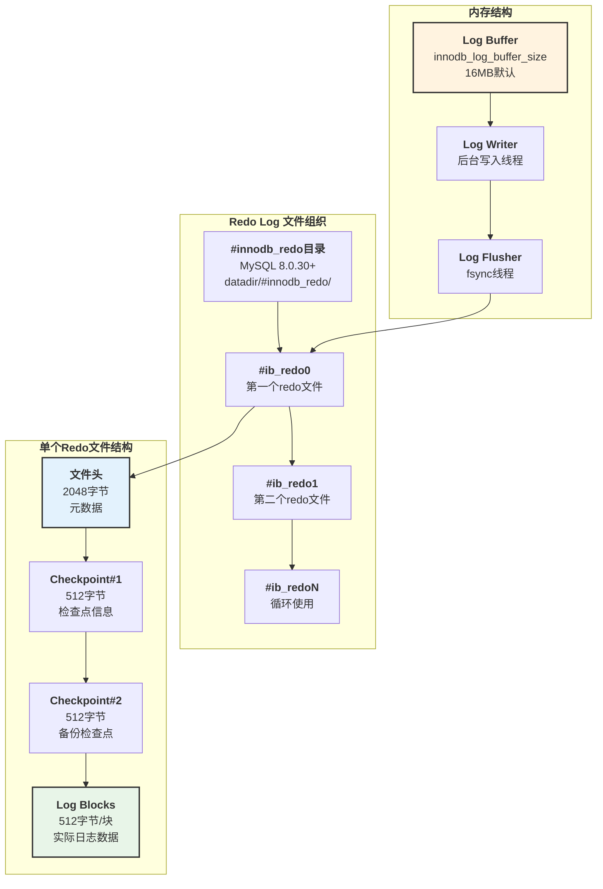

### 1.2 Redo Log 文件头部字节级结构

**源码位置**: `storage/innobase/include/log0constants.h:183-239`

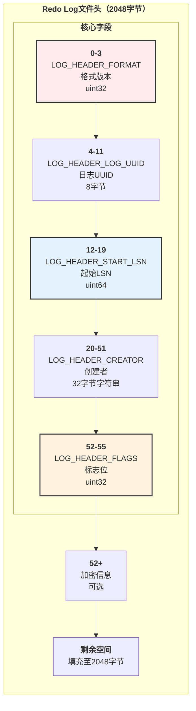

**Redo Log文件头字节级映射表**:

| 偏移量 | 长度 | 字段名 | 数据类型 | 说明 |
|-------|-----|--------|---------|------|
| **0** | 4 | `LOG_HEADER_FORMAT` | uint32 BE | 格式版本 (6=8.0.30+) |
| **4** | 8 | `LOG_HEADER_LOG_UUID` | uint64 | 日志组UUID，用于检测文件混用 |
| **8** | 8 | `LOG_HEADER_START_LSN` | uint64 | 该文件第一个block的起始LSN |
| **16** | 32 | `LOG_HEADER_CREATOR` | char[32] | 创建者字符串，如"MySQL 8.0.35" |
| **48** | 4 | `LOG_HEADER_FLAGS` | uint32 | 标志位（见下表） |
| **52** | 变长 | 加密信息 | bytes | 如果启用加密 |
| **...** | ... | 填充 | zeros | 填充至2048字节 |

**LOG_HEADER_FLAGS 标志位**:

| 位 | 常量名 | 说明 |
|----|-------|------|
| **BIT-1** | `LOG_HEADER_FLAG_NO_LOGGING` | Redo logging已禁用 |
| **BIT-2** | `LOG_HEADER_FLAG_CRASH_UNSAFE` | 崩溃不安全（禁用日志时） |
| **BIT-3** | `LOG_HEADER_FLAG_NOT_INITIALIZED` | 数据目录未完全初始化 |
| **BIT-4** | `LOG_HEADER_FLAG_FILE_FULL` | 文件已满，关闭写入 |

### 1.3 Redo Log Block 详细结构

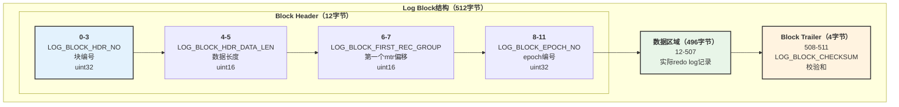

**Log Block字节级映射表**:

| 偏移量 | 长度 | 字段名 | 说明 |
|-------|-----|--------|------|
| **0** | 4 | `LOG_BLOCK_HDR_NO` | 块编号（>0），最高位可能用于flush标记 |
| **4** | 2 | `LOG_BLOCK_HDR_DATA_LEN` | 数据长度（含header），最高位标识加密 |
| **6** | 2 | `LOG_BLOCK_FIRST_REC_GROUP` | 第一个完整mtr记录组的偏移 |
| **8** | 4 | `LOG_BLOCK_EPOCH_NO` | Epoch编号，配合hdr_no形成全局块号 |
| **12** | 496 | 数据区域 | 实际redo log记录 |
| **508** | 4 | `LOG_BLOCK_CHECKSUM` | CRC32校验和 |

**块编号计算**:

- **全局块号** = `epoch_no * LOG_BLOCK_MAX_NO + hdr_no`
- **LOG_BLOCK_MAX_NO** = 1073741824 (2^30)
- **Epoch** = 每10.7亿个块为一个周期

### 1.4 Checkpoint 结构

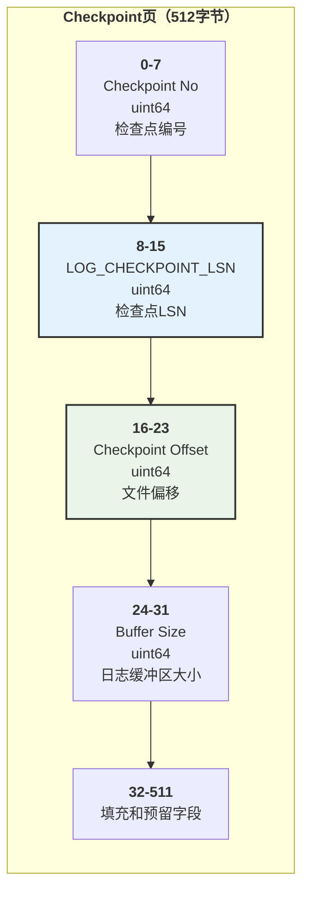

**Checkpoint字段说明**:

- **Checkpoint LSN**: 恢复的起点LSN，之前的修改已安全刷盘
- **两个Checkpoint页**: 交替写入，保证至少有一个完整有效
- **位置**: 文件偏移2048和2560字节处

### 1.5 Redo Log 内存结构

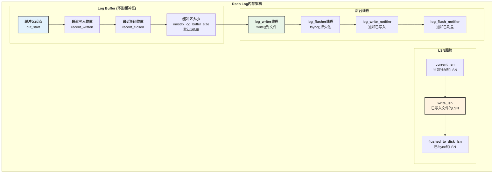

### 1.6 Redo Log 写入流程

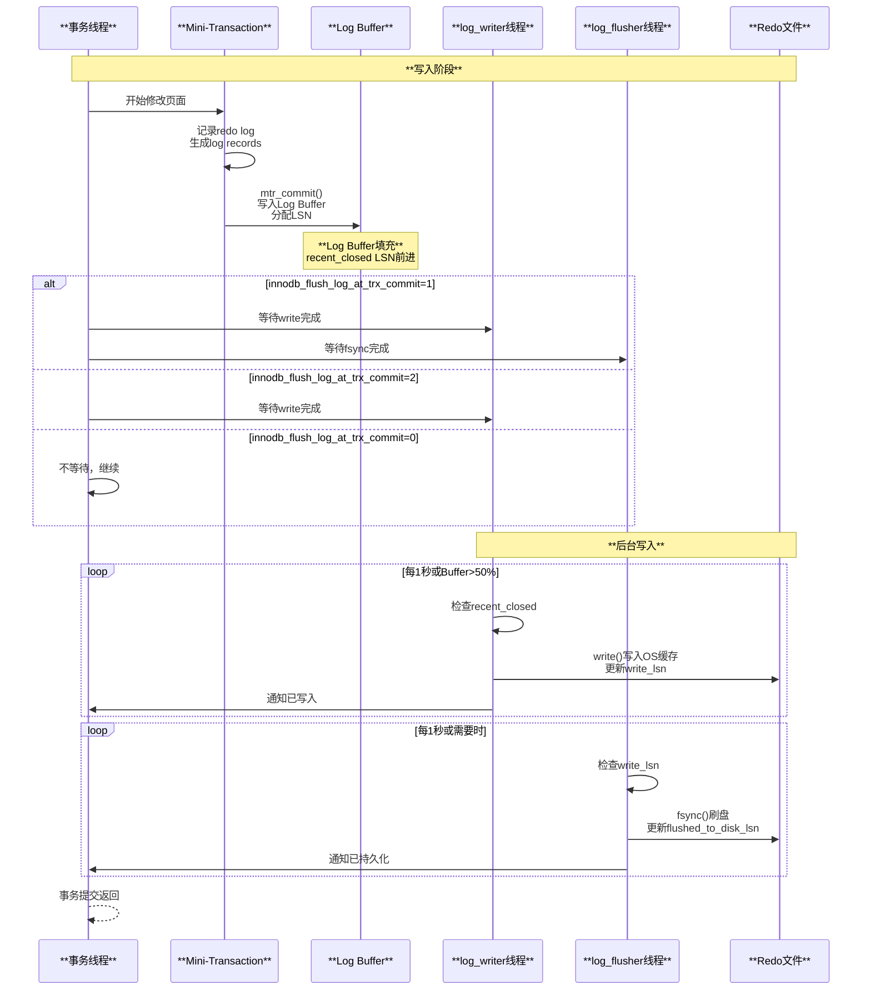

**关键参数**:

| 参数 | 默认值 | 说明 |
|-----|-------|------|
| `innodb_log_buffer_size` | 16MB | Log Buffer大小 |
| `innodb_flush_log_at_trx_commit` | 1 | 0=不等待, 1=等待fsync, 2=等待write |
| `innodb_log_write_ahead_size` | 8KB | 写前对齐大小 |
| `innodb_redo_log_capacity` | 100MB | Redo log总容量（8.0.30+） |

---

## 第二部分：Undo Log 深度解析

### 2.1 Undo Log 整体架构

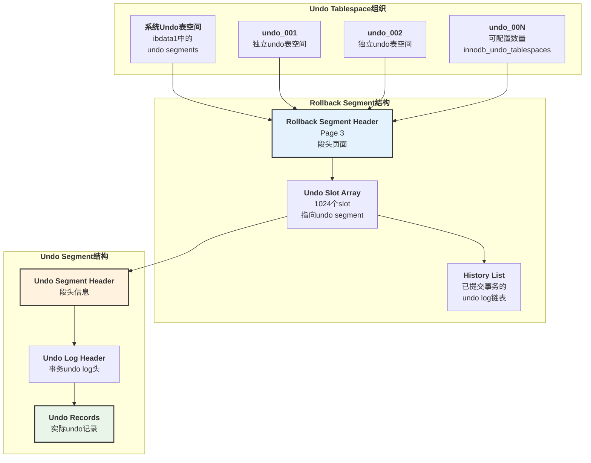

### 2.2 Undo Segment Header 字节级结构

**源码位置**: `storage/innobase/include/trx0undo.h:502-520`

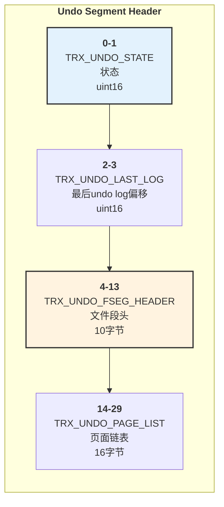

**Undo Segment Header字节级映射表**:

| 偏移量 | 长度 | 字段名 | 说明 |
|-------|-----|--------|------|
| **0** | 2 | `TRX_UNDO_STATE` | 状态：ACTIVE(1), CACHED(2), TO_FREE(3), TO_PURGE(4), PREPARED(6) |
| **2** | 2 | `TRX_UNDO_LAST_LOG` | 最后一个undo log header的偏移，0表示无 |
| **4** | 10 | `TRX_UNDO_FSEG_HEADER` | 文件段头（space_id + page_no + offset） |
| **14** | 16 | `TRX_UNDO_PAGE_LIST` | Undo页面链表基节点（FLST_BASE_NODE） |

**Undo状态值**:

| 值 | 常量名 | 说明 |
|----|-------|------|
| **1** | `TRX_UNDO_ACTIVE` | 活动事务的undo log |
| **2** | `TRX_UNDO_CACHED` | 缓存以便重用 |
| **3** | `TRX_UNDO_TO_FREE` | Insert undo，可释放 |
| **4** | `TRX_UNDO_TO_PURGE` | Update undo，待purge |
| **6** | `TRX_UNDO_PREPARED` | XA prepared事务 |

### 2.3 Undo Log Header 详细结构

**源码位置**: `storage/innobase/include/trx0undo.h:522-608`

```mermaid
graph TB
    subgraph "<b>Undo Log Header（变长）</b>"
        subgraph "<b>基础头部（34字节）</b>"
            TRX_ID["<b>0-7</b><br/>TRX_UNDO_TRX_ID<br/>事务ID<br/>uint64"]
            TRX_NO["<b>8-15</b><br/>TRX_UNDO_TRX_NO<br/>事务号<br/>uint64"]
            DEL_MARKS["<b>16-17</b><br/>TRX_UNDO_DEL_MARKS<br/>删除标记<br/>uint16"]
            LOG_START["<b>18-19</b><br/>TRX_UNDO_LOG_START<br/>undo log起始<br/>uint16"]
            FLAGS["<b>20</b><br/>TRX_UNDO_FLAGS<br/>标志位<br/>uint8"]
            DICT_TRANS["<b>21</b><br/>TRX_UNDO_DICT_TRANS<br/>DDL事务<br/>uint8"]
            TABLE_ID["<b>22-29</b><br/>TRX_UNDO_TABLE_ID<br/>表ID(deprecated)<br/>uint64"]
            NEXT_LOG["<b>30-31</b><br/>TRX_UNDO_NEXT_LOG<br/>下一个undo log<br/>uint16"]
            PREV_LOG["<b>32-33</b><br/>TRX_UNDO_PREV_LOG<br/>前一个undo log<br/>uint16"]
        end
        
        HISTORY_NODE["<b>34-45</b><br/>TRX_UNDO_HISTORY_NODE<br/>历史链表节点<br/>12字节"]
        
        subgraph "<b>扩展部分（可选）</b>"
            XA_INFO["<b>46-203</b><br/>XA事务信息<br/>158字节<br/>格式ID+GTRID+BQUAL"]
            GTID_INFO["<b>204-268</b><br/>GTID信息<br/>65字节<br/>版本+GTID"]
        end
    end
    
    TRX_ID --> TRX_NO
    TRX_NO --> DEL_MARKS
    DEL_MARKS --> LOG_START
    LOG_START --> FLAGS
    FLAGS --> DICT_TRANS
    DICT_TRANS --> TABLE_ID
    TABLE_ID --> NEXT_LOG
    NEXT_LOG --> PREV_LOG
    PREV_LOG --> HISTORY_NODE
    HISTORY_NODE --> XA_INFO
    XA_INFO --> GTID_INFO
    
    style TRX_ID fill:#e3f2fd,stroke:#333,stroke-width:2px
    style FLAGS fill:#fff3e0,stroke:#333,stroke-width:2px
    style XA_INFO fill:#e8f5e8,stroke:#333,stroke-width:2px
```

**TRX_UNDO_FLAGS标志位**:

| 位 | 常量名 | 说明 |
|----|-------|------|
| **0x01** | `TRX_UNDO_FLAG_XID` | 包含XA事务标识 |
| **0x02** | `TRX_UNDO_FLAG_GTID` | 包含GTID信息 |
| **0x04** | `TRX_UNDO_FLAG_XA_PREPARE_GTID` | XA PREPARE的GTID |

### 2.4 Undo Record 格式

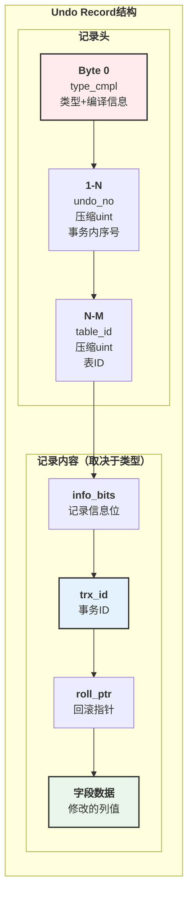

**源码位置**: `storage/innobase/include/trx0rec.h:298-316`

**Undo Record类型**:

| 类型值 | 常量名 | 说明 |
|-------|-------|------|
| **11** | `TRX_UNDO_INSERT_REC` | INSERT操作的undo |
| **12** | `TRX_UNDO_UPD_EXIST_REC` | UPDATE非删除标记记录 |
| **13** | `TRX_UNDO_UPD_DEL_REC` | UPDATE删除标记转为非删除 |
| **14** | `TRX_UNDO_DEL_MARK_REC` | DELETE标记（不改字段） |

**type_cmpl字节位域**:

- **Bit 0-3**: 记录类型（11, 12, 13, 14）
- **Bit 4-5**: 编译信息（CMPL_INFO）
- **Bit 6**: 保留
- **Bit 7**: `TRX_UNDO_MODIFY_BLOB` (64) - 修改了BLOB
- **Bit 7**: `TRX_UNDO_UPD_EXTERN` (128) - 更新外部存储

### 2.5 Undo Log 内存结构

```mermaid
graph TB
    subgraph "<b>Undo内存结构</b>"
        subgraph "<b>trx_sys (事务系统)</b>"
            RSEG_ARRAY_MEM["<b>rseg_array</b><br/>128个rollback segment"]
            RSEG_HISTORY["<b>rseg_history_len</b><br/>history list长度<br/>待purge的undo数量"]
        end
        
        subgraph "<b>trx_rseg_t (Rollback Segment)</b>"
            RSEG_ID["<b>id</b><br/>Rollback segment ID"]
            RSEG_SPACE["<b>space_id</b><br/>表空间ID"]
            RSEG_PAGE["<b>page_no</b><br/>段头页号"]
            RSEG_MUTEX["<b>mutex</b><br/>并发保护"]
            RSEG_INSERT_LIST["<b>insert_undo_list</b><br/>INSERT undo链表"]
            RSEG_UPDATE_LIST["<b>update_undo_list</b><br/>UPDATE undo链表"]
        end
        
        subgraph "<b>trx_undo_t (Undo Segment)</b>"
            UNDO_ID["<b>id</b><br/>undo segment slot ID"]
            UNDO_TYPE["<b>type</b><br/>INSERT/UPDATE"]
            UNDO_STATE["<b>state</b><br/>ACTIVE/CACHED/..."]
            UNDO_SIZE["<b>size</b><br/>页面数量"]
            UNDO_TRX_ID_M["<b>trx_id</b><br/>所属事务ID"]
            UNDO_HDR_PAGE["<b>hdr_page_no</b><br/>头部页号"]
        end
    end
    
    RSEG_ARRAY_MEM --> RSEG_ID
    RSEG_HISTORY --> RSEG_ID
    
    RSEG_ID --> RSEG_SPACE
    RSEG_SPACE --> RSEG_PAGE
    RSEG_PAGE --> RSEG_MUTEX
    RSEG_MUTEX --> RSEG_INSERT_LIST
    RSEG_INSERT_LIST --> RSEG_UPDATE_LIST
    
    RSEG_UPDATE_LIST --> UNDO_ID
    UNDO_ID --> UNDO_TYPE
    UNDO_TYPE --> UNDO_STATE
    UNDO_STATE --> UNDO_SIZE
    UNDO_SIZE --> UNDO_TRX_ID_M
    UNDO_TRX_ID_M --> UNDO_HDR_PAGE
    
    style RSEG_ARRAY_MEM fill:#e3f2fd,stroke:#333,stroke-width:2px
    style RSEG_MUTEX fill:#fff3e0,stroke:#333,stroke-width:2px
    style UNDO_STATE fill:#e8f5e8,stroke:#333,stroke-width:2px
```

### 2.6 Undo Log 写入与回滚流程

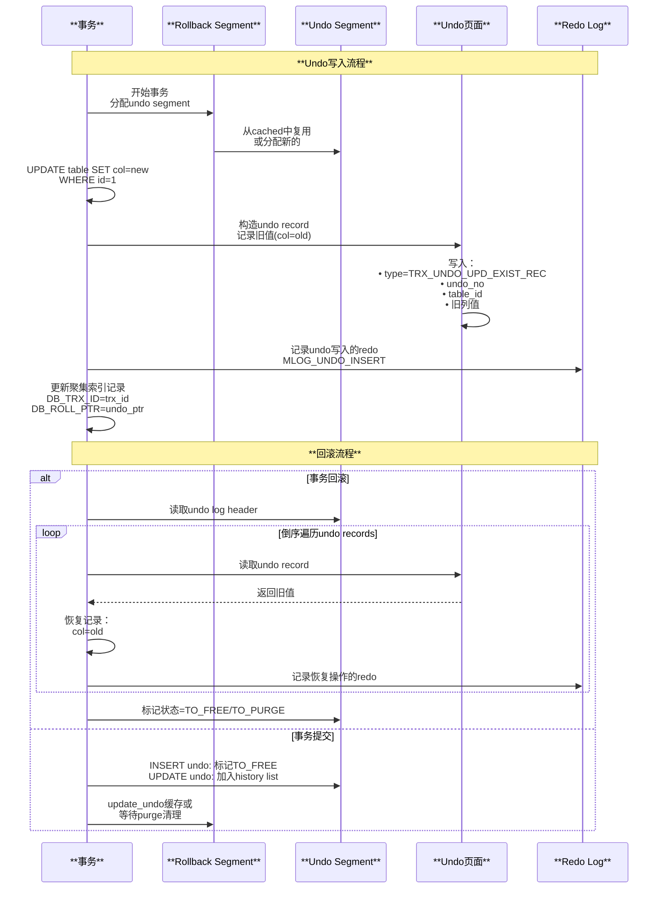

---

## 第三部分：Binlog 深度解析

### 3.1 Binlog 整体架构

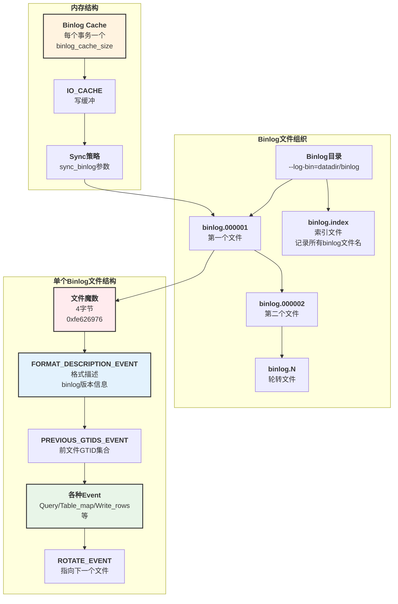

### 3.2 Binlog文件头部

**源码位置**: `sql/log_event.h:213-215`


**BINLOG_MAGIC**:

- **十六进制**: `0xfe 0x62 0x69 0x6e`
- **ASCII**: `þbin`
- **作用**: 标识这是一个MySQL binlog文件

### 3.3 Binlog Event Header 字节级结构

**源码位置**: `sql/rpl_source.cc:812-840`, `sql/log_event.cc:1227-1264`

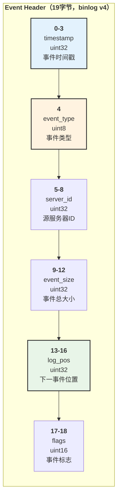

**Event Header字节级映射表**:

| 偏移量 | 长度 | 字段名 | 数据类型 | 说明 |
|-------|-----|--------|---------|------|
| **0** | 4 | `timestamp` | uint32 LE | Unix时间戳（秒） |
| **4** | 1 | `event_type` | uint8 | 事件类型（见下表） |
| **5** | 4 | `server_id` | uint32 LE | 源服务器ID，用于循环复制过滤 |
| **9** | 4 | `event_size` | uint32 LE | 事件总大小（header+body+checksum） |
| **13** | 4 | `log_pos` | uint32 LE | 下一个事件在文件中的位置 |
| **17** | 2 | `flags` | uint16 LE | 事件标志位 |

**常见Event类型**:

| 类型值 | 事件名称 | 说明 |
|-------|---------|------|
| **2** | QUERY_EVENT | SQL语句（DDL/BEGIN等） |
| **4** | ROTATE_EVENT | binlog文件轮转 |
| **15** | FORMAT_DESCRIPTION_EVENT | binlog格式描述 |
| **16** | XID_EVENT | 事务提交（XA） |
| **19** | TABLE_MAP_EVENT | 表映射（ROW格式） |
| **30** | WRITE_ROWS_EVENT | INSERT（ROW格式） |
| **31** | UPDATE_ROWS_EVENT | UPDATE（ROW格式） |
| **32** | DELETE_ROWS_EVENT | DELETE（ROW格式） |
| **33** | GTID_LOG_EVENT | GTID信息 |

### 3.4 FORMAT_DESCRIPTION_EVENT 详细结构

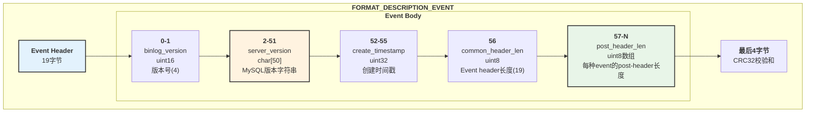

### 3.5 QUERY_EVENT 结构

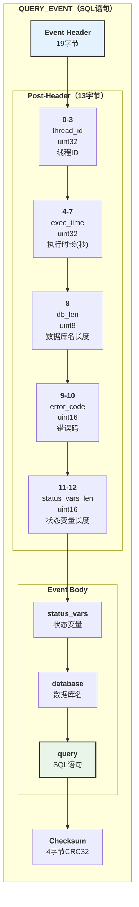

### 3.6 Binlog 内存结构与缓存

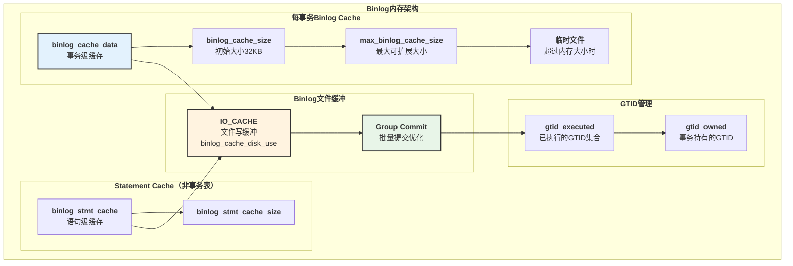

### 3.7 Binlog 写入流程（Group Commit）

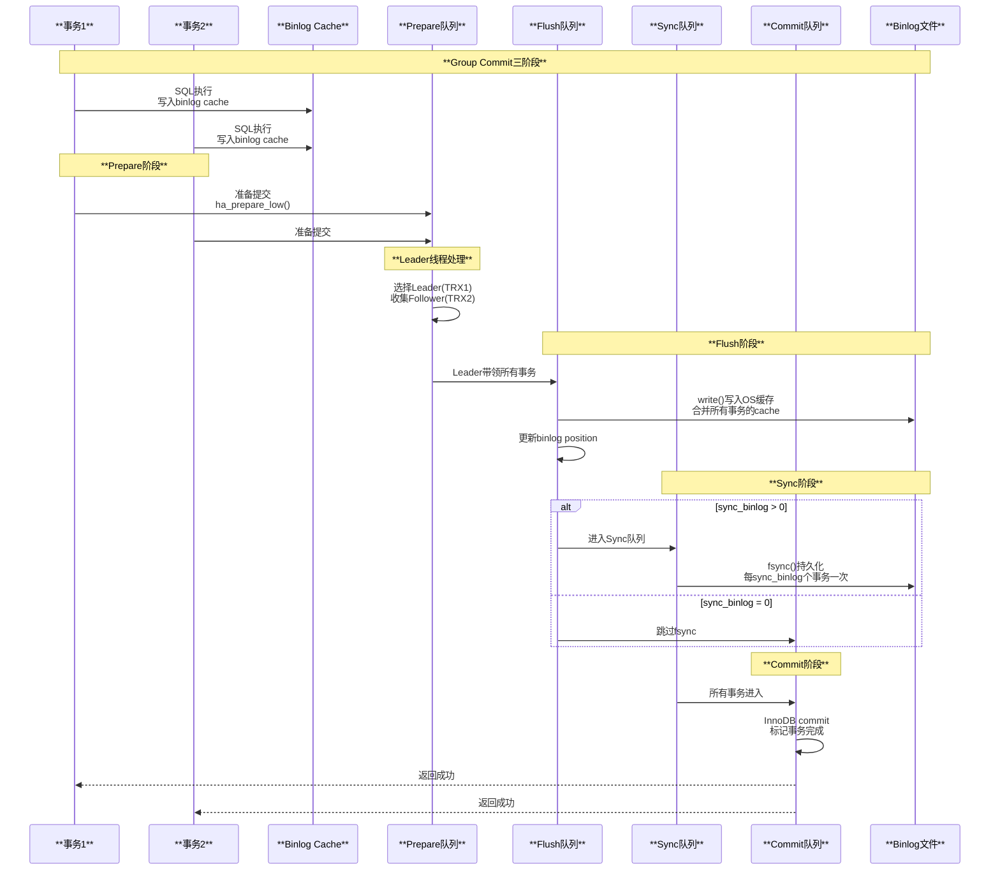

**Group Commit关键参数**:

| 参数 | 默认值 | 说明 |
|-----|-------|------|
| `binlog_cache_size` | 32KB | 每个事务的binlog缓存初始大小 |
| `max_binlog_cache_size` | 18EB | binlog缓存最大大小 |
| `sync_binlog` | 1 | N>0: 每N个事务fsync一次, 0: 由OS控制 |
| `binlog_group_commit_sync_delay` | 0 | 延迟N微秒收集更多事务（提高吞吐） |
| `binlog_group_commit_sync_no_delay_count` | 0 | 收集N个事务后立即提交 |

---

## 第四部分：三大日志对比与协作

### 4.1 三大日志对比矩阵

```mermaid
graph TB
    subgraph "<b>三大日志特性对比</b>"
        subgraph "<b>Redo Log</b>"
            REDO_PURPOSE["<b>目的</b><br/>崩溃恢复<br/>持久性保证"]
            REDO_LEVEL["<b>层次</b><br/>InnoDB存储引擎层"]
            REDO_FORMAT["<b>格式</b><br/>物理日志<br/>页面修改"]
            REDO_SIZE["<b>大小</b><br/>循环使用<br/>默认100MB"]
        end
        
        subgraph "<b>Undo Log</b>"
            UNDO_PURPOSE["<b>目的</b><br/>事务回滚<br/>MVCC"]
            UNDO_LEVEL["<b>层次</b><br/>InnoDB存储引擎层"]
            UNDO_FORMAT["<b>格式</b><br/>逻辑日志<br/>反向操作"]
            UNDO_SIZE["<b>大小</b><br/>按需分配<br/>purge清理"]
        end
        
        subgraph "<b>Binlog</b>"
            BINLOG_PURPOSE["<b>目的</b><br/>复制<br/>PITR"]
            BINLOG_LEVEL["<b>层次</b><br/>MySQL Server层"]
            BINLOG_FORMAT["<b>格式</b><br/>逻辑日志<br/>SQL/ROW/MIXED"]
            BINLOG_SIZE["<b>大小</b><br/>持续增长<br/>手动清理"]
        end
    end
    
    REDO_PURPOSE --> REDO_LEVEL
    REDO_LEVEL --> REDO_FORMAT
    REDO_FORMAT --> REDO_SIZE
    
    UNDO_PURPOSE --> UNDO_LEVEL
    UNDO_LEVEL --> UNDO_FORMAT
    UNDO_FORMAT --> UNDO_SIZE
    
    BINLOG_PURPOSE --> BINLOG_LEVEL
    BINLOG_LEVEL --> BINLOG_FORMAT
    BINLOG_FORMAT --> BINLOG_SIZE
    
    style REDO_PURPOSE fill:#e3f2fd,stroke:#333,stroke-width:2px
    style UNDO_PURPOSE fill:#fff3e0,stroke:#333,stroke-width:2px
    style BINLOG_PURPOSE fill:#e8f5e8,stroke:#333,stroke-width:2px
```

| 特性 | Redo Log | Undo Log | Binlog |
|-----|---------|---------|--------|
| **层次** | InnoDB引擎 | InnoDB引擎 | MySQL Server |
| **目的** | 崩溃恢复、持久性 | 事务回滚、MVCC | 复制、PITR |
| **格式** | 物理（页面修改） | 逻辑（反向操作） | 逻辑（SQL/ROW） |
| **写入时机** | 事务执行中 | 事务执行中 | 事务提交时 |
| **大小管理** | 循环覆盖 | 按需分配+purge | 持续增长 |
| **块/页大小** | 512字节block | 16KB页面 | Event可变 |
| **校验和** | CRC32（block级） | CRC32（页级） | CRC32（event级） |

### 4.2 事务提交的两阶段提交（2PC）

```mermaid
sequenceDiagram
    participant APP as **应用**
    participant MYSQL as **MySQL Server**
    participant INNODB as **InnoDB引擎**
    participant REDO as **Redo Log**
    participant BINLOG as **Binlog**

    Note over APP,BINLOG: **事务执行阶段**
    
    APP->>MYSQL: BEGIN
    APP->>MYSQL: UPDATE table SET col=new
    MYSQL->>INNODB: 修改Buffer Pool中的页
    INNODB->>REDO: 写入redo log buffer<br/>记录物理修改
    INNODB->>INNODB: 写入undo log<br/>记录旧值
    MYSQL->>MYSQL: 写入binlog cache<br/>记录逻辑修改
    
    Note over APP,BINLOG: **两阶段提交（2PC）**
    
    APP->>MYSQL: COMMIT
    
    Note over INNODB,REDO: **Prepare阶段**
    MYSQL->>INNODB: prepare()
    INNODB->>REDO: 写入Prepare标记的redo<br/>XID_EVENT标记
    INNODB->>REDO: fsync redo log<br/>根据innodb_flush_log_at_trx_commit
    INNODB-->>MYSQL: Prepare完成
    
    Note over MYSQL,BINLOG: **Commit阶段**
    MYSQL->>BINLOG: 写入binlog（Group Commit）
    BINLOG->>BINLOG: fsync binlog<br/>根据sync_binlog
    
    MYSQL->>INNODB: commit()
    INNODB->>INNODB: 写入Commit标记<br/>释放锁
    INNODB->>INNODB: undo log标记提交<br/>加入history list
    
    MYSQL-->>APP: 返回成功
    
    Note over APP,BINLOG: **崩溃恢复**
    alt 崩溃在Prepare后、Binlog前
        INNODB->>INNODB: 回滚该事务
    else 崩溃在Binlog后、Commit前
        INNODB->>BINLOG: 检查XID在binlog中
        BINLOG-->>INNODB: XID存在
        INNODB->>INNODB: 重新提交事务
    end
```

**两阶段提交保证**:

- **原子性**: Redo+Undo共同保证单事务原子性
- **一致性**: Binlog与Redo保持一致，保证主从一致
- **持久性**: 双重保证（Redo Log + Binlog）
- **隔离性**: MVCC（Undo）+ 锁机制

---

## 第五部分：性能优化与监控

### 5.1 关键性能参数

**Redo Log优化**:

```sql
-- 查看redo log使用情况
SHOW ENGINE INNODB STATUS\G
-- 关注：Log sequence number, Log flushed up to

-- 关键参数
SET GLOBAL innodb_log_buffer_size = 67108864;  -- 64MB
SET GLOBAL innodb_flush_log_at_trx_commit = 2; -- 性能优先
SET GLOBAL innodb_log_write_ahead_size = 16384; -- 16KB
```

**Undo Log优化**:

```sql
-- 查看undo使用情况
SELECT 
    tablespace_name,
    file_name,
    file_size/1024/1024 AS size_mb
FROM information_schema.FILES
WHERE file_type LIKE '%UNDO%';

-- 查看history list长度
SHOW ENGINE INNODB STATUS\G
-- 关注：History list length

-- 关键参数
SET GLOBAL innodb_undo_tablespaces = 4;        -- undo表空间数量
SET GLOBAL innodb_max_undo_log_size = 1073741824; -- 1GB
SET GLOBAL innodb_purge_threads = 4;           -- purge线程数
SET GLOBAL innodb_purge_batch_size = 300;      -- 批量purge大小
```

**Binlog优化**:

```sql
-- 查看binlog使用情况
SHOW BINARY LOGS;
SHOW MASTER STATUS;

-- 关键参数
SET GLOBAL binlog_cache_size = 131072;         -- 128KB
SET GLOBAL sync_binlog = 100;                  -- 性能优先
SET GLOBAL binlog_group_commit_sync_delay = 1000; -- 1ms
SET GLOBAL binlog_group_commit_sync_no_delay_count = 100;
SET GLOBAL max_binlog_size = 1073741824;       -- 1GB
```

### 5.2 监控指标

```sql
-- Redo Log监控
SELECT 
    'Redo Log' AS component,
    variable_name,
    variable_value
FROM performance_schema.global_status
WHERE variable_name IN (
    'Innodb_redo_log_enabled',
    'Innodb_redo_log_resize_status'
);

-- Undo Log监控
SELECT 
    NAME,
    SUBSYSTEM,
    COUNT
FROM information_schema.INNODB_METRICS
WHERE NAME LIKE '%undo%' OR NAME LIKE '%purge%';

-- Binlog监控
SHOW GLOBAL STATUS LIKE 'Binlog%';
-- 关注：
-- Binlog_cache_disk_use: 使用临时文件次数
-- Binlog_cache_use: 使用cache次数
```

---

## 总结

### 核心要点回顾

**Redo Log**:

- 固定大小，循环使用
- 512字节Block结构
- 物理日志，记录"在某页某偏移写入什么"
- WAL机制，先写日志后写数据
- LSN全局递增，追踪写入进度

**Undo Log**:

- 存储在undo表空间中
- 按需分配，purge线程清理
- 逻辑日志，记录反向操作
- 支持MVCC和事务回滚
- History list维护已提交但未purge的undo

**Binlog**:

- Server层日志，与存储引擎无关
- Event-based结构
- 支持STATEMENT/ROW/MIXED格式
- Group Commit优化提交性能
- 用于主从复制和Point-in-Time恢复

**三者协作**:

- **两阶段提交**保证Redo和Binlog一致
- **XID**作为桥梁关联InnoDB事务和Binlog事务
- **崩溃恢复**时根据Prepare/Commit状态和Binlog决定提交或回滚

这种精巧的日志系统设计，是MySQL保证ACID特性和高可用的基石。
