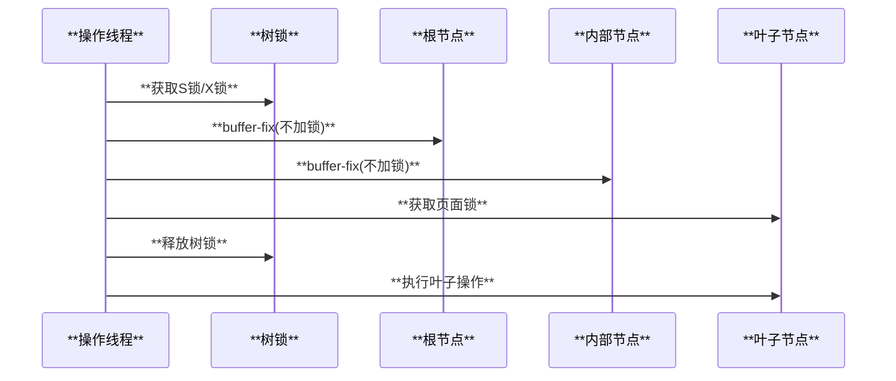
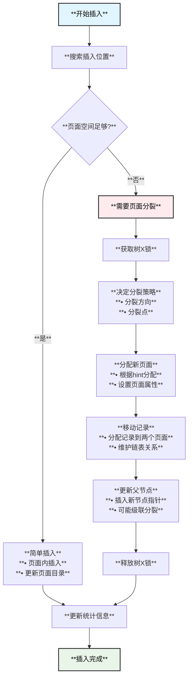
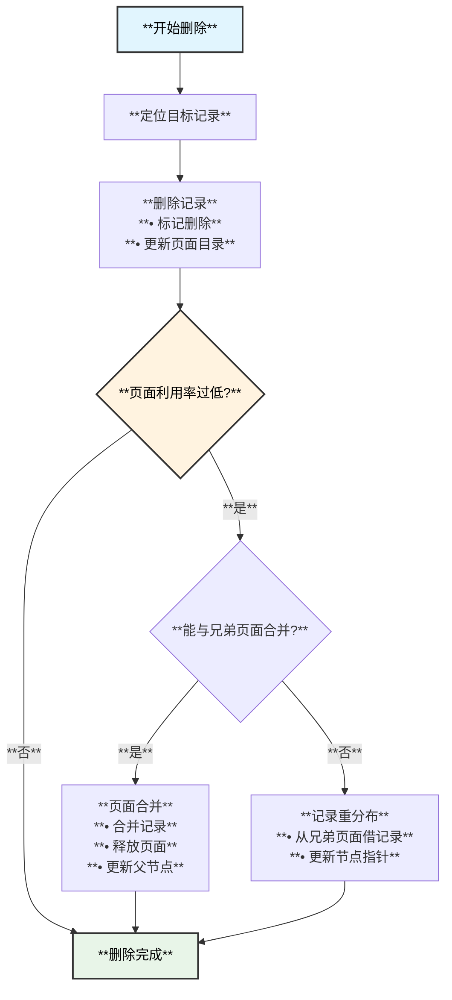

# MySQL B+树实现架构

## 概述

B+树是MySQL InnoDB存储引擎的核心数据结构，用于实现主键索引（聚簇索引）和辅助索引。相比传统的B树，B+树的所有数据都存储在叶子节点中，内部节点只存储键值用于导航，这种设计非常适合数据库的范围查询和顺序扫描操作。

## B+树基本特性

### 1. **结构特点**
- **叶子节点包含所有数据**：所有记录都存储在叶子节点中
- **内部节点仅存储索引**：用于快速定位到叶子节点
- **叶子节点链式连接**：便于范围查询和顺序扫描
- **平衡树结构**：保证所有叶子节点在同一层

### 2. **MySQL B+树优势**
- **磁盘IO优化**：内部节点密度高，减少磁盘访问
- **范围查询高效**：叶子节点链表结构支持快速范围扫描
- **缓存友好**：页面结构针对缓存和预取优化

## 核心数据结构

### 1. B+树根本结构定义

```cpp
// storage/innobase/include/btr0btr.h
/** B+树最大深度限制 */
constexpr uint32_t BTR_MAX_LEVELS = 100;

/** B+树页面最大记录大小 */
#define BTR_PAGE_MAX_REC_SIZE (UNIV_PAGE_SIZE / 2 - 200)

/** B+树锁定模式枚举 */
enum btr_latch_mode : size_t {
  BTR_SEARCH_LEAF = RW_S_LATCH,      // 搜索叶子节点并S锁定
  BTR_MODIFY_LEAF = RW_X_LATCH,      // 修改叶子节点并X锁定  
  BTR_NO_LATCHES = RW_NO_LATCH,      // 不获取锁
  BTR_MODIFY_TREE = 33,              // 开始修改整个B+树
  BTR_CONT_MODIFY_TREE = 34,         // 继续修改整个B+树
  BTR_SEARCH_PREV = 35,              // 搜索前一个记录
  BTR_MODIFY_PREV = 36,              // 修改前一个记录
  BTR_SEARCH_TREE = 37,              // 开始搜索整个B+树
  BTR_CONT_SEARCH_TREE = 38          // 继续搜索整个B+树
};
```

### 2. B+树页面结构

MySQL中的B+树页面遵循特定的组织结构：

```cpp
// storage/innobase/page/page0page.cc
/*
页面结构布局：
+------------------+
| 页面头部 (PAGE_HEADER) |
+------------------+
| 系统记录 (infimum)     |
+------------------+
| 用户记录堆              |
| (按插入顺序)           |
+------------------+
| 空闲空间               |
+------------------+
| 页面目录 (Page Directory) |
+------------------+
| 页面尾部 (PAGE_TRAILER)   |
+------------------+

页面目录特点：
- 大约每6条记录一个目录项
- 目录项按字母顺序排列
- 支持二分查找快速定位
- 每个槽包含拥有的记录数量(4-8条)
*/
```

### 3. 节点指针结构

```cpp
// storage/innobase/btr/btr0btr.cc
/*
节点指针 (Node Pointer) 设计：
- 包含索引记录的前缀P
- 前缀长度足以唯一确定索引记录
- 末尾字段包含子页面的文件页号
- 子页面存储的记录 >= P且 < P1 (P1为下一个节点指针前缀)

对于叶子节点：
- 子页面不要求包含前缀P相等的记录
- 允许叶子节点任意删除而不影响上层
*/
```

## B+树锁定策略

### 1. **树锁 + 页锁 层次锁定**

```cpp
// storage/innobase/btr/btr0btr.cc
/*
InnoDB B+树锁定策略
--------------------------------------
1. 树锁 (Tree Latch) 保护所有非叶子节点
2. 每个节点都有自己的页锁 (Page Latch)

搜索操作流程：
1. 获取树的S锁
2. 向下搜索时不对非叶子节点加锁，只buffer-fix
3. 到达叶子节点时释放树锁，获取叶子节点锁

结构修改操作流程：
1. 获取树的X锁  
2. 搜索到叶子节点
3. 如需分裂：
   (a) 确定分裂点
   (b) 分配新页面
   (c) 插入适当的节点指针到第一个非叶子层
   (d) 释放树X锁
   (e) 将记录从叶子移动到新分配的页面
*/
```

### 2. **锁耦合协议**



## B+树核心操作

### 1. 页面分裂 (Page Split)

```cpp
// storage/innobase/btr/btr0btr.cc
/** 页面分裂的详细实现流程 */
static rec_t *btr_page_split_and_insert(
    ulint flags, btr_cur_t *cursor, ulint **offsets,
    mem_heap_t **heap, const dtuple_t *tuple, ulint n_ext,
    mtr_t *mtr) {

  /* 1. 决定分裂方向和分裂点 */  
  if (page_get_n_recs(page) > 1) {
    split_rec = page_get_middle_rec(page);  // 中间分裂
  } else if (btr_page_tuple_smaller(cursor, tuple, offsets, n_uniq, heap)) {
    split_rec = page_rec_get_next(page_get_infimum_rec(page)); // 左分裂
    direction = FSP_DOWN;
    hint_page_no = page_no - 1;
  } else {
    direction = FSP_UP;                     // 右分裂
    hint_page_no = page_no + 1;
  }

  /* 2. 分配新页面 */
  new_block = btr_page_alloc(cursor->index, hint_page_no, direction,
                             btr_page_get_level(page), mtr, mtr);

  /* 3. 创建新页面并设置页面属性 */
  new_page = buf_block_get_frame(new_block);
  new_page_zip = buf_block_get_page_zip(new_block);
  btr_page_create(new_block, new_page_zip, cursor->index,
                  btr_page_get_level(page), mtr);

  /* 4. 移动记录并插入新记录 */
  if (split_rec) {
    first_rec = move_limit = split_rec;
    insert_left = cmp_dtuple_rec(tuple, split_rec, cursor->index, *offsets) < 0;
  }
  
  return inserted_rec;
}
```

### 2. 页面合并 (Page Merge)

```cpp
// storage/innobase/btr/btr0btr.cc
/** 检查页面是否可以与给定页面合并 */
static bool btr_can_merge_with_page(
    btr_cur_t *cursor,         // 当前游标位置
    page_no_t page_no,         // 兄弟页面号
    buf_block_t **merge_block, // 输出合并块
    mtr_t *mtr) {              // mini事务
  
  buf_block_t *block = btr_cur_get_block(cursor);
  page_t *page = btr_cur_get_page(cursor);
  
  /* 获取兄弟页面 */
  *merge_block = btr_block_get(page_id_t(page_get_space_id(page), page_no),
                               page_size, RW_X_LATCH, cursor->index, mtr);
                               
  /* 检查合并条件 */
  if (page_get_n_recs(page) + page_get_n_recs(merge_page) 
      < page_get_max_insert_size_after_reorganize(merge_page, 1)) {
    return true;  // 可以合并
  }
  
  return false;   // 无法合并
}
```

### 3. 搜索操作优化

```cpp
// 自适应哈希索引 (AHI) 优化点查询
// vdocs/cache/AHI.md 已有详细分析

/** AHI系统核心架构 */
class btr_search_sys_t {
public:
  class search_part_t {
  public:
    /** AHI分区锁 - 保护该分区内的所有哈希操作 */
    alignas(ut::INNODB_CACHE_LINE_SIZE) rw_lock_t latch;
    
    /** 哈希表 - 映射dtuple_hash到rec_t指针 */
    alignas(ut::INNODB_CACHE_LINE_SIZE) hash_table_t *hash_table;
    
    /** 预分配的缓存块，减少内存分配开销 */
    std::atomic<buf_block_t *> free_block_for_heap;
  };
  
  /** AHI分区数组 - 默认8个分区，减少锁竞争 */
  ut::unique_ptr_aligned<search_part_t[]> parts;
};
```

## MySQL B+树架构图

```mermaid
graph TB
    subgraph "**B+树层次结构**"
        ROOT[**根节点**<br/>**• 节点指针**<br/>**• 导航键值**<br/>**• 子页面号**]
        
        subgraph "**内部节点层**"
            INT1[**内部节点1**<br/>**• 节点指针**<br/>**• 范围分割**]
            INT2[**内部节点2**<br/>**• 节点指针**<br/>**• 范围分割**]
            INT3[**内部节点3**<br/>**• 节点指针**<br/>**• 范围分割**]
        end
        
        subgraph "**叶子节点层**"
            LEAF1[**叶子节点1**<br/>**• 完整记录**<br/>**• 双向链表**]
            LEAF2[**叶子节点2**<br/>**• 完整记录**<br/>**• 双向链表**]
            LEAF3[**叶子节点3**<br/>**• 完整记录**<br/>**• 双向链表**]
            LEAF4[**叶子节点4**<br/>**• 完整记录**<br/>**• 双向链表**]
        end
    end
    
    subgraph "**锁机制**"
        TREE_LOCK[**树锁**<br/>**• 保护结构修改**<br/>**• S锁/X锁**]
        PAGE_LOCK[**页面锁**<br/>**• 并发访问控制**<br/>**• 锁耦合协议**]
    end
    
    subgraph "**优化特性**" 
        AHI[**自适应哈希索引**<br/>**• O(1)点查询**<br/>**• 热点数据缓存**]
        COMPRESS[**页面压缩**<br/>**• 节省存储空间**<br/>**• 减少IO**]
    end
    
    ROOT --> INT1
    ROOT --> INT2  
    ROOT --> INT3
    
    INT1 --> LEAF1
    INT1 --> LEAF2
    INT2 --> LEAF3
    INT3 --> LEAF4
    
    LEAF1 -.-> LEAF2
    LEAF2 -.-> LEAF3
    LEAF3 -.-> LEAF4
    
    TREE_LOCK --> ROOT
    PAGE_LOCK --> LEAF1
    PAGE_LOCK --> LEAF2
    
    AHI --> LEAF1
    AHI --> LEAF2
    
    style ROOT fill:#e1f5fe,color:#000,stroke:#333,stroke-width:2px
    style INT1 fill:#f3e5f5,color:#000,stroke:#333,stroke-width:2px
    style LEAF1 fill:#e8f5e8,color:#000,stroke:#333,stroke-width:2px
    style AHI fill:#fff3e0,color:#000,stroke:#333,stroke-width:2px
```

## B+树操作流程

### 1. **插入操作流程**



### 2. **删除操作流程**



## 页面组织和存储

### 1. **页面内记录组织**

```cpp
// storage/innobase/page/page0page.cc
/*
页面内的记录组织结构：
1. 记录按主键顺序在页面目录中排序
2. 实际记录在堆中按插入顺序存储  
3. 记录之间通过链表指针连接
4. 页面目录提供快速定位能力

页面目录特性：
- 大约每6条记录有一个目录项
- 目录项按键值排序
- 支持二分查找快速定位
- 每个目录项"拥有"4-8条记录
*/

/** 页面记录搜索的二分查找实现 */
const rec_t *page_dir_slot_get_rec(const page_dir_slot_t *slot) {
  return page + mach_read_from_2(slot);
}

/** 在页面中进行二分搜索 */
ulint page_dir_find_slot(const page_t *page, const rec_t *rec) {
  /* 使用页面目录进行二分搜索，快速定位记录位置 */
}
```

### 2. **文件段管理**

```cpp
// storage/innobase/btr/btr0btr.cc
/*
B+树的文件段分配策略：
--------------------
在B+树根页面中有两个文件段头：
1. 叶子段 (Leaf Segment)：
   - 分配所有叶子页面
   - 尽量保持磁盘连续性
   - 优化顺序扫描性能

2. 非叶子段 (Internal Segment)：
   - 分配所有内部节点页面  
   - 与叶子页面分离管理
   - 减少随机访问开销
*/
```

## B+树性能优化

### 1. **缓冲池优化**

```cpp
// B+树页面在缓冲池中的管理
- **热点页面常驻内存**：频繁访问的根节点和高层内部节点
- **LRU策略优化**：B+树页面具有不同的访问模式
- **预读机制**：线性预读和随机预读适配B+树结构
- **页面压缩**：压缩页面减少内存占用和IO开销
```

### 2. **自适应哈希索引 (AHI)**

```cpp
// storage/innobase/include/btr0sea.h
/** AHI为频繁访问的B+树页面构建哈希表 */
- **监控访问模式**：识别等值查询的热点
- **构建哈希映射**：dtuple_hash -> record指针
- **O(1)快速访问**：跳过B+树搜索过程  
- **动态维护**：根据访问模式自动构建和删除
```

### 3. **并发控制优化**

```cpp
/** B+树并发访问优化策略 */

// 1. 锁耦合协议 - 减少锁持有时间
- 搜索时逐级释放上层锁
- 修改时最小化树锁持有时间

// 2. 读写分离 - 读操作无锁化
- 一致性读不需要获取行锁
- MVCC机制保证读一致性

// 3. 分区锁策略 - 减少锁竞争
- AHI使用8个分区锁
- 根据哈希值分散锁竞争
```

## B+树的SMO操作

### **Structure Modification Operation (SMO)**

```cpp
// storage/innobase/btr/btr0btr.cc
/*
SMO操作包括所有会改变B+树结构的操作：
1. 页面分裂 (Page Split)
2. 页面合并 (Page Merge)  
3. 页面重组 (Page Reorganize)
4. 索引树重构 (Tree Restructure)

SMO操作的REDO日志记录：
- MLOG_REC_INSERT: 记录插入日志
- MLOG_PAGE_REORGANIZE: 页面重组日志
- MLOG_ZIP_PAGE_COMPRESS: 压缩页面日志
- MLOG_REC_UPDATE_IN_PLACE: 原地更新日志
*/
```

## 实际应用场景

### 1. **聚簇索引 (主键索引)**
- **叶子节点存储完整行数据**
- **按主键顺序物理排列** 
- **支持高效的范围查询**

### 2. **辅助索引 (二级索引)**
- **叶子节点存储索引键 + 主键值**
- **通过主键值回表获取完整数据**
- **支持覆盖索引优化**

### 3. **全文索引**
- **特殊的B+树变体**
- **支持词条搜索和相关度排序**
- **倒排索引结构**

## 调试和监控

### 1. **B+树统计信息**

```sql
-- 查看索引统计信息
SELECT * FROM information_schema.INNODB_INDEXES 
WHERE NAME = 'PRIMARY';

-- 查看页面统计  
SELECT * FROM information_schema.INNODB_BUFFER_PAGE
WHERE INDEX_NAME = 'PRIMARY';
```

### 2. **性能监控指标**

```sql
-- B+树相关的性能指标
SHOW STATUS LIKE 'Innodb_buffer_pool%';
SHOW STATUS LIKE 'Innodb_pages%';
SHOW STATUS LIKE 'Innodb_adaptive_hash%';
```

## 总结

MySQL的B+树实现是一个高度优化的数据结构，具有以下核心特点：

### **设计优势**
1. **磁盘友好**：页面结构优化磁盘IO性能
2. **并发优化**：锁耦合协议最小化锁竞争
3. **自适应优化**：AHI等特性自动优化热点访问
4. **可扩展性**：支持大数据量和高并发访问

### **技术创新**
1. **分层锁定策略**：树锁+页锁的层次化设计
2. **页面组织优化**：目录+堆的混合结构  
3. **文件段分离**：叶子段和内部段的分离管理
4. **SMO操作优化**：最小化结构修改的影响

### **实用价值**
1. **高性能查询**：O(log n)搜索复杂度
2. **范围扫描优化**：叶子节点链表结构
3. **事务ACID支持**：与锁系统和日志系统集成
4. **存储效率**：压缩和空间管理优化

MySQL的B+树实现代表了数据库索引技术的先进水平，在保证ACID特性的前提下实现了极高的查询性能和并发处理能力。
