# MySQL位图索引实现架构与Oracle传统位图索引对比

## 概述

本文档涵盖两个主要内容：**Oracle传统位图索引**的架构与实现原理，以及**MySQL位图优化系统**的设计思路。MySQL并没有实现传统意义上的位图索引（Bitmap Index），而是在B+树索引的基础上大量使用位图进行查询优化，形成了一套完整的位图辅助索引系统。

## Oracle传统位图索引架构

### **核心概念与设计原理**

Oracle位图索引是一种专门为**低基数列**（Low Cardinality Column）设计的索引结构，通过为每个不同的列值维护一个位图来实现高效的等值查询和逻辑运算。

```cpp
/*
Oracle位图索引核心特点：
1. 每个不同值对应一个位图（Bitmap）
2. 位图中的每一位对应表中的一行
3. 位值为1表示该行包含对应的值
4. 支持高效的位运算（AND, OR, NOT）
5. 特别适合数据仓库和OLAP场景
*/

/** Oracle位图索引的逻辑结构 */
struct Oracle_Bitmap_Index {
  // 索引元数据
  char index_name[128];          // 索引名称
  char table_name[128];          // 表名
  char column_name[128];         // 列名
  uint32_t cardinality;          // 基数（不同值数量）
  
  // 位图数据结构
  struct Bitmap_Entry {
    char key_value[256];         // 键值（如：'男', '女', 'A', 'B'）
    uint64_t *bitmap;            // 位图数据（每位对应一行）
    uint32_t bitmap_size;        // 位图大小（字节）
    uint32_t bit_count;          // 置位数量（性能优化）
  };
  
  Bitmap_Entry *bitmaps;         // 位图数组
  uint32_t bitmap_count;         // 位图数量
  
  // 压缩相关
  enum Compression_Type {
    UNCOMPRESSED,                // 未压缩
    RLE_COMPRESSED,             // 行程编码压缩
    BBC_COMPRESSED              // 字节边界压缩
  } compression_type;
};
```

### **Oracle位图索引架构图**

```mermaid
graph TB
    subgraph "**Oracle位图索引架构**"
        subgraph "**应用层**"
            QUERY[**SQL查询**<br/>**• 等值查询**<br/>**• 范围查询**<br/>**• 复合条件查询**]
            
            OPTIMIZER[**查询优化器**<br/>**• 成本估算**<br/>**• 位图索引选择**<br/>**• 执行计划生成**]
        end
        
        subgraph "**位图索引层**"
            BITMAP_MGR[**位图索引管理器**<br/>**• 索引元数据管理**<br/>**• 位图数据组织**<br/>**• 并发控制**]
            
            BITMAP_OPS[**位图操作引擎**<br/>**• 位运算（AND/OR/NOT）**<br/>**• 位图合并**<br/>**• 结果集生成**]
            
            COMPRESSION[**压缩模块**<br/>**• RLE压缩**<br/>**• BBC压缩**<br/>**• 动态压缩选择**]
        end
        
        subgraph "**存储层**"
            BITMAP_STORAGE[**位图存储结构**<br/>**性别='男': 1101001...**<br/>**性别='女': 0010110...**<br/>**状态='A': 1100000...**<br/>**状态='B': 0011111...**]
            
            INDEX_BLOCKS[**索引块管理**<br/>**• 位图数据块**<br/>**• 索引头部信息**<br/>**• 空间分配**]
            
            STORAGE_ENGINE[**存储引擎**<br/>**• 块读写**<br/>**• 缓存管理**<br/>**• 事务支持**]
        end
    end
    
    QUERY --> OPTIMIZER
    OPTIMIZER --> BITMAP_MGR
    BITMAP_MGR --> BITMAP_OPS
    BITMAP_OPS --> COMPRESSION
    COMPRESSION --> BITMAP_STORAGE
    BITMAP_STORAGE --> INDEX_BLOCKS
    INDEX_BLOCKS --> STORAGE_ENGINE
    
    style QUERY fill:#e1f5fe,color:#000,stroke:#333,stroke-width:2px
    style BITMAP_OPS fill:#e8f5e8,color:#000,stroke:#333,stroke-width:2px
    style BITMAP_STORAGE fill:#f3e5f5,color:#000,stroke:#333,stroke-width:2px
    style STORAGE_ENGINE fill:#fff3e0,color:#000,stroke:#333,stroke-width:2px
```



### **位图索引实现原理**

#### 1. **位图构建过程**

```cpp
/** Oracle风格位图索引构建算法 */
class Oracle_Bitmap_Index_Builder {
private:
    std::map<std::string, std::vector<bool>> value_bitmaps;
    uint32_t row_count;
    
public:
    /** 构建位图索引 */
    void build_bitmap_index(const std::string& table_name, 
                           const std::string& column_name) {
        // 1. 扫描表获取所有不同值
        std::set<std::string> distinct_values;
        scan_table_for_distinct_values(table_name, column_name, distinct_values);
        
        // 2. 为每个不同值初始化位图
        for (const auto& value : distinct_values) {
            value_bitmaps[value] = std::vector<bool>(row_count, false);
        }
        
        // 3. 逐行设置位图
        scan_table_and_set_bitmaps(table_name, column_name);
        
        // 4. 压缩位图数据
        compress_bitmaps();
        
        // 5. 持久化索引数据
        persist_index_data();
    }
    
    /** 扫描表并设置位图 */
    void scan_table_and_set_bitmaps(const std::string& table_name,
                                   const std::string& column_name) {
        uint32_t row_id = 0;
        
        // 模拟表扫描
        while (has_more_rows()) {
            std::string column_value = get_column_value(row_id, column_name);
            
            // 在对应值的位图中设置该行的位
            if (value_bitmaps.find(column_value) != value_bitmaps.end()) {
                value_bitmaps[column_value][row_id] = true;
            }
            
            row_id++;
        }
    }
    
    /** RLE压缩实现 */
    std::vector<uint32_t> rle_compress(const std::vector<bool>& bitmap) {
        std::vector<uint32_t> compressed;
        bool current_bit = bitmap[0];
        uint32_t count = 1;
        
        for (size_t i = 1; i < bitmap.size(); i++) {
            if (bitmap[i] == current_bit) {
                count++;
            } else {
                // 存储：位值(1bit) + 计数(31bit)
                compressed.push_back((current_bit << 31) | count);
                current_bit = bitmap[i];
                count = 1;
            }
        }
        compressed.push_back((current_bit << 31) | count);
        return compressed;
    }
};
```

#### 2. **位图查询执行算法**

```cpp
/** Oracle位图查询执行引擎 */
class Oracle_Bitmap_Query_Executor {
private:
    Oracle_Bitmap_Index* index;
    
public:
    /** 等值查询：SELECT * FROM table WHERE gender = '男' */
    std::vector<uint32_t> equal_query(const std::string& value) {
        std::vector<uint32_t> result_rows;
        
        // 1. 查找对应值的位图
        auto bitmap_iter = index->find_bitmap(value);
        if (bitmap_iter == index->bitmaps_end()) {
            return result_rows; // 空结果
        }
        
        // 2. 解压位图（如果已压缩）
        std::vector<bool> bitmap = decompress_bitmap(bitmap_iter->second);
        
        // 3. 扫描位图提取行号
        for (uint32_t row_id = 0; row_id < bitmap.size(); row_id++) {
            if (bitmap[row_id]) {
                result_rows.push_back(row_id);
            }
        }
        
        return result_rows;
    }
    
    /** 复合查询：SELECT * FROM table WHERE gender = '男' AND status = 'A' */
    std::vector<uint32_t> and_query(const std::string& value1, 
                                   const std::string& value2,
                                   Oracle_Bitmap_Index* index2) {
        // 1. 获取两个条件的位图
        std::vector<bool> bitmap1 = get_bitmap(value1);
        std::vector<bool> bitmap2 = index2->get_bitmap(value2);
        
        // 2. 执行位图AND运算
        std::vector<bool> result_bitmap = bitmap_and(bitmap1, bitmap2);
        
        // 3. 提取结果行号
        return extract_row_ids(result_bitmap);
    }
    
    /** 高效位图AND运算 */
    std::vector<bool> bitmap_and(const std::vector<bool>& bitmap1,
                                const std::vector<bool>& bitmap2) {
        std::vector<bool> result(bitmap1.size());
        
        // 使用64位整数加速位运算
        const uint64_t* p1 = reinterpret_cast<const uint64_t*>(bitmap1.data());
        const uint64_t* p2 = reinterpret_cast<const uint64_t*>(bitmap2.data());
        uint64_t* pr = reinterpret_cast<uint64_t*>(result.data());
        
        size_t word_count = bitmap1.size() / 64;
        for (size_t i = 0; i < word_count; i++) {
            pr[i] = p1[i] & p2[i];  // 64位并行AND运算
        }
        
        // 处理剩余位
        size_t remaining_bits = bitmap1.size() % 64;
        for (size_t i = word_count * 64; i < word_count * 64 + remaining_bits; i++) {
            result[i] = bitmap1[i] && bitmap2[i];
        }
        
        return result;
    }
};
```

### **Oracle位图索引使用场景与建议**

#### 1. **适用场景分析**

```cpp
/*
Oracle位图索引最适合以下场景：

✅ 理想场景（强烈推荐）：
- 低基数列：性别（男/女）、状态（有效/无效/删除）、等级（A/B/C/D）
- 数据仓库OLAP查询：多维分析、聚合统计、复杂WHERE条件组合
- 读多写少：历史数据分析、报表查询、决策支持系统
- 大数据量：百万级以上数据，需要快速过滤大量数据

⚠️ 有条件使用：
- 中等基数列：50-200个不同值，读写比例>10:1
- 业务分析：与其他位图索引组合查询频繁

❌ 不推荐场景：
- 高基数列：用户ID、订单号、唯一值字段
- 高频写入：OLTP系统、实时交易处理
- 单条记录查询：主键查询、唯一索引场景
*/

/** Oracle位图索引决策矩阵 */
class Oracle_Bitmap_Usage_Decision {
public:
    enum Usage_Level { HIGHLY_RECOMMENDED, RECOMMENDED, CONDITIONAL, NOT_RECOMMENDED };
    
    Usage_Level evaluate(uint32_t cardinality, uint32_t table_rows, 
                        double read_write_ratio, bool is_olap) {
        if (cardinality > table_rows * 0.1) return NOT_RECOMMENDED;
        if (read_write_ratio < 10.0) return NOT_RECOMMENDED;
        
        if (cardinality <= 10 && read_write_ratio > 100 && is_olap) 
            return HIGHLY_RECOMMENDED;
        else if (cardinality <= 50 && read_write_ratio > 50) 
            return RECOMMENDED;
        else 
            return CONDITIONAL;
    }
};
```

#### 2. **性能特性对比**

```mermaid
graph TB
    subgraph "**Oracle位图索引 vs B+树索引性能对比**"
        subgraph "**查询性能**"
            BITMAP_QUERY[**位图索引查询**<br/>**• 等值查询: O(1) + 位扫描**<br/>**• 多条件AND/OR: 位运算**<br/>**• 结果集过滤: 超高效**]
            
            BTREE_QUERY[**B+树索引查询**<br/>**• 等值查询: O(log N)**<br/>**• 多条件: 多次索引访问**<br/>**• 结果合并: 需要排序**]
        end
        
        subgraph "**存储效率**"
            BITMAP_STORAGE[**位图存储**<br/>**• 低基数: 高度压缩**<br/>**• RLE压缩: 90%+压缩率**<br/>**• 内存占用: 极小**]
            
            BTREE_STORAGE[**B+树存储**<br/>**• 固定开销: 每个键值对**<br/>**• 页面分裂: 空间浪费**<br/>**• 内存占用: 较大**]
        end
        
        subgraph "**维护成本**"
            BITMAP_MAINTENANCE[**位图维护**<br/>**• 插入: 更新多个位图**<br/>**• 删除: 清除对应位**<br/>**• 更新: 跨位图操作**]
            
            BTREE_MAINTENANCE[**B+树维护**<br/>**• 插入: 单次插入**<br/>**• 删除: 单次删除**<br/>**• 更新: 原地更新**]
        end
    end
    
    BITMAP_QUERY --> BITMAP_STORAGE
    BTREE_QUERY --> BTREE_STORAGE
    BITMAP_STORAGE --> BITMAP_MAINTENANCE
    BTREE_STORAGE --> BTREE_MAINTENANCE
    
    style BITMAP_QUERY fill:#e8f5e8,color:#000,stroke:#333,stroke-width:2px
    style BITMAP_STORAGE fill:#e1f5fe,color:#000,stroke:#333,stroke-width:2px
    style BTREE_QUERY fill:#fff3e0,color:#000,stroke:#333,stroke-width:2px
    style BTREE_STORAGE fill:#f3e5f5,color:#000,stroke:#333,stroke-width:2px
```

## MySQL位图索引的概念辨析

### **传统位图索引 vs MySQL位图优化**

```cpp
/*
传统位图索引（如Oracle）：
- 每个不同值对应一个位图
- 直接存储行号的位集合
- 适合低基数列的等值查询
- 支持高效的逻辑运算

MySQL位图优化：
- 使用位图管理索引选择过程
- 优化B+树索引的访问路径
- 提供字段级别的访问控制
- 支持复杂的索引合并操作
*/
```

## 核心位图索引组件

### 1. **Key_map索引选择位图**

MySQL使用`Key_map`位图来管理索引的选择和组合：

```cpp
// sql/sql_bitmap.h
#if MAX_INDEXES <= 64
typedef Bitmap<64> Key_map;  /* 64位优化版本，用于索引查找 */
#else
typedef Bitmap<((MAX_INDEXES + 7) / 8 * 8)> Key_map;
#endif

/** Key_map在查询优化中的应用 */
struct OPTIMIZER_CONTEXT {
  Key_map usable_keys;      // 可用索引位图
  Key_map needed_keys;      // 必需索引位图
  Key_map covering_keys;    // 覆盖索引位图
  Key_map key_map_for_table; // 表的索引位图
  
  // 检查索引是否可用
  bool is_index_usable(uint key_idx) const {
    return usable_keys.is_set(key_idx);
  }
  
  // 标记覆盖索引
  void mark_covering_index(uint key_idx) {
    covering_keys.set_bit(key_idx);
  }
  
  // 计算索引交集 - 用于复合条件优化
  void intersect_usable_keys(const Key_map &other_keys) {
    usable_keys.intersect(other_keys);
  }
};
```

### 2. **字段位图控制系统**

MySQL使用字段位图来精确控制索引访问中需要读取的列：

```cpp
// sql/table.h
struct TABLE {
  MY_BITMAP *read_set;          // 需要读取的字段位图
  MY_BITMAP *write_set;         // 需要写入的字段位图
  MY_BITMAP def_read_set;       // 默认读取集合
  MY_BITMAP def_write_set;      // 默认写入集合
  MY_BITMAP tmp_set;            // 临时位图
  MY_BITMAP fields_for_functional_indexes; // 函数索引字段位图
  
  /** 覆盖索引检查位图 */
  Key_map covering_keys;        // 可以覆盖查询的索引
  Key_map usable_keys;          // 当前可用的索引
  Key_map keys_in_use_for_query; // 查询中实际使用的索引
};

// sql/table.cc - 索引字段标记实现
void TABLE::mark_columns_used_by_index(uint index) {
  MY_BITMAP *bitmap = &tmp_set;
  
  set_keyread(true);              // 启用键值读取模式
  bitmap_clear_all(bitmap);       // 清空位图
  mark_columns_used_by_index_no_reset(index, bitmap);
  column_bitmaps_set(bitmap, bitmap); // 设置列位图
}

void TABLE::mark_columns_used_by_index_no_reset(uint index, MY_BITMAP *bitmap,
                                                uint key_parts) const {
  // 确定需要标记的键部分数量
  if (key_parts == 0)
    key_parts = key_info[index].user_defined_key_parts;
  else if (key_parts > key_info[index].actual_key_parts)
    key_parts = key_info[index].actual_key_parts;

  // 逐个标记索引涉及的字段
  KEY_PART_INFO *key_part = key_info[index].key_part;
  KEY_PART_INFO *key_part_end = key_part + key_parts;
  for (; key_part != key_part_end; key_part++) {
    bitmap_set_bit(bitmap, key_part->fieldnr - 1);
  }
}
```

### 3. **分区位图剪枝系统**

MySQL分区表使用位图进行分区剪枝优化：

```cpp
// sql/partition_info.h  
class partition_info {
public:
  /*
    分区位图用于标记查询涉及的分区:
    * read_partitions  - 需要读取的分区
    * lock_partitions  - 需要锁定的分区
    
    使用模式:
    1. 在ha_partition::open()中初始化
    2. 根据WHERE子句在prune_partitions()中剪枝
    3. 在external_lock()中锁定相关分区
  */
  MY_BITMAP read_partitions;     // 读取分区位图
  MY_BITMAP lock_partitions;     // 锁定分区位图
  bool bitmaps_are_initialized;  // 位图初始化标志
  
  /** 分区剪枝算法 */
  bool prune_partitions_by_range(Item *range_condition) {
    // 分析范围条件，设置read_partitions中的相应位
    for (uint i = 0; i < num_partitions; i++) {
      if (partition_matches_condition(i, range_condition)) {
        bitmap_set_bit(&read_partitions, i);
      }
    }
    return true;
  }
};
```

## 索引范围扫描中的位图应用

### 1. **Range Optimizer位图系统**

```cpp
// sql/range_optimizer/index_range_scan.cc
class IndexRangeScanIterator {
private:
  MY_BITMAP column_bitmap;       // 列位图 - 标记需要读取的列
  bool in_ror_merged_scan;       // ROR合并扫描标志
  
public:
  /** 初始化列位图 */
  bool shared_init() {
    if (column_bitmap.bitmap == nullptr) {
      // 为使用的列分配位图
      my_bitmap_map *bitmap = 
        (my_bitmap_map *)mem_root->Alloc(table()->s->column_bitmap_size);
      if (bitmap != nullptr) {
        bitmap_init(&column_bitmap, bitmap, table()->s->fields);
      }
    }
    return false;
  }
  
  /** ROR合并扫描中的位图管理 */
  int Read() {
    MY_BITMAP *const save_read_set = table()->read_set;
    MY_BITMAP *const save_write_set = table()->write_set;
    
    if (in_ror_merged_scan) {
      // 设置索引特定的读取位图
      table()->column_bitmaps_set_no_signal(&column_bitmap, &column_bitmap);
    }
    
    int result = file->ha_multi_range_read_next(&dummy);
    
    if (in_ror_merged_scan) {
      // 恢复原始位图设置
      table()->column_bitmaps_set_no_signal(save_read_set, save_write_set);
    }
    
    return result;
  }
};
```

### 2. **多范围读取位图优化**

```cpp
// sql/range_optimizer/range_analysis.cc
/** 范围分析中的位图应用 */
struct SEL_TREE {
  Key_map keys_map;              // 可用键位图
  SEL_ROOT *keys[MAX_KEY];       // 每个键的选择根
  
  /** 设置键的选择性 */
  void set_key(uint key_idx, SEL_ROOT *sel_root) {
    keys[key_idx] = sel_root;
    keys_map.set_bit(key_idx);   // 在位图中标记该键可用
  }
  
  /** 检查键是否可用 */
  bool is_key_available(uint key_idx) const {
    return keys_map.is_set(key_idx);
  }
};
```

## 位图索引架构图

```mermaid
graph TB
    subgraph "**查询优化器层**"
        QUERY_OPT[**查询优化器**<br/>**• 成本计算**<br/>**• 执行计划生成**<br/>**• 索引选择策略**]
        
        KEY_MAP[**Key_map位图**<br/>**• usable_keys**<br/>**• covering_keys**<br/>**• needed_keys**]
        
        RANGE_OPT[**Range Optimizer**<br/>**• 范围分析**<br/>**• 索引合并**<br/>**• 分区剪枝**]
    end
    
    subgraph "**表访问控制层**"
        FIELD_BITMAP[**字段位图系统**<br/>**• read_set**<br/>**• write_set**<br/>**• 覆盖索引优化**]
        
        PARTITION_BITMAP[**分区位图系统**<br/>**• read_partitions**<br/>**• lock_partitions**<br/>**• 分区剪枝**]
        
        COLUMN_BITMAP[**列访问位图**<br/>**• column_bitmap**<br/>**• ROR合并扫描**<br/>**• 字段级控制**]
    end
    
    subgraph "**索引扫描执行层**"
        INDEX_SCAN[**IndexRangeScanIterator**<br/>**• 范围扫描执行**<br/>**• 多范围读取**<br/>**• 位图状态管理**]
        
        ROR_MERGE[**ROR合并扫描**<br/>**• 索引交集操作**<br/>**• 位图结果合并**<br/>**• 行ID去重**]
        
        MRR[**Multi-Range Read**<br/>**• 批量范围读取**<br/>**• IO优化**<br/>**• 位图驱动**]
    end
    
    subgraph "**存储引擎层**"
        BTREE[**B+树索引**<br/>**• 传统索引结构**<br/>**• 范围查询支持**<br/>**• 位图辅助优化**]
        
        COVERING[**覆盖索引**<br/>**• 避免回表**<br/>**• 位图控制访问**<br/>**• 性能优化**]
    end
    
    QUERY_OPT --> KEY_MAP
    KEY_MAP --> RANGE_OPT
    RANGE_OPT --> FIELD_BITMAP
    
    FIELD_BITMAP --> PARTITION_BITMAP
    PARTITION_BITMAP --> COLUMN_BITMAP
    
    COLUMN_BITMAP --> INDEX_SCAN
    INDEX_SCAN --> ROR_MERGE
    ROR_MERGE --> MRR
    
    MRR --> BTREE
    BTREE --> COVERING
    
    style KEY_MAP fill:#e1f5fe,color:#000,stroke:#333,stroke-width:2px
    style FIELD_BITMAP fill:#f3e5f5,color:#000,stroke:#333,stroke-width:2px
    style INDEX_SCAN fill:#e8f5e8,color:#000,stroke:#333,stroke-width:2px
    style BTREE fill:#fff3e0,color:#000,stroke:#333,stroke-width:2px
```



## 位图在索引优化中的算法

### 1. **索引选择算法**

```mermaid
flowchart TD
    START[**开始索引选择**] --> ANALYZE[**分析WHERE条件**]
    ANALYZE --> INIT_KEYMAP[**初始化Key_map**<br/>**• usable_keys**<br/>**• covering_keys**]
    
    INIT_KEYMAP --> CHECK_CONDITION{**检查每个条件**}
    CHECK_CONDITION --> SINGLE_TABLE{**单表条件?**}
    
    SINGLE_TABLE -->|**是**| MARK_USABLE[**标记可用索引**<br/>**usable_keys.set_bit()**]
    SINGLE_TABLE -->|**否**| CHECK_JOIN[**检查连接条件**]
    
    MARK_USABLE --> CHECK_COVERING{**检查覆盖索引**}
    CHECK_COVERING -->|**是**| MARK_COVERING[**标记覆盖索引**<br/>**covering_keys.set_bit()**]
    CHECK_COVERING -->|**否**| MORE_CONDITIONS{**更多条件?**}
    
    CHECK_JOIN --> JOIN_KEYMAP[**处理连接Key_map**]
    JOIN_KEYMAP --> MORE_CONDITIONS
    MARK_COVERING --> MORE_CONDITIONS
    
    MORE_CONDITIONS -->|**是**| CHECK_CONDITION
    MORE_CONDITIONS -->|**否**| INTERSECT[**计算索引交集**<br/>**keys.intersect(other_keys)**]
    
    INTERSECT --> COST_ANALYSIS[**成本分析**<br/>**• 索引扫描成本**<br/>**• 回表成本**]
    COST_ANALYSIS --> SELECT_BEST[**选择最优索引**]
    
    SELECT_BEST --> END[**生成执行计划**]
    
    style START fill:#e1f5fe,color:#000,stroke:#333,stroke-width:2px
    style MARK_USABLE fill:#e8f5e8,color:#000,stroke:#333,stroke-width:2px
    style INTERSECT fill:#f3e5f5,color:#000,stroke:#333,stroke-width:2px
    style END fill:#fff3e0,color:#000,stroke:#333,stroke-width:2px
```

### 2. **ROR索引合并算法**

```cpp
/** ROR (Row-ID Order) 索引合并实现 */
class RorIntersectRowIterator {
private:
  Mem_root_array<IndexRangeScanIterator *> m_scans; // 参与合并的扫描
  MY_BITMAP intersection_bitmap;                    // 交集结果位图
  
public:
  /** ROR合并的核心算法 */
  int Read() {
    while (true) {
      // 1. 获取所有扫描的当前行ID
      std::vector<uchar*> rowids;
      for (auto scan : m_scans) {
        if (int error = scan->Read()) return error;
        rowids.push_back(scan->last_rowid());
      }
      
      // 2. 检查所有行ID是否相等（交集条件）
      bool all_equal = true;
      for (size_t i = 1; i < rowids.size(); i++) {
        if (memcmp(rowids[0], rowids[i], rowid_length) != 0) {
          all_equal = false;
          break;
        }
      }
      
      if (all_equal) {
        // 3. 找到交集行，更新位图
        update_intersection_bitmap(rowids[0]);
        return 0; // 成功找到一行
      }
      
      // 4. 推进较小的行ID对应的扫描
      advance_smaller_scans(rowids);
    }
  }
};
```

## 具体应用场景

### 1. **覆盖索引位图优化**

```cpp
// 覆盖索引检测和应用
bool check_covering_index(TABLE *table, uint key_idx, 
                         const MY_BITMAP *needed_fields) {
  // 获取索引包含的字段  
  MY_BITMAP index_fields;
  my_bitmap_map buffer[bitmap_buffer_size(MAX_FIELDS)];
  bitmap_init(&index_fields, buffer, table->s->fields);
  
  // 标记索引字段
  table->mark_columns_used_by_index_no_reset(key_idx, &index_fields);
  
  // 检查是否覆盖所有需要的字段
  return bitmap_is_subset(needed_fields, &index_fields);
}

/** 覆盖索引使用流程 */
void apply_covering_index_optimization(TABLE *table, uint key_idx) {
  // 1. 设置keyread模式
  table->set_keyread(true);
  
  // 2. 调整读取字段位图
  MY_BITMAP *covering_bitmap = &table->tmp_set;
  bitmap_clear_all(covering_bitmap);
  table->mark_columns_used_by_index_no_reset(key_idx, covering_bitmap);
  
  // 3. 应用位图设置
  table->column_bitmaps_set(covering_bitmap, covering_bitmap);
  
  // 4. 通知存储引擎使用覆盖索引
  table->file->ha_extra(HA_EXTRA_KEYREAD);
}
```

### 2. **分区剪枝位图算法**

```cpp
/** 基于范围条件的分区剪枝 */
bool prune_partitions_by_range(partition_info *part_info, 
                              Item *range_condition) {
  // 1. 初始化分区位图（全部设为0）
  bitmap_clear_all(&part_info->read_partitions);
  
  // 2. 分析范围条件
  Range_analysis analysis(range_condition);
  
  // 3. 对每个分区检查是否满足条件
  for (uint part_id = 0; part_id < part_info->num_parts; part_id++) {
    if (analysis.partition_matches(part_id)) {
      // 4. 在位图中标记匹配的分区
      bitmap_set_bit(&part_info->read_partitions, part_id);
    }
  }
  
  // 5. 检查是否有分区被选中
  return bitmap_bits_set(&part_info->read_partitions) > 0;
}
```

### 3. **索引合并位图操作**

```cpp
/** 索引合并的位图实现 */
class IndexMergeIterator {
private:
  Mem_root_array<IndexRangeScanIterator *> m_child_iterators;
  MY_BITMAP result_bitmap;
  
public:
  /** 执行索引交集合并 */
  int execute_intersect_merge() {
    // 1. 初始化结果位图（设为全1）
    bitmap_set_all(&result_bitmap);
    
    // 2. 对每个子索引扫描获取位图结果
    for (auto iterator : m_child_iterators) {
      MY_BITMAP child_bitmap;
      if (iterator->get_rowid_bitmap(&child_bitmap)) {
        // 3. 计算位图交集
        bitmap_intersect(&result_bitmap, &child_bitmap);
      }
    }
    
    // 4. 基于最终位图获取行
    return fetch_rows_by_bitmap(&result_bitmap);
  }
  
  /** 执行索引并集合并 */  
  int execute_union_merge() {
    // 1. 初始化结果位图（设为全0）
    bitmap_clear_all(&result_bitmap);
    
    // 2. 对每个子索引扫描获取位图结果
    for (auto iterator : m_child_iterators) {
      MY_BITMAP child_bitmap;
      if (iterator->get_rowid_bitmap(&child_bitmap)) {
        // 3. 计算位图并集
        bitmap_union(&result_bitmap, &child_bitmap);
      }
    }
    
    // 4. 基于最终位图获取行
    return fetch_rows_by_bitmap(&result_bitmap);
  }
};
```

## 位图索引性能特点

### 1. **性能优势**

```cpp
/*
MySQL位图索引优化的性能优势：

1. 索引选择优化：
   - O(1)时间复杂度的索引可用性检查
   - 高效的索引组合分析
   - 减少无效索引的扫描尝试

2. 字段访问控制：  
   - 精确控制读取字段，减少数据传输
   - 覆盖索引优化避免回表操作
   - 减少内存和CPU开销

3. 分区剪枝：
   - 快速排除不相关分区
   - 大幅减少需要扫描的数据量
   - 提升大表查询性能

4. ROR索引合并：
   - 高效的多索引交集计算
   - 避免排序操作的开销
   - 充分利用多个索引的选择性
*/
```

### 2. **内存使用优化**

```cpp
/** 位图内存使用统计 */
struct BitmapMemoryStats {
  size_t key_map_memory;      // Key_map位图内存
  size_t field_bitmap_memory; // 字段位图内存  
  size_t partition_bitmap_memory; // 分区位图内存
  size_t range_bitmap_memory; // 范围位图内存
  
  /** 计算总内存使用 */
  size_t total_memory() const {
    return key_map_memory + field_bitmap_memory + 
           partition_bitmap_memory + range_bitmap_memory;
  }
  
  /** 与传统方法的内存对比 */
  double memory_saving_ratio() const {
    size_t traditional_memory = calculate_traditional_memory();
    return 1.0 - (double)total_memory() / traditional_memory;
  }
};

/*
位图内存优化效果：
- 64个索引的Key_map仅需8字节
- 256个字段的字段位图仅需32字节  
- 相比布尔数组节省87.5%内存
- 提升缓存命中率和访问性能
*/
```

## 调试和监控

### 1. **位图状态查看**

```sql
-- 查看表的索引使用情况
SELECT 
  table_name,
  index_name,
  cardinality,
  sub_part,
  packed,
  null_field,
  index_type
FROM information_schema.statistics 
WHERE table_schema = 'your_database';

-- 分析索引选择性
SELECT 
  table_name,
  index_name,
  non_unique,
  seq_in_index,
  column_name,
  cardinality
FROM information_schema.statistics
ORDER BY table_name, index_name, seq_in_index;
```

### 2. **执行计划中的位图信息**

```sql
-- 查看执行计划中的索引使用
EXPLAIN FORMAT=JSON 
SELECT * FROM table1 
WHERE col1 = 'value1' AND col2 > 100;

-- 查看索引合并的使用情况
EXPLAIN FORMAT=TREE
SELECT * FROM table1 
WHERE col1 = 'value1' OR col2 = 'value2';
```

## 总结

## 技术对比总结：Oracle位图索引 vs MySQL位图优化

### **Oracle传统位图索引特点**
1. **真正的位图索引**：每个不同值对应独立位图，直接存储行号位集合
2. **专为OLAP优化**：适合数据仓库、多维分析、复杂聚合查询场景  
3. **低基数列专用**：最适合基数<1000的列（性别、状态、等级等）
4. **高效位运算**：支持AND/OR/NOT等位操作，查询性能极高
5. **压缩存储**：RLE压缩可达90%以上压缩率，存储效率极高
6. **维护成本高**：写入操作需要更新多个位图，适合读多写少场景

### **MySQL位图优化特点** 
1. **辅助优化系统**：基于B+树索引，使用位图进行查询路径优化
2. **通用性强**：适合OLTP和OLAP混合场景，兼容性好
3. **索引选择优化**：Key_map位图实现O(1)的索引可用性检查
4. **字段访问控制**：精确控制读写字段，支持覆盖索引优化  
5. **分区剪枝**：位图驱动的高效分区选择算法
6. **维护成本低**：对写操作影响较小，适合高并发OLTP场景

### **技术选择建议**

| **场景类型** | **Oracle位图索引** | **MySQL位图优化** |
|--------------|-------------------|------------------|
| **数据仓库OLAP** | ✅ 强烈推荐 | ⚠️ 可选择 |
| **OLTP事务处理** | ❌ 不推荐 | ✅ 推荐 |
| **混合工作负载** | ⚠️ 有条件 | ✅ 推荐 |
| **低基数列查询** | ✅ 理想选择 | ⚠️ 替代方案 |
| **高基数列查询** | ❌ 不适用 | ✅ 适用 |
| **复杂多表JOIN** | ✅ 优异 | ✅ 良好 |
| **实时写入场景** | ❌ 成本高 | ✅ 成本低 |

### **总体评价**

**Oracle位图索引**是专门针对数据仓库和OLAP场景设计的专业化索引技术，在特定场景下（低基数列、读多写少、复杂分析查询）具有极佳的性能表现，是数据仓库建设的重要技术选择。

**MySQL位图优化**是在通用B+树索引基础上的创新增强，通过巧妙运用位图技术提升索引系统整体效率，既保持了良好的通用性和兼容性，又在查询优化方面取得显著效果，是传统索引架构创新优化的典型案例。

两种技术方案都展现了位图在数据库索引领域的重要价值，体现了针对不同应用场景进行专门化设计的技术思路，为数据库系统的性能优化提供了丰富的技术选择。
