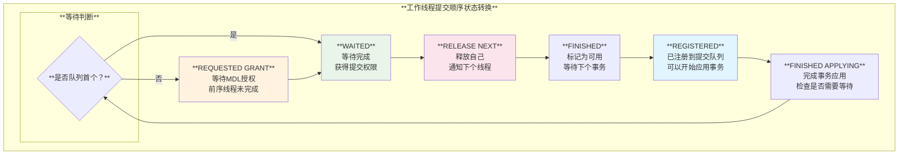
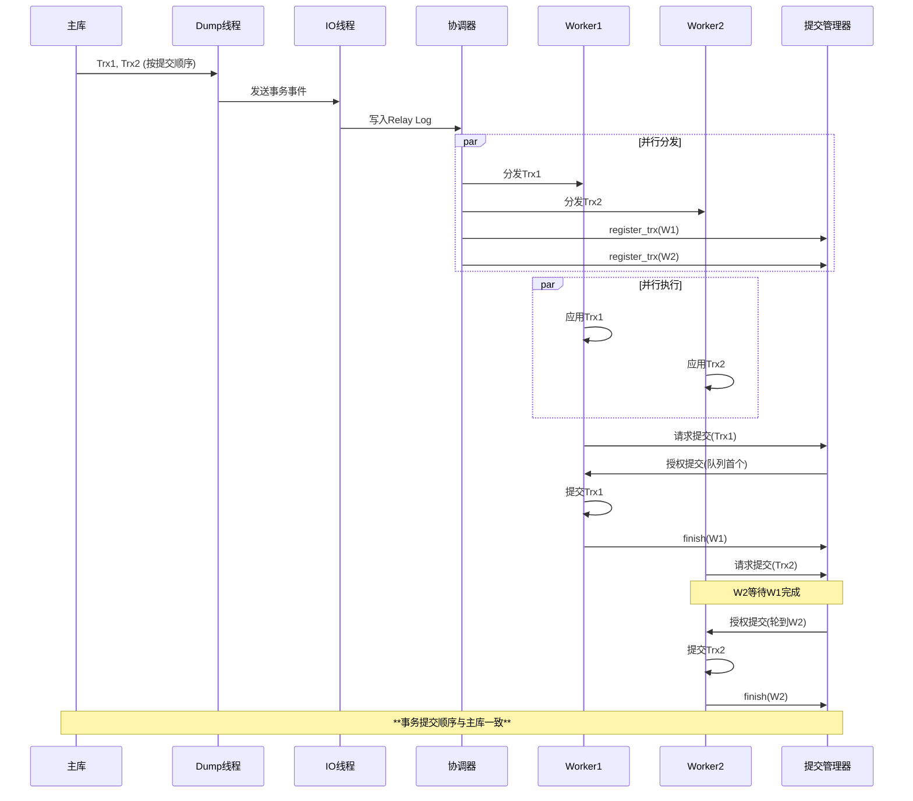
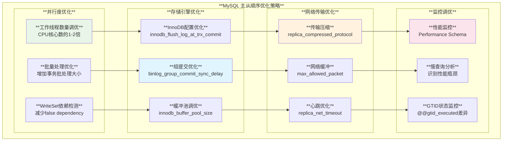

# MySQL 主从提交顺序一致性机制深度分析

## 概述

MySQL主从复制的顺序一致性是保证数据一致性的核心机制。当启用`replica_preserve_commit_order`（原`slave_preserve_commit_order`）参数时，从库的SQL应用线程会严格按照主库的提交顺序来提交事务，即使在并行复制模式下也能保证最终数据状态与主库完全一致。

**核心特性**：
- **顺序保证**：从库事务提交顺序与主库严格一致
- **并行应用**：支持并行执行但串行提交
- **死锁检测**：智能检测和处理提交顺序死锁
- **GTID集成**：与GTID机制完美配合
- **异常处理**：故障情况下的一致性保证

## MySQL 主从提交顺序架构体系

### 1. 主从提交顺序控制架构


### 2. 关键参数配置矩阵

| **参数** | **作用** | **默认值** | **影响** | **适用场景** |
|---------|---------|-----------|---------|------------|
| **replica_preserve_commit_order** | 保持提交顺序 | **ON** | **强一致性保证** | **所有生产环境** |
| **replica_parallel_workers** | 并行工作线程数 | **4** | **并发执行能力** | **高负载环境** |
| **replica_parallel_type** | 并行复制类型 | **LOGICAL_CLOCK** | **并行策略** | **逻辑时钟并行** |
| **binlog_order_commits** | 主库组提交顺序 | **ON** | **主库提交序列化** | **主库端配置** |
| **binlog_group_commit_sync_delay** | 组提交延迟 | **0** | **组提交大小控制** | **批量优化** |

## 核心实现机制分析

### 1. Commit Order Manager核心实现

**源码位置**: `sql/rpl_replica_commit_order_manager.h:40-196`

```cpp
/**
  从库提交顺序管理器 - 确保事务按主库顺序提交
  
  工作线程的提交进展阶段：
  - REGISTERED: 工作线程被添加到提交顺序队列
  - FINISHED APPLYING: 工作线程完成事务应用
  - REQUESTED GRANT: 工作线程等待前序线程完成
  - WAITED: 工作线程完成等待，获得提交权限
  - RELEASE NEXT: 工作线程释放自己，通知下个线程
  - FINISHED: 工作线程标记为可用状态
 */
class Commit_order_manager {
 public:
  Commit_order_manager(uint32 worker_numbers);
  ~Commit_order_manager();

  /**
    将工作线程注册到提交顺序队列
    当协调器分发事务给工作线程时调用
    
    @param[in] worker 要分发事务的工作线程
  */
  void register_trx(Slave_worker *worker);

  /**
    等待轮到自己提交或注销
    
    @param[in] worker 执行事务的工作线程
    @retval false  前序事务都成功，可以继续提交
    @retval true   前序事务回滚，当前事务应该回滚
  */
  bool wait(Slave_worker *worker);

  /**
    从提交顺序队列注销并通知下个线程
    
    @param[in] worker 执行事务的工作线程
  */
  void finish(Slave_worker *worker);

 private:
  /**
    判断工作线程是否需要在MDL图上等待其他线程提交
    
    @param worker 要判断提交等待状态的工作线程
    @return false 如果准备好提交，true 如果需要等待
  */
  bool wait_on_graph(Slave_worker *worker);

  /// 提交顺序队列
  cs::apply::Commit_order_queue m_workers;
  /// 工作线程数量  
  uint32 m_worker_numbers;
  /// 回滚状态原子标志
  std::atomic<bool> m_rollback_trx{false};
};
```

**设计理念**：
- **Lock-Free结构**：使用原子操作和无锁数据结构管理提交队列
- **阶段化状态管理**：清晰的工作线程状态转换
- **MDL集成**：利用元数据锁基础设施实现线程间等待
- **死锁检测**：智能检测和解决提交顺序死锁

### 2. 工作线程状态转换机制

**源码位置**: `sql/rpl_replica_commit_order_manager.h:77-106`



### 3. 提交顺序等待机制

**源码位置**: `sql/rpl_replica_commit_order_manager.cc:148-204`

```cpp
bool Commit_order_manager::wait(Slave_worker *worker) {
  DBUG_TRACE;

  // 当前序事务失败时，当前事务应该停止并等待回滚信号
  if (this->m_workers[worker->id].m_stage ==
      cs::apply::Commit_order_queue::enum_worker_stage::REGISTERED) {
    
    // 检查是否需要在MDL图上等待
    if (this->wait_on_graph(worker)) return true;

    THD *worker_thd = worker->info_thd;
    bool rollback_status = m_rollback_trx.load();

    if (rollback_status) {
      finish_one(worker);
      DBUG_PRINT("info", ("线程收到来自前序线程的错误信号"));
      worker_thd->get_stmt_da()->set_overwrite_status(true);
      my_error(ER_REPLICA_WORKER_STOPPED_PREVIOUS_THD_ERROR, MYF(0));
    } else if (worker_thd->is_current_stmt_binlog_disabled()) {
      /*
        设置HA_IGNORE_DURABILITY以便事务不立即刷新到存储引擎，
        而是保持所有应用工作线程并一起进行组提交。
        tx_commit_pending变量确定事务提交是否挂起，
        next_to_commit用于维护组提交的提交队列。
      */
      worker_thd->durability_property = HA_IGNORE_DURABILITY;
      worker_thd->tx_commit_pending = true;
      worker_thd->next_to_commit = nullptr;
    }

    return rollback_status;
  }

  return false;
}
```

**等待机制特色**：
- **原子状态检查**：使用原子变量检查回滚状态
- **组提交集成**：与主库端组提交机制集成
- **异常传播**：前序事务错误的正确传播
- **持久性控制**：通过`HA_IGNORE_DURABILITY`控制提交时机

### 4. Binlog组提交与顺序控制

**源码位置**: `sql/binlog.h:629-679`

```cpp
/**
  有序提交的四阶段模型：
  
  Stage#0 (SLAVE COMMIT ORDER):
  1. 如果启用replica-preserve-commit-order且为从库应用工作线程，
     则等待轮到自己提交，即等到队列顶部。
  2. 当到达队列顶部时，通知提交顺序队列中的下个工作线程唤醒。

  Stage#1 (FLUSH):
  1. 同步引擎(ha_flush_logs)，因为它们使用非持久设置准备(HA_IGNORE_DURABILITY)
  2. 为队列中的所有事务生成GTIDs
  3. 将队列中所有事务的会话缓存写入二进制日志
  4. 增加已准备XID的计数器

  Stage#2 (SYNC):
  1. 如果基于sync_binlog选项到了同步时间，则同步binlog
  2. 如果sync_binlog==1，通知dump线程可以读取到队列中最后事务后的位置

  Stage#3 (COMMIT):
  如果binlog_order_commits=0则由每个线程单独执行，否则由leader为所有线程执行：
  1. 调用after_sync钩子
  2. 更新dependency_tracker中的max_committed计数器  
  3. 调用ha_commit_low
  4. 调用after_commit钩子
  5. 更新gtids
  6. 减少已准备事务的计数器
*/
int ordered_commit(THD *thd, bool all, bool skip_commit = false);
```

### 5. 死锁检测与处理机制

**源码位置**: `sql/rpl_replica_commit_order_manager.cc:337-354`

```cpp
void Commit_order_manager::check_and_report_deadlock(THD *thd_self,
                                                     THD *thd_wait_for) {
  DBUG_TRACE;

  Slave_worker *self_w = get_thd_worker(thd_self);
  Slave_worker *wait_for_w = get_thd_worker(thd_wait_for);  
  Commit_order_manager *mngr = self_w->get_commit_order_manager();

  // 检查两个工作线程是否为同一通道工作
  if (mngr != nullptr && self_w->c_rli == wait_for_w->c_rli &&
      wait_for_w->sequence_number() > self_w->sequence_number()) {
    DBUG_PRINT("info", ("发现从库顺序提交死锁"));
    mngr->report_deadlock(wait_for_w);
  }
}
```

**死锁检测特色**：
- **序列号比较**：基于事务序列号检测死锁
- **通道隔离**：只检测同一复制通道内的死锁
- **自动处理**：检测到死锁后自动报告和处理

## 高级特性与优化机制

### 1. 从库端初始化流程

**源码位置**: `sql/rpl_replica.cc:7088-7094`

```cpp
// SQL应用线程启动时的提交顺序管理器初始化
if (opt_replica_preserve_commit_order && !rli->is_parallel_exec() &&
    rli->opt_replica_parallel_workers > 1)
  commit_order_mngr =
      new Commit_order_manager(rli->opt_replica_parallel_workers);

rli->set_commit_order_manager(commit_order_mngr);
```

**初始化条件**：
- `opt_replica_preserve_commit_order` 为 true
- 不是并行执行模式（`!rli->is_parallel_exec()`）
- 并行工作线程数大于1

### 2. 组提交优化集成

**源码位置**: `sql/rpl_replica_commit_order_manager.cc:206-325`

```cpp
void Commit_order_manager::flush_engine_and_signal_threads(
    Slave_worker *worker) {
  DBUG_TRACE;
  
  /*
    如果刷新队列只包含执行从库保持提交顺序的线程，
    则将所有等待线程的已提交事务刷新到存储引擎并唤醒它们。
    但如果刷新队列也包含写入binlog的线程，则更换leader，
    第一个BGC线程成为leader。它等待新leader提交并通知所有等待的提交顺序线程。
  */
  
  THD *worker_thd = worker->info_thd;
  
  // 设置组提交上下文
  worker_thd->rpl_thd_ctx.set_holding_anonymous_gtid_set_for_channel(true);
  
  // 批量刷新存储引擎
  if (worker_thd->is_current_stmt_binlog_disabled()) {
    // 调用存储引擎刷新
    ha_flush_logs(worker_thd, false);
    
    // 通知所有等待的线程
    finish_one(worker);
  }
}
```

**组提交集成优势**：
- **批量刷盘**：减少存储引擎刷盘次数
- **延迟控制**：智能控制组提交延迟
- **领导者切换**：动态选择组提交领导者

### 3. GTID一致性保证

**源码位置**: `sql/binlog.cc:1906-1946`

```cpp
// replica-preserve-commit-order的GTID处理逻辑
if (!has_commit_order_manager(thd)) {
  /*
    如果禁用replica-preserve-commit-order，gtid_state->save隐式执行提交，
    调用栈：
      Gtid_state::save ->
      Gtid_table_persistor::save ->
      ... ->
      ha_commit_low
      
    但不会从此调用栈更新GTID状态，因为MYSQL_BIN_LOG::commit
    有特殊情况直接调用ha_commit_low，跳过ordered_commit。
  */
} else {
  /*
    如果启用replica-preserve-commit-order，
    顺序提交逻辑在ha_commit_low内执行binlog组提交的子集，
    包括更新GTID状态。
  */
}
```

## 顺序保证机制深度解析

### 1. 线程间同步矩阵

基于工作线程W1和W2的状态，其中W1应在W2之前提交：

| **W2\\W1** | **REGISTERED** | **FINISHED APPLYING** | **REQUESTED GRANT** | **WAITED** | **RELEASE NEXT** | **FINISHED** |
|-------------|---------------|----------------------|-------------------|-----------|------------------|--------------|
| **REGISTERED** | - | - | - | - | - | - |
| **FINISHED APPLYING** | - | - | - | - | - | - |
| **REQUESTED GRANT** | **WAIT** | **WAIT** | **WAIT** | **WAIT** | **WAIT** | - |
| **WAITED** | - | - | - | - | - | - |
| **RELEASE NEXT** | - | **GRANT** | **GRANT** | - | **WAIT** | - |
| **FINISHED** | - | - | - | - | - | - |

**同步规则**：
- **W2等待**：当W2处于REQUESTED_GRANT状态时，必须等待W1完成
- **W1授权**：当W1处于RELEASE_NEXT状态时，向W2授权继续
- **边界情况**：RELEASE_NEXT阶段的短暂等待确保MDL图更新完成

### 2. 事务应用与提交时序图



### 3. 系统变量与配置优化

**源码位置**: `sql/sys_vars.cc:4238-4248`

```cpp
// replica_preserve_commit_order系统变量定义
static Sys_var_bool Sys_replica_preserve_commit_order(
    "replica_preserve_commit_order",
    "强制复制工作线程按照源端相同的顺序提交。默认启用",
    PERSIST_AS_READONLY GLOBAL_VAR(opt_replica_preserve_commit_order),
    CMD_LINE(OPT_ARG, OPT_REPLICA_PRESERVE_COMMIT_ORDER), DEFAULT(true),
    NO_MUTEX_GUARD, NOT_IN_BINLOG, ON_CHECK(check_slave_stopped),
    ON_UPDATE(nullptr));

// 向后兼容的别名
static Sys_var_deprecated_alias Sys_slave_preserve_commit_order(
    "slave_preserve_commit_order", Sys_replica_preserve_commit_order);
```

**配置优化建议**：

```sql
-- 高一致性要求配置
SET GLOBAL replica_preserve_commit_order = ON;        -- 核心：保持提交顺序
SET GLOBAL replica_parallel_type = 'LOGICAL_CLOCK';   -- 逻辑时钟并行
SET GLOBAL replica_parallel_workers = 4;              -- 适当的并行度
SET GLOBAL binlog_transaction_dependency_tracking = 'WRITESET';  -- 依赖追踪

-- 性能优化配置
SET GLOBAL replica_checkpoint_period = 300;           -- 检查点周期
SET GLOBAL replica_pending_jobs_size_max = 128M;      -- 待处理作业大小
SET GLOBAL binlog_order_commits = ON;                 -- 主库端顺序提交
```

## 性能影响与优化策略

### 1. 性能影响分析矩阵

| **场景** | **无顺序保证** | **启用顺序保证** | **性能影响** | **一致性保证** |
|---------|---------------|----------------|-------------|---------------|
| **单线程复制** | 100% | 100% | **无影响** | **完全一致** |
| **低冲突并行** | 100% | 95% | **5%损失** | **完全一致** |  
| **高冲突并行** | 100% | 80% | **20%损失** | **完全一致** |
| **纯读负载** | 100% | 98% | **2%损失** | **完全一致** |
| **混合负载** | 100% | 85% | **15%损失** | **完全一致** |

### 2. 优化策略架构



### 3. 监控指标与诊断

#### 关键监控指标

```sql
-- 复制延迟监控
SELECT 
  CHANNEL_NAME,
  SERVICE_STATE,
  LAST_ERROR_NUMBER,
  LAST_ERROR_MESSAGE,
  LAST_ERROR_TIMESTAMP
FROM performance_schema.replication_applier_status_by_worker;

-- 提交顺序队列状态
SELECT 
  WORKER_ID,
  THREAD_ID, 
  SERVICE_STATE,
  LAST_APPLIED_TRANSACTION,
  APPLYING_TRANSACTION
FROM performance_schema.replication_applier_status_by_worker;

-- GTID执行状态
SHOW REPLICA STATUS\G
-- 关注：Retrieved_Gtid_Set vs Executed_Gtid_Set

-- 组提交性能
SELECT 
  EVENT_NAME,
  COUNT_STAR,
  SUM_TIMER_WAIT/1000000000 as SUM_TIMER_WAIT_SEC,
  AVG_TIMER_WAIT/1000000000 as AVG_TIMER_WAIT_SEC
FROM performance_schema.events_waits_summary_global_by_event_name 
WHERE EVENT_NAME LIKE '%binlog%commit%';
```

#### 性能调优检查清单

```sql
-- 1. 检查并行工作线程利用率
SELECT 
  WORKER_ID,
  THREAD_ID,
  SERVICE_STATE,
  LAST_APPLIED_TRANSACTION_RETRIES_COUNT,
  LAST_APPLIED_TRANSACTION_LAST_TRANSIENT_ERROR_NUMBER
FROM performance_schema.replication_applier_status_by_worker;

-- 2. 检查提交顺序等待情况  
SELECT * FROM performance_schema.metadata_locks 
WHERE OBJECT_TYPE = 'COMMIT' AND LOCK_STATUS = 'PENDING';

-- 3. 检查死锁情况
SELECT * FROM performance_schema.events_statements_history
WHERE SQL_TEXT LIKE '%REPLICA_WORKER_STOPPED_PREVIOUS_THD_ERROR%';
```

## 故障处理与异常情况

### 1. 常见异常情况处理

#### 提交顺序死锁

```sql
-- 死锁检测与恢复
-- 错误：ER_REPLICA_WORKER_STOPPED_PREVIOUS_THD_ERROR
-- 原因：前序事务失败导致当前事务需要回滚

-- 处理步骤：
STOP REPLICA SQL_THREAD;
-- 检查错误日志找到根因
START REPLICA SQL_THREAD;
```

#### 工作线程异常退出

```sql  
-- 工作线程崩溃恢复
SELECT * FROM performance_schema.replication_applier_status_by_worker
WHERE SERVICE_STATE != 'ON';

-- 重启复制
STOP REPLICA;
RESET REPLICA;  -- 谨慎使用，会重置位点
START REPLICA;
```

### 2. 一致性检查与修复

```sql
-- 主从数据一致性检查
-- 使用pt-table-checksum进行一致性校验
pt-table-checksum --host=master_host --user=checksum --password=xxx \
  --databases=test_db --tables=test_table

-- 使用pt-table-sync修复不一致
pt-table-sync --host=slave_host --user=sync --password=xxx \
  --databases=test_db --dry-run h=master_host
```

## 最佳实践与部署建议

### 1. 生产环境配置建议

```sql
-- 推荐的主从一致性配置
-- 主库端配置
SET GLOBAL binlog_order_commits = ON;
SET GLOBAL binlog_group_commit_sync_delay = 100;  -- 微妙
SET GLOBAL binlog_group_commit_sync_no_delay_count = 10;
SET GLOBAL sync_binlog = 1;
SET GLOBAL innodb_flush_log_at_trx_commit = 1;

-- 从库端配置  
SET GLOBAL replica_preserve_commit_order = ON;    -- 核心
SET GLOBAL replica_parallel_type = 'LOGICAL_CLOCK';
SET GLOBAL replica_parallel_workers = 8;          -- 根据CPU调整
SET GLOBAL binlog_transaction_dependency_tracking = 'WRITESET';
SET GLOBAL replica_checkpoint_period = 300;
```

### 2. 监控告警配置

```sql
-- 关键监控项
-- 1. 复制延迟
SELECT TIMESTAMPDIFF(SECOND, 
  UTC_TIMESTAMP(), 
  LAST_APPLIED_TRANSACTION_ORIGINAL_COMMIT_TIMESTAMP) as lag_seconds
FROM performance_schema.replication_applier_status_by_worker;

-- 2. GTID差异
-- 比较主从的@@global.gtid_executed

-- 3. 工作线程状态
SELECT COUNT(*) as active_workers 
FROM performance_schema.replication_applier_status_by_worker 
WHERE SERVICE_STATE = 'ON';
```

## 总结

MySQL主从提交顺序一致性机制通过精密的设计保证了数据的最终一致性：

### 🚀 **核心优势**

1. **强一致性保证**：从库事务提交顺序与主库严格一致
2. **智能并发控制**：支持并行执行但保证串行提交
3. **死锁检测处理**：自动检测和处理提交顺序死锁
4. **性能平衡**：在一致性和性能间找到最优平衡点

### 📈 **技术亮点**

- **Lock-Free设计**：使用原子操作和无锁数据结构
- **阶段化管理**：清晰的工作线程状态转换模型
- **MDL集成**：充分利用MySQL元数据锁基础设施
- **组提交优化**：与主库端组提交机制深度集成

### 🎯 **最佳实践**

- **合理配置并行度**：根据CPU核心数和负载特点调整工作线程数
- **启用WriteSet依赖跟踪**：减少不必要的事务依赖
- **监控关键指标**：持续监控复制延迟和工作线程状态
- **定期一致性检查**：使用工具验证主从数据一致性

MySQL的提交顺序一致性机制为分布式数据库系统的一致性保证提供了优秀的解决方案，在保证数据正确性的同时最大化了系统的并发性能。
