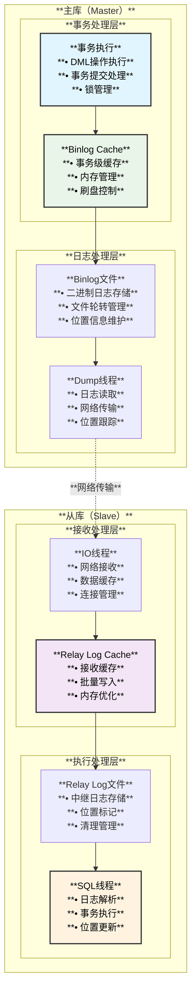
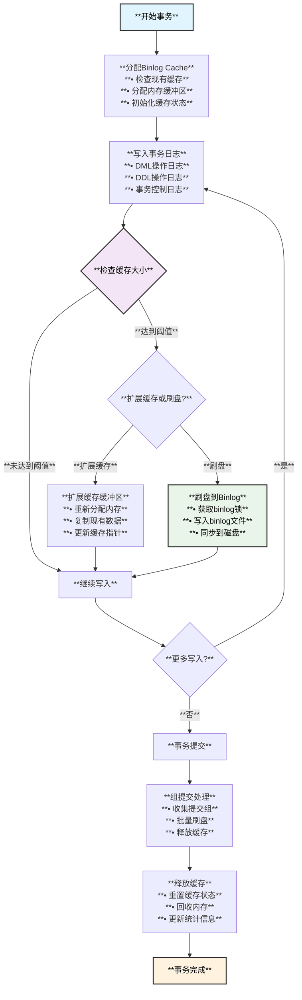
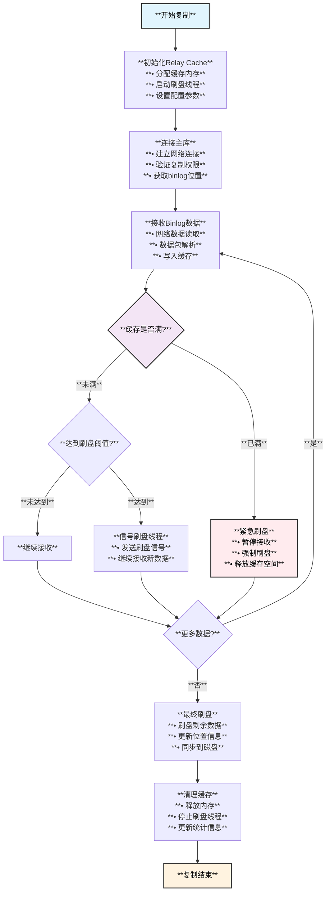
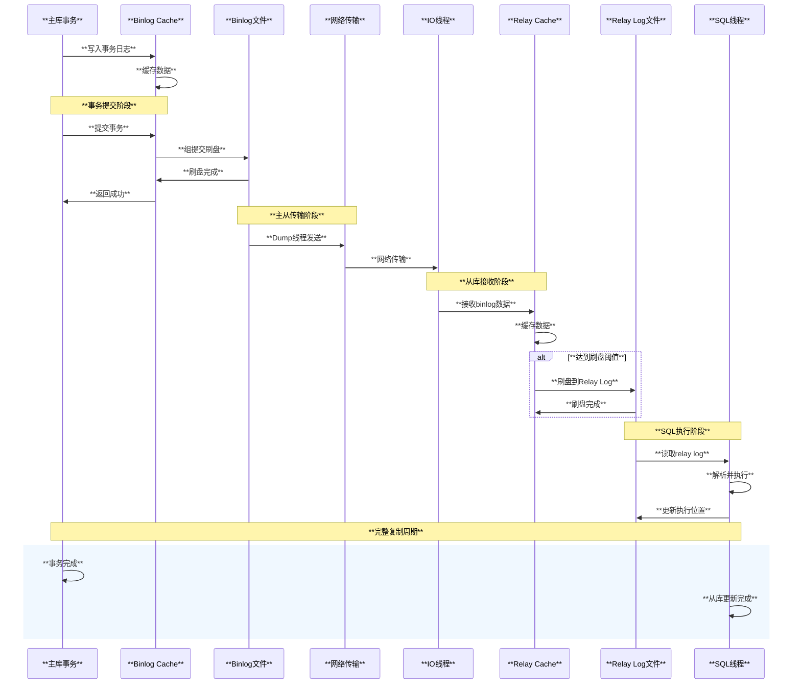

# MySQL Relay Log Cache与Binlog Cache Free Flush架构设计

## 概述

**Relay Log Cache**和**Binlog Cache Free Flush**是MySQL主从复制系统中的核心缓存机制，负责优化日志数据的传输、存储和刷新过程。本文档深入分析这两个模块的架构设计、功能特点和工作流程，展示MySQL如何通过智能缓存策略提升复制性能和数据可靠性。

## 整体架构概览

### **主从复制缓存架构图**



## Binlog Cache模块架构

### **核心数据结构**

```cpp
/** Binlog Cache核心结构定义 */

// Binlog缓存项结构
struct Binlog_Cache_Entry {
  my_thread_id thd_id;                // 线程ID
  ulong binlog_cache_size;            // 缓存大小
  ulong binlog_cache_disk_use;        // 磁盘使用量
  IO_CACHE binlog_cache_log;          // 缓存IO结构
  
  // 缓存状态
  enum Cache_State {
    CACHE_EMPTY,                      // 缓存为空
    CACHE_WRITING,                    // 正在写入
    CACHE_FLUSHING,                   // 正在刷盘
    CACHE_ERROR                       // 错误状态
  } state;
  
  // 内存管理
  uchar* cache_buffer;                // 缓存缓冲区
  size_t buffer_size;                 // 缓冲区大小
  size_t write_pos;                   // 写入位置
  size_t flush_pos;                   // 刷盘位置
};

/** Binlog Cache管理器 */
class Binlog_Cache_Manager {
private:
  std::map<my_thread_id, Binlog_Cache_Entry*> m_cache_map;
  mysql_mutex_t m_cache_mutex;        // 缓存互斥锁
  mysql_cond_t m_cache_cond;          // 缓存条件变量
  
  // 配置参数
  ulong m_max_binlog_cache_size;      // 最大缓存大小
  ulong m_binlog_cache_size;          // 默认缓存大小
  bool m_sync_binlog;                 // 同步刷盘标志
  
public:
  /** 获取线程的Binlog Cache */
  Binlog_Cache_Entry* get_binlog_cache(THD* thd) {
    mysql_mutex_lock(&m_cache_mutex);
    
    auto it = m_cache_map.find(thd->thread_id());
    if (it == m_cache_map.end()) {
      // 创建新的缓存项
      Binlog_Cache_Entry* cache = create_cache_entry(thd);
      m_cache_map[thd->thread_id()] = cache;
      mysql_mutex_unlock(&m_cache_mutex);
      return cache;
    }
    
    mysql_mutex_unlock(&m_cache_mutex);
    return it->second;
  }
  
  /** 写入事务日志到缓存 */
  int write_transaction_log(THD* thd, const char* log_data, size_t length) {
    Binlog_Cache_Entry* cache = get_binlog_cache(thd);
    
    // 检查缓存空间
    if (cache->write_pos + length > cache->buffer_size) {
      // 扩展缓存或刷盘
      if (expand_or_flush_cache(cache, length) != 0) {
        return 1; // 失败
      }
    }
    
    // 写入数据到缓存
    memcpy(cache->cache_buffer + cache->write_pos, log_data, length);
    cache->write_pos += length;
    cache->state = Binlog_Cache_Entry::CACHE_WRITING;
    
    return 0; // 成功
  }
  
private:
  /** 扩展缓存或执行刷盘 */
  int expand_or_flush_cache(Binlog_Cache_Entry* cache, size_t needed_size) {
    // 计算所需缓存大小
    size_t new_size = cache->buffer_size * 2;
    while (new_size < cache->write_pos + needed_size) {
      new_size *= 2;
    }
    
    // 检查是否超过最大限制
    if (new_size > m_max_binlog_cache_size) {
      // 执行刷盘操作
      return flush_cache_to_disk(cache);
    }
    
    // 扩展缓存
    return expand_cache_buffer(cache, new_size);
  }
};
```

### **Binlog Cache Free Flush机制**

```cpp
/** Binlog Cache刷盘控制器 */
class Binlog_Cache_Flush_Controller {
private:
  std::queue<Binlog_Cache_Entry*> m_flush_queue;  // 刷盘队列
  mysql_mutex_t m_flush_mutex;                    // 刷盘互斥锁
  mysql_cond_t m_flush_cond;                      // 刷盘条件变量
  std::atomic<bool> m_flush_thread_running;       // 刷盘线程状态
  
public:
  /** 组提交刷盘机制 */
  int group_commit_flush(std::vector<THD*>& commit_group) {
    std::vector<Binlog_Cache_Entry*> flush_entries;
    
    // 1. 收集所有需要刷盘的缓存
    for (auto* thd : commit_group) {
      Binlog_Cache_Entry* cache = get_binlog_cache(thd);
      if (cache && cache->write_pos > cache->flush_pos) {
        flush_entries.push_back(cache);
      }
    }
    
    if (flush_entries.empty()) {
      return 0; // 无需刷盘
    }
    
    // 2. 批量刷盘操作
    return batch_flush_to_binlog(flush_entries);
  }
  
  /** 批量刷盘到binlog文件 */
  int batch_flush_to_binlog(std::vector<Binlog_Cache_Entry*>& entries) {
    mysql_mutex_lock(&LOCK_log);
    
    for (auto* entry : entries) {
      entry->state = Binlog_Cache_Entry::CACHE_FLUSHING;
      
      // 写入binlog文件
      if (my_b_write(&mysql_bin_log.log_file, 
                    entry->cache_buffer + entry->flush_pos,
                    entry->write_pos - entry->flush_pos)) {
        entry->state = Binlog_Cache_Entry::CACHE_ERROR;
        mysql_mutex_unlock(&LOCK_log);
        return 1; // 写入失败
      }
      
      entry->flush_pos = entry->write_pos;
    }
    
    // 根据sync_binlog配置决定是否同步
    if (sync_binlog_period == 1) {
      mysql_file_sync(mysql_bin_log.log_file.file, MYF(MY_WME));
    }
    
    mysql_mutex_unlock(&LOCK_log);
    
    // 更新缓存状态并可能释放内存
    post_flush_cleanup(entries);
    
    return 0; // 成功
  }
  
  /** 刷盘后清理工作 */
  void post_flush_cleanup(std::vector<Binlog_Cache_Entry*>& entries) {
    for (auto* entry : entries) {
      entry->state = Binlog_Cache_Entry::CACHE_EMPTY;
      
      // 如果缓存已刷盘，考虑释放部分内存
      if (entry->flush_pos == entry->write_pos) {
        // 重置缓存位置
        entry->write_pos = 0;
        entry->flush_pos = 0;
        
        // 如果缓存过大，缩减到默认大小
        if (entry->buffer_size > binlog_cache_size * 2) {
          free_excess_cache_memory(entry);
        }
      }
    }
  }
};
```

## Relay Log Cache模块架构

### **Relay Log Cache核心实现**

```cpp
/** Relay Log Cache管理器 */
class Relay_Log_Cache_Manager {
private:
  // 缓存配置
  struct Cache_Config {
    size_t relay_log_cache_size;      // Relay log缓存大小
    size_t max_relay_log_cache;       // 最大缓存限制
    size_t flush_threshold;           // 刷盘阈值
    ulonglong flush_interval;         // 刷盘间隔（毫秒）
  } m_config;
  
  // 缓存数据结构
  struct Relay_Cache_Buffer {
    uchar* buffer;                    // 缓存缓冲区
    size_t size;                      // 缓冲区大小
    size_t write_pos;                 // 写入位置
    size_t read_pos;                  // 读取位置
    mysql_mutex_t buffer_mutex;       // 缓冲区锁
    
    // 统计信息
    uint64_t bytes_received;          // 接收字节数
    uint64_t bytes_written;           // 写入字节数
    uint64_t flush_count;             // 刷盘次数
  } m_cache_buffer;
  
  // 刷盘控制
  mysql_cond_t m_flush_cond;          // 刷盘条件变量
  std::atomic<bool> m_need_flush;     // 是否需要刷盘
  
public:
  /** 初始化Relay Log Cache */
  int init_relay_log_cache(size_t cache_size) {
    m_config.relay_log_cache_size = cache_size;
    m_config.max_relay_log_cache = cache_size * 4;
    m_config.flush_threshold = cache_size / 2;
    m_config.flush_interval = 1000;  // 1秒
    
    // 分配缓存内存
    m_cache_buffer.buffer = (uchar*)my_malloc(PSI_NOT_INSTRUMENTED,
                                             cache_size, MYF(0));
    if (!m_cache_buffer.buffer) {
      return 1; // 内存分配失败
    }
    
    m_cache_buffer.size = cache_size;
    m_cache_buffer.write_pos = 0;
    m_cache_buffer.read_pos = 0;
    
    mysql_mutex_init(PSI_NOT_INSTRUMENTED, &m_cache_buffer.buffer_mutex, 
                    MY_MUTEX_INIT_FAST);
    mysql_cond_init(PSI_NOT_INSTRUMENTED, &m_flush_cond);
    
    return 0; // 成功
  }
  
  /** 接收主库日志数据 */
  int receive_binlog_data(const uchar* data, size_t length) {
    mysql_mutex_lock(&m_cache_buffer.buffer_mutex);
    
    // 检查缓存空间
    size_t available_space = get_available_space();
    if (length > available_space) {
      // 触发紧急刷盘
      mysql_mutex_unlock(&m_cache_buffer.buffer_mutex);
      if (emergency_flush() != 0) {
        return 1; // 刷盘失败
      }
      mysql_mutex_lock(&m_cache_buffer.buffer_mutex);
    }
    
    // 写入数据到缓存
    size_t copy_size = std::min(length, m_cache_buffer.size - m_cache_buffer.write_pos);
    memcpy(m_cache_buffer.buffer + m_cache_buffer.write_pos, data, copy_size);
    m_cache_buffer.write_pos += copy_size;
    m_cache_buffer.bytes_received += copy_size;
    
    // 检查是否需要刷盘
    if (m_cache_buffer.write_pos - m_cache_buffer.read_pos >= m_config.flush_threshold) {
      m_need_flush.store(true);
      mysql_cond_signal(&m_flush_cond);
    }
    
    mysql_mutex_unlock(&m_cache_buffer.buffer_mutex);
    
    // 处理剩余数据（如果有）
    if (copy_size < length) {
      return receive_binlog_data(data + copy_size, length - copy_size);
    }
    
    return 0; // 成功
  }
  
private:
  /** 获取可用缓存空间 */
  size_t get_available_space() const {
    if (m_cache_buffer.write_pos >= m_cache_buffer.read_pos) {
      return m_cache_buffer.size - (m_cache_buffer.write_pos - m_cache_buffer.read_pos);
    } else {
      return m_cache_buffer.read_pos - m_cache_buffer.write_pos;
    }
  }
  
  /** 紧急刷盘操作 */
  int emergency_flush() {
    return flush_cache_to_relay_log(true); // 强制刷盘
  }
};
```

### **Relay Log缓存刷盘机制**

```cpp
/** Relay Log刷盘线程实现 */
class Relay_Log_Flush_Thread {
private:
  Relay_Log_Cache_Manager* m_cache_manager;
  std::atomic<bool> m_thread_running;
  mysql_thread_handle m_thread_handle;
  
public:
  /** 刷盘线程主循环 */
  void flush_thread_main() {
    while (m_thread_running.load()) {
      mysql_mutex_lock(&m_cache_manager->m_cache_buffer.buffer_mutex);
      
      // 等待刷盘信号或超时
      struct timespec wait_timeout;
      set_timespec(&wait_timeout, 1); // 1秒超时
      
      if (!m_cache_manager->m_need_flush.load()) {
        mysql_cond_timedwait(&m_cache_manager->m_flush_cond,
                           &m_cache_manager->m_cache_buffer.buffer_mutex,
                           &wait_timeout);
      }
      
      mysql_mutex_unlock(&m_cache_manager->m_cache_buffer.buffer_mutex);
      
      // 执行刷盘操作
      if (m_cache_manager->m_need_flush.load()) {
        flush_cached_data();
        m_cache_manager->m_need_flush.store(false);
      }
    }
  }
  
private:
  /** 刷盘缓存数据 */
  int flush_cached_data() {
    Relay_Cache_Buffer& buffer = m_cache_manager->m_cache_buffer;
    
    mysql_mutex_lock(&buffer.buffer_mutex);
    
    if (buffer.write_pos <= buffer.read_pos) {
      mysql_mutex_unlock(&buffer.buffer_mutex);
      return 0; // 无数据需要刷盘
    }
    
    // 计算需要刷盘的数据量
    size_t flush_size = buffer.write_pos - buffer.read_pos;
    uchar* flush_data = buffer.buffer + buffer.read_pos;
    
    mysql_mutex_unlock(&buffer.buffer_mutex);
    
    // 写入relay log文件
    if (write_to_relay_log(flush_data, flush_size) != 0) {
      return 1; // 写入失败
    }
    
    // 更新读取位置
    mysql_mutex_lock(&buffer.buffer_mutex);
    buffer.read_pos += flush_size;
    buffer.bytes_written += flush_size;
    buffer.flush_count++;
    
    // 如果缓存已全部刷盘，重置位置
    if (buffer.read_pos == buffer.write_pos) {
      buffer.read_pos = 0;
      buffer.write_pos = 0;
    }
    
    mysql_mutex_unlock(&buffer.buffer_mutex);
    
    return 0; // 成功
  }
  
  /** 写入relay log文件 */
  int write_to_relay_log(const uchar* data, size_t length) {
    // 获取当前活跃的relay log
    MYSQL_BIN_LOG* relay_log = get_active_relay_log();
    
    mysql_mutex_lock(&relay_log->LOCK_log);
    
    // 检查文件大小限制
    if (relay_log->get_current_log_size() + length > max_relay_log_size) {
      // 轮转relay log文件
      if (rotate_relay_log(relay_log) != 0) {
        mysql_mutex_unlock(&relay_log->LOCK_log);
        return 1; // 轮转失败
      }
    }
    
    // 写入数据
    if (my_b_write(&relay_log->log_file, data, length)) {
      mysql_mutex_unlock(&relay_log->LOCK_log);
      return 1; // 写入失败
    }
    
    // 同步到磁盘（根据配置）
    if (sync_relay_log_period == 1) {
      if (mysql_file_sync(relay_log->log_file.file, MYF(MY_WME))) {
        mysql_mutex_unlock(&relay_log->LOCK_log);
        return 1; // 同步失败
      }
    }
    
    mysql_mutex_unlock(&relay_log->LOCK_log);
    
    return 0; // 成功
  }
};
```

## 缓存优化策略

### **内存管理优化**

```cpp
/** 缓存内存优化器 */
class Cache_Memory_Optimizer {
private:
  // 内存池管理
  struct Memory_Pool {
    std::vector<void*> free_blocks;   // 空闲块列表
    size_t block_size;                // 块大小
    size_t total_allocated;           // 总分配量
    mysql_mutex_t pool_mutex;         // 池互斥锁
  };
  
  std::map<size_t, Memory_Pool> m_memory_pools;
  
public:
  /** 智能内存分配 */
  void* allocate_cache_buffer(size_t size) {
    // 找到合适的内存池
    size_t pool_size = round_up_to_power_of_2(size);
    auto& pool = m_memory_pools[pool_size];
    
    mysql_mutex_lock(&pool.pool_mutex);
    
    void* buffer = nullptr;
    if (!pool.free_blocks.empty()) {
      // 重用空闲块
      buffer = pool.free_blocks.back();
      pool.free_blocks.pop_back();
    } else {
      // 分配新块
      buffer = my_malloc(PSI_NOT_INSTRUMENTED, pool_size, MYF(0));
      if (buffer) {
        pool.total_allocated += pool_size;
      }
    }
    
    mysql_mutex_unlock(&pool.pool_mutex);
    return buffer;
  }
  
  /** 释放缓存缓冲区 */
  void deallocate_cache_buffer(void* buffer, size_t size) {
    size_t pool_size = round_up_to_power_of_2(size);
    auto& pool = m_memory_pools[pool_size];
    
    mysql_mutex_lock(&pool.pool_mutex);
    
    // 如果池中空闲块过多，直接释放内存
    if (pool.free_blocks.size() < MAX_FREE_BLOCKS_PER_POOL) {
      pool.free_blocks.push_back(buffer);
    } else {
      my_free(buffer);
      pool.total_allocated -= pool_size;
    }
    
    mysql_mutex_unlock(&pool.pool_mutex);
  }
  
private:
  static constexpr size_t MAX_FREE_BLOCKS_PER_POOL = 16;
  
  size_t round_up_to_power_of_2(size_t size) {
    size_t power = 1;
    while (power < size) {
      power <<= 1;
    }
    return power;
  }
};
```

### **性能监控与调优**

```cpp
/** 缓存性能监控器 */
class Cache_Performance_Monitor {
private:
  // 性能统计
  struct Cache_Statistics {
    std::atomic<uint64_t> cache_hits{0};
    std::atomic<uint64_t> cache_misses{0};
    std::atomic<uint64_t> bytes_cached{0};
    std::atomic<uint64_t> bytes_flushed{0};
    std::atomic<uint64_t> flush_operations{0};
    std::atomic<uint64_t> memory_usage{0};
    
    // 性能指标
    double cache_hit_ratio() const {
      uint64_t total = cache_hits.load() + cache_misses.load();
      return total > 0 ? (double)cache_hits.load() / total : 0.0;
    }
    
    double avg_flush_size() const {
      uint64_t ops = flush_operations.load();
      return ops > 0 ? (double)bytes_flushed.load() / ops : 0.0;
    }
  };
  
  Cache_Statistics m_binlog_stats;
  Cache_Statistics m_relay_stats;
  
public:
  /** 输出性能报告 */
  void print_performance_report() const {
    ib::info() << "=== Cache Performance Report ===";
    
    ib::info() << "Binlog Cache:";
    ib::info() << "  Hit Ratio: " << m_binlog_stats.cache_hit_ratio() * 100 << "%";
    ib::info() << "  Bytes Cached: " << m_binlog_stats.bytes_cached.load();
    ib::info() << "  Bytes Flushed: " << m_binlog_stats.bytes_flushed.load();
    ib::info() << "  Flush Operations: " << m_binlog_stats.flush_operations.load();
    ib::info() << "  Avg Flush Size: " << m_binlog_stats.avg_flush_size();
    
    ib::info() << "Relay Log Cache:";
    ib::info() << "  Hit Ratio: " << m_relay_stats.cache_hit_ratio() * 100 << "%";
    ib::info() << "  Bytes Cached: " << m_relay_stats.bytes_cached.load();
    ib::info() << "  Bytes Flushed: " << m_relay_stats.bytes_flushed.load();
    ib::info() << "  Flush Operations: " << m_relay_stats.flush_operations.load();
    ib::info() << "  Avg Flush Size: " << m_relay_stats.avg_flush_size();
  }
  
  /** 动态调优建议 */
  void suggest_tuning_parameters() const {
    // 基于统计数据给出调优建议
    if (m_binlog_stats.cache_hit_ratio() < 0.8) {
      ib::warn() << "Binlog cache hit ratio is low, consider increasing binlog_cache_size";
    }
    
    if (m_relay_stats.avg_flush_size() < 4096) {
      ib::warn() << "Relay log flush size is small, consider adjusting flush threshold";
    }
    
    uint64_t total_memory = m_binlog_stats.memory_usage.load() + m_relay_stats.memory_usage.load();
    if (total_memory > 1024 * 1024 * 1024) { // 1GB
      ib::warn() << "Cache memory usage is high: " << total_memory << " bytes";
    }
  }
};
```

## 逻辑流程详解

### **Binlog Cache工作流程**



### **Relay Log Cache工作流程**



### **缓存协调工作流程**



## 配置参数与性能调优

### **关键配置参数**

```cpp
/** 缓存配置参数定义 */
struct Cache_Configuration {
    // Binlog Cache参数
    struct {
        ulong binlog_cache_size = 32768;           // 默认32KB
        ulong max_binlog_cache_size = ULONG_MAX;   // 最大缓存大小
        ulong sync_binlog = 1;                     // 同步刷盘频率
        bool binlog_group_commit_sync_delay = 0;   // 组提交延迟
        ulong binlog_group_commit_sync_no_delay_count = 0; // 无延迟提交数
    } binlog_cache;
    
    // Relay Log Cache参数
    struct {
        ulong relay_log_cache_size = 32768;        // 默认32KB
        ulong max_relay_log_cache = 1024*1024;     // 最大1MB
        ulong sync_relay_log = 10000;              // 同步频率
        ulong sync_relay_log_info = 10000;         // 信息同步频率
        bool relay_log_recovery = true;            // 自动恢复
    } relay_cache;
    
    // 性能调优参数
    struct {
        ulong flush_threshold_ratio = 50;          // 刷盘阈值比例(%)
        ulong memory_pool_size = 16;               // 内存池大小(MB)
        ulong flush_thread_count = 1;              // 刷盘线程数
        ulong io_thread_count = 1;                 // IO线程数
    } performance;
};
```

### **调优建议**

```cpp
/** 缓存调优建议器 */
class Cache_Tuning_Advisor {
public:
    /** 分析并给出调优建议 */
    void analyze_and_suggest(const Cache_Performance_Monitor& monitor) {
        auto binlog_stats = monitor.get_binlog_statistics();
        auto relay_stats = monitor.get_relay_statistics();
        
        // Binlog Cache调优
        suggest_binlog_cache_tuning(binlog_stats);
        
        // Relay Log Cache调优
        suggest_relay_cache_tuning(relay_stats);
        
        // 整体性能调优
        suggest_overall_performance_tuning(binlog_stats, relay_stats);
    }
    
private:
    void suggest_binlog_cache_tuning(const Cache_Statistics& stats) {
        // 缓存命中率分析
        if (stats.cache_hit_ratio() < 0.9) {
            std::cout << "建议: 增加binlog_cache_size到 " 
                     << suggest_binlog_cache_size(stats) << " 字节\n";
        }
        
        // 刷盘频率分析
        if (stats.avg_flush_size() < 8192) {
            std::cout << "建议: 调整sync_binlog为更大值以减少刷盘频率\n";
        }
        
        // 组提交优化
        if (stats.flush_operations.load() > 1000) {
            std::cout << "建议: 启用binlog_group_commit_sync_delay优化组提交\n";
        }
    }
    
    void suggest_relay_cache_tuning(const Cache_Statistics& stats) {
        // 内存使用分析
        if (stats.memory_usage.load() > 512*1024*1024) { // 512MB
            std::cout << "建议: 减少relay_log_cache_size或增加刷盘频率\n";
        }
        
        // 网络传输优化
        if (stats.bytes_cached.load() / stats.flush_operations.load() < 4096) {
            std::cout << "建议: 增加刷盘阈值以提高网络传输效率\n";
        }
    }
    
    size_t suggest_binlog_cache_size(const Cache_Statistics& stats) {
        // 基于当前使用情况建议新的缓存大小
        uint64_t avg_transaction_size = stats.bytes_cached.load() / 
                                       (stats.cache_hits.load() + stats.cache_misses.load());
        return std::max(avg_transaction_size * 2, (uint64_t)65536); // 至少64KB
    }
};
```

## 总结

### **核心架构特性**
1. **双层缓存设计**：Binlog Cache和Relay Log Cache分别优化主库和从库的日志处理性能
2. **智能刷盘机制**：基于阈值、时间和事务提交的多重触发条件
3. **内存优化管理**：动态内存分配、池化管理和自动回收机制
4. **性能监控体系**：全面的统计信息和自动调优建议系统

### **技术优势**
1. **高吞吐量**：批量处理和组提交显著提升写入性能
2. **低延迟传输**：缓存机制减少网络往返和磁盘IO开销
3. **资源效率**：智能内存管理和自适应缓存大小控制
4. **高可靠性**：多重数据保护和异常恢复机制

### **适用场景**
1. **高并发OLTP**：大量并发事务的在线事务处理系统
2. **数据复制**：主从复制、多主复制和分布式数据同步
3. **实时分析**：需要低延迟数据传输的实时分析场景
4. **灾难恢复**：高可用和灾难恢复系统的日志处理

MySQL的Relay Log Cache和Binlog Cache Free Flush机制展现了现代数据库在日志处理和数据复制方面的先进设计理念，通过精细化的缓存管理和智能化的刷盘策略，实现了高性能、高可靠性的数据复制架构。
