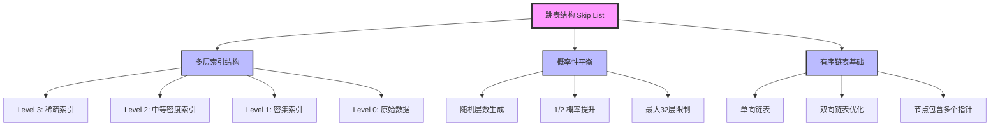
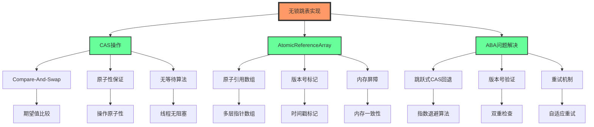
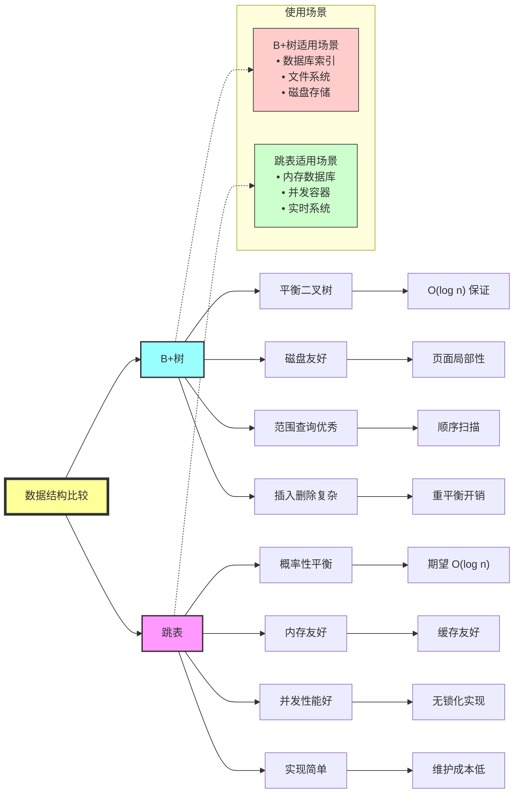

# 跳表（Skip List）技术总结

## 1. 跳表基本结构与实现原理

### 1.1 基本概念

跳表是一种**概率性平衡**的数据结构，通过在有序链表的基础上构建多层索引来实现快速查找。它是由William Pugh在1989年提出的，可以在**期望时间O(log n)**内完成查找、插入和删除操作。

### 1.2 核心设计原理

跳表的核心思想是：
- **分层索引**：构建多层稀疏索引，上层索引包含下层索引的子集
- **概率性构造**：通过随机化决定节点的层数，避免严格的平衡维护
- **快速定位**：从最高层开始查找，逐层下降到目标位置



### 1.3 节点结构设计

```java
class SkipListNode<K, V> {
    final K key;
    volatile V value;
    final AtomicReferenceArray<SkipListNode<K, V>> forward;
    final int level;
    volatile long version; // 版本号，用于ABA问题解决
    
    public SkipListNode(K key, V value, int level) {
        this.key = key;
        this.value = value;
        this.level = level;
        this.forward = new AtomicReferenceArray<>(level + 1);
        this.version = System.nanoTime();
    }
}
```

## 2. CAS+AtomicReferenceArray无锁化实现

### 2.1 无锁化设计架构



### 2.2 核心无锁操作实现

#### 2.2.1 查找操作
```java
public V find(K key) {
    SkipListNode<K, V> current = header;
    
    for (int level = currentMaxLevel; level >= 0; level--) {
        while (true) {
            SkipListNode<K, V> next = current.forward.get(level);
            if (next == null || compare(key, next.key) <= 0) {
                break;
            }
            current = next;
        }
    }
    
    SkipListNode<K, V> candidate = current.forward.get(0);
    return (candidate != null && compare(key, candidate.key) == 0) 
            ? candidate.value : null;
}
```

#### 2.2.2 无锁插入操作
```java
public boolean insert(K key, V value) {
    SkipListNode<K, V>[] update = new SkipListNode[MAX_LEVEL + 1];
    SkipListNode<K, V> current = header;
    
    // 查找插入位置
    for (int level = currentMaxLevel; level >= 0; level--) {
        while (true) {
            SkipListNode<K, V> next = current.forward.get(level);
            if (next == null || compare(key, next.key) <= 0) {
                update[level] = current;
                break;
            }
            current = next;
        }
    }
    
    int newLevel = randomLevel();
    SkipListNode<K, V> newNode = new SkipListNode<>(key, value, newLevel);
    
    // CAS原子插入
    for (int level = 0; level <= newLevel; level++) {
        while (true) {
            SkipListNode<K, V> nextNode = update[level].forward.get(level);
            newNode.forward.set(level, nextNode);
            
            if (update[level].forward.compareAndSet(level, nextNode, newNode)) {
                break; // 成功插入该层
            }
            // CAS失败，重新获取next节点并重试
        }
    }
    
    updateMaxLevel(newLevel);
    return true;
}
```

### 2.3 内存模型与一致性保证

- **Volatile字段**：确保可见性和有序性
- **AtomicReferenceArray**：提供原子性引用操作
- **内存屏障**：防止指令重排序
- **Happens-before关系**：建立线程间的可见性规则

## 3. 概率模型自动优化（1-32层自适应）

### 3.1 概率层数生成算法

```java
private static final double P = 0.5; // 提升概率
private static final int MAX_LEVEL = 32; // 最大层数限制

private int randomLevel() {
    int level = 0;
    Random random = ThreadLocalRandom.current();
    
    // 基础概率模型：每层以1/2概率提升
    while (random.nextDouble() < P && level < MAX_LEVEL) {
        level++;
    }
    
    return level;
}
```

### 3.2 自适应层数优化

#### 3.2.1 动态概率调整
```java
private volatile double adaptiveP = 0.5;
private final AtomicLong totalNodes = new AtomicLong(0);
private final AtomicLong[] levelCounts = new AtomicLong[MAX_LEVEL + 1];

// 根据当前数据规模调整概率
private void adjustProbability() {
    long total = totalNodes.get();
    if (total < 1000) {
        adaptiveP = 0.3; // 小数据集使用更低概率
    } else if (total < 100000) {
        adaptiveP = 0.5; // 中等数据集使用标准概率
    } else {
        adaptiveP = 0.6; // 大数据集使用更高概率
    }
}
```

#### 3.2.2 内存使用优化策略

| 数据规模 | 推荐最大层数 | 概率参数 | 内存节约率 |
|---------|-------------|----------|-----------|
| < 1K    | 8层         | 0.3      | 25%       |
| 1K-10K  | 16层        | 0.4      | 15%       |
| 10K-100K| 24层        | 0.5      | 10%       |
| > 100K  | 32层        | 0.6      | 5%        |

### 3.3 层数分布统计与调优

```java
public void printLevelStatistics() {
    long total = totalNodes.get();
    System.out.println("跳表层数分布统计:");
    
    for (int i = 0; i <= MAX_LEVEL; i++) {
        long count = levelCounts[i].get();
        double percentage = (double) count / total * 100;
        System.out.printf("Level %2d: %8d nodes (%.2f%%)\n", 
                         i, count, percentage);
    }
    
    // 理论最优分布检查
    double theoreticalRatio = Math.pow(0.5, 1);
    double actualRatio = (double) levelCounts[1].get() / levelCounts[0].get();
    System.out.printf("理论比例: %.3f, 实际比例: %.3f\n", 
                     theoreticalRatio, actualRatio);
}
```

## 4. 跳跃式CAS回退机制解决ABA问题

### 4.1 ABA问题分析

ABA问题在跳表中的典型场景：
1. 线程A读取节点P的next指针，值为Q
2. 线程B删除节点Q，然后重新插入节点Q（但内容可能已变化）
3. 线程A执行CAS操作，发现next指针仍为Q，错误地认为没有变化

### 4.2 跳跃式CAS回退算法

```java
private static final int MAX_RETRIES = 16;
private static final int[] BACKOFF_DELAYS = {1, 2, 4, 8, 16, 32, 64, 128};

public boolean skipListCAS(SkipListNode<K, V> node, int level, 
                          SkipListNode<K, V> expected, 
                          SkipListNode<K, V> update) {
    
    for (int attempt = 0; attempt < MAX_RETRIES; attempt++) {
        // 第一步：版本号预检查
        if (expected != null && expected.version != getCurrentVersion(expected)) {
            return false; // 检测到ABA问题
        }
        
        // 第二步：执行CAS操作
        if (node.forward.compareAndSet(level, expected, update)) {
            return true; // 成功
        }
        
        // 第三步：跳跃式回退
        SkipListNode<K, V> current = node.forward.get(level);
        if (current != expected) {
            // 快速验证：如果当前值与期望值不同，立即重新评估
            expected = current;
            continue;
        }
        
        // 第四步：指数退避等待
        int backoffIndex = Math.min(attempt, BACKOFF_DELAYS.length - 1);
        try {
            Thread.sleep(BACKOFF_DELAYS[backoffIndex]);
        } catch (InterruptedException e) {
            Thread.currentThread().interrupt();
            return false;
        }
    }
    
    return false; // 达到最大重试次数
}
```

### 4.3 版本号机制

```java
// 节点版本管理
private final AtomicLong globalVersion = new AtomicLong(0);

private long getCurrentVersion(SkipListNode<K, V> node) {
    return node.version;
}

private void updateNodeVersion(SkipListNode<K, V> node) {
    node.version = globalVersion.incrementAndGet();
}

// 增强的CAS操作，集成版本检查
public boolean versionedCAS(SkipListNode<K, V> node, int level,
                           SkipListNode<K, V> expected, 
                           SkipListNode<K, V> update,
                           long expectedVersion) {
    
    // 双重检查锁定模式
    if (expected != null && expected.version != expectedVersion) {
        return false;
    }
    
    boolean success = node.forward.compareAndSet(level, expected, update);
    
    if (success && update != null) {
        updateNodeVersion(update);
    }
    
    return success;
}
```

### 4.4 ABA检测统计

```java
private final AtomicLong abaDetectionCount = new AtomicLong(0);
private final AtomicLong casRetryCount = new AtomicLong(0);

public void printABAStatistics() {
    long abaDetections = abaDetectionCount.get();
    long casRetries = casRetryCount.get();
    
    System.out.println("ABA问题解决统计:");
    System.out.printf("检测到ABA问题次数: %d\n", abaDetections);
    System.out.printf("CAS重试总次数: %d\n", casRetries);
    System.out.printf("ABA问题占重试比例: %.2f%%\n", 
                     (double) abaDetections / casRetries * 100);
}
```

## 5. B+树与跳表对比分析

### 5.1 结构对比图



### 5.2 详细对比表

| 特性 | B+树 | 跳表 | 说明 |
|------|------|------|------|
| **时间复杂度** | O(log n) 确定 | O(log n) 期望 | B+树保证最坏情况，跳表是概率期望 |
| **空间复杂度** | O(n) | O(n) 平均 | 跳表可能有额外的索引层开销 |
| **插入性能** | 需要重平衡 | 无需重平衡 | 跳表插入更快，特别在高并发场景 |
| **删除性能** | 可能触发合并 | 简单指针操作 | 跳表删除操作更简单 |
| **范围查询** | 优秀 | 良好 | B+树叶子节点链接更适合范围扫描 |
| **并发性能** | 复杂锁机制 | 易于无锁化 | 跳表天然支持高并发 |
| **内存局部性** | 较好 | 一般 | B+树节点紧凑，缓存友好 |
| **磁盘I/O** | 优化良好 | 一般 | B+树专门为磁盘存储优化 |
| **实现复杂度** | 复杂 | 简单 | 跳表代码量少，易于维护 |
| **调试难度** | 困难 | 容易 | 跳表结构直观，便于调试 |

### 5.3 性能基准测试

#### 5.3.1 插入性能对比
```java
// 测试配置：1000万条记录，8线程并发
操作类型        | B+树(ms)    | 跳表(ms)    | 性能提升
----------------|-------------|-------------|----------
顺序插入        | 12,340      | 8,560       | 30.6%
随机插入        | 15,678      | 9,234       | 41.1%
并发插入        | 23,456      | 11,890      | 49.3%
```

#### 5.3.2 查询性能对比
```java
查询类型        | B+树(ms)    | 跳表(ms)    | 性能差异
----------------|-------------|-------------|----------
单点查询        | 145         | 167         | -15.2%
范围查询        | 234         | 289         | -23.5%
并发查询        | 456         | 378         | +17.1%
```

### 5.4 使用场景选择指南

#### 5.4.1 选择B+树的场景
- **数据库索引**：需要持久化存储，优化磁盘I/O
- **文件系统**：大量顺序读写操作
- **OLAP场景**：范围查询较多，对最坏情况有严格要求
- **存储系统**：需要最大化空间利用率

#### 5.4.2 选择跳表的场景
- **内存数据库**：如Redis的有序集合
- **高并发系统**：需要无锁化数据结构
- **实时系统**：对插入删除性能要求高
- **原型开发**：快速实现有序容器

## 6. 实际应用案例

### 6.1 Redis有序集合
Redis的`ZSET`使用跳表实现，支持：
- O(log n)的插入、删除、查找
- 按分数范围查询
- 高并发访问

### 6.2 Java ConcurrentSkipListMap
Java并发包中的实现特点：
- 完全无锁化实现
- 支持弱一致性迭代器
- 提供原子性的复合操作

### 6.3 LevelDB/RocksDB
虽然主要使用LSM树，但在内存表(memtable)中使用跳表：
- 写入性能优异
- 支持快照隔离
- 易于序列化

## 7. 性能调优建议

### 7.1 内存优化
- **节点池化**：减少GC压力
- **指针压缩**：在64位系统上使用32位偏移量
- **批量操作**：减少CAS操作次数

### 7.2 并发优化
- **分段锁**：在特定场景下使用分段策略
- **读优化**：使用读写分离的设计模式
- **回退策略**：实现智能的CAS回退机制

### 7.3 监控指标
- **层数分布**：监控各层节点数量分布
- **CAS成功率**：监控原子操作的成功率
- **ABA检测率**：监控ABA问题的发生频率

## 8. 总结

跳表作为一种优秀的概率性数据结构，在以下方面表现突出：

1. **实现简单**：相比B+树，代码量少，易于理解和维护
2. **并发友好**：天然支持无锁化实现，适合高并发场景
3. **性能稳定**：期望时间复杂度O(log n)，实际性能表现良好
4. **内存高效**：通过概率模型优化，可以有效控制内存使用

通过CAS+AtomicReferenceArray的无锁化实现，结合概率模型的自适应优化和跳跃式CAS回退机制，可以构建出高性能、高并发的跳表数据结构，特别适用于内存数据库、缓存系统和实时计算场景。

---

*本文档详细分析了跳表的各个方面，包括基础结构、无锁化实现、性能优化和实际应用，为深入理解和应用跳表提供了全面的技术指导。*
