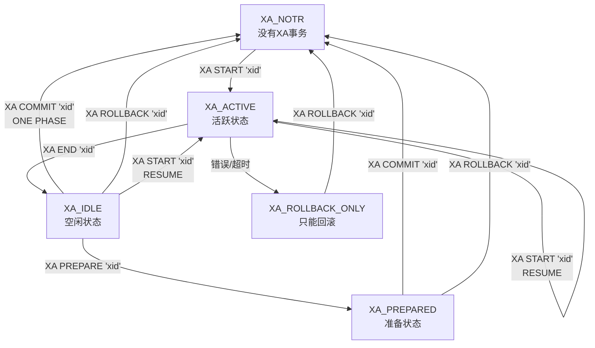
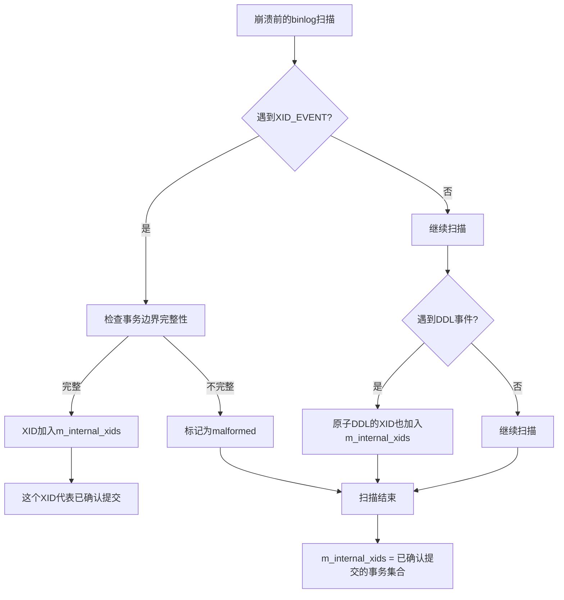

# MySQL 8.4 事务分析文档

## XA事务状态定义

**源码位置：** `sql/xa.h:298-306`

```cpp
enum xa_states {
  XA_NOTR = 0,           // 没有XA事务 ("NON-EXISTING")
  XA_ACTIVE,             // 活跃状态 ("ACTIVE")
  XA_IDLE,               // 空闲状态 ("IDLE") 
  XA_PREPARED,           // 准备状态 ("PREPARED")
  XA_ROLLBACK_ONLY       // 只能回滚状态 ("ROLLBACK ONLY")
};
```

## XA事务状态转换图



## 详细状态转换分析

### 1. XA_NOTR → XA_ACTIVE (XA START)

**触发条件：** 执行 `XA START 'xid'`  
**源码位置：** `sql/xa/sql_xa_start.cc:65`

```cpp
xid_state->start_normal_xa(m_xid);
```

**前置检查：**
- 当前必须在 `XA_NOTR` 状态
- 没有活跃的普通事务
- 没有锁定表

### 2. XA_ACTIVE → XA_IDLE (XA END)

**触发条件：** 执行 `XA END 'xid'`  
**源码位置：** `sql/xa/sql_xa_end.cc:58`

```cpp
xid_state->set_state(XID_STATE::XA_IDLE);
```

### 3. XA_IDLE → XA_PREPARED (XA PREPARE)

**触发条件：** 执行 `XA PREPARE 'xid'`  
**源码位置：** `sql/xa/sql_xa_prepare.cc:168`

```cpp
xid_state->set_state(XID_STATE::XA_PREPARED);
```

**关键处理：**
- 调用所有存储引擎的 `prepare()` 方法
- 写入 `XA_prepare_log_event` 到binlog
- 如果 `xa_detach_on_prepare=true`，会分离事务

### 4. XA_PREPARED → XA_NOTR (XA COMMIT)

**触发条件：** 执行 `XA COMMIT 'xid'`  
**源码位置：** `sql/xa/sql_xa_commit.cc:195`

### 5. XA_IDLE → XA_NOTR (XA COMMIT ONE PHASE)

**触发条件：** 执行 `XA COMMIT 'xid' ONE PHASE`  
**源码位置：** `sql/xa/sql_xa_commit.cc:115`

**特点：** 跳过PREPARE阶段，直接提交

### 6. 错误状态转换 (XA_ROLLBACK_ONLY)

**触发条件：**
- 存储引擎单方面回滚事务分支
- 发生死锁或其他错误
- 资源管理器返回错误

## Binlog事件写入时机

### XID Event vs XA Events

| 事务类型 | 状态转换时机 | 写入的Event类型 |
|---------|-------------|----------------|
| **普通事务（InnoDB+binlog）** | 提交时 | `Xid_log_event` |
| **普通事务（单一非事务引擎）** | 提交时 | `Query_log_event("COMMIT")` |
| **XA PREPARE** | `XA_IDLE → XA_PREPARED` | `XA_prepare_log_event(one_phase=false)` |
| **XA COMMIT** | `XA_PREPARED → XA_NOTR` | `Query_log_event("XA COMMIT ...")` |
| **XA COMMIT ONE PHASE** | `XA_IDLE → XA_NOTR` | `XA_prepare_log_event(one_phase=true)` |
| **XA ROLLBACK** | `XA_PREPARED/XA_IDLE → XA_NOTR` | `Query_log_event("XA ROLLBACK ...")` |

### 关键结论：普通事务的XID event写入条件

**源码位置：** `sql/binlog.cc:8579-8605`

```cpp
// 普通2PC事务写入XID event的条件
else if (real_trans && xid && trn_ctx->rw_ha_count(trx_scope) > 1 &&
         !trn_ctx->no_2pc(trx_scope)) {
  Xid_log_event end_evt(thd, xid);  // ✅ 写入XID event
  if (cache_mngr->trx_cache.finalize(thd, &end_evt)) return RESULT_ABORTED;
}
// 其他情况写入COMMIT语句
else {
  Query_log_event end_evt(thd, STRING_WITH_LEN("COMMIT"), true, false, true, 0, true);
  if (cache_mngr->trx_cache.finalize(thd, &end_evt)) return RESULT_ABORTED;
}
```

**判断关键：** `rw_ha_count(trx_scope) > 1`

#### rw_ha_count计算逻辑

**源码位置：** `sql/handler.cc:1432`

```cpp
unsigned rw_ha_count = 0;
for (auto const &ha_info : ha_list) {
  if (ha_info.is_trx_read_write()) ++rw_ha_count;
}
```

**对于InnoDB+binlog场景：**
- ✅ InnoDB handlerton被注册并标记为读写 (`rw_ha_count++`)
- ✅ binlog handlerton被注册并标记为读写 (`rw_ha_count++`) 
- ✅ `rw_ha_count = 2 > 1` → **写入XID event**

**对于单一MyISAM表场景：**
- ✅ MyISAM handlerton被注册但不支持2PC
- ✅ binlog handlerton被注册并标记为读写
- ❌ `rw_ha_count = 1` → **写入COMMIT语句**

**重要：XA事务永远不会写入XID event**

## COMMIT/ROLLBACK语句写入时机

### COMMIT语句写入场景

#### 1. 普通事务 (非XA)

**✅ InnoDB+binlog场景 → 写入XID_EVENT（不是COMMIT语句）**
```sql
BEGIN;                       -- 记录: Query_log_event("BEGIN")
  INSERT INTO innodb_table VALUES(1); -- 记录: Write_rows_log_event
COMMIT;                     -- 记录: Xid_log_event (而非COMMIT语句)
```

**✅ MyISAM+binlog场景 → 写入COMMIT语句**
```sql  
BEGIN;                       -- 记录: Query_log_event("BEGIN")
  INSERT INTO myisam_table VALUES(1); -- 记录: Write_rows_log_event
COMMIT;                     -- 记录: Query_log_event("COMMIT")
```

**✅ 混合存储引擎场景 → 写入XID_EVENT**
```sql
BEGIN;                       -- 记录: Query_log_event("BEGIN")
  INSERT INTO innodb_table VALUES(1);  -- 记录: Write_rows_log_event  
  INSERT INTO myisam_table VALUES(1);  -- 记录: Write_rows_log_event
COMMIT;                     -- 记录: Xid_log_event (因为rw_ha_count=2)
```

#### 2. XA事务
```sql
-- XA两阶段提交：只有非ONE PHASE的XA COMMIT写入Query_log_event
XA START 'xid1';
INSERT INTO t1 VALUES(1);
XA END 'xid1';
XA PREPARE 'xid1';        -- 记录: XA_prepare_log_event(one_phase=false)
XA COMMIT 'xid1';         -- 记录: Query_log_event("XA COMMIT 'xid1'")

-- XA一阶段提交：不写入COMMIT Query_log_event
XA START 'xid2';
INSERT INTO t1 VALUES(2);
XA END 'xid2';
XA COMMIT 'xid2' ONE PHASE;  -- 记录: XA_prepare_log_event(one_phase=true)
```

### ROLLBACK语句写入时机

#### 1. XA事务的ROLLBACK

**源码位置：** `sql/binlog.cc:2661`
```cpp
int MYSQL_BIN_LOG::write_xa_to_cache(THD *thd) {
  if (get_xa_opt(thd) == XA_ONE_PHASE) return 0;  // ONE PHASE不写XA事件
  
  std::ostringstream oss;
  oss << "XA " << (thd->lex->sql_command == SQLCOM_XA_COMMIT ? "COMMIT" : "ROLLBACK")
      << " " << *xid_to_write;
  Query_log_event qinfo(thd, query.data(), query.length(), ...);
  return this->write_event(&qinfo);
}
```

**写入条件：**
- ✅ 执行 `XA ROLLBACK 'xid'`
- ❌ 不是 `XA_ONE_PHASE`
- ✅ 事务已经记录到binlog (`is_binlogged()`)

#### 2. 不能安全回滚的普通事务

**源码位置：** `sql/binlog.cc:2992`
```cpp
if (trans_cannot_safely_rollback(thd)) {
  Query_log_event end_evt(thd, query.data(), query.length(), true, false, true, 0, true);
  error = cache_mngr->trx_cache.finalize(thd, &end_evt);
  stuff_logged = true;
}
```

**不能安全回滚的情况：** `sql/transaction_info.h:52-166`
```cpp
static unsigned int const MODIFIED_NON_TRANS_TABLE = 0x01;  // 修改非事务表
static unsigned int const CREATED_TEMP_TABLE = 0x02;        // 创建临时表  
static unsigned int const DROPPED_TEMP_TABLE = 0x04;        // 删除临时表
```

**具体场景：**
- ✅ **修改了MyISAM表** (非事务表)
- ✅ **CREATE TEMPORARY TABLE**
- ✅ **DROP TEMPORARY TABLE**  
- ✅ **混合事务表和非事务表的语句**

#### 3. ROLLBACK TO SAVEPOINT

**源码位置：** `sql/binlog.cc:3213`
```cpp
if (trans_cannot_safely_rollback(thd)) {
  String log_query;
  log_query.append(STRING_WITH_LEN("ROLLBACK TO "));
  append_identifier(thd, &log_query, thd->lex->ident.str, thd->lex->ident.length);
  
  Query_log_event qinfo(thd, log_query.c_ptr_safe(), log_query.length(), 
                        true, false, true, errcode);
  return mysql_bin_log.write_event(&qinfo);
}
```

## 完整的Binlog记录示例

### 1. 两阶段提交 XA 事务
```sql
XA START 'xid1';              -- 记录: Query_log_event("XA START 'xid1'")
  INSERT INTO t1 VALUES(1);   -- 记录: Write_rows_log_event
XA END 'xid1';               -- 不记录binlog
XA PREPARE 'xid1';           -- 记录: XA_prepare_log_event(one_phase=false)
XA COMMIT 'xid1';            -- 记录: Query_log_event("XA COMMIT 'xid1'")
```

### 2. 一阶段提交 XA 事务
```sql
XA START 'xid2';             -- 记录: Query_log_event("XA START 'xid2'")
  INSERT INTO t1 VALUES(2);  -- 记录: Write_rows_log_event
XA END 'xid2';              -- 不记录binlog  
XA COMMIT 'xid2' ONE PHASE; -- 记录: XA_prepare_log_event(one_phase=true)
```

### 3. 普通事务 (InnoDB+binlog)
```sql
BEGIN;                       -- 记录: Query_log_event("BEGIN")
  INSERT INTO innodb_table VALUES(1); -- 记录: Write_rows_log_event
COMMIT;                     -- 记录: Xid_log_event (而非COMMIT语句)
```

### 4. 普通事务 (MyISAM+binlog)
```sql
BEGIN;                       -- 记录: Query_log_event("BEGIN")
  INSERT INTO myisam_table VALUES(1); -- 记录: Write_rows_log_event
COMMIT;                     -- 记录: Query_log_event("COMMIT")
```

### 5. 混合事务回滚场景
```sql
BEGIN;
  INSERT INTO innodb_table VALUES(1);  -- 事务表
  INSERT INTO myisam_table VALUES(1);  -- 非事务表，标记为不能安全回滚
ROLLBACK;                            -- 记录: Query_log_event("ROLLBACK")
                                    -- 因为MyISAM无法回滚，必须记录ROLLBACK语句
```

## 崩溃恢复机制详解

### `m_internal_xids`的真实含义

**重要发现：** `m_internal_xids`不是包含"所有普通事务"，而是包含**"已确认提交的内部协调事务XID"**。

#### 构建过程分析

**源码位置：** `sql/binlog/log_sanitizer.cc:97`

```cpp
void Log_sanitizer::process_xid_event(Xid_log_event const &ev) {
  // 检查事务边界完整性
  this->m_is_malformed = !this->m_in_transaction;
  if (this->m_is_malformed) {
    this->m_failure_message.assign(
        "Xid_log_event outside the boundary of a sequence of events "
        "representing an active transaction");
    return;
  }
  this->m_in_transaction = false;
  
  // ✅ 关键：只有完整读取的XID_EVENT才被加入m_internal_xids
  if (!this->m_internal_xids.insert(ev.xid).second) {
    this->m_is_malformed = true;
    this->m_failure_message.assign("Xid_log_event holds an invalid XID");
  }
}
```

**原子DDL也会产生XID EVENT：**
```cpp
void Log_sanitizer::process_atomic_ddl(Query_log_event const &ev) {
  // 检查DDL不能在事务内部
  this->m_is_malformed = this->m_in_transaction;
  if (this->m_is_malformed) {
    this->m_failure_message.assign(
        "Query_log event containing a DDL inside the boundary of a sequence of "
        "events representing an active transaction");
    return;
  }
  
  // ✅ 原子DDL的XID也被加入m_internal_xids
  if (!this->m_internal_xids.insert(ev.ddl_xid).second) {
    this->m_is_malformed = true;
    this->m_failure_message.assign(
        "Query_log_event containing a DDL holds an invalid XID");
  }
}
```

### DDL产生XID EVENT的重要发现

**原子DDL事务也会产生XID EVENT**，源码位置：`sql/log_event.cc:4028-4051`

```cpp
if (is_atomic_ddl(thd, using_trans)) {
  assert(stmt_causes_implicit_commit(thd, CF_IMPLICIT_COMMIT_END));
  
  Transaction_ctx *trn_ctx = thd->get_transaction();
  
  // 事务需要活跃才能分配XID
  assert(trn_ctx->is_active(Transaction_ctx::SESSION));
  // 事务的XID已经计算出来
  assert(!trn_ctx->xid_state()->get_xid()->is_null());

  my_xid xid = trn_ctx->xid_state()->get_xid()->get_my_xid();
  
  ddl_xid = xid;
  event_logging_type = Log_event::EVENT_NORMAL_LOGGING;
  event_cache_type = Log_event::EVENT_TRANSACTIONAL_CACHE;
}
```

### 崩溃恢复的设计逻辑



### 恢复算法实现

**`ha_recover`函数：** `sql/xa.cc:270`

```cpp
int ha_recover(Xid_commit_list *commit_list,    // m_internal_xids (已确认提交事务)
               Xa_state_list *xa_list) {        // m_external_xids (XA事务状态)
```

**恢复决策逻辑：** `sql/xa/recovery.cc:258`

```cpp
void recover_one_internal_trx(xarecover_st const &info, handlerton &ht,
                              XA_recover_txn const &xa_trx, my_xid xid,
                              ::recovery_statistics &stats) {
  // 如果XID在commit_list(m_internal_xids)中，说明事务已确认提交
  if (info.commit_list ? info.commit_list->count(xid) != 0
                       : tc_heuristic_recover == TC_HEURISTIC_RECOVER_COMMIT) {
    // ✅ 提交事务（包括普通事务和原子DDL）
    exec_status = ht.commit_by_xid(&ht, const_cast<XID *>(&xa_trx.id));
  } else {
    // ❌ 回滚事务
    exec_status = ht.rollback_by_xid(&ht, const_cast<XID *>(&xa_trx.id));
  }
}
```

### 恢复场景示例

**问题场景：**
```
崩溃前：
  存储引擎状态    |    Binlog状态
  T1: PREPARED   |    T1: XID_EVENT ✅完整
  T2: PREPARED   |    T2: 部分写入 ❌不完整  
  T3: PREPARED   |    T3: 未写入 ❌
  DDL1: PREPARED |    DDL1: XID_EVENT ✅完整 (原子DDL)
```

**恢复决策：**
```
基于m_internal_xids的恢复决策：
  T1: 在m_internal_xids中 → COMMIT ✅ (因为binlog完整记录了XID_EVENT)
  T2: 不在m_internal_xids中 → ROLLBACK ❌ (因为binlog记录不完整)  
  T3: 不在m_internal_xids中 → ROLLBACK ❌ (因为binlog未记录)
  DDL1: 在m_internal_xids中 → COMMIT ✅ (原子DDL的XID_EVENT完整记录)
```

### 核心设计原则

**源码注释：** `sql/binlog/recovery.h:23-42`

```cpp
/**
  The list of XIDs of all internally coordinated transactions that are
  completely written to the binary log is passed to the storage engines
  through the ha_recover function in the handler interface. This tells the
  storage engines to commit all prepared transactions that are in the set,
  and to roll back all prepared transactions that are not in the set.
*/
```

**核心逻辑：**
1. **Binlog是事务提交的权威记录**
2. **完整的XID_EVENT = 事务已确认提交**（包括普通事务和原子DDL）
3. **不完整或缺失的记录 = 事务应该回滚**
4. **原子DDL也参与崩溃恢复过程**

### `m_internal_xids`包含的事务类型

`m_internal_xids`包含的是：
- ✅ **已确认提交的普通事务XID**（有完整的XID_EVENT）
- ✅ **已确认提交的原子DDL事务XID**（有完整的XID_EVENT）
- ❌ **不包含**部分写入或未写入binlog的事务
- ❌ **不包含**XA事务（XA事务信息在`m_external_xids`中）

这就是为什么要把它作为`commit_list`参数传递给`ha_recover`——它告诉存储引擎哪些prepared事务应该被提交，哪些应该被回滚，以binlog的完整性作为判断标准。

## 核心设计原则

1. **XA事务与普通事务明确分离**
   - XA事务使用 `XA_prepare_log_event` 和 `Query_log_event`
   - 普通事务根据参与的handlerton数量决定使用 `Xid_log_event` 或 `Query_log_event("COMMIT")`

2. **两阶段提交协议支持**
   - XA PREPARE 阶段记录 `XA_prepare_log_event`
   - XA COMMIT 阶段记录 `Query_log_event`
   - ONE PHASE 优化合并为单个 `XA_prepare_log_event`
   - 普通事务中多handlerton场景使用 `Xid_log_event`

3. **主从复制一致性保证**
   - 不能安全回滚的操作必须记录 ROLLBACK 语句
   - 确保从服务器执行相同的操作序列
   - 维护分布式事务的ACID特性

4. **性能优化考虑**
   - 可以安全回滚的事务直接截断binlog cache
   - 避免不必要的日志写入
   - 支持事务分离和并行处理

5. **崩溃恢复的可靠性**
   - Binlog作为事务提交的权威记录
   - 原子DDL也参与完整的崩溃恢复过程
   - 基于完整性检查的精确恢复决策
