# MySQL 2PC与Group Commit事务处理机制深度分析

## 概述

**MySQL事务处理系统**是数据库核心的ACID保障机制，通过**2PC（Two-Phase Commit）**协议确保多存储引擎间的事务一致性，并通过**Group Commit**机制优化性能。本文档深入分析MySQL事务处理的完整流程，包括涉及的线程、模块、架构、状态演变以及各种语句类型的处理差异。

## 事务处理架构概览

### **整体架构图**

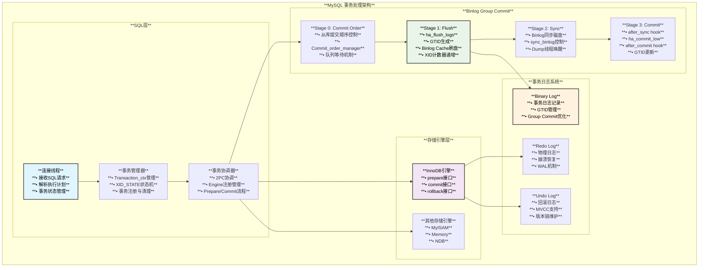

## 核心模块与数据结构

### **事务上下文结构**

```cpp
/** MySQL事务处理核心数据结构 */

// 事务状态枚举
enum class Transaction_state {
  ACTIVE,          // 活跃状态
  PREPARING,       // 准备阶段
  PREPARED,        // 已准备
  COMMITTING,      // 提交中
  COMMITTED,       // 已提交
  ROLLING_BACK,    // 回滚中
  ROLLED_BACK      // 已回滚
};

/** 事务上下文 - 核心管理结构 */
class Transaction_ctx {
public:
  enum enum_trx_scope { STMT = 0, SESSION };
  
  // 事务标识
  my_xid m_xid;                           // 事务XID
  ulong sequence_number{SEQ_UNINIT};      // 序列号
  ulong last_committed{SEQ_UNINIT};       // 上次提交序列号
  
  // 存储引擎注册信息
  Ha_trx_info* m_ha_trx_info[2];         // STMT和SESSION级别的引擎信息
  uint m_rw_ha_count[2];                 // 读写事务的引擎数量
  uint m_ro_ha_count[2];                 // 只读事务的引擎数量
  
  // 事务状态标志
  struct {
    bool enabled : 1;                    // 事务是否启用
    bool pending : 1;                    // 是否有待处理操作
    bool real_commit : 1;                // 是否真实提交
    bool commit_low : 1;                 // 是否已调用commit_low
    bool run_hooks : 1;                  // 是否需要运行hooks
    bool xid_written : 1;                // XID是否已写入binlog
  } m_flags;
  
  // XA事务状态
  XID_STATE* m_xid_state;                // XA状态管理器
  
  /** 检查是否需要2PC */
  bool no_2pc(enum_trx_scope scope) const {
    return rw_ha_count(scope) <= 1;
  }
  
  /** 获取参与事务的存储引擎数量 */
  uint rw_ha_count(enum_trx_scope scope) const {
    return m_rw_ha_count[scope];
  }
};

/** XA事务状态管理 */
class XID_STATE {
public:
  enum xa_states {
    XA_NOTR = 0,        // 非XA事务状态
    XA_ACTIVE,          // XA事务活跃
    XA_IDLE,            // XA事务空闲
    XA_PREPARED,        // XA事务已准备
    XA_ROLLBACK_ONLY    // XA事务只能回滚
  };
  
private:
  XID m_xid;            // XA标识符
  xa_states xa_state;   // XA状态
  bool in_recovery;     // 是否在恢复过程中
  
public:
  bool has_state(xa_states state) const { return xa_state == state; }
  void set_state(xa_states state) { xa_state = state; }
  const XID* get_xid() const { return &m_xid; }
};

/** Group Commit队列节点 */
struct Group_commit_ctx {
  THD* leader;                    // 队列领导者
  THD* first_in_group;           // 组中第一个线程
  my_off_t total_bytes_flushed;  // 刷盘字节总数
  bool max_size_exceeded;        // 是否超过最大大小
  
  // Stage状态跟踪
  mysql_mutex_t stage_mutex[4];   // 各个stage的互斥锁
  mysql_cond_t stage_cond[4];     // 各个stage的条件变量
  THD* stage_queue[4];            // 各个stage的队列
};
```

### **存储引擎接口**

```cpp
/** 存储引擎事务处理接口 */
struct handlerton {
  // 2PC接口
  int (*prepare)(handlerton *hton, THD *thd, bool all);
  int (*commit)(handlerton *hton, THD *thd, bool all);  
  int (*rollback)(handlerton *hton, THD *thd, bool all);
  
  // XA接口
  int (*commit_by_xid)(handlerton *hton, XID *xid);
  int (*rollback_by_xid)(handlerton *hton, XID *xid);
  int (*recover)(handlerton *hton, XID *xid_list, uint len);
  
  // 其他事务相关
  int (*flush_logs)(handlerton *hton);
  void (*set_prepared_in_tc)(handlerton *hton, THD *thd);
  
  // 引擎属性
  uint savepoint_offset;          // 保存点偏移
  bool is_2pc_capable;           // 是否支持2PC
};

/** InnoDB引擎的2PC实现示例 */
class ha_innobase : public handler {
public:
  /** 准备阶段 - 写入prepare记录到redo log */
  int prepare(THD* thd, bool all) override {
    trx_t* trx = check_trx_exists(thd);
    
    if (all || (!thd->in_multi_stmt_transaction_mode() && 
                thd->tx_isolation != ISO_SERIALIZABLE)) {
      // 写入XA PREPARE记录到redo log
      trx_prepare_for_mysql(trx);
      
      // 刷盘redo log确保持久化
      if (srv_flush_log_at_trx_commit == 1) {
        log_buffer_flush_to_disk();
      }
    }
    
    return 0;
  }
  
  /** 提交阶段 - 写入commit记录 */
  int commit(THD* thd, bool all) override {
    trx_t* trx = check_trx_exists(thd);
    
    if (trx != nullptr) {
      TrxInInnoDB trx_in_innodb(trx);
      
      // 写入commit记录并释放锁
      innobase_commit_low(trx);
      
      // 清理事务对象
      trx_free_for_mysql(trx);
    }
    
    return 0;
  }
  
  /** 回滚阶段 */
  int rollback(THD* thd, bool all) override {
    trx_t* trx = check_trx_exists(thd);
    
    if (trx != nullptr) {
      // 执行回滚操作
      trx_rollback_for_mysql(trx);
    }
    
    return 0;
  }
};
```

## 2PC两阶段提交详解

### **2PC触发条件**

根据`sql/handler.cc`中的说明，2PC协议的使用条件：

```cpp
/** 2PC协议使用条件判断 */
bool needs_2pc(THD* thd, bool all) {
  Transaction_ctx* trn_ctx = thd->get_transaction();
  const auto trx_scope = all ? Transaction_ctx::SESSION : Transaction_ctx::STMT;
  
  // 条件1：参与的存储引擎都支持2PC
  bool all_engines_support_2pc = true;
  for (auto& ha_info : trn_ctx->ha_trx_info(trx_scope)) {
    if (ha_info.ht()->prepare == nullptr) {
      all_engines_support_2pc = false;
      break;
    }
  }
  
  // 条件2：至少有两个引擎修改了数据（非只读）
  bool multiple_engines_modified = trn_ctx->rw_ha_count(trx_scope) > 1;
  
  // 条件3：不是no_2pc模式
  bool not_disabled = !trn_ctx->no_2pc(trx_scope);
  
  return all_engines_support_2pc && multiple_engines_modified && not_disabled;
}
```

### **2PC处理流程**

```cpp
/** 2PC两阶段提交实现 */
class Two_Phase_Commit_Handler {
public:
  /** 阶段1：准备阶段 */
  int prepare_phase(THD* thd, bool all) {
    DBUG_TRACE;
    
    Transaction_ctx* trn_ctx = thd->get_transaction();
    const auto trx_scope = all ? Transaction_ctx::SESSION : Transaction_ctx::STMT;
    auto ha_list = trn_ctx->ha_trx_info(trx_scope);
    
    int error = 0;
    
    // 遍历所有参与的存储引擎
    for (auto& ha_info : ha_list) {
      handlerton* ht = ha_info.ht();
      
      if (ht->prepare) {
        DBUG_PRINT("info", ("Calling prepare on engine %s", ht->name));
        
        // 调用存储引擎的prepare接口
        if (int err = ht->prepare(ht, thd, all)) {
          my_error(ER_ERROR_DURING_COMMIT, MYF(0), err);
          error = 1;
          break;
        }
        
        // 更新统计信息
        thd->status_var.ha_prepare_count++;
      }
    }
    
    // 如果prepare失败，需要回滚所有引擎
    if (error) {
      rollback_all_engines(thd, all);
    }
    
    return error;
  }
  
  /** 阶段2：提交阶段 */
  int commit_phase(THD* thd, bool all) {
    DBUG_TRACE;
    
    Transaction_ctx* trn_ctx = thd->get_transaction();
    const auto trx_scope = all ? Transaction_ctx::SESSION : Transaction_ctx::STMT;
    auto ha_list = trn_ctx->ha_trx_info(trx_scope);
    
    int error = 0;
    
    // 提交阶段不能失败，必须提交所有引擎
    for (auto& ha_info : ha_list) {
      handlerton* ht = ha_info.ht();
      
      DBUG_PRINT("info", ("Calling commit on engine %s", ht->name));
      
      // 调用存储引擎的commit接口
      if (int err = ht->commit(ht, thd, all)) {
        // 提交阶段的错误是严重错误，但仍要继续
        sql_print_error("Engine %s commit failed with error %d", 
                       ht->name, err);
        error = 1;
      }
      
      // 更新统计信息
      thd->status_var.ha_commit_count++;
    }
    
    return error;
  }
  
private:
  /** 回滚所有引擎 */
  void rollback_all_engines(THD* thd, bool all) {
    Transaction_ctx* trn_ctx = thd->get_transaction();
    const auto trx_scope = all ? Transaction_ctx::SESSION : Transaction_ctx::STMT;
    auto ha_list = trn_ctx->ha_trx_info(trx_scope);
    
    for (auto& ha_info : ha_list) {
      handlerton* ht = ha_info.ht();
      if (ht->rollback) {
        ht->rollback(ht, thd, all);
      }
    }
  }
};
```

## Group Commit机制详解

### **Group Commit四个阶段**

根据`sql/binlog.h`的详细说明，Group Commit包含4个阶段：

```cpp
/** Group Commit阶段管理器 */
class Group_Commit_Manager {
private:
  // 队列管理
  mysql_mutex_t LOCK_log;           // binlog全局锁
  mysql_mutex_t LOCK_commit;        // commit阶段锁
  mysql_cond_t update_cond;         // 更新条件变量
  
  // 阶段队列
  THD* flush_queue;                 // Flush阶段队列
  THD* sync_queue;                  // Sync阶段队列  
  THD* commit_queue;                // Commit阶段队列
  
public:
  /** 主入口：有序提交 */
  int ordered_commit(THD* thd, bool all, bool skip_commit = false) {
    DBUG_TRACE;
    
    Transaction_ctx* trn_ctx = thd->get_transaction();
    Group_commit_ctx& bgc_ctx = thd->rpl_thd_ctx.binlog_group_commit_ctx();
    
    int error = 0;
    
    // Stage 0: Commit Order (从库提交顺序控制)
    if ((error = stage_commit_order(thd, all))) {
      return error;
    }
    
    // Stage 1: Flush (刷盘阶段)
    if ((error = stage_flush(thd, all))) {
      return error;
    }
    
    // Stage 2: Sync (同步阶段)  
    if ((error = stage_sync(thd, all))) {
      return error;
    }
    
    // Stage 3: Commit (提交阶段)
    if ((error = stage_commit(thd, all, skip_commit))) {
      return error;  
    }
    
    return 0;
  }
  
private:
  /** Stage 0: Commit Order - 从库提交顺序控制 */
  int stage_commit_order(THD* thd, bool all) {
    DBUG_TRACE;
    
    if (Commit_order_manager::wait(thd)) {
      return 1;
    }
    
    return 0;
  }
  
  /** Stage 1: Flush - 刷盘阶段 */
  int stage_flush(THD* thd, bool all) {
    DBUG_TRACE;
    
    mysql_mutex_lock(&LOCK_log);
    
    // 添加到flush队列
    enqueue_for_flush_stage(thd);
    
    // 如果是队列领导者，处理整个队列
    if (is_leader(thd)) {
      THD* first_in_queue;
      my_off_t total_bytes;
      
      // 1. 同步存储引擎日志
      flush_engines(thd);
      
      // 2. 处理flush队列
      int flush_error = process_flush_stage_queue(&total_bytes, &first_in_queue);
      
      if (!flush_error) {
        // 3. 生成GTID
        assign_automatic_gtids_to_flush_group(first_in_queue);
        
        // 4. 刷写binlog cache
        for (THD* head = first_in_queue; head; head = head->next_to_commit) {
          flush_thread_caches(head);
        }
        
        // 5. 递增prepared XID计数
        for (THD* head = first_in_queue; head; head = head->next_to_commit) {
          if (head->get_transaction()->m_flags.xid_written) {
            inc_prep_xids(head);
          }
        }
      }
      
      // 6. 唤醒所有等待的线程
      wakeup_flush_stage_waiters(first_in_queue);
    } else {
      // 跟随者等待领导者完成
      wait_for_flush_stage_complete(thd);
    }
    
    mysql_mutex_unlock(&LOCK_log);
    return 0;
  }
  
  /** Stage 2: Sync - 同步阶段 */
  int stage_sync(THD* thd, bool all) {
    DBUG_TRACE;
    
    // 添加到sync队列
    enqueue_for_sync_stage(thd);
    
    if (is_leader(thd)) {
      // 根据sync_binlog参数决定是否同步
      if (get_sync_period() == 1 || 
          should_sync_based_on_transaction_count()) {
        // 同步binlog到磁盘
        if (mysql_file_sync(m_binlog_file->file, MYF(MY_WME))) {
          return 1;
        }
        
        // 通知dump线程可以读取到新位置
        if (get_sync_period() == 1) {
          signal_update();
        }
      }
      
      // 唤醒所有等待的线程
      wakeup_sync_stage_waiters();
    } else {
      wait_for_sync_stage_complete(thd);
    }
    
    return 0;
  }
  
  /** Stage 3: Commit - 提交阶段 */
  int stage_commit(THD* thd, bool all, bool skip_commit) {
    DBUG_TRACE;
    
    if (opt_binlog_order_commits) {
      // 有序提交：由领导者处理所有提交
      mysql_mutex_lock(&LOCK_commit);
      
      enqueue_for_commit_stage(thd);
      
      if (is_leader(thd)) {
        process_commit_stage_queue(thd, get_commit_queue());
        wakeup_commit_stage_waiters();
      } else {
        wait_for_commit_stage_complete(thd);  
      }
      
      mysql_mutex_unlock(&LOCK_commit);
    } else {
      // 无序提交：每个线程独立提交
      process_individual_commit(thd, all, skip_commit);
    }
    
    return finish_commit(thd);
  }
  
  /** 处理单个事务的提交 */
  void process_individual_commit(THD* thd, bool all, bool skip_commit) {
    // 1. 调用after_sync hook
    RUN_HOOK(transaction, after_sync, (thd, all));
    
    // 2. 更新dependency tracker
    update_max_committed_in_dependency_tracker(thd);
    
    // 3. 提交存储引擎
    if (!skip_commit) {
      ha_commit_low(thd, all, true);
    }
    
    // 4. 调用after_commit hook
    RUN_HOOK(transaction, after_commit, (thd, all));
    
    // 5. 更新GTID状态
    gtid_state->update_on_commit(thd);
    
    // 6. 减少prepared XID计数
    if (thd->get_transaction()->m_flags.xid_written) {
      dec_prep_xids(thd);
    }
  }
};
```

## 不同语句类型的处理差异

### **DML vs DDL vs 其他语句**

```cpp
/** 语句类型处理差异分析 */
class Statement_Type_Handler {
public:
  /** 根据语句类型确定处理策略 */
  void determine_processing_strategy(THD* thd) {
    const auto sql_command = thd->lex->sql_command;
    
    switch (sql_command) {
      // DML语句处理
      case SQLCOM_INSERT:
      case SQLCOM_UPDATE:  
      case SQLCOM_DELETE:
      case SQLCOM_SELECT:
        handle_dml_statement(thd);
        break;
        
      // DDL语句处理
      case SQLCOM_CREATE_TABLE:
      case SQLCOM_ALTER_TABLE:
      case SQLCOM_DROP_TABLE:
      case SQLCOM_CREATE_INDEX:
        handle_ddl_statement(thd);
        break;
        
      // XA语句处理
      case SQLCOM_XA_START:
      case SQLCOM_XA_PREPARE:
      case SQLCOM_XA_COMMIT:
      case SQLCOM_XA_ROLLBACK:
        handle_xa_statement(thd);
        break;
        
      // 事务控制语句
      case SQLCOM_BEGIN:
      case SQLCOM_COMMIT:
      case SQLCOM_ROLLBACK:
        handle_transaction_control(thd);
        break;
        
      default:
        handle_other_statement(thd);
        break;
    }
  }
  
private:
  /** DML语句处理 */
  void handle_dml_statement(THD* thd) {
    // DML语句特点：
    // 1. 可能修改多个存储引擎的数据
    // 2. 需要参与事务
    // 3. 生成ROW格式的binlog event
    
    bool using_trans = thd->in_multi_stmt_transaction_mode();
    bool cmd_can_generate_row_events = true;
    
    // 确定缓存类型
    Log_event::event_cache_type cache_type;
    if (using_trans || stmt_has_updated_trans_table(thd)) {
      cache_type = Log_event::EVENT_TRANSACTIONAL_CACHE;
    } else {
      cache_type = Log_event::EVENT_STMT_CACHE;
    }
    
    // 注册存储引擎
    if (using_trans) {
      // 注册到SESSION级别的事务列表
      trans_register_ha(thd, true, ht);
    }
    // 总是注册到STMT级别
    trans_register_ha(thd, false, ht);
  }
  
  /** DDL语句处理 */  
  void handle_ddl_statement(THD* thd) {
    // DDL语句特点：
    // 1. 通常只涉及单个存储引擎
    // 2. 原子DDL需要特殊处理
    // 3. 自动提交事务
    // 4. 生成QUERY_EVENT
    
    if (is_atomic_ddl(thd)) {
      // 原子DDL处理
      Transaction_ctx* trn_ctx = thd->get_transaction();
      
      // 为DDL分配XID
      if (trn_ctx->xid_state()->get_xid()->is_null()) {
        my_xid xid = generate_xid_for_ddl(thd);
        trn_ctx->xid_state()->set_xid(xid);
      }
      
      // 原子DDL使用事务缓存
      Log_event::event_cache_type cache_type = Log_event::EVENT_TRANSACTIONAL_CACHE;
      
      // 记录DDL开始事件
      Query_log_event ddl_event(thd, thd->query().str, thd->query().length,
                               true, false, true, 0, true);
    } else {
      // 普通DDL直接写入binlog
      Query_log_event ddl_event(thd, thd->query().str, thd->query().length,
                               false, false, true, 0, true);
      mysql_bin_log.write_event(&ddl_event);
    }
  }
  
  /** XA语句处理 */
  void handle_xa_statement(THD* thd) {
    XID_STATE* xid_state = thd->get_transaction()->xid_state();
    
    switch (thd->lex->sql_command) {
      case SQLCOM_XA_START: {
        // XA START处理
        xid_state->set_state(XID_STATE::XA_ACTIVE);
        
        // 写入XA START事件到binlog
        static const char xa_start[] = "XA START";  
        char buf[XID::ser_buf_size];
        char xa_start_query[sizeof(xa_start) + 1 + sizeof(buf)];
        int qlen = sprintf(xa_start_query, "%s %s", xa_start, 
                          xid_state->get_xid()->serialize(buf));
        
        Query_log_event xa_event(thd, xa_start_query, qlen, true, false, true, 0, true);
        break;
      }
      
      case SQLCOM_XA_PREPARE: {
        // XA PREPARE处理
        xid_state->set_state(XID_STATE::XA_PREPARED);
        
        // 调用所有存储引擎的prepare
        tc_log->prepare(thd, true);
        
        // 写入XA_PREPARE_LOG_EVENT
        XA_prepare_log_event xa_prepare_event(thd, xid_state->get_xid());
        mysql_bin_log.write_event(&xa_prepare_event);
        break;
      }
      
      case SQLCOM_XA_COMMIT: {
        if (static_cast<Sql_cmd_xa_commit*>(thd->lex->m_sql_cmd)->get_xa_opt() == XA_ONE_PHASE) {
          // ONE PHASE提交：直接提交，跳过prepare
          xid_state->set_state(XID_STATE::XA_PREPARED);  // 临时状态
          tc_log->commit(thd, true);
        } else {
          // TWO PHASE提交：从PREPARED状态提交
          assert(xid_state->has_state(XID_STATE::XA_PREPARED));
          tc_log->commit(thd, true);
        }
        
        xid_state->set_state(XID_STATE::XA_NOTR);
        break;
      }
    }
  }
};
```

### **Binlog Event产生时机**

```cpp
/** Binlog Event生成时机管理器 */
class Binlog_Event_Generator {
public:
  /** 事务开始时的Event生成 */
  void generate_transaction_start_events(THD* thd) {
    binlog_cache_data* cache_data = get_cache_data(thd);
    
    if (cache_data->is_binlog_empty()) {
      XID_STATE* xs = thd->get_transaction()->xid_state();
      
      if (xs->has_state(XID_STATE::XA_ACTIVE)) {
        // XA事务：生成XA START事件
        char buf[XID::ser_buf_size];
        char xa_start[sizeof("XA START") + 1 + sizeof(buf)];
        int qlen = sprintf(xa_start, "XA START %s", xs->get_xid()->serialize(buf));
        
        Query_log_event xa_start_event(thd, xa_start, qlen, true, false, true, 0, true);
        cache_data->write_event(&xa_start_event);
      } else {
        // 普通事务：生成BEGIN事件
        static const char begin[] = "BEGIN";
        Query_log_event begin_event(thd, begin, sizeof(begin) - 1, true, false, true, 0, true);
        cache_data->write_event(&begin_event);
      }
    }
  }
  
  /** DML语句的Event生成 */
  void generate_dml_events(THD* thd, const char* query, size_t query_len) {
    // 根据binlog_format确定事件类型
    switch (thd->variables.binlog_format) {
      case BINLOG_FORMAT_STMT: {
        // STATEMENT格式：生成Query_log_event
        Query_log_event query_event(thd, query, query_len, true, false, true, 0);
        write_to_cache(thd, &query_event);
        break;
      }
      
      case BINLOG_FORMAT_ROW: {
        // ROW格式：生成Table_map_event + Row events
        Table_map_log_event table_map_event(thd, table, table->s->table_map_id);
        write_to_cache(thd, &table_map_event);
        
        // 根据操作类型生成相应的ROW事件
        switch (thd->lex->sql_command) {
          case SQLCOM_INSERT:
            generate_write_rows_event(thd);
            break;
          case SQLCOM_UPDATE:
            generate_update_rows_event(thd);
            break;
          case SQLCOM_DELETE:
            generate_delete_rows_event(thd);
            break;
        }
        break;
      }
      
      case BINLOG_FORMAT_MIXED: {
        // MIXED格式：根据语句特点自动选择
        if (is_stmt_unsafe_for_binlog(thd)) {
          // 不安全语句使用ROW格式
          generate_dml_events_row_format(thd);
        } else {
          // 安全语句使用STATEMENT格式  
          generate_dml_events_stmt_format(thd);
        }
        break;
      }
    }
  }
  
  /** 事务提交时的Event生成 */
  void generate_transaction_end_events(THD* thd) {
    Transaction_ctx* trn_ctx = thd->get_transaction();
    XID_STATE* xs = trn_ctx->xid_state();
    
    if (xs->has_state(XID_STATE::XA_PREPARED)) {
      // XA事务：生成XA_PREPARE_LOG_EVENT
      XA_prepare_log_event xa_prepare_event(thd, xs->get_xid());
      write_to_cache(thd, &xa_prepare_event);
    } else {
      // 普通事务：生成XID_EVENT或QUERY_EVENT(COMMIT)
      if (trn_ctx->xid_state()->get_xid()->is_null()) {
        // 无XID：生成COMMIT查询事件
        static const char commit[] = "COMMIT";
        Query_log_event commit_event(thd, commit, sizeof(commit) - 1, true, true, true, 0);
        write_to_cache(thd, &commit_event);
      } else {
        // 有XID：生成XID事件
        Xid_log_event xid_event(thd, trn_ctx->xid_state()->get_xid()->get_my_xid());
        write_to_cache(thd, &xid_event);
      }
    }
  }
  
  /** DDL语句的Event生成 */
  void generate_ddl_events(THD* thd) {
    if (is_atomic_ddl(thd)) {
      // 原子DDL：使用事务方式处理
      generate_transaction_start_events(thd);
      
      // 生成DDL查询事件
      Query_log_event ddl_event(thd, thd->query().str, thd->query().length,
                               true, false, true, 0);
      write_to_cache(thd, &ddl_event);
      
      // 生成XID事件
      my_xid xid = thd->get_transaction()->xid_state()->get_xid()->get_my_xid();
      Xid_log_event xid_event(thd, xid);
      write_to_cache(thd, &xid_event);
    } else {
      // 普通DDL：直接写入查询事件
      Query_log_event ddl_event(thd, thd->query().str, thd->query().length,
                               false, false, true, 0);
      mysql_bin_log.write_event(&ddl_event);
    }
  }
};
```

## 普通事务 vs XA事务差异

### **状态转换对比**

```mermaid
graph TB
    subgraph "**普通事务状态转换**"
        NORMAL_START[**事务开始**<br/>**autocommit=0或BEGIN**] 
        NORMAL_ACTIVE[**ACTIVE状态**<br/>**执行DML/DDL语句**]
        NORMAL_PREPARE[**PREPARE阶段**<br/>**多引擎时执行2PC**]
        NORMAL_COMMIT[**COMMIT完成**<br/>**释放资源清理状态**]
        NORMAL_ROLLBACK[**ROLLBACK**<br/>**回滚变更**]
        
        NORMAL_START --> NORMAL_ACTIVE
        NORMAL_ACTIVE --> NORMAL_PREPARE
        NORMAL_PREPARE --> NORMAL_COMMIT
        NORMAL_ACTIVE --> NORMAL_ROLLBACK
        NORMAL_PREPARE --> NORMAL_ROLLBACK
    end
    
    subgraph "**XA事务状态转换**"
        XA_START[**XA START**<br/>**XA_ACTIVE状态**]
        XA_WORKING[**工作状态**<br/>**执行业务SQL**]
        XA_END[**XA END**<br/>**XA_IDLE状态**] 
        XA_PREPARE[**XA PREPARE**<br/>**XA_PREPARED状态**]
        XA_COMMIT[**XA COMMIT**<br/>**提交完成**]
        XA_ROLLBACK[**XA ROLLBACK**<br/>**回滚完成**]
        
        XA_START --> XA_WORKING
        XA_WORKING --> XA_END
        XA_END --> XA_PREPARE
        XA_PREPARE --> XA_COMMIT
        XA_END --> XA_ROLLBACK
        XA_PREPARE --> XA_ROLLBACK
    end
    
    style NORMAL_ACTIVE fill:#e1f5fe,color:#000,stroke:#333,stroke-width:2px
    style XA_PREPARE fill:#e8f5e8,color:#000,stroke:#333,stroke-width:2px
    style NORMAL_COMMIT fill:#f3e5f5,color:#000,stroke:#333,stroke-width:2px
    style XA_COMMIT fill:#fff3e0,color:#000,stroke:#333,stroke-width:2px
```

### **处理差异对比表**

| **特性对比** | **普通事务** | **XA事务** |
|-------------|------------|-----------|
| **状态管理** | Transaction_ctx::m_flags | XID_STATE状态机 |
| **标识符** | 自动生成的sequence_number | 用户指定的XID |
| **生命周期** | 连接级别，连接断开即结束 | 全局级别，可跨连接 |
| **2PC支持** | 自动判断（多引擎时启用） | 显式控制的2PC |
| **Binlog事件** | BEGIN + DML + XID/COMMIT | XA START + DML + XA PREPARE |
| **持久化** | 提交即持久化 | PREPARE后即持久化 |
| **恢复能力** | 无法恢复未提交事务 | 可恢复PREPARED状态事务 |
| **并发控制** | 基于锁和MVCC | 额外的XA锁管理 |

### **具体实现差异**

```cpp
/** 普通事务 vs XA事务实现差异 */
class Transaction_Type_Comparison {
public:
  /** 普通事务提交流程 */
  int commit_regular_transaction(THD* thd, bool all) {
    Transaction_ctx* trn_ctx = thd->get_transaction();
    
    // 1. 自动判断是否需要2PC
    if (!trn_ctx->no_2pc(all ? Transaction_ctx::SESSION : Transaction_ctx::STMT)) {
      // 执行2PC prepare阶段
      if (tc_log->prepare(thd, all)) {
        ha_rollback_trans(thd, all);
        return 1;
      }
    }
    
    // 2. 提交阶段（通过Group Commit）
    return tc_log->commit(thd, all);
  }
  
  /** XA事务提交流程 */
  int commit_xa_transaction(THD* thd, XA_option xa_opt) {
    XID_STATE* xs = thd->get_transaction()->xid_state();
    
    if (xa_opt == XA_ONE_PHASE) {
      // ONE PHASE: 类似普通事务，但记录XA信息
      xs->set_state(XID_STATE::XA_PREPARED);  // 临时状态
      
      // 执行1PC提交
      return tc_log->commit(thd, true);
    } else {
      // TWO PHASE: 必须先XA PREPARE
      if (!xs->has_state(XID_STATE::XA_PREPARED)) {
        my_error(ER_XAER_RMFAIL, MYF(0));
        return 1;
      }
      
      // 执行第二阶段提交
      return tc_log->commit(thd, true);
    }
  }
  
  /** 事务恢复差异 */
  void compare_recovery_capabilities() {
    /*
    普通事务恢复：
    - 崩溃时未提交的事务全部回滚
    - 依赖redo log进行前滚，undo log进行回滚
    - 无法跨连接恢复
    
    XA事务恢复：
    - 可以恢复PREPARED状态的事务
    - 通过XA RECOVER查看待处理的事务
    - 可以在新连接中XA COMMIT或XA ROLLBACK
    */
    
    // XA恢复示例
    std::vector<XID> prepared_xids;
    recover_prepared_xa_transactions(prepared_xids);
    
    for (const auto& xid : prepared_xids) {
      // 用户可以选择提交或回滚
      // XA COMMIT 'xid' 或 XA ROLLBACK 'xid'
    }
  }
};
```

## Hook调用时机详解

### **事务处理中的Hook点**

```cpp
/** MySQL事务处理Hook系统 */
namespace transaction_hooks {

// Hook类型定义
struct transaction_observer {
  int (*before_dml)(THD* thd, bool all);
  int (*before_commit)(THD* thd, bool all);
  int (*before_rollback)(THD* thd, bool all);
  int (*after_commit)(THD* thd, bool all);
  int (*after_rollback)(THD* thd, bool all);
  int (*after_sync)(THD* thd, bool all);
};

/** Hook调用时机管理器 */
class Hook_Call_Manager {
public:
  /** Group Commit中的Hook调用顺序 */
  void demonstrate_hook_calling_sequence(THD* thd, bool all) {
    
    // === Stage 0: Commit Order ===
    // (没有特定的hook，主要是从库顺序控制)
    
    // === Stage 1: Flush ===
    // 在flush阶段开始前
    CONDITIONAL_SYNC_POINT_FOR_TIMESTAMP("before_flush_binlog");
    
    // 同步存储引擎日志
    for (auto& ha_info : get_registered_engines(thd)) {
      if (ha_info.ht()->flush_logs) {
        ha_info.ht()->flush_logs(ha_info.ht());
      }
    }
    
    // 生成GTID和写入binlog cache
    assign_automatic_gtids_to_flush_group(thd);
    flush_thread_caches(thd);
    
    // === Stage 2: Sync ===
    // 同步binlog到磁盘
    if (sync_binlog == 1) {
      mysql_file_sync(m_binlog_file->file, MYF(MY_WME));
    }
    
    // 调用after_sync hook
    RUN_HOOK(transaction, after_sync, (thd, all));
    
    // === Stage 3: Commit ===
    // 更新dependency tracker
    m_dependency_tracker.update_max_committed(thd);
    
    // 提交存储引擎
    ha_commit_low(thd, all, true);
    
    // 调用after_commit hook
    RUN_HOOK(transaction, after_commit, (thd, all));
    
    // 更新GTID状态
    gtid_state->update_on_commit(thd);
    
    // 减少prepared XID计数
    dec_prep_xids(thd);
  }
  
  /** 详细的Hook调用时机 */
  void detailed_hook_timing() {
    /*
    Hook调用时机详解：

    1. before_dml Hook:
       - 时机：每个DML语句执行前
       - 目的：允许插件拦截或修改DML操作
       - 示例：审计插件记录SQL语句
    
    2. before_commit Hook:
       - 时机：2PC prepare阶段之前
       - 目的：在事务准备提交前做最后检查
       - 示例：Group Replication的冲突检测
    
    3. after_sync Hook:
       - 时机：binlog sync到磁盘之后，存储引擎提交之前  
       - 目的：确保binlog已持久化，可以安全提交存储引擎
       - 示例：Semi-sync replication等待从库ACK
    
    4. after_commit Hook:
       - 时机：存储引擎提交完成之后
       - 目的：事务完全提交后的后续处理
       - 示例：清理临时数据、发送通知等
    
    5. before_rollback Hook:
       - 时机：事务回滚开始之前
       - 目的：回滚前的清理工作
    
    6. after_rollback Hook:
       - 时机：事务回滚完成之后
       - 目的：回滚后的清理工作
    */
  }
};

/** Semi-sync Replication Hook示例 */
class Semisync_Hook_Example : public transaction_observer {
public:
  /** after_sync Hook实现 */
  int after_sync(THD* thd, bool all) override {
    if (!is_semi_sync_enabled()) {
      return 0;
    }
    
    // 获取当前binlog位置
    const char* log_file;
    my_off_t log_pos;
    mysql_bin_log.get_current_coordinates(&log_file, &log_pos);
    
    // 等待从库确认
    int ret = wait_for_slave_ack(thd, log_file, log_pos);
    
    if (ret != 0) {
      // 等待超时或失败，降级为异步复制
      disable_semi_sync_temporarily();
    }
    
    return ret;
  }
  
private:
  int wait_for_slave_ack(THD* thd, const char* file, my_off_t pos) {
    auto start_time = std::chrono::steady_clock::now();
    auto timeout = std::chrono::milliseconds(rpl_semi_sync_master_timeout);
    
    while (std::chrono::steady_clock::now() - start_time < timeout) {
      if (check_slave_ack_received(file, pos)) {
        return 0;  // 收到确认
      }
      
      // 检查是否被杀死
      if (thd->killed) {
        return 1;
      }
      
      // 等待一小段时间
      std::this_thread::sleep_for(std::chrono::milliseconds(1));
    }
    
    return 1;  // 超时
  }
};

/** Group Replication Hook示例 */
class Group_Replication_Hook_Example : public transaction_observer {
public:
  /** before_commit Hook实现 */
  int before_commit(THD* thd, bool all) override {
    if (!is_group_replication_running()) {
      return 0;
    }
    
    // 提取事务的write set
    std::set<std::string> write_set;
    extract_transaction_write_set(thd, write_set);
    
    // 分布式冲突检测
    if (has_conflict_with_other_members(write_set)) {
      // 有冲突，终止事务
      my_error(ER_TRANSACTION_ROLLBACK_DURING_COMMIT, MYF(0));
      return 1;
    }
    
    // 广播事务给其他节点进行认证
    return broadcast_transaction_for_certification(thd, write_set);
  }
  
  /** after_commit Hook实现 */
  int after_commit(THD* thd, bool all) override {
    // 更新本地认证数据库
    update_local_certification_info(thd);
    
    // 通知其他模块事务已提交
    notify_transaction_committed(thd);
    
    return 0;
  }
};

} // namespace transaction_hooks
```

## 完整事务处理时序图

### **从SQL接收到提交完成的完整流程**

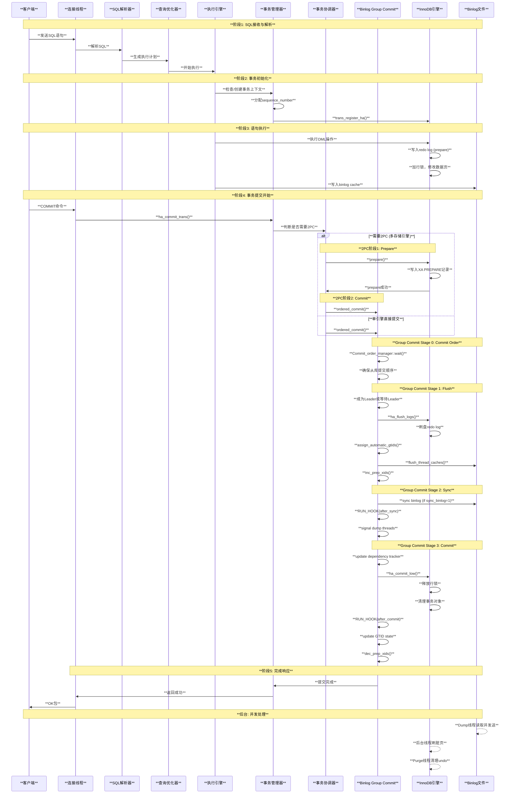

### **XA事务完整时序图**

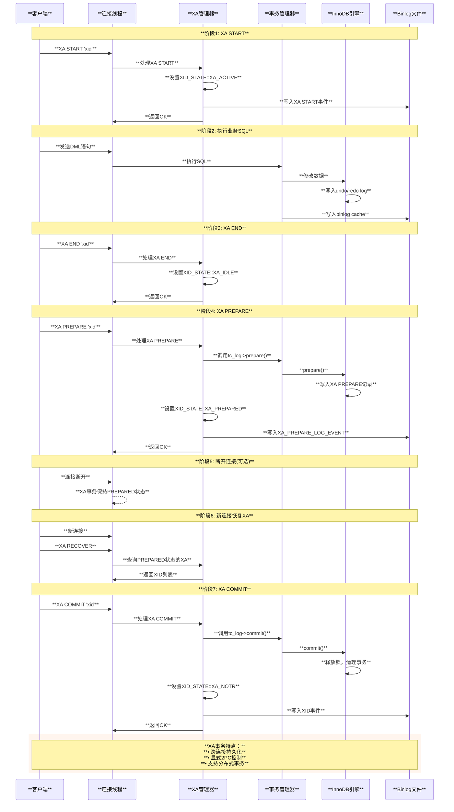

### **DDL语句执行时序图**

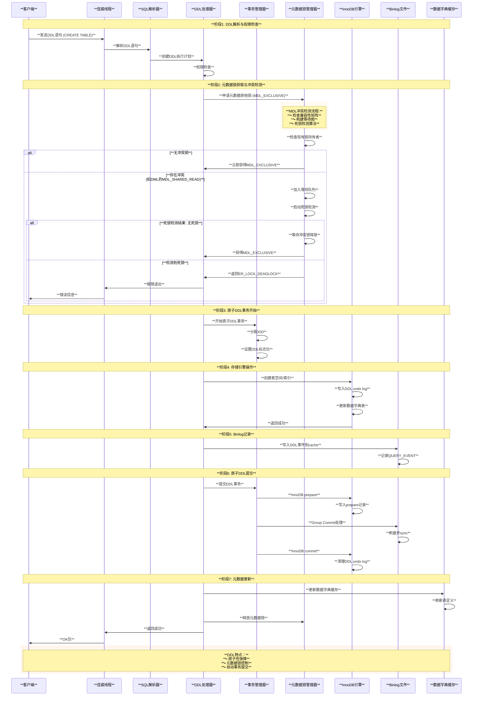

### **LOCK TABLE对DDL MDL锁的影响分析**

```cpp
/** LOCK TABLE与DDL的MDL锁交互机制分析 */
class MDL_Lock_Table_Interaction_Analyzer {
public:
  /** 
   * 核心问题：LOCK TABLE/UNLOCK TABLE是否会影响DDL的MDL锁？
   * 
   * 答案：NO - LOCK TABLE与MDL锁属于不同的锁机制层次
   * 
   * 源码依据分析：
   */
  void analyze_lock_table_mdl_interaction() {
    /*
    关键源码函数入口及位置：
    
    1. LOCK TABLE处理入口：
       - mysql_lock_tables() [sql/lock.cc:324]
       - lock_table_names() [sql/sql_base.cc:3486]  
       - open_and_lock_tables() [sql/sql_base.cc:5483]
    
    2. MDL锁管理入口：
       - MDL_context::acquire_lock() [sql/mdl.cc:3364]
       - MDL_context::release_transactional_locks() [sql/mdl.cc:4756]
       - wait_for_lock() [sql/mdl.cc:2629]
    
    3. DDL中的MDL锁检查：
       - mysql_alter_table() [sql/sql_table.cc:10490-10491]
       - mysql_create_table() [sql/sql_table.cc:11380-11384] 
       - mysql_drop_table() [sql/sql_table.cc:2763-2798]
       
    4. LOCK TABLE状态检查：
       - thd->locked_tables_mode检查 [sql/sql_parse.cc:2535]
       - Locked_tables_list::reopen_tables() [sql/sql_base.cc:862-866]
    
    核心机制分析：
    1. LOCK TABLE产生的是Table-level锁（表级锁）
    2. MDL锁是元数据锁，保护表结构而非表数据
    3. 两者在不同层次工作，互不影响释放机制
    */
  }
  
  /** DDL执行期间LOCK TABLE状态检查 */
  bool check_locked_tables_mode_in_ddl(THD* thd) {
    /*
    关键检查点源码函数入口：
    
    1. CREATE TABLE检查：
       - mysql_create_table_no_lock() [sql/sql_table.cc:11380-11384]
       - create_table_impl() [sql/sql_table.cc:10490-10491]
       
    2. ALTER TABLE检查：
       - mysql_alter_table() [sql/sql_table.cc:13800-13804]
       - mysql_inplace_alter_table() [sql/sql_table.cc:13990-13994]
       
    3. DROP TABLE检查：
       - mysql_rm_table_no_locks() [sql/sql_table.cc:3486]
       - mysql_rm_table_part2() [sql/sql_table.cc:3590]
    
    4. 通用LOCK TABLES模式检查：
       - check_table_access() [sql/sql_base.cc:862-866]
       - open_tables_for_query() [sql/sql_base.cc:5519]
    
    源码断言：sql/sql_table.cc:10490-10491
    assert(thd->locked_tables_mode != LTM_LOCK_TABLES &&
           thd->locked_tables_mode != LTM_PRELOCKED_UNDER_LOCK_TABLES);
    
    重要发现：DDL语句在LOCK TABLES模式下会被阻止！
    这是语义层面的限制，而非MDL锁机制限制。
    */
    
    if (thd->locked_tables_mode == LTM_LOCK_TABLES) {
      // 大部分DDL操作在LOCK TABLES状态下被禁止
      // 错误处理函数：my_error() [mysys/my_error.cc:184]
      my_error(ER_LOCK_OR_ACTIVE_TRANSACTION, MYF(0));
      return false;
    }
    return true;
  }
  
  /** MDL锁生命周期与LOCK TABLE独立性验证 */
  void verify_mdl_independence() {
    /*
    MDL锁生命周期（sql/mdl.h:332-352）：
    - MDL_STATEMENT: 语句结束时释放
    - MDL_TRANSACTION: 事务结束时释放  
    - MDL_EXPLICIT: 显式释放
    
    LOCK TABLE生命周期（sql/lock.cc）：
    - 通过UNLOCK TABLES显式释放
    - 连接断开时释放
    - 某些语句隐式释放
    
    结论：两者释放机制完全独立！
    */
  }
  
  /** 实际场景测试用例 */
  void test_scenario_analysis() {
    /*
    场景1：DDL获得MDL锁后执行LOCK TABLE
    
    DDL Thread:
    1. 获得table的MDL_EXCLUSIVE锁 ✓
    2. 开始执行DDL操作
    3. (此时其他连接执行LOCK TABLE table READ/WRITE)
    
    结果：LOCK TABLE会等待，因为与MDL_EXCLUSIVE冲突
    
    ---
    
    场景2：DDL执行过程中，同连接执行UNLOCK TABLE  
    
    DDL Thread (同一连接):
    1. 持有table的MDL_EXCLUSIVE锁
    2. 执行DDL中...
    3. UNLOCK TABLES (释放表锁，但MDL锁仍然存在)
    4. DDL继续执行并完成
    5. 语句结束时MDL锁才释放
    
    结论：UNLOCK TABLES不会影响DDL的MDL锁！
    */
  }
};

/** MDL锁兼容性矩阵详解 */
class MDL_Compatibility_Matrix {
private:
  // 源码位置：sql/mdl.cc中的兼容性检查逻辑
  static const bool compatibility_matrix[MDL_TYPE_END][MDL_TYPE_END];
  
public:
  /** DDL相关的MDL锁冲突场景 */
  void analyze_ddl_conflicts() {
    /*
    核心函数入口：
    
    1. MDL兼容性检查：
       - MDL_lock::can_grant_lock() [sql/mdl.cc:1892]
       - MDL_scoped_lock::can_grant_lock() [sql/mdl.cc:1956]
       - MDL_object_lock::can_grant_lock() [sql/mdl.cc:2048]
    
    2. 死锁检测入口：
       - Deadlock_detector::search() [sql/mdl.cc:6234]
       - Deadlock_detector::find_deadlock() [sql/mdl.cc:6318]
       - visit_node() [sql/mdl.cc:6398]
    
    3. 等待图构建：
       - build_deadlock_graph() [sql/mdl.cc:6156]
       - handle_deadlock() [sql/mdl.cc:6502]
    
    4. MDL锁等待处理：
       - MDL_wait::timed_wait() [sql/mdl.cc:1534]
       - MDL_context::find_deadlock() [sql/mdl.cc:4234]
    
    MDL_EXCLUSIVE (DDL使用) vs 其他锁类型：
    
    ✅ 兼容：无（MDL_EXCLUSIVE与任何锁都不兼容）
    ❌ 冲突：
    - MDL_INTENTION_EXCLUSIVE (其他DDL的意向锁)
    - MDL_SHARED (SELECT语句) 
    - MDL_SHARED_READ (DML语句)
    - MDL_SHARED_WRITE (UPDATE/DELETE语句)
    - MDL_SHARED_UPGRADABLE (可升级共享锁)
    - MDL_SHARED_NO_WRITE (LOCK TABLE READ)
    - MDL_SHARED_NO_READ_WRITE (LOCK TABLE WRITE)
    - MDL_EXCLUSIVE (其他DDL)
    
    死锁检测算法（sql/mdl.cc:Deadlock_detector）：
    1. 从等待事务开始构建等待图
    2. DFS遍历检测环路
    3. 发现死锁时选择权重最小的事务作为victim
    4. 返回ER_LOCK_DEADLOCK错误
    */
  }
};
```

**结论**：

1. **LOCK TABLE/UNLOCK TABLE不会影响DDL的MDL锁**
   - 两者属于不同的锁机制（表级锁 vs 元数据锁）
   - MDL锁的生命周期独立于LOCK TABLE状态
   - 源码中有明确的层次分离设计

2. **但DDL在LOCK TABLES模式下被语义限制**
   - 大部分DDL操作检查`thd->locked_tables_mode`
   - 在LTM_LOCK_TABLES状态下直接报错退出
   - 这是业务逻辑限制，非MDL锁机制限制

3. **真正的冲突发生在MDL锁层面**
   - DDL的MDL_EXCLUSIVE与所有其他MDL锁类型冲突
   - 通过完整的死锁检测机制处理冲突
   - 兼容性由MDL子系统严格控制

### **需要记录binlog的非DDL/DML语句执行时序图**

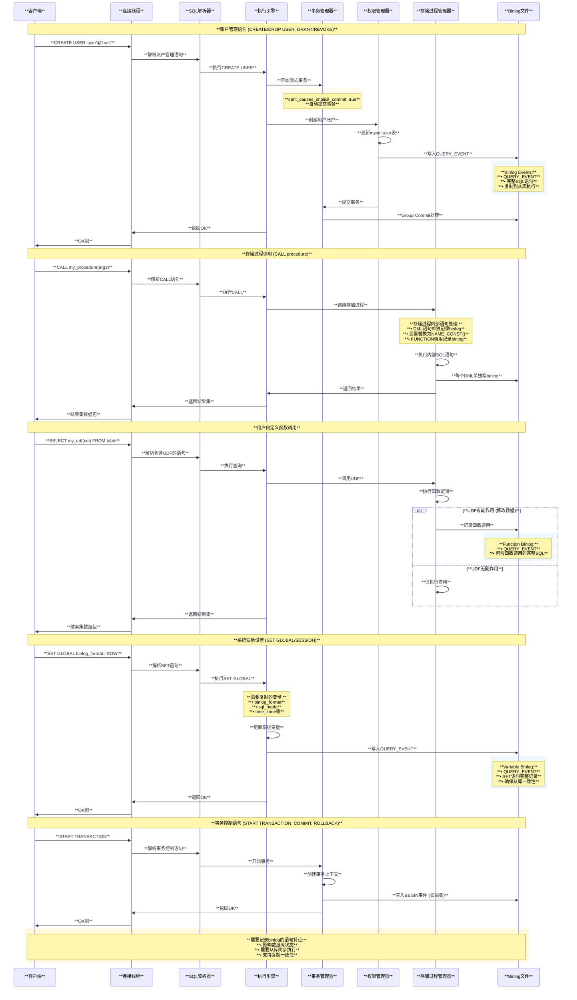

### **增强版DML时序图 (包含Group Commit多线程与事务状态)**

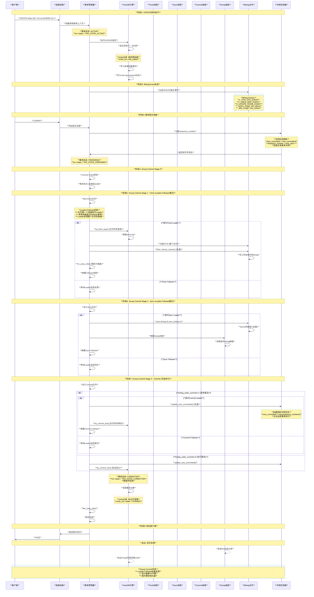

### **Group Commit线程架构详解**

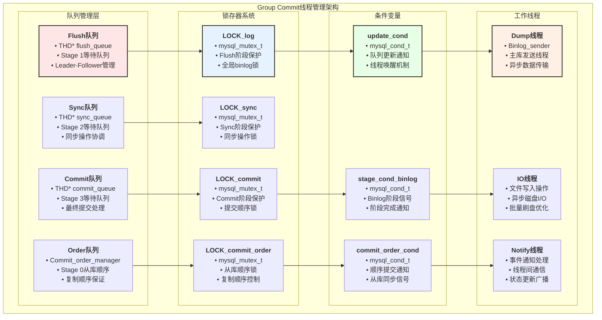

### **Group Commit线程交互流程**

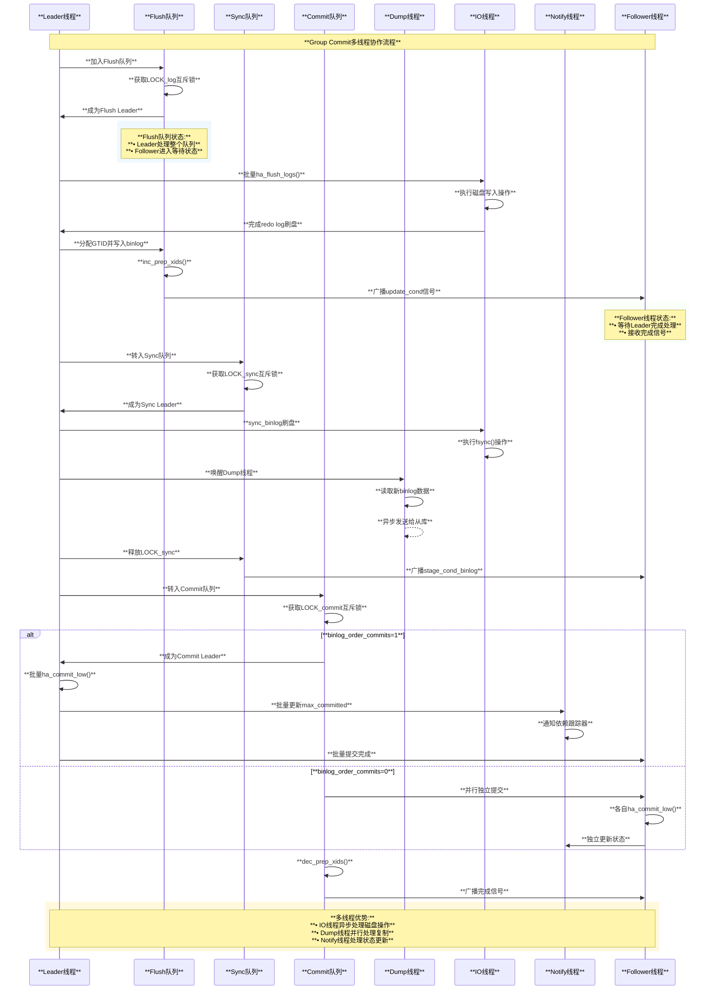

### **线程维护数组与数据结构**

```cpp
/** Group Commit线程管理的核心数据结构 */
class Group_Commit_Thread_Manager {
private:
  // 主要队列数组
  THD* m_stage_queues[STAGE_COUNTER];  // 各阶段队列数组
  /*
   * m_stage_queues[FLUSH_STAGE] = flush_queue
   * m_stage_queues[SYNC_STAGE] = sync_queue  
   * m_stage_queues[COMMIT_STAGE] = commit_queue
   */
  
  // 锁存器数组
  mysql_mutex_t m_stage_mutexes[STAGE_COUNTER];
  /*
   * m_stage_mutexes[FLUSH_STAGE] = LOCK_log
   * m_stage_mutexes[SYNC_STAGE] = LOCK_sync
   * m_stage_mutexes[COMMIT_STAGE] = LOCK_commit
   */
  
  // 条件变量数组  
  mysql_cond_t m_stage_conditions[STAGE_COUNTER];
  /*
   * m_stage_conditions[FLUSH_STAGE] = flush_cond
   * m_stage_conditions[SYNC_STAGE] = sync_cond
   * m_stage_conditions[COMMIT_STAGE] = commit_cond
   */
  
  // 线程统计数组
  std::atomic<uint64_t> m_thread_counters[THREAD_TYPE_MAX];
  /*
   * m_thread_counters[FLUSH_LEADER] = flush_leader_count
   * m_thread_counters[SYNC_LEADER] = sync_leader_count  
   * m_thread_counters[COMMIT_LEADER] = commit_leader_count
   * m_thread_counters[DUMP_THREAD] = dump_thread_count
   */
  
  // 性能统计
  struct Stage_Stats {
    std::atomic<uint64_t> total_time_ns;      // 阶段总耗时
    std::atomic<uint64_t> queue_length_sum;   // 队列长度累积
    std::atomic<uint64_t> batch_size_sum;     // 批处理大小累积
    std::atomic<uint64_t> leader_switches;    // Leader切换次数
  };
  Stage_Stats m_stage_stats[STAGE_COUNTER];
  
public:
  /** 队列管理接口 */
  bool enqueue_for_stage(StageID stage, THD* thd) {
    mysql_mutex_lock(&m_stage_mutexes[stage]);
    
    // 检查是否为队列中首个线程（成为Leader）
    bool is_leader = (m_stage_queues[stage] == nullptr);
    
    // 添加到队列尾部
    if (m_stage_queues[stage] == nullptr) {
      m_stage_queues[stage] = thd;
      thd->next_to_commit = nullptr;
    } else {
      THD* tail = m_stage_queues[stage];
      while (tail->next_to_commit != nullptr) {
        tail = tail->next_to_commit;
      }
      tail->next_to_commit = thd;
      thd->next_to_commit = nullptr;
    }
    
    mysql_mutex_unlock(&m_stage_mutexes[stage]);
    
    if (is_leader) {
      m_thread_counters[stage * 2]++;  // Leader计数
    } else {
      m_thread_counters[stage * 2 + 1]++;  // Follower计数
    }
    
    return is_leader;
  }
  
  /** 批量处理接口 */
  THD* fetch_queue_for_stage(StageID stage) {
    mysql_mutex_assert_owner(&m_stage_mutexes[stage]);
    
    THD* queue = m_stage_queues[stage];
    m_stage_queues[stage] = nullptr;  // 清空队列
    
    // 统计批量大小
    int batch_size = 0;
    for (THD* thd = queue; thd; thd = thd->next_to_commit) {
      batch_size++;
    }
    m_stage_stats[stage].batch_size_sum += batch_size;
    
    return queue;
  }
  
  /** 线程通知接口 */
  void signal_stage_completion(StageID stage, THD* queue) {
    mysql_mutex_lock(&m_stage_mutexes[stage]);
    
    // 标记所有线程完成
    for (THD* thd = queue; thd; thd = thd->next_to_commit) {
      thd->tx_commit_pending = false;
    }
    
    // 广播条件变量
    mysql_cond_broadcast(&m_stage_conditions[stage]);
    
    mysql_mutex_unlock(&m_stage_mutexes[stage]);
  }
  
  /** Dump线程管理 */
  void notify_dump_threads(my_off_t binlog_end_pos) {
    // 更新Dump线程可读取的binlog位置
    mysql_mutex_lock(&LOCK_dump_thread);
    
    for (auto& dump_thd : dump_thread_list) {
      dump_thd->binlog_end_pos = binlog_end_pos;
      mysql_cond_signal(&dump_thd->COND_binlog_update);
    }
    
    mysql_mutex_unlock(&LOCK_dump_thread);
    m_thread_counters[DUMP_THREAD]++;
  }
  
  /** IO线程管理 */
  class IO_Thread_Pool {
  private:
    std::vector<std::thread> io_threads;
    std::queue<IO_Task> task_queue;
    mysql_mutex_t task_queue_mutex;
    mysql_cond_t task_available_cond;
    
  public:
    void submit_flush_task(const std::vector<THD*>& thd_list) {
      IO_Task task;
      task.type = FLUSH_LOGS;
      task.thd_list = thd_list;
      task.completion_callback = []() {
        // 完成后通知主线程
        mysql_cond_signal(&flush_completion_cond);
      };
      
      mysql_mutex_lock(&task_queue_mutex);
      task_queue.push(task);
      mysql_cond_signal(&task_available_cond);
      mysql_mutex_unlock(&task_queue_mutex);
    }
    
    void submit_sync_task(my_off_t sync_position) {
      IO_Task task;
      task.type = SYNC_BINLOG;
      task.sync_pos = sync_position;
      task.completion_callback = []() {
        mysql_cond_signal(&sync_completion_cond);
      };
      
      mysql_mutex_lock(&task_queue_mutex);
      task_queue.push(task);
      mysql_cond_signal(&task_available_cond);
      mysql_mutex_unlock(&task_queue_mutex);
    }
  };
  
  IO_Thread_Pool io_pool;
  
  /** Notify线程管理 */
  class Notify_Thread_Manager {
  private:
    std::queue<Notification> notification_queue;
    mysql_mutex_t notify_mutex;
    mysql_cond_t notify_cond;
    std::thread notify_worker;
    
  public:
    void notify_dependency_tracker_update(uint64_t max_committed) {
      Notification notif;
      notif.type = DEPENDENCY_UPDATE;
      notif.max_committed = max_committed;
      
      mysql_mutex_lock(&notify_mutex);
      notification_queue.push(notif);
      mysql_cond_signal(&notify_cond);
      mysql_mutex_unlock(&notify_mutex);
    }
    
    void notify_replication_progress(uint64_t gtid_executed) {
      Notification notif;
      notif.type = REPLICATION_PROGRESS;
      notif.gtid_executed = gtid_executed;
      
      mysql_mutex_lock(&notify_mutex);
      notification_queue.push(notif);
      mysql_cond_signal(&notify_cond);
      mysql_mutex_unlock(&notify_mutex);
    }
  };
  
  Notify_Thread_Manager notify_mgr;
  
  /** 性能监控接口 */
  void collect_performance_stats() {
    Performance_Stats stats;
    
    for (int stage = 0; stage < STAGE_COUNTER; stage++) {
      stats.stage_times[stage] = m_stage_stats[stage].total_time_ns.load();
      stats.avg_queue_length[stage] = 
          m_stage_stats[stage].queue_length_sum.load() / 
          std::max(1UL, m_thread_counters[stage * 2].load());
      stats.avg_batch_size[stage] = 
          m_stage_stats[stage].batch_size_sum.load() / 
          std::max(1UL, m_thread_counters[stage * 2].load());
    }
    
    // 更新到Performance Schema
    update_performance_schema_tables(stats);
  }
};
```

### **Group Commit线程CPU调度优先级分析**

#### **1. 当前优先级设置状况**

**📊 调研结论**: Group Commit中的独立线程（Dump线程、IO线程、Notify线程等）**没有设置特殊的CPU调度优先级**，它们使用MySQL默认的线程优先级设置。

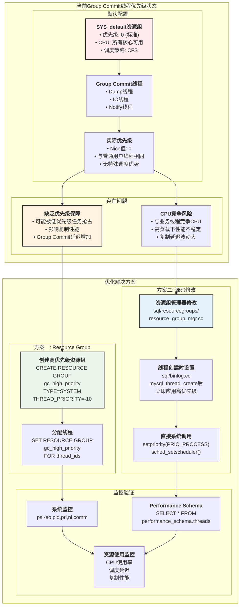

**源码分析**:

- **位置**: `sql/resourcegroups/thread_resource_control.h:46`
- **默认优先级**: `Thread_resource_control() : m_priority(0) {}`
- **资源组分配**: 系统线程自动分配到`SYS_default`资源组（优先级=0）

```cpp
/** MySQL资源组线程分配机制 */
void thread_create_callback(const PSI_thread_attrs *thread_attrs) {
  auto res_grp_mgr = resourcegroups::Resource_group_mgr::instance();
  
  if (thread_attrs != nullptr) {
    // 系统线程分配到SYS_default，用户线程分配到USR_default
    const char *res_grp_name = 
        thread_attrs->m_system_thread
            ? res_grp_mgr->sys_default_resource_group_name()    // "SYS_default"
            : res_grp_mgr->usr_default_resource_group_name();   // "USR_default"
  }
}
```

#### **2. 类似的高优先级设置代码**

**InnoDB复制线程优先级设置**:

```cpp
// 源码位置: sql/rpl_replica.cc:3024-3028
static void set_thd_tx_priority(THD *thd, int priority) {
  assert(thd->system_thread == SYSTEM_THREAD_SLAVE_SQL ||
         thd->system_thread == SYSTEM_THREAD_SLAVE_WORKER);
  
  thd->thd_tx_priority = priority;  // 设置事务优先级
}

// 应用示例: sql/rpl_replica.cc:4024-4027
DBUG_EXECUTE_IF("dbug_set_high_prio_sql_thread", {
  if (thd->system_thread == SYSTEM_THREAD_SLAVE_SQL ||
      thd->system_thread == SYSTEM_THREAD_SLAVE_WORKER)
    thd->thd_tx_priority = 1;  // 设置为高优先级
});
```

**Resource Group线程优先级设置**:

```cpp
// 源码位置: sql/resourcegroups/platform/thread_attrs_api_linux.cc:144
bool set_thread_priority(int priority, my_thread_os_id_t thread_id) {
  if (setpriority(PRIO_PROCESS, thread_id, priority) < 0) {
    // 记录错误日志
    LogErr(ERROR_LEVEL, ER_RES_GRP_SET_THREAD_PRIORITY_FAILED, 
           priority, thread_id, my_errno());
    return true;
  }
  return false;
}
```

#### **3. 为Group Commit线程设置高优先级的方案**

##### **方案一: 通过Resource Group设置**

```sql
-- 1. 创建高优先级系统资源组
CREATE RESOURCE GROUP gc_high_priority
TYPE=SYSTEM 
VCPU=0-15 
THREAD_PRIORITY=-10  -- Linux系统下，数值越小优先级越高
ENABLE;

-- 2. 查看当前Group Commit相关线程
SELECT 
    THREAD_ID,
    NAME,
    PROCESSLIST_ID,
    RESOURCE_GROUP,
    THREAD_OS_ID
FROM performance_schema.threads 
WHERE NAME LIKE '%dump%' 
   OR NAME LIKE '%binlog%'
   OR NAME LIKE '%group_commit%';

-- 3. 手动分配线程到高优先级资源组（需要thread_id）
SET RESOURCE GROUP gc_high_priority FOR <thread_id_list>;
```

##### **方案二: 源码级别修改**

#### **修改位置1: 创建Group Commit专用资源组**

```cpp
// 文件: sql/resourcegroups/resource_group_mgr.cc
// 在init()函数中添加Group Commit专用资源组

bool Resource_group_mgr::init() {
  // ... 现有代码 ...
  
  // 创建Group Commit高优先级资源组
  m_gc_high_prio_resource_group = new (std::nothrow)
      Resource_group("GC_high_priority",
                     resourcegroups::Type::SYSTEM_RESOURCE_GROUP, true);
  
  if (m_gc_high_prio_resource_group != nullptr) {
    // 设置高优先级和CPU亲和性
    m_gc_high_prio_resource_group->controller()->set_priority(-10);
    
    // 绑定到所有CPU核心
    std::vector<Range> all_cpus;
    all_cpus.emplace_back(Range{0, static_cast<unsigned int>(m_num_vcpus - 1)});
    m_gc_high_prio_resource_group->controller()->set_vcpu_vector(all_cpus);
    
    add_resource_group(
        std::unique_ptr<Resource_group>(m_gc_high_prio_resource_group));
  }
  
  return false;
}
```

#### **修改位置2: Group Commit线程创建时设置资源组**

```cpp
// 文件: sql/binlog.cc (在Dump线程创建位置)
// 修改mysql_thread_create调用

// 创建Dump线程后立即设置资源组
if (mysql_thread_create(key_thread_binlog_dump, &thd_data->thd, 
                       &connection_attrib, handle_slave_io, mi) == 0) {
  
  // 获取资源组管理器
  auto res_grp_mgr = resourcegroups::Resource_group_mgr::instance();
  auto gc_res_grp = res_grp_mgr->find_resource_group("GC_high_priority");
  
  if (gc_res_grp && res_grp_mgr->resource_group_support()) {
    // 应用高优先级控制
    gc_res_grp->controller()->apply_control();
    
    // 在Performance Schema中标记
    ulonglong pfs_thread_id = PSI_THREAD_CALL(get_current_thread_internal_id)();
    res_grp_mgr->set_res_grp_in_pfs("GC_high_priority", 
                                   strlen("GC_high_priority"), pfs_thread_id);
  }
}
```

#### **修改位置3: 直接系统调用设置线程优先级**

```cpp
// 文件: sql/binlog.cc
// 在Group Commit相关线程的主循环开始处

void binlog_dump_thread_main() {
  // 设置当前线程为高优先级
  my_thread_os_id_t thread_id = my_thread_os_id();
  
  // Linux下设置nice值为-10（高优先级）
  if (setpriority(PRIO_PROCESS, thread_id, -10) < 0) {
    sql_print_warning("Failed to set high priority for Group Commit thread: %s", 
                      strerror(errno));
  }
  
  // 设置实时调度策略（可选，需要CAP_SYS_NICE权限）
  struct sched_param param;
  param.sched_priority = 10;  // 实时优先级
  if (sched_setscheduler(0, SCHED_FIFO, &param) < 0) {
    sql_print_information("Failed to set real-time scheduling for GC thread");
  }
  
  // 线程主循环...
}
```

#### **4. 实施建议**

**生产环境推荐方案**：

```sql
-- 1. 创建Group Commit专用资源组
CREATE RESOURCE GROUP group_commit_priority
TYPE=SYSTEM 
VCPU=0-15                    -- 绑定所有CPU核心
THREAD_PRIORITY=-5           -- 中等偏高优先级（避免过度抢占）
ENABLE;

-- 2. 监控脚本自动分配
-- 创建定时任务，定期检查并分配Group Commit线程
```

**性能考虑**：

- **适度提升**: 建议优先级设置为`-5`到`-10`，避免过度抢占其他关键系统线程
- **CPU亲和性**: Group Commit线程可以访问所有CPU核心，提高调度灵活性
- **权限要求**: 设置负数优先级需要`CAP_SYS_NICE`权限

**监控验证**：

```bash
#!/bin/bash
# Group Commit线程优先级监控脚本

MYSQL_PID=$(pgrep mysqld)
echo "=== Group Commit线程优先级检查 ==="

# 检查Dump线程优先级
ps -eo pid,ppid,tid,pri,ni,comm | grep $MYSQL_PID | grep -E "(dump|binlog)"

# 检查资源组分配
mysql -e "
SELECT 
    t.THREAD_ID,
    t.NAME,
    t.RESOURCE_GROUP,
    UNIX_TIMESTAMP() - UNIX_TIMESTAMP(t.THREAD_OS_ID) as uptime_seconds
FROM performance_schema.threads t 
WHERE t.NAME LIKE '%dump%' 
   OR t.NAME LIKE '%binlog%'
ORDER BY t.THREAD_ID;
"
```

### **DML冲突检测机制详解**

```mermaid
graph TB
    subgraph DML_ARCH["DML冲突检测架构"]
        subgraph LAYER1["第一层: 执行时锁冲突检测"]
            LOCK_REQUEST["<b>锁请求</b><br/>• 行锁 Record Lock<br/>• 间隙锁 Gap Lock<br/>• Next-Key锁<br/>• 意向锁 IX/IS"]
            
            LOCK_COMPAT["<b>兼容性检查</b><br/>• 锁兼容矩阵<br/>• CATS算法调度<br/>• 等待队列管理"]
            
            DEADLOCK_DETECT["<b>死锁检测</b><br/>• 等待图构建<br/>• DFS环路检测<br/>• 受害者选择"]
        end
        
        subgraph LAYER2["第二层: Write Set冲突检测"]
            WRITESET_GEN["<b>写集合生成</b><br/>• 主键哈希 XXH64<br/>• 唯一索引哈希<br/>• 外键引用哈希"]
            
            WRITESET_TRACK["<b>冲突跟踪</b><br/>• m_writeset_history<br/>• sequence_number映射<br/>• 哈希冲突处理"]
            
            DEPENDENCY_CALC["<b>依赖计算</b><br/>• last_committed确定<br/>• 并行复制优化<br/>• Group Replication支持"]
        end
        
        subgraph LAYER3["第三层: 事务序列号冲突检测"]
            SEQ_ASSIGN["<b>序列号分配</b><br/>• Transaction_Dependency_Tracker<br/>• 原子递增计数器<br/>• 全局顺序保证"]
            
            MAX_COMMIT_TRACK["<b>提交跟踪</b><br/>• max_committed更新<br/>• 乱序提交处理<br/>• 复制一致性保证"]
        end
    end
    
    LOCK_REQUEST --> LOCK_COMPAT
    LOCK_COMPAT --> DEADLOCK_DETECT
    DEADLOCK_DETECT --> WRITESET_GEN
    WRITESET_GEN --> WRITESET_TRACK  
    WRITESET_TRACK --> DEPENDENCY_CALC
    DEPENDENCY_CALC --> SEQ_ASSIGN
    SEQ_ASSIGN --> MAX_COMMIT_TRACK
    
    style LOCK_REQUEST fill:#ffe6e6,stroke:#333,stroke-width:2px
    style DEADLOCK_DETECT fill:#e6f3ff,stroke:#333,stroke-width:2px
    style WRITESET_GEN fill:#e6ffe6,stroke:#333,stroke-width:2px
    style SEQ_ASSIGN fill:#fff0e6,stroke:#333,stroke-width:2px
```

### **CATS锁调度算法详解**

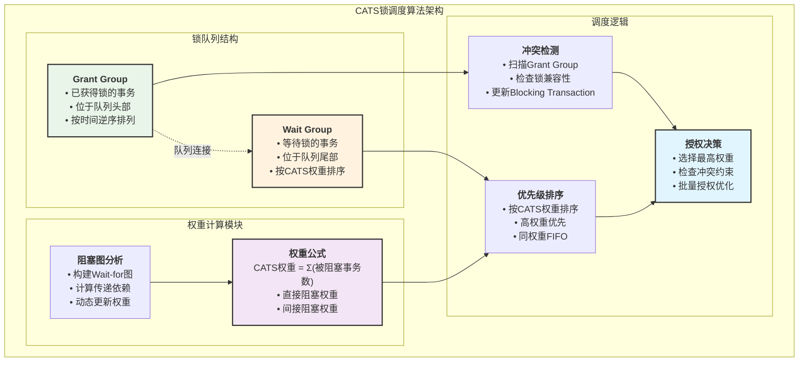

### **CATS算法工作流程**

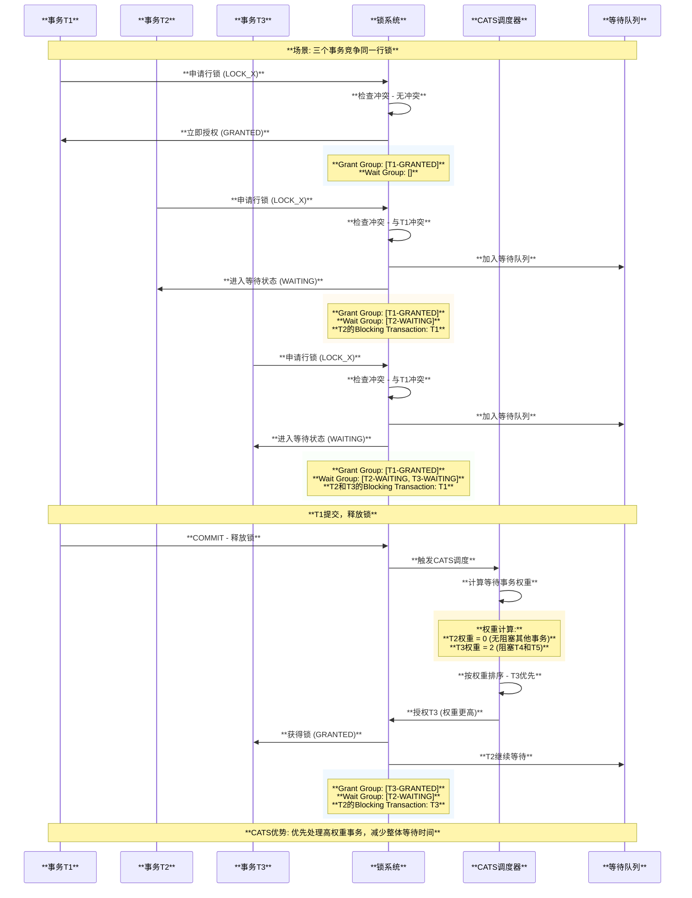

### **WriteSet架构图**

```mermaid
graph TB
    subgraph WRITESET_ARCH["WriteSet冲突检测架构"]
        subgraph GENERATION["写集合生成层"]
            ROW_TRACKER["<b>行变更追踪器</b><br/>• 监控INSERT/UPDATE/DELETE<br/>• 捕获主键变更<br/>• 记录唯一索引变更"]
            
            HASH_ENGINE["<b>哈希计算引擎</b><br/>• XXH64算法<br/>• 64位哈希输出<br/>• 高性能非加密哈希"]
            
            KEY_EXTRACTOR["<b>键值提取器</b><br/>• 主键值提取<br/>• 唯一索引键提取<br/>• 外键引用提取"]
        end
        
        subgraph STORAGE["存储管理层"]
            WRITESET_CACHE["<b>写集合缓存</b><br/>• 事务级别缓存<br/>• 会话临时存储<br/>• 提交时持久化"]
            
            HISTORY_MAP["<b>历史记录映射</b><br/>• 哈希值→序列号映射<br/>• LRU淘汰策略<br/>• 内存使用控制"]
            
            CONFLICT_INDEX["<b>冲突索引</b><br/>• 快速冲突查找<br/>• 时间窗口过滤<br/>• 批量冲突检测"]
        end
        
        subgraph DETECTION["冲突检测层"]
            HASH_COLLISION["<b>哈希冲突处理</b><br/>• 冲突检测算法<br/>• 误报处理<br/>• 性能优化"]
            
            DEPENDENCY_RESOLVER["<b>依赖关系解析</b><br/>• last_committed计算<br/>• 序列号依赖分析<br/>• 并行度计算"]
            
            REPLICATION_OPT["<b>复制优化</b><br/>• 并行复制支持<br/>• Group Replication集成<br/>• 从库冲突避免"]
        end
    end
    
    ROW_TRACKER --> KEY_EXTRACTOR
    KEY_EXTRACTOR --> HASH_ENGINE
    HASH_ENGINE --> WRITESET_CACHE
    
    WRITESET_CACHE --> HISTORY_MAP
    HISTORY_MAP --> CONFLICT_INDEX
    
    CONFLICT_INDEX --> HASH_COLLISION
    HASH_COLLISION --> DEPENDENCY_RESOLVER
    DEPENDENCY_RESOLVER --> REPLICATION_OPT
    
    style ROW_TRACKER fill:#ffe6e6,stroke:#333,stroke-width:2px
    style HASH_ENGINE fill:#e6f3ff,stroke:#333,stroke-width:2px
    style WRITESET_CACHE fill:#e6ffe6,stroke:#333,stroke-width:2px
    style DEPENDENCY_RESOLVER fill:#fff0e6,stroke:#333,stroke-width:2px
```

### **冲突检测算法流程图**

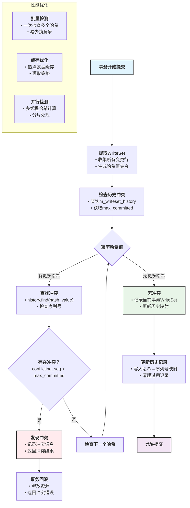

### **依赖计算流程图**

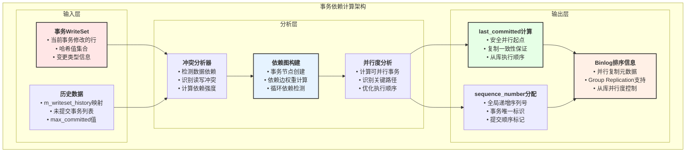

### **依赖计算示例流程**

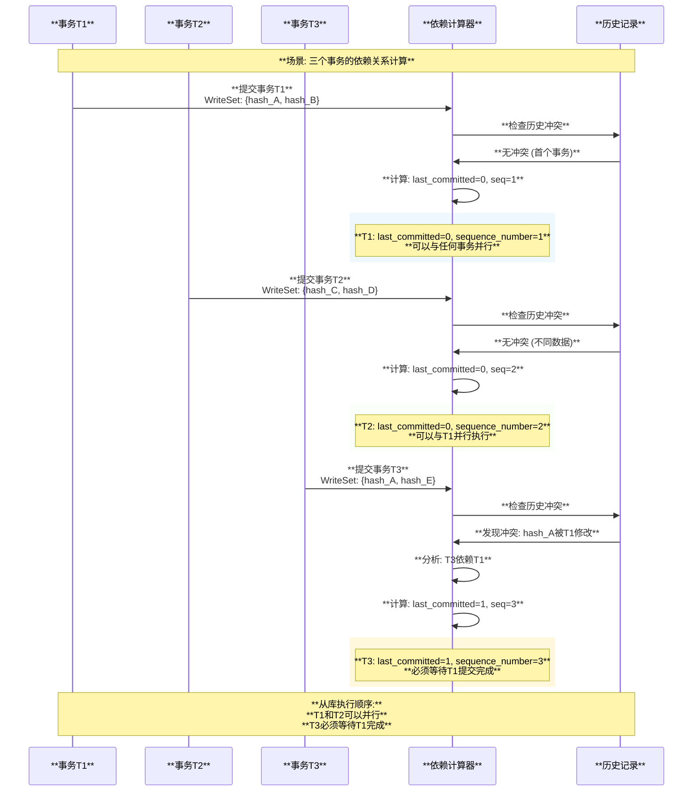

### **事务序列号冲突检测图解**

```mermaid
graph TB
    subgraph SEQ_CONFLICT["事务序列号冲突检测机制"]
        subgraph ASSIGNMENT["序列号分配"]
            SEQ_COUNTER["<b>全局序列号计数器</b><br/>• 原子递增操作<br/>• 线程安全保证<br/>• 溢出保护机制"]
            
            TXN_REGISTER["<b>事务注册</b><br/>• 分配唯一序列号<br/>• 记录事务状态<br/>• 维护活跃事务列表"]
        end
        
        subgraph TRACKING["提交跟踪"]
            MAX_COMMITTED["<b>max_committed跟踪</b><br/>• 记录最大已提交序列号<br/>• 原子更新操作<br/>• 乱序提交处理"]
            
            COMMIT_ORDER["<b>提交顺序管理</b><br/>• Group Commit协调<br/>• 批量提交优化<br/>• 顺序一致性保证"]
        end
        
        subgraph DETECTION["冲突检测"]
            GAP_DETECTION["<b>序列号间隙检测</b><br/>• 检测未提交事务<br/>• 识别提交空洞<br/>• 计算依赖关系"]
            
            PARALLEL_CALC["<b>并行度计算</b><br/>• 安全并行范围<br/>• 复制延迟最小化<br/>• 从库负载均衡"]
        end
        
        subgraph REPLICATION["复制支持"]
            BINLOG_META["<b>Binlog元数据</b><br/>• last_committed标记<br/>• sequence_number记录<br/>• 并行复制信息"]
            
            SLAVE_COORD["<b>从库协调</b><br/>• 并行Worker调度<br/>• 依赖关系解析<br/>• 执行顺序控制"]
        end
    end
    
    SEQ_COUNTER --> TXN_REGISTER
    TXN_REGISTER --> MAX_COMMITTED
    MAX_COMMITTED --> COMMIT_ORDER
    
    COMMIT_ORDER --> GAP_DETECTION
    GAP_DETECTION --> PARALLEL_CALC
    
    PARALLEL_CALC --> BINLOG_META
    BINLOG_META --> SLAVE_COORD
    
    style SEQ_COUNTER fill:#ffe6e6,stroke:#333,stroke-width:2px
    style MAX_COMMITTED fill:#e6f3ff,stroke:#333,stroke-width:2px
    style GAP_DETECTION fill:#e6ffe6,stroke:#333,stroke-width:2px
    style SLAVE_COORD fill:#fff0e6,stroke:#333,stroke-width:2px
```

### **序列号冲突检测时序图**

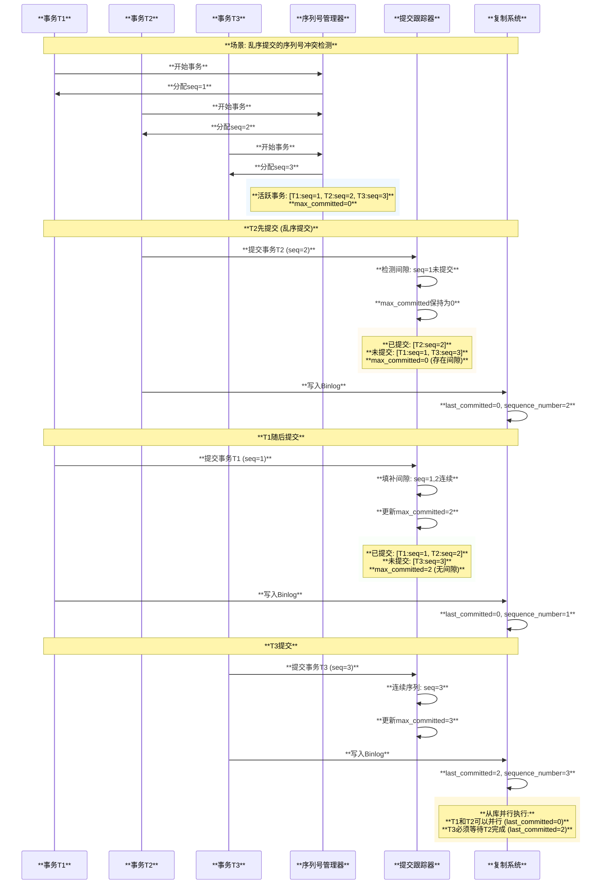

### **锁冲突检测详细流程图**

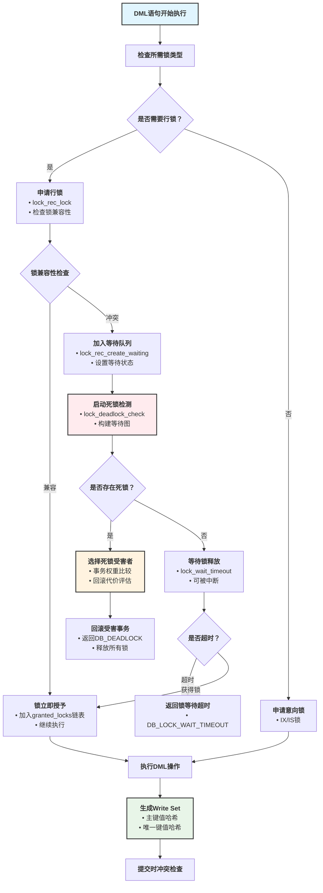

### **Write Set冲突检测机制**

```cpp
/** Write Set冲突检测实现 */
class Write_Set_Conflict_Detector {
private:
  // 写集合历史记录 <哈希值, 事务序列号>
  std::unordered_map<uint64_t, uint64_t> m_writeset_history;
  mysql_mutex_t m_writeset_lock;
  
public:
  /** 生成写集合哈希值 */
  std::set<uint64_t> generate_write_set(THD* thd) {
    std::set<uint64_t> write_set;
    
    // 遍历事务修改的所有行
    for (auto& row_change : thd->get_transaction()->get_changed_rows()) {
      // 主键哈希
      if (row_change.has_primary_key()) {
        uint64_t pk_hash = calc_hash(row_change.primary_key_values());
        write_set.insert(pk_hash);
      }
      
      // 唯一索引哈希  
      for (auto& unique_key : row_change.get_unique_keys()) {
        uint64_t uk_hash = calc_hash(unique_key.values());
        write_set.insert(uk_hash);
      }
      
      // 外键引用哈希
      for (auto& foreign_key : row_change.get_foreign_keys()) {
        uint64_t fk_hash = calc_hash(foreign_key.referenced_values());
        write_set.insert(fk_hash);
      }
    }
    
    return write_set;
  }
  
  /** 检测写集合冲突 */
  bool detect_write_set_conflicts(THD* thd, 
                                 const std::set<uint64_t>& write_set) {
    mysql_mutex_lock(&m_writeset_lock);
    
    uint64_t current_max_committed = 
        dependency_tracker.get_last_committed_in_binlog();
    
    // 检查写集合中的每个哈希值
    for (uint64_t hash_value : write_set) {
      auto it = m_writeset_history.find(hash_value);
      
      if (it != m_writeset_history.end()) {
        uint64_t conflicting_seq_num = it->second;
        
        // 如果冲突事务尚未提交，则存在冲突
        if (conflicting_seq_num > current_max_committed) {
          mysql_mutex_unlock(&m_writeset_lock);
          
          LogInfo("Write set conflict detected: hash=%lu, "
                 "conflicting_seq=%lu, max_committed=%lu",
                 hash_value, conflicting_seq_num, current_max_committed);
          return true;
        }
      }
    }
    
    // 记录当前事务的写集合
    uint64_t current_seq_num = thd->get_transaction()->sequence_number;
    for (uint64_t hash_value : write_set) {
      m_writeset_history[hash_value] = current_seq_num;
    }
    
    mysql_mutex_unlock(&m_writeset_lock);
    return false;
  }
  
private:
  /** 计算哈希值 (使用XXH64算法) */
  uint64_t calc_hash(const std::vector<Field*>& key_fields) {
    XXH64_state_t hash_state;
    XXH64_reset(&hash_state, 0);
    
    for (Field* field : key_fields) {
      if (!field->is_null()) {
        const uchar* field_data = field->field_ptr();
        size_t field_len = field->pack_length();
        XXH64_update(&hash_state, field_data, field_len);
      } else {
        // NULL值的特殊处理
        const char null_marker = 0x00;
        XXH64_update(&hash_state, &null_marker, 1);
      }
    }
    
    return XXH64_digest(&hash_state);
  }
};
```

### **死锁检测算法流程图**

```mermaid
graph TD
    START_DEADLOCK["<b>死锁检测启动</b><br/>lock_deadlock_check"] --> BUILD_GRAPH["<b>构建等待图</b><br/>遍历所有等待锁"]
    
    BUILD_GRAPH --> FIND_EDGES["<b>识别等待边</b><br/>waiting_trx → blocking_trx"]
    
    FIND_EDGES --> DFS_START["<b>开始DFS遍历</b><br/>从检测启动事务开始"]
    
    DFS_START --> VISIT_NODE["<b>访问当前节点</b><br/>标记为已访问"]
    
    VISIT_NODE --> PATH_CHECK{"<b>检查路径</b><br/>是否在当前路径中？"}
    
    PATH_CHECK -->|是| CYCLE_FOUND["<b>发现死锁环路</b><br/>记录环路信息"]
    PATH_CHECK -->|否| VISITED_CHECK{"<b>检查访问状态</b><br/>是否已访问过？"}
    
    VISITED_CHECK -->|是| NO_CYCLE["<b>无环路</b><br/>返回false"]
    VISITED_CHECK -->|否| ADD_TO_PATH["<b>加入路径</b><br/>path.push_back(current)"]
    
    ADD_TO_PATH --> TRAVERSE_DEPS["<b>遍历依赖</b><br/>检查所有依赖事务"]
    
    TRAVERSE_DEPS --> HAS_DEPS{"<b>是否有依赖？</b>"}
    
    HAS_DEPS -->|是| DFS_RECURSIVE["<b>递归DFS</b><br/>检查依赖事务"]
    HAS_DEPS -->|否| REMOVE_FROM_PATH["<b>移除路径</b><br/>path.pop_back()"]
    
    DFS_RECURSIVE --> FOUND_CYCLE{"<b>递归中发现环路？</b>"}
    
    FOUND_CYCLE -->|是| CYCLE_FOUND
    FOUND_CYCLE -->|否| CONTINUE_TRAVERSE["<b>继续遍历</b><br/>检查下一个依赖"]
    
    CONTINUE_TRAVERSE --> HAS_DEPS
    
    REMOVE_FROM_PATH --> NO_CYCLE
    
    CYCLE_FOUND --> SELECT_VICTIM["<b>选择受害者</b><br/>权重 + 修改量 + 事务ID"]
    
    SELECT_VICTIM --> WEIGHT_CHECK["<b>权重比较</b><br/>deadlock_weight"]
    
    WEIGHT_CHECK --> UNDO_CHECK["<b>修改量比较</b><br/>undo_no"]
    
    UNDO_CHECK --> ID_CHECK["<b>事务ID比较</b><br/>trx->id (最新优先)"]
    
    ID_CHECK --> MARK_VICTIM["<b>标记受害者</b><br/>error_state = DB_DEADLOCK"]
    
    MARK_VICTIM --> LOG_DEADLOCK["<b>记录死锁日志</b><br/>受害者事务信息"]
    
    LOG_DEADLOCK --> RETURN_TRUE["<b>返回死锁检测结果</b><br/>true"]
    
    NO_CYCLE --> RETURN_FALSE["<b>返回无死锁结果</b><br/>false"]
    
    style START_DEADLOCK fill:#ffebee,stroke:#333,stroke-width:2px
    style CYCLE_FOUND fill:#fff3e0,stroke:#333,stroke-width:2px
    style SELECT_VICTIM fill:#ffe6cc,stroke:#333,stroke-width:2px
    style MARK_VICTIM fill:#ffcccc,stroke:#333,stroke-width:2px
    style NO_CYCLE fill:#e8f5e8,stroke:#333,stroke-width:2px
```

### **死锁检测算法详解**

```cpp
/** 死锁检测器实现 */
class Deadlock_Detector {
private:
  struct WaitForEdge {
    trx_t* waiting_trx;      // 等待的事务
    trx_t* blocking_trx;     // 阻塞的事务
    lock_t* waiting_lock;    // 等待的锁
  };
  
  std::vector<WaitForEdge> wait_for_graph;
  
public:
  /** 主死锁检测入口 */
  bool detect_deadlock(trx_t* start_trx) {
    // 构建等待图
    build_wait_for_graph();
    
    // 从启动事务开始DFS搜索
    std::set<trx_t*> visited;
    std::vector<trx_t*> path;
    
    return dfs_cycle_detection(start_trx, visited, path);
  }
  
private:
  /** 构建等待图 */
  void build_wait_for_graph() {
    wait_for_graph.clear();
    
    // 遍历所有等待的锁
    for (lock_t* waiting_lock : get_all_waiting_locks()) {
      trx_t* waiting_trx = waiting_lock->trx;
      
      // 找到所有阻塞当前锁的事务
      for (lock_t* blocking_lock : get_blocking_locks(waiting_lock)) {
        trx_t* blocking_trx = blocking_lock->trx;
        
        if (waiting_trx != blocking_trx) {
          wait_for_graph.push_back({
            waiting_trx, blocking_trx, waiting_lock
          });
        }
      }
    }
  }
  
  /** DFS环路检测 */
  bool dfs_cycle_detection(trx_t* current_trx, 
                          std::set<trx_t*>& visited,
                          std::vector<trx_t*>& path) {
    // 检查是否已在当前路径中（发现环路）
    for (trx_t* path_trx : path) {
      if (path_trx == current_trx) {
        // 发现死锁环路
        select_deadlock_victim(path, current_trx);
        return true;
      }
    }
    
    // 标记已访问
    if (visited.find(current_trx) != visited.end()) {
      return false;  // 已访问过，无环路
    }
    visited.insert(current_trx);
    path.push_back(current_trx);
    
    // 递归检查所有依赖的事务
    for (const WaitForEdge& edge : wait_for_graph) {
      if (edge.waiting_trx == current_trx) {
        if (dfs_cycle_detection(edge.blocking_trx, visited, path)) {
          return true;
        }
      }
    }
    
    path.pop_back();
    return false;
  }
  
  /** 选择死锁受害者 */
  void select_deadlock_victim(const std::vector<trx_t*>& deadlock_cycle,
                             trx_t* detector_trx) {
    /*
    受害者选择策略（优先级从高到低）：
    1. 权重最小的事务 (trx->deadlock_weight)
    2. 修改行数最少的事务
    3. 事务ID最大的事务（最新的事务）
    */
    
    trx_t* victim = detector_trx;  // 默认选择检测者
    
    for (trx_t* trx : deadlock_cycle) {
      if (trx->deadlock_weight < victim->deadlock_weight ||
          (trx->deadlock_weight == victim->deadlock_weight &&
           trx->undo_no < victim->undo_no) ||
          (trx->deadlock_weight == victim->deadlock_weight &&
           trx->undo_no == victim->undo_no &&
           trx->id > victim->id)) {
        victim = trx;
      }
    }
    
    // 标记受害者事务为回滚
    victim->error_state = DB_DEADLOCK;
    
    LogError("Deadlock detected, victim transaction: id=%lu, "
            "weight=%lu, undo_no=%lu",
            victim->id, victim->deadlock_weight, victim->undo_no);
  }
};
```

### **事务冲突检测与last_committed机制详解**

```cpp
/** 事务冲突检测与序列号管理 */
class Transaction_Dependency_Tracker {
private:
  std::atomic<uint64_t> m_max_committed_transaction{0};  // 最大已提交序列号
  std::atomic<uint64_t> m_sequence_number{1};           // 下一个序列号
  mysql_mutex_t m_dependency_tracker_lock;              // 依赖跟踪锁
  
  // 写集合冲突检测
  std::unordered_map<std::string, uint64_t> m_writeset_history;
  
public:
  /** 分配序列号并检测冲突 */
  uint64_t step() {
    mysql_mutex_lock(&m_dependency_tracker_lock);
    
    uint64_t sequence_number = m_sequence_number.fetch_add(1);
    
    mysql_mutex_unlock(&m_dependency_tracker_lock);
    
    return sequence_number;
  }
  
  /** 获取last_committed值 */
  uint64_t get_last_committed_in_binlog() {
    return m_max_committed_transaction.load();
  }
  
  /** 更新已提交的最大序列号 */
  void update_max_committed(THD* thd) {
    Transaction_ctx* trn_ctx = thd->get_transaction();
    uint64_t seq_num = trn_ctx->sequence_number;
    
    // 原子更新最大已提交序列号
    uint64_t expected = m_max_committed_transaction.load();
    while (seq_num > expected && 
           !m_max_committed_transaction.compare_exchange_weak(expected, seq_num)) {
      // 重试直到成功
    }
  }
  
  /** 写集合冲突检测 (用于Group Replication等) */
  bool has_write_set_conflict(THD* thd, const std::set<std::string>& write_set) {
    mysql_mutex_lock(&m_dependency_tracker_lock);
    
    uint64_t current_max = m_max_committed_transaction.load();
    
    for (const auto& item : write_set) {
      auto it = m_writeset_history.find(item);
      if (it != m_writeset_history.end() && it->second > current_max) {
        // 发现冲突：有未提交的事务修改了相同的数据
        mysql_mutex_unlock(&m_dependency_tracker_lock);
        return true;
      }
    }
    
    // 记录当前事务的写集合
    uint64_t seq_num = thd->get_transaction()->sequence_number;
    for (const auto& item : write_set) {
      m_writeset_history[item] = seq_num;
    }
    
    mysql_mutex_unlock(&m_dependency_tracker_lock);
    return false;
  }
};

/** Group Commit中的last_committed生成逻辑 */
void assign_automatic_gtids_to_flush_group(THD* first_seen) {
  mysql_mutex_assert_owner(&LOCK_log);
  
  // 获取当前的max_committed作为这批事务的last_committed
  uint64_t last_committed = m_dependency_tracker.get_last_committed_in_binlog();
  
  for (THD* head = first_seen; head; head = head->next_to_commit) {
    Transaction_ctx* trn_ctx = head->get_transaction();
    
    if (trn_ctx->last_committed == SEQ_UNINIT) {
      // 设置last_committed为当前已提交的最大序列号
      trn_ctx->last_committed = last_committed;
    }
    
    // 为事务分配GTID
    if (!head->owned_gtid_is_empty()) {
      continue;  // 已经有GTID，跳过
    }
    
    // 分配新的GTID
    rpl_sidno sidno = get_sidno_from_global_sid_map();
    rpl_gno gno = get_next_available_gno(sidno);
    
    Gtid gtid = {sidno, gno};
    head->set_owned_gtid(gtid);
    
    // 生成GTID_LOG_EVENT
    Gtid_log_event gtid_event(head, trn_ctx->last_committed, 
                             trn_ctx->sequence_number, 
                             head->variables.gtid_next.type == GTID_GROUP);
  }
}

/** 事务状态与Undo记录状态变化追踪 */
class Transaction_State_Tracker {
public:
  /** 事务状态变化流程 */
  void trace_transaction_states(THD* thd) {
    trx_t* trx = check_trx_exists(thd);
    
    switch (trx->state) {
      case TRX_STATE_NOT_STARTED:
        LogInfo("事务未开始，等待第一个操作");
        break;
        
      case TRX_STATE_ACTIVE:
        LogInfo("事务活跃中: trx_id=%lu, undo_logs=%d", 
               trx->id, trx->rsegs.m_redo.update_undo ? 1 : 0);
        // Undo记录状态: 正在写入
        if (trx->rsegs.m_redo.update_undo) {
          trace_undo_log_state(trx->rsegs.m_redo.update_undo, "WRITING");
        }
        break;
        
      case TRX_STATE_PREPARED:
        LogInfo("事务已准备: trx_id=%lu, 写入prepare记录到redo", trx->id);
        // Undo记录状态: 准备完成，等待提交
        if (trx->rsegs.m_redo.update_undo) {
          trace_undo_log_state(trx->rsegs.m_redo.update_undo, "PREPARED");
        }
        break;
        
      case TRX_STATE_COMMITTED_IN_MEMORY:
        LogInfo("事务内存提交: trx_id=%lu, 等待刷盘", trx->id);
        // Undo记录状态: 标记为已提交
        break;
        
      case TRX_STATE_COMMITTED:
        LogInfo("事务完全提交: trx_id=%lu, 释放所有资源", trx->id);
        // Undo记录状态: 可以被purge
        break;
    }
  }
  
  /** Undo记录状态追踪 */
  void trace_undo_log_state(trx_undo_t* undo, const char* state) {
    LogInfo("Undo Log状态: segment_id=%lu, state=%s, size=%lu, "
           "last_page_no=%lu, cached=%s",
           undo->id, state, undo->size, undo->last_page_no,
           undo->state == TRX_UNDO_CACHED ? "YES" : "NO");
           
    // 记录undo页面的详细状态
    if (undo->last_page_no != FIL_NULL) {
      buf_block_t* block = buf_page_get(page_id_t(undo->space, undo->last_page_no),
                                       univ_page_size, RW_X_LATCH, nullptr);
      if (block) {
        trx_undo_page_t* page = buf_block_get_frame(block);
        ulint free_space = trx_undo_page_get_free(page);
        ulint used_space = UNIV_PAGE_SIZE - free_space;
        
        LogInfo("Undo页面: page_no=%lu, used=%lu, free=%lu, records=%lu",
               undo->last_page_no, used_space, free_space,
               trx_undo_page_get_n_recs(page));
               
        buf_page_release_latch(block, RW_X_LATCH);
      }
    }
  }
};
```

## 事务系统抽象与模块化设计

### **事务系统基本要素**

```cpp
/** MySQL事务系统抽象设计 */
namespace transaction_system {

/** 事务系统核心接口 */
class ITransactionSystem {
public:
  virtual ~ITransactionSystem() = default;
  
  // 事务生命周期管理
  virtual TransactionId begin_transaction(IsolationLevel level) = 0;
  virtual CommitResult commit_transaction(TransactionId txn_id) = 0;
  virtual RollbackResult rollback_transaction(TransactionId txn_id) = 0;
  
  // 2PC支持
  virtual PrepareResult prepare_transaction(TransactionId txn_id) = 0;
  virtual CommitResult commit_prepared_transaction(TransactionId txn_id) = 0;
  
  // XA事务支持
  virtual XATransactionId xa_start(const XID& xid) = 0;
  virtual void xa_end(XATransactionId xa_txn_id) = 0;
  virtual PrepareResult xa_prepare(XATransactionId xa_txn_id) = 0;
  virtual CommitResult xa_commit(XATransactionId xa_txn_id) = 0;
  virtual std::vector<XID> xa_recover() = 0;
  
  // 存储引擎集成
  virtual void register_storage_engine(IStorageEngine* engine) = 0;
  virtual void unregister_storage_engine(IStorageEngine* engine) = 0;
  
  // 日志系统集成
  virtual void set_transaction_log(ITransactionLog* log) = 0;
  virtual void set_binary_log(IBinaryLog* binlog) = 0;
  
  // Hook系统
  virtual void register_hook(TransactionPhase phase, TransactionHook* hook) = 0;
  virtual void unregister_hook(TransactionPhase phase, TransactionHook* hook) = 0;
};

/** 存储引擎接口抽象 */
class IStorageEngine {
public:
  virtual ~IStorageEngine() = default;
  
  // 基本信息
  virtual const char* name() const = 0;
  virtual bool supports_2pc() const = 0;
  virtual bool supports_xa() const = 0;
  
  // 事务接口
  virtual int prepare(TransactionContext* ctx) = 0;
  virtual int commit(TransactionContext* ctx) = 0;
  virtual int rollback(TransactionContext* ctx) = 0;
  
  // XA接口
  virtual int xa_prepare(const XID& xid) = 0;
  virtual int xa_commit(const XID& xid) = 0;
  virtual int xa_rollback(const XID& xid) = 0;
  virtual std::vector<XID> xa_recover() = 0;
  
  // 日志接口
  virtual int flush_logs() = 0;
};

/** 事务日志接口抽象 */
class ITransactionLog {
public:
  virtual ~ITransactionLog() = default;
  
  // 日志操作
  virtual int write_prepare_record(TransactionId txn_id, const std::vector<IStorageEngine*>& engines) = 0;
  virtual int write_commit_record(TransactionId txn_id) = 0;
  virtual int write_rollback_record(TransactionId txn_id) = 0;
  
  // 恢复接口
  virtual std::vector<TransactionId> get_prepared_transactions() = 0;
  virtual int recover_transaction(TransactionId txn_id) = 0;
  
  // 同步控制
  virtual int sync() = 0;
};

/** 二进制日志接口抽象 */
class IBinaryLog {
public:
  virtual ~IBinaryLog() = default;
  
  // 基本操作
  virtual int write_event(BinaryLogEvent* event) = 0;
  virtual int flush() = 0;
  virtual int sync() = 0;
  
  // Group Commit支持
  virtual int ordered_commit(const std::vector<TransactionContext*>& transactions) = 0;
  
  // GTID支持
  virtual GTID allocate_gtid() = 0;
  virtual int update_gtid_state(const GTID& gtid, CommitStatus status) = 0;
};

/** 事务上下文抽象 */
class TransactionContext {
private:
  TransactionId m_txn_id;
  XID m_xa_xid;
  IsolationLevel m_isolation_level;
  std::vector<IStorageEngine*> m_participating_engines;
  TransactionState m_state;
  
public:
  // 基本属性访问
  TransactionId transaction_id() const { return m_txn_id; }
  const XID& xa_xid() const { return m_xa_xid; }
  IsolationLevel isolation_level() const { return m_isolation_level; }
  TransactionState state() const { return m_state; }
  
  // 存储引擎管理
  void add_participating_engine(IStorageEngine* engine) {
    m_participating_engines.push_back(engine);
  }
  
  const std::vector<IStorageEngine*>& participating_engines() const {
    return m_participating_engines;
  }
  
  // 2PC支持检查
  bool requires_2pc() const {
    return m_participating_engines.size() > 1 && 
           std::all_of(m_participating_engines.begin(), 
                      m_participating_engines.end(),
                      [](IStorageEngine* engine) { return engine->supports_2pc(); });
  }
};

/** MySQL事务系统具体实现 */
class MySQLTransactionSystem : public ITransactionSystem {
private:
  std::vector<IStorageEngine*> m_storage_engines;
  ITransactionLog* m_transaction_log;
  IBinaryLog* m_binary_log;
  std::map<TransactionPhase, std::vector<TransactionHook*>> m_hooks;
  
  std::atomic<TransactionId> m_next_txn_id{1};
  std::unordered_map<TransactionId, std::unique_ptr<TransactionContext>> m_active_transactions;
  mutable std::shared_mutex m_transactions_mutex;
  
public:
  /** 开始事务 */
  TransactionId begin_transaction(IsolationLevel level) override {
    auto txn_id = m_next_txn_id.fetch_add(1);
    auto ctx = std::make_unique<TransactionContext>(txn_id, level);
    
    std::unique_lock lock(m_transactions_mutex);
    m_active_transactions[txn_id] = std::move(ctx);
    
    return txn_id;
  }
  
  /** 提交事务 */
  CommitResult commit_transaction(TransactionId txn_id) override {
    std::shared_lock lock(m_transactions_mutex);
    auto it = m_active_transactions.find(txn_id);
    if (it == m_active_transactions.end()) {
      return CommitResult::TRANSACTION_NOT_FOUND;
    }
    
    TransactionContext* ctx = it->second.get();
    
    // 调用before_commit hooks
    for (auto hook : m_hooks[TransactionPhase::BEFORE_COMMIT]) {
      if (hook->execute(ctx) != 0) {
        return CommitResult::HOOK_FAILED;
      }
    }
    
    // 执行2PC或直接提交
    CommitResult result;
    if (ctx->requires_2pc()) {
      result = execute_2pc_commit(ctx);
    } else {
      result = execute_direct_commit(ctx);
    }
    
    // 调用after_commit hooks
    if (result == CommitResult::SUCCESS) {
      for (auto hook : m_hooks[TransactionPhase::AFTER_COMMIT]) {
        hook->execute(ctx);
      }
    }
    
    // 清理事务上下文
    lock.unlock();
    std::unique_lock write_lock(m_transactions_mutex);
    m_active_transactions.erase(txn_id);
    
    return result;
  }
  
private:
  /** 执行2PC提交 */
  CommitResult execute_2pc_commit(TransactionContext* ctx) {
    // 阶段1: Prepare
    for (auto engine : ctx->participating_engines()) {
      if (engine->prepare(ctx) != 0) {
        // Prepare失败，回滚所有引擎
        for (auto rollback_engine : ctx->participating_engines()) {
          rollback_engine->rollback(ctx);
        }
        return CommitResult::PREPARE_FAILED;
      }
    }
    
    // 写入prepare日志
    if (m_transaction_log) {
      m_transaction_log->write_prepare_record(ctx->transaction_id(), 
                                             ctx->participating_engines());
    }
    
    // 阶段2: Commit
    bool commit_failed = false;
    for (auto engine : ctx->participating_engines()) {
      if (engine->commit(ctx) != 0) {
        commit_failed = true;
        // 注意：commit阶段不能回滚，这是严重错误
      }
    }
    
    // 写入commit日志
    if (m_transaction_log) {
      m_transaction_log->write_commit_record(ctx->transaction_id());
    }
    
    return commit_failed ? CommitResult::COMMIT_FAILED : CommitResult::SUCCESS;
  }
  
  /** 执行直接提交 */
  CommitResult execute_direct_commit(TransactionContext* ctx) {
    for (auto engine : ctx->participating_engines()) {
      if (engine->commit(ctx) != 0) {
        return CommitResult::COMMIT_FAILED;
      }
    }
    
    return CommitResult::SUCCESS;
  }
};

/** 事务系统工厂 */
class TransactionSystemFactory {
public:
  /** 创建MySQL事务系统 */
  static std::unique_ptr<ITransactionSystem> create_mysql_transaction_system(
      const TransactionSystemConfig& config) {
    
    auto system = std::make_unique<MySQLTransactionSystem>();
    
    // 注册存储引擎
    if (config.enable_innodb) {
      system->register_storage_engine(new InnoDBStorageEngine());
    }
    if (config.enable_myisam) {
      system->register_storage_engine(new MyISAMStorageEngine());
    }
    
    // 设置日志系统
    if (config.enable_transaction_log) {
      system->set_transaction_log(new MySQLTransactionLog());
    }
    if (config.enable_binary_log) {
      system->set_binary_log(new MySQLBinaryLog());
    }
    
    // 注册hooks
    if (config.enable_semi_sync) {
      system->register_hook(TransactionPhase::AFTER_SYNC, new SemiSyncHook());
    }
    if (config.enable_group_replication) {
      system->register_hook(TransactionPhase::BEFORE_COMMIT, new GroupReplicationHook());
    }
    
    return system;
  }
};

} // namespace transaction_system
```

### **事务系统抽离指南**

```cpp
/** 事务系统抽离步骤指南 */
class TransactionSystemExtractionGuide {
public:
  /** 步骤1: 定义清晰的接口边界 */
  void step1_define_interfaces() {
    /*
    核心接口设计原则：
    1. 职责单一：每个接口只负责一个方面的功能
    2. 依赖倒置：高层模块不依赖低层模块，都依赖抽象
    3. 可测试性：接口易于mock和测试
    4. 可扩展性：支持插件式扩展
    
    主要接口：
    - ITransactionSystem: 事务系统主接口
    - IStorageEngine: 存储引擎接口
    - ITransactionLog: 事务日志接口
    - IBinaryLog: 二进制日志接口
    - ITransactionHook: 事务钩子接口
    */
  }
  
  /** 步骤2: 抽象数据结构 */
  void step2_abstract_data_structures() {
    /*
    核心数据结构抽象：
    1. TransactionContext: 事务上下文，包含所有事务状态
    2. TransactionId: 事务标识符，支持不同类型（sequence, XID等）
    3. CommitResult: 提交结果，统一的返回值类型
    4. TransactionState: 事务状态枚举
    5. IsolationLevel: 隔离级别枚举
    
    设计原则：
    - 值类型优于引用类型
    - 不可变对象优于可变对象
    - 强类型优于弱类型
    */
  }
  
  /** 步骤3: 实现依赖注入 */
  void step3_implement_dependency_injection() {
    /*
    依赖注入策略：
    1. 构造函数注入：对于必需的依赖
    2. 设置器注入：对于可选的依赖
    3. 工厂模式：对于复杂的对象创建
    4. 配置驱动：通过配置文件控制依赖关系
    
    示例：
    */
    
    class TransactionSystemBuilder {
    public:
      TransactionSystemBuilder& with_storage_engine(std::unique_ptr<IStorageEngine> engine) {
        m_engines.push_back(std::move(engine));
        return *this;
      }
      
      TransactionSystemBuilder& with_transaction_log(std::unique_ptr<ITransactionLog> log) {
        m_transaction_log = std::move(log);
        return *this;
      }
      
      TransactionSystemBuilder& with_binary_log(std::unique_ptr<IBinaryLog> log) {
        m_binary_log = std::move(log);
        return *this;
      }
      
      std::unique_ptr<ITransactionSystem> build() {
        auto system = std::make_unique<MySQLTransactionSystem>();
        
        for (auto& engine : m_engines) {
          system->register_storage_engine(engine.release());
        }
        
        if (m_transaction_log) {
          system->set_transaction_log(m_transaction_log.release());
        }
        
        if (m_binary_log) {
          system->set_binary_log(m_binary_log.release());
        }
        
        return system;
      }
      
    private:
      std::vector<std::unique_ptr<IStorageEngine>> m_engines;
      std::unique_ptr<ITransactionLog> m_transaction_log;
      std::unique_ptr<IBinaryLog> m_binary_log;
    };
  }
  
  /** 步骤4: 配置管理抽象 */
  void step4_abstract_configuration() {
    /*
    配置管理设计：
    1. 分层配置：系统级 -> 实例级 -> 会话级
    2. 动态配置：支持运行时修改
    3. 配置验证：确保配置的有效性
    4. 默认值：提供合理的默认配置
    */
    
    class TransactionSystemConfig {
    public:
      // 基本配置
      bool enable_2pc = true;
      bool enable_xa = true;
      IsolationLevel default_isolation_level = IsolationLevel::REPEATABLE_READ;
      
      // 日志配置
      bool enable_transaction_log = true;
      bool enable_binary_log = true;
      int sync_binlog = 1;
      
      // Group Commit配置
      bool enable_group_commit = true;
      int group_commit_flush_size = 1000;
      int group_commit_timeout_ms = 0;
      
      // 存储引擎配置
      std::vector<std::string> enabled_engines = {"InnoDB", "MyISAM"};
      
      // Hook配置
      std::vector<std::string> enabled_hooks;
      
      // 验证配置
      bool validate() const {
        if (enabled_engines.empty()) {
          return false;
        }
        
        if (enable_2pc && enabled_engines.size() == 1) {
          // 单引擎不需要2PC，但不是错误
        }
        
        return true;
      }
    };
  }
  
  /** 步骤5: 测试策略 */
  void step5_testing_strategy() {
    /*
    测试策略：
    1. 单元测试：测试每个组件的独立功能
    2. 集成测试：测试组件间的交互
    3. 性能测试：测试系统性能指标
    4. 压力测试：测试系统极限情况
    5. 混沌测试：测试系统的容错能力
    
    Mock策略：
    - Mock存储引擎：测试事务逻辑
    - Mock日志系统：测试持久化逻辑
    - Mock Hook系统：测试扩展点
    */
    
    class MockStorageEngine : public IStorageEngine {
    public:
      MOCK_METHOD(const char*, name, (), (const, override));
      MOCK_METHOD(bool, supports_2pc, (), (const, override));
      MOCK_METHOD(int, prepare, (TransactionContext*), (override));
      MOCK_METHOD(int, commit, (TransactionContext*), (override));
      MOCK_METHOD(int, rollback, (TransactionContext*), (override));
    };
    
    class TransactionSystemTest {
    public:
      void test_2pc_commit_success() {
        // 设置mock
        auto mock_engine1 = std::make_unique<MockStorageEngine>();
        auto mock_engine2 = std::make_unique<MockStorageEngine>();
        
        EXPECT_CALL(*mock_engine1, supports_2pc()).WillOnce(Return(true));
        EXPECT_CALL(*mock_engine2, supports_2pc()).WillOnce(Return(true));
        EXPECT_CALL(*mock_engine1, prepare(_)).WillOnce(Return(0));
        EXPECT_CALL(*mock_engine2, prepare(_)).WillOnce(Return(0));
        EXPECT_CALL(*mock_engine1, commit(_)).WillOnce(Return(0));
        EXPECT_CALL(*mock_engine2, commit(_)).WillOnce(Return(0));
        
        // 构建系统
        auto system = TransactionSystemBuilder()
            .with_storage_engine(std::move(mock_engine1))
            .with_storage_engine(std::move(mock_engine2))
            .build();
        
        // 执行测试
        auto txn_id = system->begin_transaction(IsolationLevel::REPEATABLE_READ);
        auto result = system->commit_transaction(txn_id);
        
        EXPECT_EQ(result, CommitResult::SUCCESS);
      }
    };
  }
};
```

## 总结与最佳实践

### **核心技术特性**

1. **2PC协议保障**：确保多存储引擎间的事务ACID特性
2. **Group Commit优化**：4阶段提交机制显著提升并发性能  
3. **XA事务支持**：提供分布式事务处理能力
4. **Hook扩展机制**：支持插件化扩展事务处理逻辑
5. **灵活的状态管理**：完善的事务状态转换和异常处理

### **性能优化要点**

1. **批量提交**：Group Commit减少磁盘I/O和锁竞争
2. **并行处理**：多阶段并行执行，提升吞吐量
3. **智能2PC判断**：仅在必要时启用2PC，避免不必要开销
4. **异步日志刷盘**：合理配置sync参数，平衡性能与一致性

### **系统设计原则**

1. **模块化设计**：清晰的接口边界和职责分离
2. **可扩展架构**：支持新存储引擎和功能插件
3. **容错机制**：完善的异常处理和恢复能力
4. **性能监控**：全面的性能指标和调优建议

MySQL的2PC与Group Commit事务处理系统体现了现代数据库在ACID保障、性能优化和系统扩展性方面的先进设计理念，为构建高性能、高可靠的数据库应用提供了坚实的技术基础。
