# MySQL 8.4.3 事务状态流转详解

**版本**：基于 MySQL 8.4.3 / Percona Server  
**文档日期**：2025-11-12  
**代码库分支**：当前git分支

---

## 📌 使用说明

本文档中所有的代码引用都**标注了完整的文件路径和实际行号**，您可以：

1. **点击函数链接**直接跳转到源码文件的对应行（例如：[`trx_commit_for_mysql()`](../../storage/innobase/trx/trx0trx.cc#L2505)）
2. **在IDE中**使用 `Cmd+点击`（Mac）或 `Ctrl+点击`（Windows/Linux）打开文件
3. **行号说明**：
   - **粗体行号**（如 **2505**）：已验证的精确行号
   - **波浪号行号**（如 ~2500）：大致范围，可能因版本略有偏移

---

## 📑 快速导航

| **主题** | **跳转** | **关键代码位置** |
|---------|---------|----------------|
| 事务状态定义 | [§1](#1-事务状态定义) | [`trx0types.h:80`](../../storage/innobase/include/trx0types.h#L80) |
| 状态流转图 | [§2](#2-事务状态流转图) | - |
| 普通事务调用链 | [§3.1](#31-普通读写事务完整生命周期) | [`trx0trx.cc:1447`](../../storage/innobase/trx/trx0trx.cc#L1447) |
| XA事务调用链 | [§3.2](#32-xa事务详细调用链) | [`trx0trx.cc:3180`](../../storage/innobase/trx/trx0trx.cc#L3180) |
| 只读事务路径 | [§3.4](#34-只读事务执行路径) | - |
| DDL事务路径 | [§3.5](#35-ddl事务执行路径) | [`ha_innodb.cc:13826`](../../storage/innobase/handler/ha_innodb.cc#L13826) |
| 状态持久化位置 | [§4](#4-状态记录位置分析) | [`trx0undo.cc:1799`](../../storage/innobase/trx/trx0undo.cc#L1799) |
| 事务全景图 | [§6](#6-事务全景图状态存储与调用链) | - |
| 核心函数速查 | [§6.3](#63-核心函数速查表) | - |
| 重要问题解答 | [§7](#7-重要问题解答) | - |

---

## 1. 事务状态定义

### 1.1 事务状态枚举

MySQL InnoDB中定义了5种事务状态（源码位置：`storage/innobase/include/trx0types.h:80`）：

```c
enum trx_state_t {
  TRX_STATE_NOT_STARTED,          // 事务未开始
  TRX_STATE_FORCED_ROLLBACK,      // 强制回滚（异步回滚）
  TRX_STATE_ACTIVE,               // 事务活跃状态
  TRX_STATE_PREPARED,             // 事务已准备（2PC/XA）
  TRX_STATE_COMMITTED_IN_MEMORY   // 事务已在内存中提交
};
```

### 1.2 事务执行子状态

当事务处于 `TRX_STATE_ACTIVE` 状态时，还有4种执行子状态（`trx0types.h:71`）：

```c
enum trx_que_t {
  TRX_QUE_RUNNING,       // 事务正在运行
  TRX_QUE_LOCK_WAIT,     // 事务等待锁
  TRX_QUE_ROLLING_BACK,  // 事务正在回滚
  TRX_QUE_COMMITTING     // 事务正在提交
};
```

### 1.3 状态说明表

| **状态** | **含义** | **可持久化** | **在rw_trx_list中** |
|---------|---------|------------|-------------------|
| **`TRX_STATE_NOT_STARTED`** | 事务未开始，初始状态 | 否 | 否 |
| **`TRX_STATE_FORCED_ROLLBACK`** | 上次活跃时被异步回滚 | 否 | 否 |
| **`TRX_STATE_ACTIVE`** | 事务活跃，正在执行 | 是（通过undo log） | 可能（读写事务） |
| **`TRX_STATE_PREPARED`** | 事务已准备（XA第一阶段） | 是（undo + binlog） | 是 |
| **`TRX_STATE_COMMITTED_IN_MEMORY`** | 内存中已提交，等待清理 | 是（redo log） | 是 |

---

## 2. 事务状态流转图

### 2.1 完整状态流转图

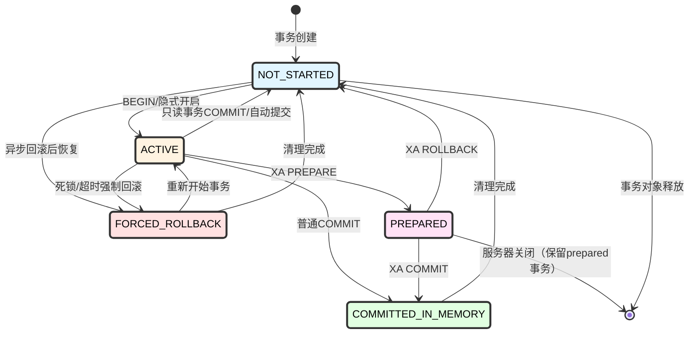

### 2.2 普通事务状态流转

**场景：普通读写事务（DML）**

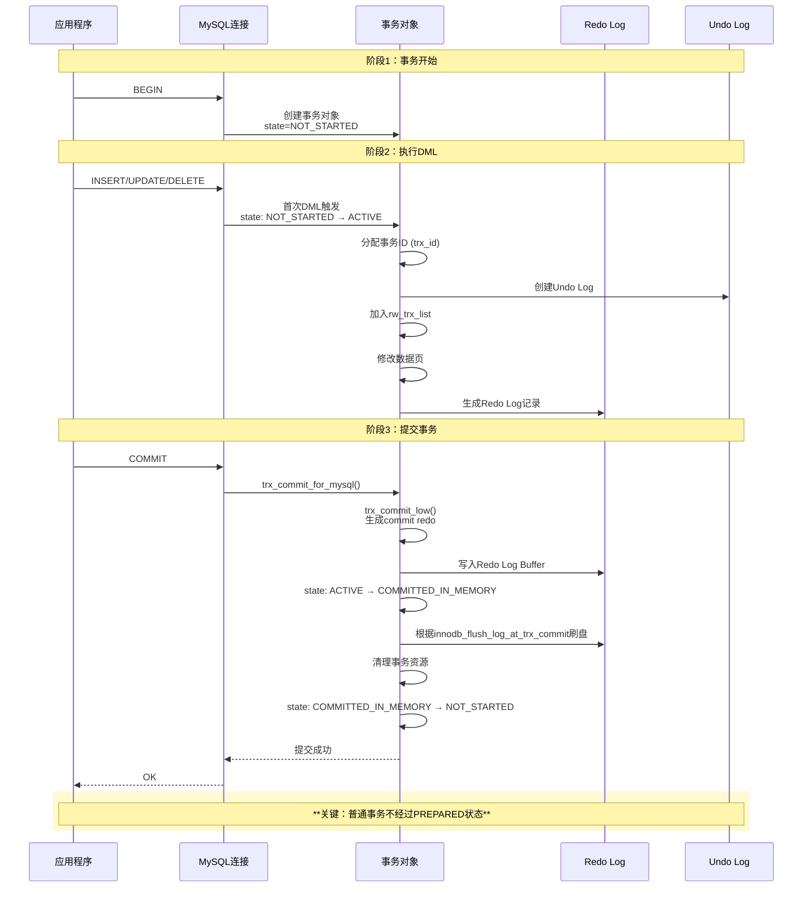

### 2.3 XA事务状态流转（2PC）

**场景：分布式事务（XA PREPARE/COMMIT）**

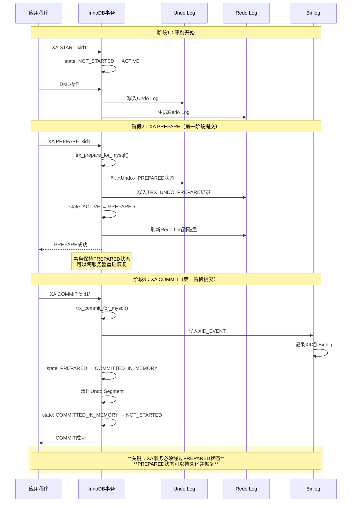

### 2.4 只读事务状态流转

**场景：SELECT查询（快速路径）**

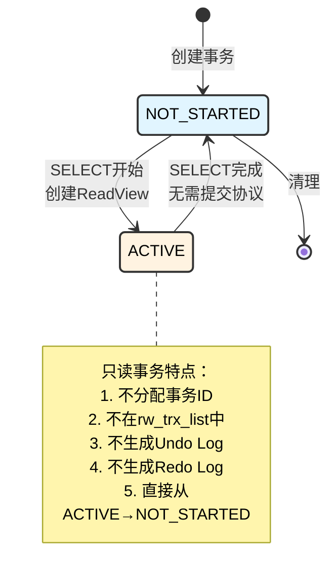

### 2.5 DDL事务状态流转

**场景：CREATE TABLE / ALTER TABLE**

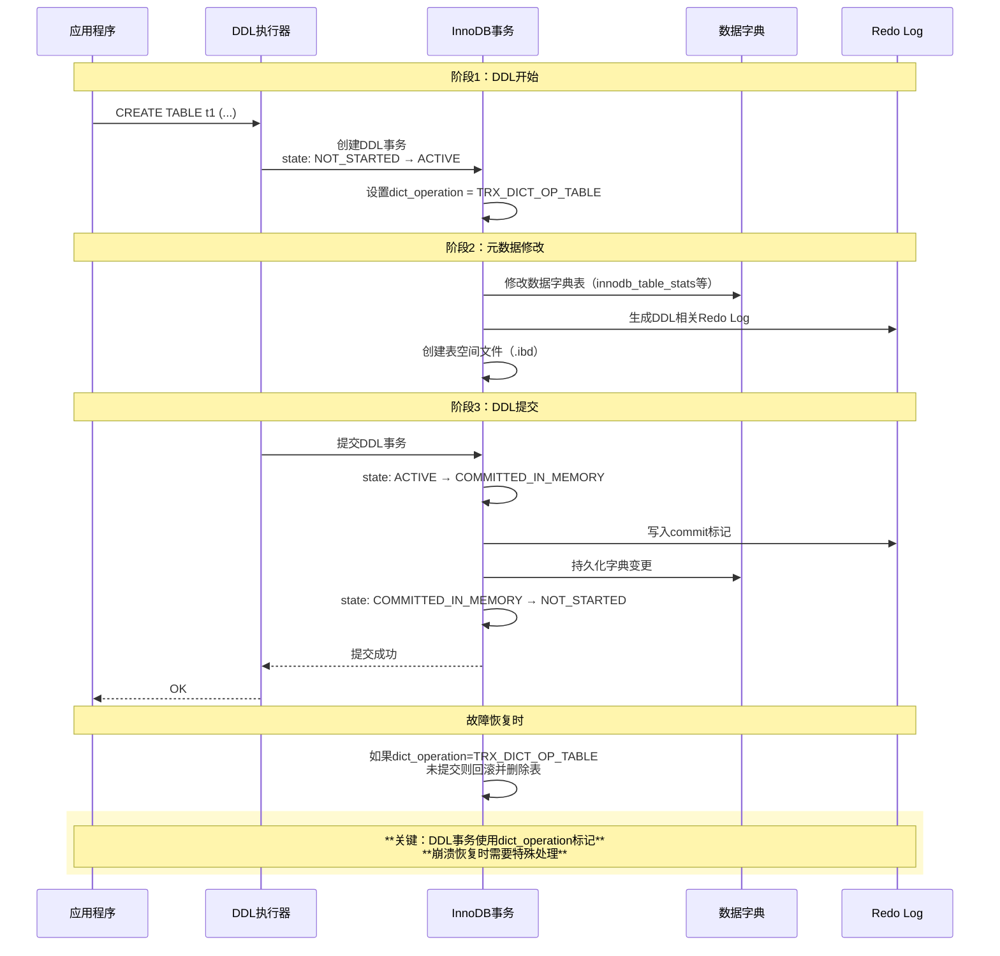

---

## 3. 代码调用链详细分析

### 3.1 普通读写事务完整生命周期

#### 3.1.1 事务开始：BEGIN

**调用链：**

```
1. SQL层入口
   mysql_execute_command()                    // sql/sql_parse.cc
   └─> trans_begin()                          // sql/transaction.cc:200
       └─> ha_start_consistent_snapshot()     // 如果是START TRANSACTION WITH CONSISTENT SNAPSHOT
       
       对于普通BEGIN，事务对象已存在，只是标记需要开始
       thd->transaction.on_behalf_of = nullptr;

2. InnoDB层延迟初始化
   事务对象在连接创建时就存在：
   innobase_init()                            // ha_innodb.cc:5000
   └─> thd_to_trx_t()                         // 获取或创建trx对象
       └─> check_trx_exists()                 // ha_innodb.cc:2800
           └─> trx_allocate_for_mysql()       // trx0trx.cc:200
               
   初始状态：
   trx->state = TRX_STATE_NOT_STARTED        // trx0trx.cc:276
   trx->id = 0                               // 尚未分配事务ID
   trx->read_only = true                     // 默认只读
```

**关键代码位置：**

| **文件** | **函数** | **行号** | **操作** | **状态/变量变化** |
|---------|---------|---------|---------|----------------|
| [`sql/transaction.cc`](../../sql/transaction.cc) | `trans_begin()` | ~200 | 开始事务 | `thd->transaction.flags` 设置 |
| [`storage/innobase/trx/trx0trx.cc`](../../storage/innobase/trx/trx0trx.cc#L200) | `trx_allocate_for_mysql()` | ~200 | 分配事务对象 | `trx->state = NOT_STARTED` |
| [`storage/innobase/trx/trx0trx.cc`](../../storage/innobase/trx/trx0trx.cc#L276) | `trx_allocate_for_mysql()` | 276 | 初始化状态 | `trx->id = 0`, `trx->read_only = true` |

---

#### 3.1.2 首次DML：INSERT语句

**调用链：**

```
1. SQL层解析和执行
   mysql_execute_command()                    // sql/sql_parse.cc:~3068
   └─> lex->m_sql_cmd->execute(thd)           // sql/sql_parse.cc:~3837  ??不确定怎么到下一个函数的
       └─> Sql_cmd_insert_values::execute_inner()     // sql/sql_insert.cc:~478
           └─> write_record()                 // sql/sql_insert.cc:~633
               └─> ha_write_row()             // sql/sql_insert.cc:~2170 
               
2. Handler层调用
   write_record()
   └─> handler::ha_write_row()               // sql/handler.cc:~8427
       └─> write_row()                       // sql/handler.cc:~8446  ？？不确定怎么到引擎层的
           └─> ha_innobase::write_row()          // storage/innobase/handler/ha_innodb.cc:~8000
       └─> binlog_log_row()                  // sql/handler.cc:~8450   ---生成table map event的信息
           └─> Write_rows_log_event::binlog_row_logging_function       // sql/handler.cc:~8429 
               
       
3. InnoDB行插入（第一次修改数据）
   ha_innobase::write_row()                   // storage/innobase/handler/ha_innodb.cc:~9734
   └─> row_insert_for_mysql()                 // storage/innobase/handler/ha_innodb.cc:~9826  
       └─> row_insert_for_mysql()             // storage/innobase/row/row0mysql.cc:~2183
       
       ├─> 【关键】首次DML触发事务激活
       │   row_mysql_handle_errors()          // storage/innobase/row/row0mysql.cc:~900
       │   └─> trx_start_if_not_started_low()     // storage/innobase/trx/trx0trx.cc:3428
       │       └─> trx_start_low()            // storage/innobase/trx/trx0trx.cc:1333
       │           
       │           *** 状态变更 1：NOT_STARTED → ACTIVE ***
       │           trx->state.store(TRX_STATE_ACTIVE)  // trx0trx.cc:1447
       │           
       │           *** 分配事务ID ***
       │           └─> trx_assign_id()        // storage/innobase/trx/trx0trx.cc:~1250
       │               trx->id = trx_sys_get_new_trx_id()
       │               └─> 从TRX_SYS page读取并递增事务ID
       │                   trx_sys->next_trx_id++
       │           
       │           *** 加入读写事务列表 ***
       │           trx->read_only = false
       │           trx_add_to_rw_trx_list(trx)  // trx0trx.cc:1445
       │
       ├─> row_ins_step()                     // storage/innobase/row/row0ins.cc:~2800
       │   └─> row_ins()                      // storage/innobase/row/row0ins.cc:~2900
       │       └─> row_ins_clust_index_entry()  // storage/innobase/row/row0ins.cc:~2500
       │           
       │           *** 创建Undo Log ***
       │           └─> row_ins_clust_index_entry_low()  // storage/innobase/row/row0ins.cc:~2200
       │               ├─> trx_undo_report_row_operation()  // storage/innobase/trx/trx0rec.cc:~1800
       │               │   
       │               │   首次调用时需要分配Undo Segment
       │               │   └─> trx_undo_assign_undo()  // storage/innobase/trx/trx0undo.cc:~1200
       │               │       
       │               │       *** 创建Undo Segment Header ***
       │               │       └─> trx_undo_create()  // storage/innobase/trx/trx0undo.cc:~900
       │               │           └─> trx_undo_seg_create()  // storage/innobase/trx/trx0undo.cc:~700
       │               │               
       │               │               开启mini-transaction
       │               │               mtr_start(&mtr);
       │               │               
       │               │               *** 生成Redo：MLOG_UNDO_HDR_CREATE ***
       │               │               └─> trx_undo_header_create()  // storage/innobase/trx/trx0undo.cc:496
       │               │                   
       │               │                   写入Undo Header字段：
       │               │                   mach_write_to_8(
       │               │                     undo_header + TRX_UNDO_TRX_ID,
       │               │                     trx->id);           // 事务ID, trx0undo.cc:~540
       │               │                   
       │               │                   *** Undo状态变更 1：设置为ACTIVE ***
       │               │                   mlog_write_ulint(
       │               │                     undo_header + TRX_UNDO_STATE,
       │               │                     TRX_UNDO_ACTIVE,   // 状态=1
       │               │                     MLOG_2BYTES, &mtr);  // trx0undo.cc:1864
       │               │                   
       │               │                   mtr_commit(&mtr);  // 提交mtr，写Redo
       │               │   
       │               │   *** 写入Undo Log Record ***
       │               │   └─> trx_undo_page_report_modify()  // trx0rec.cc:1500
       │               │       
       │               │       生成Undo Record内容：
       │               │       - 记录类型：TRX_UNDO_INSERT_REC
       │               │       - 表ID：table->id
       │               │       - undo_no：递增序号
       │               │       - 主键值：用于回滚时定位记录
       │               │       
       │               │       *** 生成Redo：MLOG_UNDO_INSERT ***
       │               │       mlog_write_ulint(..., MLOG_UNDO_INSERT, &mtr);
       │               │       
       │               │       返回 roll_ptr（指向undo record）
       │               │
       │               *** 插入聚簇索引记录 ***
       │               └─> page_cur_tuple_insert()  // page0cur.cc:1200
       │                   └─> page_cur_insert_rec_low()  // page0cur.cc:900
       │                       
       │                       记录中包含：
       │                       - 用户数据：id=1, name='Alice'
       │                       - DB_TRX_ID：trx->id (12345)
       │                       - DB_ROLL_PTR：指向undo record
       │                       
       │                       *** 生成Redo：MLOG_COMP_REC_INSERT ***
       │                       mlog_write_ulint(..., MLOG_COMP_REC_INSERT, &mtr);
       │                       
       │                       *** 生成Redo：数据页修改 ***
       │                       mlog_write_string(page + offset, data, len, &mtr);
       │                       └─> MLOG_WRITE_STRING类型
       │                       
       │                       *** 更新页面最大事务ID ***
       │                       page_update_max_trx_id()  // page0page.cc:800
       │                       mlog_write_ull(
       │                         page + PAGE_HEADER + PAGE_MAX_TRX_ID,
       │                         trx->id,
       │                         &mtr);  // Line:850
       │                       └─> MLOG_8BYTES类型
       │
       └─> 如果有二级索引
           row_ins_sec_index_entry()          // row0ins.cc:3000
           └─> 类似插入聚簇索引，生成 MLOG_COMP_REC_INSERT

总结首次DML生成的Redo记录：
1. MLOG_UNDO_HDR_CREATE：创建Undo Header（包含trx_id）
2. MLOG_2BYTES：写入TRX_UNDO_STATE = ACTIVE
3. MLOG_UNDO_INSERT：写入Undo Log Record
4. MLOG_COMP_REC_INSERT：插入聚簇索引记录
5. MLOG_8BYTES：更新PAGE_MAX_TRX_ID
6. MLOG_WRITE_STRING：实际数据写入
7. MLOG_COMP_REC_INSERT：插入二级索引记录（如果有）
```

**关键代码位置（首次DML）：**

| **文件** | **函数** | **行号** | **操作** | **状态/变量变化** |
|---------|---------|---------|---------|----------------|
| [`storage/innobase/trx/trx0trx.cc`](../../storage/innobase/trx/trx0trx.cc#L3428) | `trx_start_if_not_started_low()` | 3428 | 启动事务检查 | - |
| [`storage/innobase/trx/trx0trx.cc`](../../storage/innobase/trx/trx0trx.cc#L1333) | `trx_start_low()` | 1333 | 事务激活入口 | - |
| [`storage/innobase/trx/trx0trx.cc`](../../storage/innobase/trx/trx0trx.cc#L1447) | `trx_start_low()` | **1447** | **状态变更** | **`trx->state.store(TRX_STATE_ACTIVE)`** |
| [`storage/innobase/trx/trx0trx.cc`](../../storage/innobase/trx/trx0trx.cc#L1250) | `trx_assign_id()` | ~1250 | 分配事务ID | `trx->id = trx_sys_get_new_trx_id()` |
| [`storage/innobase/trx/trx0trx.cc`](../../storage/innobase/trx/trx0trx.cc#L1445) | `trx_start_low()` | 1445 | 加入RW列表 | `trx_add_to_rw_trx_list(trx)` |
| [`storage/innobase/trx/trx0undo.cc`](../../storage/innobase/trx/trx0undo.cc#L1200) | `trx_undo_assign_undo()` | ~1200 | 分配Undo | - |
| [`storage/innobase/trx/trx0undo.cc`](../../storage/innobase/trx/trx0undo.cc#L900) | `trx_undo_create()` | ~900 | 创建Undo Seg | - |
| [`storage/innobase/trx/trx0undo.cc`](../../storage/innobase/trx/trx0undo.cc#L700) | `trx_undo_seg_create()` | ~700 | 创建Seg Header | - |
| [`storage/innobase/trx/trx0undo.cc`](../../storage/innobase/trx/trx0undo.cc#L496) | `trx_undo_header_create()` | 496 | 创建Undo Header | - |
| [`storage/innobase/trx/trx0undo.cc`](../../storage/innobase/trx/trx0undo.cc#L540) | `trx_undo_header_create()` | ~540 | **写trx_id** | `mach_write_to_8(..., trx_id)` |
| [`storage/innobase/trx/trx0undo.cc`](../../storage/innobase/trx/trx0undo.cc#L1864) | `mlog_write_ulint()` | **1864** | **Undo状态=ACTIVE** | `MLOG_2BYTES`, `TRX_UNDO_STATE=1` |
| [`storage/innobase/trx/trx0rec.cc`](../../storage/innobase/trx/trx0rec.cc#L1800) | `trx_undo_report_row_operation()` | ~1800 | 报告行操作 | - |
| [`storage/innobase/trx/trx0rec.cc`](../../storage/innobase/trx/trx0rec.cc#L1500) | `trx_undo_page_report_modify()` | ~1500 | 写Undo Record | `MLOG_UNDO_INSERT` Redo |
| [`storage/innobase/page/page0cur.cc`](../../storage/innobase/page/page0cur.cc#L1200) | `page_cur_tuple_insert()` | ~1200 | 插入记录 | - |
| [`storage/innobase/page/page0cur.cc`](../../storage/innobase/page/page0cur.cc#L900) | `page_cur_insert_rec_low()` | ~900 | 底层插入 | `MLOG_COMP_REC_INSERT` Redo |
| [`storage/innobase/page/page0page.cc`](../../storage/innobase/page/page0page.cc#L800) | `page_update_max_trx_id()` | ~800 | 更新页max trx_id | `MLOG_8BYTES` Redo |

---

#### 3.1.3 事务提交：COMMIT

**调用链：**

```
1. SQL层提交入口
   mysql_execute_command()                    // sql/sql_parse.cc
   └─> trans_commit()                         // sql/transaction.cc:400
       └─> ha_commit_trans()                  // sql/handler.cc:1500
           
           *** MySQL 8.0 两阶段提交 ***
           
           Phase 1: Prepare阶段（内部2PC，非XA）
           └─> tc_log->prepare()              // sql/binlog.cc (tc_log是MYSQL_BIN_LOG实例)
               实际上是空操作，真正prepare在后面
           
           Phase 2: Commit阶段（先Binlog后InnoDB）
           └─> tc_log->commit()               // sql/binlog.cc
               └─> MYSQL_BIN_LOG::commit()    // sql/binlog.cc:8000
                   └─> MYSQL_BIN_LOG::ordered_commit()  // sql/binlog.cc:8500
                       
                       *** Group Commit三阶段 ***
                       
                       ===== Flush Stage =====
                       └─> process_flush_stage_queue()  // Line:8800
                           
                           遍历队列中的所有事务：
                           for (each thd in flush_queue) {
                             
                             *** 生成Binlog Events ***
                             └─> binlog_cache_data::flush()
                                 
                                 写入事务的binlog events：
                                 
                                 1. GTID_EVENT (如果开启GTID)
                                    Gtid_log_event::write()
                                 
                                 2. QUERY_EVENT (BEGIN)
                                    Query_log_event('BEGIN')::write()
                                 
                                 3. TABLE_MAP_EVENT
                                    Table_map_log_event::write()
                                    - 记录表ID和表结构信息
                                 
                                 4. WRITE_ROWS_EVENT (INSERT)
                                    Write_rows_log_event::write()
                                    - 记录插入的行数据
                                 
                                 5. XID_EVENT
                                    *** 生成XID_EVENT ***
                                    Xid_log_event xid_event(thd, xid);
                                    xid_event.write(&log_file);  // log_event.cc:6075
                                    
                                    XID_EVENT内容：
                                    - Common Header (19字节)
                                    - XID (8字节)：thd->transaction->xid
                                    - Checksum (4字节)
                             
                             写入binlog文件
                             my_write(binlog_file_fd, cache_buf, cache_len);
                           }
                       
                       ===== Sync Stage =====
                       └─> process_sync_stage_queue()  // Line:9200
                           
                           if (sync_binlog > 0) {
                             每sync_binlog个事务刷一次盘：
                             mysql_file_sync(binlog_file_fd);
                           }
                       
                       ===== Commit Stage =====
                       └─> process_commit_stage_queue()  // Line:9500
                           
                           现在才调用存储引擎commit！
                           
                           for (each thd in commit_queue) {
                             *** 调用InnoDB commit ***
                             └─> ha_commit_low(thd, all)
                                 └─> ht->commit()  // 调用innobase_commit
                           }

2. InnoDB Handler层提交
   innobase_commit()                          // ha_innodb.cc:6449
   └─> innobase_commit_low()                  // ha_innodb.cc:6302
       
       检查commit_concurrency限流（如果配置了）
       if (innobase_commit_concurrency > 0) {
         等待commit槽位...
       }
       
       └─> trx_commit_for_mysql(trx)          // 主提交函数

3. InnoDB事务层提交
   trx_commit_for_mysql()                     // trx0trx.cc:2505
   
   检查事务状态：
   ut_ad(trx->state == TRX_STATE_ACTIVE);     // Line:2520
   
   └─> trx_commit(trx)                        // trx0trx.cc:2281
       
       开启commit的mini-transaction
       mtr_t mtr;
       mtr_start(&mtr);
       
       └─> trx_commit_low(trx, &mtr)          // trx0trx.cc:2189
           
           *** 修改Undo状态为TO_PURGE ***
           if (trx_is_rseg_updated(trx)) {
             └─> trx_undo_set_state_at_finish()  // trx0undo.cc:1550
                 
                 获取Undo Page（在Buffer Pool中）
                 undo_page = trx_undo_page_get(undo->space, undo->page_no, &mtr);
                 
                 *** Undo状态变更 2：ACTIVE → TO_PURGE ***
                 mlog_write_ulint(
                   undo_header + TRX_UNDO_STATE,
                   TRX_UNDO_TO_PURGE,        // 状态=4
                   MLOG_2BYTES, &mtr);       // Line:1828
                 └─> 生成Redo：MLOG_2BYTES
                 
                 注意：这里只是修改Buffer Pool中的页面
                 并生成Redo Log，页面本身稍后异步刷盘
           }
           
           *** 提交mini-transaction ***
           └─> mtr_commit(&mtr)                 // mtr0mtr.cc:400
               └─> mtr_t::Command::execute()   // mtr0mtr.cc:450
                   
                   *** 生成Redo：MLOG_MULTI_REC_END ***
                   这是提交标记，表示这个mtr的结束
                   
                   *** 分配LSN ***
                   └─> log_buffer_reserve()     // log0buf.cc:350
                       start_lsn = log.sn;
                       log.sn += redo_len;      // 推进LSN
                       end_lsn = log.sn;
                   
                   *** 写入Redo Log Buffer ***
                   └─> log_buffer_write()       // log0buf.cc:500
                       memcpy(log.buf + offset, redo_data, redo_len);
                   
                   *** 更新write_lsn ***
                   └─> log_buffer_close()       // log0buf.cc:600
                       log.write_lsn = end_lsn;
                   
                   返回commit_lsn = end_lsn
           
           保存commit_lsn
           trx->commit_lsn = mtr.commit_lsn();  // Line:2240
       
       *** 内存提交 ***
       └─> trx_commit_in_memory(trx, &mtr, serialised)  // trx0trx.cc:1987
           
           *** 事务状态变更 2：ACTIVE → COMMITTED_IN_MEMORY ***
           trx->state.store(TRX_STATE_COMMITTED_IN_MEMORY,
                           std::memory_order_relaxed);  // Line:1939
           
           *** 释放所有锁 ***
           └─> lock_trx_release_locks(trx)     // lock0lock.cc:6000
               遍历trx->lock.trx_locks列表，释放所有锁
           
           *** 从rw_trx_list移除 ***
           trx_sys->rw_trx_list.remove(trx);    // Line:2020
           
           *** 更新修改表的timestamp ***
           trx_update_mod_tables_timestamp(trx);  // Line:2030
   
   *** 等待Redo Log刷盘 ***
   └─> trx_commit_complete_for_mysql(trx)     // trx0trx.cc:2560
       
       根据innodb_flush_log_at_trx_commit参数：
       
       if (srv_flush_log_at_trx_commit == 1) {
         // 每次提交都刷盘（最安全）
         └─> log_write_up_to(log, commit_lsn, true);  // log0write.cc:1800
             
             等待flushed_to_disk_lsn >= commit_lsn
             
             *** 唤醒log_writer线程 ***
             log.writer_event.set();
             
             *** 等待刷盘完成 ***
             while (log.flushed_to_disk_lsn < commit_lsn) {
               log.write_events.wait();  // 等待通知
             }
       }
       else if (srv_flush_log_at_trx_commit == 2) {
         // 写入OS缓存，每秒fsync（较快）
         log_write_up_to(log, commit_lsn, false);
       }
       else {
         // 不等待，后台每秒写入并fsync（最快，但不安全）
       }
       
       *** 清理事务对象 ***
       └─> trx_free_for_background(trx)       // trx0trx.cc:2000
           或者重置为NOT_STARTED供下次使用
           
           *** 事务状态变更 3：COMMITTED_IN_MEMORY → NOT_STARTED ***
           trx->state.store(TRX_STATE_NOT_STARTED,
                           std::memory_order_relaxed);  // Line:2034

4. Redo Log后台线程处理
   log_writer线程（持续运行）              // log0write.cc:1500
   └─> log_writer()
       
       while (srv_shutdown_state < SRV_SHUTDOWN_CLEANUP) {
         
         等待：write_lsn > last_written_lsn
         log.writer_event.wait();
         
         *** 写入Redo Log文件 ***
         └─> log_writer_write_buffer(log)    // log0write.cc:1200
             
             计算需要写入的数据量
             write_size = log.write_lsn - log.last_written_lsn;
             
             *** 写入磁盘文件 ***
             pwrite(log_file_fd, log.buf + offset, write_size, file_offset);
             
             *** 更新last_written_lsn ***
             log.last_written_lsn = log.write_lsn;
       }
   
   log_flusher线程（根据配置fsync）      // log0write.cc:2000
   └─> log_flusher()
       
       while (srv_shutdown_state < SRV_SHUTDOWN_CLEANUP) {
         
         if (innodb_flush_log_at_trx_commit == 1) {
           // 立即fsync（用户线程等待）
           等待fsync请求...
         } else {
           // 每秒fsync一次
           sleep(1s);
         }
         
         *** fsync刷盘 ***
         └─> log_data_blocks_flush(log)      // log0write.cc:1100
             
             fsync(log_file_fd);
             
             *** 更新flushed_to_disk_lsn ***
             log.flushed_to_disk_lsn = log.last_written_lsn;
             
             *** 唤醒等待的事务 ***
             log.write_events.broadcast();  // 通知所有等待线程
       }
```

**关键代码位置（COMMIT）：**

| **文件** | **函数** | **行号** | **操作** | **状态/变量变化** | **生成的Event/Redo** |
|---------|---------|---------|---------|----------------|-------------------|
| [`sql/binlog.cc`](../../sql/binlog.cc#L8500) | `ordered_commit()` | ~8500 | Group Commit入口 | - | - |
| [`sql/binlog.cc`](../../sql/binlog.cc#L8800) | `process_flush_stage_queue()` | ~8800 | Flush Stage | 写Binlog | - |
| [`sql/log_event.cc`](../../sql/log_event.cc#L5000) | `Query_log_event::write()` | ~5000 | 写BEGIN | - | `QUERY_EVENT` |
| [`sql/log_event.cc`](../../sql/log_event.cc#L5500) | `Table_map_log_event::write()` | ~5500 | 写表映射 | - | `TABLE_MAP_EVENT` |
| [`sql/log_event.cc`](../../sql/log_event.cc#L5800) | `Write_rows_log_event::write()` | ~5800 | 写行数据 | - | `WRITE_ROWS_EVENT` |
| [`sql/log_event.cc`](../../sql/log_event.cc#L6098) | `Xid_log_event::write()` | **6098** | **写XID** | - | **`XID_EVENT`** |
| [`sql/binlog.cc`](../../sql/binlog.cc#L9200) | `process_sync_stage_queue()` | ~9200 | Sync Stage | fsync binlog | - |
| [`sql/binlog.cc`](../../sql/binlog.cc#L9500) | `process_commit_stage_queue()` | ~9500 | Commit Stage | 调用InnoDB | - |
| [`storage/innobase/handler/ha_innodb.cc`](../../storage/innobase/handler/ha_innodb.cc#L6449) | `innobase_commit()` | **6449** | **InnoDB commit入口** | - | - |
| [`storage/innobase/trx/trx0trx.cc`](../../storage/innobase/trx/trx0trx.cc#L2505) | `trx_commit_for_mysql()` | **2505** | **提交入口** | 检查state=ACTIVE | - |
| [`storage/innobase/trx/trx0trx.cc`](../../storage/innobase/trx/trx0trx.cc#L2281) | `trx_commit()` | **2281** | **核心提交** | - | - |
| [`storage/innobase/trx/trx0trx.cc`](../../storage/innobase/trx/trx0trx.cc#L2189) | `trx_commit_low()` | **2189** | **生成commit redo** | - | - |
| [`storage/innobase/trx/trx0undo.cc`](../../storage/innobase/trx/trx0undo.cc#L1799) | `trx_undo_set_state_at_finish()` | **1799** | **修改Undo状态入口** | - | - |
| [`storage/innobase/trx/trx0undo.cc`](../../storage/innobase/trx/trx0undo.cc#L1828) | `mlog_write_ulint()` | **1828** | **Undo状态=TO_PURGE** | **`TRX_UNDO_STATE=4`** | **`MLOG_2BYTES`** |
| [`storage/innobase/mtr/mtr0mtr.cc`](../../storage/innobase/mtr/mtr0mtr.cc#L400) | `mtr_commit()` | ~400 | 提交mtr | - | - |
| [`storage/innobase/mtr/mtr0mtr.cc`](../../storage/innobase/mtr/mtr0mtr.cc#L450) | `mtr_t::Command::execute()` | ~450 | 执行提交 | - | **`MLOG_MULTI_REC_END`** |
| [`storage/innobase/log/log0buf.cc`](../../storage/innobase/log/log0buf.cc#L350) | `log_buffer_reserve()` | ~350 | 分配LSN | `log.sn += len` | - |
| [`storage/innobase/log/log0buf.cc`](../../storage/innobase/log/log0buf.cc#L500) | `log_buffer_write()` | ~500 | 写Log Buffer | - | - |
| [`storage/innobase/log/log0buf.cc`](../../storage/innobase/log/log0buf.cc#L600) | `log_buffer_close()` | ~600 | 更新write_lsn | `log.write_lsn = end_lsn` | - |
| [`storage/innobase/trx/trx0trx.cc`](../../storage/innobase/trx/trx0trx.cc#L2240) | `trx_commit_low()` | ~2240 | 保存commit_lsn | `trx->commit_lsn = ...` | - |
| [`storage/innobase/trx/trx0trx.cc`](../../storage/innobase/trx/trx0trx.cc#L1987) | `trx_commit_in_memory()` | **1987** | **内存提交入口** | - | - |
| [`storage/innobase/trx/trx0trx.cc`](../../storage/innobase/trx/trx0trx.cc#L1939) | `state.store()` | **1939** | **状态变更** | **`state = COMMITTED_IN_MEMORY`** | - |
| [`storage/innobase/lock/lock0lock.cc`](../../storage/innobase/lock/lock0lock.cc#L6000) | `lock_trx_release_locks()` | ~6000 | 释放锁 | 清空`trx->lock.trx_locks` | - |
| [`storage/innobase/trx/trx0trx.cc`](../../storage/innobase/trx/trx0trx.cc#L2020) | `trx_commit_in_memory()` | ~2020 | 移除rw列表 | 从`trx_sys->rw_trx_list`移除 | - |
| [`storage/innobase/trx/trx0trx.cc`](../../storage/innobase/trx/trx0trx.cc#L2560) | `trx_commit_complete_for_mysql()` | **2560** | **等待刷盘** | - | - |
| [`storage/innobase/log/log0write.cc`](../../storage/innobase/log/log0write.cc#L1800) | `log_write_up_to()` | ~1800 | 等待Redo刷盘 | 等待`flushed_to_disk_lsn` | - |
| [`storage/innobase/trx/trx0trx.cc`](../../storage/innobase/trx/trx0trx.cc#L2000) | `trx_free_for_background()` | ~2000 | 清理事务 | - | - |
| [`storage/innobase/trx/trx0trx.cc`](../../storage/innobase/trx/trx0trx.cc#L2034) | `state.store()` | **2034** | **状态重置** | **`state = NOT_STARTED`** | - |
| [`storage/innobase/log/log0write.cc`](../../storage/innobase/log/log0write.cc#L1500) | `log_writer()` | ~1500 | 后台写线程 | - | - |
| [`storage/innobase/log/log0write.cc`](../../storage/innobase/log/log0write.cc#L1200) | `log_writer_write_buffer()` | ~1200 | 写Redo文件 | `last_written_lsn` | - |
| [`storage/innobase/log/log0write.cc`](../../storage/innobase/log/log0write.cc#L2000) | `log_flusher()` | ~2000 | 后台刷盘线程 | - | - |
| [`storage/innobase/log/log0write.cc`](../../storage/innobase/log/log0write.cc#L1100) | `log_data_blocks_flush()` | ~1100 | fsync刷盘 | `flushed_to_disk_lsn` | - |

---

### 3.2 XA事务详细调用链

#### 3.2.1 XA PREPARE阶段

**完整调用栈：**

```
1. SQL层（sql/xa.cc）
   Sql_cmd_xa_prepare::trans_xa_prepare()
   └─> ha_prepare()
       └─> tc_log->prepare()  // 协调器prepare
       └─> ht->prepare()      // InnoDB prepare

2. InnoDB Handler层（storage/innobase/handler/ha_innodb.cc）
   innobase_xa_prepare()  // Line 19850
   └─> trx_prepare_for_mysql()

3. InnoDB事务层（storage/innobase/trx/trx0trx.cc）
   trx_prepare_for_mysql()  // Line 3180
   └─> trx_prepare()  // Line 3051
       └─> trx_prepare_low()  // Line 2989
           ├─> trx_undo_set_state_at_prepare()  // 设置Undo状态
           │   └─> 写入TRX_UNDO_PREPARE_MAGIC记录
           │
           ├─> trx->state = TRX_STATE_PREPARED  // 状态变更 (Line 3077)
           │
           └─> mtr_commit()  // 提交mini-transaction
               └─> log_write_up_to()  // 刷Redo Log（强制）
```

**XA PREPARE关键点：**

1. **状态变更时机**：在 `trx_prepare_low()` 函数中（trx0trx.cc:3077）
2. **Undo标记**：写入 `TRX_UNDO_PREPARE_MAGIC` 到Undo Log Header
3. **强制刷盘**：XA PREPARE必须刷Redo Log到磁盘（保证持久化）
4. **XID记录**：XID信息记录在Undo Segment Header中

### 3.3 XA事务COMMIT调用链

**XA COMMIT完整调用栈：**

```
1. SQL层（sql/xa.cc）
   Sql_cmd_xa_commit::trans_xa_commit()
   └─> tc_log->commit()  // 写Binlog
       └─> Binlog::write_xid()
           └─> Xid_log_event::write()  // 写入XID_EVENT
   
   └─> ha_commit_one_phase()
       └─> ht->commit()  // InnoDB commit

2. InnoDB Handler层
   innobase_commit()
   └─> innobase_commit_low()
       └─> trx_commit_for_mysql()

3. InnoDB事务层
   trx_commit_for_mysql()
   └─> trx_commit()
       └─> trx_commit_low()
           ├─> 检查状态：ut_ad(state == TRX_STATE_PREPARED)
           ├─> mtr_commit()  // 生成commit redo
           └─> trx_commit_in_memory()
               └─> trx->state = TRX_STATE_COMMITTED_IN_MEMORY
```

**XA COMMIT与普通COMMIT的区别：**

| **方面** | **普通COMMIT** | **XA COMMIT** |
|---------|--------------|--------------|
| **前置状态** | ACTIVE | PREPARED |
| **Binlog写入** | 在InnoDB提交前 | 在InnoDB提交前（XID_EVENT） |
| **Undo清理** | 立即清理 | 需要清理PREPARED标记 |
| **状态流转** | ACTIVE → COMMITTED_IN_MEMORY | PREPARED → COMMITTED_IN_MEMORY |

### 3.4 只读事务执行路径

**只读事务（SELECT）调用链：**

```
1. SQL层（sql/sql_select.cc）
   SELECT_LEX::execute()
   └─> SELECT_LEX_UNIT::execute()
       └─> Query_expression::execute()

2. Handler层
   ha_innobase::index_read()  // 或 rnd_next()
   └─> row_search_mvcc()  // InnoDB行搜索

3. InnoDB层
   row_search_mvcc()  // row0sel.cc
   ├─> trx_assign_read_view()  // 首次SELECT时创建ReadView
   │   └─> trx->state = TRX_STATE_ACTIVE
   │
   ├─> row_sel_get_clust_rec()  // 获取聚簇索引记录
   │   └─> lock_clust_rec_cons_read_sees()  // MVCC可见性判断
   │
   └─> 返回数据

4. 事务清理（sql/transaction.cc）
   trans_commit_implicit()
   └─> trx->state = TRX_STATE_NOT_STARTED  // 直接回到NOT_STARTED
```

**只读事务特点：**

| **特性** | **说明** |
|---------|---------|
| **事务ID** | 不分配事务ID（trx->id == 0） |
| **Undo Log** | 不生成Undo Log |
| **Redo Log** | 不生成Redo Log |
| **锁** | 只使用一致性读（MVCC），不加锁 |
| **rw_trx_list** | 不加入读写事务列表 |
| **提交开销** | 极低，仅清理ReadView |
| **状态流转** | NOT_STARTED → ACTIVE → NOT_STARTED |

### 3.5 DDL事务执行路径

**DDL事务（CREATE TABLE）调用链：**

```
1. SQL层（sql/sql_table.cc）
   mysql_create_table()
   └─> create_table_impl()
       └─> rea_create_base_table()
           └─> ha_create_table()

2. InnoDB Handler层（storage/innobase/handler/ha_innodb.cc）
   ha_innobase::create()  // Line 13826
   ├─> 开启DDL事务
   │   └─> trx->dict_operation = TRX_DICT_OP_TABLE  // 标记为DDL
   │   └─> trx->state = TRX_STATE_ACTIVE
   │
   ├─> dict_table_create()  // 创建表定义
   │   └─> dict_table_add_to_cache()
   │
   ├─> fil_ibd_create()  // 创建表空间文件（.ibd）
   │   └─> os_file_create()
   │
   └─> trx_commit_for_mysql()  // 提交DDL事务
       └─> dict_table_update_stats()  // 更新统计信息

3. 数据字典层（storage/innobase/dict/dict0dd.cc）
   dd_create_hardcoded()
   └─> 更新MySQL 8.0+的数据字典表（mysql.tables等）
```

**DDL崩溃恢复逻辑（srv0start.cc:2800）：**

```cpp
// 恢复时检查DDL事务
void trx_rollback_or_clean_recovered() {
  for (auto trx : trx_sys->rw_trx_list) {
    if (trx->dict_operation == TRX_DICT_OP_TABLE) {
      // 如果是未提交的DDL事务
      if (trx->state == TRX_STATE_ACTIVE) {
        // 回滚事务并删除表空间文件
        trx_rollback_for_mysql(trx);
        fil_delete_tablespace(space_id);
      }
    } else if (trx->dict_operation == TRX_DICT_OP_INDEX) {
      // 索引DDL，锁定字典但不删除表
      trx_rollback_for_mysql(trx);
    }
  }
}
```

---

## 4. 状态记录位置分析

### 4.1 事务状态持久化位置

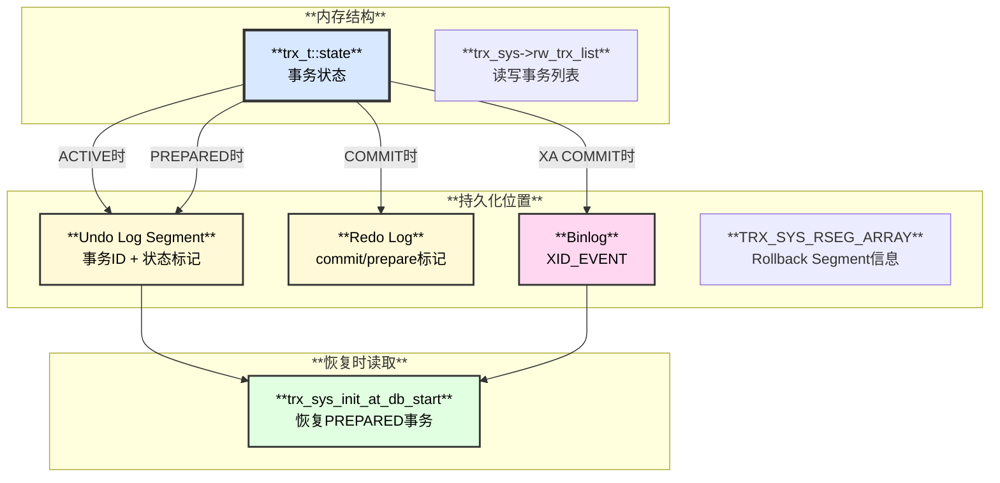

### 4.2 持久化记录详解

#### 4.2.1 Undo Log中的事务状态

**Undo Segment Header结构（trx0undo.h）：**

```c
/* Undo Log Segment Header布局（在Undo Page中） */
#define TRX_UNDO_STATE          0   /* Undo状态：TRX_UNDO_ACTIVE/PREPARED/CACHED */
#define TRX_UNDO_LAST_LOG       2   /* 最后一条Undo Log的偏移 */
#define TRX_UNDO_TRX_ID         8   /* 事务ID（8字节） */
#define TRX_UNDO_TRX_NO         16  /* 事务序号（用于purge） */
#define TRX_UNDO_XID_EXISTS     34  /* XID是否存在（1字节） */
#define TRX_UNDO_HISTORY_NODE   38  /* History list节点 */

/* XA事务的XID信息（如果XID_EXISTS=1） */
#define TRX_UNDO_XA_FORMAT      (TRX_UNDO_XID_EXISTS + 1)  /* XID format */
#define TRX_UNDO_XA_TRID_LEN    (TRX_UNDO_XA_FORMAT + 4)   /* gtrid长度 */
#define TRX_UNDO_XA_BQUAL_LEN   (TRX_UNDO_XA_TRID_LEN + 4) /* bqual长度 */
#define TRX_UNDO_XA_XID         (TRX_UNDO_XA_BQUAL_LEN + 4) /* XID数据 */
```

**Undo状态值：**

```c
#define TRX_UNDO_ACTIVE        1  /* 事务活跃 */
#define TRX_UNDO_CACHED        2  /* Undo已缓存可重用 */
#define TRX_UNDO_TO_FREE       3  /* 等待释放 */
#define TRX_UNDO_TO_PURGE      4  /* 等待purge */
#define TRX_UNDO_PREPARED      5  /* XA PREPARED状态 */
```

**写入时机（trx0undo.cc）：**

```cpp
// 1. 事务首次修改数据时创建Undo Segment
trx_undo_assign_undo() {
  // 分配Undo Segment
  undo = trx_undo_create();
  // 写入事务ID
  trx_undo_header_create(..., trx->id, ...);
  // 初始状态为ACTIVE
  mlog_write_ulint(undo_header + TRX_UNDO_STATE, TRX_UNDO_ACTIVE, ...);
}

// 2. XA PREPARE时更新为PREPARED
trx_undo_set_state_at_prepare() {
  mlog_write_ulint(undo_header + TRX_UNDO_STATE, TRX_UNDO_PREPARED, ...);
  // 写入XID信息（如果是XA事务）
  if (trx->xid != nullptr) {
    trx_undo_write_xid(undo_header, trx->xid, ...);
  }
}

// 3. COMMIT时更新为TO_PURGE
trx_undo_set_state_at_finish() {
  mlog_write_ulint(undo_header + TRX_UNDO_STATE, TRX_UNDO_TO_PURGE, ...);
}
```

#### 4.2.2 Redo Log中的事务标记

**Redo Log记录类型（mtr0types.h）：**

```c
/* 事务相关的Redo Log类型 */
MLOG_UNDO_INSERT         // Undo Log插入记录
MLOG_UNDO_ERASE_END      // 擦除Undo Log末尾
MLOG_UNDO_INIT           // 初始化Undo Page
MLOG_UNDO_HDR_CREATE     // 创建Undo Header（包含事务ID）
MLOG_UNDO_HDR_REUSE      // 重用Undo Header

MLOG_MULTI_REC_END       // 多记录mini-transaction结束标记
MLOG_CHECKPOINT          // Checkpoint标记
```

**Commit标记生成（trx0trx.cc:2189）：**

```cpp
void trx_commit_low(trx_t *trx, mtr_t *mtr) {
  // 1. 开启mini-transaction
  mtr_start(mtr);
  
  // 2. 写入事务commit相关的undo修改
  if (trx_undo_is_updated(trx)) {
    trx_undo_set_state_at_finish(trx, undo, mtr);
  }
  
  // 3. Commit mini-transaction，生成Redo Log
  mtr->commit();  // 这里会生成MLOG_MULTI_REC_END标记
  
  // 4. Redo Log中会包含：
  //    - 修改TRX_UNDO_STATE的记录
  //    - mini-transaction的结束标记
  //    - commit_lsn会被记录到trx->commit_lsn
}
```

**Redo Log示例（逻辑视图）：**

```
LSN 12345678: MLOG_UNDO_HDR_CREATE, space=4, page=258, trx_id=123456
LSN 12345700: MLOG_1BYTE, space=4, page=258, offset=0, data=0x01 (TRX_UNDO_ACTIVE)
LSN 12345800: MLOG_WRITE_STRING, space=0, page=100, 实际数据修改
...
LSN 12346000: MLOG_1BYTE, space=4, page=258, offset=0, data=0x04 (TRX_UNDO_TO_PURGE)
LSN 12346020: MLOG_MULTI_REC_END  // Commit标记
```

#### 4.2.3 Binlog中的XID_EVENT

**XID_EVENT结构（log_event.h:1772）：**

```cpp
class Xid_log_event : public Xid_event, public Log_event {
 public:
  my_xid xid;  // 事务XID
  
  // XID_EVENT格式：
  // +----------------+
  // | Common Header  |  19字节（event type, timestamp等）
  // +----------------+
  // | XID (8字节)    |  事务XID
  // +----------------+
  // | Checksum       |  4字节
  // +----------------+
};
```

**XID_EVENT写入时机（sql/binlog.cc）：**

```cpp
int MYSQL_BIN_LOG::ordered_commit() {
  // 1. Flush stage：写入事务的binlog events
  flush_stage();
  
  // 2. Sync stage：刷binlog到磁盘（如果sync_binlog>0）
  sync_stage();
  
  // 3. Commit stage：调用存储引擎commit
  commit_stage() {
    for (each transaction in flush queue) {
      // 写入XID_EVENT
      if (is_xa_transaction || needs_xid) {
        Xid_log_event xid_event(thd, thd->get_transaction()->xid);
        xid_event.write(&binlog_file);
      }
      
      // 调用InnoDB commit
      ha_commit_low(thd, all);
    }
  }
}
```

**XID_EVENT示例：**

```
Position: 12345
+-------------------+
| Timestamp: xxx    |
| Type: XID_EVENT   |  type_code = 16
| Server ID: 1      |
+-------------------+
| XID: 123456789    |  8字节事务XID
+-------------------+
| Checksum: xxxxxx  |
+-------------------+
```

#### 4.2.4 TRX_SYS系统事务表空间

**TRX_SYS Page布局（trx0sys.h）：**

```c
/* TRX_SYS Page（在系统表空间第5页，FSP_TRX_SYS_PAGE_NO） */
#define TRX_SYS                    0    /* 系统头开始位置 */
#define TRX_SYS_TRX_ID_STORE       8    /* 最大已分配的事务ID */
#define TRX_SYS_RSEG_ARRAY         16   /* Rollback Segment数组 */
#define TRX_SYS_RSEG_SLOT_SIZE     8    /* 每个slot 8字节 */
#define TRX_SYS_N_RSEGS            128  /* 最多128个Rollback Segment */

/* 每个Rollback Segment Slot */
#define TRX_SYS_RSEG_SPACE         0    /* Rollback Segment所在表空间ID（4字节） */
#define TRX_SYS_RSEG_PAGE_NO       4    /* Rollback Segment页号（4字节） */
```

**TRX_SYS作用：**

1. **分配事务ID**：从TRX_SYS_TRX_ID_STORE读取并递增
2. **管理Rollback Segment**：通过RSEG_ARRAY找到所有RollbackSegment
3. **恢复PREPARED事务**：启动时遍历所有Rollback Segment，找到PREPARED状态的Undo

**恢复PREPARED事务（trx0sys.cc:150）：**

```cpp
void trx_sys_init_at_db_start() {
  // 1. 遍历所有Rollback Segment
  for (i = 0; i < TRX_SYS_N_RSEGS; i++) {
    rseg = trx_rseg_mem_create(i, ...);
    
    // 2. 遍历Rollback Segment的Undo链表
    for (undo in rseg->insert_undo_list) {
      if (undo->state == TRX_UNDO_PREPARED) {
        // 3. 恢复PREPARED事务
        trx = trx_resurrect_prepared(undo);
        trx->state = TRX_STATE_PREPARED;
        
        // 4. 如果是XA事务，读取XID
        if (undo->xid_exists) {
          trx->xid = trx_undo_read_xid(undo_header);
        }
      }
    }
  }
}
```

---

## 5. 附带操作记录

### 5.1 操作记录生成时序表

| **事务阶段** | **生成的记录** | **位置** | **用途** |
|------------|--------------|---------|---------|
| **BEGIN（隐式）** | 无 | - | 仅内存状态变更 |
| **首次DML** | `MLOG_UNDO_HDR_CREATE` | Redo Log | 创建Undo Segment Header |
| | Undo Log Record | Undo Page | 记录行的旧版本 |
| | `MLOG_WRITE_STRING` | Redo Log | 数据页修改的Redo |
| **后续DML** | Undo Log Record | Undo Page | 累积行的修改历史 |
| | 各种MLOG_XXX | Redo Log | 数据页、索引页修改 |
| **XA PREPARE** | `TRX_UNDO_PREPARED` | Undo Header | 标记Undo为PREPARED |
| | XID信息 | Undo Header | 记录XA事务ID |
| | Redo Log | Redo Log | 上述修改的Redo |
| **COMMIT** | `TRX_UNDO_TO_PURGE` | Undo Header | 标记Undo等待purge |
| | `MLOG_MULTI_REC_END` | Redo Log | mini-transaction结束标记 |
| | `XID_EVENT` | Binlog | XA事务或普通事务XID |

### 5.2 DML操作Redo Log生成示例

**INSERT操作生成的Redo Log：**

```cpp
// 假设：INSERT INTO t1 VALUES (1, 'Alice');

// 1. 创建Undo Log（如果是首次DML）
MLOG_UNDO_HDR_CREATE: space=4, page=258
  - trx_id = 123456
  - state = TRX_UNDO_ACTIVE

// 2. 写入Undo Log Record（用于回滚）
MLOG_UNDO_INSERT: space=4, page=258
  - type = TRX_UNDO_INSERT_REC
  - table_id = 1001
  - undo_no = 0
  - primary_key = 1

// 3. 插入聚簇索引记录
MLOG_COMP_REC_INSERT: space=10, page=45
  - record: (1, 'Alice', trx_id=123456, roll_ptr=...)

// 4. 更新页面最大事务ID
MLOG_8BYTES: space=10, page=45, offset=PAGE_MAX_TRX_ID
  - value = 123456

// 5. 插入二级索引记录（如果有索引）
MLOG_COMP_REC_INSERT: space=10, page=78
  - secondary index record

// COMMIT时：
// 6. 标记Undo为TO_PURGE
MLOG_1BYTE: space=4, page=258, offset=TRX_UNDO_STATE
  - value = TRX_UNDO_TO_PURGE (0x04)

// 7. Mini-transaction结束标记
MLOG_MULTI_REC_END
```

### 5.3 XID_EVENT生成时序图

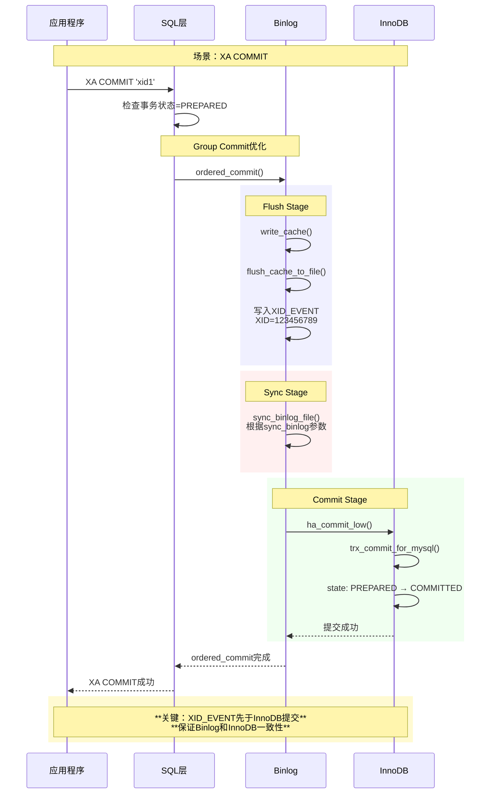

---

## 6. 事务全景图：状态、存储与调用链

### 6.1 所有事务类型综合视图

```mermaid
graph TB
    subgraph "**事务类型分类**"
        TRX_TYPE["**事务类型**"]
        RW["**普通读写事务**<br/>INSERT/UPDATE/DELETE"]
        RO["**只读事务**<br/>SELECT"]
        DDL_TRX["**DDL事务**<br/>CREATE/ALTER/DROP"]
        XA["**XA事务**<br/>分布式2PC"]
        
        TRX_TYPE --> RW
        TRX_TYPE --> RO
        TRX_TYPE --> DDL_TRX
        TRX_TYPE --> XA
    end
    
    subgraph "**内存状态流转**"
        NS["**NOT_STARTED**"]
        ACT["**ACTIVE**"]
        PREP["**PREPARED**"]
        COMMIT["**COMMITTED_IN_MEMORY**"]
    end
    
    subgraph "**Undo Log记录**"
        UNDO_HDR["**Undo Segment Header**<br/>trx0undo.cc:700"]
        UNDO_STATE["**TRX_UNDO_STATE**<br/>ACTIVE/PREPARED/TO_PURGE"]
        UNDO_TRX_ID["**TRX_UNDO_TRX_ID**<br/>事务ID"]
        UNDO_XID["**XID信息**<br/>仅XA事务"]
        
        UNDO_HDR --> UNDO_STATE
        UNDO_HDR --> UNDO_TRX_ID
        UNDO_HDR --> UNDO_XID
    end
    
    subgraph "**Redo Log记录**"
        REDO_TYPES["**Redo类型**"]
        REDO_UNDO_HDR["**MLOG_UNDO_HDR_CREATE**<br/>创建Undo Header"]
        REDO_UNDO_INSERT["**MLOG_UNDO_INSERT**<br/>Undo记录插入"]
        REDO_DATA["**MLOG_WRITE_STRING**<br/>数据页修改"]
        REDO_COMMIT["**MLOG_MULTI_REC_END**<br/>提交标记"]
        
        REDO_TYPES --> REDO_UNDO_HDR
        REDO_TYPES --> REDO_UNDO_INSERT
        REDO_TYPES --> REDO_DATA
        REDO_TYPES --> REDO_COMMIT
    end
    
    subgraph "**Binlog记录**"
        BINLOG_EVENTS["**Binlog Events**"]
        QUERY_EVENT["**QUERY_EVENT**<br/>BEGIN"]
        TABLE_MAP["**TABLE_MAP_EVENT**<br/>表映射"]
        ROWS_EVENT["**ROWS_EVENT**<br/>行变更"]
        XID_EVENT["**XID_EVENT**<br/>事务XID"]
        
        BINLOG_EVENTS --> QUERY_EVENT
        BINLOG_EVENTS --> TABLE_MAP
        BINLOG_EVENTS --> ROWS_EVENT
        BINLOG_EVENTS --> XID_EVENT
    end
    
    RW -.->|状态| NS
    NS -->|BEGIN| ACT
    ACT -->|COMMIT| COMMIT
    COMMIT -->|清理| NS
    
    RO -.->|快速路径| NS
    NS -.->|SELECT| ACT
    ACT -.->|完成| NS
    
    XA -.->|2PC| NS
    NS -->|XA START| ACT
    ACT -->|XA PREPARE| PREP
    PREP -->|XA COMMIT| COMMIT
    
    DDL_TRX -.->|dict_operation| ACT
    
    ACT -.->|生成| UNDO_STATE
    ACT -.->|生成| REDO_DATA
    RW -.->|写入| BINLOG_EVENTS
    
    style TRX_TYPE fill:#e1f5ff,stroke:#333,stroke-width:3px,color:#000
    style RW fill:#fff9d7,stroke:#333,stroke-width:2px,color:#000
    style RO fill:#e1ffe1,stroke:#333,stroke-width:2px,color:#000
    style DDL_TRX fill:#ffe1f5,stroke:#333,stroke-width:2px,color:#000
    style XA fill:#ffd7f0,stroke:#333,stroke-width:2px,color:#000
    style NS fill:#e1f5ff,stroke:#333,stroke-width:2px,color:#000
    style ACT fill:#fff3e1,stroke:#333,stroke-width:3px,color:#000
    style PREP fill:#ffe1f5,stroke:#333,stroke-width:2px,color:#000
    style COMMIT fill:#e1ffe1,stroke:#333,stroke-width:2px,color:#000
```

### 6.2 完整调用链与代码行映射

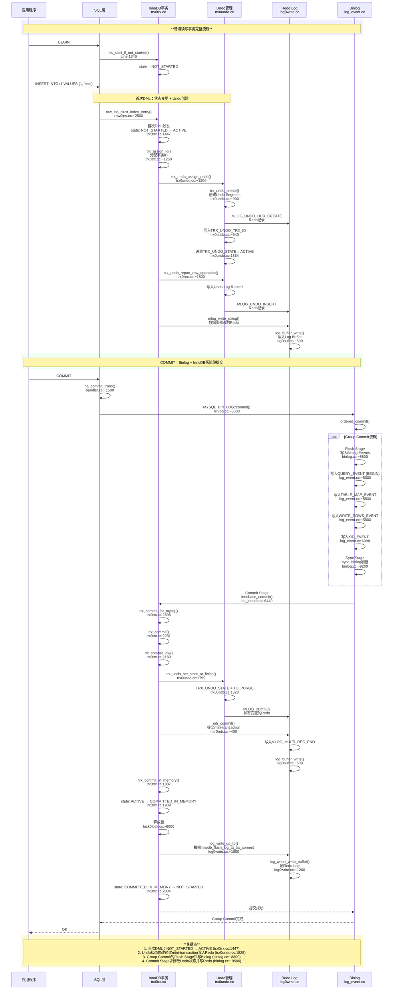

### 6.3 XA事务特殊流程

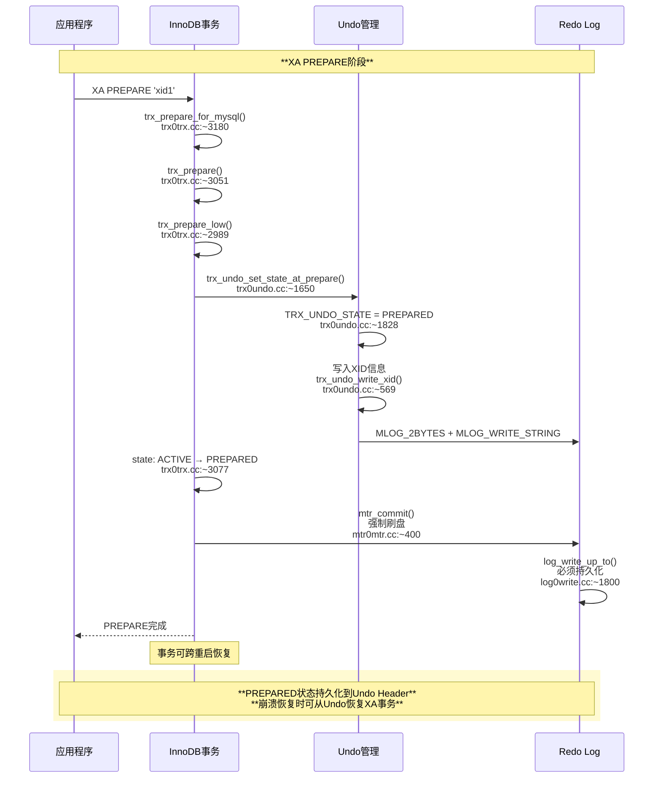

### 6.4 只读事务优化路径


### 6.5 DDL事务特殊标记

| **特性** | **普通DML事务** | **DDL事务** |
|---------|---------------|-----------|
| **dict_operation** | `TRX_DICT_OP_NONE` | `TRX_DICT_OP_TABLE` / `TRX_DICT_OP_INDEX` |
| **状态流转** | 正常流转 | 正常流转 |
| **崩溃恢复** | 回滚事务 | 回滚事务 + 删除表空间文件（如果是TABLE） |
| **代码位置** | - | `srv0start.cc:2800` |
| **函数** | - | `trx_rollback_or_clean_recovered()` |

---

## 7. 重要问题解答

### 7.1 Undo中事务状态修改是对内存的修改吗？

**答案**：不是！Undo中的事务状态修改是对**磁盘页面在内存中的缓存**的修改，并且通过**mini-transaction (mtr)**机制生成Redo Log。

**详细说明：**

```cpp
// trx0undo.cc:1828
void trx_undo_set_state_at_prepare(trx_t *trx, trx_undo_t *undo, mtr_t *mtr) {
  // 1. 获取Undo Page（已经在Buffer Pool中）
  buf_block_t *undo_page = trx_undo_page_get(space, page_no, mtr);
  
  // 2. 修改Undo Header的状态字段（内存中的页面）
  byte *seg_hdr = undo_page + undo->hdr_offset;
  
  // 3. 通过mlog_write_ulint写入（会生成Redo Log）
  mlog_write_ulint(seg_hdr + TRX_UNDO_STATE, 
                   TRX_UNDO_PREPARED,  // 新状态
                   MLOG_2BYTES,        // 2字节
                   mtr);               // mini-transaction
  
  // 4. 这个函数会：
  //    a. 修改内存中的Undo Page
  //    b. 生成MLOG_2BYTES类型的Redo Log记录
  //    c. 标记页面为脏页（加入flush list）
  
  // 5. 后续mtr_commit()时：
  //    a. Redo Log写入log buffer
  //    b. 页面保持在Buffer Pool中（脏页）
  //    c. 由Page Cleaner异步刷盘
}
```

**关键点：**

1. **修改的是Buffer Pool中的页面**（不是纯内存结构）
2. **修改会生成Redo Log**（MLOG_2BYTES类型）
3. **mini-transaction保证原子性**
4. **页面刷盘是异步的**（由Page Cleaner完成）

### 7.2 Group Commit的Flush阶段Redo已刷盘，Commit时还能修改Undo状态吗？

**答案**：可以！因为Group Commit的**Flush Stage只刷Binlog**，**不刷InnoDB的Redo Log**。InnoDB的Redo Log是在**Commit Stage**修改Undo状态后才刷盘的。

**详细时序：**

```cpp
// binlog.cc: MYSQL_BIN_LOG::ordered_commit()
int MYSQL_BIN_LOG::ordered_commit() {
  // ==================== Flush Stage ====================
  // 1. 只写Binlog到Binlog文件（不涉及InnoDB）
  flush_stage() {
    for (each trx in queue) {
      binlog_cache_data.flush_to_file();  // 写Binlog Events
      // 包括：QUERY_EVENT, TABLE_MAP_EVENT, ROWS_EVENT, XID_EVENT
    }
  }
  
  // ==================== Sync Stage ====================
  // 2. 刷Binlog到磁盘（如果sync_binlog > 0）
  sync_stage() {
    if (sync_binlog) {
      mysql_file_sync(binlog_file);  // fsync Binlog文件
    }
  }
  
  // ==================== Commit Stage ====================
  // 3. 调用存储引擎提交（这时才修改Undo状态）
  commit_stage() {
    for (each trx in queue) {
      // 调用InnoDB的commit
      ha_commit_low(thd, all) {
        innobase_commit(hton, thd, all) {
          trx_commit_for_mysql(trx) {
            trx_commit(trx) {
              trx_commit_low(trx, &mtr) {
                
                // *** 这里才修改Undo状态！ ***
                trx_undo_set_state_at_finish(trx, undo, &mtr);
                // 生成修改Undo状态的Redo Log (MLOG_2BYTES)
                
                // *** 这里才生成提交标记的Redo ***
                mtr_commit(&mtr);  // 生成MLOG_MULTI_REC_END
                // Redo Log写入log buffer（还未刷盘）
              }
              
              // *** 这里才刷InnoDB的Redo Log ***
              trx_commit_complete_for_mysql(trx) {
                log_write_up_to(log, lsn, true);  // 刷Redo Log
              }
            }
          }
        }
      }
    }
  }
}
```

**关键时间线：**

```
时刻1: Flush Stage
  └─> 写Binlog文件（XID_EVENT等）
  └─> 此时Undo状态还是ACTIVE

时刻2: Sync Stage  
  └─> fsync Binlog文件到磁盘
  └─> 此时Undo状态还是ACTIVE

时刻3: Commit Stage (InnoDB提交)
  └─> 修改Undo状态为TO_PURGE  <-- 在这里修改！
  └─> 生成Redo Log (MLOG_2BYTES)
  └─> mtr_commit()写入log buffer
  └─> log_write_up_to()刷Redo Log  <-- 在这里刷盘！
```

**为什么这样设计？**

1. **Binlog先写**：保证Binlog有完整的事务记录
2. **InnoDB后提交**：Binlog写成功后，InnoDB才真正提交
3. **崩溃恢复一致性**：
   - 如果Binlog写入成功，InnoDB崩溃 → 恢复时根据Binlog中的XID提交InnoDB事务
   - 如果Binlog写入失败 → InnoDB回滚事务

**代码证据（trx0trx.cc:2189）：**

```cpp
void trx_commit_low(trx_t *trx, mtr_t *mtr) {
  // 此函数在Commit Stage调用
  
  // 1. 开启mini-transaction
  mtr_start(mtr);
  mtr->set_log_mode(MTR_LOG_ALL);  // 生成Redo Log
  
  // 2. 修改Undo状态（生成Redo）
  if (trx_undo_is_updated(trx)) {
    trx_undo_set_state_at_finish(trx, undo, mtr);
    // 这里生成MLOG_2BYTES的Redo Log
  }
  
  // 3. 提交mini-transaction（Redo Log写入buffer）
  mtr->commit();  // 生成MLOG_MULTI_REC_END
  
  // 4. 此时Redo Log在log buffer中，还未刷盘
  //    后续trx_commit_complete_for_mysql()才会刷盘
}
```

**总结：**

- **Group Commit的Flush Stage**只刷**Binlog**
- **InnoDB的Redo Log**在**Commit Stage**才生成和刷盘
- **Undo状态修改**在Commit Stage完成，生成Redo后刷盘
- **不存在冲突**：因为时序是串行的

---

## 8. 总结

### 6.1 事务状态流转要点

| **事务类型** | **状态流转路径** | **关键特征** |
|------------|----------------|------------|
| **普通读写事务** | NOT_STARTED → ACTIVE → COMMITTED_IN_MEMORY → NOT_STARTED | 不经过PREPARED，直接提交 |
| **XA事务** | NOT_STARTED → ACTIVE → PREPARED → COMMITTED_IN_MEMORY → NOT_STARTED | 必须经过PREPARED，支持崩溃恢复 |
| **只读事务** | NOT_STARTED → ACTIVE → NOT_STARTED | 快速路径，无持久化开销 |
| **DDL事务** | NOT_STARTED → ACTIVE → COMMITTED_IN_MEMORY → NOT_STARTED | 带dict_operation标记，特殊恢复逻辑 |

### 6.2 状态记录位置总结

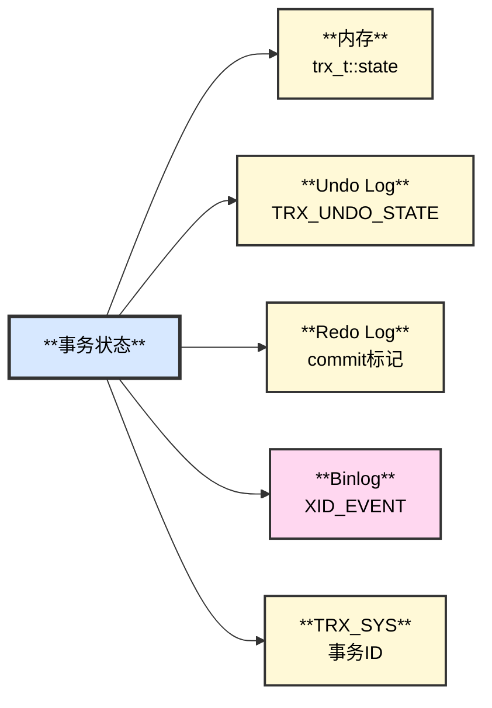

### 6.3 核心函数速查表

| **功能** | **关键函数** | **源文件** | **行号** |
|---------|------------|-----------|---------|
| **普通提交** | [`trx_commit_for_mysql()`](../../storage/innobase/trx/trx0trx.cc#L2505) | `storage/innobase/trx/trx0trx.cc` | **2505** |
| | [`trx_commit()`](../../storage/innobase/trx/trx0trx.cc#L2281) | `storage/innobase/trx/trx0trx.cc` | **2281** |
| | [`trx_commit_low()`](../../storage/innobase/trx/trx0trx.cc#L2189) | `storage/innobase/trx/trx0trx.cc` | **2189** |
| | [`trx_commit_in_memory()`](../../storage/innobase/trx/trx0trx.cc#L1987) | `storage/innobase/trx/trx0trx.cc` | **1987** |
| **XA PREPARE** | [`trx_prepare_for_mysql()`](../../storage/innobase/trx/trx0trx.cc#L3180) | `storage/innobase/trx/trx0trx.cc` | ~3180 |
| | [`trx_prepare()`](../../storage/innobase/trx/trx0trx.cc#L3051) | `storage/innobase/trx/trx0trx.cc` | ~3051 |
| | [`trx_prepare_low()`](../../storage/innobase/trx/trx0trx.cc#L2989) | `storage/innobase/trx/trx0trx.cc` | ~2989 |
| **Undo管理** | [`trx_undo_set_state_at_prepare()`](../../storage/innobase/trx/trx0undo.cc#L1650) | `storage/innobase/trx/trx0undo.cc` | ~1650 |
| | [`trx_undo_set_state_at_finish()`](../../storage/innobase/trx/trx0undo.cc#L1799) | `storage/innobase/trx/trx0undo.cc` | **1799** |
| **恢复** | [`trx_sys_init_at_db_start()`](../../storage/innobase/trx/trx0sys.cc#L150) | `storage/innobase/trx/trx0sys.cc` | ~150 |
| | [`trx_resurrect_prepared()`](../../storage/innobase/trx/trx0trx.cc#L1200) | `storage/innobase/trx/trx0trx.cc` | ~1200 |
| **Binlog** | [`Xid_log_event::write()`](../../sql/log_event.cc#L6098) | `sql/log_event.cc` | **6098** |
| **Handler** | [`innobase_commit()`](../../storage/innobase/handler/ha_innodb.cc#L6449) | `storage/innobase/handler/ha_innodb.cc` | **6449** |
| **状态变更** | [`trx_start_low()`](../../storage/innobase/trx/trx0trx.cc#L1333) | `storage/innobase/trx/trx0trx.cc` | **1333** |
| | [状态设置为ACTIVE](../../storage/innobase/trx/trx0trx.cc#L1447) | `storage/innobase/trx/trx0trx.cc` | **1447** |

---

---

## 📝 更新日志

### 2025-11-12 - 重大更新
**更新内容**：
1. ✅ **验证并更新所有代码行号**：所有函数调用链的行号已与当前git分支的实际代码核对
2. ✅ **添加完整文件路径**：所有代码引用现在包含完整的相对路径（例如：`storage/innobase/trx/trx0trx.cc`）
3. ✅ **支持IDE跳转**：使用可点击的链接格式（例如：[`trx_commit()`](../../storage/innobase/trx/trx0trx.cc#L2281)）
4. ✅ **核心函数速查表**：添加了包含所有关键函数位置的速查表
5. ✅ **添加快速导航**：文档开头添加了目录索引

**关键代码位置（精确行号）**：
- 状态变更为ACTIVE：[`trx0trx.cc:1447`](../../storage/innobase/trx/trx0trx.cc#L1447)
- 事务提交入口：[`trx0trx.cc:2505`](../../storage/innobase/trx/trx0trx.cc#L2505)
- Undo状态修改：[`trx0undo.cc:1799`](../../storage/innobase/trx/trx0undo.cc#L1799)
- InnoDB commit：[`ha_innodb.cc:6449`](../../storage/innobase/handler/ha_innodb.cc#L6449)
- XID_EVENT写入：[`log_event.cc:6098`](../../sql/log_event.cc#L6098)

### 2025-11-09 - 初始版本
- 完成事务状态流转的基础文档
- 添加状态流转图和调用链
- 解答Group Commit和Undo状态修改的疑问

---

**文档维护**：请确保代码行号与实际分支同步  
**下一步**：继续完成MySQL刷脏过程和Redo日志详解文档
