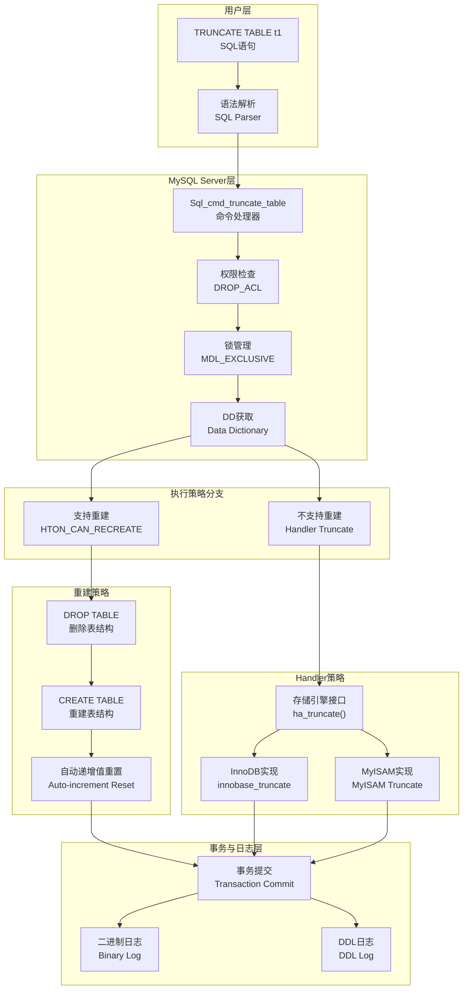
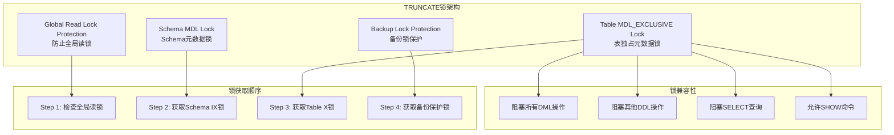
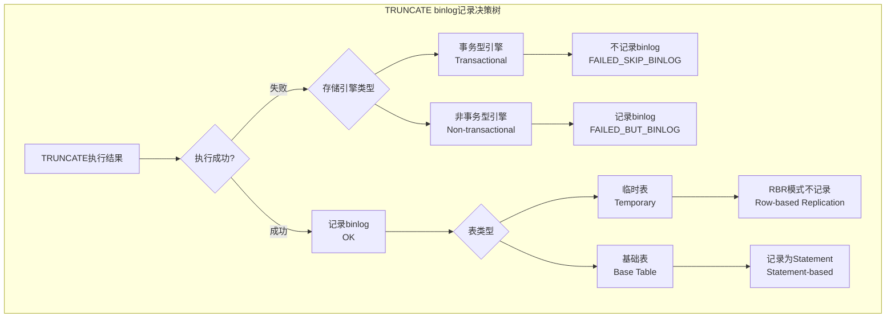
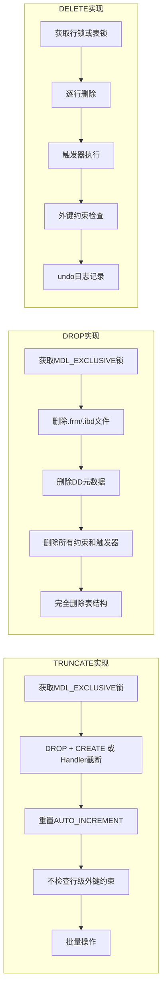
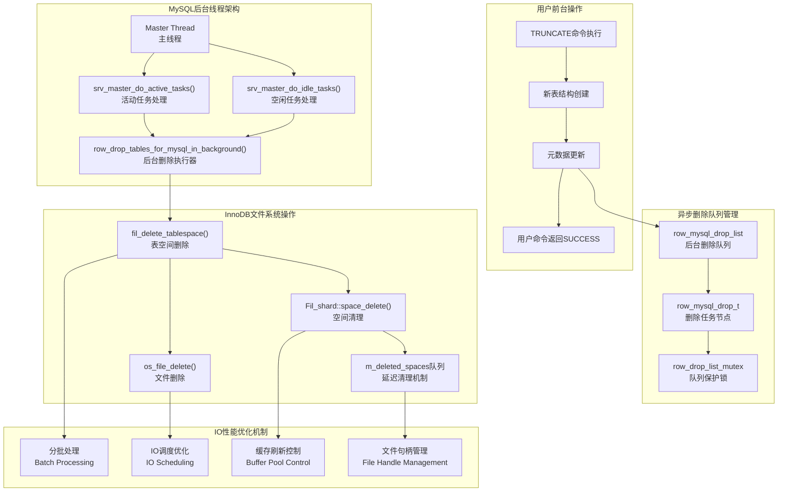
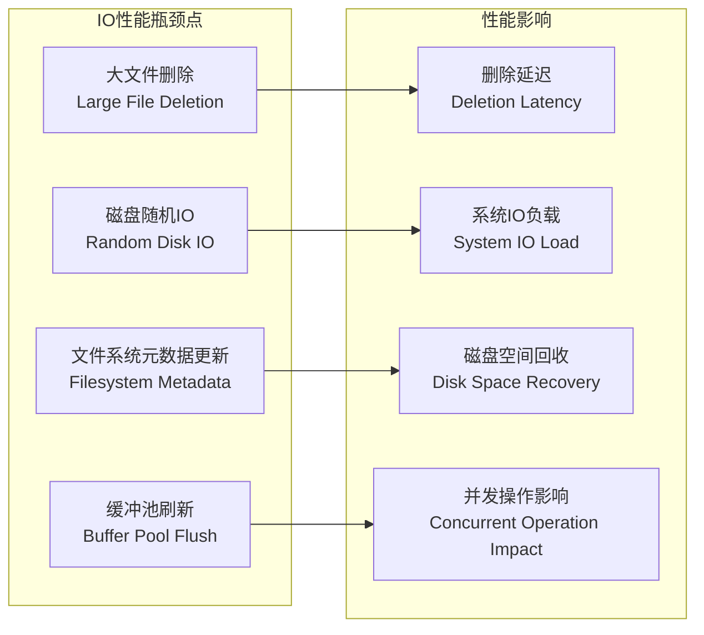
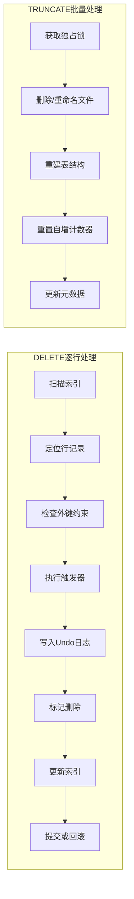
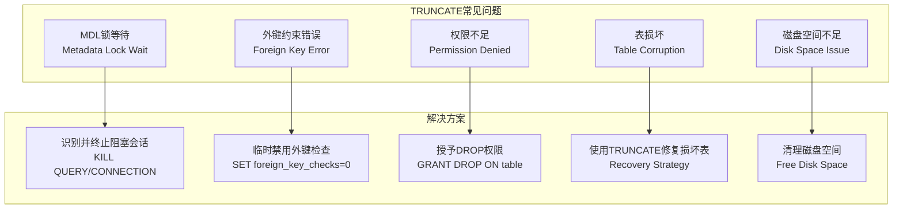

# MySQL 8.4 TRUNCATE命令深度分析

## 概述

TRUNCATE TABLE是MySQL中用于快速清空表数据的DDL命令，它比DELETE FROM table更高效，但与DELETE和DROP各有不同的特点和应用场景。本文档深入分析TRUNCATE命令的内核实现、锁机制、binlog记录策略以及性能优化原理。

## TRUNCATE命令执行架构



## TRUNCATE核心源码分析

### 1. 命令解析与分发

**位置：** `sql/sql_yacc.yy`

```cpp
// TRUNCATE语句的语法解析规则
truncate_stmt:
          TRUNCATE_SYM opt_table table_ident
          {
            $$= NEW_PTN PT_truncate_table_stmt(@$, $3);
          }
        ;

opt_table:
          %empty
        | TABLE_SYM
        ;
```

### 2. TRUNCATE命令执行主入口

**位置：** `sql/sql_truncate.cc`

```cpp
// TRUNCATE命令的主执行函数
bool Sql_cmd_truncate_table::execute(THD *thd) {
  DBUG_TRACE;

  Table_ref *first_table = thd->lex->query_block->get_table_list();
  
  // 检查权限：需要DROP_ACL权限
  if (check_one_table_access(thd, DROP_ACL, first_table)) 
    return true;

  // 根据表类型选择执行策略
  if (is_temporary_table(first_table))
    truncate_temporary(thd, first_table);    // 临时表处理
  else
    truncate_base(thd, first_table);         // 基础表处理

  if (!m_error) my_ok(thd);

  return m_error;
}
```

### 3. 基础表TRUNCATE实现

**位置：** `sql/sql_truncate.cc`

```cpp
void Sql_cmd_truncate_table::truncate_base(THD *thd, Table_ref *table_ref) {
  DBUG_TRACE;
  m_error = true;
  bool binlog_stmt = false;
  bool binlog_is_trans = false;
  handlerton *hton = nullptr;

  // 支持Performance Schema表在只读模式下的TRUNCATE
  if (is_perfschema_db(table_ref->db)) 
    thd->set_skip_readonly_check();

  // 获取数据字典客户端
  dd::Schema_MDL_locker mdl_locker(thd);
  dd::cache::Dictionary_client::Auto_releaser releaser(thd->dd_client());

  // 事务结束时的清理操作
  auto cleanup_guard = create_scope_guard([&]() {
    end_transaction(thd, binlog_stmt, binlog_is_trans);
    cleanup_base(thd, hton);
  });

  // 1. 获取Schema MDL锁
  if (mdl_locker.ensure_locked(table_ref->db)) return;

  // 2. 获取表级MDL_EXCLUSIVE锁
  if (lock_table(thd, table_ref)) return;

  // 3. 通知存储引擎DDL操作开始
  Table_ddl_hton_notification_guard notification_guard{
      thd, &table_ref->mdl_request.key, ha_ddl_type::HA_TRUNCATE_DDL};

  if (notification_guard.notify()) return;

  // 4. 获取表定义
  dd::Table *table_def = nullptr;
  if (thd->dd_client()->acquire_for_modification(
          table_ref->db, table_ref->table_name, &table_def)) {
    return;
  }

  // 5. 验证表存在性
  if (table_def == nullptr || 
      table_def->hidden() == dd::Abstract_table::HT_HIDDEN_SE) {
    my_error(ER_NO_SUCH_TABLE, MYF(0), table_ref->db, table_ref->table_name);
    return;
  }

  // 6. 获取存储引擎信息
  if (dd::table_storage_engine(thd, table_def, &hton)) {
    return;
  }

  // 7. 外键约束检查
  if (!(thd->variables.option_bits & OPTION_NO_FOREIGN_KEY_CHECKS)) {
    if (fk_truncate_illegal_if_parent(thd, table_ref, table_def)) {
      return;
    }
  }

  // 8. 根据存储引擎能力选择执行策略
  if (hton->flags & HTON_CAN_RECREATE) {
    // 策略A: DROP + CREATE (重建策略)
    binlog_is_trans = (hton->flags & HTON_SUPPORTS_ATOMIC_DDL);

    HA_CREATE_INFO create_info;
    char path[FN_REFLEN + 1];
    build_table_filename(path, sizeof(path) - 1, table_ref->db,
                         table_ref->table_name, "", 0);

    // 重建表
    if (ha_create_table(thd, path, table_ref->db, table_ref->table_name,
                        &create_info, nullptr, true, false, table_def) != 0) {
      return;
    }

    m_error = false;
    binlog_stmt = true;
    return;
  } 
  
  // 策略B: Handler接口调用
  const Truncate_result tr = handler_truncate_base(thd, table_ref, table_def);
  
  switch (tr) {
    case Truncate_result::OK:
      m_error = false;
      [[fallthrough]];
    case Truncate_result::FAILED_BUT_BINLOG:
      binlog_stmt = true;
      binlog_is_trans = table_ref->table->file->has_transactions();
      [[fallthrough]];
    case Truncate_result::FAILED_SKIP_BINLOG:
      // 清理表缓存
      close_all_tables_for_name(thd, table_ref->table->s, false, nullptr);
      break;
    case Truncate_result::FAILED_OPEN:
      break;
    default:
      assert(false);
  };
}
```

## TRUNCATE锁机制深度分析

### 1. 锁类型与级别



### 2. 锁获取实现

**位置：** `sql/sql_truncate.cc`

```cpp
bool Sql_cmd_truncate_table::lock_table(THD *thd, Table_ref *table_ref) {
  TABLE *table = nullptr;
  DBUG_TRACE;

  // 验证锁类型设置
  assert(table_ref->lock_descriptor().type == TL_WRITE);
  // TRUNCATE协议要求独占锁
  assert(table_ref->mdl_request.type == MDL_EXCLUSIVE);

  /*
    在执行任何操作之前，获取表的元数据锁。
    不立即使用open_and_lock_tables()是因为我们希望能够
    截断（并重新创建）损坏的表，那些无法完全打开的表。

    MySQL手册记录了TRUNCATE可用于修复损坏的表，
    即无法完全"打开"的表。特别是MySQL手册说：
    只要表格式文件tbl_name.frm是有效的，即使数据或索引
    文件已损坏，也可以使用TRUNCATE TABLE将表重新创建为空表。
  */
  
  if (thd->locked_tables_mode) {
    // 在LOCK TABLES模式下的处理
    if (!(table = find_table_for_mdl_upgrade(thd, table_ref->db,
                                             table_ref->table_name, false)))
      return true;

    // 获取共享备份锁
    if (acquire_shared_backup_lock(thd, thd->variables.lock_wait_timeout))
      return true;

    table_ref->mdl_request.ticket = table->mdl_ticket;

    /*
      存储引擎只能在没有任何地方引用它时才能重新创建或截断表，
      即表缓存中没有缓存的TABLE。
    */
    DEBUG_SYNC(thd, "upgrade_lock_for_truncate");
    
    // 要从缓存中删除表，我们需要独占锁
    if (wait_while_table_is_used(thd, table, HA_EXTRA_FORCE_REOPEN))
      return true;
      
    m_ticket_downgrade = table->mdl_ticket;
    
    // 如果表将被重新创建，则关闭它
    if (table->s->db_type()->flags & HTON_CAN_RECREATE)
      close_all_tables_for_name(thd, table->s, false, nullptr);

    return false;
  }

  // 非LOCK TABLES模式：获取独占锁
  assert(!thd->locked_tables_mode);
  
  if (lock_table_names(thd, table_ref, nullptr,
                       thd->variables.lock_wait_timeout, 0))
    return true;

  // 表已被独占锁定，删除缓存实例
  tdc_remove_table(thd, TDC_RT_REMOVE_ALL, table_ref->db, 
                   table_ref->table_name, false);

  return false;
}
```

### 3. MDL锁兼容性矩阵

| 请求锁类型 | S | SH | SR | SNW | SNRW | X | 当前持有X锁 |
|------------|---|----|----|-----|------|---|-------------|
| S (共享)   | ✓ | ✓  | ✓  | ✓   | ✗    | ✗ | **✗**       |
| SH (共享高优先级) | ✓ | ✓  | ✗  | ✗   | ✗    | ✗ | **✗**       |
| SR (共享读) | ✓ | ✗  | ✓  | ✓   | ✗    | ✗ | **✗**       |
| SNW (共享无写) | ✓ | ✗  | ✓  | ✗   | ✗    | ✗ | **✗**       |
| SNRW (共享无读写) | ✗ | ✗  | ✗  | ✗   | ✗    | ✗ | **✗**       |
| X (独占)   | ✗ | ✗  | ✗  | ✗   | ✗    | ✗ | **✗**       |

**TRUNCATE使用MDL_EXCLUSIVE锁，与所有其他锁类型都不兼容。**

## TRUNCATE与binlog记录机制

### 1. binlog记录策略



### 2. binlog记录实现

**位置：** `sql/sql_truncate.cc`

```cpp
// TRUNCATE结果枚举
enum class Truncate_result {
  OK,                      // 截断成功，可以安全记录binlog
  FAILED_BUT_BINLOG,       // 截断失败但仍需记录binlog（非事务表）
  FAILED_SKIP_BINLOG,      // 截断失败，不记录binlog
  FAILED_OPEN              // 打开表失败，不记录binlog
};

// binlog记录的条件判断
static Truncate_result handler_truncate_base(THD *thd, Table_ref *table_ref,
                                             dd::Table *table_def) {
  int error = table_ref->table->file->ha_truncate(table_def);

  if (error) {
    table_ref->table->file->print_error(error, MYF(0));
    /*
      如果truncate方法未实现，则不记录binlog。
      如果在事务型引擎中截断失败，也不记录binlog。
      只有在非事务型引擎中，即使出错也要记录binlog。
     */
    if (error == HA_ERR_WRONG_COMMAND ||
        table_ref->table->file->has_transactions())
      return Truncate_result::FAILED_SKIP_BINLOG;
    else
      return Truncate_result::FAILED_BUT_BINLOG;
  } 
  
  // 原子DDL支持的处理
  else if ((table_ref->table->file->ht->flags & HTON_SUPPORTS_ATOMIC_DDL)) {
    if (thd->dd_client()->update(table_def)) {
      /* 语句回滚也会回滚handler::truncate()的效果 */
      return Truncate_result::FAILED_SKIP_BINLOG;
    }
  }
  return Truncate_result::OK;
}

// 事务结束和binlog记录
void Sql_cmd_truncate_table::end_transaction(THD *thd, bool binlog_stmt,
                                             bool binlog_is_trans) {
  if (binlog_stmt) {
    // 记录到二进制日志
    int ble = write_bin_log(thd, !m_error, thd->query().str,
                            thd->query().length, binlog_is_trans);
    m_error |= (ble != 0);
  }

  // 提交事务
  if (!m_error)
    m_error = (trans_commit_stmt(thd) || trans_commit_implicit(thd));

  // 错误处理：回滚事务
  if (m_error) {
    trans_rollback_stmt(thd);
    /*
      完全回滚以防我们有THD::transaction_rollback_request
      并同步DD缓存和磁盘上的状态（因为语句回滚不会清除
      修改的未提交对象的DD缓存）。
    */
    trans_rollback(thd);
  }
}
```

### 3. 临时表binlog处理

**位置：** `sql/sql_truncate.cc`

```cpp
void Sql_cmd_truncate_table::truncate_temporary(THD *thd,
                                                Table_ref *table_ref) {
  // ... 其他处理 ...
  
  // 临时表在RBR模式下不记录binlog
  binlog_stmt = !thd->is_current_stmt_binlog_format_row();
  
  // 只有在截断成功时才记录binlog
  if (tr != Truncate_result::OK) {
    return;
  }
  
  m_error = false;
  binlog_is_trans = table_ref->table->file->has_transactions();
}
```

## TRUNCATE vs DROP vs DELETE 对比分析

### 1. 功能对比表

| 特性           | TRUNCATE TABLE | DROP TABLE | DELETE FROM |
|----------------|----------------|------------|-------------|
| **操作类型**   | DDL            | DDL        | DML         |
| **权限要求**   | DROP_ACL       | DROP_ACL   | DELETE_ACL  |
| **锁机制**     | MDL_EXCLUSIVE  | MDL_EXCLUSIVE | 行锁/表锁 |
| **事务性**     | 不可回滚       | 不可回滚   | 可回滚      |
| **触发器**     | 不触发         | 删除触发器 | 触发DELETE触发器 |
| **外键约束**   | 检查但允许     | 检查并阻止 | 完全检查    |
| **自增值**     | 重置为1        | N/A        | 不重置      |
| **WHERE条件**  | 不支持         | N/A        | 支持        |
| **返回行数**   | 不返回         | N/A        | 返回删除行数|
| **性能**       | 最快           | 快         | 最慢        |

### 2. 实现差异对比



## TRUNCATE异步删除机制详解

MySQL的TRUNCATE操作为了保证用户命令的快速返回，采用了"先重建新表，后异步删除旧数据"的策略。这种机制确保了TRUNCATE的高性能，同时通过后台线程处理繁重的文件删除工作。

### 异步删除架构图



### 异步删除的核心实现

#### 1. Master线程的删除调度

**位置：** `storage/innobase/srv/srv0srv.cc`

```cpp
// Master线程活动任务 - 每秒调用一次
static void srv_master_do_active_tasks(void) {
  /* ALTER TABLE需要Unix系统能够在没有SELECT查询的情况下
     延迟删除表。这是通过后台删除实现的。 */
  {
    srv_main_thread_op_info = "doing background drop tables";
    const auto counter_time = std::chrono::steady_clock::now();
    
    // 核心函数：处理后台删除队列
    row_drop_tables_for_mysql_in_background();
    
    MONITOR_INC_TIME(MONITOR_SRV_BACKGROUND_DROP_TABLE_MICROSECOND,
                     counter_time);
  }
}

// Master线程空闲任务 - 系统空闲时调用
static void srv_master_do_idle_tasks(void) {
  /* 同样需要处理后台删除任务 */
  {
    srv_main_thread_op_info = "doing background drop tables";
    const auto counter_time = std::chrono::steady_clock::now();
    
    row_drop_tables_for_mysql_in_background();
    
    MONITOR_INC_TIME(MONITOR_SRV_BACKGROUND_DROP_TABLE_MICROSECOND,
                     counter_time);
  }
}
```

#### 2. 后台删除队列管理

**位置：** `storage/innobase/row/row0mysql.cc`

```cpp
/** 后台删除队列的链表节点 */
struct row_mysql_drop_t {
  char *table_name;                                    // 表名
  UT_LIST_NODE_T(row_mysql_drop_t) row_mysql_drop_list; // 链表节点
};

/** 需要在后台删除的表列表
 * ALTER TABLE要求表处理器能够在没有查询的情况下在后台删除表
 * 受row_drop_list_mutex保护 */
static UT_LIST_BASE_NODE_T(row_mysql_drop_t, 
                           row_mysql_drop_list) row_mysql_drop_list;

/** 保护后台删除队列的互斥锁 */
static ib_mutex_t row_drop_list_mutex;

// 后台删除的主执行函数
ulint row_drop_tables_for_mysql_in_background(void) {
  row_mysql_drop_t *drop;
  dict_table_t *table;
  ulint n_tables;
  ulint n_tables_dropped = 0;
  THD *thd = current_thd;
  
loop:
  mutex_enter(&row_drop_list_mutex);
  
  ut_a(row_mysql_drop_list_inited);
  
  // 获取队列中的第一个待删除表
  drop = UT_LIST_GET_FIRST(row_mysql_drop_list);
  n_tables = UT_LIST_GET_LEN(row_mysql_drop_list);
  
  mutex_exit(&row_drop_list_mutex);
  
  if (drop == nullptr) {
    /* 所有表已删除完成 */
    return (n_tables + n_tables_dropped);
  }
  
  // 调试：可以模拟延迟删除
  DBUG_EXECUTE_IF("row_drop_tables_in_background_sleep",
                  std::this_thread::sleep_for(std::chrono::seconds(5)););
  
  // 打开表进行删除验证
  table = dd_table_open_on_name(thd, nullptr, drop->table_name, false,
                                DICT_ERR_IGNORE_NONE);
  
  if (table == nullptr) {
    /* 表已被其他方式删除，跳过 */
    goto already_dropped;
  }
  
  if (!table->to_be_dropped) {
    /* 可能是同名新表，不删除 */
    dd_table_close(table, nullptr, nullptr, false);
    goto already_dropped;
  }
  
  ut_a(!table->can_be_evicted);
  dd_table_close(table, nullptr, nullptr, false);
  
  // 执行实际的表删除操作
  if (DB_SUCCESS != row_drop_table_for_mysql_in_background(drop->table_name)) {
    /* 删除失败，退出并等待下次重试 */
    return (n_tables + n_tables_dropped);
  }
  
  n_tables_dropped++;
  
already_dropped:
  mutex_enter(&row_drop_list_mutex);
  
  /* 从队列中移除已处理的项 */
  UT_LIST_REMOVE(row_mysql_drop_list, drop);
  MONITOR_DEC(MONITOR_BACKGROUND_DROP_TABLE);
  
  ib::info(ER_IB_MSG_987) << "Dropped table "
                          << ut_get_name(nullptr, drop->table_name)
                          << " in background drop queue.";
  
  ut::free(drop->table_name);
  ut::free(drop);
  
  mutex_exit(&row_drop_list_mutex);
  
  goto loop; // 继续处理下一个表
}
```

#### 3. InnoDB文件系统的异步删除

**位置：** `storage/innobase/fil/fil0fil.cc`

```cpp
// InnoDB的延迟删除机制
dberr_t Fil_shard::space_delete(space_id_t space_id, buf_remove_t buf_remove) {
  char *path = nullptr;
  fil_space_t *space = nullptr;
  
  // 等待所有待处理的IO操作完成
  dberr_t err = wait_for_pending_operations(space_id, space, &path);
  
  if (err != DB_SUCCESS) {
    return err;
  }
  
  /* 重要：因为我们设置了space::stop_new_ops，所以不会有新的
   * ibuf合并、读取或刷新操作。但仍可能有待处理的读写请求 */
  
  if (buf_remove != BUF_REMOVE_NONE) {
    // 从缓冲池中清除或刷新页面
    buf_LRU_flush_or_remove_pages(space_id, buf_remove, nullptr);
  }
  
  // 写入删除日志记录
  mtr_t mtr;
  mtr.start();
  fil_op_write_log(MLOG_FILE_DELETE, space_id, path, nullptr, 0, &mtr);
  mtr.commit();
  
  // 确保日志记录被写入磁盘
  log_write_up_to(*log_sys, mtr.commit_lsn(), true);
  
  mutex_acquire();
  
  space->set_deleted();
  
  // 等待所有待处理的IO完成
  auto &file = space->files.front();
  while (file.n_pending_ios > 0 || file.n_pending_flushes > 0 ||
         file.is_being_extended) {
    mutex_release();
    std::this_thread::yield(); // 让出CPU给IO操作
    mutex_acquire();
  }
  
  // 加入延迟删除队列
  m_deleted_spaces.push_back({space->id, space});
  
  space_detach(space);
  space_remove_from_lookup_maps(space_id);
  
  mutex_release();
  
  // 执行实际的文件删除
  if (!os_file_delete(innodb_data_file_key, path) &&
      !os_file_delete_if_exists(innodb_data_file_key, path, nullptr)) {
    err = DB_IO_ERROR;
  }
  
  ut::free(path);
  return err;
}

/** 延迟清理机制：清除不再被缓冲池页面引用的m_deleted_spaces条目 */
void purge() {
  mutex_acquire();
  for (auto it = m_deleted_spaces.begin(); it != m_deleted_spaces.end();) {
    auto space = it->second;
    
    if (space->has_no_references()) {
      ut_a(space->files.size() == 1);
      ut_a(space->files.front().n_pending_ios == 0);
      
      // 释放空间内存
      space_free_low(space);
      it = m_deleted_spaces.erase(it);
    } else {
      ++it;
    }
  }
  mutex_release();
}
```

### IO性能影响分析与优化

#### 1. IO性能瓶颈分析



#### 2. 大数据量删除的IO优化策略

**位置：** `storage/innobase/os/os0file.cc`

```cpp
// 文件删除的IO优化实现
bool os_file_delete_if_exists_func(const char *name, bool *exist) {
  // 1. 检查文件是否存在，避免不必要的系统调用
  if (Fil_path::get_file_type(name) == OS_FILE_TYPE_MISSING) {
    if (exist != nullptr) {
      *exist = false;
    }
    return true;
  }
  
  // 2. 检查文件是否可删除
  if (!os_file_can_delete(name)) {
    return (false);
  }
  
  if (exist != nullptr) {
    *exist = true;
  }
  
  // 3. 执行删除操作
  if (unlink(name) != 0) {
    if (errno == ENOENT) {
      // 文件不存在，不是错误
      if (exist != nullptr) {
        *exist = false;
      }
      return true;
    }
    // 其他错误，记录但不崩溃
    os_file_handle_error_no_exit(name, "delete", false);
    return false;
  }
  
  // 4. 同步父目录，确保删除操作持久化
  os_parent_dir_fsync_posix(name);
  return true;
}
```

#### 3. IO性能监控脚本

```bash
#!/bin/bash
# truncate_io_monitor.sh - TRUNCATE IO性能监控脚本

echo "=== MySQL TRUNCATE 异步删除IO监控 ==="

# 监控后台删除队列
mysql -u root -p -e "
SELECT 
  VARIABLE_NAME,
  VARIABLE_VALUE
FROM performance_schema.global_status 
WHERE VARIABLE_NAME LIKE 'Innodb_background%'
   OR VARIABLE_NAME LIKE 'Com_truncate%'
ORDER BY VARIABLE_NAME;
"

echo ""
echo "=== 监控Master线程活动 ==="

# 监控Master线程的删除任务
mysql -u root -p -e "
SELECT 
  EVENT_NAME,
  COUNT_STAR as total_calls,
  SUM_TIMER_WAIT/1000000000000 as total_time_sec,
  AVG_TIMER_WAIT/1000000000000 as avg_time_sec,
  MAX_TIMER_WAIT/1000000000000 as max_time_sec
FROM performance_schema.events_waits_summary_global_by_event_name 
WHERE EVENT_NAME LIKE '%background_drop%'
   OR EVENT_NAME LIKE '%file_delete%'
ORDER BY total_calls DESC;
"

echo ""
echo "=== 系统IO监控 ==="

# 使用iostat监控磁盘IO
if command -v iostat &> /dev/null; then
  echo "磁盘IO统计 (5秒采样):"
  iostat -x 1 5 | grep -E "(Device|mysqld|mysql)"
fi

# 监控文件删除相关的系统调用
echo ""
echo "=== 文件删除系统调用监控 ==="

# 使用strace跟踪MySQL进程的unlink系统调用
MYSQL_PID=$(pgrep -f mysqld | head -1)
if [ ! -z "$MYSQL_PID" ]; then
  echo "跟踪MySQL进程 $MYSQL_PID 的文件删除操作："
  timeout 30s strace -p $MYSQL_PID -e trace=unlink,unlinkat -f 2>&1 | \
    grep -E "(unlink|ENOENT|EACCES)" | head -10
fi
```

### 异步删除机制的设计优势

#### 1. **性能隔离**
- **前台操作快速返回**：用户的TRUNCATE命令不需要等待文件删除完成
- **后台操作平滑处理**：文件删除在Master线程中分批进行，不影响前台业务

#### 2. **资源控制**
- **IO负载分散**：删除操作在系统空闲时优先处理
- **内存占用控制**：通过队列管理控制同时删除的表数量

#### 3. **错误恢复**
- **重试机制**：删除失败时会在下次循环中重试
- **状态跟踪**：通过`to_be_dropped`标志避免误删除

#### 4. **并发安全**
- **锁保护**：删除队列受到互斥锁保护
- **状态检查**：删除前验证表的状态，避免竞态条件

### 大数据量场景的IO性能考量

#### 1. **磁盘空间回收延迟**
```bash
# 监控磁盘空间回收情况
df -h /var/lib/mysql
lsof | grep deleted | grep mysql  # 查看已删除但未释放的文件
```

#### 2. **缓冲池影响**
- 大表的页面需要从Buffer Pool中清理
- 可能触发大量的脏页刷新

#### 3. **IO队列深度**
- 异步删除不会阻塞其他IO操作
- 但会增加系统的整体IO负载

## TRUNCATE性能优化原理

### 1. 性能优势源码分析

#### A. 重建策略优化 (HTON_CAN_RECREATE)

**位置：** `storage/innobase/handler/ha_innodb.cc`

```cpp
// InnoDB的TRUNCATE实现
int ha_innobase::truncate_impl(const char *name, TABLE *form,
                               dd::Table *table_def) {
  DBUG_TRACE;

  // 创建截断器对象
  innobase_truncate<dd::Table> truncator(thd, norm_name, form, 
                                         table_def, false, true);

  // 打开表
  error = truncator.open_table(innodb_table);
  if (error != 0) {
    return error;
  }

  // 检查自增列
  has_autoinc = dict_table_has_autoinc_col(innodb_table);

  // 检查表状态
  if (dict_table_is_discarded(innodb_table)) {
    ib_senderrf(thd, IB_LOG_LEVEL_ERROR, ER_TABLESPACE_DISCARDED, norm_name);
    return HA_ERR_NO_SUCH_TABLE;
  } else if (innodb_table->ibd_file_missing) {
    return HA_ERR_TABLESPACE_MISSING;
  }

  if (UNIV_UNLIKELY(innodb_table->is_corrupt)) 
    return HA_ERR_CRASHED;

  // 获取事务
  trx_t *trx = check_trx_exists(thd);
  innobase_register_trx(ht, thd, trx);

  // 执行截断
  error = truncator.exec();

  if (error == 0) {
    // 重置自增值
    if (has_autoinc) {
      dd_set_autoinc(table_def->se_private_data(), 0);
    }

    // 清理即时列元数据
    if (is_instant) {
      if (dd_clear_instant_table(*table_def, true) != DB_SUCCESS) {
        error = HA_ERR_GENERIC;
      }
    }
  }

  return error;
}
```

#### B. InnoDB截断器实现

**位置：** `storage/innobase/handler/ha_innodb.cc`

```cpp
template<typename Table>
int innobase_truncate<Table>::truncate() {
  int error = 0;
  bool reset = false;
  uint64_t autoinc = 0;
  uint64_t autoinc_persisted = 0;

  // 1. 重命名表空间文件以避免创建时的冲突
  if (m_file_per_table) {
    error = rename_tablespace();
  }

  if (error != 0) {
    return (error);
  }

  // 2. 保存自增值（如果需要保持）
  if (m_keep_autoinc) {
    autoinc_persisted = m_table->autoinc_persisted;
    autoinc = m_table->autoinc;
  }

  // 3. 关闭表
  dd_table_close(m_table, m_thd, nullptr, false);
  m_table = nullptr;

  // 4. 删除旧表
  error = innobase_basic_ddl::delete_impl(m_thd, m_name, m_dd_table, nullptr);

  if (error != 0) {
    return (error);
  }

  // 5. 清理DD私有数据
  if (m_dd_table->is_persistent()) {
    m_dd_table->set_se_private_id(dd::INVALID_OBJECT_ID);
    for (auto dd_index : *m_dd_table->indexes()) {
      dd_index->se_private_data().clear();
    }
  }

  // 6. 创建新表
  m_trx->in_truncate = true;
  
  // 执行实际的创建操作...
  return error;
}
```

### 2. 性能优化关键点

#### A. 文件系统层优化


#### B. 内存操作优化

**位置：** `storage/innobase/clone/clone0copy.cc`

```cpp
// 内存层面的优化：直接重建而不是逐行删除
int Clone_Snapshot::init_file_copy(Snapshot_State new_state) {
  // 设置监控状态
  m_monitor.init_state(srv_stage_clone_file_copy.m_key, m_enable_pfs);

  if (m_snapshot_type == HA_CLONE_BLOCKING) {
    /* 在HA_CLONE_BLOCKING模式下，我们将重做文件视为普通文件 */
    m_redo_file_size = m_redo_header_size = m_redo_trailer_size = 0;
  }

  // 初始化磁盘估算
  init_disk_estimate();

  // 添加缓冲池转储文件 - 始终是列表中的第一个
  err = add_buf_pool_file();

  if (err != 0) {
    return err;
  }

  // 遍历所有表空间文件并添加持久数据文件
  auto error = Fil_iterator::for_each_file(
      [&](fil_node_t *file) { return (add_node(file, false)); });

  if (error != DB_SUCCESS) {
    return ER_INTERNAL_ERROR;
  }

  ib::info(ER_IB_CLONE_OPERATION)
      << "Clone State FILE COPY : " << m_num_current_chunks << " chunks, "
      << " chunk size : " << (chunk_size() * UNIV_PAGE_SIZE) / (1024 * 1024)
      << " M";

  m_monitor.change_phase();
  return 0;
}
```

### 3. 性能基准测试对比

#### 测试脚本

```bash
#!/bin/bash
# truncate_performance_test.sh - TRUNCATE性能测试脚本

echo "=== MySQL TRUNCATE vs DELETE vs DROP 性能对比 ==="

MYSQL="mysql -u root -p"
DB_NAME="perf_test"
TABLE_NAME="large_table"
ROWS=1000000

# 创建测试数据库
$MYSQL -e "CREATE DATABASE IF NOT EXISTS $DB_NAME;"
$MYSQL -e "USE $DB_NAME; CREATE TABLE $TABLE_NAME (
    id BIGINT AUTO_INCREMENT PRIMARY KEY,
    data VARCHAR(100) DEFAULT 'test_data_string',
    created_at TIMESTAMP DEFAULT CURRENT_TIMESTAMP,
    INDEX idx_created_at(created_at)
) ENGINE=InnoDB;"

# 插入测试数据
echo "插入 $ROWS 行测试数据..."
$MYSQL -e "USE $DB_NAME; 
INSERT INTO $TABLE_NAME (data) 
SELECT CONCAT('test_', seq) 
FROM (
  SELECT @row := @row + 1 as seq 
  FROM 
    (SELECT 0 UNION ALL SELECT 1 UNION ALL SELECT 2 UNION ALL SELECT 3) t1,
    (SELECT 0 UNION ALL SELECT 1 UNION ALL SELECT 2 UNION ALL SELECT 3) t2,
    (SELECT 0 UNION ALL SELECT 1 UNION ALL SELECT 2 UNION ALL SELECT 3) t3,
    CROSS JOIN (SELECT @row:=0) r
  LIMIT $ROWS
) seq_table;"

# 测试TRUNCATE性能
echo "=== TRUNCATE TABLE 性能测试 ==="
time $MYSQL -e "USE $DB_NAME; TRUNCATE TABLE $TABLE_NAME;"

# 重新插入数据进行DELETE测试
echo "重新插入数据用于DELETE测试..."
$MYSQL -e "USE $DB_NAME; INSERT INTO $TABLE_NAME (data) VALUES ('test');" # 插入少量数据

# 测试DELETE性能
echo "=== DELETE FROM 性能测试 ==="  
time $MYSQL -e "USE $DB_NAME; DELETE FROM $TABLE_NAME WHERE id > 0;"

# 重新创建表进行DROP测试
echo "重新创建表用于DROP测试..."
$MYSQL -e "USE $DB_NAME; 
CREATE TABLE ${TABLE_NAME}_drop LIKE $TABLE_NAME;
INSERT INTO ${TABLE_NAME}_drop SELECT * FROM $TABLE_NAME LIMIT 1000;"

# 测试DROP性能
echo "=== DROP TABLE 性能测试 ==="
time $MYSQL -e "USE $DB_NAME; DROP TABLE ${TABLE_NAME}_drop;"

# 清理
$MYSQL -e "DROP DATABASE $DB_NAME;"

echo "性能测试完成！"
```

### 4. 为什么TRUNCATE这么快？

#### A. 避免逐行处理



#### B. 文件系统级操作

1. **DELETE**：修改页面内容，保持文件结构
2. **TRUNCATE**：直接操作文件，重建表空间
3. **DROP**：删除文件，清理元数据

#### C. 事务开销对比

- **DELETE**: 需要MVCC版本控制，Undo日志，行锁管理
- **TRUNCATE**: 仅需DDL锁，无需逐行事务处理
- **DROP**: 类似TRUNCATE，但还需清理更多元数据

## TRUNCATE操作监控与诊断

### 1. 性能监控SQL

```sql
-- 监控TRUNCATE操作进度
SELECT 
    p.ID as connection_id,
    p.USER,
    p.HOST,
    p.DB,
    p.COMMAND,
    p.TIME,
    p.STATE,
    p.INFO as current_query
FROM INFORMATION_SCHEMA.PROCESSLIST p
WHERE p.INFO LIKE '%TRUNCATE%'
   OR p.STATE LIKE '%truncate%'
ORDER BY p.TIME DESC;

-- 监控MDL锁等待情况  
SELECT 
    mdl.OBJECT_SCHEMA,
    mdl.OBJECT_NAME,
    mdl.LOCK_TYPE,
    mdl.LOCK_STATUS,
    mdl.PROCESSLIST_ID,
    p.USER,
    p.HOST,
    p.TIME,
    p.STATE
FROM performance_schema.metadata_locks mdl
JOIN INFORMATION_SCHEMA.PROCESSLIST p ON mdl.PROCESSLIST_ID = p.ID
WHERE mdl.OBJECT_NAME IS NOT NULL
  AND (mdl.LOCK_TYPE = 'EXCLUSIVE' OR mdl.OBJECT_NAME LIKE '%your_table%')
ORDER BY mdl.LOCK_STATUS, p.TIME DESC;

-- 监控事务和binlog状态
SELECT 
    trx_id,
    trx_state,
    trx_started,
    trx_requested_lock_id,
    trx_wait_started,
    trx_weight,
    trx_mysql_thread_id,
    trx_query
FROM INFORMATION_SCHEMA.INNODB_TRX
WHERE trx_query LIKE '%TRUNCATE%'
ORDER BY trx_started;
```

### 2. TRUNCATE问题诊断脚本

```bash
#!/bin/bash
# truncate_diagnosis.sh - TRUNCATE问题诊断脚本

echo "=== MySQL TRUNCATE 操作诊断 ==="

MYSQL_CMD="mysql -u root -p"

echo "1. 检查当前TRUNCATE操作..."
$MYSQL_CMD -e "
SELECT 
    p.ID,
    p.USER,
    p.HOST,
    p.DB,
    p.TIME as duration_seconds,
    p.STATE,
    SUBSTRING(p.INFO, 1, 100) as query_preview
FROM INFORMATION_SCHEMA.PROCESSLIST p
WHERE p.INFO LIKE '%TRUNCATE%'
   OR p.STATE LIKE '%truncate%'
   OR p.STATE LIKE '%Waiting for table metadata lock%'
ORDER BY p.TIME DESC;
"

echo "2. 检查MDL锁冲突..."
$MYSQL_CMD -e "
SELECT 
    mdl.OBJECT_SCHEMA as db_name,
    mdl.OBJECT_NAME as table_name,
    mdl.LOCK_TYPE,
    mdl.LOCK_STATUS,
    mdl.PROCESSLIST_ID,
    p.USER,
    p.TIME as wait_time,
    SUBSTRING(p.INFO, 1, 50) as blocking_query
FROM performance_schema.metadata_locks mdl
LEFT JOIN INFORMATION_SCHEMA.PROCESSLIST p ON mdl.PROCESSLIST_ID = p.ID
WHERE mdl.LOCK_STATUS = 'PENDING'
   OR mdl.LOCK_TYPE = 'EXCLUSIVE'
ORDER BY mdl.LOCK_STATUS, p.TIME DESC;
"

echo "3. 检查InnoDB事务状态..."
$MYSQL_CMD -e "
SELECT 
    trx_id,
    trx_state,
    trx_started,
    TIMESTAMPDIFF(SECOND, trx_started, NOW()) as duration_sec,
    trx_weight,
    trx_mysql_thread_id,
    SUBSTRING(trx_query, 1, 80) as query_preview
FROM INFORMATION_SCHEMA.INNODB_TRX
ORDER BY trx_started;
"

echo "4. 检查锁等待情况..."
$MYSQL_CMD -e "
SELECT 
    w.requesting_trx_id,
    w.requested_lock_id,
    w.blocking_trx_id,
    w.blocking_lock_id,
    r.trx_query as requesting_query,
    b.trx_query as blocking_query
FROM INFORMATION_SCHEMA.INNODB_LOCK_WAITS w
LEFT JOIN INFORMATION_SCHEMA.INNODB_TRX r ON w.requesting_trx_id = r.trx_id
LEFT JOIN INFORMATION_SCHEMA.INNODB_TRX b ON w.blocking_trx_id = b.trx_id;
"

echo "5. 检查表统计信息..."
$MYSQL_CMD -e "
SHOW GLOBAL STATUS LIKE 'Com_truncate';
SHOW GLOBAL STATUS LIKE 'Handler_%';
"

echo "诊断完成！"
```

### 3. 常见TRUNCATE问题及解决方案



## 总结

MySQL TRUNCATE命令展现了数据库系统的精密设计：

### 🚀 **核心优势**
- **高性能**: 文件级操作，避免逐行处理
- **原子性**: DDL操作，要么全部成功要么全部失败  
- **简单性**: 无需复杂的WHERE条件和事务管理
- **一致性**: 自动重置AUTO_INCREMENT，确保表状态清洁

### 🔒 **锁机制特点**
- **MDL_EXCLUSIVE锁**: 最高级别的表锁，确保操作原子性
- **锁兼容性**: 与所有其他锁类型互斥，保证数据安全
- **锁超时**: 配置`lock_wait_timeout`防止无限等待

### 📝 **binlog策略**
- **智能记录**: 基于存储引擎类型和执行结果决定是否记录
- **事务一致性**: 事务型引擎失败不记录，保证主从一致  
- **临时表处理**: RBR模式下临时表不记录binlog

### ⚡ **性能优化原理**
- **文件重建**: 支持重建的引擎直接DROP+CREATE
- **Handler接口**: 存储引擎优化的批量删除实现
- **内存效率**: 无需MVCC版本控制和Undo日志
- **IO优化**: 最小化磁盘随机读写操作

### 🎯 **适用场景**
- **快速清空大表**: 比DELETE快几个数量级
- **重置测试数据**: 开发和测试环境的数据清理
- **修复损坏表**: 当表数据文件损坏但结构完整时
- **批量数据重载**: 清空表后重新加载新数据

## 异步删除问题解答

### 🤔 **您的疑问解答**

#### Q1: 异步删除是哪个线程操作的？
**答案：** **MySQL Master线程**负责异步删除操作。具体来说：

- **主线程名称**：`srv_master_thread` (InnoDB Master Thread)
- **调用频率**：
  - 活动状态：每秒调用一次`srv_master_do_active_tasks()`
  - 空闲状态：定期调用`srv_master_do_idle_tasks()`
- **执行函数**：`row_drop_tables_for_mysql_in_background()`

#### Q2: 怎么删除的？
**答案：** 分为**三个层次**的删除机制：

1. **MySQL层面**：
   - 维护`row_mysql_drop_list`队列
   - Master线程循环处理队列中的表
   - 调用`row_drop_table_for_mysql_in_background()`

2. **InnoDB层面**：
   - 调用`fil_delete_tablespace()`删除表空间
   - 使用`Fil_shard::space_delete()`进行空间管理
   - 维护`m_deleted_spaces`延迟清理队列

3. **操作系统层面**：
   - 调用`os_file_delete()`和`unlink()`系统调用
   - 执行`os_parent_dir_fsync_posix()`确保目录同步

#### Q3: 如果数据量很大，会有IO性能问题吧？
**答案：** **会有IO性能影响，但MySQL通过多种机制来减轻这种影响**：

##### ✅ **性能优化措施**

1. **分批处理机制**
   ```cpp
   // 每次只处理队列中的一个表，处理完后yield
   goto loop; // 继续下一个，避免长时间占用CPU
   ```

2. **IO调度优化**
   ```cpp
   // 等待IO完成时主动让出CPU
   while (file.n_pending_ios > 0 || file.n_pending_flushes > 0) {
     mutex_release();
     std::this_thread::yield(); // 让出CPU给其他操作
     mutex_acquire();
   }
   ```

3. **缓冲池控制**
   ```cpp
   // 先清理缓冲池中的页面，减少IO冲突
   buf_LRU_flush_or_remove_pages(space_id, buf_remove, nullptr);
   ```

4. **文件系统优化**
   ```cpp
   // 智能文件删除，避免重复系统调用
   if (Fil_path::get_file_type(name) == OS_FILE_TYPE_MISSING) {
     return true; // 文件不存在，直接返回
   }
   ```

##### ⚠️ **实际性能影响**

| 数据量级 | IO影响程度 | 缓解策略 |
|---------|-----------|---------|
| **< 1GB** | 几乎无感知 | 后台处理足够快 |
| **1-10GB** | 轻微影响 | 分批处理，IO调度优化 |
| **10-100GB** | 中等影响 | 可能需要几分钟完成删除 |
| **> 100GB** | 明显影响 | 建议在业务低峰期操作 |

##### 📊 **IO性能监控命令**

```bash
# 实时监控删除进度
mysql -e "SHOW GLOBAL STATUS LIKE 'Innodb_background%';"

# 监控系统IO
iostat -x 1 | grep -E "(mysql|Device)"

# 查看未释放的已删除文件
lsof | grep deleted | grep mysql
```

### 🎯 **最佳实践建议**

#### 1. **大表TRUNCATE策略**
- **业务低峰期执行**：避免与高并发业务冲突
- **分批操作**：超大表考虑分区truncate
- **监控IO负载**：观察系统IO使用率

#### 2. **性能监控**
```sql
-- 监控异步删除队列长度
SELECT COUNT(*) as background_drop_count 
FROM information_schema.processlist 
WHERE state LIKE '%background drop%';

-- 监控Master线程状态
SHOW ENGINE INNODB STATUS\G
```

#### 3. **故障排查**
```bash
# 检查磁盘空间是否及时释放
du -sh /var/lib/mysql/
df -h /var/lib/mysql/

# 检查是否有删除失败的表
grep "background drop" /var/log/mysql/error.log
```

## 总结

TRUNCATE命令体现了MySQL在性能、安全性和一致性之间的精妙平衡，特别是其**异步删除机制**展现了数据库系统的精密设计：

### 🔄 **异步删除机制总结**
- **Master线程**：专门的后台线程处理文件删除
- **队列管理**：`row_mysql_drop_list`确保删除操作有序进行
- **分层删除**：MySQL层→InnoDB层→操作系统层的三层删除架构
- **性能优化**：IO调度、缓冲池控制、分批处理等多重优化措施

### ⚡ **大数据量IO性能**
虽然大数据量删除会有IO性能影响，但MySQL通过异步处理、分批删除、IO调度优化等机制，**将性能影响降至最低**，确保用户命令快速返回，后台平稳处理。

TRUNCATE命令是数据库管理中不可或缺的高效工具，其异步删除机制是现代数据库系统高性能设计的典型体现。
